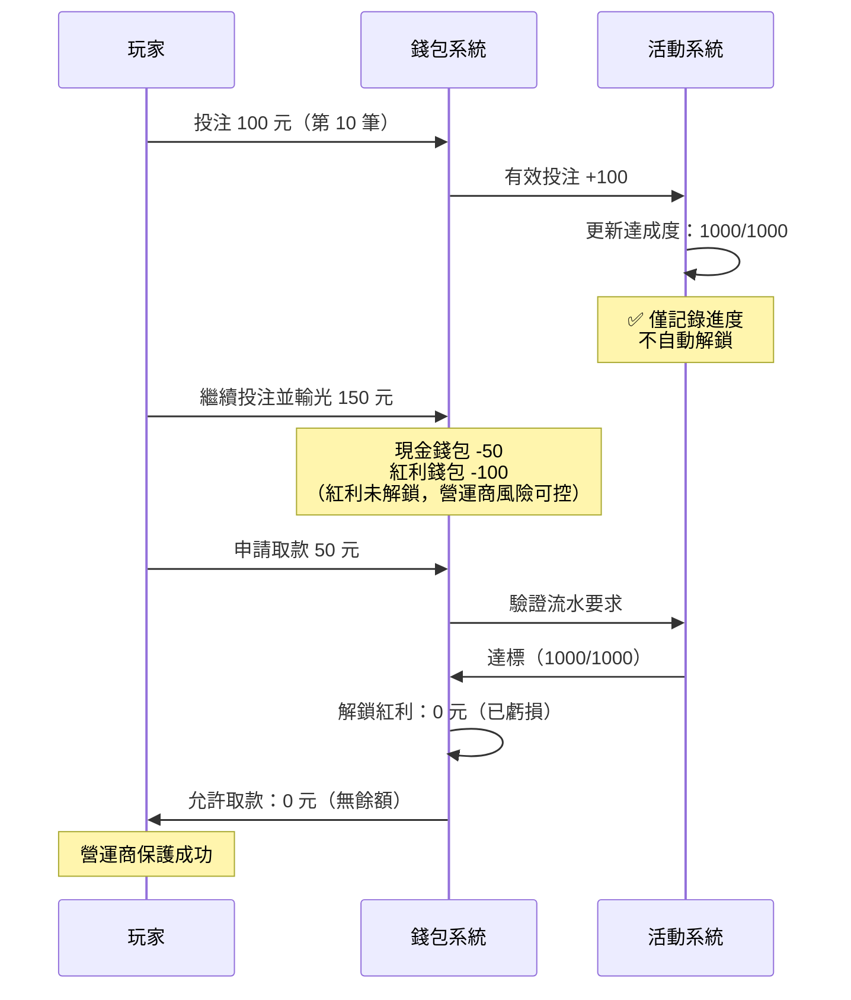
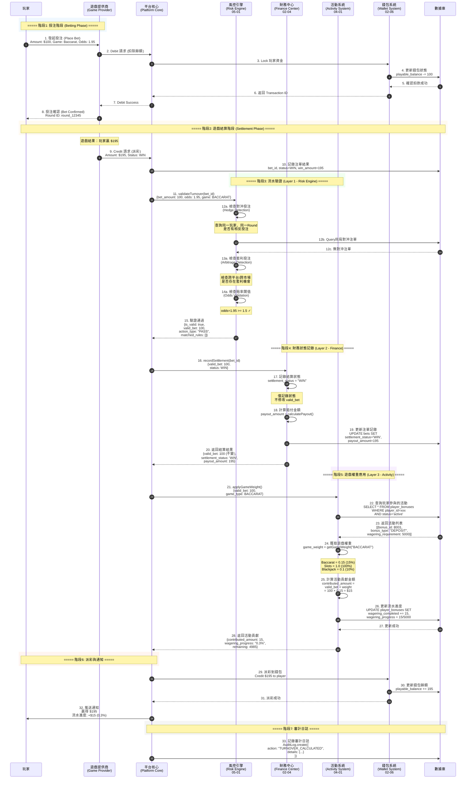
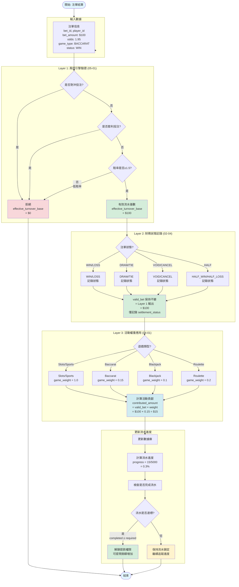
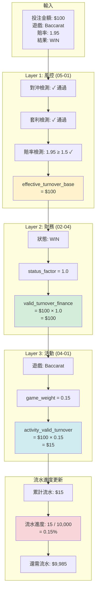

# 03-04-04 SmartAdmin 架構映射 (SmartAdmin Architecture Mapping)

<!-- SSOT: Authoritative definition of Wagering Requirement Tracking, SmartAdmin Architecture Mapping, Monitoring -->

> **父文檔**: [03-04 流水計算與遊戲對帳](./03-04_Turnover_Calculation.md)
>
> **三層風控架構定位**: 本子文檔定義投注要求追蹤、SmartAdmin 架構映射、完整時序圖與監控告警。
>
> **創建日期**: 2026-02-07
> **最後更新**: 2026-02-07
> **版本**: 4.0.0

---

## 9. 投注要求追蹤 (Wagering Requirement Tracking)

<!-- SSOT: Withdrawal-time validation, NOT auto-unlock on bet -->

### 9.1 核心決策：取款時驗證

**業界標準流程** (Pragmatic Play / Evolution Gaming):



**對比分析** (投注時自動解鎖 vs 取款時驗證):

| 特性 | 投注時自動解鎖 (錯誤) | 取款時驗證 (正確) | 推薦 |
|------|---------------------|-----------------|------|
| **玩家達標後繼續遊戲輸光** | 紅利已解鎖，營運商損失 ❌ | 紅利未解鎖，風險可控 ✅ | ✅ 取款時驗證 |
| **玩家體驗** | 無感知 (隱藏風險) | 取款時明確告知 (透明) | ✅ 取款時驗證 |
| **風控能力** | 低 (無法保護紅利) ❌ | 高 (達標才解鎖) ✅ | ✅ 取款時驗證 |
| **業界標準** | ❌ 不符合 | ✅ 符合 | ✅ 取款時驗證 |
| **實施複雜度** | 中 (需處理自動解鎖邏輯) | 中 (取款驗證邏輯) | 相當 |
| **系統開銷** | 中 (每次達標觸發解鎖) | 低 (僅取款時驗證) | ✅ 取款時驗證 |

### 9.2 流水累積實現方案

**推薦方案: 混合架構（實時累積 + Flink 對帳校驗）**

```yaml
投注時:
  1. 實時計算有效投注額
  2. 寫入 Redis（毫秒級，玩家可即時查詢）
  3. 異步批次寫入 DB（每 10 秒或每 1000 筆）

取款時:
  1. 直接讀取 wagering_progress 表驗證（毫秒級）
  2. 達標則允許取款

後台對帳（Flink）:
  1. 每小時/每日跑 Flink Job
  2. 重新計算流水進度
  3. 與 wagering_progress 表對比
  4. 發現差異則告警 + 自動修正

規則調整:
  1. 使用回推機制重算歷史（異步任務）
  2. 不影響當前玩家體驗
```

**方案對比**:

| 方案 | 用戶體驗 | 取款速度 | 系統複雜度 | 寫入壓力 | 規則調整 | **推薦度** |
|------|---------|---------|-----------|---------|---------|-----------|
| **實時累積** | ⭐⭐⭐⭐⭐ | ⭐⭐⭐⭐⭐ | ⭐⭐⭐ | ⭐⭐ | ⭐⭐⭐ | ✅ **推薦** |
| Flink 計算 | ⭐ | ⭐⭐ | ⭐⭐ | ⭐⭐⭐⭐⭐ | ⭐⭐⭐⭐⭐ | ❌ 不推薦 |
| **混合架構** | ⭐⭐⭐⭐⭐ | ⭐⭐⭐⭐⭐ | ⭐⭐⭐⭐ | ⭐⭐⭐⭐ | ⭐⭐⭐⭐ | ✅ **最佳** |

### 9.3 回推機制實現

<!-- SSOT: Recalculation mechanism for rule changes -->

**必須記錄的元數據** (P0 - MVP):

**數據庫設計**:

```sql
-- wagering_details 表（有效投注明細）
CREATE TABLE wagering_details (
  id BIGINT PRIMARY KEY AUTO_INCREMENT,
  bet_id VARCHAR(64) NOT NULL UNIQUE,
  player_id BIGINT NOT NULL,
  promotion_id BIGINT,

  -- 原始數據（不可變）
  bet_amount DECIMAL(19,4) NOT NULL,
  game_type VARCHAR(32) NOT NULL,
  odds DECIMAL(10,4),
  status VARCHAR(32) NOT NULL,

  -- 計算結果（可重算）
  valid_bet DECIMAL(19,4) NOT NULL,
  game_weight DECIMAL(5,4) NOT NULL,
  contributed_amount DECIMAL(19,4) NOT NULL,

  -- 回推支持
  calculation_version VARCHAR(16) NOT NULL DEFAULT 'v1.0.0',

  -- 審計字段
  created_at TIMESTAMP DEFAULT CURRENT_TIMESTAMP,
  updated_at TIMESTAMP DEFAULT CURRENT_TIMESTAMP ON UPDATE CURRENT_TIMESTAMP,

  INDEX idx_player_promotion (player_id, promotion_id),
  INDEX idx_calculation_version (calculation_version)
);

-- wagering_progress 表（流水要求進度聚合視圖）
CREATE TABLE wagering_progress (
  id BIGINT PRIMARY KEY AUTO_INCREMENT,
  player_id BIGINT NOT NULL,
  promotion_id BIGINT NOT NULL,

  total_requirement DECIMAL(19,4) NOT NULL,
  completed_amount DECIMAL(19,4) NOT NULL DEFAULT 0,
  remaining_amount DECIMAL(19,4) AS (total_requirement - completed_amount) STORED,

  is_completed BOOLEAN AS (completed_amount >= total_requirement) STORED,

  updated_at TIMESTAMP DEFAULT CURRENT_TIMESTAMP ON UPDATE CURRENT_TIMESTAMP,

  UNIQUE KEY uk_player_promotion (player_id, promotion_id)
);

-- recalculation_audit 表（回推審計日誌）
CREATE TABLE recalculation_audit (
  id BIGINT PRIMARY KEY AUTO_INCREMENT,

  player_id BIGINT,
  promotion_id BIGINT,
  start_time TIMESTAMP NOT NULL,
  end_time TIMESTAMP NOT NULL,

  old_rule_version VARCHAR(16) NOT NULL,
  new_rule_version VARCHAR(16) NOT NULL,

  total_affected INT NOT NULL,
  total_changed INT NOT NULL,

  old_total_contributed DECIMAL(19,4),
  new_total_contributed DECIMAL(19,4),
  total_difference DECIMAL(19,4),

  triggered_by VARCHAR(64) NOT NULL,
  created_at TIMESTAMP DEFAULT CURRENT_TIMESTAMP
);
```

**回推重算實現**:

```typescript
/**
 * 回推重算服務
 * 實施優先級: P1 - 強烈推薦
 */
async function recalculateWagering(params: {
  playerId: number;
  promotionId: number;
  startTime: Date;
  endTime: Date;
  newRuleVersion: string;
}): Promise<RecalculationResult> {

  // Step 1: 查詢需要重算的明細記錄
  const details = await db.selectFrom('wagering_details')
    .where('player_id', '=', params.playerId)
    .where('promotion_id', '=', params.promotionId)
    .where('created_at', '>=', params.startTime)
    .where('created_at', '<=', params.endTime)
    .where('calculation_version', '!=', params.newRuleVersion)
    .execute();

  let totalAffected = details.length;
  let totalChanged = 0;
  let oldTotal = 0;
  let newTotal = 0;

  // Step 2: 逐筆重新計算
  for (const detail of details) {
    // 載入原始數據
    const betAmount = detail.bet_amount;
    const gameType = detail.game_type;
    const status = detail.status;

    // 應用新版本規則
    const newGameWeight = getGameWeight(gameType, params.newRuleVersion);
    const newValidBet = calculateValidBet(betAmount, status, params.newRuleVersion);
    const newContributed = newValidBet * newGameWeight;

    // 檢查是否有變更
    if (newContributed !== detail.contributed_amount) {
      totalChanged++;
      oldTotal += detail.contributed_amount;
      newTotal += newContributed;

      // Step 3: 更新記錄
      await db.updateTable('wagering_details')
        .set({
          valid_bet: newValidBet,
          game_weight: newGameWeight,
          contributed_amount: newContributed,
          calculation_version: params.newRuleVersion,
          updated_at: new Date()
        })
        .where('id', '=', detail.id)
        .execute();
    }
  }

  // Step 4: 更新流水進度
  const totalDifference = newTotal - oldTotal;
  await db.updateTable('wagering_progress')
    .set({
      completed_amount: db.raw('completed_amount + ?', [totalDifference])
    })
    .where('player_id', '=', params.playerId)
    .where('promotion_id', '=', params.promotionId)
    .execute();

  // Step 5: 記錄審計日誌
  await db.insertInto('recalculation_audit')
    .values({
      player_id: params.playerId,
      promotion_id: params.promotionId,
      start_time: params.startTime,
      end_time: params.endTime,
      old_rule_version: 'v1.0.0', // 從第一筆記錄取得
      new_rule_version: params.newRuleVersion,
      total_affected: totalAffected,
      total_changed: totalChanged,
      old_total_contributed: oldTotal,
      new_total_contributed: newTotal,
      total_difference: totalDifference,
      triggered_by: 'admin_recalculation'
    })
    .execute();

  return {
    totalAffected,
    totalChanged,
    oldTotalContributed: oldTotal,
    newTotalContributed: newTotal,
    totalDifference
  };
}
```

**實施優先級劃分**:

| 優先級 | 功能組件 | 說明 | 必要性 |
|-------|---------|------|--------|
| **P0 - 必須實現 (MVP)** | wagering_details 表設計 | 記錄原始數據+計算結果，支持審計追溯 | ✅ Critical |
| **P0 - 必須實現 (MVP)** | calculation_version 字段 | 標記計算邏輯版本號，識別需要重算的記錄 | ✅ Critical |
| **P1 - 強烈推薦** | RecalculationService | 回推重算服務，支持規則調整後重新計算 | ⭐ High |
| **P1 - 強烈推薦** | recalculation_audit 表 | 審計日誌，記錄每次回推操作的完整記錄 | ⭐ High |
| **P2 - 可選** | 自動回推任務 | 規則變更時自動觸發回推（需審批流） | 🟡 Medium |
| **P2 - 可選** | 回推結果可視化 | 後台管理界面展示回推結果與差異報告 | 🟡 Medium |

---

## 10. SmartAdmin 架構映射 (Architecture Mapping)

### 10.1 流水計算模組分層設計

SmartAdmin 採用嚴格的五層架構，確保代碼職責清晰、易於測試與維護。

**分層職責表**:

| 層級 | 類名模式 | 職責 | 註解限制 |
|------|---------|------|---------|
| **Controller** | `TurnoverController` | 接收 HTTP 請求，參數校驗，返回 ResponseDTO | 無 @Transactional |
| **Service** | `TurnoverService` | 業務協調，調用 Manager/Dao，返回 Option/Try | 無 @Transactional |
| **Manager** | `TurnoverCalculationManager` | 事務管理，跨表操作，緩存控制 | ✅ @Transactional 僅此層 |
| **Dao** | `BetTurnoverRecordDao` | 數據庫 CRUD，MyBatis Mapper | 無業務邏輯 |
| **Entity** | `BetTurnoverRecordEntity` | 數據模型，與表結構一一對應 | 無業務邏輯 |

**依賴規則** (ArchitectureTest 強制):

```text
Controller → Service (✅ 允許)
Service → Dao      (✅ 允許，單表 CRUD)
Service → Manager  (✅ 允許，需要 @Transactional 時)
Manager → Dao      (✅ 允許)

Controller → Dao   (❌ 禁止，違反分層)
Controller → Manager (❌ 禁止，違反分層)
```

### 10.2 實體層 (Entity Layer)

**BetTurnoverRecordEntity.java**:

```java
@Data
@TableName("t_bet_turnover_record")
public class BetTurnoverRecordEntity extends SmartBaseEntity {

    @TableId(type = IdType.AUTO)
    private Long id;

    /** 注單ID */
    private String betId;

    /** 玩家ID */
    private Long playerId;

    /** 遊戲類型 */
    private String gameType;

    // ========== Layer 1 結果 (v2.1.0 更新) ==========
    /** 有效投注基數 (Layer 1 風控引擎輸出) */
    private BigDecimal effectiveTurnoverBase;

    /** 風控動作類型: BLOCK/FLAG/PASS (v2.1.0) */
    private String actionType;

    /** 匹配的規則列表 (v2.1.0) */
    private String matchedRules; // JSON array

    /** 風控提案ID (v2.1.0) */
    private String riskProposalId;

    // ========== Layer 2 結果 ==========
    /** 注單狀態 */
    private String status;

    /** 狀態因子 */
    private BigDecimal statusFactor;

    /** 財務有效流水 (Layer 2 輸出) */
    private BigDecimal validTurnoverFinance;

    // ========== Layer 3 結果 ==========
    /** 活動有效流水 (Layer 3 輸出，若有活動) */
    private BigDecimal activityValidTurnover;

    /** 遊戲權重 */
    private BigDecimal gameWeight;

    // ========== 審計字段 ==========
    /** 計算時間 */
    private LocalDateTime calculatedAt;

    /** 三層計算明細 (JSON) */
    private String layerBreakdown;
}
```

### 10.3 DAO 層 (Data Access Layer)

**BetTurnoverRecordDao.java**:

```java
@Mapper
public interface BetTurnoverRecordDao extends BaseMapper<BetTurnoverRecordEntity> {

    /**
     * 根據玩家ID與日期查詢流水記錄
     */
    List<BetTurnoverRecordEntity> selectByPlayerIdAndDate(
        @Param("playerId") Long playerId,
        @Param("date") LocalDate date
    );

    /**
     * 根據注單ID查詢流水記錄
     */
    BetTurnoverRecordEntity selectByBetId(@Param("betId") String betId);

    /**
     * 批次插入流水記錄
     */
    int batchInsert(@Param("list") List<BetTurnoverRecordEntity> list);
}
```

**BetTurnoverRecordDao.xml** (MyBatis Mapper):

```xml
<?xml version="1.0" encoding="UTF-8"?>
<!DOCTYPE mapper PUBLIC "-//mybatis.org//DTD Mapper 3.0//EN"
        "http://mybatis.org/dtd/mybatis-3-mapper.dtd">
<mapper namespace="net.lab1024.sa.business.module.finance.turnover.dao.BetTurnoverRecordDao">

    <!-- 根據玩家ID與日期查詢流水記錄 -->
    <select id="selectByPlayerIdAndDate" resultType="net.lab1024.sa.business.module.finance.turnover.domain.entity.BetTurnoverRecordEntity">
        SELECT *
        FROM t_bet_turnover_record
        WHERE player_id = #{playerId}
          AND DATE(calculated_at) = #{date}
          AND deleted = 0
        ORDER BY calculated_at DESC
    </select>

    <!-- 根據注單ID查詢流水記錄 -->
    <select id="selectByBetId" resultType="net.lab1024.sa.business.module.finance.turnover.domain.entity.BetTurnoverRecordEntity">
        SELECT *
        FROM t_bet_turnover_record
        WHERE bet_id = #{betId}
          AND deleted = 0
        LIMIT 1
    </select>
</mapper>
```

### 10.4 Manager 層 (Transaction Management Layer)

**TurnoverCalculationManager.java**:

```java
@Service
@RequiredArgsConstructor
public class TurnoverCalculationManager {

    private final BetTurnoverRecordDao betTurnoverRecordDao;
    private final RedissonClient redissonClient;
    private final KafkaTemplate<String, String> kafkaTemplate;

    /**
     * 計算並記錄流水（帶事務）
     * v2.1.0: 支援配置驅動風控 (BLOCK/FLAG/PASS)
     */
    @Transactional(rollbackFor = Throwable.class)
    public BetTurnoverRecordEntity calculateAndRecord(
        String betId,
        Long playerId,
        String gameType,
        BigDecimal betAmount,
        String status,
        BigDecimal odds
    ) {
        // Step 1: 分佈式鎖防止重複計算
        RLock lock = redissonClient.getLock("turnover:calc:" + betId);
        if (!lock.tryLock()) {
            throw new BusinessException("重複計算流水");
        }

        try {
            // Step 2: 調用 Layer 1 風控引擎
            RiskValidationResult riskResult = riskEngineClient.validateTurnover(
                betId, playerId, gameType, betAmount, odds
            );

            // Step 2.1: BLOCK規則直接短路返回
            if (!riskResult.isValid() && "BLOCK".equals(riskResult.getActionType())) {
                return createBlockedRecord(betId, playerId, riskResult);
            }

            // Step 2.2: FLAG規則記錄風控標記
            if ("FLAG".equals(riskResult.getActionType())) {
                recordRiskFlag(betId, riskResult.getRiskProposalId());
            }

            // Step 3: Layer 2 財務狀態因子
            BigDecimal statusFactor = getStatusFactor(status);
            BigDecimal validTurnoverFinance = riskResult.getEffectiveTurnoverBase()
                .multiply(statusFactor);

            // Step 4: Layer 3 活動權重（若有活動）
            BigDecimal gameWeight = getGameWeight(gameType);
            BigDecimal activityValidTurnover = validTurnoverFinance.multiply(gameWeight);

            // Step 5: 記錄流水（三層結果）
            BetTurnoverRecordEntity record = new BetTurnoverRecordEntity();
            record.setBetId(betId);
            record.setPlayerId(playerId);
            record.setGameType(gameType);

            // Layer 1 結果
            record.setEffectiveTurnoverBase(riskResult.getEffectiveTurnoverBase());
            record.setActionType(riskResult.getActionType());
            record.setMatchedRules(JSON.toJSONString(riskResult.getMatchedRules()));
            record.setRiskProposalId(riskResult.getRiskProposalId());

            // Layer 2 結果
            record.setStatus(status);
            record.setStatusFactor(statusFactor);
            record.setValidTurnoverFinance(validTurnoverFinance);

            // Layer 3 結果
            record.setGameWeight(gameWeight);
            record.setActivityValidTurnover(activityValidTurnover);

            record.setCalculatedAt(LocalDateTime.now());

            // 插入數據庫
            betTurnoverRecordDao.insert(record);

            // Step 6: 發布事件至 Kafka
            kafkaTemplate.send("finance.turnover.calculated", betId, JSON.toJSONString(record));

            return record;

        } finally {
            lock.unlock();
        }
    }

    /**
     * 查詢流水記錄（帶緩存）
     */
    @Cacheable(value = "turnover", key = "#betId")
    public Option<BetTurnoverRecordEntity> getTurnoverByBetId(String betId) {
        return Option.of(betTurnoverRecordDao.selectByBetId(betId));
    }
}
```

### 10.5 Service 層 (Business Logic Layer)

**TurnoverService.java**:

```java
@Service
@RequiredArgsConstructor
public class TurnoverService {

    private final TurnoverCalculationManager turnoverCalculationManager;
    private final BetTurnoverRecordDao betTurnoverRecordDao;

    /**
     * 計算流水（業務協調）
     */
    public Option<BetTurnoverRecordEntity> calculateTurnover(
        String betId,
        Long playerId,
        String gameType,
        BigDecimal betAmount,
        String status,
        BigDecimal odds
    ) {
        // 參數校驗
        if (StringUtils.isBlank(betId)) {
            return Option.none();
        }

        // 檢查是否已計算
        Option<BetTurnoverRecordEntity> existing =
            turnoverCalculationManager.getTurnoverByBetId(betId);
        if (existing.isDefined()) {
            return existing;
        }

        // 調用 Manager 計算
        try {
            BetTurnoverRecordEntity record = turnoverCalculationManager.calculateAndRecord(
                betId, playerId, gameType, betAmount, status, odds
            );
            return Option.of(record);
        } catch (Exception e) {
            log.error("計算流水失敗: betId={}", betId, e);
            return Option.none();
        }
    }

    /**
     * 查詢玩家流水記錄
     */
    public List<BetTurnoverRecordEntity> getPlayerTurnover(Long playerId, LocalDate date) {
        return betTurnoverRecordDao.selectByPlayerIdAndDate(playerId, date);
    }
}
```

### 10.6 Controller 層 (HTTP Interface Layer)

**TurnoverController.java**:

```java
@RestController
@Api(tags = "流水計算")
@RequiredArgsConstructor
public class TurnoverController {

    private final TurnoverService turnoverService;

    /**
     * 查詢玩家流水記錄
     */
    @GetMapping("/api/turnover/player/{playerId}")
    @ApiOperation("查詢玩家流水")
    public ResponseDTO<List<BetTurnoverRecordEntity>> getPlayerTurnover(
        @PathVariable Long playerId,
        @RequestParam @DateTimeFormat(pattern = "yyyy-MM-dd") LocalDate date
    ) {
        List<BetTurnoverRecordEntity> records =
            turnoverService.getPlayerTurnover(playerId, date);
        return ResponseDTO.ok(records);
    }

    /**
     * 查詢單筆注單流水
     */
    @GetMapping("/api/turnover/bet/{betId}")
    @ApiOperation("查詢注單流水")
    public ResponseDTO<BetTurnoverRecordEntity> getTurnoverByBet(@PathVariable String betId) {
        Option<BetTurnoverRecordEntity> record =
            turnoverService.calculateTurnover(betId, null, null, null, null, null);

        return record.map(ResponseDTO::ok)
            .getOrElse(() -> ResponseDTO.error(ErrorCodeEnum.DATA_NOT_EXIST));
    }
}
```

### 10.7 Foundation 模組依賴

流水計算模組依賴以下 SmartAdmin Foundation 模組:

| Foundation 模組 | 用途 | 引用位置 |
|----------------|------|---------|
| **foundation.redis-lock** | 分佈式鎖，防止重複計算 | TurnoverCalculationManager |
| **foundation.cache** | Caffeine + Redis 緩存 | TurnoverCalculationManager.getTurnoverByBetId() |
| **foundation.audit-log** | 審計日誌記錄 | 流水計算完成後自動記錄 |
| **foundation.mq** | Kafka 事件發布 | 流水計算完成後發布 finance.turnover.calculated 事件 |
| **foundation.retry** | 失敗重試策略 | Risk Engine 調用失敗時重試 |

**引用示例 (RedisLock)**:

```java
// 使用 Redisson 分佈式鎖
RLock lock = redissonClient.getLock("turnover:calc:" + betId);
try {
    if (lock.tryLock(3, 10, TimeUnit.SECONDS)) {
        // 執行計算邏輯
    } else {
        throw new BusinessException("獲取鎖失敗");
    }
} finally {
    lock.unlock();
}
```

### 10.8 ArchitectureTest 驗證規則

以下 ArchUnit 規則確保流水計算模組符合 SmartAdmin 架構規範:

```java
@AnalyzeClasses(packages = "net.lab1024.sa.business.module.finance.turnover")
public class TurnoverModuleArchitectureTest {

    /**
     * 規則1: Controller 不得直接調用 Dao
     */
    @ArchTest
    static final ArchRule controllers_should_not_access_daos =
        noClasses()
            .that().resideInAPackage("..controller..")
            .should().dependOnClassesThat().resideInAPackage("..dao..");

    /**
     * 規則2: @Transactional 僅允許在 Manager 層
     */
    @ArchTest
    static final ArchRule transactional_only_in_manager =
        methods()
            .that().areAnnotatedWith(Transactional.class)
            .should().beDeclaredInClassesThat().resideInAPackage("..manager..");

    /**
     * 規則3: Service 必須返回 Option/Try（不允許 null）
     */
    @ArchTest
    static final ArchRule service_should_return_option_or_try =
        methods()
            .that().areDeclaredInClassesThat().resideInAPackage("..service..")
            .and().arePublic()
            .should().haveRawReturnType(Option.class).orShould().haveRawReturnType(Try.class);

    /**
     * 規則4: Controller 必須使用 @RequiredArgsConstructor (禁止 @Autowired)
     */
    @ArchTest
    static final ArchRule controller_should_use_constructor_injection =
        noFields()
            .that().areDeclaredInClassesThat().resideInAPackage("..controller..")
            .should().beAnnotatedWith(Autowired.class);
}
```

---

## 11. 完整時序圖與流程圖

### 11.1 流水計算完整時序 (End-to-End Turnover Calculation Sequence)



### 11.2 流水計算主流程 (Main Turnover Calculation Flow)



### 11.3 實際計算範例：百家樂投注

**場景**: 玩家參與「首存100%紅利」活動，需完成 5x 流水要求。

**投注詳情**:
- **存款金額**: $1,000
- **紅利金額**: $1,000 (100% Match)
- **流水要求**: ($1,000 + $1,000) × 5 = **$10,000**
- **當前投注**: 百家樂投注 $100，賠率 1.95，結果 WIN

**計算流程**:



**結論**:
- ✅ 風控驗證通過
- ✅ 財務流水: $100
- ⚠️ 活動流水: $15 (僅15%貢獻)
- ⚠️ 需要更多投注才能完成流水要求

---

## 12. 監控與告警

### 12.1 關鍵監控指標

```yaml
metrics:
  # 流水計算性能
  - name: finance.turnover.calculation.latency_p99
    type: histogram
    description: 流水計算延遲 (P99)
    unit: milliseconds
    target: "< 100ms"
    alert:
      - condition: p99 > 500ms
        severity: critical
        message: "流水計算延遲過高，影響 API 響應"

  # 風控引擎調用成功率
  - name: finance.turnover.risk_engine.call.success_rate
    type: gauge
    description: 風控引擎調用成功率
    calculation: "successful_calls / total_calls"
    target: "> 99.9%"
    alert:
      - condition: rate < 99%
        severity: critical
        message: "風控引擎調用失敗率過高"

  # 每日對帳偏差率
  - name: finance.turnover.daily_reconciliation.deviation_rate
    type: gauge
    description: 每日對帳偏差率
    calculation: "abs(finance_total - activity_total) / finance_total"
    target: "< 0.01%"
    alert:
      - condition: rate > 0.01%
        severity: warning
        message: "每日對帳偏差超過閾值"

  # 事件發布成功率
  - name: finance.turnover.event_publish.success_rate
    type: gauge
    description: Kafka 事件發布成功率
    target: "> 99.99%"
    alert:
      - condition: rate < 99.9%
        severity: critical
        message: "事件發布失敗率過高"

  # 流水要求達成監控
  - name: wagering_progress_rate
    type: gauge
    description: 流水要求達成率（CurrentValidBet / TotalRequirement）
    labels:
      - user_id
      - promotion_id
    alert:
      - condition: rate < 0.1 AND days_to_expire < 1
        severity: warning
        message: "玩家流水進度過慢，活動即將過期"

  # 取款驗證拒絕率
  - name: wagering_verification_rejection_rate
    type: gauge
    description: 取款時流水要求未達標拒絕率
    calculation: "rejected_withdrawals / total_withdrawals"
    target: "監控趨勢"
    alert:
      - condition: rate suddenly increases by > 50%
        severity: critical
        message: "取款拒絕率突然上升，可能規則配置錯誤"
```

### 12.2 警報規則

```yaml
alerts:
  - name: turnover_calculation_latency_high
    condition: finance.turnover.calculation.latency_p99 > 500ms
    severity: WARNING
    notify: slack:#finance-ops

  - name: risk_engine_call_failure
    condition: finance.turnover.risk_engine.call.success_rate < 99%
    severity: CRITICAL
    notify: pagerduty:finance-oncall

  - name: daily_reconciliation_deviation
    condition: finance.turnover.daily_reconciliation.deviation_rate > 0.01
    severity: WARNING
    notify: slack:#finance-ops, email:finance-team@company.com

  - name: event_publish_failure
    condition: finance.turnover.event_publish.success_rate < 99.9
    severity: CRITICAL
    notify: pagerduty:finance-oncall

  - name: wagering_progress_slow
    condition: wagering_progress_rate < 0.1 AND days_to_expire < 1
    severity: INFO
    notify: slack:#promotion-ops
```

---

## 13. 變更日誌 (Change Log)

### v2.1.0 (2026-02-02)

**重大變更**:
1. ✅ **Major #5**: 更新 Layer 1 處理流程以支援配置驅動風控
   - 新增 action_type (BLOCK/FLAG/PASS) 支援
   - BLOCK 規則實時阻斷（返回流水 = 0）
   - FLAG 規則標記但允許（正常計算流水 + 生成風控提案）
   - 更新返回結構：`matched_rules[]` 取代 `risk_code`
   - 新增 `risk_proposal_id` 欄位用於追蹤風控提案

2. ✅ **Integration**: 與 05-01 風控系統 v2.1.0 配置驅動架構集成
   - 支援 t_risk_rule_config 配置表驅動規則
   - 支援多維度風控規則（遊戲類型、個別遊戲、個別玩家）

**資料模型變更**:
- `bet_turnover_record` 表新增欄位：
  - `action_type VARCHAR(20)` - 風控動作類型
  - `matched_rules JSON` - 匹配的規則列表
  - `risk_proposal_id VARCHAR(50)` - 風控提案 ID

**向下相容**:
- Layer 2/3 處理流程保持不變
- 僅 Layer 1 API 變更（內部實現）

### v2.0.0 (2026-01-29)

**重大變更**:
1. ✅ **Major #4 修正**: 澄清三層驗證架構職責
   - Layer 1 拒絕後直接短路返回，不進入 Layer 2/3
   - 明確職責矩陣: Layer 1 = 拒絕決策, Layer 2 = 狀態調整, Layer 3 = 權重應用
   - 性能優化: 節省 ~5% CPU 與 DB 查詢

2. ✅ **Major #3 修正**: 新增 SmartAdmin 架構映射
   - 完整五層架構代碼示例 (Entity/Dao/Manager/Service/Controller)
   - Foundation 模組依賴說明 (redis-lock, cache, audit-log, mq, retry)
   - ArchitectureTest 驗證規則

3. ✅ **Major #2 修正**: 免費旋轉流水計算標準化
   - Turnover = 面額總和（符合業界標準）
   - Valid Bet = 0（不計入流水要求）

4. ✅ **Major #1 修正**: 取款時驗證流水要求
   - 投注時僅累積進度，不自動解鎖
   - 取款時驗證達標才解鎖紅利

**向下兼容**:
- v1.x API 保持不變，僅內部實現優化

### v1.0.0 (2026-01-28)

**初始版本**:
- 流水計算邏輯 (§1-6)
- 遊戲對帳邏輯 (§8)
- 流程圖與數據流向圖 (§11)
- HALF_WIN/HALF_LOSS = 100% 流水 (標準本金法)

---

## 相關文檔

### 子文檔導航
- **上一篇**: [03-04-03 對帳模型](./03-04-03_Reconciliation_Model.md) - 有效投注計算 + 免費旋轉流水 + 遊戲對帳
- [03-04-01 流水計算核心邏輯](./03-04-01_Turnover_Core_Logic.md) - 系統概述 + Layer 1 風控驗證
- [03-04-02 三層驗證架構](./03-04-02_Three_Layer_Validation.md) - Layer 2 財務狀態 + Layer 3 活動權重

### 外部依賴
- [01-02 錢包架構](../02_Finance_Center/02-06_Wallet_Architecture.md) - 統一錢包模型、可下注餘額公式、扣款優先級
- [SmartAdmin 架構規則](/.agent/rules/foundation/F04-architecture-rules.md) - 分層架構強制規則

---

**文檔版本**: 4.0.0
**最後更新**: 2026-02-07
**維護團隊**: Finance Team & Backend Team & Risk Team
**重大變更**: v2.1.0 Layer 1 支援配置驅動風控（BLOCK/FLAG/PASS），與 05-01 風控系統 v2.1.0 集成
