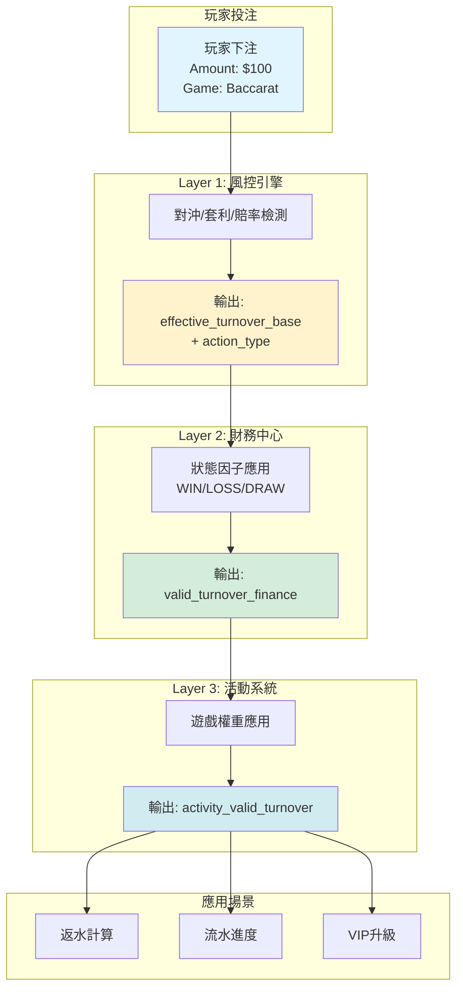

# 03-04 流水計算與遊戲對帳 (Turnover Calculation & Game Reconciliation)

<!-- SSOT: Authoritative definition of Turnover Calculation, Valid Bet Logic, Three-Layer Validation, Reconciliation Model -->

> **三層風控架構定位**: 本模塊定義完整的流水計算邏輯，包含風控驗證(Layer 1)、財務狀態記錄(Layer 2)、活動權重應用(Layer 3)。
>
> **重要更新 (v2.1.0 - 2026-02-02)**:
> - ✅ 支援配置驅動風控 (BLOCK/FLAG/PASS action_type)
> - ✅ 免費旋轉 Turnover 計算標準化 (面額總和)
> - ✅ HALF_WIN/HALF_LOSS 採用標準本金法 (100% 流水)
> - ✅ 取款時驗證流水要求 (非投注時自動解鎖)
>
> **創建日期**: 2026-01-27
> **最後更新**: 2026-02-07
> **版本**: 4.0.0

---

## 文檔結構

本文檔已拆分為以下 4 個子文檔，以提升可讀性與維護性：

| 子文檔 | 內容 | 行數 |
|--------|------|------|
| [03-04-01 流水計算核心邏輯](./03-04-01_Turnover_Core_Logic.md) | 系統概述、三層架構總覽、Layer 1 風控驗證 | ~250 |
| [03-04-02 三層驗證架構](./03-04-02_Three_Layer_Validation.md) | Layer 2 財務狀態記錄、Layer 3 活動權重應用 | ~280 |
| [03-04-03 對帳模型](./03-04-03_Reconciliation_Model.md) | 有效投注計算、免費旋轉流水、跨模組一致性、遊戲對帳 | ~450 |
| [03-04-04 SmartAdmin 架構映射](./03-04-04_SmartAdmin_Mapping.md) | 投注要求追蹤、架構映射、時序圖、監控告警 | ~750 |

---

## 快速參考

### 核心公式

```
ValidTurnover = BetAmount × GameWeight × OddsFactor × StatusFactor × RiskFactor
```

其中：
- **RiskFactor**: `1` (Pass) 或 `0` (Reject/Flag) - Layer 1 決定
- **StatusFactor**: `1.0` (WIN/LOSS) 或 `0` (DRAW/VOID) - Layer 2 決定
- **GameWeight**: `1.0` (Slots) 至 `0.05` (Poker) - Layer 3 應用

### 三層驗證架構職責

| 層級 | 模塊 | 職責 | 輸出 |
|------|------|------|------|
| **Layer 1** | 風控引擎 (05-01) | 拒絕決策 (BLOCK/FLAG/PASS) | `effective_turnover_base` |
| **Layer 2** | 財務中心 (02-04) | 狀態因子調整 | `valid_turnover_finance` |
| **Layer 3** | 活動系統 (04-01) | 遊戲權重應用 | `activity_valid_turnover` |

**關鍵原則**: Layer 1 是唯一負責拒絕決策的層級，Layer 2/3 僅做數值調整。

### 狀態因子速查表

| 狀態 | 因子 | 備註 |
|------|------|------|
| WIN / LOSS | 1.0 | 正常計算 |
| HALF_WIN / HALF_LOSS | 1.0 | 標準本金法 (v2.0.0) |
| DRAW / TIE | 0.0 | 無風險，不計流水 |
| VOID / CANCEL | 0.0 | 注單無效 |
| RUNNING | 0.0 | 未結算不計 |

### 遊戲權重速查表

| 遊戲類型 | 權重 | 說明 |
|----------|------|------|
| Slots / Sports | 100% | 高風險/純機率 |
| Roulette | 20% | 中等風險 |
| Baccarat / Live Casino | 15% | RTP高，平台風險低 |
| Blackjack | 10% | 技巧性遊戲 |
| Poker / Video Poker | 5% | 技巧性遊戲 |
| PVP | 0% | 玩家間轉移，不計 |

---

## 架構總覽圖



---

## 關鍵決策摘要

### 1. HALF_WIN/HALF_LOSS 採用標準本金法

**決策**: 計入 100% 流水（不是 50%）

**理由**: 相同投注行為應有相同流水貢獻，與風控鎖定邏輯一致

**詳見**: [03-04-02 § 3.2](./03-04-02_Three_Layer_Validation.md#32-狀態判定-status-factor)

### 2. 免費旋轉流水計算

**決策**: Turnover = 面額總和, Valid Bet = 0

**理由**: 符合業界標準 (Evolution Gaming, Pragmatic Play)，正確反映促銷成本

**詳見**: [03-04-03 § 6](./03-04-03_Reconciliation_Model.md#6-免費旋轉流水計算-free-spins-turnover-calculation)

### 3. 取款時驗證流水要求

**決策**: 投注時僅累積進度，取款時才驗證達標

**理由**: 保護營運商風險，玩家達標後繼續遊戲輸光時紅利未解鎖

**詳見**: [03-04-04 § 9.1](./03-04-04_SmartAdmin_Mapping.md#91-核心決策取款時驗證)

### 4. Layer 1 配置驅動風控 (v2.1.0)

**決策**: 支援 BLOCK/FLAG/PASS 三種 action_type

| Action | 說明 | valid_bet | 風控提案 |
|--------|------|-----------|---------|
| BLOCK | 實時阻斷 | 0 | 不生成 |
| FLAG | 標記但允許 | bet_amount | ✅ 生成 |
| PASS | 正常通過 | bet_amount | 不生成 |

**詳見**: [03-04-01 § 2.2](./03-04-01_Turnover_Core_Logic.md#22-配置驅動風控-v210)

---

## 術語定義

| 中文 | 英文 | 定義 | 單位 |
|------|------|------|------|
| **投注額** | Bet Amount | 單筆原始投注金額 | 單筆 |
| **流水** | Turnover | 投注額的時間累積總和 | 累積 |
| **有效投注額** | Valid Bet | 經風控過濾的單筆金額 | 單筆 |
| **流水要求** | Wagering Requirement | 必須達成的有效投注總額 | 累積 |

**完整術語**: [00-03 術語標準化](../00_Foundation/concepts/00-03_Terminology_Standards.md)

---

## 監控 SLA

| 指標 | 目標 | 告警閾值 |
|------|------|---------|
| 流水計算延遲 (P99) | < 100ms | > 500ms |
| 風控引擎調用成功率 | > 99.9% | < 99% |
| 每日對帳偏差率 | < 0.01% | > 0.01% |
| 事件發布成功率 | > 99.99% | < 99.9% |

**詳細監控配置**: [03-04-04 § 12](./03-04-04_SmartAdmin_Mapping.md#12-監控與告警)

---

## 相關文檔

### 前置依賴
- [00-03 術語標準化](../00_Foundation/concepts/00-03_Terminology_Standards.md) - **必讀**
- [02-06 錢包架構](../02_Finance_Center/02-06_Wallet_Architecture.md) - 統一錢包模型

### 核心依賴
- [05-01 風控系統](../05_Risk_Control/05-01_Risk_Framework.md) - Layer 1 風控引擎
- [04-04 活動紅利](../04_Activity_Center/04-04_Activity_Bonus.md) - Layer 3 活動系統

### 延伸閱讀
- [03-03 無縫錢包分析](../03_Game_Center/03-03_Seamless_Wallet_Analysis.md) - GP API 規範
- [02-03 對帳系統](../02_Finance_Center/02-03_Reconciliation_System.md) - 財務對帳

---

## 變更日誌

### v4.0.0 (2026-02-07)

**文檔重構**:
- ✅ 拆分為 4 個子文檔，提升可讀性
- ✅ 原文檔轉為索引頁 (~250 行)

### v2.1.0 (2026-02-02)

- Layer 1 支援配置驅動風控 (BLOCK/FLAG/PASS)
- 與 05-01 風控系統 v2.1.0 集成

### v2.0.0 (2026-01-29)

- HALF_WIN/HALF_LOSS 採用標準本金法
- 免費旋轉流水計算標準化
- 取款時驗證流水要求
- 新增 SmartAdmin 架構映射

### v1.0.0 (2026-01-28)

- 初始版本

---

**文檔版本**: 4.0.0
**最後更新**: 2026-02-07
**維護團隊**: Finance Team & Backend Team & Risk Team
