# 03-02 VIP 忠誠度系統 (VIP & Loyalty System)

## 1. 系統概述 (Overview)
旨在透過獎勵機制提升玩家留存率 (Retention) 與終身價值 (LTV)。系統需具備高度靈活性，允許不同商戶自定義其 VIP 層級規則與權益。

## 2. 核心功能需求

### 2.1 層級與升降級 (Levels & Promotion)
- **層級設定**：
  - 支援無限制層級 (如 Bronze, Silver, Gold, Platinum, Diamond)
  - 每個層級需設定個別 Icon 與樣式
- **升級條件 (動態配置)**：
  - 累積存款 (Total Deposit)
  - 累積流水 (Total Turnover) —— 需排除無效投注
  - 積分 (Loyalty Points)
- **保級與降級 (Retention & Demotion)**：
  - 設定 "保級週期" (如每月) 與 "保級條件"
  - 若未達標，自動降級或扣除積分

#### 2.1.1 VIP 等級轉換狀態機 (VIP Tier State Machine)

**概述**：VIP 等級系統採用狀態機模式，確保升降級邏輯清晰、可追溯，並提供降級保護機制。

```mermaid
%%{
  init: {
    'theme': 'base',
    'themeVariables': {
      'primaryColor': '#1f1f1f',
      'primaryTextColor': '#f5f5f5',
      'stateBorderColor': '#ffffff',
      'transitionColor': '#a9a9a9',
      'stateBg': '#2d2d2d',
      'errorBkgColor': '#4a1919',
      'errorTextColor': '#ff6b6b'
    }
  }
}%%
stateDiagram-v2
    [*] --> Bronze : 新玩家註冊

    %% === 主要等級狀態 ===
    state "Bronze (基礎等級)" as Bronze
    state "Silver (Dep: $5K+ / TO: $30K+)" as Silver
    state "Gold (Dep: $20K+ / TO: $150K+)" as Gold
    state "Platinum (Dep: $100K+ / TO: $1M+)" as Platinum
    state "Diamond (Dep: $500K+ / TO: $5M+)" as Diamond

    %% === 升級路徑 ===
    Bronze --> Silver : 升級 (累積存款 >= $5K)
    Silver --> Gold : 升級 (累積存款 >= $20K)
    Gold --> Platinum : 升級 (累積存款 >= $100K)
    Platinum --> Diamond : 升級 (累積存款 >= $500K)

    %% === 保級邏輯 ===
    Bronze --> Bronze : 永久保持
    Silver --> Silver : 保級 (上月 Dep $500 OR TO $5K)
    Gold --> Gold : 保級 (上月 Dep $1K OR TO $10K)
    Platinum --> Platinum : 保級 (上月 Dep $5K OR TO $50K)
    Diamond --> Diamond : 保級 (上月 Dep $10K OR TO $100K)

    %% === 降級保護機制 (Warning States) ===
    state "Silver Warning (未達標 x1)" as S_Warn
    state "Gold Warning (未達標 x1)" as G_Warn
    state "Platinum Warning (未達標 x1)" as P_Warn
    state "Diamond Warning (未達標 x1)" as D_Warn

    Silver --> S_Warn : 未達保級條件
    S_Warn --> Silver : 達標
    S_Warn --> Bronze : 連續未達標 x2 (降級補償 $10)

    Gold --> G_Warn : 未達保級條件
    G_Warn --> Gold : 達標
    G_Warn --> Silver : 連續未達標 x2 (降級補償 $50)

    Platinum --> P_Warn : 未達保級條件
    P_Warn --> Platinum : 達標
    P_Warn --> Gold : 連續未達標 x2 (降級補償 $200)

    Diamond --> D_Warn : 未達保級條件
    D_Warn --> Diamond : 達標
    D_Warn --> Platinum : 連續未達標 x2 (保留 50% 權益)

    %% === 風控凍結狀態 ===
    state "Frozen (風控凍結)" as Frozen
    state "Permanent Ban (永久封禁)" as PermBan

    Bronze --> Frozen : 風控系統標記
    Silver --> Frozen : 風控系統標記
    Gold --> Frozen : 風控系統標記
    Platinum --> Frozen : 風控系統標記
    Diamond --> Frozen : 風控系統標記

    Frozen --> Bronze : 解除凍結 (審核通過)
    Frozen --> Silver : 解除凍結 (審核通過)
    Frozen --> Gold : 解除凍結 (審核通過)
    Frozen --> Platinum : 解除凍結 (審核通過)
    Frozen --> Diamond : 解除凍結 (審核通過)

    Frozen --> PermBan : 確認欺詐/嚴重違規
    PermBan --> [*]

    %% === 註釋說明 ===
    note right of Diamond : 鑽石等級保級條件最嚴格<br/>但享有最高權益和優先服務<br/>降級後仍保留 50% 特權

    note right of Frozen : 風控凍結期間:<br/>- 保留等級不變<br/>- 禁止積分獲取<br/>- 禁止提款操作<br/>- 可提交申訴

    note right of D_Warn : 降級保護機制:<br/>1. 第一次: 發送警告通知<br/>2. 第二次: 最後通知 (寬限期)<br/>3. 第三次: 正式降級 (附補償)
```

**VIP 等級轉換觸發條件矩陣**：

| 當前等級 | 目標等級 | 觸發類型 | 條件 | 自動化程度 | 通知機制 |
|---------|---------|---------|------|-----------|---------|
| Bronze | Silver | 升級 | total_deposit >= $5K AND total_turnover >= $30K | 100% 自動 | 站內信 + Push + Email |
| Silver | Gold | 升級 | total_deposit >= $20K AND total_turnover >= $150K | 100% 自動 | 站內信 + Push + Email + VIP經理致電 |
| Gold | Platinum | 升級 | total_deposit >= $100K AND total_turnover >= $1M | 100% 自動 | 全渠道通知 + 實體禮品郵寄 |
| Platinum | Diamond | 升級 | total_deposit >= $500K AND total_turnover >= $5M | 100% 自動 | 專人致電祝賀 + 豪華禮包 |
| Diamond | Diamond_Warning | 保級檢查 | 上月存款 < $10K AND 上月流水 < $100K (第1次) | 100% 自動 | Email 警告 (非緊急) |
| Diamond_Warning | Platinum | 降級 | 連續 2 次未達保級條件 | 100% 自動 | Email + SMS + VIP經理致電安撫 |
| Any Level | Frozen | 風控凍結 | 風控系統標記 Bonus Abuser / VIP Farming | 100% 自動 | 站內信 (說明原因 + 申訴途徑) |
| Frozen | Original Level | 解除凍結 | 風控審核通過 OR 申訴成功 | 需人工審批 | Email + VIP經理致電 |
| Frozen | Permanent_Ban | 永久封禁 | 確認欺詐 / 嚴重違規 | 需高層審批 | Email 正式通知 (包含法律條款) |

**關鍵業務規則說明**：

1. **升級條件組合邏輯**：
   - **邏輯**: `total_deposit >= X AND total_turnover >= Y`
   - **原因**: 防止玩家僅存款不玩遊戲套取升級禮金
   - **靈活性**: 支援配置為 OR 邏輯 (但不推薦,易被濫用)

2. **降級保護 (Grace Period)**：
   - **第1次未達標**: 僅警告,給予 1 個月寬限期
   - **第2次未達標**: 最後警告,grace_period 即將結束
   - **第3次未達標**: 執行降級,但提供補償
   - **原因**: 避免玩家因短期資金緊張而突然降級,導致客訴激增

3. **降級補償機制**：
   - **目的**: 減輕玩家心理落差,提供回歸激勵
   - **內容**:
     - 降級後 7 天內,保留原等級 50% 權益 (緩衝期)
     - 發放回歸紅利 (如 Diamond → Platinum 降級,補償 $500)
     - VIP 經理主動致電安撫,了解原因

4. **風控凍結 vs 降級**：
   - **凍結**: 保留等級,但禁止權益獲取 (可申訴解除)
   - **降級**: 永久降低等級 (需重新累積升級條件)
   - **法律考量**: 凍結是臨時措施,降級是確定結果

5. **永久封禁不可逆**：
   - 需經過: 風控初審 → 合規審查 → 高層審批 (三級審批)
   - 必須留存完整證據鏈 (滿足法律訴訟需求)
   - 退還未使用存款 (避免法律糾紛)

**典型狀態轉換耗時統計**：

| 玩家類型 | Bronze → Silver | Silver → Gold | Gold → Platinum | Platinum → Diamond | 保級週期 |
|---------|----------------|--------------|-----------------|-------------------|---------|
| 鯨魚玩家 (Whale) | 1-7 天 | 7-30 天 | 1-3 個月 | 3-6 個月 | 每月通過 |
| 高頻玩家 (High Roller) | 1-3 個月 | 3-6 個月 | 6-12 個月 | 1-2 年 | 每月通過 |
| 中頻玩家 (Regular) | 3-6 個月 | 6-12 個月 | 1-2 年 | 可能無法達到 | 偶爾警告 |
| 休閒玩家 (Casual) | 6-12 個月 | 1-2 年 | 可能無法達到 | 不可能 | 經常降級 |

**運營優化建議**：

- **監控升級轉化率**: Bronze → Silver 轉化率應 > 30% (說明門檻合理)
- **監控降級率**: 每月降級率應 < 10% (過高說明保級條件過嚴)
- **監控 Grace Period 有效性**: 第1次警告後的挽回率應 > 50%
- **監控風控凍結誤報率**: 申訴成功率應 < 20% (過高說明誤判嚴重)
- **監控 VIP 權益使用率**: 若專屬活動參與率 < 30%,說明吸引力不足

---

### 2.2 積分商城 (Point System)
- **積分獲取**：每投注 $X 元獲得 1 點積分 (可依遊戲類型設定權重，如老虎機 100%，百家樂 20%)
- **積分兌換**：
  - 兌換現金 (Bonus / Cash)
  - 兌換實體獎品 (iPhone, 禮券)
  - 兌換遊戲道具 (Free Spins)

### 2.3 VIP 權益 (Privileges)
- **專屬客服**：分配一對一 VIP 經理
- **提款優惠**：
  - 更高的單日提款限額
  - 更快的提款處理 SLA (如 VIP 5分鐘出款)
  - 免除提款手續費
- **專屬紅利**：
  - 升級禮金 (Level Up Bonus)
  - 生日禮金
  - 月度/週度紅利

### 2.4 VIP等級權益詳細清單

| 等級 | 門檻條件 | 專屬紅利 | 返水比例 | 提款限額 | 提款速度 | 專屬客服 | 其他權益 |
|------|---------|---------|---------|---------|---------|---------|---------|
| **Bronze** | 累積存款 $1K<br>累積流水 $5K | 升級禮金 $10 | 0.3% | $5K/日 | 24小時 | 在線客服 | - |
| **Silver** | 累積存款 $5K<br>累積流水 $30K | 升級禮金 $50<br>生日禮金 $20 | 0.5% | $10K/日 | 12小時 | 在線客服 | 每週額外紅利 |
| **Gold** | 累積存款 $20K<br>累積流水 $150K | 升級禮金 $200<br>生日禮金 $100 | 0.8% | $30K/日 | 6小時 | VIP經理 | 每月現金回饋 |
| **Platinum** | 累積存款 $100K<br>累積流水 $1M | 升級禮金 $1000<br>生日禮金 $500 | 1.2% | $100K/日 | 2小時 | VIP經理 | 實體獎品、活動邀請 |
| **Diamond** | 累積存款 $500K<br>累積流水 $5M | 升級禮金 $5000<br>生日禮金 $2000 | 1.5% | 無限制 | 30分鐘 | 1對1 VIP經理 | 豪華旅遊、定制獎勵 |

#### 2.4.1 VIP 權益綜合對比矩陣 (Comprehensive VIP Benefit Comparison Matrix)

**概述**：以多維度視角對比五個 VIP 等級的權益差異，幫助玩家直觀了解升級價值。

```mermaid
graph TD
    TITLE[VIP 等級權益對比矩陣<br/>━━━━━━━━━━━━━━━━━━━━━━]

    subgraph BRONZE[🥉 Bronze 青銅級]
        B1[門檻條件<br/>━━━━━━━━<br/>累積存款: $1K<br/>累積流水: $5K<br/>難度: ⭐]
        B2[金錢權益<br/>━━━━━━━━<br/>升級禮金: $10<br/>生日禮金: $0<br/>月度紅利: $0<br/>返水比例: 0.3%]
        B3[提款權益<br/>━━━━━━━━<br/>單日限額: $5K<br/>處理速度: 24h<br/>手續費: 收取]
        B4[服務權益<br/>━━━━━━━━<br/>客服: 在線客服<br/>VIP經理: ❌<br/>專屬活動: ❌]
        B5[積分權益<br/>━━━━━━━━<br/>積分倍數: 1.0x<br/>兌換優惠: ❌<br/>優先兌換: ❌]
    end

    subgraph SILVER[🥈 Silver 白銀級]
        S1[門檻條件<br/>━━━━━━━━<br/>累積存款: $5K<br/>累積流水: $30K<br/>難度: ⭐⭐]
        S2[金錢權益<br/>━━━━━━━━<br/>升級禮金: $50 ⬆️ 5x<br/>生日禮金: $20<br/>月度紅利: $0<br/>返水比例: 0.5% ⬆️ 1.67x]
        S3[提款權益<br/>━━━━━━━━<br/>單日限額: $10K ⬆️ 2x<br/>處理速度: 12h ⬆️ 2x<br/>手續費: 收取]
        S4[服務權益<br/>━━━━━━━━<br/>客服: 在線客服<br/>VIP經理: ❌<br/>專屬活動: 週度紅利]
        S5[積分權益<br/>━━━━━━━━<br/>積分倍數: 1.2x ⬆️<br/>兌換優惠: ❌<br/>優先兌換: ❌]
    end

    subgraph GOLD[🥇 Gold 黃金級]
        G1[門檻條件<br/>━━━━━━━━<br/>累積存款: $20K<br/>累積流水: $150K<br/>難度: ⭐⭐⭐]
        G2[金錢權益<br/>━━━━━━━━<br/>升級禮金: $200 ⬆️ 20x<br/>生日禮金: $100 ⬆️ 10x<br/>月度紅利: $50-200<br/>返水比例: 0.8% ⬆️ 2.67x]
        G3[提款權益<br/>━━━━━━━━<br/>單日限額: $30K ⬆️ 6x<br/>處理速度: 6h ⬆️ 4x<br/>手續費: 部分免除]
        G4[服務權益<br/>━━━━━━━━<br/>客服: VIP 經理 ✅<br/>專屬郵箱: ✅<br/>專屬活動: 月度錦標賽]
        G5[積分權益<br/>━━━━━━━━<br/>積分倍數: 1.5x ⬆️<br/>兌換優惠: 9折<br/>優先兌換: ✅]
    end

    subgraph PLATINUM[💎 Platinum 白金級]
        P1[門檻條件<br/>━━━━━━━━<br/>累積存款: $100K<br/>累積流水: $1M<br/>難度: ⭐⭐⭐⭐]
        P2[金錢權益<br/>━━━━━━━━<br/>升級禮金: $1,000 ⬆️ 100x<br/>生日禮金: $500 ⬆️ 50x<br/>月度紅利: $500-2000<br/>返水比例: 1.2% ⬆️ 4x]
        P3[提款權益<br/>━━━━━━━━<br/>單日限額: $100K ⬆️ 20x<br/>處理速度: 2h ⬆️ 12x<br/>手續費: 全免 ✅]
        P4[服務權益<br/>━━━━━━━━<br/>客服: VIP 經理 ✅<br/>專線電話: ✅<br/>專屬活動: 季度私密賽]
        P5[積分權益<br/>━━━━━━━━<br/>積分倍數: 2.0x ⬆️<br/>兌換優惠: 85折<br/>實體獎品: ✅]
    end

    subgraph DIAMOND[💠 Diamond 鑽石級]
        D1[門檻條件<br/>━━━━━━━━<br/>累積存款: $500K<br/>累積流水: $5M<br/>難度: ⭐⭐⭐⭐⭐]
        D2[金錢權益<br/>━━━━━━━━<br/>升級禮金: $5,000 ⬆️ 500x<br/>生日禮金: $2,000 ⬆️ 200x<br/>月度紅利: $5,000+<br/>返水比例: 1.5% ⬆️ 5x]
        D3[提款權益<br/>━━━━━━━━<br/>單日限額: 無限制 ⬆️ ∞<br/>處理速度: 30min ⬆️ 48x<br/>手續費: 全免 ✅<br/>優先通道: ✅]
        D4[服務權益<br/>━━━━━━━━<br/>客服: 1對1 VIP經理 ✅<br/>24/7專線: ✅<br/>專屬活動: 私人定制]
        D5[積分權益<br/>━━━━━━━━<br/>積分倍數: 3.0x ⬆️<br/>兌換優惠: 8折<br/>豪華獎品: 旅遊/汽車]
    end

    BRONZE -.-> SILVER
    SILVER -.-> GOLD
    GOLD -.-> PLATINUM
    PLATINUM -.-> DIAMOND

    COMPARISON[權益價值對比分析<br/>━━━━━━━━━━━━━━━━━━━━━━<br/>📊 升級回報倍數 ROI]

    COMPARISON --> ROI_TABLE[Bronze → Silver: 5x 升級禮金<br/>Silver → Gold: 4x 升級禮金<br/>Gold → Platinum: 5x 升級禮金<br/>Platinum → Diamond: 5x 升級禮金<br/>━━━━━━━━━━━━━━━━━━<br/>💡 最大提升階段: Bronze → Silver<br/>💰 最大絕對價值: Diamond]

    COMPARISON --> VALUE_PROP[核心價值主張<br/>━━━━━━━━━━━━━━━━━━<br/>Bronze: 基礎體驗,低門檻<br/>Silver: 開始感受 VIP 待遇<br/>Gold: 顯著權益提升,VIP 經理<br/>Platinum: 頂級服務,優先通道<br/>Diamond: 極致奢華,無限可能]

    style BRONZE fill:#CD7F32
    style SILVER fill:#C0C0C0
    style GOLD fill:#FFD700
    style PLATINUM fill:#E5E4E2
    style DIAMOND fill:#B9F2FF
    style COMPARISON fill:#E8F5E9
    style ROI_TABLE fill:#FFF9C4
    style VALUE_PROP fill:#E1BEE7
```



**權益價值量化分析表**：

| 權益維度 | Bronze | Silver | Gold | Platinum | Diamond | 最大倍數差異 |
|---------|--------|--------|------|----------|---------|-------------|
| **升級禮金** | $10 | $50 | $200 | $1,000 | $5,000 | 500x |
| **生日禮金** | $0 | $20 | $100 | $500 | $2,000 | ∞ |
| **月度紅利 (最高)** | $0 | $0 | $200 | $2,000 | $5,000+ | ∞ |
| **返水比例** | 0.3% | 0.5% | 0.8% | 1.2% | 1.5% | 5x |
| **單日提款限額** | $5K | $10K | $30K | $100K | 無限制 | ∞ |
| **提款處理速度** | 24h | 12h | 6h | 2h | 30min | 48x |
| **積分倍數** | 1.0x | 1.2x | 1.5x | 2.0x | 3.0x | 3x |
| **年度預估價值** | ~$100 | ~$500 | ~$2,500 | ~$15,000 | ~$80,000+ | 800x+ |

**年度預估價值計算邏輯**：


**不同玩家類型的 VIP 價值分析**：

| 玩家類型 | 年度存款 | 年度流水 | 推薦等級 | 年度權益價值 | ROI | 留存率提升 |
|---------|---------|---------|---------|-------------|-----|-----------|
| **鯨魚玩家<br/>(Whale)** | $500K+ | $5M+ | Diamond | $80,000+ | 16%+ | +50% |
| **高頻玩家<br/>(High Roller)** | $100K+ | $1M+ | Platinum | $15,000+ | 15%+ | +40% |
| **中頻玩家<br/>(Regular)** | $20K+ | $150K+ | Gold | $2,500+ | 12.5%+ | +30% |
| **休閒玩家<br/>(Casual)** | $5K+ | $30K+ | Silver | $500+ | 10%+ | +20% |
| **小額玩家<br/>(Casual Low)** | $1K+ | $5K+ | Bronze | $100+ | 10%+ | +10% |

**關鍵發現**：

1. **權益價值隨等級指數級增長**：
   - Bronze → Silver: 5x 提升
   - Silver → Diamond: 160x 提升
   - **原因**: 激勵高價值玩家持續投入

2. **ROI 隨等級遞增**：
   - Bronze: 10% ROI
   - Diamond: 16%+ ROI
   - **策略**: 高等級玩家實際獲得更高回報率,強化留存動機

3. **提款速度是關鍵差異點**：
   - Bronze (24h) vs Diamond (30min): 48x 差異
   - **用戶體驗**: 提款速度對高價值玩家滿意度影響最大

4. **積分倍數帶來複利效應**：
   - Diamond 玩家積分累積速度是 Bronze 的 3x
   - **長期價值**: 積分可兌換更多權益,形成正循環

5. **月度紅利是高等級核心吸引力**：
   - Platinum/Diamond 每月被動收入可觀
   - **留存策略**: 玩家為維持月度紅利而保持活躍

**運營策略建議**：

1. **Bronze → Silver 轉化重點**：
   - **目標**: 30%+ 轉化率
   - **策略**: 明確展示 Silver 的週度紅利價值
   - **工具**: 進度條 + 預估收益計算器

2. **Gold 是戰略關鍵等級**：
   - **原因**: 首次獲得 VIP 經理,體驗質變
   - **投資**: 確保 VIP 經理服務質量
   - **KPI**: Gold 玩家 6 個月留存率 > 70%

3. **Platinum/Diamond 高接觸服務**：
   - **頻率**: VIP 經理每週至少 2 次主動聯繫
   - **內容**: 專屬活動邀請、生日祝福、節日問候
   - **目標**: 建立情感連接,提升忠誠度

4. **透明化權益價值**：
   - **工具**: VIP 收益儀表板 (顯示年度累積權益價值)
   - **心理**: 讓玩家清晰看到「已獲得 $2,500 VIP 權益」
   - **效果**: 強化沉沒成本,提升留存

5. **降級預警與挽留**：
   - **時機**: 第 1 次未達保級條件時立即介入
   - **策略**: VIP 經理致電 + 專屬回歸優惠
   - **目標**: 降級挽回率 > 50%

---

### 2.5 積分計算規則詳解

**積分獲取公式**：
```text
積分 = 有效投注額 × 遊戲權重 × VIP等級倍數
```

**遊戲權重表**：
| 遊戲類型 | 權重 | 說明 |
|---------|------|------|
| 老虎機 (Slots) | 100% | 每投注 $10 獲得 1 積分 |
| 真人娛樂場 (Live Casino) | 50% | 每投注 $20 獲得 1 積分 |
| 撲克 (Poker) | 80% | 每投注 $12.5 獲得 1 積分 |
| 體育投注 (Sports) | 30% | 每投注 $33 獲得 1 積分 |

**VIP等級倍數**：
- Bronze: 1.0x
- Silver: 1.2x
- Gold: 1.5x
- Platinum: 2.0x
- Diamond: 3.0x

**積分兌換比例**：
| 兌換項目 | 所需積分 | 實際價值 | 兌換比例 |
|---------|---------|---------|---------|
| 現金紅利 | 100 積分 | $1 | 100:1 |
| 免費旋轉 (10次) | 50 積分 | $2 | 25:1 |
| iPhone 15 Pro | 500,000 積分 | $1,200 | 416:1 |
| 豪華旅遊套餐 | 1,000,000 積分 | $5,000 | 200:1 |

#### 2.5.1 積分計算與兌換流程圖 (Loyalty Point Calculation & Redemption Flow)

**概述**：積分系統採用事件驅動架構，實時追蹤玩家投注行為並計算積分獎勵，支援多種兌換方式。

```mermaid
%%{
  init: {
    'theme': 'base',
    'themeVariables': {
      'primaryColor': '#1f1f1f',
      'primaryTextColor': '#f5f5f5',
      'primaryBorderColor': '#ffffff',
      'lineColor': '#a9a9a9',
      'secondaryColor': '#006100',
      'tertiaryColor': '#fff'
    }
  }
}%%
flowchart LR
    %% --- CSS CLASSES --- %%
    classDef default fill:#1f1f1f,stroke:#fff,stroke-width:2px,color:#fff;
    classDef success fill:#1b4d3e,stroke:#00ff00,stroke-width:2px;
    classDef fail fill:#4a1919,stroke:#ff5252,stroke-width:2px,stroke-dasharray: 5 5;
    classDef process fill:#2d2d2d,stroke:#ffd700,stroke-width:2px;
    classDef startend fill:#000,stroke:#fff,stroke-width:4px;

    %% ==========================================
    %% SUBGRAPH 1: EARNING PROCESS
    %% ==========================================
    subgraph "Process A: 積分獲取 (Earning)"
        direction LR
        
        START((Start)) --> EVENT_PUB["遊戲服務發布事件<br/>━━━━━━━━━━━━<br/>GameRoundCompleted:<br/>• win_amount: $250"]
        EVENT_PUB --> KAFKA[/"Kafka Topic<br/>game.rounds.completed"/]
        KAFKA --> LP_CONSUMER(Loyalty Point Service)
        
        LP_CONSUMER --> VALIDATE{"1️⃣ 有效性驗證"}
        
        %% Validation Logic
        VALIDATE --> VAL_FREEZE{"玩家狀態檢查"}
        
        VAL_FREEZE -->|Frozen| REJECT_FROZEN["拒絕: 玩家已凍結<br/>━━━━━━━━━━━━<br/>Reason: 'Bonus Abuser'<br/>Action: 不累積"]:::fail
        VAL_FREEZE -->|Active| VAL_GAME{"遊戲類型檢查"}
        
        VAL_GAME -->|Invalid| REJECT_GAME["拒絕: 遊戲不符合<br/>━━━━━━━━━━━━<br/>Example: Poker Rake<br/>Action: 不累積"]:::fail
        VAL_GAME -->|Valid| VAL_BONUS{"紅利投注檢查"}
        
        VAL_BONUS -->|Bonus Wallet| REJECT_BONUS["拒絕: 紅利投注不計分<br/>━━━━━━━━━━━━<br/>Rule: 僅 Cash 計分"]:::fail
        VAL_BONUS -->|Cash Wallet| VAL_TURNOVER{"流水有效性檢查"}
        
        VAL_TURNOVER -->|Risk| REJECT_TURNOVER["拒絕: 無效流水<br/>━━━━━━━━━━━━<br/>Reason: 對沖/套利"]:::fail
        VAL_TURNOVER -->|Valid| CALC_START["✅ 驗證通過<br/>開始計算"]:::success

        %% Calculation Logic
        CALC_START --> STEP1{"2️⃣ 權重"}
        STEP1 --> GAME_WEIGHT["查表: SLOTS = 100%"]
        GAME_WEIGHT --> STEP2{"3️⃣ VIP倍數"}
        STEP2 --> VIP_MULT["查表: Gold = 1.5x"]
        VIP_MULT --> STEP3{"4️⃣ 基礎分"}
        STEP3 --> BASE_CALC["Base = Bet / Rate"]
        BASE_CALC --> STEP4{"5️⃣ 應用權重"}
        STEP4 --> STEP5{"6️⃣ 應用VIP"}
        STEP5 --> FINAL_CALC["Final = Weighted × VIP"]
        FINAL_CALC --> ROUND{"7️⃣ 四捨五入"}
        ROUND --> PROMO_CHECK{"8️⃣ 促銷檢查"}
        
        PROMO_CHECK -->|Yes| PROMO_BOOST["應用促銷倍數 (2.0x)"]:::success
        PROMO_CHECK -->|No| FINAL_POINTS["最終積分"]:::success
        
        PROMO_BOOST --> DB_UPDATE
        FINAL_POINTS --> DB_UPDATE{"9️⃣ DB Update"}
        
        DB_UPDATE --> TRANSACTION["創建交易記錄<br/>(+Points)"]
        TRANSACTION --> UPDATE_BALANCE["更新餘額"]:::process
        
        UPDATE_BALANCE --> CHECK_MILESTONE{"🔟 里程碑?"}
        CHECK_MILESTONE -->|Yes| MILESTONE_NOTIFY["發送祝賀 & 獎勵"]:::success
        CHECK_MILESTONE -->|No| NOTIFY_END["發送普通通知"]
        
        MILESTONE_NOTIFY --> END_EARN((End))
        NOTIFY_END --> END_EARN
    end

    %% ==========================================
    %% SUBGRAPH 2: REDEMPTION PROCESS
    %% ==========================================
    subgraph "Process B: 積分兌換 (Redemption)"
        direction LR
        
        START2((Start)) --> REDEEM_UI["選擇兌換項目<br/>(Cash/Spins/Goods)"]
        REDEEM_UI --> REDEEM_REQ["提交兌換請求"]
        REDEEM_REQ --> VAL_BALANCE{"餘額檢查"}
        
        VAL_BALANCE -->|不足| REJECT_INSUFFICIENT["拒絕: 積分不足"]:::fail
        VAL_BALANCE -->|充足| VAL_STOCK{"庫存檢查"}
        
        VAL_STOCK -->|缺貨| REJECT_STOCK["拒絕: 庫存不足"]:::fail
        VAL_STOCK -->|有貨| VAL_QUOTA{"限額檢查"}
        
        VAL_QUOTA -->|超限| REJECT_QUOTA["拒絕: 超過今日限額"]:::fail
        VAL_QUOTA -->|OK| REDEEM_EXECUTE["✅ 執行兌換"]:::success
        
        REDEEM_EXECUTE --> LOCK_POINTS["鎖定並扣除積分<br/>(DB Transaction)"]
        LOCK_POINTS --> CREATE_REDEEM_TX["創建兌換記錄"]
        CREATE_REDEEM_TX --> FULFILL{"履行類型?"}
        
        FULFILL -->|Wallet| WALLET_CREDIT["錢包加款"]:::process
        FULFILL -->|Spins| TOKEN_ISSUE["發放 Token"]:::process
        FULFILL -->|Physical| ORDER_CREATE["創建物流訂單"]:::process
        
        WALLET_CREDIT & TOKEN_ISSUE & ORDER_CREATE --> COMMIT["COMMIT TX"]
        COMMIT --> NOTIFY_REDEEM["發送成功通知"]:::success
        NOTIFY_REDEEM --> END_REDEEM((End))
    end

    %% Wiring End Points for Clean Layout
    REJECT_FROZEN & REJECT_GAME & REJECT_BONUS & REJECT_TURNOVER -.-> END_EARN
    REJECT_INSUFFICIENT & REJECT_STOCK & REJECT_QUOTA -.-> END_REDEEM
```



**積分計算公式拆解**：


**兌換價值矩陣分析**：

| 兌換項目 | 所需積分 | 實際價值 | 兌換比例 | 獲取成本 | 推薦等級 | 性價比 |
|---------|---------|---------|---------|---------|---------|--------|
| 現金紅利 | 100 | $1 | 100:1 | 投注 $1,000 | ⭐⭐⭐⭐⭐ | 最佳 |
| 免費旋轉 (10次) | 50 | $2 | 25:1 | 投注 $500 | ⭐⭐⭐⭐⭐ | 最佳 |
| 實體商品 (小) | 5,000 | $20 | 250:1 | 投注 $50,000 | ⭐⭐⭐ | 一般 |
| iPhone 15 Pro | 500,000 | $1,200 | 416:1 | 投注 $5M | ⭐⭐ | 較差 |
| 豪華旅遊 | 1,000,000 | $5,000 | 200:1 | 投注 $10M | ⭐⭐⭐⭐ | 良好 (鑽石玩家適用) |

**分析**：
- **現金紅利**: 性價比最高，適合所有玩家
- **免費旋轉**: 性價比極高，但需綁定遊戲
- **iPhone 15 Pro**: 性價比較差，主要是品牌溢價，適合展示用途
- **豪華旅遊**: 性價比良好，但門檻極高，僅鑽石玩家可達

**兌換限額與風控規則**：

| 兌換類型 | 每日限額 | 每月限額 | 風控規則 | 審核流程 |
|---------|---------|---------|---------|---------|
| 現金紅利 | 5 次 | 50 次 | 單日兌換 > $100 觸發審核 | 自動 (< $100)<br/>人工 (≥ $100) |
| 免費旋轉 | 10 次 | 100 次 | 無限制 | 100% 自動 |
| 實體商品 (小) | 3 次 | 10 次 | 需驗證收貨地址 | 半自動 (地址驗證) |
| 實體商品 (大) | 1 次 | 3 次 | 需人工審核 + KYC 驗證 | 100% 人工 |

**關鍵設計決策說明**：

1. **為何紅利投注不計積分?**
   - **原因**: 防止玩家使用紅利無限刷積分
   - **例外**: 某些活動可配置紅利投注計分 (如 VIP 專屬活動)

2. **為何需要遊戲權重?**
   - **原因**: 不同遊戲莊家優勢差異大
   - **範例**: 老虎機 (5% 莊家優勢) vs 二十一點 (0.5% 莊家優勢)
   - **公平性**: 避免玩家僅玩低莊家優勢遊戲刷積分

3. **為何 VIP 等級有倍數加成?**
   - **原因**: 激勵玩家升級 VIP
   - **範例**: Diamond 玩家投注 $100 獲得 30 積分 (3x)，Bronze 玩家僅獲得 10 積分
   - **留存**: 高等級玩家獲得更多積分 → 更多兌換 → 更高留存率

4. **為何兌換需要限額?**
   - **原因**: 防止積分獵人 (Point Farmer) 大量兌換套現
   - **範例**: 玩家累積 100 萬積分後一次兌換 $10,000 現金 → 立即提款 → 流失
   - **平衡**: 限額強制玩家分批兌換 → 延長留存週期

5. **為何實體商品需人工審核?**
   - **原因**: 防止欺詐 (虛假地址、重複領取)
   - **成本**: 實體商品物流成本高 (iPhone = $1,200 + 運費)
   - **KYC**: 大額商品需驗證玩家身份，符合反洗錢要求

**運營優化建議**：

- **監控兌換率**: 積分兌換率應 > 30% (過低說明商品吸引力不足)
- **監控庫存週轉**: 實體商品週轉天數應 < 90 天 (過長說明定價過高)
- **監控促銷效果**: 雙倍積分活動期間，玩家活躍度應提升 50%+
- **監控欺詐率**: 實體商品兌換欺詐率應 < 2% (過高需加強 KYC)
- **監控里程碑通知效果**: 里程碑通知後 24 小時內的兌換率應 > 40%

---

### 2.6 降級保護機制

**保級週期**: 每月1號 00:00 UTC 檢查上月活動

**保級條件** (以Gold等級為例)：
```
IF 上月存款 >= $1,000 OR 上月流水 >= $10,000
THEN 保持Gold等級
ELSE 降級至Silver等級
```

**降級保護（Grace Period）**：
- **首次未達標**: 發送警告郵件，暫不降級（保護期1個月）
- **連續2次未達標**: 降級1級
- **連續3次未達標**: 降級2級

**降級補償**：
- 降級後7天內，仍享有原等級50%的權益
- 提供"回歸紅利"以激勵重新升級

### 2.7 VIP專屬活動設計

**1. 升級禮金活動**
- 觸發條件：玩家達到新VIP等級
- 發放方式：自動發放到紅利錢包
- 流水要求：5x（例如$100禮金需完成$500流水）

**2. 生日禮金**
- 觸發條件：生日當月
- 發放方式：需玩家主動申請（客服確認身份）
- 流水要求：3x

**3. 月度/週度紅利**
- Gold及以上等級：每週一發放
- 金額：根據上週有效流水的0.5-1.5%
- 流水要求：1x（低流水要求以提升體驗）

**4. 專屬錦標賽**
- Platinum及以上專屬
- 獎池：$50,000+
- 頻率：每季度1次

## 3. 業務規則與審批

### 3.1 配置變更審批流程

**敏感操作清單**：
1. 修改VIP升級/保級條件
2. 調整積分兌換比例
3. 變更VIP權益（返水、提款限額）
4. 批量升降級操作

**審批流程**：
```
1. 運營人員提交變更申請
   ↓
2. 系統自動試算影響範圍
   - 預估受影響玩家數
   - 預估成本/收益變化
   ↓
3. VIP主管審核
   - 批准：進入排程
   - 拒絕：返回修訂
   ↓
4. 排程生效
   - 即時生效
   - 定時生效（次日 00:00 UTC）
   ↓
5. 自動通知受影響玩家
```

**變更影響試算範例**：

### 3.2 風控規則整合

**黑名單排除**：
- 風控標記為 "Bonus Abuser" 的玩家：
  - ❌ 凍結VIP權益獲取
  - ❌ 凍結積分累積
  - ⚠️ 保留已獲得的VIP等級（避免法律糾紛）
  - ✅ 允許積分兌換（已獲得權益）

**異常行為偵測**：
```
IF 玩家在24小時內：
   - 存款 > $10K
   - 僅遊戲 < 10 分鐘
   - 立即申請VIP權益
THEN 標記為 "VIP Farming" → 人工審核
```

### 3.3 多租戶配置

**租戶級配置項**：
- VIP等級數量（3-10級）
- 升級/保級條件
- 積分獲取倍率
- 權益內容
- UI主題色與圖標

**共享資源池**（可選）：
- 多個小型租戶共享積分商城實體獎品庫存
- 降低運營成本

## 4. 數據表設計

### 4.1 VIP Level Config Table (vip_level_configs)


### 4.2 Player VIP Status Table (player_vip_status)


### 4.3 Loyalty Points Transactions Table (loyalty_point_transactions)


### 4.4 VIP Level History Table (vip_level_history)


## 📚 相關文檔

### 業務邏輯參考
- [02-06 統一錢包模型](../02_Finance_Center/02-06_Unified_Wallet_Model.md) - 紅利錢包集成
- [04-01 活動系統設計](../03_Player_Journey/03-03_Activity_Bonus.md) - VIP專屬活動
- [02-04 流水計算與對賬](../02_Finance_Center/02-04_Turnover_and_Game_Reconciliation_Analysis.md) - 有效流水定義

### 技術架構參考
- [00-03 數據模型總覽](../00_Concept_&_Analysis/00-03_Data_Model_Overview.md) - 數據庫設計
- [09-02 審計日誌系統](../09_System_Security/09-02_Audit_Log_System.md) - 配置變更審計
- [09-04 審批工作流系統](../09_System_Security/09-04_Approval_Workflow_System.md) - 配置變更審批

---

**文檔版本**: 1.1.0
**最後更新**: 2026-01-27
**維護團隊**: Product Team & Backend Team
