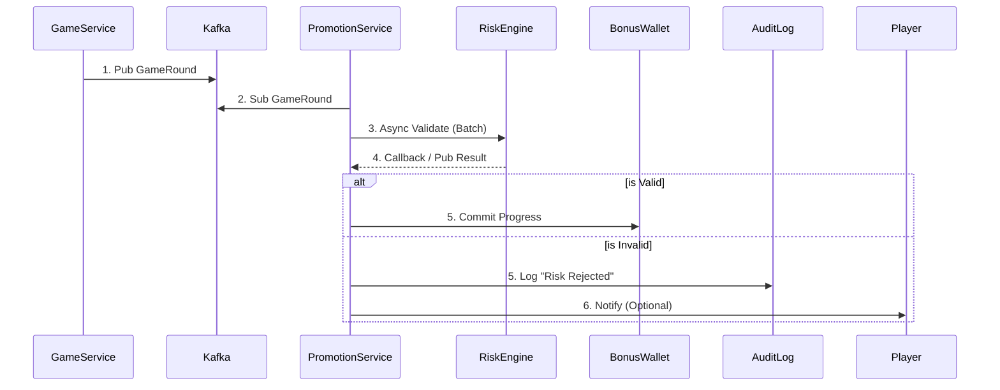

# 03-03 活動獎金系統 (Activity & Bonus System)

> **MERGED FROM**: `04-01_Activity_System_Design.md` + `04-02_Bonus_Calculation_Engine.md` (Week 5 Consolidation)
> **Version**: 3.0.0 (Merged Activity + Bonus Engine)
> **Last Updated**: 2026-02-04
>
> **三層風控架構定位**: **Layer 3 - 活動遊戲權重**
> 本模塊負責應用活動特定的遊戲權重規則到流水計算。
> 需依賴 Layer 1 ([04-01 風控框架](../04_Risk_Control/04-01_Risk_Framework.md)) 風控驗證 + Layer 2 ([02-03 流水計算](../02_Game_Operations/02-03_Turnover_Calculation.md)) 狀態因子計算後才執行。
> 完整架構參見: [00-00 文檔地圖 §流水計算邏輯](../00_Concept_&_Analysis/00-00_Document_Map.md#-流水計算邏輯)

博彩包網平台的活動系統（Promotion System）是玩家獲取與留存的核心引擎。本指南提供一套完整的系統架構設計與運營策略框架，涵蓋規則引擎、獎勵計算、多租戶架構、跨遊戲整合，以及針對東南亞、拉丁美洲、歐洲、中國四大市場的本地化策略。**關鍵發現：獎金濫用佔 iGaming 詐騙的 63.8%**，因此風控機制必須與活動系統深度整合。

---

## 模組化活動引擎的核心架構

現代 iGaming 平台普遍採用**微服務架構**構建活動系統，頂尖平台通常運行 40+ 個獨立微服務處理特定功能。這種架構實現了「無需開發即可上線新活動」的靈活性目標。

### 系統架構總覽

```text
┌─────────────────────────────────────────────────────────────────────┐
│                         API Gateway                                  │
│              (Rate Limiting, Auth, Tenant Routing)                  │
└───────────────────────────┬─────────────────────────────────────────┘
                            │
    ┌───────────────────────┼───────────────────────┐
    │                       │                       │
┌───▼───┐            ┌──────▼──────┐          ┌────▼────┐
│ 活動   │            │   獎勵      │          │  錢包   │
│ 引擎   │◄──────────►│   引擎      │◄────────►│  服務   │
│       │            │            │          │        │
└───┬───┘            └──────┬──────┘          └────┬────┘
    │                       │                      │
    │    ┌──────────────────┼──────────────────────┘
    │    │                  │
┌───▼────▼───┐       ┌──────▼──────┐        ┌───────────┐
│   規則     │       │   流水追蹤   │        │   風控    │
│   引擎     │       │   服務      │        │   服務    │
└────────────┘       └─────────────┘        └───────────┘
         │                  │                     │
         └──────────────────┼─────────────────────┘
                            │
                  ┌─────────▼─────────┐
                  │   Event Bus       │
                  │  (Kafka/NATS)     │
                  └───────────────────┘
```

### 規則引擎（Rule Engine）設計

規則引擎是實現高度可配置性的核心，採用**策略模式**分離業務邏輯與執行流程：

**規則介面模式：**

```java
interface IPromotionRule {
  ruleId: string;
  priority: number;
  evaluate(context: PlayerContext): boolean;  // 判斷是否符合條件
  execute(context: PlayerContext): RewardResult;  // 執行獎勵發放
}

class PromotionRulesEngine {
  private rules: IPromotionRule[];
  
  evaluate(context: PlayerContext): RewardResult[] {
    return this.rules
      .filter(rule => rule.evaluate(context))
      .sort((a, b) => a.priority - b.priority)
      .map(rule => rule.execute(context));
  }
}
```

**規則類型分類：**

|規則類型|說明|配置範例|
|---|---|---|
|觸發條件 (Trigger)|何時觸發活動|首存、累計存款、特定時段|
|資格條件 (Eligibility)|誰可以參與|VIP 等級、註冊天數、地區|
|獎勵計算 (Reward)|給予什麼獎勵|百分比匹配、固定金額、免費旋轉|
|限制條件 (Constraint)|使用限制|流水倍數、最大投注、有效期|

#### 規則引擎執行流程圖 (Rule Engine Execution Flow)

**概述**：規則引擎採用責任鏈模式 (Chain of Responsibility) + 策略模式 (Strategy Pattern)，實現可配置、可擴展的規則評估管線。

```mermaid
flowchart TD
    START[玩家動作事件觸發] --> EVENT_PARSE["解析事件類型<br/>━━━━━━━━━━━━<br/>DEPOSIT / BET / WIN / LOGIN"]

    EVENT_PARSE --> LOAD_CONTEXT["構建玩家上下文<br/>━━━━━━━━━━━━<br/>PlayerContext:<br/>• playerId, tenantId<br/>• VIP Level<br/>• Country, Currency<br/>• Registration Date<br/>• Recent Activity History"]

    LOAD_CONTEXT --> FETCH_RULES["查詢適用規則<br/>━━━━━━━━━━━━<br/>WHERE status = ACTIVE<br/>AND event_type = {type}<br/>AND tenant_id IN (platform, {tenantId})<br/>ORDER BY priority ASC"]

    FETCH_RULES --> RULES_FOUND{找到規則?}
    RULES_FOUND -->|否| NO_PROMO["無適用活動<br/>返回空結果"]

    RULES_FOUND -->|是| CHAIN_START["規則鏈開始<br/>按 Priority 遞增順序"]

    CHAIN_START --> LOOP_RULES[遍歷規則列表]

    LOOP_RULES --> CHECK_SCHEDULE{"1️⃣ 時間窗口檢查<br/>━━━━━━━━━━━━<br/>NOW() BETWEEN<br/>startDate AND endDate?"}
    CHECK_SCHEDULE -->|否| SKIP_RULE["跳過此規則<br/>繼續下一個"]

    CHECK_SCHEDULE -->|是| CHECK_ELIGIBILITY{"2️⃣ 資格條件評估<br/>━━━━━━━━━━━━"}

    CHECK_ELIGIBILITY --> ELIG_VIP{VIP 等級符合?}
    ELIG_VIP -->|否| SKIP_RULE
    ELIG_VIP -->|是| ELIG_COUNTRY{國家/地區符合?}
    ELIG_COUNTRY -->|否| SKIP_RULE
    ELIG_COUNTRY -->|是| ELIG_SEGMENT{"玩家分群符合?<br/>NEW_PLAYER /<br/>RETURNING /<br/>HIGH_ROLLER"}
    ELIG_SEGMENT -->|否| SKIP_RULE
    ELIG_SEGMENT -->|是| ELIG_BLACKLIST{"黑名單檢查<br/>is_excluded = false?"}
    ELIG_BLACKLIST -->|是黑名單| SKIP_RULE

    ELIG_BLACKLIST -->|通過| CHECK_TRIGGER{"3️⃣ 觸發條件匹配<br/>━━━━━━━━━━━━"}

    CHECK_TRIGGER --> TRIGGER_TYPE{觸發類型?}
    TRIGGER_TYPE -->|首存 FIRST_DEPOSIT| FIRST_DEP_CHECK["檢查:<br/>• 是否首次存款?<br/>• 金額 >= minDeposit?"]
    TRIGGER_TYPE -->|累積存款 ACCUMULATED| ACCUM_CHECK["檢查:<br/>• 週期內累計金額 >= threshold?"]
    TRIGGER_TYPE -->|流水達標 TURNOVER| TURNOVER_CHECK["檢查:<br/>• 有效流水 >= required?"]
    TRIGGER_TYPE -->|手動領取 MANUAL_CLAIM| MANUAL_CHECK["檢查:<br/>• 玩家是否手動觸發?"]

    FIRST_DEP_CHECK --> TRIGGER_RESULT{觸發成功?}
    ACCUM_CHECK --> TRIGGER_RESULT
    TURNOVER_CHECK --> TRIGGER_RESULT
    MANUAL_CHECK --> TRIGGER_RESULT

    TRIGGER_RESULT -->|否| SKIP_RULE
    TRIGGER_RESULT -->|是| CHECK_CONSTRAINTS{"4️⃣ 限制條件檢查<br/>━━━━━━━━━━━━"}

    CHECK_CONSTRAINTS --> CONST_QUOTA{"使用次數限制<br/>player_claims < maxClaims?"}
    CONST_QUOTA -->|否| SKIP_RULE
    CONST_QUOTA -->|是| CONST_COOLDOWN{"冷卻時間<br/>lastClaim + cooldown < NOW()?"}
    CONST_COOLDOWN -->|否| SKIP_RULE
    CONST_COOLDOWN -->|是| CONST_BUDGET{"活動預算檢查<br/>totalCost + rewardAmount <= budget?"}
    CONST_BUDGET -->|否| BUDGET_EXHAUSTED["活動預算耗盡<br/>自動暫停活動<br/>發送運營告警"]

    CONST_BUDGET -->|是| PASSED_RULE["✅ 規則匹配成功<br/>記錄匹配規則 ID"]

    PASSED_RULE --> CALC_REWARD{"5️⃣ 獎勵計算<br/>━━━━━━━━━━━━"}

    CALC_REWARD --> REWARD_TYPE{獎勵類型?}
    REWARD_TYPE -->|百分比匹配<br/>PERCENTAGE_MATCH| CALC_PERCENTAGE["計算:<br/>reward = depositAmount × matchPercentage<br/>reward = MIN(reward, maxReward)"]
    REWARD_TYPE -->|固定金額<br/>FIXED_AMOUNT| CALC_FIXED["直接使用配置金額<br/>reward = fixedAmount"]
    REWARD_TYPE -->|階梯式<br/>TIERED| CALC_TIERED["根據存款區間匹配:<br/>$100-$500 → 100% bonus<br/>$501-$1000 → 150% bonus"]
    REWARD_TYPE -->|免費旋轉<br/>FREE_SPINS| CALC_SPINS["生成 Token:<br/>spins_count = configured_spins<br/>game_id = eligible_game"]

    CALC_PERCENTAGE --> REWARD_RESULT["獲得獎勵結果<br/>RewardResult"]
    CALC_FIXED --> REWARD_RESULT
    CALC_TIERED --> REWARD_RESULT
    CALC_SPINS --> REWARD_RESULT

    REWARD_RESULT --> MULTI_MATCH{6️⃣ 多規則處理策略}

    MULTI_MATCH -->|策略 A: 取最高| SELECT_MAX["選擇 reward 金額最大的規則<br/>忽略其他匹配規則"]
    MULTI_MATCH -->|策略 B: 累加| SELECT_SUM["累加所有匹配規則的 reward<br/>需配置總上限"]
    MULTI_MATCH -->|策略 C: 優先級| SELECT_FIRST["僅執行 priority 最高 (數字最小) 的規則<br/>忽略其他"]
    MULTI_MATCH -->|策略 D: 玩家選擇| SELECT_PLAYER["展示所有匹配規則<br/>讓玩家手動選擇領取"]

    SELECT_MAX --> FINAL_REWARD[最終獎勵決策]
    SELECT_SUM --> FINAL_REWARD
    SELECT_FIRST --> FINAL_REWARD
    SELECT_PLAYER --> FINAL_REWARD

    FINAL_REWARD --> RISK_CHECK{"7️⃣ 風控最終審核<br/>━━━━━━━━━━━━"}

    RISK_CHECK --> RISK_MULTI_ACCOUNT{"多帳號檢測<br/>共享 IP/Device/Payment?"}
    RISK_MULTI_ACCOUNT -->|檢測到| RISK_REJECT["拒絕發放<br/>標記: RISK_REJECTED<br/>觸發人工審核"]
    RISK_MULTI_ACCOUNT -->|通過| RISK_BONUS_HUNTER{"獎金獵人模式檢測<br/>高頻領取 + 快速提款?"}
    RISK_BONUS_HUNTER -->|檢測到| RISK_REJECT
    RISK_BONUS_HUNTER -->|通過| RISK_VELOCITY{"存款速度異常?<br/>短時間大量存款"}
    RISK_VELOCITY -->|異常| RISK_MANUAL["標記: PENDING_MANUAL_REVIEW<br/>暫緩發放,等待審核"]
    RISK_VELOCITY -->|正常| RISK_PASS[✅ 風控通過]

    RISK_PASS --> EXECUTE_REWARD{"8️⃣ 執行獎勵發放<br/>━━━━━━━━━━━━"}

    EXECUTE_REWARD --> WALLET_TYPE{錢包類型選擇}
    WALLET_TYPE -->|現金<br/>CASH| CREDIT_CASH["直接入現金錢包<br/>wallet_service.creditCash<br/>可立即提款"]
    WALLET_TYPE -->|紅利<br/>BONUS| CREDIT_BONUS["入紅利錢包<br/>wallet_service.creditBonus<br/>創建流水追蹤記錄"]
    WALLET_TYPE -->|免費旋轉<br/>FREE_SPINS| ISSUE_TOKEN["發放 Token<br/>token_service.issueSpins<br/>綁定遊戲 + 有效期"]

    CREDIT_CASH --> CREATE_RECORD["創建獎勵記錄<br/>━━━━━━━━━━━━<br/>reward_distributions:<br/>• player_id, promotion_id<br/>• amount, wallet_type<br/>• status: COMPLETED<br/>• created_at, expires_at"]

    CREDIT_BONUS --> CREATE_WAGER["創建流水要求<br/>━━━━━━━━━━━━<br/>wagering_requirements:<br/>• bonus_id<br/>• required_turnover = amount × multiplier<br/>• current_progress = 0<br/>• status: ACTIVE<br/>• expires_at = NOW() + validDays"]

    ISSUE_TOKEN --> CREATE_RECORD

    CREATE_WAGER --> CREATE_RECORD

    CREATE_RECORD --> NOTIFY_PLAYER["9️⃣ 通知玩家<br/>━━━━━━━━━━━━<br/>• 站內信 (Inbox)<br/>• Push Notification<br/>• Email (Optional)"]

    NOTIFY_PLAYER --> AUDIT_LOG["🔟 審計日誌<br/>━━━━━━━━━━━━<br/>記錄完整執行軌跡:<br/>• 規則評估路徑<br/>• 匹配/拒絕原因<br/>• 獎勵計算明細<br/>• 風控決策依據"]

    AUDIT_LOG --> SUCCESS[返回成功結果<br/>RewardResult[]<br/>包含獎勵 ID、金額、類型]

    SKIP_RULE --> MORE_RULES{還有更多規則?}
    MORE_RULES -->|是| LOOP_RULES
    MORE_RULES -->|否| NO_MATCH["無規則匹配<br/>返回空結果"]

    BUDGET_EXHAUSTED --> ALERT_OPS["發送運營告警<br/>Slack/Email<br/>活動預算耗盡"]
    ALERT_OPS --> NO_PROMO

    RISK_REJECT --> AUDIT_LOG
    RISK_MANUAL --> AUDIT_LOG
    NO_PROMO --> END[流程結束]
    NO_MATCH --> END
    SUCCESS --> END

    %% 樣式定義
    style PASSED_RULE fill:#C8E6C9
    style RISK_PASS fill:#C8E6C9
    style SUCCESS fill:#C8E6C9
    style SKIP_RULE fill:#FFE082
    style RISK_REJECT fill:#FFCDD2
    style BUDGET_EXHAUSTED fill:#FF9800
    style RISK_MANUAL fill:#FFF9C4
```

**規則引擎性能優化策略**：

| 優化點 | 策略 | 預期效果 |
|--------|------|----------|
| **規則快取** | Redis 快取活動規則配置 (TTL=5min) | 減少 DB 查詢,響應時間 < 50ms |
| **玩家上下文快取** | Redis 快取 VIP、國家、分群信息 (TTL=10min) | 避免重複計算,減少 50% 計算量 |
| **批次觸發** | Kafka 批次消費 (batch_size=100, linger_ms=100) | 提升吞吐量 10x |
| **異步風控** | 風控檢測異步執行,不阻塞獎勵發放 | 用戶體驗提升,延遲 < 200ms |
| **預計算** | 每日預計算玩家流水/存款累計 (T+1 批次) | 實時查詢減少聚合計算 |
| **索引優化** | 規則表索引: (event_type, tenant_id, priority, status) | 查詢時間 < 10ms |

**關鍵設計決策說明**：

1. **為何需要優先級 (Priority)?**
   - 當多個規則匹配時,需明確執行順序
   - 例如:「全站通用活動」 vs「VIP 專屬活動」,VIP 應優先

2. **預算控制為何在規則執行時檢查?**
   - 避免活動超支導致財務風險
   - 預算耗盡自動暫停,防止運營疏忽

3. **為何需要多規則處理策略?**
   - 不同業務場景需求不同:
     - 「首存」通常只能領一次 (取最高)
     - 「返水」可以疊加多個活動 (累加)
     - 「VIP 升級獎勵」應優先執行 (優先級)

4. **風控為何放在最後一步?**
   - 避免每個規則都執行風控 (性能浪費)
   - 僅對最終決定發放的獎勵進行風控,減少 80% 風控調用

5. **為何需要審計日誌?**
   - 合規要求:所有獎勵發放必須可追溯
   - 爭議解決:玩家投訴時可回溯完整決策路徑
   - 運營優化:分析規則匹配率、拒絕原因分佈

---

### 獎勵引擎支援的獎勵類型

|獎勵類型|技術實現|特殊處理|
|---|---|---|
|現金獎勵|直接計入可提現餘額|無限制，直接到帳|
|彩金/紅利|獨立獎金餘額，需完成流水|錢包隔離，流水追蹤|
|免費旋轉|Token 化旋轉積分，綁定特定遊戲|遊戲供應商 API 整合|
|免費投注|無本金投注 Token（體育專用）|投注額不返還，僅派彩|
|實物獎品|訂單佇列整合物流系統|兌換流程、物流追蹤|
|忠誠積分|積分帳本，支援兌換與升級|等級計算、點數過期|

#### 紅利生命週期狀態機 (Bonus Lifecycle State Machine)

**概述**：紅利從發放到清算經歷多個狀態轉換，每個狀態對應不同的業務邏輯與限制條件。

```mermaid
stateDiagram-v2
    [*] --> PENDING_ISSUE: 規則引擎匹配成功<br/>創建獎勵記錄

    PENDING_ISSUE --> ISSUED: 風控審核通過<br/>錢包服務執行發放<br/>━━━━━━━━━━━━<br/>Actions:<br/>• wallet.creditBonus(amount)<br/>• 創建 wagering_requirement<br/>• 發送通知

    PENDING_ISSUE --> REJECTED: 風控審核拒絕<br/>━━━━━━━━━━━━<br/>Reasons:<br/>• 多帳號檢測<br/>• 獎金獵人模式<br/>• 預算耗盡<br/>Actions:<br/>• 標記 status=REJECTED<br/>• 記錄拒絕原因<br/>• 通知運營團隊

    ISSUED --> ACTIVE: 玩家首次使用紅利投注<br/>或手動激活<br/>━━━━━━━━━━━━<br/>Actions:<br/>• 開始流水追蹤<br/>• activated_at = NOW()<br/>• 計時器開始 (有效期倒計時)

    ISSUED --> FORFEITED: 未激活超時<br/>━━━━━━━━━━━━<br/>Condition:<br/>• NOW() > issued_at + grace_period<br/>• grace_period = 7 days (default)<br/>Actions:<br/>• wallet.debitBonus(amount)<br/>• status = FORFEITED<br/>• 釋放活動預算

    ACTIVE --> WAGERING: 流水累積中<br/>━━━━━━━━━━━━<br/>每次投注事件:<br/>• effective_turnover += bet × game_weight<br/>• progress = effective_turnover / required_turnover × 100%<br/>• 實時更新進度條

    WAGERING --> WAGERING: 持續投注累積流水<br/>━━━━━━━━━━━━<br/>Validation Checks:<br/>• 投注額 <= maxBet (anti-abuse)<br/>• 遊戲在 eligible_games 列表<br/>• 無對沖/套利檢測

    WAGERING --> CLEARING_COMPLETED: 流水達標 100%<br/>━━━━━━━━━━━━<br/>Condition:<br/>• effective_turnover >= required_turnover<br/>Actions:<br/>• 觸發結算流程<br/>• 鎖定 bonus_balance (防篡改)

    WAGERING --> EXPIRED: 有效期內未完成流水<br/>━━━━━━━━━━━━<br/>Condition:<br/>• NOW() > expires_at<br/>• effective_turnover < required_turnover<br/>Actions:<br/>• wallet.debitBonus(remaining_balance)<br/>• 扣除未完成部分<br/>• 記錄完成率

    WAGERING --> CANCELLED_BY_PLAYER: 玩家主動取消紅利<br/>━━━━━━━━━━━━<br/>Actions:<br/>• wallet.debitBonus(bonus_balance)<br/>• 清空流水進度<br/>• 不影響已發放的派彩

    WAGERING --> CANCELLED_BY_ADMIN: 運營/風控強制取消<br/>━━━━━━━━━━━━<br/>Reasons:<br/>• 玩家違規 (多帳號被發現)<br/>• 活動緊急下架<br/>Actions:<br/>• wallet.debitBonus(bonus_balance)<br/>• 記錄取消原因<br/>• 必要時回滾派彩

    CLEARING_COMPLETED --> CONVERTED_TO_CASH: 紅利轉現金<br/>━━━━━━━━━━━━<br/>Conversion Process:<br/>1️⃣ Calculate final_balance<br/>2️⃣ wallet.debitBonus(final_balance)<br/>3️⃣ wallet.creditCash(final_balance)<br/>4️⃣ status = CONVERTED

    CONVERTED_TO_CASH --> WITHDRAWABLE: 可提款狀態<br/>━━━━━━━━━━━━<br/>玩家可自由操作:<br/>• 繼續投注<br/>• 發起提款<br/>Actions:<br/>• 解除提款限制<br/>• 標記 bonus_id 已完成

    CLEARING_COMPLETED --> CAPPED: 超過最大派彩上限<br/>━━━━━━━━━━━━<br/>Condition:<br/>• final_balance > max_cashout_cap<br/>Example:<br/>• bonus = $50<br/>• max_cashout = $500<br/>• player_balance = $800 (超限)<br/>Actions:<br/>• wallet.debitBonus($800)<br/>• wallet.creditCash($500)<br/>• 扣除超額部分 $300

    CAPPED --> WITHDRAWABLE: 扣除超額後可提款

    WITHDRAWABLE --> WITHDRAWN: 玩家成功提款<br/>━━━━━━━━━━━━<br/>Actions:<br/>• 執行提款流程<br/>• 標記 withdrawn_at<br/>• 歸檔獎勵記錄

    WITHDRAWN --> [*]: 生命週期結束<br/>━━━━━━━━━━━━<br/>Final Actions:<br/>• 計算 bonus_ROI<br/>• 更新玩家分群<br/>• 生成財務報表

    REJECTED --> [*]: 生命週期結束<br/>未發放
    FORFEITED --> [*]: 生命週期結束<br/>未使用
    EXPIRED --> [*]: 生命週期結束<br/>未完成流水
    CANCELLED_BY_PLAYER --> [*]: 生命週期結束<br/>玩家主動放棄
    CANCELLED_BY_ADMIN --> [*]: 生命週期結束<br/>強制取消

    note right of PENDING_ISSUE : 初始狀態<br/>━━━━━━━━<br/>風控審核窗口期<br/>典型時長: < 5 秒

    note right of ACTIVE : 激活狀態<br/>━━━━━━━━<br/>玩家可使用紅利投注<br/>但未開始追蹤流水<br/>(某些活動需手動激活)

    note right of WAGERING : 流水累積階段<br/>━━━━━━━━<br/>核心業務邏輯:<br/>• 實時計算有效流水<br/>• 檢測濫用行為<br/>• 更新進度通知<br/><br/>典型耗時:<br/>• 休閒玩家: 7-14 天<br/>• 高頻玩家: 1-3 天

    note right of CLEARING_COMPLETED : 結算狀態<br/>━━━━━━━━<br/>流水達標後的臨界點<br/>需決定:<br/>• 是否超過 max_cashout<br/>• 最終可提現金額

    note right of WITHDRAWABLE : 可提款狀態<br/>━━━━━━━━<br/>紅利已轉為現金<br/>玩家可自由支配<br/>此時才算 "真正獲利"

    note left of EXPIRED : 超時失效<br/>━━━━━━━━<br/>常見原因:<br/>• 流水倍數設置過高<br/>• 玩家遊戲頻率低<br/>• 遊戲貢獻率設置過低<br/><br/>運營優化:<br/>• 監控 expiry_rate<br/>• 調整 wager_multiplier

    note left of CANCELLED_BY_ADMIN : 強制取消<br/>━━━━━━━━<br/>需留存證據:<br/>• 操作者 ID<br/>• 取消原因<br/>• 佐證文件<br/><br/>合規要求:<br/>• 玩家有權申訴<br/>• 7 天內必須回覆
```

**狀態轉換觸發條件矩陣**：

| 當前狀態 | 目標狀態 | 觸發條件 | 業務邏輯 | 回滾策略 |
|---------|---------|---------|---------|---------|
| PENDING_ISSUE | ISSUED | 風控通過 | 錢包加款 + 創建流水記錄 | 風控拒絕 → REJECTED (不加款) |
| ISSUED | ACTIVE | 玩家首次投注 or 手動激活 | 開始流水計時 | 超時未激活 → FORFEITED (扣除紅利) |
| ACTIVE | WAGERING | 玩家投注 | 計算有效流水 | 無 (正常流程) |
| WAGERING | CLEARING_COMPLETED | effective_turnover ≥ required | 鎖定餘額準備結算 | 無 (不可逆) |
| CLEARING_COMPLETED | CONVERTED_TO_CASH | final_balance ≤ max_cashout | 紅利轉現金 | 無 (不可逆) |
| CLEARING_COMPLETED | CAPPED | final_balance > max_cashout | 超額扣除 + 部分轉現金 | 無 (按規則執行) |
| WAGERING | EXPIRED | NOW() > expires_at | 扣除剩餘紅利 | 無 (按規則執行) |
| WAGERING | CANCELLED_BY_PLAYER | 玩家點擊 "取消紅利" | 扣除紅利但保留派彩 | 需確認彈窗 (防誤操作) |
| WAGERING | CANCELLED_BY_ADMIN | 風控觸發 or 活動下架 | 強制扣除 + 可選回滾派彩 | 需審批 + 審計日誌 |

**關鍵業務規則說明**：

1. **Grace Period (寬限期)**：
   - **定義**：紅利發放後，玩家必須在 grace_period 內激活使用
   - **典型值**：7 天
   - **原因**：防止玩家大量囤積紅利，影響活動預算預測

2. **Max Cashout Cap (最大派彩上限)**：
   - **定義**：即使玩家流水達標後贏得大額金額，可提現金額仍受限
   - **典型配置**：5x-10x bonus amount
   - **範例**：$50 紅利 → 最多提現 $500
   - **爭議點**：必須在活動條款明確說明，否則玩家投訴率高

3. **流水有效期 (Wagering Validity Period)**：
   - **定義**：從 ACTIVE 狀態開始計時，玩家必須在此期限內完成流水
   - **典型值**：14-30 天
   - **過短風險**：完成率低 → 玩家不滿
   - **過長風險**：預算鎖定時間長 → 財務壓力

4. **中途取消規則**：
   - **玩家主動取消**：扣除紅利餘額，但已發放的派彩保留
   - **運營強制取消**：可選擇是否回滾派彩 (視違規嚴重程度)
   - **範例**：
     - 玩家誤領不想玩 → 保留派彩 (用戶體驗)
     - 多帳號欺詐被發現 → 回滾所有派彩 (風控需要)

5. **狀態審計追溯**：
   - 每次狀態轉換必須記錄：
     - `previous_status`, `new_status`, `transitioned_at`
     - `triggered_by` (SYSTEM / PLAYER / ADMIN)
     - `trigger_reason` (詳細原因描述)
   - 玩家投訴時可回溯完整狀態變更歷史

**典型流程耗時統計**：

| 玩家類型 | ISSUED → ACTIVE | ACTIVE → CLEARING | CLEARING → WITHDRAWN | 總耗時 |
|---------|----------------|-------------------|---------------------|--------|
| 高頻玩家 | < 1 小時 | 1-3 天 | < 1 天 | 2-4 天 |
| 中頻玩家 | 1-24 小時 | 5-10 天 | 1-2 天 | 6-12 天 |
| 休閒玩家 | 1-3 天 | 10-20 天 | 2-5 天 | 13-28 天 |
| 流失玩家 | > 7 天 | ∞ (EXPIRED/FORFEITED) | - | - |

**運營優化建議**：

- **監控 FORFEITED 率**：若 > 20%，說明 grace_period 過短或活動吸引力不足
- **監控 EXPIRED 率**：若 > 50%，說明流水倍數過高或有效期過短
- **監控 CAPPED 比例**：若 < 5%，說明 max_cashout 設置過高，活動成本超預算
- **監控平均完成耗時**：用於預測活動預算鎖定週期，優化現金流管理

---

## 後台配置系統實現無代碼部署

### JSON Schema 驅動的活動配置

透過 JSON Schema 定義活動結構，配合視覺化後台實現運營人員自主配置：

```
{
  "promotionId": "promo-uuid-001",
  "name": "春節首存加碼",
  "type": "DEPOSIT_BONUS",
  "status": "ACTIVE",
  "schedule": {
    "startDate": "2026-01-28T00:00:00+08:00",
    "endDate": "2026-02-15T23:59:59+08:00"
  },
  "eligibility": {
    "playerSegments": ["NEW_PLAYER", "VIP_GOLD"],
    "minDeposit": 100,
    "maxClaims": 1,
    "validCountries": ["TH", "VN", "PH", "MY"]
  },
  "reward": {
    "type": "PERCENTAGE_MATCH",
    "matchPercentage": 188,
    "maxReward": 8888,
    "currency": "CNY"
  },
  "wageringRequirements": {
    "multiplier": 25,
    "appliesTo": "BONUS_ONLY",
    "timeLimit": 30,
    "contributionRates": {
      "slots": 100,
      "liveDealer": 15,
      "tableGames": 10,
      "sportsbook": 100
    },
    "maxBet": 50
  }
}
```

### 多租戶架構下的活動管理

針對白標/包網場景，活動系統需同時支援**平台級活動**與**營運商自定義活動**：

```
┌─────────────────────────────────────────────────────────────┐
│                   多租戶活動架構                              │
├─────────────────────────────────────────────────────────────┤
│  ┌──────────┐    ┌──────────┐    ┌──────────┐              │
│  │ 營運商 A │    │ 營運商 B │    │ 營運商 C │              │
│  │(tenant_1)│    │(tenant_2)│    │(tenant_3)│              │
│  └────┬─────┘    └────┬─────┘    └────┬─────┘              │
│       │               │               │                     │
│       └───────────────┼───────────────┘                     │
│                       │                                      │
│            ┌──────────▼──────────┐                          │
│            │   租戶上下文路由器   │                          │
│            └──────────┬──────────┘                          │
│                       │                                      │
│    ┌──────────────────┼──────────────────┐                  │
│    │                  │                  │                  │
│  ┌─▼──────┐     ┌─────▼─────┐     ┌──────▼─────┐           │
│  │營運商   │     │  平台級    │     │  品牌配置  │           │
│  │專屬活動 │     │  共享活動  │     │  覆蓋設定  │           │
│  │(Row-RLS)│     │           │     │            │           │
│  └─────────┘     └───────────┘     └────────────┘           │
└─────────────────────────────────────────────────────────────┘
```

**數據隔離策略：**

- **大型營運商**：獨立數據庫，完全隔離
- **中型營運商**：Schema 隔離（PostgreSQL Schema）   
- **小型營運商**：Row-Level Security（tenant_id 欄位 + RLS 策略）
    

---

## 5. 跨遊戲類型的統一流水計算框架 (Layer 3 核心邏輯)

**前置條件**:
- ✅ Layer 1: 通過風控驗證 (05-01 §3.1)
- ✅ Layer 2: 計算狀態因子 (02-04 §1.2)

不同遊戲類型的莊家優勢差異巨大（老虎機 ~5%、二十一點 ~0.5%），必須透過**貢獻率系統**標準化流水計算：

### 5.1 遊戲權重應用 (Game Weight Application)

活動系統需針對不同遊戲類型應用不同的流水權重（貢獻率）：

|遊戲類型|典型貢獻率 (GameWeight)|原因說明|範例計算|
|---|---|---|---|
|老虎機/Slots|100%|高莊家優勢，標準基準|$100 投注 = $100 流水|
|體育博彩|100%|結果不可控，風險可接受|$100 投注 = $100 流水 (需通過賠率閾值)|
|刮刮卡|100%|單次結果型遊戲|$100 投注 = $100 流水|
|輪盤|10-20%|可對沖投注|$100 投注 = $15 流水|
|百家樂|10-15%|接近 50/50 賠率|$100 投注 = $15 流水|
|二十一點|5-10%|低莊家優勢，可計牌|$100 投注 = $10 流水|
|視頻撲克|10-20%|策略可降低莊家優勢|$100 投注 = $15 流水|
|真人娛樂場|5-15%|與桌遊類似|$100 投注 = $10 流水|
|撲克（抽水池）|0%|玩家對玩家，通常排除|$100 投注 = $0 流水|

**完整公式** (三層架構整合):

```
ValidTurnover = BetAmount
                × Layer1_RiskFactor     (05-01: 0 or 1)
                × Layer2_StatusFactor   (02-04: 0%, 50%, 100%)
                × Layer3_GameWeight     (本節: 5%-100%)

範例：在二十一點投注 $100，貢獻率 10%
- Layer 1: RiskFactor = 1 (通過風控)
- Layer 2: StatusFactor = 100% (WIN/LOSS)
- Layer 3: GameWeight = 10%
→ ValidTurnover = $100 × 1 × 100% × 10% = $10 計入流水要求
```

### 統一玩家活動追蹤事件結構

```
{
  "eventType": "GAME_ROUND_COMPLETED",
  "timestamp": "2026-01-24T15:30:00+08:00",
  "playerId": "player-uuid",
  "tenantId": "operator-uuid",
  "vertical": "CASINO",
  "gameType": "SLOTS",
  "gameId": "game-uuid",
  "providerId": "provider-uuid",
  "data": {
    "betAmount": 10.00,
    "winAmount": 25.00,
    "currency": "USD",
    "roundId": "round-uuid"
  },
  "bonusContext": {
    "activeBonusId": "bonus-uuid",
    "contributionRate": 100,
    "effectiveContribution": 10.00,
    "progressBefore": 500.00,
    "progressAfter": 510.00,
    "requiredTotal": 3000.00
  }
}
```

### 有效流水驗證邏輯 (Valid Turnover Validation)
流水計算不應只看 "Bet Amount"，必須過濾 **無風險投注 (Risk-Free Bet)** 與 **對沖投注 (Hedge Betting)**。為避免影響遊戲即時性，此過程採用 **非同步驗證 (Asynchronous Validation)**。

**驗證流程 (Validation Flow)**：
1. **事件接收**: `Promotion Service` 收到 `GameRound` 事件，先標記流水狀態為 `PENDING`。
2. **異步風控**: 
    - 將注單 ID 發送至 Kafka Topic `risk.turnover.validate`。
    - 調用 `RiskEngine.validateTurnover(batchBets)` (參見 `05-01_Risk_Control_System.md`)。
3. **結果處理**:
    - **Valid**: 更新流水狀態為 `COMPLETED`，累積進度。
    - **Invalid (Hedge/Arbitrage)**: 
        - 更新狀態為 `REJECTED`。
        - 記錄拒絕原因 (e.g. `Reason: HEDGE_BET_DETECTED`)。
        - 若已發放獎勵，觸發 **Rollback** 機制扣回。

**數據流圖**:


### 統一流水驗證架構 (Unified Turnover Validation Architecture)

為確保 **Activity System (活動系統)** 與 **Finance System (財務系統, 02-04)** 的流水計算一致性，兩者必須共用統一的基礎驗證邏輯,避免產生數據偏差導致玩家投訴或財務風險。

#### 架構原則 (Architecture Principles)

```
┌─────────────────────────────────────────────────────────────────┐
│              Unified Turnover Validation Stack                  │
├─────────────────────────────────────────────────────────────────┤
│                                                                 │
│  Layer 1: Base Validation (Single Source of Truth)             │
│  ┌───────────────────────────────────────────────────────────┐ │
│  │  RiskEngine.validateTurnover() (05-01 Risk Control)       │ │
│  │  - Filter: Hedge Detection (對沖投注檢測)                  │ │
│  │  - Filter: Arbitrage Detection (套利投注檢測)              │ │
│  │  - Filter: Low Odds (<1.5, configurable)                  │ │
│  │  - Output: effective_turnover_base (基礎有效流水)          │ │
│  └───────────────────────────────────────────────────────────┘ │
│                           ↓                                     │
│  Layer 2: Finance Layer (02-04 Finance Center)                 │
│  ┌───────────────────────────────────────────────────────────┐ │
│  │  effective_turnover_base × status_factor                  │ │
│  │  - WIN: 1.0 (玩家贏,計入流水)                              │ │
│  │  - LOSS: 1.0 (玩家輸,計入流水)                             │ │
│  │  - DRAW/TIE: 0 (和局,無風險,不計流水)                      │ │
│  │  - VOID/CANCEL: 0 (注單作廢)                               │ │
│  │  - HALF_WIN/HALF_LOSS: 0.5 (半贏半輸)                      │ │
│  │  → Output: valid_turnover_finance (財務有效流水)           │ │
│  └───────────────────────────────────────────────────────────┘ │
│                           ↓                                     │
│  Layer 3: Activity Layer (04-01 Activity Center)               │
│  ┌───────────────────────────────────────────────────────────┐ │
│  │  valid_turnover_finance × game_weight                     │ │
│  │  - Slots (老虎機): 1.0 (100% contribution)                 │ │
│  │  - Sports (體育): 1.0                                      │ │
│  │  - Baccarat (百家樂): 0.1-0.15 (10-15%)                    │ │
│  │  - Blackjack (二十一點): 0.05-0.1 (5-10%)                  │ │
│  │  - Roulette (輪盤): 0.1-0.2                                │ │
│  │  → Output: activity_valid_turnover (活動有效流水)          │ │
│  └───────────────────────────────────────────────────────────┘ │
│                                                                 │
└─────────────────────────────────────────────────────────────────┘
```

#### API 契約定義 (API Contract Definition)

**Base Validation API** (Provided by Risk Engine - 05-01):

```typescript
// Risk Engine provides this API for cross-module consumption
interface ValidateTurnoverRequest {
  bet_id: string;
  player_id: string;
  game_type: GameType;  // SLOTS, SPORTS, BACCARAT, etc.
  bet_amount: number;
  odds: number;
  odds_type: OddsType;  // EUR, HK, MY, ID
  bet_pattern?: BetPattern[];  // For multi-bet analysis
}

interface ValidateTurnoverResponse {
  is_valid: boolean;
  effective_turnover_base: number;  // Base valid turnover after risk checks
  risk_code: RiskCode;  // VALID, HEDGE_DETECTED, ARBITRAGE, LOW_ODDS
  rejection_reason?: string;
}

// Example usage:
const result = await RiskEngine.validateTurnover({
  bet_id: "bet-uuid-001",
  player_id: "player-uuid-123",
  game_type: GameType.BACCARAT,
  bet_amount: 100,
  odds: 1.95,
  odds_type: OddsType.EUR
});
// Returns: { is_valid: true, effective_turnover_base: 100, risk_code: "VALID" }
```

#### 計算鏈路示例 (Calculation Chain Example)

假設玩家在百家樂 (Baccarat) 投注 $100,賠率 1.95 (歐洲盤),最終結果 WIN:

```
Step 1 (Risk Engine - 05-01):
  Input: bet_amount = $100, odds = 1.95, game = BACCARAT
  Check: odds >= 1.5 ✓, no hedge detected ✓
  Output: effective_turnover_base = $100

Step 2 (Finance Layer - 02-04):
  Input: effective_turnover_base = $100, status = WIN
  Apply: status_factor = 1.0 (WIN counts as valid)
  Output: valid_turnover_finance = $100 × 1.0 = $100

Step 3 (Activity Layer - 04-01):
  Input: valid_turnover_finance = $100, game = BACCARAT
  Apply: game_weight = 0.15 (15% contribution for baccarat)
  Output: activity_valid_turnover = $100 × 0.15 = $15

Result:
  - Finance System records: $100 valid turnover (for VIP/rebate)
  - Activity System records: $15 wagering progress (for bonus clearing)
```

#### 跨模組一致性保障機制 (Cross-Module Consistency Mechanisms)

1. **統一事件源 (Unified Event Source)**:
   - 所有注單結算事件 `GameRound.Settled` 必須同時發送至:
     - Finance Turnover Service (財務流水服務)
     - Activity Wagering Service (活動流水服務)
   - 兩者均訂閱相同的 Kafka Topic: `game.rounds.settled`

2. **同步驗證調用 (Synchronized Validation Call)**:
   - Finance 與 Activity 模組均需調用 `RiskEngine.validateTurnover()` 作為第一步
   - 不可各自實作風控邏輯,避免邏輯分歧

3. **每日對帳報告 (Daily Reconciliation Report)**:
   - **執行時間**: 每日凌晨 03:00 (after daily settlement)
   - **警報觸發**: 若任何玩家的偏差 >0.01%,觸發 Slack/Email 警報至財務與風控團隊
   - **根因分析**: 常見原因包括:
     - 時區差異 (Finance 用 UTC, Activity 用 Local Time)
     - 重複計算 (同一注單被處理兩次)
     - 遊戲權重配置不一致

4. **配置集中管理 (Centralized Configuration)**:
   - **遊戲權重表 (Game Weight Table)** 必須存放於統一配置服務 (Config Service)
   - Finance 與 Activity 模組均需從此服務讀取,禁止硬編碼 (Hardcoding)
   - 範例配置結構:
     ```json
     {
       "game_weights": {
         "SLOTS": 1.0,
         "SPORTS": 1.0,
         "BACCARAT": 0.15,
         "BLACKJACK": 0.10,
         "ROULETTE": 0.20
       },
       "odds_thresholds": {
         "EUR": 1.5,
         "HK": 0.5,
         "MY": 0.5,
         "ID": 1.2
       }
     }
     ```text

---

## 事件驅動架構實現即時活動觸發

採用 Apache Kafka 作為事件總線，實現毫秒級的活動觸發響應：

### 事件處理流程

```
玩家動作 → 遊戲服務 → Kafka Topic →
  → 活動觸發消費者
    → 資格檢查服務
    → 獎勵計算服務
    → 錢包服務（發放）
    → 通知服務（推播/站內信）
```

**關鍵 Topic 結構：**

```
Topics:
├── player.activity.casino     # 娛樂場遊戲活動
├── player.activity.sports     # 體育投注活動
├── player.activity.poker      # 撲克活動
├── player.deposits            # 存款事件
├── player.registrations       # 註冊事件
├── promotion.triggers         # 活動觸發
├── promotion.claims           # 活動領取
├── reward.distributions       # 獎勵發放
└── wagering.updates           # 流水更新
```

### 推薦技術棧

|層級|技術選型|用途|
|---|---|---|
|API 閘道|Kong / AWS API Gateway|限流、認證、路由|
|服務通訊|gRPC（內部）/ REST（外部）|高效內部調用|
|事件串流|Apache Kafka + Kafka Streams|即時事件處理|
|主數據庫|PostgreSQL + JSONB|活動配置、ACID 事務|
|高併發寫入|ScyllaDB / CockroachDB|流水記錄、交易日誌|
|緩存|Redis Cluster|玩家狀態、活動快取|
|搜尋|Elasticsearch|活動搜尋、玩家查詢|

---

### 多獎金衝突處理決策矩陣 (Multi-Bonus Conflict Resolution Matrix)

**概述**：當玩家同時符合多個活動時，系統需要明確的衝突處理策略，避免活動疊加濫用或用戶體驗混亂。

```mermaid
flowchart TD
    START["玩家觸發動作<br/>例: 存款 $200"] --> QUERY_RULES["查詢所有匹配規則<br/>━━━━━━━━━━━━<br/>Result: 找到 4 個活動<br/>• A: 首存 100% bonus<br/>• B: 週末充值 50% bonus<br/>• C: VIP 專屬 30% bonus<br/>• D: 全站返水 1% cashback"]

    QUERY_RULES --> CLASSIFY{"1️⃣ 活動類型分類<br/>━━━━━━━━━━━━"}

    CLASSIFY --> CAT_DEPOSIT["存款類活動<br/>Category: DEPOSIT_BONUS"]
    CLASSIFY --> CAT_CASHBACK["返水類活動<br/>Category: CASHBACK"]
    CLASSIFY --> CAT_FREEBET["免費投注類<br/>Category: FREE_BET"]
    CLASSIFY --> CAT_TOURNAMENT["錦標賽類<br/>Category: TOURNAMENT"]

    CAT_DEPOSIT --> DEP_LIST["DEPOSIT_BONUS 列表:<br/>• A: 首存 100% (priority=1)<br/>• B: 週末 50% (priority=10)<br/>• C: VIP 30% (priority=5)"]

    CAT_CASHBACK --> CB_LIST["CASHBACK 列表:<br/>• D: 全站返水 1% (priority=20)"]

    CAT_FREEBET --> FB_LIST["FREE_BET 列表:<br/>• (無匹配)"]

    CAT_TOURNAMENT --> TOUR_LIST["TOURNAMENT 列表:<br/>• (無匹配)"]

    DEP_LIST --> CHECK_RULE{"2️⃣ 檢查衝突規則<br/>━━━━━━━━━━━━"}

    CHECK_RULE --> RULE_CONFIG["讀取活動配置<br/>━━━━━━━━━━━━<br/>activity_conflict_rules:<br/>• mutually_exclusive_groups<br/>• stackability_policy<br/>• priority_override"]

    RULE_CONFIG --> MUTUAL_EXCLUSIVE{"是否互斥?<br/>━━━━━━━━━━━━<br/>檢查 mutually_exclusive_groups"}

    MUTUAL_EXCLUSIVE -->|是 - 互斥組 A| EXCLUSIVE_GROUP["互斥組內規則:<br/>━━━━━━━━━━━━<br/>Example:<br/>• 首存活動<br/>• 二存活動<br/>• 三存活動<br/>Rule: 只能選其一"]

    EXCLUSIVE_GROUP --> EXCLUSIVE_STRATEGY{互斥策略選擇}

    EXCLUSIVE_STRATEGY -->|策略 1: 取最高| SELECT_MAX_EXCL["選擇 reward 金額最大的活動<br/>━━━━━━━━━━━━<br/>計算:<br/>• A: $200 × 100% = $200<br/>• B: $200 × 50% = $100<br/>• C: $200 × 30% = $60<br/>Result: 選擇 A (首存)"]

    EXCLUSIVE_STRATEGY -->|策略 2: 優先級| SELECT_PRIORITY_EXCL["選擇 priority 最高 (數字最小)<br/>━━━━━━━━━━━━<br/>• A: priority=1 ✓<br/>• B: priority=10<br/>• C: priority=5<br/>Result: 選擇 A"]

    EXCLUSIVE_STRATEGY -->|策略 3: 玩家選擇| SELECT_PLAYER_EXCL["展示所有互斥活動<br/>讓玩家手動選擇<br/>━━━━━━━━━━━━<br/>UI:<br/>☐ A: 100% 最高$200<br/>☐ B: 50% 無上限<br/>☐ C: 30% + 50 Free Spins<br/>Button: 立即領取"]

    MUTUAL_EXCLUSIVE -->|否 - 可疊加| STACKABLE{"可疊加性檢查<br/>━━━━━━━━━━━━<br/>stackability_policy"}

    STACKABLE -->|全部可疊加| STACK_ALL["疊加所有獎勵<br/>━━━━━━━━━━━━<br/>Condition:<br/>• 活動配置 allow_stack=true<br/>• 總金額 < global_max_bonus<br/>Calculation:<br/>total_reward = SUM(all_rewards)"]

    STACK_ALL --> CHECK_CAP{"3️⃣ 檢查總上限<br/>━━━━━━━━━━━━"}

    CHECK_CAP -->|超過上限| APPLY_CAP["應用上限限制<br/>━━━━━━━━━━━━<br/>Example:<br/>• total_reward = $350<br/>• global_max_bonus = $300<br/>Result: 限制為 $300<br/>Action: 按比例縮減各活動"]

    CHECK_CAP -->|未超過| CAP_OK["疊加金額合規<br/>全額發放"]

    STACKABLE -->|有條件疊加| CONDITIONAL_STACK{條件疊加規則}

    CONDITIONAL_STACK -->|同類型不可疊加| SAME_TYPE_EXCL["同類型活動互斥<br/>━━━━━━━━━━━━<br/>Example:<br/>• 2 個 DEPOSIT_BONUS 不可疊加<br/>• 但 DEPOSIT_BONUS + CASHBACK 可疊加<br/>Action: 分組處理"]

    SAME_TYPE_EXCL --> GROUP_BY_TYPE["按類型分組<br/>━━━━━━━━━━━━<br/>Group 1: DEPOSIT_BONUS (A, B, C)<br/>→ 取最高 A: $200<br/>Group 2: CASHBACK (D)<br/>→ 保留 D: $2<br/>Total: $202"]

    CONDITIONAL_STACK -->|跨類別可疊加| CROSS_CATEGORY["跨類別疊加<br/>━━━━━━━━━━━━<br/>Example:<br/>• DEPOSIT_BONUS: $200 (A)<br/>• CASHBACK: $2 (D)<br/>• FREE_SPINS: 50 spins (E)<br/>Rule: 不同錢包類型可疊加"]

    SELECT_MAX_EXCL --> FINAL_DEPOSIT[DEPOSIT 最終獎勵: A]
    SELECT_PRIORITY_EXCL --> FINAL_DEPOSIT
    SELECT_PLAYER_EXCL --> FINAL_DEPOSIT

    CAP_OK --> FINAL_STACK[疊加最終獎勵列表]
    APPLY_CAP --> FINAL_STACK
    GROUP_BY_TYPE --> FINAL_STACK
    CROSS_CATEGORY --> FINAL_STACK

    FINAL_DEPOSIT --> MERGE_CATEGORIES["4️⃣ 合併跨類別獎勵<br/>━━━━━━━━━━━━"]
    CB_LIST --> MERGE_CATEGORIES
    FB_LIST --> MERGE_CATEGORIES
    TOUR_LIST --> MERGE_CATEGORIES
    FINAL_STACK --> MERGE_CATEGORIES

    MERGE_CATEGORIES --> WALLET_SEPARATION{"5️⃣ 錢包隔離檢查<br/>━━━━━━━━━━━━"}

    WALLET_SEPARATION --> WALLET_BONUS["Bonus Wallet<br/>━━━━━━━━━━━━<br/>• DEPOSIT_BONUS: $200<br/>• 需完成流水 25x<br/>• 有效期 14 天"]

    WALLET_SEPARATION --> WALLET_CASH["Cash Wallet<br/>━━━━━━━━━━━━<br/>• CASHBACK: $2<br/>• 無流水要求<br/>• 立即可提"]

    WALLET_SEPARATION --> WALLET_FREEBET["Free Bet Token<br/>━━━━━━━━━━━━<br/>• FREE_BET: (無)<br/>• Token ID: (N/A)"]

    WALLET_BONUS --> WAGERING_CONFLICT{"6️⃣ 流水衝突處理<br/>━━━━━━━━━━━━"}

    WAGERING_CONFLICT -->|隔離模式 ISOLATED| ISOLATED_WAGER["各活動獨立追蹤流水<br/>━━━━━━━━━━━━<br/>Example:<br/>• Bonus A: 需完成 $5,000<br/>• Bonus B: 需完成 $2,500<br/>玩家投注 $100:<br/>• A 進度: +$100<br/>• B 進度: +$100<br/>兩者獨立計算"]

    WAGERING_CONFLICT -->|共用模式 SHARED| SHARED_WAGER["所有活動共用流水池<br/>━━━━━━━━━━━━<br/>Total Required: $7,500<br/>玩家投注 $100:<br/>• 共用進度: +$100<br/>完成優先級:<br/>• 先完成 priority 最高的"]

    WAGERING_CONFLICT -->|順序模式 SEQUENTIAL| SEQUENTIAL_WAGER["按順序依次完成<br/>━━━━━━━━━━━━<br/>Queue:<br/>1️⃣ Bonus A (priority=1)<br/>2️⃣ Bonus B (priority=10)<br/>玩家投注僅計入當前 Bonus<br/>完成 A 後才開始追蹤 B"]

    ISOLATED_WAGER --> GAME_CONTRIBUTION{"7️⃣ 遊戲貢獻率衝突<br/>━━━━━━━━━━━━"}
    SHARED_WAGER --> GAME_CONTRIBUTION
    SEQUENTIAL_WAGER --> GAME_CONTRIBUTION

    GAME_CONTRIBUTION -->|統一貢獻率| UNIFIED_CONTRIB["所有活動使用全局貢獻率<br/>━━━━━━━━━━━━<br/>Game Weights:<br/>• Slots: 100%<br/>• Baccarat: 10%<br/>• Blackjack: 5%<br/>適用於所有活動"]

    GAME_CONTRIBUTION -->|活動專屬貢獻率| EXCLUSIVE_CONTRIB["各活動自定義貢獻率<br/>━━━━━━━━━━━━<br/>Example:<br/>• Bonus A (老虎機專屬):<br/>  Slots=100%, Others=0%<br/>• Bonus B (全遊戲):<br/>  All Games=100%<br/>玩家玩百家樂:<br/>• A 不計流水<br/>• B 計入流水"]

    GAME_CONTRIBUTION -->|取最低貢獻率| MIN_CONTRIB["衝突時取最嚴格限制<br/>━━━━━━━━━━━━<br/>Example:<br/>• Bonus A: Baccarat=10%<br/>• Bonus B: Baccarat=15%<br/>Result: 使用 10% (更嚴格)<br/>Reason: 防止濫用"]

    UNIFIED_CONTRIB --> FINAL_RESULT["8️⃣ 生成最終決策<br/>━━━━━━━━━━━━"]
    EXCLUSIVE_CONTRIB --> FINAL_RESULT
    MIN_CONTRIB --> FINAL_RESULT
    WALLET_CASH --> FINAL_RESULT
    WALLET_FREEBET --> FINAL_RESULT

    FINAL_RESULT --> RESULT_OUTPUT[最終獎勵方案<br/>━━━━━━━━━━━━<br/>RewardDecision:<br/>• selected_promotions: [A, D]<br/>• bonus_wallet: $200 (25x wager, 14d)<br/>• cash_wallet: $2 (no wager)<br/>• wagering_mode: ISOLATED<br/>• game_contrib: UNIFIED]

    RESULT_OUTPUT --> NOTIFY_PLAYER["通知玩家<br/>━━━━━━━━━━━━<br/>• 彈窗展示獲得獎勵<br/>• 說明流水要求<br/>• 顯示有效期倒計時"]

    NOTIFY_PLAYER --> AUDIT_DECISION[審計決策記錄<br/>━━━━━━━━━━━━<br/>promotion_decisions:<br/>• matched_rules: [A,B,C,D]<br/>• selected_rules: [A,D]<br/>• rejection_reasons:<br/>  - B: 互斥組內落選<br/>  - C: 互斥組內落選<br/>• conflict_resolution: MAX_REWARD<br/>• operator: SYSTEM]

    AUDIT_DECISION --> END[流程結束]

    %% 樣式定義
    style SELECT_MAX_EXCL fill:#C8E6C9
    style SELECT_PRIORITY_EXCL fill:#C8E6C9
    style CAP_OK fill:#C8E6C9
    style RESULT_OUTPUT fill:#81C784
    style APPLY_CAP fill:#FFD54F
    style EXCLUSIVE_GROUP fill:#FFE082
    style MIN_CONTRIB fill:#FFAB91
```

**衝突處理策略對比表**：

| 策略類型 | 適用場景 | 優點 | 缺點 | 用戶體驗 | 實施複雜度 |
|---------|---------|------|------|---------|-----------|
| **取最高 (MAX_REWARD)** | 互斥首存活動 | 簡單明瞭,玩家獲益最大 | 可能浪費低價值活動配置 | ⭐⭐⭐⭐⭐ | 🟢 低 |
| **按優先級 (PRIORITY)** | VIP 等級活動 | 可控性強,符合業務邏輯 | 玩家可能不理解為何被分配低獎勵 | ⭐⭐⭐ | 🟢 低 |
| **玩家選擇 (PLAYER_CHOICE)** | 多樣化活動池 | 用戶自主權最高 | 決策疲勞,可能選錯後投訴 | ⭐⭐⭐⭐ | 🟡 中 |
| **全部疊加 (STACK_ALL)** | 返水 + 簽到 | 用戶滿意度最高 | 成本失控風險,易被濫用 | ⭐⭐⭐⭐⭐ | 🟡 中 |
| **同類型互斥 (TYPE_EXCLUSIVE)** | 混合活動組 | 平衡成本與體驗 | 規則複雜,需清晰說明 | ⭐⭐⭐⭐ | 🟡 中 |
| **順序模式 (SEQUENTIAL)** | 新手任務鏈 | 引導用戶行為,延長留存 | 靈活性差,用戶可能放棄 | ⭐⭐⭐ | 🔴 高 |
| **隔離流水 (ISOLATED_WAGER)** | 多紅利疊加 | 公平透明,易追蹤 | 用戶需理解多個流水池 | ⭐⭐⭐⭐ | 🟡 中 |
| **共用流水 (SHARED_WAGER)** | 簡化用戶體驗 | 用戶理解成本低 | 後台邏輯複雜,易出錯 | ⭐⭐⭐⭐⭐ | 🔴 高 |

**業界最佳實踐配置範例**：

```json
{
  "conflict_resolution_config": {
    "default_policy": "TYPE_EXCLUSIVE",
    "rules": [
      {
        "conflict_group": "first_deposit_bonuses",
        "type": "MUTUALLY_EXCLUSIVE",
        "resolution_strategy": "MAX_REWARD",
        "members": ["promo-first-deposit-100", "promo-first-deposit-200", "promo-vip-first-deposit"],
        "reason": "首存活動互斥,自動選擇獎勵最高的"
      },
      {
        "conflict_group": "cashback_programs",
        "type": "STACKABLE",
        "resolution_strategy": "STACK_ALL",
        "max_total_percentage": 5.0,
        "members": ["daily-cashback", "vip-cashback", "game-specific-cashback"],
        "reason": "返水可疊加但總計不超過 5%"
      },
      {
        "conflict_group": "free_spins_offers",
        "type": "PLAYER_CHOICE",
        "resolution_strategy": "PLAYER_SELECT",
        "max_selections": 1,
        "members": ["free-spins-50", "free-spins-100-wagered", "mega-spins-10"],
        "reason": "免費旋轉類型差異大,讓玩家選擇"
      }
    ],
    "wagering_mode": {
      "default": "ISOLATED",
      "cross_category_shared": false,
      "completion_order": "PRIORITY_ASC"
    },
    "game_contribution_policy": {
      "default": "UNIFIED",
      "allow_activity_override": true,
      "conflict_resolution": "MIN_CONTRIBUTION"
    },
    "global_limits": {
      "max_active_bonuses_per_player": 5,
      "max_total_bonus_balance": 10000,
      "max_daily_claim_count": 3
    }
  }
}
```

**典型衝突場景決策樹**：

| 場景 | 匹配活動 | 衝突類型 | 決策策略 | 最終結果 |
|------|---------|---------|---------|---------|
| **新玩家首存 $100** | • 首存 100% (max $100)<br/>• 首存 50% (無上限)<br/>• VIP 銅牌 20% | 互斥組 | MAX_REWARD | 選擇 100% → $100 bonus |
| **VIP 金牌週末存款 $500** | • 週末 50% (max $200)<br/>• VIP 金牌 30% (max $500)<br/>• 全站返水 1% | 同類型互斥 + 可疊加 | TYPE_EXCLUSIVE + STACK | 存款獎勵: $200 (取最高)<br/>返水: $5<br/>Total: $205 |
| **玩家同時領取 3 個免費旋轉** | • 每日簽到 10 spins<br/>• 新遊戲推廣 50 spins<br/>• 損失補償 20 spins | 全部可疊加 | STACK_ALL | Total: 80 spins<br/>分別追蹤有效期 |
| **二存玩家嘗試領取首存獎勵** | • 首存 100% (已領過)<br/>• 二存 50% | 使用次數限制 | ELIGIBILITY_CHECK | 拒絕首存 (maxClaims=1)<br/>允許二存 → $50 bonus (存 $100) |
| **高風險玩家存款** | • 首存 100%<br/>• 週末 50% | 風控阻斷 | RISK_REJECTION | 全部拒絕<br/>標記: PENDING_MANUAL_REVIEW |

**運營優化建議**：

1. **避免過度複雜化**：
   - 衝突規則不要超過 3 層
   - 用戶應在 5 秒內理解為何獲得某獎勵

2. **透明化決策**：
   - 在活動條款明確說明互斥規則
   - 被拒絕的活動應說明原因 (如：「您已選擇更高獎勵的活動」)

3. **監控濫用模式**：
   - 玩家頻繁在多活動間切換 → 疑似測試套利空間
   - 大量玩家投訴「為何沒拿到 XX 活動」 → 衝突規則不清晰

4. **A/B 測試策略效果**：
   - 測試 MAX_REWARD vs PRIORITY 對玩家滿意度的影響
   - 測試 ISOLATED_WAGER vs SHARED_WAGER 對完成率的影響

---

## 玩家生命週期活動設計策略

### 各階段活動框架

|階段|目標|核心活動類型|關鍵指標|
|---|---|---|---|
|**拉新**|轉化註冊|首存獎勵、無存款獎勵|FTD 轉化率、CAC|
|**激活**|首次體驗|任務系統、新手引導|首日留存、遊戲嘗試數|
|**留存**|長期黏著|每日簽到、VIP、連續登入|MAU、流失率、LTV|
|**召回**|喚醒流失|專屬回歸禮、限時優惠|召回成本、再存款率|

### 首存獎勵設計最佳實踐

**業界標準參數範圍：**

|參數|低端|平均|高端|
|---|---|---|---|
|匹配比例|50%|100%|200%+|
|最高金額|$100|$500|$2,000+|
|流水倍數|15x|35x|50x|
|完成期限|7 天|14 天|30 天|

**進階首存包設計（多筆存款）：**

- 首存：100% 最高 $500 + 50 免費旋轉
- 二存：50% 最高 $300 + 30 免費旋轉
- 三存：25% 最高 $200 + 20 免費旋轉

### 返水/反水系統設計

**損失型返水 vs 流水型返水：**

|類型|計算基礎|典型比例|適用對象|
|---|---|---|---|
|損失型 Cashback|淨輸額|5-25%|休閒玩家|
|流水型 Rebate|總投注額|0.2-0.8%|高頻玩家|
|VIP Rakeback|投注額（分層）|10-25%|頂級 VIP|

**返水計算公式：**

```
損失型：返水 = (總投注 - 總派彩) × 返水比例
流水型：返水 = 總投注額 × 返水比例
範例（流水型）：0.5% × $10,000 投注 = $50 返水
```

### VIP 階層系統設計

**標準五級架構：**

|等級|積分門檻|核心權益|
|---|---|---|
|銅牌|0|基礎返水、標準客服|
|銀牌|1,000|10% 返水加成、生日禮金|
|金牌|5,000|15% 返水、快速提款、專屬獎勵|
|白金|20,000|20% 返水、VIP 經理、專屬活動|
|鑽石|50,000|25% 返水、豪華禮品、旅遊獎勵|

**進階 VIP 機制：**

- **等級匹配**：匹配競爭對手的 VIP 等級    
- **負數不結轉**：上月未完成流水不影響本月
- **專屬經理**：白金以上提供 24/7 專屬服務

---

## 區域市場本地化策略

### 東南亞市場（泰國、越南、印尼、菲律賓、馬來西亞）

**核心策略：移動優先 + 節慶驅動 + 遊戲化**

**重要節慶活動日曆：**

|節慶|時間|活動設計建議|
|---|---|---|
|農曆新年/Tết|1-2月|紅包獎勵、888 幸運數字、龍主題老虎機|
|潑水節 Songkran|4月13-15日|「清涼」獎勵、水主題遊戲、刷新彩金|
|開齋節|齋戒月後|慶祝獎勵、家庭團聚主題|
|中秋節|8-9月|月餅主題、燈籠活動|

**支付與技術要點：**

- **支付**：GCash（菲）、PromptPay（泰）、電子錢包為主
- **遊戲**：捕魚遊戲極受歡迎、真人娛樂為核心期待
- **技術**：App 必須 <5MB、直式畫面設計、75%+ 收入來自移動端

### 拉丁美洲市場（巴西、墨西哥、阿根廷、哥倫比亞）

**核心策略：足球整合 + PIX 支付 + 低門檻**

**足球是王道：** 81% 的巴西投注者偏好足球投注，活動必須深度整合當地聯賽（Liga MX、Copa Libertadores）與歐洲聯賽。

**重要節慶：**

|節慶|時間|活動設計|
|---|---|---|
|嘉年華|2-3月|派對主題、桑巴老虎機、延長促銷|
|亡靈節|11月1-2日|骷髏/萬壽菊主題老虎機|
|世界盃/美洲盃|定期|全區超級活動、支持國家隊|

**巴西支付核心：** PIX 佔 iGaming 交易 81-90%，即時、免費、24/7 運作。**信用卡已被禁止**用於博彩交易。

### 歐洲市場（英國、德國、西班牙、義大利）

**核心策略：合規優先 + 負責任博彩整合**

**英國 2026 年 1 月新規（重大變更）：**

- **流水倍數上限 10x**（從 50x+ 大幅下調）
- **禁止混合產品促銷**（不能將博彩+娛樂場合併為單一優惠）
- **老虎機投注上限**：£5/旋（25歲以上）、£2/旋（18-24歲）
- **財務脆弱性檢查**：30 天內淨存款 £500 觸發審查

**德國限制：**

- 老虎機每次旋轉**最高 €1**
- 6am-9pm **禁止電視/網路廣告**
- **禁止公開獎金促銷**    

**GDPR 營銷要求：**

- 必須**明確同意 (opt-in)** 接收營銷   
- 按產品類型分開同意（博彩 vs 娛樂場）
- 提供簡易退訂機制    

### 中國/華人市場

**核心策略：幸運數字 + 紅包機制 + 社交分享**

**重要節慶：**

|節慶|活動設計|
|---|---|
|春節|紅包獎勵、888 彩金、龍鳳主題|
|中秋節|月餅主題老虎機、團圓獎勵|
|雙十一|購物節跨界促銷|
|國慶黃金周|七日連續活動|

**數字與顏色象徵：**

- **幸運數字**：8（發）、88、888、9（長久）、6（順利）
- **禁忌數字**：4（死）— 獎金金額絕對避免    
- **幸運顏色**：紅色（主色調）、金色（財富）    
- **禁忌**：白色/黑色組合（喪禮聯想）    

**遊戲偏好**：百家樂佔據絕對主導地位（澳門 95% 賭桌）、骰寶、麻將、龍虎。

---

## 風控與反欺詐機制設計

**獎金濫用佔 iGaming 詐騙的 63.8%**，2022-2024 年詐騙率上升 64%。風控必須與活動系統深度整合。

### 常見獎金濫用手法與防範

|濫用類型|手法說明|檢測方法|
|---|---|---|
|多重帳號|使用不同身份重複領取歡迎獎勵|設備指紋、IP 關聯、行為分析|
|獎金獵人|系統性鎖定低流水要求平台|投注模式分析、快速提款監控|
|套利投注|跨平台對沖所有可能結果|異常賠率投注、多平台數據共享|
|籌碼傾倒|撲克中故意輸給同夥帳號|同桌頻率分析、輸贏模式追蹤|

### 多層風險評估系統

```
┌────────────────────────────────────────────────────┐
│              多層風控架構                           │
├────────────────────────────────────────────────────┤
│                                                    │
│  設備層 ──► 設備指紋、模擬器檢測、GPS 欺騙檢測      │
│     ↓                                              │
│  身份層 ──► KYC 驗證狀態、文件真實性、生物識別      │
│     ↓                                              │
│  行為層 ──► 投注模式、存取款行為、遊戲偏好          │
│     ↓                                              │
│  網絡層 ──► 已知欺詐者關聯、共享屬性檢測            │
│     ↓                                              │
│  綜合風險評分 ──► 實時決策                         │
│                                                    │
└────────────────────────────────────────────────────┘
```

### KYC 分層驗證策略

|階段|觸發點|驗證內容|
|---|---|---|
|輕量 KYC|註冊時|Email/電話驗證、基本身份|
|增強 KYC|首次存款|文件驗證、活體檢測|
|完整 KYC|首次提款|資金來源、生物識別再驗證|
|持續監控|全生命週期|行為異常檢測|

### 負責任博彩整合要點

活動系統必須尊重玩家設定的保護機制：

- **存款限額檢查**：獎金激活前驗證不會超過玩家限額
- **自我排除整合**：排除名單中的玩家禁止接收任何促銷
- **冷卻期遵守**：暫停期間停止所有營銷通訊    
- **問題賭博識別**：當觸發風險指標時自動停止促銷推送    

---

## 數據驅動的活動優化框架

### 核心 KPI 指標體系

**獲客指標：**

|指標|公式|用途|
|---|---|---|
|玩家獲取率 (PAR)|新玩家 ÷ 獨立訪客 × 100|轉化效率|
|首存轉化率 (FTD)|首存玩家 ÷ 註冊數 × 100|激活效率|
|獲客成本 (CAC)|營銷總支出 ÷ 新客數|成本效益|

**營收指標：**

|指標|公式|說明|
|---|---|---|
|毛博彩收入 (GGR)|總投注 - 總派彩|頂線收入|
|淨博彩收入 (NGR)|GGR - 獎金 - 稅費|真實利潤|
|玩家終身價值 (LTV)|預測總收入|1% 玩家 = 40% GGR|

**活動專屬指標：**

|指標|說明|
|---|---|
|獎金清償率|成功完成流水的獎金比例|
|獎金率|獎金支出 ÷ 總存款|
|獎金玩家佔比|使用獎金的活躍玩家比例|
|獎金 ROI|(增量 NGR - 獎金成本) ÷ 獎金成本|

### A/B 測試框架

**可測試元素：**

- 獎金金額與結構
- 流水倍數    
- 促銷文案與 CTA    
- 落地頁設計
- Email 標題與發送時間
- 獎金解鎖機制    

**測試最佳實踐：**

1. 定義清晰、可量測的目標
2. 一次只測試一個變量
3. 確保足夠樣本量達統計顯著性
4. 運行足夠長時間涵蓋週期變化   
5. 同時追蹤短期（轉化）與長期（LTV）指標    

---

## 活動模板庫設計參考

### 存款獎勵模板

```
{
  "templateId": "DEPOSIT_BONUS_V1",
  "name": "標準存款獎勵",
  "category": "DEPOSIT",
  "configSchema": {
    "matchPercentage": { "type": "number", "min": 10, "max": 500 },
    "maxBonus": { "type": "number", "min": 10 },
    "minDeposit": { "type": "number", "min": 1 },
    "wageringMultiplier": { "type": "number", "min": 1, "max": 100 },
    "validDays": { "type": "integer", "min": 1, "max": 90 }
  },
  "defaultValues": {
    "matchPercentage": 100,
    "wageringMultiplier": 30,
    "validDays": 14
  }
}
```

### 每日簽到模板

```
{
  "templateId": "DAILY_LOGIN_V1",
  "name": "連續簽到獎勵",
  "category": "ENGAGEMENT",
  "configSchema": {
    "rewards": {
      "type": "array",
      "items": {
        "day": "integer",
        "rewardType": "enum[CASH, BONUS, FREE_SPINS, POINTS]",
        "amount": "number"
      }
    },
    "streakReset": { "type": "boolean" },
    "maxStreak": { "type": "integer" }
  }
}
```

### 排行榜活動模板

```
{
  "templateId": "LEADERBOARD_V1",
  "name": "競賽排行榜",
  "category": "TOURNAMENT",
  "configSchema": {
    "scoringMethod": {
      "type": "enum",
      "options": ["MULTIPLIER", "TOTAL_WAGER", "BIGGEST_WIN", "POINTS"]
    },
    "prizePool": { "type": "number" },
    "prizeDistribution": {
      "type": "array",
      "items": { "rank": "integer", "percentage": "number" }
    },
    "eligibleGames": { "type": "array", "items": "gameId" },
    "duration": { "type": "enum", "options": ["DAILY", "WEEKLY", "MONTHLY"] }
  }
}
```

---

## 實施優先順序建議

### 第一階段：核心基礎（1-3 個月）

1. 規則引擎框架與基礎活動模板
2. 多租戶活動隔離機制
3. 統一流水追蹤服務    
4. 基礎 KYC 與風控整合    

### 第二階段：功能擴展（3-6 個月）

1. 事件驅動即時觸發
2. VIP 階層系統   
3. 返水/返傭自動化    
4. 排行榜與錦標賽功能    

### 第三階段：智能優化（6-12 個月）

1. A/B 測試平台
2. AI 驅動的玩家分群    
3. 個性化活動推薦    
4. 預測性分析與 LTV 建模    

### 關鍵成功因素

- **從模板開始**：先建立常見活動類型的標準模板
- **事件優先設計**：所有玩家行為從第一天就以事件形式記錄
- **Schema 驗證**：所有配置使用 JSON Schema 驗證   
- **冪等操作**：分散式處理中的關鍵保障
- **全面審計**：不可變日誌確保合規    
- **區域合規**：歐洲市場的負責任博彩不是選項，是必要條件

本指南提供了構建高度可配置、跨市場、風控完善的 iGaming 活動系統所需的完整框架。實際實施時應根據具體業務規模、目標市場、技術能力進行調整，並持續關注各地區監管變化。

---

## 動態配置與審批 (Dynamic Config & Approval)

為確保活動運營靈活性與資金安全，系統內所有規則必須可配置，且關鍵變更需經審批。

### 1. 動態配置項 (Dynamic Configuration)
- **硬編碼禁止**：嚴禁將 "Deposit > 100" 或 "Bonus = 50%" 等規則寫死在代碼中。所有變數必須來自後台配置。
- **可配置範疇**：
  - **觸發條件**：存款金額、流水倍數、遊戲列表、有效時間。
  - **獎勵參數**：紅利百分比、最大上限、派發錢包類型。
  - **客群定向**：適用國家、VIP 等級、排除名單。

### 2. 審批工作流 (Approval Workflow)
- **活動發布審批**：
  - **Maker**：運營人員創建活動草稿 (Draft)，配置所有參數。
  - **Checker**：運營主管或財務 (視預算規模) 複核活動成本與條款。
  - **Action**：批准後，活動狀態轉為 "Ready/Active"。
- **敏感變更審批**：
  - **定義**：若活動進行中需 "增加預算" 或 "降低流水要求"，視為高風險操作。
  - **流程**：需觸發二級審批 (財務總監或更高層級)，確保變更不會導致預算失控。

---

## 🏗️ SmartAdmin 架構映射 (SmartAdmin Architecture Mapping)

> 💡 **SSOT Marker**: 本節定義活動系統在 SmartAdmin 分層架構中的實現模式

### 1. 分層架構概述

SmartAdmin 活動系統遵循嚴格的 **Controller → Service → Manager → Dao** 四層架構：

| 層級 | 職責 | 事務管理 | 返回類型 |
|------|------|---------|---------|
| **Controller** | API 端點、參數驗證 | 禁止 | `ResponseDTO<T>` |
| **Service** | 業務邏輯編排、規則評估 | 禁止 | `Option<T>` (Vavr) |
| **Manager** | 事務管理、跨服務協調 | **@Transactional** | `Option<T>` OR void |
| **Dao** | 數據訪問、SQL 執行 | 禁止 | Entity / List |

**架構規則**：
- ✅ Service 可直接調用 Dao（單表 CRUD，無需事務）
- ✅ Service 需 `@Transactional` 時，必須提取邏輯到 Manager
- ❌ Controller 絕對不可直接調用 Dao/Manager

---

### 2. 核心類別設計

#### 2.1 Entity - ActivityEntity

```java
package net.lab1024.sa.admin.module.activity.domain.entity;

import lombok.Data;
import com.baomidou.mybatisplus.annotation.*;
import java.time.LocalDateTime;
import java.math.BigDecimal;

@Data
@TableName("t_activity")
public class ActivityEntity {

    @TableId(type = IdType.AUTO)
    private Long activityId;

    private Long tenantId;  // 多租戶隔離

    private String activityName;
    private String activityType;  // DEPOSIT_MATCH, CASHBACK, FREE_SPINS
    private String triggerType;   // FIRST_DEPOSIT, ACCUMULATED, MANUAL_CLAIM

    // 活動參數配置（JSON 存儲）
    @TableField(typeHandler = JsonTypeHandler.class)
    private ActivityConfig config;

    // 預算控制
    private BigDecimal budgetTotal;
    private BigDecimal budgetUsed;
    private String budgetStatus;  // ACTIVE, PAUSED, EXHAUSTED

    // 時間控制
    private LocalDateTime startTime;
    private LocalDateTime endTime;

    // 資格條件
    private String eligibilityRules;  // VIP_LEVEL >= 2 AND COUNTRY IN ('PH','TH')

    // 狀態控制
    private String status;  // DRAFT, ACTIVE, PAUSED, ENDED

    // 審計字段
    private String createdBy;
    private LocalDateTime createdAt;
    private String updatedBy;
    private LocalDateTime updatedAt;

    @Version  // 樂觀鎖
    private Integer version;

    private Boolean deleted;  // 邏輯刪除
}

// 活動配置 VO
@Data
class ActivityConfig {
    private BigDecimal matchPercentage;  // 存款匹配百分比
    private BigDecimal maxBonusAmount;   // 最大紅利金額
    private Integer wageringMultiplier;  // 流水倍數
    private List<String> applicableGames; // 適用遊戲列表
    private Map<String, BigDecimal> gameWeights; // 遊戲權重（Layer 3）
}
```

**設計亮點**：
- 使用 `@Version` 實現樂觀鎖，防止並發修改衝突
- JSON 欄位存儲複雜配置，避免表結構頻繁變更
- `tenantId` 實現行級多租戶隔離

---

#### 2.2 Manager - ActivityRuleManager

```java
package net.lab1024.sa.admin.module.activity.manager;

import lombok.RequiredArgsConstructor;
import org.springframework.stereotype.Service;
import org.springframework.transaction.annotation.Transactional;
import io.vavr.control.Option;
import io.vavr.control.Try;

@Service
@RequiredArgsConstructor  // 構造器注入
public class ActivityRuleManager {

    private final ActivityDao activityDao;
    private final BonusWalletDao bonusWalletDao;
    private final WageringProgressDao wageringProgressDao;
    private final net.lab1024.sa.foundation.mq.MessageProducer mqProducer;
    private final net.lab1024.sa.foundation.lock.DistributedLock redisLock;

    /**
     * 發放活動獎勵（需事務保證原子性）
     *
     * @param playerId 玩家 ID
     * @param activityId 活動 ID
     * @param bonusAmount 獎勵金額
     * @return 發放結果
     */
    @Transactional(rollbackFor = Throwable.class)  // ← SmartAdmin 必須模式
    public Try<BonusIssueResult> issueActivityBonus(
        Long playerId,
        Long activityId,
        BigDecimal bonusAmount
    ) {
        return Try.of(() -> {
            // Step 1: 檢查預算並扣減（需原子性）
            String lockKey = "activity:budget:" + activityId;
            return redisLock.executeWithLock(lockKey, 5, TimeUnit.SECONDS, () -> {

                ActivityEntity activity = activityDao.selectById(activityId);
                if (activity.getBudgetUsed().add(bonusAmount)
                    .compareTo(activity.getBudgetTotal()) > 0) {
                    throw new BusinessException(ErrorCode.ACTIVITY_BUDGET_EXHAUSTED);
                }

                // Step 2: 更新預算（樂觀鎖）
                activity.setBudgetUsed(activity.getBudgetUsed().add(bonusAmount));
                int rows = activityDao.updateById(activity);
                if (rows == 0) {
                    throw new BusinessException(ErrorCode.CONCURRENT_UPDATE_CONFLICT);
                }

                // Step 3: 創建紅利記錄
                BonusEntity bonus = new BonusEntity();
                bonus.setPlayerId(playerId);
                bonus.setActivityId(activityId);
                bonus.setAmount(bonusAmount);
                bonus.setWageringRequired(
                    bonusAmount.multiply(activity.getConfig().getWageringMultiplier())
                );
                bonus.setStatus("PENDING");
                bonusWalletDao.insert(bonus);

                // Step 4: 初始化流水進度
                WageringProgressEntity progress = new WageringProgressEntity();
                progress.setBonusId(bonus.getBonusId());
                progress.setRequiredTurnover(bonus.getWageringRequired());
                progress.setCurrentProgress(BigDecimal.ZERO);
                wageringProgressDao.insert(progress);

                // Step 5: 發送 MQ 事件（異步通知）
                mqProducer.send("activity.bonus.issued", new BonusIssuedEvent(
                    playerId, activityId, bonus.getBonusId(), bonusAmount
                ));

                return new BonusIssueResult(bonus.getBonusId(), "SUCCESS");
            });
        });
    }

    /**
     * 取消活動（級聯處理）
     *
     * @param activityId 活動 ID
     * @return 取消結果
     */
    @Transactional(rollbackFor = Throwable.class)
    public Try<Void> cancelActivity(Long activityId) {
        return Try.run(() -> {
            // Step 1: 更新活動狀態
            ActivityEntity activity = activityDao.selectById(activityId);
            activity.setStatus("CANCELLED");
            activityDao.updateById(activity);

            // Step 2: 處理未使用的紅利（回滾或清零）
            List<BonusEntity> pendingBonuses = bonusWalletDao.selectList(
                new QueryWrapper<BonusEntity>()
                    .eq("activity_id", activityId)
                    .eq("status", "PENDING")
            );

            pendingBonuses.forEach(bonus -> {
                bonus.setStatus("CANCELLED");
                bonusWalletDao.updateById(bonus);
            });

            // Step 3: 記錄審計日誌
            mqProducer.send("activity.cancelled", new ActivityCancelledEvent(activityId));
        });
    }
}
```

**Manager 層責任**：
- ✅ 事務邊界管理（`@Transactional` 唯一使用位置）
- ✅ 跨 Dao 協調（activity + bonus + wagering）
- ✅ 分佈式鎖協調（防止預算超支）
- ✅ MQ 事件發送（異步解耦）

---

#### 2.3 Service - ActivityRuleService

```java
package net.lab1024.sa.admin.module.activity.service;

import lombok.RequiredArgsConstructor;
import org.springframework.stereotype.Service;
import io.vavr.control.Option;
import io.vavr.control.Try;

@Service
@RequiredArgsConstructor  // 構造器注入（SmartAdmin 標準）
public class ActivityRuleService {

    private final ActivityDao activityDao;
    private final ActivityRuleManager activityRuleManager;  // 需事務時委託給 Manager
    private final RiskControlService riskControlService;

    /**
     * 評估玩家是否符合活動資格（無需事務）
     *
     * @param playerId 玩家 ID
     * @param activityId 活動 ID
     * @return 資格評估結果（使用 Vavr Option）
     */
    public Option<EligibilityResult> evaluateEligibility(Long playerId, Long activityId) {
        return activityDao.findById(activityId)  // 返回 Option<ActivityEntity>
            .filter(activity -> "ACTIVE".equals(activity.getStatus()))
            .filter(activity -> isWithinTimeRange(activity))
            .filter(activity -> hasSufficientBudget(activity))
            .flatMap(activity -> checkPlayerEligibility(playerId, activity))
            .map(activity -> new EligibilityResult(true, activity.getActivityId()));
    }

    /**
     * 玩家領取活動（委託給 Manager 處理事務）
     *
     * @param playerId 玩家 ID
     * @param activityId 活動 ID
     * @param claimAmount 領取金額
     * @return 領取結果
     */
    public Try<BonusIssueResult> claimActivity(
        Long playerId,
        Long activityId,
        BigDecimal claimAmount
    ) {
        // Step 1: 風控前置檢查（無事務）
        return riskControlService.validateBonusClaim(playerId, activityId, claimAmount)
            .filter(riskResult -> "APPROVED".equals(riskResult.getDecision()))
            .map(riskResult -> {
                // Step 2: 委託給 Manager 執行事務操作
                return activityRuleManager.issueActivityBonus(playerId, activityId, claimAmount);
            })
            .getOrElse(Try.failure(new BusinessException(ErrorCode.RISK_BLOCKED)));
    }

    /**
     * 計算活動遊戲權重（Layer 3）
     *
     * @param activityId 活動 ID
     * @param gameId 遊戲 ID
     * @return 遊戲權重（0.0-1.0）
     */
    public Option<BigDecimal> calculateGameWeight(Long activityId, String gameId) {
        return activityDao.findById(activityId)
            .map(activity -> activity.getConfig().getGameWeights())
            .flatMap(weights -> Option.of(weights.get(gameId)))
            .orElse(Option.of(BigDecimal.ONE));  // 默認 100%
    }

    // === 私有輔助方法 ===

    private boolean isWithinTimeRange(ActivityEntity activity) {
        LocalDateTime now = LocalDateTime.now();
        return now.isAfter(activity.getStartTime()) && now.isBefore(activity.getEndTime());
    }

    private boolean hasSufficientBudget(ActivityEntity activity) {
        return activity.getBudgetUsed().compareTo(activity.getBudgetTotal()) < 0;
    }

    private Option<ActivityEntity> checkPlayerEligibility(Long playerId, ActivityEntity activity) {
        // 解析 eligibilityRules（例如：VIP_LEVEL >= 2 AND COUNTRY IN ('PH','TH')）
        // 查詢玩家信息並驗證
        // 簡化示例，實際應使用規則引擎
        return Option.some(activity);  // 假設通過
    }
}
```

**Service 層職責**：
- ✅ 業務邏輯編排（規則評估）
- ✅ 使用 Vavr `Option<T>` 處理可選值（SmartAdmin 強制要求）
- ✅ **無 `@Transactional`**，需事務時委託給 Manager
- ✅ 直接調用 Dao 進行單表查詢（無事務需求）

---

#### 2.4 Controller - ActivityController

```java
package net.lab1024.sa.admin.module.activity.controller;

import lombok.RequiredArgsConstructor;
import org.springframework.web.bind.annotation.*;
import net.lab1024.sa.foundation.domain.response.ResponseDTO;
import io.swagger.v3.oas.annotations.Operation;
import io.swagger.v3.oas.annotations.tags.Tag;

@Tag(name = "Activity Management")
@RestController
@RequestMapping("/api/admin/activity")
@RequiredArgsConstructor  // 構造器注入
public class ActivityController {

    private final ActivityRuleService activityRuleService;

    /**
     * 玩家領取活動
     */
    @Operation(summary = "Claim Activity Bonus")
    @PostMapping("/claim")
    public ResponseDTO<BonusIssueResult> claimActivity(@RequestBody @Valid ClaimActivityForm form) {

        // Step 1: 參數驗證（Controller 層職責）
        if (form.getClaimAmount().compareTo(BigDecimal.ZERO) <= 0) {
            return ResponseDTO.userErrorParam("Claim amount must be positive");
        }

        // Step 2: 資格檢查
        return activityRuleService.evaluateEligibility(form.getPlayerId(), form.getActivityId())
            .filter(result -> result.isEligible())
            .map(result -> {
                // Step 3: 執行領取（委託給 Service）
                return activityRuleService.claimActivity(
                    form.getPlayerId(),
                    form.getActivityId(),
                    form.getClaimAmount()
                )
                .map(ResponseDTO::ok)  // 成功返回
                .getOrElseGet(ex -> ResponseDTO.error(
                    UserErrorCode.ACTIVITY_CLAIM_FAILED,
                    ex.getMessage()
                ));
            })
            .getOrElse(ResponseDTO.userErrorParam("Player not eligible for this activity"));
    }

    /**
     * 查詢玩家可參與的活動列表
     */
    @Operation(summary = "List Available Activities")
    @GetMapping("/available/{playerId}")
    public ResponseDTO<List<ActivityVO>> listAvailableActivities(@PathVariable Long playerId) {

        List<ActivityVO> activities = activityRuleService.findAvailableActivitiesForPlayer(playerId);
        return ResponseDTO.ok(activities);
    }
}
```

**Controller 層職責**：
- ✅ API 端點定義（RESTful）
- ✅ 參數驗證（`@Valid`）
- ✅ 返回 `ResponseDTO<T>`（SmartAdmin 統一響應格式）
- ❌ 不包含業務邏輯（委託給 Service）

---

### 3. Foundation 模組依賴

SmartAdmin 活動系統依賴以下 Foundation 模組：

| Foundation 模組 | 用途 | 使用位置 | 配置示例 |
|----------------|------|---------|---------|
| **foundation.redis-lock** | 分佈式鎖（防並發領取） | Manager 層 | `@RedisLock(key = "activity:claim:{playerId}")` |
| **foundation.mq** | 消息隊列（異步解耦） | Manager 層 | `mqProducer.send("activity.bonus.issued", event)` |
| **foundation.cache** | 規則緩存（減少 DB 查詢） | Service 層 | `@Cacheable(key = "activity:rules:{activityId}")` |
| **foundation.audit-log** | 審計日誌（操作追蹤） | Manager 層 | `auditLogger.log("ACTIVITY_CLAIMED", playerId)` |

**配置示例** (application.yml):

```yaml
spring:
  redis:
    host: localhost
    port: 6379
    lettuce:
      pool:
        max-active: 20

  kafka:
    bootstrap-servers: localhost:9092
    producer:
      key-serializer: org.apache.kafka.common.serialization.StringSerializer
      value-serializer: org.springframework.kafka.support.serializer.JsonSerializer
    consumer:
      group-id: activity-service-group
      auto-offset-reset: earliest

# SmartAdmin Foundation Config
smartadmin:
  lock:
    type: redis
    timeout: 5000  # 分佈式鎖超時時間（毫秒）

  mq:
    type: kafka
    topics:
      - activity.bonus.issued
      - activity.cancelled
```

---

### 4. 架構驗證（ArchitectureTest）

SmartAdmin 使用 ArchUnit 強制架構規則，活動系統必須通過以下測試：

```java
package net.lab1024.sa.admin.module.activity;

import com.tngtech.archunit.junit.AnalyzeClasses;
import com.tngtech.archunit.junit.ArchTest;
import com.tngtech.archunit.lang.ArchRule;

import static com.tngtech.archunit.lang.syntax.ArchRuleDefinition.*;

@AnalyzeClasses(packages = "net.lab1024.sa.admin.module.activity")
public class ActivityArchitectureTest {

    // Rule 1: Controller 不可直接訪問 Dao
    @ArchTest
    static final ArchRule controllersShould

NotAccessDaoDirectly =
        noClasses().that().resideInAPackage("..controller..")
            .should().dependOnClassesThat().resideInAPackage("..dao..");

    // Rule 2: @Transactional 僅限 Manager 層
    @ArchTest
    static final ArchRule transactionalOnlyInManager =
        methods().that().areAnnotatedWith(Transactional.class)
            .should().beDeclaredInClassesThat().resideInAPackage("..manager..");

    // Rule 3: Service 必須使用 Vavr Option (不可用 java.util.Optional)
    @ArchTest
    static final ArchRule serviceMustUseVavrOption =
        noMethods().that().areDeclaredInClassesThat().resideInAPackage("..service..")
            .should().haveRawReturnType(java.util.Optional.class);
}
```

---

### 5. 完整調用鏈示例

**用戶領取首存匹配活動的完整流程**：

```text
1. 玩家點擊"領取活動"按鈕
   ↓
2. Frontend 調用 API
   POST /api/admin/activity/claim
   Body: { playerId: 12345, activityId: 101, claimAmount: 50.00 }
   ↓
3. ActivityController.claimActivity()
   - 參數驗證
   - 返回 ResponseDTO
   ↓
4. ActivityRuleService.evaluateEligibility()
   - 檢查活動狀態（ACTIVE）
   - 檢查時間範圍
   - 檢查玩家資格
   - 【Vavr Option 鏈式操作】
   ↓
5. RiskControlService.validateBonusClaim()
   - 多帳號檢測
   - 歷史濫用檢測
   - 【返回風控決策】
   ↓
6. ActivityRuleManager.issueActivityBonus()  ← @Transactional 開始
   - Redis 分佈式鎖（防並發）
   - 更新活動預算（樂觀鎖）
   - 創建紅利記錄
   - 初始化流水進度
   - 發送 MQ 事件
   ← @Transactional 提交
   ↓
7. Kafka Consumer 處理後續流程
   - 發送推送通知
   - 更新玩家標籤
   - 記錄審計日誌
   ↓
8. Frontend 收到響應
   { code: 1, msg: "Success", data: { bonusId: 99912, status: "ISSUED" } }
```

---

## 📚 相關文檔

### 核心依賴
- [02-06 統一錢包模型](../02_Finance_Center/02-06_Unified_Wallet_Model.md) - Bonus 錢包整合、可下注餘額計算
- [02-04 流水計算與對帳](../02_Finance_Center/02-04_Turnover_and_Game_Reconciliation_Analysis.md) - 流水驗證架構（Layer 3 遊戲權重）

### 業務整合
- [05-01 風控系統](../04_Risk_Control/04-01_Risk_Framework.md) - 紅利濫用檢測、多帳號風控
- [01-02 VIP 系統](../03_Player_Journey/03-02_VIP_Loyalty.md) - VIP 專屬活動、等級權益
- [02-01 出金風控](../01_Player_Center/01-05_Withdrawal_Risk.md) - 流水未達標提款限制

### 技術參考
- [09-04 審批工作流系統](../05_Platform_Governance/05-04_Approval_Workflow.md) - 活動發布 Maker-Checker 審批
- [07-03 通知架構](../07_Platform_Management/07-03_Notification_Architecture.md) - 活動推送通知

### 延伸閱讀
- [03-02 遊戲大廳管理](../03_Game_Center/03-02_Game_Lobby_Management.md) - 活動遊戲標籤推薦
- [08-02 Banner 與公告](../08_Frontend_CMS/08-02_Banner_&_Announcement.md) - 活動橫幅配置

---

**文檔版本**: 2.0.0 (Week 4-5 Enhancement)
**更新日期**: 2026-02-03
**更新內容**:
- ✅ 重命名：`01-system-design.md` → `04-01_Activity_System_Design.md`
- ✅ 添加 SmartAdmin 架構映射章節（Entity, Manager, Service, Controller 完整代碼範例）
- ✅ 添加 Foundation 模組依賴說明（redis-lock, mq, cache, audit-log）
- ✅ 添加 ArchUnit 架構驗證規則
- ✅ 添加完整調用鏈示例（8 步驟流程）
- ✅ 更新交叉引用鏈接（Layer 1/2/3 架構）

**維護團隊**: Product Team & Backend Team
**下次審閱**: 2026-05-03（每季度審閱）
