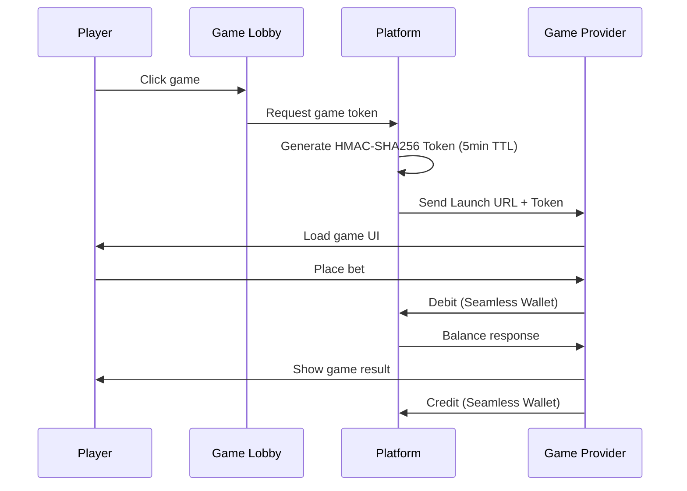
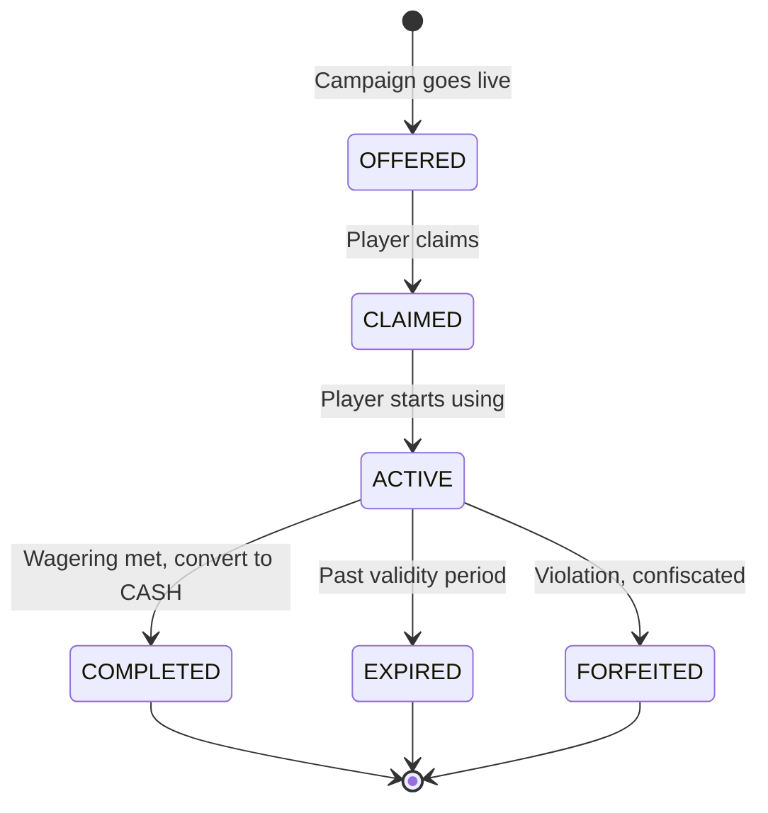

# 04-gaming -- Spec for /deep-plan

> **Split**: 04-gaming (遊戲域)
> **Chapters**: Ch4 遊戲整合 + Ch5 促銷與VIP
> **Depends on**: 02-funding (Seamless Wallet, BONUS 錢包) + 03-player (Token auth, KYC, VIP tier, RFM)
> **Priority**: #4 in execution sequence

---

## Source Documents (Do Not Duplicate)

| Document | Path | Sections Referenced |
|----------|------|---------------------|
| Ch4 遊戲整合 | `requirements/04_Game_Integration_遊戲整合.md` | 4.1--4.12 全部 |
| Ch5 促銷與VIP | `requirements/05_Promotions_VIP_促銷與VIP.md` | 5.1--5.12 全部 |
| Ch0 總覽 (cross-ref) | `requirements/00_Overview_總覽.md` | 0.8 有效投注額, 0.10 平台配置覆蓋 |
| Ch2 錢包系統 (cross-ref) | `requirements/02_Wallet_System_錢包系統.md` | 2.8 Seamless Wallet 協議 |
| Project Manifest | `project-manifest.md` | 04-gaming section |

---

## SSOT Ownership (本 Split 持有的權威定義)

| Item | Location | Description |
|------|----------|-------------|
| Game weight / wagering contribution table | Ch5 SS5.3 | Slots 100%, Sports 50%, Baccarat configurable (default 10%), Blackjack 10%, Roulette 20%, Poker 5% |
| VIP cashback rates | Ch5 SS5.6 | Bronze 5%/0.1%, Silver 10%/0.3%, Gold 15%/0.5%, Platinum 20%/0.8%, Diamond 25%/1.2% |
| Bonus conflict strategies | Ch5 SS5.4 | 6 strategies: MAX_REWARD / PRIORITY / PLAYER_CHOICE / STACK_ALL / TYPE_EXCLUSIVE / SEQUENTIAL |
| Bonus lifecycle rules | Ch5 SS5.5 | State machine: OFFERED --> CLAIMED --> ACTIVE --> COMPLETED/EXPIRED/FORFEITED |

## SSOT References (本 Split 引用、不重複定義)

| Item | SSOT Location | Owner Split |
|------|---------------|-------------|
| Seamless Wallet protocol (5 endpoints) | Ch2 SS2.8 | 02-funding |
| Player Token validation (HMAC-SHA256) | Ch4 SS4.3 / Ch2 SS2.8 | 02-funding |
| Valid Bet -- Standard Principal Method | Ch0 SS0.8 | cross-cutting |
| Risk score boundaries [0,30)/[30,70)/[70,100] | Ch6 SS6.6 | 05-risk-compliance |
| Self-exclusion mechanisms | Ch15 | 03-player |
| Platform config override (3-layer) | Ch0 SS0.10 | cross-cutting |
| Wallet deduction order (BONUS --> CASH --> CREDIT) | Ch2 SS2.4 | 02-funding |

---

## Known Conflicts

| ID | Description | Status |
|----|-------------|--------|
| CONFLICT-01 | Ch0 SS0.8 defines Sports game weight = **100%** (Valid Bet risk factor), but Ch5 SS5.3 defines Sports wagering contribution = **50%**. These may be different concepts: Ch0 treats Sports "game weight" as a risk factor for Valid Bet calculation (where 100% means "count the full bet amount"), while Ch5 treats it as a bonus wagering contribution rate (where 50% means "only half the bet counts toward wagering requirements"). Needs clarification during /deep-plan. | Pending clarification |

---

## Gaps Marked TBD

| ID | Description | Target Phase |
|----|-------------|-------------|
| GAP-SPORTS | Sports Betting Engine -- complete business rules for odds management, market types, live in-play settlement, partial cashout mechanics, and accumulator/parlay handling. Ch4 SS4.8 covers partial settlement at a high level but lacks the full sports-specific rule set. | Phase 4 |
| GAP-10 | GP bankruptcy free spin compensation formula (Ch4 SS4.9) -- pending legal review | v2.2 |
| GAP-ESCROW | GP escrow deposit requirement for top-5 GPs by transaction volume -- pending legal assessment | Contract-time |
| GAP-RISK-RESERVE | GP risk reserve fund at 5% of monthly GGR -- pending CFO confirmation | v2.2 |

---

## Part A: Game Integration (Ch4)

### A1. GP Onboarding Flow

**Target**: 技術對接階段 < 5 個工作天

| Phase | Duration | Output | Gate Criteria |
|-------|----------|--------|---------------|
| Commercial | 1--2 weeks | 合約簽署, API spec exchange | Contract signed |
| Technical Integration | < 5 working days | Adapter 開發, staging 聯調 | All P0 capabilities pass |
| UAT | 2--3 days | Test report, bug fixes | Go-live checklist 9/9 |
| Go-Live Approval | 1 day | Sign-off | Checklist all-pass |
| Post-Launch Monitoring | Ongoing | RTP monitoring, tx monitoring | No CRITICAL alerts in 72h |

### A2. GP Required Capabilities

**P0 (Must-have for launch)**:

| Capability | Requirement |
|------------|-------------|
| Seamless Wallet | Support Debit / Credit / Rollback / GetBalance (ref: Ch2 SS2.8 for protocol SSOT) |
| Token auth | Accept platform-issued HMAC-SHA256 tokens |
| Idempotency | Support `transactionId`-based idempotent retries |

**P1 (Required post-launch or Phase 5+)**:

| Capability | Requirement |
|------------|-------------|
| RTP compliance | Provide RTP report or real-time RTP query |
| Multi-currency | Support player local currency operations |
| Multi-language | Game UI supports i18n |
| Mobile | Support Mobile Web / in-app embed |

### A3. Go-Live Checklist (9 Items)

1. Seamless Wallet 5 端點全部聯調通過
2. Token 驗證流程正確 (簽名驗證 + 過期檢查)
3. 冪等性測試通過 (重複請求回傳相同結果)
4. 餘額不足場景測試通過
5. Rollback 場景測試通過
6. 大額派彩場景測試通過
7. 孤兒回合 (orphan round) 偵測與處理機制確認
8. RTP 監控已配置並生效
9. 遊戲大廳元數據已匯入

### A4. Token Validation

**Reference**: 協議實作細節見 Ch2 SS2.8 (02-funding SSOT)。本節僅定義遊戲域消費端規則。

| Rule | Specification |
|------|---------------|
| Algorithm | HMAC-SHA256 |
| Expiry | 5 minutes |
| Usage | One-time (防重放: 使用後標記已消費, 重複使用一律拒絕) |
| Payload | Must include timestamp, player_id, game_id |
| Failure response | Return `INVALID_TOKEN`, reject operation |
| Expired token policy | **一律拒絕** -- 包含 Win/Credit/Rollback; GP 須透過 Resettlement 或客服工單補發派彩 |

### A5. Game Lobby

**7 Categories**:

| Category | Sub-examples | Sort Logic |
|----------|-------------|-----------|
| Slots (老虎機) | Classic / Video / Progressive Jackpot | Popularity, RTP, New |
| Live Casino (真人) | Baccarat / Roulette / Blackjack / Sic Bo | Popularity, dealer |
| Table Games (桌遊) | Baccarat / Roulette / Blackjack | Popularity |
| Sports (體育) | Football / Basketball / Baseball / Esports | Live events, odds |
| Poker (撲克) | Texas Hold'em / Omaha | Tables, prize pool |
| Fishing (捕魚) | Fishing Master / Ocean Star | Popularity |
| Lottery (彩票) | Lotto / 3D / Quick Draw | Draw time |

### A6. Game Metadata Management

| Field | Description | Update Frequency |
|-------|-------------|-----------------|
| Game name | 多語言 | GP push or 4h sync |
| Thumbnail / cover | CDN distribution | GP push |
| RTP | Theoretical RTP | At onboarding |
| Min/Max bet limits | Dynamic | Real-time adjustable |
| Device support | Desktop / Mobile / Both | At onboarding |
| Tags | Multi-dimensional (theme, features, volatility) | Ops managed |
| Status | Enabled / Disabled / Maintenance | Real-time control |

### A7. Game Lobby KPIs

| KPI | Target | Definition |
|-----|--------|-----------|
| CTR (Click-through rate) | >= 8% | Lobby display --> game launch |
| Conversion rate | >= 12% | Game launch --> first bet |
| CDN hit rate | >= 98% | Asset cache efficiency |
| Load time | < 3s | Click to playable |

### A8. Personalized Recommendations

| Strategy | Logic |
|----------|-------|
| RFM segment-based | 根據玩家 RFM 分群推薦不同類型遊戲 (ref: 03-player for RFM definition) |
| History-based | 根據玩家歷史偏好標籤 (SLOTS_LOVER, LIVE_FAN 等) 個性化排序 |
| New player strategy | 新玩家優先展示高 RTP、低波動遊戲 (降低流失率) |

### A9. Game Launch Flow



**Failure Handling**:

| Failure | Action |
|---------|--------|
| Token expired | Auto-regenerate token, re-launch |
| GP unavailable | Show "Maintenance", guide to other games |
| Insufficient balance | Show deposit prompt |
| Jurisdiction restricted | Show "Not available in your region" |

### A10. RTP Monitoring

| Level | Condition | Action |
|-------|-----------|--------|
| **WARNING** | RTP > 120% AND platform loss > $5,000 / 5min | Alert, enhanced monitoring |
| **CRITICAL** | RTP > 200% AND platform loss > $10,000 / 5min | Auto-suspend game (Circuit Breaker) |
| **GLI-19 violation** | Actual RTP deviates from theoretical > +/-0.5% (long-term) | Notify GP, require investigation |

### A11. UK Additional Rules (UKGC)

| Rule | Specification |
|------|---------------|
| Slots bet cap (18--24 years) | GBP 2 |
| Slots bet cap (25+ years) | GBP 5 |
| Auto-spin interval | >= 2.5 seconds |
| Net P&L display | Mandatory at end of each session |

### A12. GP Maintenance

**Planned maintenance**:

| Item | Rule |
|------|------|
| Advance notice | GP must notify **48 hours** in advance |
| Player notice | Display lobby announcement 1h before maintenance |
| In-progress rounds | Stop new bets 30min before; wait for all rounds to settle |
| During maintenance | Game shows "Maintenance", cannot launch |

**Emergency shutdown triggers**:

| Trigger | Action |
|---------|--------|
| RTP anomaly (CRITICAL) | Auto-suspend, notify GP |
| GP API unreachable | Auto-mark as maintenance |
| Security incident | Manual admin shutdown |

### A13. GP Violation Handling

| Level | Condition | Action | Timeline |
|-------|-----------|--------|----------|
| **Warning** | Monthly RTP deviation > +/-1%, API availability < 99% | Written notice + enhanced monitoring | 7 days to improve |
| **Throttle** | 2 consecutive months unresolved, or settlement delay > 24h | Lower lobby ranking weight | 14 days observation |
| **Suspend** | 3 consecutive months unresolved, or suspected RTP fraud | Suspend new bets; existing rounds continue settlement | Immediate |
| **Delist** | Severe security incident or compliance violation | Remove all GP games | Immediate |

附帶處理: 暫停/下架時須通知受影響玩家，處理未結算投注與未使用免費旋轉。

### A14. Partial Settlement / Partial Cashout

| Scenario | Rule |
|----------|------|
| Sports partial cashout | 玩家可提前結算部分投注 (e.g., 50%), 剩餘繼續 |
| Formula | `Settlement = Bet * early_cashout_ratio * current_odds / original_odds` |
| Wagering impact | 已結算部分按 Valid Bet 計算; 未結算部分在最終結算時計算 |
| Bonus funds | 紅利投注**不允許** Partial Cashout (須完整結算) |

### A15. GP Bankruptcy Player Balance Protection (v2.2 GAP-10)

> Pending legal review for specific terms.

| Scenario | Action | Timeline |
|----------|--------|----------|
| Unsettled bets (OPEN rounds) | 平台自動回滾所有該 GP 的 OPEN 回合, 退還投注金額至玩家錢包 | Immediate |
| GP unpaid Win (Credit) | 平台先行墊付玩家應得的 Win (玩家保護優先) | Within 24h |
| Unused free spins | 沒收並補償等值 CASH (compensation formula TBD) | Within 48h |
| Player notification | 通知所有受影響的活躍玩家 | <= 2h |
| Game delisting | 即時停用該 GP 所有遊戲 | Immediate |
| Regulatory notification | 向所有適用牌照的監管機構報告 | <= 24h |

Financial impact:
- 墊付金額計入「供應商應收帳款」, 透過法律途徑追討
- Risk reserve: 建議按 GP 月度 GGR 的 5% 提撥 (TBD -- pending CFO)
- Top-5 GP by tx volume: 考慮要求提供託管保證金 (TBD -- pending legal)

### A16. Demo / Free Play Mode

| Rule | Description |
|------|-------------|
| Isolation | 與真錢模式完全分離, 不共享餘額 |
| Wagering | 不計入流水要求 |
| Availability | 可於註冊前使用 (吸引新玩家) |
| Limitations | 部分 Live Casino 不提供 Demo |

---

## Part B: Promotions & VIP (Ch5)

### B1. Bonus Types (7 Types)

| # | Type | Chinese | Typical Parameters |
|---|------|---------|-------------------|
| 1 | Welcome Bonus | 歡迎紅利 | 100%--200% match, cap $500, 25x--40x wagering |
| 2 | Reload Bonus | 續存紅利 | 50%--100% match, cap $200, 20x--30x wagering |
| 3 | Free Spins | 免費旋轉 | 10--200 spins, face value $0.10--$1.00 |
| 4 | Cashback / Rebate | 返水 | Loss 5%--25% or turnover 0.2%--0.8% (by VIP) |
| 5 | Referral Bonus | 推薦紅利 | Fixed $10--$50, issued after referee's first deposit |
| 6 | Activity Bonus | 活動紅利 | Tournament, leaderboard -- per activity rules |
| 7 | Birthday Bonus | 生日紅利 | By VIP tier, $10--$500 |

### B2. Referral Bonus Anti-Fraud (v2.2 GAP-4)

| Rule | Specification |
|------|---------------|
| Referrer KYC | Must complete **KYC Level 1+** before referral bonus qualifies |
| Device/IP dedup | Referrer and referee cannot share device fingerprint, IP, or payment method |
| Frequency cap | Max 10 successful referrals per referrer per 30-day rolling window |
| Clawback | Referee account frozen for fraud within 90 days --> referrer bonus auto-clawed back |
| Chain depth | Single-layer only (no "referrer's referrer" rewards) |

### B3. Multi-Deposit Welcome Package

| Deposit | Match Rate | Cap | Wagering |
|---------|-----------|-----|----------|
| First | 200% | $500 | 35x |
| Second | 100% | $300 | 30x |
| Third | 50% | $200 | 25x |

### B4. Wagering Requirement Formula

```
wagering_requirement = bonus_amount * multiplier
valid_bet = bet_amount * risk_factor (0 or 1) * game_weight (5%--100%)
```

**Valid Bet** -- Standard Principal Method (reference Ch0 SS0.8, do not redefine here):
- WIN / LOSS / HALF_WIN / HALF_LOSS: Valid Bet = Bet Amount
- DRAW / VOID: Valid Bet = 0

### B5. Game Weight Table (SSOT -- This Split Owns)

| Game Type | Wagering Contribution | Notes |
|-----------|-----------------------|-------|
| Slots | 100% | Full contribution |
| Sports | 50% | Partial contribution |
| Baccarat | Configurable (default 10%) | Low house edge; Tie bets excluded |
| Blackjack | 10% | Low contribution |
| Roulette | 20% | Hedge bets excluded |
| Poker | 5% | Lowest contribution |
| Other table games | 5%--20% | Per activity definition |

> **CONFLICT-01**: Ch0 SS0.8 lists Sports weight as 100%. That value represents the Valid Bet risk factor (whether to count the bet at all), not the bonus wagering contribution rate defined here. These are distinct concepts operating at different layers. Requires clarification during /deep-plan.

### B6. Free Spin Wagering Calculation

| Item | Rule |
|------|------|
| Turnover calculation | Turnover = Face Value (Free Spin Value) |
| Valid Bet | = 0 (Free Spins do not count toward GGR) |
| Winnings destination | Enter BONUS wallet, subject to wagering requirement |

### B7. Wagering Verification Timing

**Key business rule**: 流水驗證發生在**提款時**, 非即時解鎖。

Flow:
1. Player requests withdrawal
2. System checks wagering progress
3. If not met --> reject withdrawal
4. If met --> BONUS auto-converts to CASH --> allow withdrawal
5. Conversion cap = original bonus amount (excess profit not converted)

### B8. Token Expiry Impact on Wagering Progress (v2.2 BS-01)

| Item | Rule |
|------|------|
| Wagering progress | **NOT rolled back** -- accumulated valid bets are preserved |
| Win funds | Recovered via **Resettlement** process to CASH wallet |
| Resettlement timing | Auto-triggered within 24h after GP reconciliation, or manual via player complaint |
| Rollback | Expired-token Rollback also goes through Resettlement, refund to original wallet |

Decision rationale: Token 過期是系統原因, 非玩家行為。流水進度代表已完成的投注, 不應回滾。

### B9. Three-Layer Verification Architecture

| Layer | Responsibility | Description |
|-------|---------------|-------------|
| Layer 1: Bet Verification | 投注驗證 | 即時判斷投注是否計入流水 (僅拒絕不合規投注) |
| Layer 2: Accumulation | 流水累計 | 累計有效投注額, 更新進度 |
| Layer 3: Withdrawal Verification | 提款驗證 | 提款時檢查流水是否達標 |

### B10. Bonus Conflict -- 6 Strategies (SSOT -- This Split Owns)

| Strategy | Description | Use Case |
|----------|-------------|----------|
| **MAX_REWARD** | 自動選擇金額最高的紅利 | 簡化玩家選擇 |
| **PRIORITY** | 按優先級排序, 取最高優先 | 營運需精確控制 |
| **PLAYER_CHOICE** | 讓玩家自行選擇 | 最佳體驗 |
| **STACK_ALL** | 所有紅利同時生效 | 高促銷期 (慎用) |
| **TYPE_EXCLUSIVE** | 同類型互斥, 不同類型可疊 | 常見做法 |
| **SEQUENTIAL** | 按順序依次完成 | 多段歡迎套餐 |

### B11. Global Limits

| Limit | Value |
|-------|-------|
| Max simultaneous active bonuses | <= 5 |
| Total bonus cap | $10,000 |
| Daily claim limit | <= 3 per day |
| Rule comprehension | Player should understand rules in < 5 seconds |

### B12. Bonus Lifecycle State Machine (SSOT -- This Split Owns)



### B13. Expiry Handling Including Active Bets (v2.2 BS-02)

| Scenario | Action |
|----------|--------|
| Wagering not met, expired | 全額沒收 BONUS 餘額 |
| Wagering met, expired | 按規則轉入 CASH (cap = original bonus amount) |
| **Active bets at expiry (BS-02)** | 立即沒收未使用的 BONUS 餘額。未結算投注繼續正常結算: Win 歸入 **CASH 錢包**, 免除流水要求 (不超過原始紅利額上限); Loss 正常扣除 |
| Expiry notification | 到期前 24h 通知玩家 |
| Daily reconciliation | 每日 03:00 UTC+8 掃描過期紅利 |

### B14. Cashback / Rebate (SSOT for VIP Rates -- This Split Owns)

**Three rebate types**:

| Type | Formula | Target |
|------|---------|--------|
| Loss-based cashback | (Total Bets - Total Payouts) * rate | Losing players recovery |
| Turnover-based rebate | Valid Bet * rate | Active player reward |
| VIP commission | Net Loss * rate | Diamond / Platinum |

**VIP-tier cashback rates (SSOT)**:

| VIP Tier | Loss Cashback | Turnover Rebate | Settlement Cycle |
|----------|--------------|----------------|-----------------|
| Bronze | 5% | 0.1% | Monthly |
| Silver | 10% | 0.3% | Weekly |
| Gold | 15% | 0.5% | Weekly |
| Platinum | 20% | 0.8% | Weekly |
| Diamond | 25% | 1.2% | Daily |

**Interaction rules with bonuses**:

| Rule | Description |
|------|-------------|
| Counts toward wagering? | **No** -- rebate goes to CASH wallet, not subject to wagering |
| Affected by bonus lock? | **No** -- rebate is independent, not restricted by active bonus withdrawal locks |
| Coexistence | Rebate to CASH, bonus in BONUS wallet, no interference |
| Bonus-funded bets in rebate calc | **Configurable** -- default includes all bets |
| Conflict strategy scope | SS5.4 strategies apply **only between bonuses**; rebate is exempt |

### B15. Bonus Abuse Detection

**5 Common Methods**:

| Method | Description | Detection |
|--------|-------------|-----------|
| Multi-account | 同一人多帳戶領紅利 | Device fingerprint / IP / payment method correlation |
| Bonus hunter | 專門低風險刷流水 | Bet pattern analysis (min bet + high turnover) |
| Hedge betting | 同一賽事下相反注 | Same-event opposite bet detection |
| Arbitrage | 利用不同賠率差異套利 | Cross-platform odds comparison |
| Chip dumping | 故意輸給特定帳戶 | W/L anomaly + account correlation |

**Thresholds**:

| Metric | Threshold | Risk Level |
|--------|-----------|-----------|
| Bonus hunter score | >= 60 | FLAG (investigate) |
| Bonus hunter score | >= 90 | BLOCK (ban bonus) |
| Hedge bet amount | > $1,000 on same event | BLOCK |
| Valid bet rate | < 20% for 7 consecutive days | FLAG |
| Multi-account (3+ same device) | -- | URGENT (freeze) |

**Penalties**:

| Severity | Action |
|----------|--------|
| First FLAG | 標記監控, 暫停紅利資格 7 天 |
| Confirmed abuse | 沒收所有 BONUS 餘額 + 紅利產生的盈利 |
| Severe abuse | 帳戶凍結 + 永久禁止領取紅利 |
| Multi-account confirmed | 所有關聯帳戶凍結, 僅保留一個 |

### B16. Regional Promotions

**SEA (東南亞)**:
- Festival-driven: 農曆新年, 宋干節, 開齋節, 中秋節
- Mobile-first: App size < 5MB
- Fishing game promotions (high popularity)
- Lucky numbers: 8, 88, 888, 9 (avoid 4)
- Color scheme: Red / Gold

**LATAM (拉丁美洲)**:
- Football dominates: 81% of bets
- PIX is essential: 81--90% of players use PIX
- Do not promote credit card deposits

**EU / UKGC (歐洲)**:
- Max wagering multiplier: 10x
- No mixed products (gambling + non-gambling bonus cannot be combined)
- Slots bet cap: GBP 5 (25+) / GBP 2 (18--24)
- GDPR Opt-In required for marketing messages
- Germany: advertising curfew rules

### B17. Promotion Management

**Approval workflow**:

| Operation | Requirement |
|-----------|-------------|
| Create new campaign | Maker-Checker (creator + approver) |
| Modify sensitive parameters | Escalated approval required |
| Emergency stop | Any admin can execute; post-hoc approval |

**Configuration requirements**:
- 所有促銷參數**不可硬編碼**, 必須可配置 (ref: Ch0 SS0.10 三層覆蓋)
- 參數變更即時生效, 無需部署
- 所有配置變更留審計記錄

**Daily reconciliation**:

| Item | Rule |
|------|------|
| Time | 每日 03:00 UTC+8 |
| Scope | 紅利發放 vs 紅利核銷 vs 流水達標 |
| Tolerance | <= 0.01% |

---

## Success Metrics Summary

### Game Integration Metrics (Ch4)

| Metric | Target |
|--------|--------|
| GP onboarding time (technical) | < 5 working days |
| Game availability | >= 99.9% (excl. planned maintenance) |
| Seamless Wallet tx success rate | >= 99.95% |
| Game launch success rate | >= 99.5% |
| RTP compliance rate | 100% (all games GLI-19 compliant) |
| API response time (P95) | < 200ms |

### Promotion Metrics (Ch5)

| Metric | Target |
|--------|--------|
| Bonus cost as % of GGR | <= 15% |
| Wagering completion rate | >= 30% |
| Bonus-related complaint rate | <= 2% |
| Reconciliation accuracy | <= 0.01% variance |
| Abuse detection rate | >= 70% |
| Bonus ROI | >= 1.2x |
| First deposit conversion uplift | +10% |
| 30-day retention uplift | +5% |
| Bonus abuse rate | < 3% |

### Performance Targets (Ch5)

| Metric | Target |
|--------|--------|
| Bonus issuance latency | < 100ms (P99) |
| Wagering calculation update | < 200ms |
| Bonus query response | < 50ms |
| System success rate | > 99.9% |

---

## Dependency Interface Summary

此 split 在 /deep-plan 階段需要從依賴 split 獲取的介面定義:

### From 02-funding

| Interface | Purpose | Reference |
|-----------|---------|-----------|
| Seamless Wallet 5 endpoints | GP 投注/派彩/回滾/查餘額 | Ch2 SS2.8 |
| BONUS wallet operations | 紅利錢包存取、凍結、轉換至 CASH | Ch2 SS2.4 |
| Wallet deduction order | BONUS --> CASH --> CREDIT | Ch2 SS2.4 |
| Resettlement process | Token 過期後的補結算機制 | Ch2 SS2.8 |

### From 03-player

| Interface | Purpose | Reference |
|-----------|---------|-----------|
| Player Token issuance | 遊戲啟動用 HMAC-SHA256 Token | Ch4 SS4.3 |
| KYC level query | 推薦紅利需 KYC L1+ | Ch1 |
| VIP tier query | VIP 等級決定返水率 | Ch1 SS1.5 |
| RFM segment | 個人化推薦依據 | Ch1 |
| Self-exclusion status | 遊戲啟動前檢查 | Ch15 |
| Player age (for UKGC) | Slots bet cap by age bracket | Ch1 |

### To 05-risk-compliance (Downstream Consumer)

| Interface | Purpose | Reference |
|-----------|---------|-----------|
| Bet data feed | 風控五層管線的投注數據輸入 | Ch6 |
| Bonus abuse flags | 紅利濫用偵測結果同步至風控 | Ch6 |
| RTP anomaly events | RTP 異常事件通知風控 | Ch6 |

---

## /deep-plan Execution Notes

在進入 /deep-plan 時, 請注意以下事項:

1. **CONFLICT-01 resolution**: 優先釐清 Sports game weight 100% (Ch0) vs wagering contribution 50% (Ch5) 是否為不同概念。如確認為不同概念, 需在技術實作中明確分層 (Valid Bet layer vs Wagering layer)。
2. **GAP-SPORTS**: Sports Betting Engine 為 Phase 4 範圍, /deep-plan 階段僅需定義介面邊界 (odds API, settlement events, partial cashout protocol), 不需完整實作規格。
3. **Three-layer wagering verification** (B9) 的技術架構設計是本 split 的核心複雜度, 需與 02-funding 的 Seamless Wallet event stream 對齊。
4. **Bonus lifecycle state machine** (B12) 需設計 event-driven transitions, 與 wallet operations 和 risk events 的整合點。
5. **Regional promotion rules** (B16) 需與 Ch0 SS0.10 的三層配置覆蓋架構整合 (Jurisdiction --> Brand --> Global)。
6. **GP bankruptcy protection** (A15) 的 Resettlement 和 auto-rollback 機制需與 02-funding 的 transaction reversal 協議對齊。
