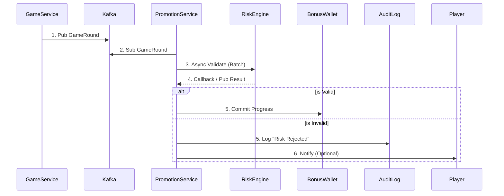

# 04-02 獎金計算引擎 (Bonus Calculation Engine)

> **文檔定位**: 活動中心 P0 核心 - 流水計算與多獎金衝突處理
> **三層風控架構**: Layer 3 - 活動遊戲權重應用（跨遊戲流水計算）
> **最後更新**: 2026-02-07
> **拆分說明**: 原 04-01 文檔已拆分為 3 個獨立主題，本文檔專注於獎金計算與流水追蹤

---

## 文檔導航

**當前位置**: 04-02 獎金計算引擎（流水計算與多獎金衝突處理）

**相關文檔**:
- **[← 返回活動中心索引](README.md)**
- **[← 04-01 活動系統架構](archive/04-01_Activity_System_Design_v1.0.0.md)** - 系統架構與規則引擎設計
- **[→ 04-03 活動風控與本地化](04-03_Activity_Risk_Control.md)** - 風控機制與區域市場策略

---

## 概述

本文檔詳述活動系統的核心計算引擎，包括跨遊戲類型的統一流水計算框架（Layer 3）、事件驅動架構實現即時活動觸發，以及多獎金衝突處理決策矩陣。這是確保活動系統與財務系統數據一致性的關鍵模塊。

---

## 跨遊戲類型的統一流水計算框架 (Layer 3 核心邏輯)

### 前置條件

- ✅ Layer 1: 通過風控驗證 (05-01 §3.1)
- ✅ Layer 2: 計算狀態因子 (02-04 §1.2)

不同遊戲類型的莊家優勢差異巨大（老虎機 ~5%、二十一點 ~0.5%），必須透過**貢獻率系統**標準化流水計算。

### 遊戲權重應用 (Game Weight Application)

活動系統需針對不同遊戲類型應用不同的流水權重（貢獻率）：

|遊戲類型|典型貢獻率 (GameWeight)|原因說明|範例計算|
|---|---|---|---|
|老虎機/Slots|100%|高莊家優勢，標準基準|$100 投注 = $100 流水|
|體育博彩|100%|結果不可控，風險可接受|$100 投注 = $100 流水 (需通過賠率閾值)|
|刮刮卡|100%|單次結果型遊戲|$100 投注 = $100 流水|
|輪盤|10-20%|可對沖投注|$100 投注 = $15 流水|
|百家樂|10-15%|接近 50/50 賠率|$100 投注 = $15 流水|
|二十一點|5-10%|低莊家優勢，可計牌|$100 投注 = $10 流水|
|視頻撲克|10-20%|策略可降低莊家優勢|$100 投注 = $15 流水|
|真人娛樂場|5-15%|與桌遊類似|$100 投注 = $10 流水|
|撲克（抽水池）|0%|玩家對玩家，通常排除|$100 投注 = $0 流水|

### 完整公式 (三層架構整合)

```
ValidTurnover = BetAmount
                × Layer1_RiskFactor     (05-01: 0 or 1)
                × Layer2_StatusFactor   (02-04: 0%, 50%, 100%)
                × Layer3_GameWeight     (本節: 5%-100%)

範例：在二十一點投注 $100，貢獻率 10%
- Layer 1: RiskFactor = 1 (通過風控)
- Layer 2: StatusFactor = 100% (WIN/LOSS)
- Layer 3: GameWeight = 10%
→ ValidTurnover = $100 × 1 × 100% × 10% = $10 計入流水要求
```

### 統一玩家活動追蹤事件結構

```json
{
  "eventType": "GAME_ROUND_COMPLETED",
  "timestamp": "2026-01-24T15:30:00+08:00",
  "playerId": "player-uuid",
  "tenantId": "operator-uuid",
  "vertical": "CASINO",
  "gameType": "SLOTS",
  "gameId": "game-uuid",
  "providerId": "provider-uuid",
  "data": {
    "betAmount": 10.00,
    "winAmount": 25.00,
    "currency": "USD",
    "roundId": "round-uuid"
  },
  "bonusContext": {
    "activeBonusId": "bonus-uuid",
    "contributionRate": 100,
    "effectiveContribution": 10.00,
    "progressBefore": 500.00,
    "progressAfter": 510.00,
    "requiredTotal": 3000.00
  }
}
```

---

## 有效流水驗證邏輯 (Valid Turnover Validation)

流水計算不應只看 "Bet Amount"，必須過濾 **無風險投注 (Risk-Free Bet)** 與 **對沖投注 (Hedge Betting)**。為避免影響遊戲即時性，此過程採用 **非同步驗證 (Asynchronous Validation)**。

### 驗證流程 (Validation Flow)

1. **事件接收**: `Promotion Service` 收到 `GameRound` 事件，先標記流水狀態為 `PENDING`
2. **異步風控**:
   - 將注單 ID 發送至 Kafka Topic `risk.turnover.validate`
   - 調用 `RiskEngine.validateTurnover(batchBets)` (參見 05-01)
3. **結果處理**:
   - **Valid**: 更新流水狀態為 `COMPLETED`，累積進度
   - **Invalid (Hedge/Arbitrage)**:
     - 更新狀態為 `REJECTED`
     - 記錄拒絕原因 (e.g. `Reason: HEDGE_BET_DETECTED`)
     - 若已發放獎勵，觸發 **Rollback** 機制扣回

### 數據流圖



---

## 統一流水驗證架構 (Unified Turnover Validation Architecture)

為確保 **Activity System (活動系統)** 與 **Finance System (財務系統, 02-04)** 的流水計算一致性，兩者必須共用統一的基礎驗證邏輯，避免產生數據偏差導致玩家投訴或財務風險。

### 架構原則 (Architecture Principles)

```
┌─────────────────────────────────────────────────────────────────┐
│              Unified Turnover Validation Stack                  │
├─────────────────────────────────────────────────────────────────┤
│                                                                 │
│  Layer 1: Base Validation (Single Source of Truth)             │
│  ┌───────────────────────────────────────────────────────────┐ │
│  │  RiskEngine.validateTurnover() (05-01 Risk Control)       │ │
│  │  - Filter: Hedge Detection (對沖投注檢測)                  │ │
│  │  - Filter: Arbitrage Detection (套利投注檢測)              │ │
│  │  - Filter: Low Odds (<1.5, configurable)                  │ │
│  │  - Output: effective_turnover_base (基礎有效流水)          │ │
│  └───────────────────────────────────────────────────────────┘ │
│                           ↓                                     │
│  Layer 2: Finance Layer (02-04 Finance Center)                 │
│  ┌───────────────────────────────────────────────────────────┐ │
│  │  effective_turnover_base × status_factor                  │ │
│  │  - WIN: 1.0 (玩家贏,計入流水)                              │ │
│  │  - LOSS: 1.0 (玩家輸,計入流水)                             │ │
│  │  - DRAW/TIE: 0 (和局,無風險,不計流水)                      │ │
│  │  - VOID/CANCEL: 0 (注單作廢)                               │ │
│  │  - HALF_WIN/HALF_LOSS: 0.5 (半贏半輸)                      │ │
│  │  → Output: valid_turnover_finance (財務有效流水)           │ │
│  └───────────────────────────────────────────────────────────┘ │
│                           ↓                                     │
│  Layer 3: Activity Layer (04-01 Activity Center)               │
│  ┌───────────────────────────────────────────────────────────┐ │
│  │  valid_turnover_finance × game_weight                     │ │
│  │  - Slots (老虎機): 1.0 (100% contribution)                 │ │
│  │  - Sports (體育): 1.0                                      │ │
│  │  - Baccarat (百家樂): 0.1-0.15 (10-15%)                    │ │
│  │  - Blackjack (二十一點): 0.05-0.1 (5-10%)                  │ │
│  │  - Roulette (輪盤): 0.1-0.2                                │ │
│  │  → Output: activity_valid_turnover (活動有效流水)          │ │
│  └───────────────────────────────────────────────────────────┘ │
│                                                                 │
└─────────────────────────────────────────────────────────────────┘
```

### API 契約定義 (API Contract Definition)

**Base Validation API** (Provided by Risk Engine - 05-01):

```typescript
// Risk Engine provides this API for cross-module consumption
interface ValidateTurnoverRequest {
  bet_id: string;
  player_id: string;
  game_type: GameType;  // SLOTS, SPORTS, BACCARAT, etc.
  bet_amount: number;
  odds: number;
  odds_type: OddsType;  // EUR, HK, MY, ID
  bet_pattern?: BetPattern[];  // For multi-bet analysis
}

interface ValidateTurnoverResponse {
  is_valid: boolean;
  effective_turnover_base: number;  // Base valid turnover after risk checks
  risk_code: RiskCode;  // VALID, HEDGE_DETECTED, ARBITRAGE, LOW_ODDS
  rejection_reason?: string;
}

// Example usage:
const result = await RiskEngine.validateTurnover({
  bet_id: "bet-uuid-001",
  player_id: "player-uuid-123",
  game_type: GameType.BACCARAT,
  bet_amount: 100,
  odds: 1.95,
  odds_type: OddsType.EUR
});
// Returns: { is_valid: true, effective_turnover_base: 100, risk_code: "VALID" }
```

### 計算鏈路示例 (Calculation Chain Example)

假設玩家在百家樂 (Baccarat) 投注 $100，賠率 1.95 (歐洲盤)，最終結果 WIN:

```
Step 1 (Risk Engine - 05-01):
  Input: bet_amount = $100, odds = 1.95, game = BACCARAT
  Check: odds >= 1.5 ✓, no hedge detected ✓
  Output: effective_turnover_base = $100

Step 2 (Finance Layer - 02-04):
  Input: effective_turnover_base = $100, status = WIN
  Apply: status_factor = 1.0 (WIN counts as valid)
  Output: valid_turnover_finance = $100 × 1.0 = $100

Step 3 (Activity Layer - 04-01):
  Input: valid_turnover_finance = $100, game = BACCARAT
  Apply: game_weight = 0.15 (15% contribution for baccarat)
  Output: activity_valid_turnover = $100 × 0.15 = $15

Result:
  - Finance System records: $100 valid turnover (for VIP/rebate)
  - Activity System records: $15 wagering progress (for bonus clearing)
```

### 跨模組一致性保障機制 (Cross-Module Consistency Mechanisms)

1. **統一事件源 (Unified Event Source)**:
   - 所有注單結算事件 `GameRound.Settled` 必須同時發送至:
     - Finance Turnover Service (財務流水服務)
     - Activity Wagering Service (活動流水服務)
   - 兩者均訂閱相同的 Kafka Topic: `game.rounds.settled`

2. **同步驗證調用 (Synchronized Validation Call)**:
   - Finance 與 Activity 模組均需調用 `RiskEngine.validateTurnover()` 作為第一步
   - 不可各自實作風控邏輯，避免邏輯分歧

3. **每日對帳報告 (Daily Reconciliation Report)**:
   - **執行時間**: 每日凌晨 03:00 (after daily settlement)
   - **警報觸發**: 若任何玩家的偏差 >0.01%，觸發 Slack/Email 警報至財務與風控團隊
   - **根因分析**: 常見原因包括:
     - 時區差異 (Finance 用 UTC, Activity 用 Local Time)
     - 重複計算 (同一注單被處理兩次)
     - 遊戲權重配置不一致

4. **配置集中管理 (Centralized Configuration)**:
   - **遊戲權重表 (Game Weight Table)** 必須存放於統一配置服務 (Config Service)
   - Finance 與 Activity 模組均需從此服務讀取，禁止硬編碼 (Hardcoding)
   - 範例配置結構:
     ```json
     {
       "game_weights": {
         "SLOTS": 1.0,
         "SPORTS": 1.0,
         "BACCARAT": 0.15,
         "BLACKJACK": 0.10,
         "ROULETTE": 0.20
       },
       "odds_thresholds": {
         "EUR": 1.5,
         "HK": 0.5,
         "MY": 0.5,
         "ID": 1.2
       }
     }
     ```

---

## 事件驅動架構實現即時活動觸發

採用 Apache Kafka 作為事件總線，實現毫秒級的活動觸發響應：

### 事件處理流程

```
玩家動作 → 遊戲服務 → Kafka Topic →
  → 活動觸發消費者
    → 資格檢查服務
    → 獎勵計算服務
    → 錢包服務（發放）
    → 通知服務（推播/站內信）
```

### 關鍵 Topic 結構

```
Topics:
├── player.activity.casino     # 娛樂場遊戲活動
├── player.activity.sports     # 體育投注活動
├── player.activity.poker      # 撲克活動
├── player.deposits            # 存款事件
├── player.registrations       # 註冊事件
├── promotion.triggers         # 活動觸發
├── promotion.claims           # 活動領取
├── reward.distributions       # 獎勵發放
└── wagering.updates           # 流水更新
```

### 推薦技術棧

|層級|技術選型|用途|
|---|---|---|
|API 閘道|Kong / AWS API Gateway|限流、認證、路由|
|服務通訊|gRPC（內部）/ REST（外部）|高效內部調用|
|事件串流|Apache Kafka + Kafka Streams|即時事件處理|
|主數據庫|PostgreSQL + JSONB|活動配置、ACID 事務|
|高併發寫入|ScyllaDB / CockroachDB|流水記錄、交易日誌|
|緩存|Redis Cluster|玩家狀態、活動快取|
|搜尋|Elasticsearch|活動搜尋、玩家查詢|

---

## 多獎金衝突處理決策矩陣 (Multi-Bonus Conflict Resolution Matrix)

**概述**：當玩家同時符合多個活動時，系統需要明確的衝突處理策略，避免活動疊加濫用或用戶體驗混亂。

### 衝突處理策略對比表

| 策略類型 | 適用場景 | 優點 | 缺點 | 用戶體驗 | 實施複雜度 |
|---------|---------|------|------|---------|-----------|
| **取最高 (MAX_REWARD)** | 互斥首存活動 | 簡單明瞭，玩家獲益最大 | 可能浪費低價值活動配置 | ⭐⭐⭐⭐⭐ | 🟢 低 |
| **按優先級 (PRIORITY)** | VIP 等級活動 | 可控性強，符合業務邏輯 | 玩家可能不理解為何被分配低獎勵 | ⭐⭐⭐ | 🟢 低 |
| **玩家選擇 (PLAYER_CHOICE)** | 多樣化活動池 | 用戶自主權最高 | 決策疲勞，可能選錯後投訴 | ⭐⭐⭐⭐ | 🟡 中 |
| **全部疊加 (STACK_ALL)** | 返水 + 簽到 | 用戶滿意度最高 | 成本失控風險，易被濫用 | ⭐⭐⭐⭐⭐ | 🟡 中 |
| **同類型互斥 (TYPE_EXCLUSIVE)** | 混合活動組 | 平衡成本與體驗 | 規則複雜，需清晰說明 | ⭐⭐⭐⭐ | 🟡 中 |
| **順序模式 (SEQUENTIAL)** | 新手任務鏈 | 引導用戶行為，延長留存 | 靈活性差，用戶可能放棄 | ⭐⭐⭐ | 🔴 高 |
| **隔離流水 (ISOLATED_WAGER)** | 多紅利疊加 | 公平透明，易追蹤 | 用戶需理解多個流水池 | ⭐⭐⭐⭐ | 🟡 中 |
| **共用流水 (SHARED_WAGER)** | 簡化用戶體驗 | 用戶理解成本低 | 後台邏輯複雜，易出錯 | ⭐⭐⭐⭐⭐ | 🔴 高 |

### 業界最佳實踐配置範例

```json
{
  "conflict_resolution_config": {
    "default_policy": "TYPE_EXCLUSIVE",
    "rules": [
      {
        "conflict_group": "first_deposit_bonuses",
        "type": "MUTUALLY_EXCLUSIVE",
        "resolution_strategy": "MAX_REWARD",
        "members": ["promo-first-deposit-100", "promo-first-deposit-200", "promo-vip-first-deposit"],
        "reason": "首存活動互斥，自動選擇獎勵最高的"
      },
      {
        "conflict_group": "cashback_programs",
        "type": "STACKABLE",
        "resolution_strategy": "STACK_ALL",
        "max_total_percentage": 5.0,
        "members": ["daily-cashback", "vip-cashback", "game-specific-cashback"],
        "reason": "返水可疊加但總計不超過 5%"
      },
      {
        "conflict_group": "free_spins_offers",
        "type": "PLAYER_CHOICE",
        "resolution_strategy": "PLAYER_SELECT",
        "max_selections": 1,
        "members": ["free-spins-50", "free-spins-100-wagered", "mega-spins-10"],
        "reason": "免費旋轉類型差異大，讓玩家選擇"
      }
    ],
    "wagering_mode": {
      "default": "ISOLATED",
      "cross_category_shared": false,
      "completion_order": "PRIORITY_ASC"
    },
    "game_contribution_policy": {
      "default": "UNIFIED",
      "allow_activity_override": true,
      "conflict_resolution": "MIN_CONTRIBUTION"
    },
    "global_limits": {
      "max_active_bonuses_per_player": 5,
      "max_total_bonus_balance": 10000,
      "max_daily_claim_count": 3
    }
  }
}
```

### 典型衝突場景決策樹

| 場景 | 匹配活動 | 衝突類型 | 決策策略 | 最終結果 |
|------|---------|---------|---------|---------|
| **新玩家首存 $100** | • 首存 100% (max $100)<br/>• 首存 50% (無上限)<br/>• VIP 銅牌 20% | 互斥組 | MAX_REWARD | 選擇 100% → $100 bonus |
| **VIP 金牌週末存款 $500** | • 週末 50% (max $200)<br/>• VIP 金牌 30% (max $500)<br/>• 全站返水 1% | 同類型互斥 + 可疊加 | TYPE_EXCLUSIVE + STACK | 存款獎勵: $200 (取最高)<br/>返水: $5<br/>Total: $205 |
| **玩家同時領取 3 個免費旋轉** | • 每日簽到 10 spins<br/>• 新遊戲推廣 50 spins<br/>• 損失補償 20 spins | 全部可疊加 | STACK_ALL | Total: 80 spins<br/>分別追蹤有效期 |
| **二存玩家嘗試領取首存獎勵** | • 首存 100% (已領過)<br/>• 二存 50% | 使用次數限制 | ELIGIBILITY_CHECK | 拒絕首存 (maxClaims=1)<br/>允許二存 → $50 bonus |
| **高風險玩家存款** | • 首存 100%<br/>• 週末 50% | 風控阻斷 | RISK_REJECTION | 全部拒絕<br/>標記: PENDING_MANUAL_REVIEW |

### 運營優化建議

1. **避免過度複雜化**：
   - 衝突規則不要超過 3 層
   - 用戶應在 5 秒內理解為何獲得某獎勵

2. **透明化決策**：
   - 在活動條款明確說明互斥規則
   - 被拒絕的活動應說明原因 (如：「您已選擇更高獎勵的活動」)

3. **監控濫用模式**：
   - 玩家頻繁在多活動間切換 → 疑似測試套利空間
   - 大量玩家投訴「為何沒拿到 XX 活動」 → 衝突規則不清晰

4. **A/B 測試策略效果**：
   - 測試 MAX_REWARD vs PRIORITY 對玩家滿意度的影響
   - 測試 ISOLATED_WAGER vs SHARED_WAGER 對完成率的影響

---

## 相關文檔

### 核心依賴
- [02-06 統一錢包模型](../02_Finance_Center/02-06_Wallet_Architecture.md) - Bonus 錢包整合
- [02-04 流水計算與對帳](../02_Finance_Center/02-04_Turnover_and_Game_Reconciliation_Analysis.md) - Layer 2 狀態因子
- [05-01 風控系統](../05_Risk_Control/05-01_Risk_Framework.md) - Layer 1 風控驗證

### 業務整合
- [04-00 活動中心索引](README.md) - 模塊導航
- [04-03 活動風控與本地化](04-03_Activity_Risk_Control.md) - 風控機制

---

**文檔版本**: 1.0.0
**創建日期**: 2026-02-07
**維護團隊**: Activity Team & Backend Team
