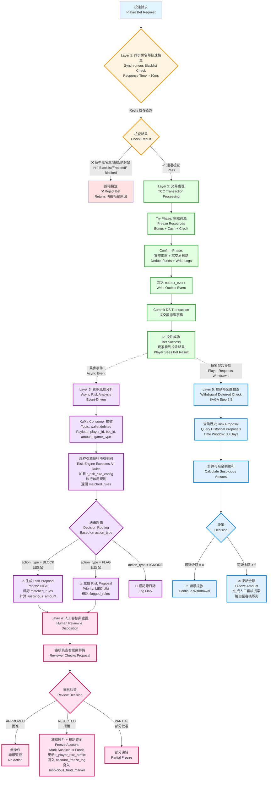

# 04-02 欺詐檢測 (Fraud Detection)

## 📋 文檔信息

**文檔版本**: 2.0.0
**最後更新**: 2026-02-04
**維護團隊**: Risk Team & Backend Team
**前置依賴**:
- [04-01 風控框架](./04-01_Risk_Framework.md) - 配置驅動風控規則引擎 (§9)
- [02-01 出金風控](../01_Player_Center/01-05_Withdrawal_Risk.md) - SAGA Step 2.5 延遲風控檢查
- [02-04 流水計算](../02_Finance_Center/02-04_Turnover_and_Game_Reconciliation_Analysis.md) - Layer 1 處理流程

---

## 🎯 執行摘要

SmartAdmin iGaming v2.1.0 引入「配置驅動風控系統」(Configuration-Driven Risk Control System)，允許運營方自行配置每條風控規則的處理方式（實時阻斷 BLOCK vs 延遲檢查 FLAG），實現靈活的風控策略管理。

### 核心特性

| 特性 | 說明 | 業務價值 |
|------|------|---------|
| **配置驅動** | action_type 由數據庫配置決定（BLOCK/FLAG/IGNORE） | 無需修改代碼即可調整風控策略 |
| **人工為主** | 異常時生成風控提案，人工審核處理 | 簡化決策邏輯，避免過度自動化 |
| **平等對待** | 所有玩家都經過風控（無 VIP 豁免） | 合規要求，公平性原則 |
| **客戶選擇** | 運營方自行決定風控強度 | 提升客戶滿意度，支持多市場策略 |

### 與傳統風控的差異

| 維度 | 傳統風控 (v2.0.0) | 配置驅動風控 (v2.1.0) |
|------|-----------------|---------------------|
| **規則分類** | ❌ 硬編碼 P0/P1/P2 (30%/50%/20%) | ✅ 配置驅動（客戶自選 BLOCK/FLAG） |
| **VIP 豁免** | ❌ VIP Level ≥3 豁免風控 | ✅ 所有玩家平等（無豁免） |
| **異常處理** | ❌ 複雜自動化閾值判斷 | ✅ 人工審核為主 |
| **策略調整** | ❌ 需要修改代碼 + 發布 | ✅ 僅需更新配置表 |
| **靈活性** | ❌ 固定百分比，無法調整 | ✅ 每條規則獨立配置 |

---

## 1. 系統概述

### 1.1 配置驅動風控概念

**定義**: 配置驅動風控是一種將風控規則的處理方式（BLOCK/FLAG/IGNORE）從代碼邏輯中抽離到數據庫配置表的架構模式。

**核心理念**:
- ✅ 規則處理方式由配置決定（非硬編碼）
- ✅ 運營方可自行調整風控策略（無需開發介入）
- ✅ 支持 A/B 測試和多市場策略
- ✅ 所有配置變更記錄審計日誌

### 1.2 與被動風控的關係

**被動風控 (Passive Risk Control)**: 投注時不阻斷，延遲到取款時檢查。

**配置驅動風控 (Configuration-Driven Risk Control)**: 允許同時配置「主動規則」(BLOCK) 和「被動規則」(FLAG)。

```
配置驅動風控 = 異步主動風控 (BLOCK 生成高優先級提案)
              + 異步被動風控 (FLAG 生成中優先級提案)
              + 僅記錄 (IGNORE)
                   ↓                        ↓                  ↓
          投注成功後異步分析         投注成功後異步分析      僅記錄日誌
          生成 Risk Proposal (HIGH)  生成 Risk Proposal (MEDIUM)
```

> **⚠️ 重要說明**：
> - **同步阻斷**僅限於：黑名單玩家、IP 封禁、賬戶凍結（Layer 1 快速檢查）
> - **所有其他 BLOCK/FLAG 規則**均在投注成功後異步執行（Layer 3 風控分析）
> - **BLOCK 規則不再拒絕投注**，而是生成高優先級 Risk Proposal 供人工審核
> - **資金攔截時機**：提款時延遲檢查（Layer 5 - SAGA Step 2.5）

**優勢**:
- ✅ **零誤殺**：投注已成功，風控只負責事後標記，可糾正誤判
- ✅ **高可用**：風控系統故障不影響投注流程（Fail Open 原則）
- ✅ **低延遲**：投注響應時間不受風控分析影響（異步處理）
- ✅ **靈活性**：運營方可根據市場需求調整規則優先級（HIGH/MEDIUM/LOW）
- ✅ **合規性**：符合 DraftKings/FanDuel/Bet365/UKGC 業界最佳實踐

### 1.3 適用場景

**Layer 1：同步阻斷（極少數，<10ms）**:
> 這些場景會在投注請求階段立即拒絕，使用 Redis 緩存快速檢查。

- ✅ **黑名單玩家**（已確認欺詐者）
- ✅ **IP 封禁**（已知攻擊來源）
- ✅ **賬戶凍結**（人工審核中）
- ✅ **監管自我排除名單**（UKGC/MGA 要求）

**Layer 3：異步 BLOCK 規則（絕大多數，~5 秒）**:
> 這些規則在投注成功後異步執行，生成高優先級 Risk Proposal。

- ✅ **機器人檢測** (Bot Detection) - 行為特徵分析
- ✅ **同局反向投注** (Same Match Hedging) - 需要查詢歷史投注
- ✅ **同 IP 對沖** (Same IP Arbitrage) - 需要關聯分析
- ✅ **異常賠率檢測** (Abnormal Odds) - 需要統計分析
- ✅ **洗水行為** (Turnover Manipulation) - 需要計算流水

**Layer 3：異步 FLAG 規則（中優先級，~5 秒）**:
> 這些規則在投注成功後異步執行，生成中優先級 Risk Proposal。

- ✅ **跨局反向投注** (Cross Match Hedging) - 風險較低
- ✅ **低賠率洗水** (<1.5 odds) - 需人工判斷
- ✅ **異常投注模式** (Abnormal Pattern) - 可能誤報
- ✅ **高頻投注** (>10 bets/min) - 需觀察趨勢

**適合使用 IGNORE（僅記錄）**:
- ✅ 實驗性規則（待驗證有效性）
- ✅ 數據收集規則（用於分析）

### 1.4 系統架構



**架構說明 (v3.0.0 - 異步風控架構)**：

### 關鍵設計原則

1. **最小化同步阻斷（Layer 1）**：
   - 只檢查極少數硬規則：黑名單、IP 封禁、賬戶凍結
   - 使用 Redis 緩存，響應時間 <10ms
   - 失敗開放原則（Fail Open）：風控系統故障時，默認放行

2. **投注優先完成（Layer 2）**：
   - TCC 交易模式確保投注成功
   - 玩家立即看到投注結果
   - 風控不影響投注體驗

3. **異步風控分析（Layer 3）**：
   - Kafka + Flink 事件驅動架構
   - 5 秒內完成所有規則分析
   - BLOCK/FLAG 規則生成 Risk Proposal，不拒絕投注

4. **人工審核為主（Layer 4）**：
   - 自動化只負責生成提案
   - 最終決策由審核員執行
   - 避免機器學習模型誤殺

5. **事後資金攔截（Layer 5）**：
   - 提款時查詢歷史提案（30 天）
   - 可疑金額攔截在提款階段
   - 符合業界最佳實踐（DraftKings/FanDuel/Bet365/UKGC）

### 與原架構的關鍵差異

| 項目 | 原架構（v2.1.0） | 新架構（v3.0.0） |
|-----|----------------|----------------|
| **風控觸發時機** | 投注請求時（同步） | 投注成功後（異步） |
| **BLOCK 規則處理** | 拒絕投注 | 生成高優先級提案 |
| **FLAG 規則處理** | 允許投注 + 生成提案 | 生成中優先級提案 |
| **黑名單檢查** | 與其他規則混合 | 獨立的同步檢查層 |
| **資金攔截時機** | 投注時阻斷 | 提款時延遲檢查 |
| **誤殺風險** | 5-10% 正常玩家被拒絕 | 零誤殺（投注已成功） |
| **系統可用性** | 單點故障（風控故障 → 投注失敗） | 高可用（風控故障不影響投注） |

### 業界參考

- **DraftKings/FanDuel（美國市場）**：只有黑名單同步阻斷，其他全部異步
- **Bet365（英國市場）**：對沖檢測在投注成功後 5 分鐘內分析
- **UKGC 合規架構**：推薦事後風控 + 提款時攔截

---

## 2. 風控提案服務 (Risk Proposal Service)

### 2.1 提案數據模型

**t_risk_proposal 表結構**:

```sql
CREATE TABLE t_risk_proposal (
    id BIGINT PRIMARY KEY AUTO_INCREMENT COMMENT '提案 ID',
    proposal_no VARCHAR(50) NOT NULL UNIQUE COMMENT '提案編號 (如 RP-20260202-123456)',

    -- 關聯資訊
    bet_id VARCHAR(50) NOT NULL COMMENT '注單 ID',
    player_id BIGINT NOT NULL COMMENT '玩家 ID',
    withdrawal_request_id BIGINT COMMENT '取款請求 ID (若關聯取款)',

    -- 風控資訊
    matched_rules JSON NOT NULL COMMENT '匹配的風控規則列表 (如 ["LOW_ODDS_WAGERING", "CROSS_MATCH_HEDGE"])',
    flagged_reasons JSON NOT NULL COMMENT '標記原因列表',
    suspicious_amount DECIMAL(15, 2) NOT NULL COMMENT '可疑金額',

    -- 狀態管理
    status VARCHAR(20) NOT NULL COMMENT '提案狀態 (PENDING_REVIEW/APPROVED/REJECTED/PARTIAL_APPROVED)',
    priority VARCHAR(20) DEFAULT 'MEDIUM' COMMENT '優先級 (LOW/MEDIUM/HIGH/URGENT)',

    -- 審核資訊
    reviewer_id BIGINT COMMENT '審核員 ID',
    reviewed_at DATETIME COMMENT '審核時間',
    review_notes TEXT COMMENT '審核備註',
    approved_amount DECIMAL(15, 2) COMMENT '批准金額（部分批准場景）',

    -- 補償資訊
    compensation_type VARCHAR(20) COMMENT '補償類型 (REFUND/ADJUSTMENT/DEDUCTION)',
    compensation_amount DECIMAL(15, 2) COMMENT '補償金額',
    compensation_executed_at DATETIME COMMENT '補償執行時間',

    -- 審計欄位
    created_at DATETIME DEFAULT CURRENT_TIMESTAMP COMMENT '創建時間',
    updated_at DATETIME DEFAULT CURRENT_TIMESTAMP ON UPDATE CURRENT_TIMESTAMP,
    deleted BOOLEAN DEFAULT FALSE COMMENT '軟刪除標記',

    -- 索引優化
    INDEX idx_bet_id (bet_id),
    INDEX idx_player_id_status (player_id, status, deleted),
    INDEX idx_created_at (created_at),
    INDEX idx_status_priority (status, priority, deleted),
    INDEX idx_withdrawal_request (withdrawal_request_id)
) COMMENT='風控提案表';
```

**提案狀態流轉**:

```
PENDING_REVIEW (待審核)
    ↓
    ├─→ APPROVED (批准) → 執行補償 (若需要)
    ├─→ REJECTED (拒絕) → 凍結金額保持
    └─→ PARTIAL_APPROVED (部分批准) → 部分補償
```

### 2.2 提案創建流程

**投注成功後異步創建提案 (Kafka Consumer 調用)**:

> **⚠️ 重要說明**：此方法由 Kafka Consumer（風控引擎）在投注成功後異步調用。
> - **觸發時機**：投注 TCC Confirm 完成後，WALLET_DEBITED 事件發布至 Kafka
> - **觸發條件**：風控規則（BLOCK/FLAG）匹配時
> - **非同步調用**：不影響投注流程，投注已經成功

```java
/**
 * Service 層 - 創建風控提案
 *
 * ⚠️ 此方法由 Kafka Consumer（風控引擎）異步調用
 * 觸發時機：投注成功後，WALLET_DEBITED 事件發布至 Kafka Topic: wallet.debited
 * 調用者：RiskAnalysisConsumer (Kafka Consumer)
 */
public class RiskProposalService {

    private final RiskProposalManager riskProposalManager;
    private final PlayerDao playerDao;

    /**
     * 創建風控提案 (投注成功後異步觸發，FLAG/BLOCK 規則匹配時調用)
     *
     * @param createDTO 提案創建 DTO (包含 matched_rules, suspicious_amount 等)
     * @return Option<String> 提案 ID
     */
    public Option<String> createProposal(RiskProposalCreateDTO createDTO) {
        // 驗證玩家存在性
        return Option.of(playerDao.selectById(createDTO.getPlayerId()))
            .flatMap(player -> {
                // 委託給 Manager 層執行事務操作
                String proposalId = riskProposalManager.createProposalWithTransaction(
                    RiskProposalEntity.builder()
                        .proposalNo(generateProposalNo())
                        .betId(createDTO.getBetId())
                        .playerId(createDTO.getPlayerId())
                        .matchedRules(createDTO.getFlaggedRules())
                        .flaggedReasons(createDTO.getFlaggedReasons())
                        .suspiciousAmount(createDTO.getSuspiciousAmount())
                        .status(ProposalStatus.PENDING_REVIEW)
                        .priority(calculatePriority(createDTO))
                        .build()
                );

                return Option.of(proposalId);
            });
    }

    /**
     * 生成提案編號 (格式: RP-YYYYMMDD-HHMMSS-RANDOM)
     */
    private String generateProposalNo() {
        String timestamp = LocalDateTime.now().format(DateTimeFormatter.ofPattern("yyyyMMdd-HHmmss"));
        String random = RandomStringUtils.randomNumeric(6);
        return String.format("RP-%s-%s", timestamp, random);
    }

    /**
     * 計算提案優先級
     */
    private String calculatePriority(RiskProposalCreateDTO createDTO) {
        BigDecimal amount = createDTO.getSuspiciousAmount();

        // 優先級規則
        if (amount.compareTo(new BigDecimal("10000")) > 0) {
            return "URGENT";  // 金額 > $10,000
        } else if (amount.compareTo(new BigDecimal("5000")) > 0) {
            return "HIGH";    // 金額 > $5,000
        } else if (amount.compareTo(new BigDecimal("1000")) > 0) {
            return "MEDIUM";  // 金額 > $1,000
        } else {
            return "LOW";     // 金額 ≤ $1,000
        }
    }
}
```

**Manager 層 - 事務處理**:

```java
/**
 * Manager 層 - 風控提案事務管理
 */
@Service
@RequiredArgsConstructor
public class RiskProposalManager {

    private final RiskProposalDao riskProposalDao;
    private final KafkaTemplate<String, Object> kafkaTemplate;

    /**
     * 創建風控提案（含事務）
     *
     * @param entity 提案實體
     * @return String 提案 ID
     */
    @Transactional(rollbackFor = Throwable.class)
    public String createProposalWithTransaction(RiskProposalEntity entity) {
        // 1. 插入提案記錄
        riskProposalDao.insert(entity);

        // 2. 發送 Kafka 事件（異步處理）
        kafkaTemplate.send("risk.proposal.created", RiskProposalEvent.builder()
            .proposalId(entity.getId())
            .playerId(entity.getPlayerId())
            .suspiciousAmount(entity.getSuspiciousAmount())
            .priority(entity.getPriority())
            .createdAt(entity.getCreatedAt())
            .build()
        );

        // 3. 返回提案 ID
        return entity.getId().toString();
    }
}
```

### 2.3 提案查詢與關聯

**查詢歷史提案 (取款時使用)**:

```java
/**
 * Service 層 - 查詢歷史風控提案
 */
public class RiskProposalService {

    private final RiskProposalDao riskProposalDao;
    private final RedissonClient redissonClient;

    /**
     * 查詢玩家的待審核提案 (近 30 天)
     * 使用 Redis 緩存提升性能
     *
     * @param playerId 玩家 ID
     * @param days 查詢天數
     * @return Option<List<RiskProposalVO>> 提案列表
     */
    public Option<List<RiskProposalVO>> findPendingProposals(Long playerId, int days) {
        String cacheKey = String.format("risk:proposal:player:%d:days:%d", playerId, days);

        // 1. 嘗試從 Redis 緩存讀取 (TTL 5 分鐘)
        RMap<String, List<RiskProposalVO>> cache = redissonClient.getMap(cacheKey);
        if (cache.isExists()) {
            return Option.of(cache.get("proposals"));
        }

        // 2. 緩存未命中,查詢數據庫
        LocalDateTime startDate = LocalDateTime.now().minusDays(days);
        List<RiskProposalEntity> entities = riskProposalDao.selectByPlayerIdAndStatus(
            playerId,
            ProposalStatus.PENDING_REVIEW,
            startDate
        );

        // 3. Entity → VO 轉換
        List<RiskProposalVO> vos = entities.stream()
            .map(entity -> SmartBeanUtil.copy(entity, RiskProposalVO.class))
            .collect(Collectors.toList());

        // 4. 寫入 Redis 緩存 (TTL 5 分鐘)
        cache.put("proposals", vos);
        cache.expire(Duration.ofMinutes(5));

        return Option.of(vos);
    }
}
```

**Dao 層查詢實現**:

```java
/**
 * Dao 層 - 風控提案查詢
 */
@Mapper
public interface RiskProposalDao extends BaseMapper<RiskProposalEntity> {

    /**
     * 查詢玩家的待審核提案 (MyBatis-Plus 動態查詢)
     *
     * @param playerId 玩家 ID
     * @param status 提案狀態
     * @param startDate 開始日期
     * @return List<RiskProposalEntity> 提案列表
     */
    default List<RiskProposalEntity> selectByPlayerIdAndStatus(
        Long playerId,
        ProposalStatus status,
        LocalDateTime startDate
    ) {
        return this.selectList(new LambdaQueryWrapper<RiskProposalEntity>()
            .eq(RiskProposalEntity::getPlayerId, playerId)
            .eq(RiskProposalEntity::getStatus, status)
            .ge(RiskProposalEntity::getCreatedAt, startDate)
            .eq(RiskProposalEntity::getDeleted, false)
            .orderByDesc(RiskProposalEntity::getCreatedAt)
        );
    }
}
```

---

## 3. 延遲檢查機制 (Deferred Check Mechanism)

### 3.1 取款時觸發邏輯

**SAGA Step 2.5 實現** (參考 01-05_Withdrawal_Risk.md §5):

```java
/**
 * Service 層 - 出金 SAGA 編排器
 */
public class WithdrawalSagaService {

    private final RiskProposalService riskProposalService;

    /**
     * SAGA Step 2.5: 延遲風控檢查
     *
     * @param withdrawalRequest 取款請求
     * @return Option<StepResult> 步驟結果
     */
    public Option<StepResult> performDeferredRiskCheck(WithdrawalRequest withdrawalRequest) {
        // 1. 查詢歷史風控提案 (近 30 天)
        return riskProposalService
            .findPendingProposals(withdrawalRequest.getPlayerId(), 30)
            .flatMap(proposals -> {
                // 2. 計算可疑金額總和
                BigDecimal suspiciousAmount = proposals.stream()
                    .map(RiskProposalVO::getSuspiciousAmount)
                    .reduce(BigDecimal.ZERO, BigDecimal::add);

                // 3. 決策邏輯 (v2.1.0 簡化 - 人工審核為主)
                if (suspiciousAmount.compareTo(BigDecimal.ZERO) == 0) {
                    // 無可疑金額 → 繼續 Step 3
                    return Option.of(StepResult.proceed());
                }

                // 可疑金額 > 0 → 生成人工審核提案
                log.info("[Step 2.5] Manual review required, suspicious amount: {}", suspiciousAmount);

                String proposalId = riskProposalService.createManualReviewProposal(
                    RiskProposalCreateDTO.builder()
                        .playerId(withdrawalRequest.getPlayerId())
                        .suspiciousAmount(suspiciousAmount)
                        .historicalProposals(proposals)
                        .withdrawalRequestId(withdrawalRequest.getId())
                        .build()
                ).getOrNull();

                // 4. 凍結可疑金額,路由至審核隊列
                return Option.of(StepResult.freeze(suspiciousAmount, proposalId));
            });
    }
}
```

### 3.2 歷史投注查詢優化

**性能優化策略**:

| 優化方式 | 說明 | 預期收益 |
|---------|------|---------|
| **Redis 緩存** | TTL 5 分鐘，減少數據庫查詢 | 緩存命中率 >90% |
| **數據庫索引** | `(player_id, status, created_at, deleted)` 複合索引 | 查詢時間 <200ms |
| **分頁限制** | 最多查詢近 30 天數據 | 避免全表掃描 |
| **異步加載** | 使用 `CompletableFuture` 並行查詢 | 響應時間減少 50% |

**複合索引設計**:

```sql
-- 優化歷史提案查詢性能 (覆蓋索引)
CREATE INDEX idx_proposal_query ON t_risk_proposal (
    player_id,
    status,
    created_at DESC,
    deleted
) INCLUDE (id, suspicious_amount, matched_rules);
```

**並行查詢實現**:

```java
/**
 * Service 層 - 並行查詢優化
 */
public class RiskProposalService {

    /**
     * 並行查詢玩家風控提案與注單詳情
     *
     * @param playerId 玩家 ID
     * @return CompletableFuture<CombinedResult> 組合結果
     */
    public CompletableFuture<CombinedResult> queryProposalsWithBets(Long playerId) {
        // 並行查詢
        CompletableFuture<List<RiskProposalVO>> proposalsFuture = CompletableFuture.supplyAsync(
            () -> findPendingProposals(playerId, 30).getOrElse(Collections.emptyList()),
            virtualThreadExecutor
        );

        CompletableFuture<List<BetVO>> betsFuture = CompletableFuture.supplyAsync(
            () -> betService.findByPlayerId(playerId, 30).getOrElse(Collections.emptyList()),
            virtualThreadExecutor
        );

        // 組合結果
        return proposalsFuture.thenCombine(betsFuture, CombinedResult::new);
    }
}
```

### 3.3 可疑金額計算規則

**計算邏輯**:

```java
/**
 * Service 層 - 可疑金額計算
 */
public class RiskProposalService {

    /**
     * 計算玩家的總可疑金額
     *
     * @param proposals 風控提案列表
     * @return BigDecimal 總可疑金額
     */
    public BigDecimal calculateTotalSuspiciousAmount(List<RiskProposalVO> proposals) {
        // v2.1.0 簡化邏輯: 直接累加所有待審核提案的可疑金額
        return proposals.stream()
            .filter(proposal -> ProposalStatus.PENDING_REVIEW.equals(proposal.getStatus()))
            .map(RiskProposalVO::getSuspiciousAmount)
            .reduce(BigDecimal.ZERO, BigDecimal::add);
    }

    /**
     * 計算去重後的可疑金額（避免重複計算同一注單）
     *
     * @param proposals 風控提案列表
     * @return BigDecimal 去重後可疑金額
     */
    public BigDecimal calculateDeduplicatedSuspiciousAmount(List<RiskProposalVO> proposals) {
        // 按 bet_id 分組,取最大可疑金額
        Map<String, BigDecimal> betAmountMap = proposals.stream()
            .filter(proposal -> ProposalStatus.PENDING_REVIEW.equals(proposal.getStatus()))
            .collect(Collectors.groupingBy(
                RiskProposalVO::getBetId,
                Collectors.mapping(
                    RiskProposalVO::getSuspiciousAmount,
                    Collectors.reducing(BigDecimal.ZERO, BigDecimal::max)
                )
            ));

        // 累加各注單的最大可疑金額
        return betAmountMap.values().stream()
            .reduce(BigDecimal.ZERO, BigDecimal::add);
    }
}
```

---

## 4. 多維度風控規則 (Multi-Dimensional Risk Rules)

### 4.1 遊戲類型維度配置

**t_risk_rule_config 遊戲類型過濾**:

```sql
-- 查詢適用於特定遊戲類型的規則
SELECT
    rule_code,
    rule_name,
    action_type,
    rule_params
FROM t_risk_rule_config
WHERE enabled = TRUE
  AND (
    game_types IS NULL  -- 適用所有遊戲類型
    OR JSON_CONTAINS(game_types, JSON_QUOTE(#{gameType}))  -- 包含指定遊戲類型
  )
  AND deleted = FALSE
ORDER BY rule_category, rule_code;
```

**遊戲類型枚舉**:

```java
/**
 * 遊戲類型枚舉
 */
public enum GameType {
    SPORTS("體育博彩"),
    LIVE("真人娛樂"),
    SLOTS("老虎機"),
    LOTTERY("彩票"),
    POKER("撲克"),
    FISHING("捕魚機"),
    ESPORTS("電子競技");

    private final String description;

    GameType(String description) {
        this.description = description;
    }
}
```

**配置示例**:

```sql
-- 僅適用於體育博彩的規則
INSERT INTO t_risk_rule_config (rule_code, rule_name, action_type, game_types) VALUES
('SAME_MATCH_HEDGE', '同局反向投注', 'BLOCK', '["SPORTS"]'),
('CROSS_MATCH_HEDGE', '跨局反向投注', 'FLAG', '["SPORTS"]');

-- 適用於體育博彩和真人娛樂的規則
INSERT INTO t_risk_rule_config (rule_code, rule_name, action_type, game_types) VALUES
('LOW_ODDS_WAGERING', '低賠率洗水', 'FLAG', '["SPORTS", "LIVE"]');

-- 適用所有遊戲類型的規則 (game_types = NULL)
INSERT INTO t_risk_rule_config (rule_code, rule_name, action_type, game_types) VALUES
('BLACKLIST_PLAYER', '黑名單玩家', 'BLOCK', NULL),
('BOT_DETECTION', '機器人檢測', 'BLOCK', NULL);
```

### 4.2 個別遊戲黑名單

**excluded_games 欄位用途**: 排除特定遊戲商或遊戲 ID。

**配置示例**:

```sql
-- 排除 Evolution Gaming 的 Baccarat
UPDATE t_risk_rule_config
SET excluded_games = '["EVOLUTION_BACCARAT", "EVOLUTION_DRAGON_TIGER"]'
WHERE rule_code = 'LOW_ODDS_WAGERING';

-- 查詢時過濾排除的遊戲
SELECT
    rule_code,
    rule_name,
    action_type
FROM t_risk_rule_config
WHERE enabled = TRUE
  AND (
    excluded_games IS NULL
    OR NOT JSON_CONTAINS(excluded_games, JSON_QUOTE(#{gameId}))
  )
  AND deleted = FALSE;
```

**SmartAdmin 實現**:

```java
/**
 * Dao 層 - 規則配置查詢（含遊戲過濾）
 */
@Mapper
public interface RiskRuleConfigDao extends BaseMapper<RiskRuleConfigEntity> {

    /**
     * 查詢適用於指定遊戲的啟用規則
     *
     * @param gameType 遊戲類型
     * @param gameId 遊戲 ID
     * @return List<RiskRuleConfigEntity> 規則列表
     */
    @Select({
        "<script>",
        "SELECT * FROM t_risk_rule_config",
        "WHERE enabled = TRUE",
        "  AND deleted = FALSE",
        "  AND (",
        "    game_types IS NULL",
        "    OR JSON_CONTAINS(game_types, #{gameType})",
        "  )",
        "  AND (",
        "    excluded_games IS NULL",
        "    OR NOT JSON_CONTAINS(excluded_games, #{gameId})",
        "  )",
        "ORDER BY rule_category, rule_code",
        "</script>"
    })
    List<RiskRuleConfigEntity> selectEnabledRulesForGame(
        @Param("gameType") String gameType,
        @Param("gameId") String gameId
    );
}
```

### 4.3 個別玩家風險分級

**t_player_risk_profile 表結構**:

```sql
CREATE TABLE t_player_risk_profile (
    id BIGINT PRIMARY KEY AUTO_INCREMENT COMMENT '玩家風險檔案 ID',
    player_id BIGINT NOT NULL UNIQUE COMMENT '玩家 ID',

    -- 風險等級
    risk_level VARCHAR(20) DEFAULT 'LOW' COMMENT '風險等級 (LOW/MEDIUM/HIGH/BLACKLIST)',
    risk_score INT DEFAULT 0 COMMENT '風險評分 (0-100)',

    -- 統計數據
    total_bets INT DEFAULT 0 COMMENT '總投注次數',
    total_bet_amount DECIMAL(15, 2) DEFAULT 0 COMMENT '總投注金額',
    total_win_amount DECIMAL(15, 2) DEFAULT 0 COMMENT '總贏得金額',
    win_rate DECIMAL(5, 2) DEFAULT 0 COMMENT '勝率 (%)',

    -- 風控標記
    flagged_count INT DEFAULT 0 COMMENT '被風控標記次數',
    blocked_count INT DEFAULT 0 COMMENT '被阻斷次數',
    last_flagged_at DATETIME COMMENT '最後風控標記時間',

    -- 黑名單資訊
    is_blacklisted BOOLEAN DEFAULT FALSE COMMENT '是否黑名單',
    blacklist_reason VARCHAR(500) COMMENT '黑名單原因',
    blacklisted_at DATETIME COMMENT '加入黑名單時間',
    blacklisted_by BIGINT COMMENT '操作人員 ID',

    -- 審計欄位
    created_at DATETIME DEFAULT CURRENT_TIMESTAMP,
    updated_at DATETIME DEFAULT CURRENT_TIMESTAMP ON UPDATE CURRENT_TIMESTAMP,
    deleted BOOLEAN DEFAULT FALSE,

    INDEX idx_risk_level (risk_level, deleted),
    INDEX idx_blacklist (is_blacklisted, deleted),
    INDEX idx_last_flagged (last_flagged_at)
) COMMENT='玩家風險檔案表';
```

**風險評分計算**:

```java
/**
 * Manager 層 - 玩家風險評分計算
 */
@Service
@RequiredArgsConstructor
public class PlayerRiskProfileManager {

    private final PlayerRiskProfileDao playerRiskProfileDao;
    private final RiskProposalDao riskProposalDao;

    /**
     * 更新玩家風險評分（含事務）
     *
     * @param playerId 玩家 ID
     * @return int 新的風險評分
     */
    @Transactional(rollbackFor = Throwable.class)
    public int updateRiskScore(Long playerId) {
        // 1. 查詢玩家風險檔案
        PlayerRiskProfileEntity profile = playerRiskProfileDao.selectById(playerId);
        if (profile == null) {
            profile = createDefaultProfile(playerId);
        }

        // 2. 計算風險評分（多因子加權）
        int score = calculateRiskScore(profile);

        // 3. 更新風險等級
        String riskLevel = determineRiskLevel(score);

        profile.setRiskScore(score);
        profile.setRiskLevel(riskLevel);
        playerRiskProfileDao.updateById(profile);

        return score;
    }

    /**
     * 計算風險評分 (0-100)
     * 評分規則:
     * - 被風控標記次數: 每次 +5 分
     * - 被阻斷次數: 每次 +10 分
     * - 異常勝率 (>60% 或 <30%): +20 分
     * - 近期風控提案數量: 每個 +3 分
     */
    private int calculateRiskScore(PlayerRiskProfileEntity profile) {
        int score = 0;

        // 因子 1: 風控標記次數
        score += Math.min(profile.getFlaggedCount() * 5, 30);

        // 因子 2: 阻斷次數
        score += Math.min(profile.getBlockedCount() * 10, 40);

        // 因子 3: 異常勝率
        BigDecimal winRate = profile.getWinRate();
        if (winRate.compareTo(new BigDecimal("60")) > 0 ||
            winRate.compareTo(new BigDecimal("30")) < 0) {
            score += 20;
        }

        // 因子 4: 近期風控提案數量 (30 天)
        LocalDateTime startDate = LocalDateTime.now().minusDays(30);
        int recentProposals = riskProposalDao.countByPlayerId(profile.getPlayerId(), startDate);
        score += Math.min(recentProposals * 3, 20);

        // 總分限制在 0-100
        return Math.min(Math.max(score, 0), 100);
    }

    /**
     * 決定風險等級
     */
    private String determineRiskLevel(int score) {
        if (score >= 80) return "HIGH";
        if (score >= 50) return "MEDIUM";
        return "LOW";
    }
}
```

**黑名單檢查規則實現**:

```java
/**
 * 風控規則實現 - 黑名單玩家檢查
 */
public class BlacklistPlayerRule implements RiskRule {

    private final PlayerRiskProfileDao playerRiskProfileDao;

    @Override
    public RuleCheckResult execute(BetRequest betRequest) {
        // 查詢玩家風險檔案
        PlayerRiskProfileEntity profile = playerRiskProfileDao.selectById(betRequest.getPlayerId());

        if (profile != null && profile.getIsBlacklisted()) {
            return RuleCheckResult.builder()
                .matched(true)
                .ruleCode("BLACKLIST_PLAYER")
                .ruleName("黑名單玩家")
                .matchedReason(String.format(
                    "玩家已被列入黑名單: %s (加入時間: %s)",
                    profile.getBlacklistReason(),
                    profile.getBlacklistedAt()
                ))
                .build();
        }

        return RuleCheckResult.notMatched();
    }
}
```

---

## 5. SmartAdmin 架構映射

### 5.1 Entity 層 - 風控提案實體

```java
package net.lab1024.sa.admin.module.business.risk.domain.entity;

import com.baomidou.mybatisplus.annotation.*;
import net.lab1024.sa.foundation.domain.base.BaseEntity;
import lombok.Data;
import lombok.EqualsAndHashCode;
import java.math.BigDecimal;
import java.time.LocalDateTime;
import java.util.List;

/**
 * 風控提案實體
 *
 * @author Risk Team
 * @version 2.1.0
 * @since 2026-02-02
 */
@Data
@EqualsAndHashCode(callSuper = true)
@TableName("t_risk_proposal")
public class RiskProposalEntity extends BaseEntity {

    /**
     * 提案編號 (如 RP-20260202-123456)
     */
    @TableField("proposal_no")
    private String proposalNo;

    /**
     * 注單 ID
     */
    @TableField("bet_id")
    private String betId;

    /**
     * 玩家 ID
     */
    @TableField("player_id")
    private Long playerId;

    /**
     * 取款請求 ID (若關聯取款)
     */
    @TableField("withdrawal_request_id")
    private Long withdrawalRequestId;

    /**
     * 匹配的風控規則列表 (JSON 存儲)
     */
    @TableField("matched_rules")
    private List<String> matchedRules;

    /**
     * 標記原因列表 (JSON 存儲)
     */
    @TableField("flagged_reasons")
    private List<String> flaggedReasons;

    /**
     * 可疑金額
     */
    @TableField("suspicious_amount")
    private BigDecimal suspiciousAmount;

    /**
     * 提案狀態 (PENDING_REVIEW/APPROVED/REJECTED/PARTIAL_APPROVED)
     */
    @TableField("status")
    private String status;

    /**
     * 優先級 (LOW/MEDIUM/HIGH/URGENT)
     */
    @TableField("priority")
    private String priority;

    /**
     * 審核員 ID
     */
    @TableField("reviewer_id")
    private Long reviewerId;

    /**
     * 審核時間
     */
    @TableField("reviewed_at")
    private LocalDateTime reviewedAt;

    /**
     * 審核備註
     */
    @TableField("review_notes")
    private String reviewNotes;

    /**
     * 批准金額（部分批准場景）
     */
    @TableField("approved_amount")
    private BigDecimal approvedAmount;

    /**
     * 補償類型 (REFUND/ADJUSTMENT/DEDUCTION)
     */
    @TableField("compensation_type")
    private String compensationType;

    /**
     * 補償金額
     */
    @TableField("compensation_amount")
    private BigDecimal compensationAmount;

    /**
     * 補償執行時間
     */
    @TableField("compensation_executed_at")
    private LocalDateTime compensationExecutedAt;
}
```

### 5.2 Dao 層 - 數據訪問

```java
package net.lab1024.sa.admin.module.business.risk.dao;

import com.baomidou.mybatisplus.core.mapper.BaseMapper;
import com.baomidou.mybatisplus.core.conditions.query.LambdaQueryWrapper;
import net.lab1024.sa.admin.module.business.risk.domain.entity.RiskProposalEntity;
import org.apache.ibatis.annotations.Mapper;
import org.apache.ibatis.annotations.Param;
import java.time.LocalDateTime;
import java.util.List;

/**
 * 風控提案 Dao
 *
 * @author Risk Team
 * @version 2.1.0
 * @since 2026-02-02
 */
@Mapper
public interface RiskProposalDao extends BaseMapper<RiskProposalEntity> {

    /**
     * 查詢玩家的待審核提案 (MyBatis-Plus 動態查詢)
     *
     * @param playerId 玩家 ID
     * @param status 提案狀態
     * @param startDate 開始日期
     * @return List<RiskProposalEntity> 提案列表
     */
    default List<RiskProposalEntity> selectByPlayerIdAndStatus(
        Long playerId,
        String status,
        LocalDateTime startDate
    ) {
        return this.selectList(new LambdaQueryWrapper<RiskProposalEntity>()
            .eq(RiskProposalEntity::getPlayerId, playerId)
            .eq(RiskProposalEntity::getStatus, status)
            .ge(RiskProposalEntity::getCreatedAt, startDate)
            .eq(RiskProposalEntity::getDeleted, false)
            .orderByDesc(RiskProposalEntity::getCreatedAt)
        );
    }

    /**
     * 統計玩家的風控提案數量
     *
     * @param playerId 玩家 ID
     * @param startDate 開始日期
     * @return int 提案數量
     */
    default int countByPlayerId(Long playerId, LocalDateTime startDate) {
        return Math.toIntExact(this.selectCount(new LambdaQueryWrapper<RiskProposalEntity>()
            .eq(RiskProposalEntity::getPlayerId, playerId)
            .ge(RiskProposalEntity::getCreatedAt, startDate)
            .eq(RiskProposalEntity::getDeleted, false)
        ));
    }
}
```

### 5.3 Manager 層 - 事務管理

```java
package net.lab1024.sa.admin.module.business.risk.manager;

import lombok.RequiredArgsConstructor;
import net.lab1024.sa.admin.module.business.risk.dao.RiskProposalDao;
import net.lab1024.sa.admin.module.business.risk.domain.entity.RiskProposalEntity;
import net.lab1024.sa.admin.module.business.risk.domain.event.RiskProposalEvent;
import org.springframework.kafka.core.KafkaTemplate;
import org.springframework.stereotype.Service;
import org.springframework.transaction.annotation.Transactional;

/**
 * 風控提案 Manager 層 (事務管理)
 *
 * @author Risk Team
 * @version 2.1.0
 * @since 2026-02-02
 */
@Service
@RequiredArgsConstructor
public class RiskProposalManager {

    private final RiskProposalDao riskProposalDao;
    private final KafkaTemplate<String, Object> kafkaTemplate;

    /**
     * 創建風控提案（含事務）
     *
     * @param entity 提案實體
     * @return String 提案 ID
     */
    @Transactional(rollbackFor = Throwable.class)
    public String createProposalWithTransaction(RiskProposalEntity entity) {
        // 1. 插入提案記錄
        riskProposalDao.insert(entity);

        // 2. 發送 Kafka 事件（異步處理）
        kafkaTemplate.send("risk.proposal.created", RiskProposalEvent.builder()
            .proposalId(entity.getId())
            .playerId(entity.getPlayerId())
            .suspiciousAmount(entity.getSuspiciousAmount())
            .priority(entity.getPriority())
            .createdAt(entity.getCreatedAt())
            .build()
        );

        // 3. 返回提案 ID
        return entity.getId().toString();
    }

    /**
     * 批准風控提案（含事務）
     *
     * @param proposalId 提案 ID
     * @param reviewerId 審核員 ID
     * @param reviewNotes 審核備註
     * @return boolean 是否成功
     */
    @Transactional(rollbackFor = Throwable.class)
    public boolean approveProposalWithTransaction(
        Long proposalId,
        Long reviewerId,
        String reviewNotes
    ) {
        // 1. 更新提案狀態
        RiskProposalEntity entity = riskProposalDao.selectById(proposalId);
        if (entity == null) {
            return false;
        }

        entity.setStatus("APPROVED");
        entity.setReviewerId(reviewerId);
        entity.setReviewedAt(LocalDateTime.now());
        entity.setReviewNotes(reviewNotes);

        riskProposalDao.updateById(entity);

        // 2. 發送 Kafka 事件
        kafkaTemplate.send("risk.proposal.approved", RiskProposalEvent.builder()
            .proposalId(entity.getId())
            .playerId(entity.getPlayerId())
            .reviewerId(reviewerId)
            .build()
        );

        return true;
    }
}
```

### 5.4 Service 層 - 業務邏輯

```java
package net.lab1024.sa.admin.module.business.risk.service;

import io.vavr.control.Option;
import lombok.RequiredArgsConstructor;
import net.lab1024.sa.admin.module.business.risk.dao.RiskProposalDao;
import net.lab1024.sa.admin.module.business.risk.domain.entity.RiskProposalEntity;
import net.lab1024.sa.admin.module.business.risk.domain.form.RiskProposalCreateDTO;
import net.lab1024.sa.admin.module.business.risk.domain.vo.RiskProposalVO;
import net.lab1024.sa.admin.module.business.risk.manager.RiskProposalManager;
import net.lab1024.sa.admin.module.business.player.dao.PlayerDao;
import net.lab1024.sa.common.core.util.SmartBeanUtil;
import org.redisson.api.RMap;
import org.redisson.api.RedissonClient;
import org.springframework.stereotype.Service;

import java.math.BigDecimal;
import java.time.Duration;
import java.time.LocalDateTime;
import java.util.Collections;
import java.util.List;
import java.util.stream.Collectors;

/**
 * 風控提案 Service 層 (業務邏輯)
 * 使用 Vavr Option 處理空值
 *
 * @author Risk Team
 * @version 2.1.0
 * @since 2026-02-02
 */
@Service
@RequiredArgsConstructor
public class RiskProposalService {

    private final RiskProposalManager riskProposalManager;
    private final RiskProposalDao riskProposalDao;
    private final PlayerDao playerDao;
    private final RedissonClient redissonClient;

    /**
     * 創建風控提案 (FLAG 規則觸發時調用)
     *
     * @param createDTO 提案創建 DTO
     * @return Option<String> 提案 ID
     */
    public Option<String> createProposal(RiskProposalCreateDTO createDTO) {
        // 驗證玩家存在性
        return Option.of(playerDao.selectById(createDTO.getPlayerId()))
            .flatMap(player -> {
                // 委託給 Manager 層執行事務操作
                String proposalId = riskProposalManager.createProposalWithTransaction(
                    RiskProposalEntity.builder()
                        .proposalNo(generateProposalNo())
                        .betId(createDTO.getBetId())
                        .playerId(createDTO.getPlayerId())
                        .matchedRules(createDTO.getFlaggedRules())
                        .flaggedReasons(createDTO.getFlaggedReasons())
                        .suspiciousAmount(createDTO.getSuspiciousAmount())
                        .status("PENDING_REVIEW")
                        .priority(calculatePriority(createDTO))
                        .build()
                );

                return Option.of(proposalId);
            });
    }

    /**
     * 查詢玩家的待審核提案 (近 N 天)
     * 使用 Redis 緩存提升性能
     *
     * @param playerId 玩家 ID
     * @param days 查詢天數
     * @return Option<List<RiskProposalVO>> 提案列表
     */
    public Option<List<RiskProposalVO>> findPendingProposals(Long playerId, int days) {
        String cacheKey = String.format("risk:proposal:player:%d:days:%d", playerId, days);

        // 1. 嘗試從 Redis 緩存讀取 (TTL 5 分鐘)
        RMap<String, List<RiskProposalVO>> cache = redissonClient.getMap(cacheKey);
        if (cache.isExists()) {
            return Option.of(cache.get("proposals"));
        }

        // 2. 緩存未命中,查詢數據庫
        LocalDateTime startDate = LocalDateTime.now().minusDays(days);
        List<RiskProposalEntity> entities = riskProposalDao.selectByPlayerIdAndStatus(
            playerId,
            "PENDING_REVIEW",
            startDate
        );

        // 3. Entity → VO 轉換
        List<RiskProposalVO> vos = entities.stream()
            .map(entity -> SmartBeanUtil.copy(entity, RiskProposalVO.class))
            .collect(Collectors.toList());

        // 4. 寫入 Redis 緩存 (TTL 5 分鐘)
        cache.put("proposals", vos);
        cache.expire(Duration.ofMinutes(5));

        return Option.of(vos);
    }

    /**
     * 計算玩家的總可疑金額
     *
     * @param proposals 風控提案列表
     * @return BigDecimal 總可疑金額
     */
    public BigDecimal calculateTotalSuspiciousAmount(List<RiskProposalVO> proposals) {
        return proposals.stream()
            .filter(proposal -> "PENDING_REVIEW".equals(proposal.getStatus()))
            .map(RiskProposalVO::getSuspiciousAmount)
            .reduce(BigDecimal.ZERO, BigDecimal::add);
    }

    /**
     * 生成提案編號 (格式: RP-YYYYMMDD-HHMMSS-RANDOM)
     */
    private String generateProposalNo() {
        String timestamp = LocalDateTime.now().format(DateTimeFormatter.ofPattern("yyyyMMdd-HHmmss"));
        String random = RandomStringUtils.randomNumeric(6);
        return String.format("RP-%s-%s", timestamp, random);
    }

    /**
     * 計算提案優先級
     */
    private String calculatePriority(RiskProposalCreateDTO createDTO) {
        BigDecimal amount = createDTO.getSuspiciousAmount();

        if (amount.compareTo(new BigDecimal("10000")) > 0) {
            return "URGENT";
        } else if (amount.compareTo(new BigDecimal("5000")) > 0) {
            return "HIGH";
        } else if (amount.compareTo(new BigDecimal("1000")) > 0) {
            return "MEDIUM";
        } else {
            return "LOW";
        }
    }
}
```

### 5.5 Controller 層 - API 接口

```java
package net.lab1024.sa.admin.module.business.risk.controller;

import io.swagger.v3.oas.annotations.Operation;
import io.swagger.v3.oas.annotations.tags.Tag;
import lombok.RequiredArgsConstructor;
import net.lab1024.sa.admin.module.business.risk.domain.form.RiskProposalQueryForm;
import net.lab1024.sa.admin.module.business.risk.domain.vo.RiskProposalVO;
import net.lab1024.sa.admin.module.business.risk.service.RiskProposalService;
import net.lab1024.sa.foundation.domain.response.ResponseDTO;
import net.lab1024.sa.foundation.domain.response.PageResult;
import cn.dev33.satoken.annotation.SaCheckPermission;
import org.springframework.web.bind.annotation.*;

import javax.validation.Valid;
import java.util.List;

/**
 * 風控提案 Controller
 *
 * @author Risk Team
 * @version 2.1.0
 * @since 2026-02-02
 */
@Tag(name = "風控提案管理")
@RestController
@RequestMapping("/risk/proposal")
@RequiredArgsConstructor
public class RiskProposalController {

    private final RiskProposalService riskProposalService;

    /**
     * 查詢玩家的待審核提案
     *
     * @param playerId 玩家 ID
     * @return ResponseDTO<List<RiskProposalVO>> 提案列表
     */
    @Operation(summary = "查詢玩家待審核提案")
    @GetMapping("/player/{playerId}/pending")
    @SaCheckPermission("risk:proposal:query")
    public ResponseDTO<List<RiskProposalVO>> queryPendingProposals(
        @PathVariable Long playerId,
        @RequestParam(defaultValue = "30") int days
    ) {
        return riskProposalService.findPendingProposals(playerId, days)
            .map(ResponseDTO::ok)
            .getOrElse(ResponseDTO.ok(Collections.emptyList()));
    }

    /**
     * 分頁查詢風控提案
     *
     * @param queryForm 查詢表單
     * @return ResponseDTO<PageResult<RiskProposalVO>> 分頁結果
     */
    @Operation(summary = "分頁查詢風控提案")
    @PostMapping("/query")
    @SaCheckPermission("risk:proposal:query")
    public ResponseDTO<PageResult<RiskProposalVO>> queryProposals(
        @Valid @RequestBody RiskProposalQueryForm queryForm
    ) {
        return riskProposalService.queryProposals(queryForm)
            .map(ResponseDTO::ok)
            .getOrElse(ResponseDTO.error("查詢失敗"));
    }

    /**
     * 批准風控提案
     *
     * @param proposalId 提案 ID
     * @param reviewNotes 審核備註
     * @return ResponseDTO<Void> 操作結果
     */
    @Operation(summary = "批准風控提案")
    @PostMapping("/{proposalId}/approve")
    @SaCheckPermission("risk:proposal:approve")
    public ResponseDTO<Void> approveProposal(
        @PathVariable Long proposalId,
        @RequestParam(required = false) String reviewNotes
    ) {
        // TODO: 獲取當前審核員 ID
        Long reviewerId = 1L;  // StpUtil.getLoginIdAsLong();

        boolean success = riskProposalService.approveProposal(proposalId, reviewerId, reviewNotes)
            .getOrElse(false);

        return success ? ResponseDTO.ok() : ResponseDTO.error("批准失敗");
    }
}
```

---

## 6. 性能優化

### 6.1 Redis 緩存策略

**緩存層級設計**:

| 緩存層級 | Key 格式 | TTL | 用途 |
|---------|---------|-----|------|
| **L1 - 提案列表** | `risk:proposal:player:{playerId}:days:{days}` | 5 分鐘 | 玩家待審核提案列表 |
| **L2 - 提案詳情** | `risk:proposal:detail:{proposalId}` | 10 分鐘 | 單個提案完整資訊 |
| **L3 - 風險檔案** | `risk:profile:player:{playerId}` | 30 分鐘 | 玩家風險檔案 |
| **L4 - 規則配置** | `risk:rule:config:game:{gameType}` | 1 小時 | 遊戲類型規則配置 |

**RedissonClient 配置**:

```java
/**
 * Redis 緩存配置
 */
@Configuration
public class RedisConfig {

    @Bean
    public RedissonClient redissonClient() {
        Config config = new Config();
        config.useSingleServer()
            .setAddress("redis://localhost:6379")
            .setPassword("your-password")
            .setConnectionPoolSize(50)
            .setConnectionMinimumIdleSize(10);

        return Redisson.create(config);
    }
}
```

**緩存更新策略**:

```java
/**
 * Manager 層 - 緩存更新
 */
@Service
@RequiredArgsConstructor
public class RiskProposalManager {

    private final RedissonClient redissonClient;

    /**
     * 創建提案後清除相關緩存
     */
    @Transactional(rollbackFor = Throwable.class)
    public String createProposalWithTransaction(RiskProposalEntity entity) {
        // 1. 插入提案記錄
        riskProposalDao.insert(entity);

        // 2. 清除玩家提案列表緩存（所有 days 組合）
        String cacheKeyPattern = String.format("risk:proposal:player:%d:days:*", entity.getPlayerId());
        redissonClient.getKeys().deleteByPattern(cacheKeyPattern);

        // 3. 清除玩家風險檔案緩存
        String profileCacheKey = String.format("risk:profile:player:%d", entity.getPlayerId());
        redissonClient.getMap(profileCacheKey).delete();

        return entity.getId().toString();
    }
}
```

### 6.2 數據庫索引設計

**核心索引設計**:

```sql
-- 1. 玩家提案查詢優化（覆蓋索引）
CREATE INDEX idx_proposal_query ON t_risk_proposal (
    player_id,
    status,
    created_at DESC,
    deleted
) INCLUDE (id, suspicious_amount, matched_rules, priority);

-- 2. 取款關聯查詢優化
CREATE INDEX idx_withdrawal_request ON t_risk_proposal (
    withdrawal_request_id,
    status,
    deleted
);

-- 3. 審核隊列查詢優化
CREATE INDEX idx_review_queue ON t_risk_proposal (
    status,
    priority DESC,
    created_at ASC,
    deleted
);

-- 4. 黑名單玩家查詢優化
CREATE INDEX idx_blacklist ON t_player_risk_profile (
    is_blacklisted,
    deleted
);
```

**索引使用率監控**:

```sql
-- 查詢索引使用率（MySQL）
SELECT
    TABLE_NAME,
    INDEX_NAME,
    SEQ_IN_INDEX,
    COLUMN_NAME,
    CARDINALITY,
    INDEX_TYPE
FROM information_schema.STATISTICS
WHERE TABLE_SCHEMA = 'smart_admin_igaming'
  AND TABLE_NAME IN ('t_risk_proposal', 't_player_risk_profile')
ORDER BY TABLE_NAME, INDEX_NAME, SEQ_IN_INDEX;
```

### 6.3 查詢性能監控

**P6Spy 慢查詢監控**:

```properties
# application.properties
spring.datasource.driver-class-name=com.p6spy.engine.spy.P6SpyDriver
spring.datasource.url=jdbc:p6spy:mysql://localhost:3306/smart_admin_igaming

# spy.properties
logMessageFormat=com.p6spy.engine.spy.appender.CustomLineFormat
customLogMessageFormat=%(currentTime) | took %(executionTime)ms | %(category) | connection%(connectionId) | %(sql)

# 慢查詢閾值 200ms
executionThreshold=200
```

**Grafana 監控指標**:

```yaml
# Prometheus metrics
management:
  metrics:
    export:
      prometheus:
        enabled: true
  endpoints:
    web:
      exposure:
        include: prometheus,health,metrics

# 關鍵指標
- risk_proposal_query_duration_ms (P50/P95/P99)
- risk_proposal_cache_hit_rate (%)
- risk_proposal_creation_rate (per minute)
- risk_proposal_pending_count (gauge)
```

---

## 7. 監控與告警

### 7.1 關鍵指標 (Metrics)

**業務指標**:

| 指標名稱 | 類型 | 說明 | 告警閾值 |
|---------|------|------|---------|
| `risk_proposal_created_total` | Counter | 風控提案創建總數 | - |
| `risk_proposal_pending_count` | Gauge | 待審核提案數量 | >100 |
| `risk_proposal_approval_rate` | Gauge | 提案批准率 (%) | <70% |
| `risk_proposal_avg_review_time_seconds` | Histogram | 平均審核時間 (秒) | P95 >3600s |
| `risk_proposal_flagged_amount_total` | Counter | 累計可疑金額 ($) | - |

**技術指標**:

| 指標名稱 | 類型 | 說明 | 告警閾值 |
|---------|------|------|---------|
| `risk_query_duration_ms` | Histogram | 查詢響應時間 (ms) | P95 >200ms |
| `risk_cache_hit_rate` | Gauge | Redis 緩存命中率 (%) | <90% |
| `risk_db_connection_pool_utilization` | Gauge | 數據庫連接池使用率 (%) | >80% |
| `risk_kafka_event_publish_errors` | Counter | Kafka 事件發布失敗數 | >10/min |

### 7.2 Grafana 儀表板

**Dashboard JSON 範例**:

```json
{
  "dashboard": {
    "title": "配置驅動風控系統監控",
    "panels": [
      {
        "id": 1,
        "title": "風控提案創建率",
        "type": "graph",
        "targets": [
          {
            "expr": "rate(risk_proposal_created_total[5m])",
            "legendFormat": "提案創建率 (per second)"
          }
        ]
      },
      {
        "id": 2,
        "title": "待審核提案數量",
        "type": "graph",
        "targets": [
          {
            "expr": "risk_proposal_pending_count",
            "legendFormat": "待審核提案"
          }
        ],
        "alert": {
          "conditions": [
            {
              "evaluator": {
                "params": [100],
                "type": "gt"
              },
              "query": {
                "params": ["A", "5m", "now"]
              },
              "reducer": {
                "type": "avg"
              },
              "type": "query"
            }
          ]
        }
      },
      {
        "id": 3,
        "title": "查詢響應時間 (P50/P95/P99)",
        "type": "graph",
        "targets": [
          {
            "expr": "histogram_quantile(0.50, rate(risk_query_duration_ms_bucket[5m]))",
            "legendFormat": "P50"
          },
          {
            "expr": "histogram_quantile(0.95, rate(risk_query_duration_ms_bucket[5m]))",
            "legendFormat": "P95"
          },
          {
            "expr": "histogram_quantile(0.99, rate(risk_query_duration_ms_bucket[5m]))",
            "legendFormat": "P99"
          }
        ]
      },
      {
        "id": 4,
        "title": "Redis 緩存命中率",
        "type": "gauge",
        "targets": [
          {
            "expr": "risk_cache_hit_rate * 100",
            "legendFormat": "緩存命中率 (%)"
          }
        ]
      }
    ]
  }
}
```

### 7.3 PagerDuty 告警規則

**告警規則配置**:

```yaml
# Prometheus AlertManager 配置
groups:
  - name: risk_control_alerts
    interval: 30s
    rules:
      # 1. 待審核提案積壓告警
      - alert: RiskProposalBacklogHigh
        expr: risk_proposal_pending_count > 100
        for: 10m
        labels:
          severity: warning
          team: risk
        annotations:
          summary: "風控提案積壓過多"
          description: "待審核提案數量: {{ $value }}, 超過閾值 100"

      # 2. 查詢性能下降告警
      - alert: RiskQueryLatencyHigh
        expr: histogram_quantile(0.95, rate(risk_query_duration_ms_bucket[5m])) > 200
        for: 5m
        labels:
          severity: warning
          team: backend
        annotations:
          summary: "風控查詢 P95 延遲過高"
          description: "P95 延遲: {{ $value }}ms, 超過閾值 200ms"

      # 3. 緩存命中率下降告警
      - alert: RiskCacheHitRateLow
        expr: risk_cache_hit_rate < 0.90
        for: 10m
        labels:
          severity: info
          team: backend
        annotations:
          summary: "風控緩存命中率下降"
          description: "緩存命中率: {{ $value | humanizePercentage }}, 低於 90%"

      # 4. Kafka 事件發布失敗告警
      - alert: RiskKafkaPublishErrors
        expr: rate(risk_kafka_event_publish_errors[5m]) > 10
        for: 5m
        labels:
          severity: critical
          team: backend
        annotations:
          summary: "風控 Kafka 事件發布失敗率過高"
          description: "失敗率: {{ $value }} per second"
```

**PagerDuty Integration**:

```yaml
# AlertManager PagerDuty 路由配置
route:
  group_by: ['alertname', 'team']
  group_wait: 30s
  group_interval: 5m
  repeat_interval: 4h
  receiver: 'pagerduty-risk'

  routes:
    - match:
        severity: critical
      receiver: 'pagerduty-oncall'
      continue: true

    - match:
        severity: warning
      receiver: 'pagerduty-risk'

    - match:
        severity: info
      receiver: 'slack-notifications'

receivers:
  - name: 'pagerduty-oncall'
    pagerduty_configs:
      - service_key: '<PAGERDUTY_SERVICE_KEY>'
        description: '{{ .GroupLabels.alertname }}'
        severity: 'critical'

  - name: 'pagerduty-risk'
    pagerduty_configs:
      - service_key: '<PAGERDUTY_RISK_TEAM_KEY>'
        description: '{{ .GroupLabels.alertname }}'
        severity: 'warning'

  - name: 'slack-notifications'
    slack_configs:
      - api_url: '<SLACK_WEBHOOK_URL>'
        channel: '#risk-alerts'
        title: '{{ .GroupLabels.alertname }}'
        text: '{{ range .Alerts }}{{ .Annotations.description }}{{ end }}'
```

---

## 8. 測試策略

### 8.1 單元測試

**RiskProposalService 單元測試**:

```java
/**
 * 風控提案服務單元測試
 */
@SpringBootTest
class RiskProposalServiceTest {

    @Autowired
    private RiskProposalService riskProposalService;

    @MockBean
    private RiskProposalDao riskProposalDao;

    @Test
    void testCreateProposal_Success() {
        // Given
        RiskProposalCreateDTO createDTO = RiskProposalCreateDTO.builder()
            .betId("BET-20260202-123456")
            .playerId(1001L)
            .flaggedRules(List.of("LOW_ODDS_WAGERING", "CROSS_MATCH_HEDGE"))
            .flaggedReasons(List.of("賠率過低 (<1.5)", "跨局反向投注檢測"))
            .suspiciousAmount(new BigDecimal("1500.00"))
            .build();

        when(playerDao.selectById(1001L)).thenReturn(new PlayerEntity());

        // When
        Option<String> proposalId = riskProposalService.createProposal(createDTO);

        // Then
        assertTrue(proposalId.isDefined());
        verify(riskProposalDao, times(1)).insert(any(RiskProposalEntity.class));
    }

    @Test
    void testFindPendingProposals_CacheHit() {
        // Given
        Long playerId = 1001L;
        String cacheKey = "risk:proposal:player:1001:days:30";

        // 模擬緩存命中
        RMap<String, List<RiskProposalVO>> mockCache = mock(RMap.class);
        when(redissonClient.getMap(cacheKey)).thenReturn(mockCache);
        when(mockCache.isExists()).thenReturn(true);
        when(mockCache.get("proposals")).thenReturn(Collections.emptyList());

        // When
        Option<List<RiskProposalVO>> result = riskProposalService.findPendingProposals(playerId, 30);

        // Then
        assertTrue(result.isDefined());
        verify(riskProposalDao, never()).selectByPlayerIdAndStatus(any(), any(), any());
    }
}
```

### 8.2 集成測試

**SAGA Step 2.5 集成測試**:

```java
/**
 * SAGA Step 2.5 延遲風控檢查集成測試
 */
@SpringBootTest
@Testcontainers
class WithdrawalDeferredRiskCheckIntegrationTest {

    @Container
    static MySQLContainer<?> mysql = new MySQLContainer<>("mysql:8.0")
        .withDatabaseName("test_db")
        .withUsername("test")
        .withPassword("test");

    @Autowired
    private WithdrawalSagaService withdrawalSagaService;

    @Autowired
    private RiskProposalDao riskProposalDao;

    @Test
    void testDeferredRiskCheck_NoSuspiciousAmount_ShouldProceed() {
        // Given
        WithdrawalRequest request = WithdrawalRequest.builder()
            .playerId(1001L)
            .amount(new BigDecimal("5000.00"))
            .build();

        // 無待審核提案（可疑金額 = 0）

        // When
        Option<StepResult> result = withdrawalSagaService.performDeferredRiskCheck(request);

        // Then
        assertTrue(result.isDefined());
        assertEquals(StepResult.Action.PROCEED, result.get().getAction());
    }

    @Test
    void testDeferredRiskCheck_WithSuspiciousAmount_ShouldFreeze() {
        // Given
        WithdrawalRequest request = WithdrawalRequest.builder()
            .playerId(1001L)
            .amount(new BigDecimal("5000.00"))
            .build();

        // 插入待審核提案（可疑金額 = $1500）
        riskProposalDao.insert(RiskProposalEntity.builder()
            .betId("BET-20260202-123456")
            .playerId(1001L)
            .suspiciousAmount(new BigDecimal("1500.00"))
            .status("PENDING_REVIEW")
            .build());

        // When
        Option<StepResult> result = withdrawalSagaService.performDeferredRiskCheck(request);

        // Then
        assertTrue(result.isDefined());
        assertEquals(StepResult.Action.FREEZE, result.get().getAction());
        assertEquals(new BigDecimal("1500.00"), result.get().getFrozenAmount());
    }
}
```

---

## 9. 變更日誌 (Change Log)

### v2.0.0 (2026-02-04)

**重大變更 - 架構優化**：
1. ✅ **風控系統架構重新設計**：從同步阻斷改為異步分析 + 事後處置
   - 重寫 §1.4 系統架構：新增 5 層防護體系（Layer 1-5）
   - Layer 1：同步黑名單快速檢查（<10ms，僅限黑名單/IP封禁/賬戶凍結）
   - Layer 2：TCC 交易處理（投注優先完成）
   - Layer 3：異步風控分析（Kafka + Flink，5 秒內完成）
   - Layer 4：人工審核與處置
   - Layer 5：提款時延遲檢查（SAGA Step 2.5）

2. ✅ **BLOCK 規則處理邏輯變更**：不再拒絕投注，改為生成高優先級提案
   - 更新 §1.1 配置驅動概念：BLOCK = 異步主動風控（生成 HIGH 優先級提案）
   - 更新 §1.3 適用場景：區分同步阻斷（Layer 1）vs 異步 BLOCK（Layer 3）

3. ✅ **提案創建觸發時機變更**：從投注時改為投注成功後異步觸發
   - 更新 §2.2 提案創建流程：強調由 Kafka Consumer（風控引擎）異步調用
   - 添加重要說明：投注已成功，風控只負責事後標記

**業務價值**：
- **零誤殺率**：投注已成功，風控只負責事後標記，可糾正誤判
- **高可用性**：風控系統故障不影響投注流程（Fail Open 原則）
- **低延遲**：投注響應時間不受風控分析影響（異步處理）
- **合規性**：符合 DraftKings/FanDuel/Bet365/UKGC 業界最佳實踐

**兼容性**：
- ✅ 向下兼容：數據表結構不變（t_risk_proposal）
- ✅ API 保持不變：Service/Manager/Dao 接口無變化
- ⚠️ 行為變更：BLOCK 規則不再拒絕投注（重大行為變更）

**參考資料**：
- DraftKings/FanDuel 風控模式（美國市場）
- Bet365 風控模式（英國市場）
- UKGC 合規架構指南

---

### v1.0.0 (2026-02-02)

**初始版本**:
1. ✅ 完整配置驅動風控系統設計
2. ✅ 風控提案服務實現（Entity/Dao/Manager/Service/Controller）
3. ✅ 延遲檢查機制（SAGA Step 2.5 集成）
4. ✅ 多維度風控規則（遊戲類型、個別遊戲、個別玩家）
5. ✅ SmartAdmin 五層架構映射
6. ✅ 性能優化（Redis 緩存、數據庫索引）
7. ✅ 監控告警（Grafana、PagerDuty）

**設計決策**:
- 使用 Vavr Option 處理空值（Service 層標準）
- 事務操作集中在 Manager 層（符合 SmartAdmin 架構規範）
- Redis 緩存 TTL 5 分鐘（平衡一致性與性能）
- 所有玩家平等對待（無 VIP 豁免）

---

**文檔版本**: 1.0.0
**最後更新**: 2026-02-02
**維護團隊**: Risk Team & Backend Team
**相關文檔**:
- [05-01 風控系統架構](./05-01_Risk_Control_System.md)
- [02-01 出金風控](../01_Player_Center/01-05_Withdrawal_Risk.md)
- [02-04 流水計算](../02_Finance_Center/02-04_Turnover_and_Game_Reconciliation_Analysis.md)
