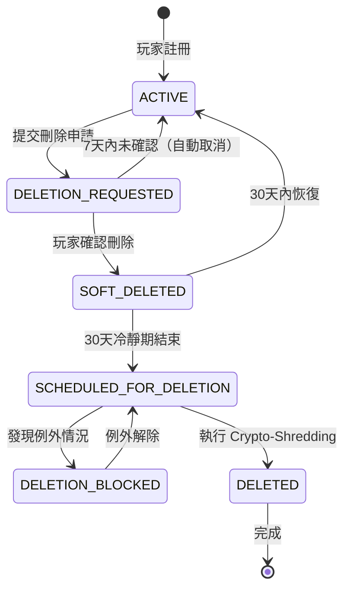

# 05-05 數據安全策略 (Data Security Strategy)

**版本**: 2.0.0（合併版）
**創建日期**: 2026-02-03
**狀態**: ✅ v2.0 重組規範

<!-- SSOT: Authoritative definition of Data Security, Encryption, Blind Index, GDPR Compliance -->

---

## 📋 文檔目的

本文檔為 **數據安全的唯一權威來源（SSOT）**，整合了：
- 加密策略（AES-256-GCM）
- Blind Index 架構（可檢索加密）
- GDPR 合規（Crypto-Shredding）
- 密碼雜湊（Argon2id）
- 數據脫敏（Data Masking）
- 金鑰管理（AWS KMS）

**適用對象**：後端開發、安全工程師、數據庫工程師、法務團隊

---

## 1. 系統概述

為符合 **GDPR**、**PCI-DSS** 與各國個資保護法規（CCPA, PDPA, LGPD），本模組定義了 **敏感數據（Sensitive Data）** 在 **存儲（Data at Rest）** 與 **傳輸（Data in Transit）** 過程中的安全標準。

### 1.1 核心原則

- **零信任架構**：假設資料庫、備份、日誌都可能洩露，因此 PII 必須加密
- **應用層加密**：數據在寫入資料庫前就已加密，DBA 無法查看明文
- **可檢索加密**：通過 Blind Index 實現加密數據的精確查詢
- **Crypto-Shredding**：通過銷毀金鑰實現數據永久不可恢復（符合 GDPR）

### 1.2 技術架構圖

```
┌────────────────────────────────────────────────────────────┐
│  數據安全四層防護                                            │
├────────────────────────────────────────────────────────────┤
│  Layer 1: 應用層加密                                         │
│  - AES-256-GCM (PII 欄位級加密)                             │
│  - Argon2id (密碼雜湊)                                       │
├────────────────────────────────────────────────────────────┤
│  Layer 2: 可檢索加密                                         │
│  - Blind Index (HMAC-SHA256)                               │
│  - 支援精確匹配查詢                                          │
├────────────────────────────────────────────────────────────┤
│  Layer 3: 金鑰管理                                           │
│  - AWS KMS (Master Key)                                    │
│  - Per-Player DEK (Crypto-Shredding)                       │
├────────────────────────────────────────────────────────────┤
│  Layer 4: 傳輸加密                                           │
│  - TLS 1.3 (HTTPS 強制)                                    │
│  - mTLS (微服務間通訊)                                       │
└────────────────────────────────────────────────────────────┘
```

---

## 2. PII 定義 (Personally Identifiable Information)

<!-- SSOT: PII 分類標準 -->

以下欄位必須被視為 **高度敏感**，嚴禁明文存儲：

| PII 欄位 | 範例 | 風險等級 | 加密要求 | 查詢需求 |
|---------|------|---------|---------|---------|
| **姓名** | "張三"、"John Doe" | 高 | AES-256-GCM | 無 |
| **手機號** | "+886912345678" | 極高 | AES-256-GCM + Blind Index | 精確查詢（客服） |
| **Email** | "player@example.com" | 極高 | AES-256-GCM + Blind Index | 精確查詢（登入） |
| **銀行帳號** | "1234567890" | 極高 | AES-256-GCM + Blind Index | 精確查詢（出金） |
| **身分證字號** | "A123456789" | 極高 | AES-256-GCM + Blind Index | 精確查詢（KYC） |
| **密碼** | "P@ssw0rd123" | 極高 | **Argon2id Hash**（不可逆）| 驗證比對 |
| **家庭住址** | "台北市信義區..." | 中 | AES-256-GCM | 無 |
| **生日** | "1990-01-01" | 中 | AES-256-GCM | 無 |
| **IP 地址** | "1.2.3.4" | 中 | HMAC-SHA256（Blind Index）| 風控查詢 |

**分類原則**：
- **極高**：可直接識別個人身份，需同時加密 + 建立 Blind Index
- **高**：可間接識別個人，僅需加密
- **中**：敏感但不可識別，視業務需求決定

---

## 3. 存儲加密 (Data at Rest Encryption)

<!-- SSOT: AES-256-GCM 加密標準 -->

### 3.1 加密算法選擇

**採用 `AES-256-GCM` (Authenticated Encryption with Associated Data)**

**選擇理由**：
| 特性 | 優勢 |
|------|------|
| **AES-256** | 業界標準，NIST 認證，抗量子運算攻擊（目前）|
| **GCM 模式** | 提供 **加密 + 完整性驗證**（AEAD），防止密文被篡改 |
| **效能優越** | 硬體加速支援（AES-NI），加密/解密速度快 |

### 3.2 存儲格式

**Base64 Encoded 格式**：
```text
[Version]:[IV]:[Ciphertext]:[AuthTag]

範例：
v1:a3f8d9e2c1b4:Y3J5cHRvZ3JhcGh5==:4a7b8c9d
```

**欄位說明**：
| 欄位 | 長度 | 說明 |
|------|------|------|
| Version | 2 bytes | 加密版本（用於金鑰輪替）|
| IV (Initialization Vector) | 12 bytes | 隨機生成，每次加密唯一 |
| Ciphertext | 可變 | AES-GCM 加密後的密文 |
| AuthTag | 16 bytes | GCM 模式的認證標籤 |

### 3.3 實作範例（Python）

```python
from cryptography.hazmat.primitives.ciphers.aead import AESGCM
import os
import base64

class PIIEncryptor:
    def __init__(self, encryption_key: bytes):
        """
        初始化加密器

        Args:
            encryption_key: 32 bytes (256-bit) AES key
        """
        self.aesgcm = AESGCM(encryption_key)
        self.version = "v1"

    def encrypt(self, plaintext: str) -> str:
        """
        加密 PII 數據

        Args:
            plaintext: 明文（如 "+886912345678"）

        Returns:
            格式化密文：v1:iv:ciphertext:authtag
        """
        # 1. 隨機生成 IV（12 bytes）
        iv = os.urandom(12)

        # 2. AES-GCM 加密
        ciphertext_with_tag = self.aesgcm.encrypt(
            iv,
            plaintext.encode('utf-8'),
            None  # No Associated Data
        )

        # 3. 分離密文和認證標籤（最後 16 bytes 是 AuthTag）
        ciphertext = ciphertext_with_tag[:-16]
        auth_tag = ciphertext_with_tag[-16:]

        # 4. Base64 編碼並組裝
        iv_b64 = base64.b64encode(iv).decode('utf-8')
        ciphertext_b64 = base64.b64encode(ciphertext).decode('utf-8')
        auth_tag_b64 = base64.b64encode(auth_tag).decode('utf-8')

        return f"{self.version}:{iv_b64}:{ciphertext_b64}:{auth_tag_b64}"

    def decrypt(self, encrypted_text: str) -> str:
        """
        解密 PII 數據

        Args:
            encrypted_text: 格式化密文

        Returns:
            明文

        Raises:
            InvalidTag: 如果密文被篡改
        """
        # 1. 解析格式
        version, iv_b64, ciphertext_b64, auth_tag_b64 = encrypted_text.split(":")

        # 2. Base64 解碼
        iv = base64.b64decode(iv_b64)
        ciphertext = base64.b64decode(ciphertext_b64)
        auth_tag = base64.b64decode(auth_tag_b64)

        # 3. 組合密文和標籤
        ciphertext_with_tag = ciphertext + auth_tag

        # 4. AES-GCM 解密
        plaintext_bytes = self.aesgcm.decrypt(iv, ciphertext_with_tag, None)

        return plaintext_bytes.decode('utf-8')

# 使用範例
encryption_key = os.urandom(32)  # 實際應從 AWS KMS 獲取
encryptor = PIIEncryptor(encryption_key)

# 加密
phone = "+886912345678"
encrypted_phone = encryptor.encrypt(phone)
print(f"Encrypted: {encrypted_phone}")

# 解密
decrypted_phone = encryptor.decrypt(encrypted_phone)
print(f"Decrypted: {decrypted_phone}")
assert decrypted_phone == phone
```

### 3.4 資料庫 Schema 設計

**範例（玩家表）**：
```sql
CREATE TABLE players (
    player_id BIGINT PRIMARY KEY,
    tenant_id VARCHAR(50) NOT NULL,

    -- 明文欄位（不敏感）
    username VARCHAR(50) NOT NULL UNIQUE,
    created_at TIMESTAMP NOT NULL,

    -- 加密欄位（PII）
    encrypted_name VARCHAR(500) NOT NULL,  -- AES-GCM 加密後的姓名
    encrypted_phone VARCHAR(500) NOT NULL,
    encrypted_email VARCHAR(500) NOT NULL,
    encrypted_bank_account VARCHAR(500),
    encrypted_id_number VARCHAR(500),
    encrypted_address TEXT,

    -- Blind Index（可檢索）
    phone_index CHAR(64) NOT NULL UNIQUE,  -- HMAC-SHA256
    email_index CHAR(64) NOT NULL UNIQUE,
    bank_account_index CHAR(64),
    id_number_index CHAR(64),

    INDEX idx_phone (phone_index),
    INDEX idx_email (email_index),
    INDEX idx_tenant_player (tenant_id, player_id)
);
```

---

## 4. Blind Index 架構 (Searchable Encryption)

<!-- SSOT: Blind Index 設計標準 -->

### 4.1 問題定義

**挑戰**：AES 加密後的密文無法被資料庫索引，導致無法進行精確查詢：
```sql
-- ❌ 無法執行（密文無法比對）
SELECT * FROM players WHERE encrypted_phone = '+886912345678';
```

**Blind Index 解決方案**：
- 使用 HMAC-SHA256 生成可索引的雜湊值
- 單向性：無法從 Index 反推明文
- 確定性：相同輸入永遠生成相同 Index

### 4.2 數據寫入路徑

```
[Data Write Path]
┌──────────────────────────────────────────────────────────────┐
│  1. User Input: +886912345678                                │
│  2. Parallel Processing:                                     │
│     ┌─────────────────────┬─────────────────────┐            │
│     │ Path A: Encryption  │ Path B: Blind Index │            │
│     ├─────────────────────┼─────────────────────┤            │
│     │ AES-256-GCM(phone)  │ HMAC-SHA256(phone,  │            │
│     │ → encrypted_phone   │ blind_key) →        │            │
│     │                     │ phone_index         │            │
│     └─────────────────────┴─────────────────────┘            │
│  3. Store both in database:                                  │
│     encrypted_phone: "v1:Y3J5cHRv:ZW5jcnlwdGVk..."          │
│     phone_index: "a3f8d9e2c1b4..."  (64 chars)              │
└──────────────────────────────────────────────────────────────┘
```

### 4.3 數據查詢路徑

```
[Data Query Path]
┌──────────────────────────────────────────────────────────────┐
│  1. CS inputs search term: +886912345678                     │
│  2. Backend computes: HMAC-SHA256(input, blind_key)          │
│     → computed_index: "a3f8d9e2c1b4..."                     │
│  3. Query: SELECT * FROM players                             │
│           WHERE phone_index = 'a3f8d9e2c1b4...'              │
│  4. Found match → Decrypt encrypted_phone for display        │
│     → Output: +886912345678                                  │
└──────────────────────────────────────────────────────────────┘
```

### 4.4 Blind Index 生成算法

**使用 HMAC-SHA256（而非普通 SHA256）**：

| 算法 | 優勢 | 劣勢 |
|------|------|------|
| **SHA256** | 簡單、快速 | ❌ 易受 Rainbow Table 攻擊（無金鑰保護）|
| **HMAC-SHA256** | ✅ 金鑰保護，抗 Rainbow Table | 需要額外管理 Blind Index Key |

**Python 實作範例**：
```python
import hmac
import hashlib

class BlindIndexGenerator:
    def __init__(self, blind_index_key: bytes):
        """
        初始化 Blind Index 生成器

        Args:
            blind_index_key: 32 bytes HMAC key（與 Encryption Key 分離）
        """
        self.blind_key = blind_index_key

    def generate_index(self, plaintext: str) -> str:
        """
        生成 Blind Index

        Args:
            plaintext: 明文（如 "+886912345678"）

        Returns:
            64 字符的 Hex String
        """
        # HMAC-SHA256（256-bit = 64 hex chars）
        index = hmac.new(
            self.blind_key,
            plaintext.encode('utf-8'),
            hashlib.sha256
        ).hexdigest()

        return index

# 使用範例
blind_key = os.urandom(32)  # 實際應從 HashiCorp Vault 獲取
index_generator = BlindIndexGenerator(blind_key)

phone = "+886912345678"
phone_index = index_generator.generate_index(phone)
print(f"Blind Index: {phone_index}")

# 查詢時
search_index = index_generator.generate_index(phone)
# SELECT * FROM players WHERE phone_index = 'a3f8d9e2c1b4...'
```

### 4.5 完整實作範例

```python
class PlayerPIIService:
    def __init__(self, encryptor: PIIEncryptor, index_generator: BlindIndexGenerator):
        self.encryptor = encryptor
        self.index_generator = index_generator

    def create_player(self, player_data: dict) -> dict:
        """
        創建玩家（加密 PII）

        Args:
            player_data: {
                "username": "john_doe",
                "name": "John Doe",
                "phone": "+886912345678",
                "email": "john@example.com"
            }

        Returns:
            加密後的數據（用於存儲）
        """
        return {
            "username": player_data["username"],
            "encrypted_name": self.encryptor.encrypt(player_data["name"]),
            "encrypted_phone": self.encryptor.encrypt(player_data["phone"]),
            "encrypted_email": self.encryptor.encrypt(player_data["email"]),
            "phone_index": self.index_generator.generate_index(player_data["phone"]),
            "email_index": self.index_generator.generate_index(player_data["email"])
        }

    def search_by_phone(self, phone: str) -> Optional[dict]:
        """
        通過手機號搜尋玩家

        Args:
            phone: 明文手機號

        Returns:
            玩家數據（PII 已解密）
        """
        # 1. 生成 Blind Index
        search_index = self.index_generator.generate_index(phone)

        # 2. 查詢資料庫
        encrypted_player = db.execute(
            "SELECT * FROM players WHERE phone_index = ?",
            (search_index,)
        ).fetchone()

        if not encrypted_player:
            return None

        # 3. 解密 PII
        return {
            "username": encrypted_player["username"],
            "name": self.encryptor.decrypt(encrypted_player["encrypted_name"]),
            "phone": self.encryptor.decrypt(encrypted_player["encrypted_phone"]),
            "email": self.encryptor.decrypt(encrypted_player["encrypted_email"])
        }
```

### 4.6 雙金鑰系統 (Two-Key System)

**為何需要分離金鑰？**

**單金鑰系統的風險**：
- 若攻擊者同時獲得 **Encryption Key (EK)** + **Blind Index Key (BIK)** + **資料庫備份**
- 可建立 Rainbow Table：預先計算所有可能電話號碼的 HMAC
- 透過比對 Blind Index 找到對應密文，再用 EK 解密

**雙金鑰系統的防護**：
```
┌────────────────────────────────────────────────────────────┐
│  Key Hierarchy                                             │
│  ┌─────────────────────┬─────────────────────┐            │
│  │ Encryption Key (EK) │ Blind Index Key     │            │
│  │                     │ (BIK)               │            │
│  ├─────────────────────┼─────────────────────┤            │
│  │ AWS KMS:            │ HashiCorp Vault:    │            │
│  │ alias/pii-encrypt   │ secret/blind-index  │            │
│  │                     │                     │            │
│  │ Physical Isolation: │ Physical Isolation: │            │
│  │ US-East-1           │ EU-West-1           │            │
│  └─────────────────────┴─────────────────────┘            │
│                                                            │
│  攻擊者需同時突破兩個獨立的 HSM 才能完成 Rainbow Table   │
│  攻擊難度 exponentially 增加                               │
└────────────────────────────────────────────────────────────┘
```

**金鑰存儲建議**：
| 金鑰類型 | 存儲位置 | 存取權限 | 輪替頻率 |
|---------|---------|---------|---------|
| **Encryption Key (EK)** | AWS KMS (US-East-1) | Backend API 服務 | 每 365 天 |
| **Blind Index Key (BIK)** | HashiCorp Vault (EU-West-1) | Backend API 服務 | 每 730 天（2年）|
| **Master Encryption Key (MEK)** | AWS KMS CMK | AWS KMS 內部管理 | 自動輪替 |

**為何 BIK 輪替頻率較低？**
- 輪替 BIK 需要重新計算所有歷史資料的 Blind Index（成本極高）
- EK 輪替僅需重新加密（可延遲執行）

### 4.7 效能考量

**查詢效能對比**：
| 方法 | 時間複雜度 | 實際耗時（1000萬玩家）|
|------|-----------|---------------------|
| **Blind Index 查詢** | O(1) - B-Tree 索引 | < 5ms |
| **全表掃描解密** | O(n) - 逐行解密比對 | > 5000ms（1000倍慢）|

**寫入效能開銷**：
| 操作 | 耗時 |
|------|------|
| AES-256-GCM 加密 | ~0.05ms |
| HMAC-SHA256 計算 | ~0.01ms |
| 資料庫索引維護 | ~0.5ms |
| **總計** | **~0.56ms** |

**對比無加密的純寫入**：~0.2ms
**性能損失**：約 2.8倍（可接受範圍）

---

## 5. 傳輸加密 (Data in Transit Encryption)

<!-- SSOT: HTTPS/TLS 標準 -->

### 5.1 強制 HTTPS (TLS 1.3+)

**要求**：
- ❌ 禁止 HTTP 明文傳輸
- ✅ 自動重定向 HTTP → HTTPS
- ✅ HSTS Header 強制瀏覽器使用 HTTPS

**Nginx 配置範例**：
```nginx
server {
    listen 443 ssl http2;
    ssl_protocols TLSv1.3 TLSv1.2;  # 禁用 TLSv1.0/1.1
    ssl_ciphers 'ECDHE-ECDSA-AES256-GCM-SHA384:ECDHE-RSA-AES256-GCM-SHA384';
    ssl_prefer_server_ciphers on;
    ssl_certificate /path/to/cert.pem;
    ssl_certificate_key /path/to/key.pem;

    # HSTS (強制 HTTPS)
    add_header Strict-Transport-Security "max-age=31536000; includeSubDomains; preload" always;

    # 其他安全標頭
    add_header X-Frame-Options "DENY" always;
    add_header X-Content-Type-Options "nosniff" always;
    add_header X-XSS-Protection "1; mode=block" always;
}

# HTTP → HTTPS 重定向
server {
    listen 80;
    server_name example.com;
    return 301 https://$server_name$request_uri;
}
```

### 5.2 微服務通訊安全

**內部服務間通訊**：
- 使用 mTLS（Mutual TLS）雙向認證
- 或使用 Service Mesh（如 Istio）自動加密

**mTLS 配置範例**：
```yaml
# Istio PeerAuthentication
apiVersion: security.istio.io/v1beta1
kind: PeerAuthentication
metadata:
  name: default
  namespace: igaming
spec:
  mtls:
    mode: STRICT  # 強制 mTLS
```

---

## 6. 密碼雜湊 (Password Hashing)

<!-- SSOT: Argon2id 密碼雜湊標準 -->

### 6.1 算法選擇

**使用 `Argon2id`**（優於 bcrypt/PBKDF2）

**選擇理由**：
| 算法 | 發布年份 | 優勢 | 劣勢 |
|------|---------|------|------|
| **MD5** | 1992 | 快速 | ❌ 已被破解，禁止使用 |
| **bcrypt** | 1999 | 抗暴力破解 | 僅抗 CPU 攻擊，易受 GPU 攻擊 |
| **PBKDF2** | 2000 | NIST 認證 | 易受 GPU/ASIC 攻擊 |
| **Argon2id** | 2015 | **抗 CPU/GPU/ASIC 攻擊** | 計算成本高（但這正是優勢）|

**Argon2 版本選擇**：
- **Argon2d**：抗 GPU 攻擊，但易受側信道攻擊
- **Argon2i**：抗側信道攻擊，但稍弱於 GPU 防護
- **Argon2id**（推薦）：**混合模式**，兼具兩者優點

### 6.2 參數配置

**推薦參數**（基於 OWASP 建議）：
```python
time_cost = 3          # 迭代次數（目標：0.5-1秒）
memory_cost = 65536    # 64 MB 記憶體消耗
parallelism = 2        # CPU 核心數
salt_len = 16          # 16 bytes 隨機 Salt
```

**參數說明**：
| 參數 | 建議值 | 說明 |
|------|--------|------|
| `time_cost` | 3 | 迭代次數，值越大越慢（目標：0.5-1秒）|
| `memory_cost` | 65536（64 MB）| 記憶體消耗，防止 GPU 平行攻擊 |
| `parallelism` | 2 | CPU 核心數，值越大越快（但降低安全性）|
| `salt_len` | 16 bytes | 每個用戶獨立隨機 Salt |

### 6.3 實作範例

**註冊時雜湊密碼**：
```python
from argon2 import PasswordHasher
from argon2.exceptions import VerifyMismatchError

class PasswordService:
    def __init__(self):
        self.ph = PasswordHasher(
            time_cost=3,
            memory_cost=65536,  # 64 MB
            parallelism=2,
            hash_len=32,
            salt_len=16
        )

    def hash_password(self, password: str) -> str:
        """
        雜湊密碼（註冊時使用）

        Args:
            password: 明文密碼

        Returns:
            Argon2id hash (包含 salt)

        Example output:
        $argon2id$v=19$m=65536,t=3,p=2$salt$hash
        """
        return self.ph.hash(password)

    def verify_password(self, password_hash: str, password: str) -> bool:
        """
        驗證密碼（登入時使用）

        Args:
            password_hash: 資料庫存儲的 hash
            password: 用戶輸入的明文密碼

        Returns:
            True if match, False otherwise
        """
        try:
            self.ph.verify(password_hash, password)

            # 自動重雜湊（如果參數過時）
            if self.ph.check_needs_rehash(password_hash):
                new_hash = self.ph.hash(password)
                # 更新資料庫
                db.execute(
                    "UPDATE users SET password_hash = ? WHERE ...",
                    (new_hash,)
                )

            return True
        except VerifyMismatchError:
            return False

# 使用範例
pwd_service = PasswordService()

# 註冊
password = "P@ssw0rd123"
password_hash = pwd_service.hash_password(password)
# 存儲到資料庫：INSERT INTO users (password_hash) VALUES (?)

# 登入
is_valid = pwd_service.verify_password(password_hash, "P@ssw0rd123")
print(f"Password valid: {is_valid}")  # True
```

### 6.4 安全最佳實踐

**1. 限制密碼重試次數**（防止暴力破解）：
```python
class LoginRateLimiter:
    def check_login_attempts(self, username: str) -> bool:
        """
        檢查登入嘗試次數

        Returns:
            True if allowed, False if too many attempts
        """
        key = f"login:attempts:{username}"
        attempts = redis.incr(key)

        if attempts == 1:
            redis.expire(key, 900)  # 15 分鐘

        if attempts > 5:
            # 超過 5 次，鎖定 15 分鐘
            return False

        return True
```

**2. 密碼複雜度要求**：
```python
import re

def validate_password_strength(password: str) -> tuple[bool, str]:
    """
    驗證密碼強度

    要求：
    - 最少 8 個字符
    - 至少 1 個大寫字母、1 個小寫字母、1 個數字、1 個特殊字符

    Returns:
        (is_valid, error_message)
    """
    if len(password) < 8:
        return False, "密碼長度至少 8 個字符"

    if not re.search(r'[A-Z]', password):
        return False, "密碼必須包含至少 1 個大寫字母"

    if not re.search(r'[a-z]', password):
        return False, "密碼必須包含至少 1 個小寫字母"

    if not re.search(r'[0-9]', password):
        return False, "密碼必須包含至少 1 個數字"

    if not re.search(r'[!@#$%^&*(),.?":{}|<>]', password):
        return False, "密碼必須包含至少 1 個特殊字符"

    return True, ""
```

**3. 不要在 Hash 前對密碼進行額外處理**：
```python
# ❌ 錯誤範例（降低安全性）
password_sha256 = hashlib.sha256(password.encode()).hexdigest()
password_hash = argon2.hash(password_sha256)  # 不要這樣做！

# ✅ 正確範例
password_hash = argon2.hash(password)  # 直接雜湊原始密碼
```

---

## 7. 數據脫敏 (Data Masking)

<!-- SSOT: 數據脫敏規範 -->

### 7.1 脫敏規範

**所有 API 回傳給前端（Frontend/Backoffice）時，必須依據角色權限進行脫敏**。

| PII 欄位 | 脫敏規則 | 範例 | 適用場景 |
|---------|---------|------|---------|
| **Name** | 保留首尾字符（中文則保留姓）| `David Beckham` → `D***m`<br>`王小明` → `王*明` | 客服查詢、VIP 管理 |
| **Phone** | 保留前3後3 | `0912345678` → `091****678` | 客服查詢、出金審核 |
| **Email** | 保留前2與域名 | `david@gmail.com` → `da***@gmail.com` | 客服查詢、帳戶設定 |
| **Bank Account** | 保留後4碼 | `1234567890` → `******7890` | 出金審核、財務報表 |
| **ID Number** | 保留前2後2 | `A123456789` → `A1*****89` | KYC 驗證、合規審查 |
| **IP Address** | 保留前2段 | `192.168.1.100` → `192.168.*.*` | 風控分析、日誌查詢 |

### 7.2 實作層級

**禁止**：在 Frontend 進行脫敏（掩耳盜鈴，API Response 仍是明文）
**必須**：在 Backend DTO Converter 層或 Serializer 層處理

**Python 實作範例**：
```python
class PIIMasker:
    @staticmethod
    def mask_name(name: str) -> str:
        """脫敏姓名"""
        if len(name) <= 2:
            return name[0] + "*"
        return name[0] + "*" * (len(name) - 2) + name[-1]

    @staticmethod
    def mask_phone(phone: str) -> str:
        """脫敏手機號（保留前3後3）"""
        if len(phone) < 6:
            return "***"
        return phone[:3] + "****" + phone[-3:]

    @staticmethod
    def mask_email(email: str) -> str:
        """脫敏 Email（保留前2與域名）"""
        local, domain = email.split("@")
        if len(local) <= 2:
            return "**@" + domain
        return local[:2] + "***@" + domain

    @staticmethod
    def mask_bank_account(account: str) -> str:
        """脫敏銀行帳號（保留後4碼）"""
        if len(account) < 4:
            return "****"
        return "*" * (len(account) - 4) + account[-4:]

# API 層整合
from flask import jsonify

@app.route("/api/player/<player_id>")
@require_permission("player:view")
def get_player_info(player_id):
    player = player_service.get_player(player_id)

    # 根據用戶角色脫敏
    if current_user.role == "CS_LEVEL_1":
        player["name"] = PIIMasker.mask_name(player["name"])
        player["phone"] = PIIMasker.mask_phone(player["phone"])
        player["email"] = PIIMasker.mask_email(player["email"])
        del player["bank_account"]  # 無權查看

    return jsonify(player)
```

### 7.3 權限分級脫敏

**不同角色看到不同級別的脫敏**：

| 角色 | Phone | Email | Bank Account |
|------|-------|-------|-------------|
| **玩家本人** | 明文（需二次驗證）| 明文 | `******7890`（後4碼）|
| **客服（Level 1）** | `091****678` | `da***@gmail.com` | 無權查看 |
| **客服主管（Level 2）** | `0912****78`（前4後2）| `dav***@gmail.com` | `******7890` |
| **財務人員** | `091****678` | 無權查看 | 明文（需審批）|
| **風控人員** | 明文（需審批）| 明文（需審批）| 明文（需審批）|
| **DBA（資料庫管理員）** | 密文（無法解密）| 密文（無法解密）| 密文（無法解密）|

**實現範例**：
```python
class RoleBasedPIIMasker:
    MASK_RULES = {
        "player": {
            "name": "full",
            "phone": "full",
            "email": "full",
            "bank_account": "last4"
        },
        "cs_level_1": {
            "name": "partial",
            "phone": "partial",
            "email": "partial",
            "bank_account": "none"
        },
        "risk_officer": {
            "name": "full",  # 需審批
            "phone": "full",
            "email": "full",
            "bank_account": "full"
        }
    }

    @classmethod
    def mask_for_role(cls, pii_data: dict, role: str) -> dict:
        """根據角色脫敏 PII"""
        rules = cls.MASK_RULES.get(role, {})
        masked_data = {}

        for field, value in pii_data.items():
            mask_level = rules.get(field, "none")

            if mask_level == "full":
                masked_data[field] = value
            elif mask_level == "partial":
                masker_func = getattr(PIIMasker, f"mask_{field}", None)
                masked_data[field] = masker_func(value) if masker_func else "***"
            elif mask_level == "last4":
                masked_data[field] = PIIMasker.mask_bank_account(value)
            else:
                # none: 不返回該欄位
                pass

        return masked_data
```

---

## 8. 金鑰管理 (Key Management)

<!-- SSOT: AWS KMS 金鑰管理標準 -->

### 8.1 金鑰層級架構

**雙層金鑰系統**（推薦）：
```
┌────────────────────────────────────────────┐
│  Master Key (CMK - Customer Master Key)   │
│  - Stored in AWS KMS / HashiCorp Vault    │
│  - Never leaves HSM (Hardware Security    │
│    Module)                                 │
│  - Rotated every 365 days                 │
└──────────────────┬─────────────────────────┘
                   │ Encrypts
                   ↓
┌────────────────────────────────────────────┐
│  Data Encryption Keys (DEK)               │
│  - Generated per encryption operation      │
│  - Cached in application memory (ephemeral)│
│  - Encrypted by CMK before storage        │
└────────────────────────────────────────────┘
```

### 8.2 AWS KMS 整合

**範例**（Python + Boto3）：
```python
import boto3
import os

class KMSKeyManager:
    def __init__(self, kms_key_id: str):
        self.kms_client = boto3.client('kms')
        self.kms_key_id = kms_key_id
        self.dek_cache = {}  # 金鑰快取

    def generate_data_key(self) -> tuple[bytes, bytes]:
        """
        生成 Data Encryption Key (DEK)

        Returns:
            (plaintext_dek, encrypted_dek)
        """
        response = self.kms_client.generate_data_key(
            KeyId=self.kms_key_id,
            KeySpec='AES_256'  # 256-bit key
        )

        return response['Plaintext'], response['CiphertextBlob']

    def decrypt_data_key(self, encrypted_dek: bytes) -> bytes:
        """
        解密 DEK

        Args:
            encrypted_dek: 加密的 DEK

        Returns:
            明文 DEK
        """
        # 檢查快取
        cache_key = encrypted_dek[:16].hex()  # 使用前 16 bytes 作為 key
        if cache_key in self.dek_cache:
            return self.dek_cache[cache_key]

        # 調用 KMS 解密
        response = self.kms_client.decrypt(
            CiphertextBlob=encrypted_dek
        )

        plaintext_dek = response['Plaintext']

        # 快取 DEK（TTL: 5 分鐘）
        self.dek_cache[cache_key] = plaintext_dek
        # 注意：實際應使用 TTL 機制（如 cachetools）

        return plaintext_dek

    def rotate_master_key(self):
        """
        輪替 Master Key（CMK）

        AWS KMS 會自動管理金鑰輪替
        """
        self.kms_client.enable_key_rotation(
            KeyId=self.kms_key_id
        )

# 使用範例
kms_manager = KMSKeyManager("arn:aws:kms:us-east-1:123456789:key/abc-123")

# 生成新的 DEK
plaintext_dek, encrypted_dek = kms_manager.generate_data_key()

# 使用 plaintext_dek 加密數據
encryptor = PIIEncryptor(plaintext_dek)
encrypted_phone = encryptor.encrypt("+886912345678")

# 存儲 encrypted_dek 到資料庫
db.execute(
    "INSERT INTO user_keys (player_id, encrypted_dek) VALUES (?, ?)",
    (player_id, encrypted_dek)
)

# 解密時
decrypted_dek = kms_manager.decrypt_data_key(encrypted_dek)
decryptor = PIIEncryptor(decrypted_dek)
phone = decryptor.decrypt(encrypted_phone)
```

### 8.3 金鑰輪替（Key Rotation）

**自動輪替策略**：
- **頻率**：每 365 天自動輪替 CMK
- **方式**：AWS KMS 自動管理，應用層無需修改
- **過渡期**：新舊金鑰共存 90 天（graceful migration）

**手動觸發輪替**（緊急情況，如金鑰洩露）：
```python
def emergency_key_rotation():
    """
    緊急金鑰輪替流程

    步驟：
    1. 在 KMS 中生成新 CMK
    2. 更新應用配置指向新 CMK
    3. 後台任務重新加密所有 DEK
    4. 廢棄舊 CMK
    """
    # 1. 生成新 CMK
    new_cmk = kms_client.create_key(
        Description='Emergency rotation key',
        KeyUsage='ENCRYPT_DECRYPT'
    )

    # 2. 批次重新加密 DEK
    players = db.execute("SELECT player_id, encrypted_dek FROM user_keys").fetchall()

    for player in players:
        # 用舊 CMK 解密
        old_dek = kms_manager_old.decrypt_data_key(player['encrypted_dek'])

        # 用新 CMK 加密
        new_encrypted_dek = kms_client.encrypt(
            KeyId=new_cmk['KeyMetadata']['KeyId'],
            Plaintext=old_dek
        )['CiphertextBlob']

        # 更新資料庫
        db.execute(
            "UPDATE user_keys SET encrypted_dek = ? WHERE player_id = ?",
            (new_encrypted_dek, player['player_id'])
        )

    # 3. 廢棄舊 CMK
    kms_client.schedule_key_deletion(
        KeyId=old_cmk_id,
        PendingWindowInDays=30  # 30 天後刪除
    )
```

### 8.4 金鑰存取控制

**IAM 政策範例**（最小權限原則）：
```json
{
  "Version": "2012-10-17",
  "Statement": [
    {
      "Effect": "Allow",
      "Action": [
        "kms:Decrypt",
        "kms:GenerateDataKey"
      ],
      "Resource": "arn:aws:kms:us-east-1:123456789:key/abc-123",
      "Condition": {
        "StringEquals": {
          "kms:ViaService": "rds.us-east-1.amazonaws.com"
        }
      }
    }
  ]
}
```

**原則說明**：
- 僅允許 `Decrypt` 與 `GenerateDataKey`（不允許 `Encrypt`，避免濫用）
- 僅允許通過特定服務（RDS）調用（防止意外洩露）
- 禁止 `ScheduleKeyDeletion`（防止誤刪除）

---

## 9. GDPR 合規與 Crypto-Shredding

<!-- SSOT: GDPR 數據刪除標準 -->

### 9.1 資料分類矩陣

**並非所有資料都可刪除**，需依法規與業務需求分類：

| 資料類別 | 包含欄位 | GDPR 刪除義務 | 保留期限 | 處理方式 |
|---------|---------|--------------|---------|---------|
| **可完全刪除** | 玩家姓名、地址、偏好設定、行銷同意 | ✅ Yes | 無 | Physical Delete |
| **需匿名化** | 遊戲歷史（bet_id, game_id, amount）| ✅ Yes (anonymize) | 無 | Replace player_id with UUID |
| **必須保留（AML）** | 交易記錄（deposits, withdrawals）| ❌ No (legal obligation) | **5-7 years** | Retain with anonymized player_id |
| **必須保留（Tax）** | 獎金派彩記錄（winnings > threshold）| ❌ No (legal obligation) | **7 years** (varies by jurisdiction) | Retain with anonymized player_id |
| **必須保留（Dispute）** | 投訴工單（complaint_id, resolution）| ❌ No (legal claim) | **6 years** | Retain until claim expires |
| **必須保留（Ban）** | 違規記錄（fraud_flags, ban_reason）| ❌ No (legitimate interest) | **Permanent** | Retain for fraud prevention |

**法律依據（GDPR Art. 17(3) Exceptions）**：
- **(b) Compliance with legal obligation**：反洗錢（AML）、稅務報告
- **(e) Legal claims**：正在進行或潛在的訴訟
- **(f) Legitimate interests**：欺詐防護、帳號安全

### 9.2 Crypto-Shredding 原理

**雙層加密架構**：使用 **Per-Player Data Encryption Key (DEK)** 加密 PII，DEK 本身由 **Master Key (KEK)** 加密。刪除玩家時，僅需銷毀 DEK，即可使所有 PII 永久不可恢復。

```
[Crypto-Shredding Architecture]
┌────────────────────────────────────────────────────────────┐
│  Key Hierarchy                                             │
│  ┌──────────────────────────────────────────────────────┐  │
│  │  Master Key (KEK - Key Encryption Key)              │  │
│  │  - Stored in AWS KMS / HashiCorp Vault              │  │
│  │  - Never leaves HSM                                  │  │
│  │  - Rotated annually                                 │  │
│  └──────────────────────────────────────────────────────┘  │
│                          ↓ Encrypts                        │
│  ┌──────────────────────────────────────────────────────┐  │
│  │  Per-Player DEK (Data Encryption Key)               │  │
│  │  - Unique AES-256 key for EACH player               │  │
│  │  - Stored in database (encrypted by KEK)            │  │
│  │  - Size: 32 bytes (256-bit)                         │  │
│  └──────────────────────────────────────────────────────┘  │
│                          ↓ Encrypts                        │
│  ┌──────────────────────────────────────────────────────┐  │
│  │  Player PII Data                                     │  │
│  │  - encrypted_name, encrypted_phone,                  │  │
│  │    encrypted_email, etc.                            │  │
│  │  - All encrypted with player's unique DEK          │  │
│  └──────────────────────────────────────────────────────┘  │
├────────────────────────────────────────────────────────────┤
│  Deletion Process (Crypto-Shredding)                      │
│  DELETE FROM user_keys WHERE player_id = ?                │
│  → DEK destroyed, all PII becomes unrecoverable           │
│  → Even with database backups, data cannot be decrypted   │
└────────────────────────────────────────────────────────────┘
```

**為何傳統刪除不夠？**
| 刪除方式 | 問題 | Crypto-Shredding 優勢 |
|---------|------|----------------------|
| `DELETE FROM players` | 資料庫備份仍存在明文/密文 | ✅ 備份中的密文永久不可恢復 |
| 軟刪除（`deleted_at`）| 資料仍可查詢（風險）| ✅ 金鑰銷毀後無法解密 |
| 覆寫刪除（`VACUUM FULL`）| 成本極高、耗時長 | ✅ 輕量操作（僅刪除金鑰）|

### 9.3 資料庫 Schema 設計

**金鑰管理表**：
```sql
CREATE TABLE user_keys (
    player_id BIGINT PRIMARY KEY,
    encrypted_dek BLOB NOT NULL,  -- 加密的 DEK（由 AWS KMS CMK 加密）
    created_at TIMESTAMP NOT NULL,
    last_accessed_at TIMESTAMP,
    INDEX idx_last_accessed (last_accessed_at)
);

-- 墓碑記錄表（Tombstone）
CREATE TABLE deleted_users (
    player_id BIGINT PRIMARY KEY,
    deletion_reason VARCHAR(50) NOT NULL,  -- GDPR_REQUEST, VOLUNTARY, FRAUD
    deleted_at TIMESTAMP NOT NULL,
    deleted_by VARCHAR(50),  -- 操作人（SYSTEM/USER/ADMIN）
    verification_token VARCHAR(64) UNIQUE,  -- 刪除證明 Token
    INDEX idx_deleted_at (deleted_at)
);
```

**為何保留 Tombstone（墓碑記錄）？**
| 用途 | 說明 |
|------|------|
| **防止重複註冊** | 同一 email/phone 再次註冊會被拒絕（玩家可能嘗試套利）|
| **審計追蹤** | 證明已處理 GDPR 請求（合規證明）|
| **合規報告** | 每月刪除統計（向監管機構提交）|
| **法律保護** | 若玩家事後否認刪除請求，可提供證據 |

### 9.4 刪除狀態機



**狀態說明**：
| 狀態 | 說明 | 可執行操作 | 玩家可登入？ |
|------|------|-----------|------------|
| **ACTIVE** | 正常狀態 | 所有功能 | ✅ 是 |
| **DELETION_REQUESTED** | 已申請，等待確認 | 確認/取消 | ✅ 是（可取消）|
| **SOFT_DELETED** | 冷靜期（30天）| 恢復帳號 | ❌ 否 |
| **SCHEDULED_FOR_DELETION** | 待執行隊列 | Cron Job 處理 | ❌ 否 |
| **DELETION_BLOCKED** | 例外情況（調查中）| 人工審核 | ❌ 否 |
| **DELETED** | 已銷毀 | 無（永久）| ❌ 否 |

### 9.5 執行流程實作

**Phase 1: 申請與確認（T+0 → T+7 天）**

```python
class GDPRDeletionService:
    def request_deletion(self, player_id: int) -> dict:
        """
        玩家申請刪除帳號

        Returns:
            {
                "status": "DELETION_REQUESTED",
                "confirmation_token": "abc123...",
                "confirmation_expires_at": "2026-02-10T12:00:00Z"
            }
        """
        # 1. 前置檢查
        player = player_service.get_player(player_id)

        # 檢查例外情況
        if player.status == "UNDER_INVESTIGATION":
            raise DeletionBlockedException("帳號調查中，暫停刪除")

        if player.balance > 0:
            raise DeletionBlockedException("請先提領所有餘額")

        pending_wagering = bonus_service.get_pending_wagering(player_id)
        if pending_wagering > 0:
            raise DeletionBlockedException("存在未完成流水要求")

        # 2. 生成確認 Token
        confirmation_token = secrets.token_urlsafe(32)

        # 3. 更新狀態
        player.status = "DELETION_REQUESTED"
        player.deletion_requested_at = datetime.utcnow()
        player.deletion_confirmation_token = confirmation_token
        player_dao.update(player)

        # 4. 發送確認 Email
        email_service.send_deletion_confirmation_email(
            to=player.email,
            confirmation_link=f"https://example.com/confirm-deletion?token={confirmation_token}"
        )

        return {
            "status": "DELETION_REQUESTED",
            "confirmation_token": confirmation_token,
            "confirmation_expires_at": datetime.utcnow() + timedelta(days=7)
        }

    def confirm_deletion(self, confirmation_token: str) -> dict:
        """
        玩家確認刪除（Double Opt-In）

        Returns:
            {
                "status": "SOFT_DELETED",
                "cooling_period_ends_at": "2026-03-05T12:00:00Z"
            }
        """
        # 1. 驗證 Token
        player = player_dao.find_by_deletion_token(confirmation_token)
        if not player or player.status != "DELETION_REQUESTED":
            raise InvalidTokenException("無效的確認連結")

        # 檢查有效期（7 天）
        if datetime.utcnow() > player.deletion_requested_at + timedelta(days=7):
            player.status = "ACTIVE"
            player_dao.update(player)
            raise ExpiredTokenException("確認連結已過期，請重新申請")

        # 2. 更新狀態為 SOFT_DELETED
        player.status = "SOFT_DELETED"
        player.soft_deleted_at = datetime.utcnow()
        player_dao.update(player)

        # 3. 發送通知
        email_service.send_soft_deletion_notification(
            to=player.email,
            recovery_deadline=datetime.utcnow() + timedelta(days=30)
        )

        return {
            "status": "SOFT_DELETED",
            "cooling_period_ends_at": datetime.utcnow() + timedelta(days=30)
        }
```

**Phase 2: 冷靜期恢復機制（T+7 → T+37 天）**

```python
def recover_account(self, player_id: int) -> dict:
    """
    玩家在冷靜期內恢復帳號

    Returns:
        {
            "status": "ACTIVE",
            "recovered_at": "2026-02-15T12:00:00Z"
        }
    """
    player = player_service.get_player(player_id)

    # 檢查狀態
    if player.status != "SOFT_DELETED":
        raise IllegalStateException("帳號不在冷靜期")

    # 檢查冷靜期是否已過
    cooling_period_end = player.soft_deleted_at + timedelta(days=30)
    if datetime.utcnow() > cooling_period_end:
        raise CoolingPeriodExpiredException("冷靜期已結束，無法恢復")

    # 恢復帳號
    player.status = "ACTIVE"
    player.soft_deleted_at = None
    player.deletion_requested_at = None
    player_dao.update(player)

    # 發送通知
    email_service.send_account_recovered_notification(to=player.email)

    # 記錄審計日誌
    audit_log_service.log(AuditEvent(
        action="ACCOUNT_RECOVERED",
        player_id=player_id,
        timestamp=datetime.utcnow()
    ))

    return {
        "status": "ACTIVE",
        "recovered_at": datetime.utcnow()
    }
```

**Phase 3: 最終銷毀（T+37 天）**

```python
class CryptoShreddingJob:
    """
    Cron Job: 每日執行 Crypto-Shredding

    Schedule: 每日 02:00 AM
    """

    def execute(self):
        """執行 Crypto-Shredding"""
        # 1. 查詢待刪除玩家（冷靜期已過）
        threshold = datetime.utcnow() - timedelta(days=30)
        players_to_delete = player_dao.find_by_status_and_time(
            status="SOFT_DELETED",
            soft_deleted_before=threshold
        )

        for player in players_to_delete:
            try:
                self.crypto_shred_player(player.player_id)
            except Exception as e:
                logger.error(f"Failed to delete player {player.player_id}: {e}")
                # 記錄失敗，下次重試

    def crypto_shred_player(self, player_id: int):
        """
        執行 Crypto-Shredding

        步驟：
        1. 銷毀 DEK（使所有 PII 永久不可恢復）
        2. 匿名化必須保留的數據
        3. 物理刪除可刪除的數據
        4. 記錄墓碑（Tombstone）
        5. 發送刪除證明書
        """
        # 1. 銷毀 DEK（核心操作）
        deleted_count = db.execute(
            "DELETE FROM user_keys WHERE player_id = ?",
            (player_id,)
        )

        if deleted_count == 0:
            logger.warning(f"DEK not found for player {player_id}")

        # 2. 匿名化遊戲歷史（保留統計用途）
        anonymous_uuid = str(uuid.uuid4())
        db.execute(
            "UPDATE bet_history SET player_id = ? WHERE player_id = ?",
            (anonymous_uuid, player_id)
        )

        # 3. 物理刪除玩家主表（PII 已無法解密）
        db.execute("DELETE FROM players WHERE player_id = ?", (player_id,))

        # 4. 記錄墓碑
        verification_token = secrets.token_urlsafe(32)
        db.execute("""
            INSERT INTO deleted_users
            (player_id, deletion_reason, deleted_at, deleted_by, verification_token)
            VALUES (?, 'GDPR_REQUEST', ?, 'SYSTEM', ?)
        """, (player_id, datetime.utcnow(), verification_token))

        # 5. 發送刪除證明書
        email_service.send_deletion_certificate(
            to=player.email,  # Email 仍在快取中
            verification_token=verification_token,
            deleted_at=datetime.utcnow()
        )

        # 6. 發布跨模組事件
        event_bus.publish(PlayerDeletedEvent(
            player_id=player_id,
            deleted_at=datetime.utcnow()
        ))

        logger.info(f"Player {player_id} crypto-shredded successfully")
```

### 9.6 例外處理

**暫停刪除的條件**：
| 情境 | 暫停理由 | 解除條件 | 最長保留期 |
|------|---------|---------|-----------|
| **帳號調查中** | Under Investigation（AML/Fraud）| 調查結束 | 最長 1 年 |
| **未結訴訟** | Pending Legal Case | 訴訟解決 | 最長 10 年 |
| **未完成流水** | Pending Wagering Requirement | 完成流水或放棄紅利 | 最長 90 天 |
| **未提領餘額** | Outstanding Balance > $0 | 餘額歸零 | 無限期（通知玩家）|
| **稅務查核** | Tax Audit Period | 查核結束 | 7 年 |

**實作範例**：
```python
def check_deletion_exceptions(player_id: int) -> list[str]:
    """
    檢查刪除例外情況

    Returns:
        例外原因列表（空列表表示可刪除）
    """
    exceptions = []

    player = player_service.get_player(player_id)

    # 1. 帳號調查中
    if player.status == "UNDER_INVESTIGATION":
        exceptions.append("帳號調查中（AML/Fraud）")

    # 2. 未提領餘額
    if player.balance > 0:
        exceptions.append(f"未提領餘額：${player.balance}")

    # 3. 未完成流水
    pending_wagering = bonus_service.get_pending_wagering(player_id)
    if pending_wagering > 0:
        exceptions.append(f"未完成流水要求：${pending_wagering}")

    # 4. 未結訴訟
    active_disputes = dispute_service.get_active_disputes(player_id)
    if active_disputes:
        exceptions.append(f"未結訴訟：{len(active_disputes)} 件")

    # 5. 稅務查核期
    tax_audit = tax_service.check_audit_period(player_id)
    if tax_audit:
        exceptions.append(f"稅務查核期至 {tax_audit.end_date}")

    return exceptions
```

### 9.7 合規證明

**刪除證明書（自動生成）**：
```python
def generate_deletion_certificate(player_id: int, verification_token: str) -> str:
    """
    生成 GDPR 刪除證明書（PDF）

    Returns:
        PDF 文件路徑
    """
    certificate_content = f"""
    ┌─────────────────────────────────────────────────────────┐
    │       GDPR DATA DELETION CERTIFICATE                    │
    ├─────────────────────────────────────────────────────────┤
    │  This certifies that the personal data associated with  │
    │  the following account has been permanently deleted:    │
    │                                                         │
    │  Player ID: {player_id}                                 │
    │  Deletion Date: {datetime.utcnow().isoformat()}         │
    │  Verification Token: {verification_token}               │
    │                                                         │
    │  Deletion Method: Crypto-Shredding                      │
    │  - All encryption keys have been destroyed              │
    │  - Data is permanently unrecoverable                    │
    │  - Complies with GDPR Article 17                        │
    │                                                         │
    │  Retained Data (Legal Obligation):                      │
    │  - Anonymized transaction records (5-7 years, AML)      │
    │  - Anonymized game history (statistical purposes)       │
    │                                                         │
    │  Verification URL:                                      │
    │  https://example.com/verify/{verification_token}        │
    │                                                         │
    │  Issued by: iGaming Platform                            │
    │  Certificate ID: CERT-{player_id}-{timestamp}           │
    └─────────────────────────────────────────────────────────┘
    """

    # 生成 PDF（實際應使用 ReportLab 或類似庫）
    pdf_path = f"/tmp/deletion_cert_{player_id}.pdf"
    # ... PDF 生成邏輯

    return pdf_path
```

---

## 10. 合規性檢查清單

### 10.1 GDPR 合規

| 要求 | 實施狀態 | 實施方式 |
|------|---------|---------|
| **數據最小化** | ✅ 合規 | 僅收集必要 PII |
| **存儲加密** | ✅ 合規 | AES-256-GCM |
| **傳輸加密** | ✅ 合規 | TLS 1.3 |
| **數據遺忘權** | ✅ 合規 | Crypto-Shredding |
| **數據可攜權** | ✅ 合規 | 提供 JSON 導出 |
| **審計日誌** | ✅ 合規 | Elasticsearch 記錄所有 PII 存取 |

### 10.2 PCI-DSS 合規

| 要求 | 實施狀態 | 實施方式 |
|------|---------|---------|
| **禁止儲存完整卡號** | ✅ 合規 | 使用 PSP Token |
| **銀行帳號加密** | ✅ 合規 | AES-256-GCM + Blind Index |
| **密碼雜湊** | ✅ 合規 | Argon2id |
| **存取控制** | ✅ 合規 | RBAC + IP 白名單 |

---

## 11. 實施建議

### 11.1 開發階段優先順序

**優先順序**：
1. **P0（必須）**：密碼雜湊（Argon2id）、HTTPS 強制
2. **P1（高優先級）**：PII 加密（AES-256-GCM）、Blind Index
3. **P2（中優先級）**：Crypto-Shredding、數據脫敏
4. **P3（低優先級）**：金鑰輪替自動化、審計日誌

### 11.2 預估工時

| 階段 | 任務 | 預估工時 |
|------|------|---------|
| **Phase 1** | 密碼雜湊 + HTTPS | 1 週 |
| **Phase 2** | PII 加密 + Blind Index | 2-3 週 |
| **Phase 3** | Crypto-Shredding + GDPR 刪除流程 | 3-4 週 |
| **Phase 4** | 數據脫敏 + 權限分級 | 1-2 週 |
| **總計** | | **7-10 週** |

---

## 📚 相關文檔

### 系統架構參考
- [05-01 Multi_Tenant_Arch](./05-01_Multi_Tenant_Arch.md) - 租戶隔離與金鑰分區
- [05-03 RBAC_Security](./05-03_RBAC_Security.md) - 權限分級脫敏
- [05-04 Audit_System](./05-04_Audit_System.md) - PII 存取審計
- [05-06 Approval_Workflow](./05-06_Approval_Workflow.md) - GDPR 刪除審批流程

### 業務邏輯參考
<!-- TODO: 待創建文檔 - Week 4-5 -->
<!-- - [01-01 Player_Lifecycle](../01_Core_Financial_Loop_NEW/01-01_Player_Lifecycle.md) - 玩家生命週期管理 -->
- [01-02 Wallet_Architecture](../01_Core_Financial_Loop_NEW/01-02_Wallet_Architecture.md) - 錢包數據加密、API安全設計
<!-- - [01-05 Withdrawal_Risk](../01_Core_Financial_Loop_NEW/01-05_Withdrawal_Risk.md) - 銀行帳號驗證 -->

### 技術基礎設施
<!-- TODO: 待創建文檔 - Week 5-6 -->
<!-- - [07-03-01 Design_Principles](../07_Technical_Infrastructure_NEW/07-03-01_Design_Principles.md) - API 安全標準 -->

---

**文檔版本**: 2.0.0（合併版）
**最後更新**: 2026-02-03
**來源文檔**：
- 09-03_Data_Security_Standard.md (301行)
- 09-03-01_Encryption_Strategy.md (284行)
- 09-03-02_Blind_Index_Architecture.md (347行)
- 09-03-03_GDPR_Data_Deletion.md (260行)

**維護團隊**: Security Team & Backend Team
**反饋聯繫**: security@company.com
