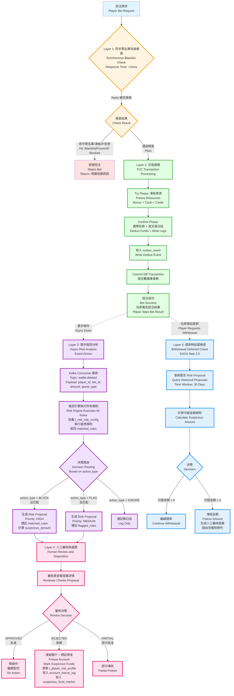

# 05-02-01 欺詐檢測模型 (Detection Model)

## 文檔信息

| 屬性 | 值 |
|------|-----|
| **文檔版本** | 4.0.0 |
| **最後更新** | 2026-02-07 |
| **父文檔** | [05-02 欺詐檢測](./05-02_Fraud_Detection.md) |
| **維護團隊** | Risk Team & Backend Team |

**前置依賴**:
- [05-01 風控框架](./05-01_Risk_Framework.md) - 配置驅動風控規則引擎 (§9)
- [01-05 出金風控](../01_Player_Center/01-05_Withdrawal_Risk.md) - SAGA Step 2.5 延遲風控檢查
- [02-04 流水計算](../02_Finance_Center/02-04_Turnover_and_Game_Reconciliation_Analysis.md) - Layer 1 處理流程

---

## 1. 執行摘要

SmartAdmin iGaming v2.1.0 引入「配置驅動風控系統」(Configuration-Driven Risk Control System)，允許運營方自行配置每條風控規則的處理方式（實時阻斷 BLOCK vs 延遲檢查 FLAG），實現靈活的風控策略管理。

### 核心特性

| 特性 | 說明 | 業務價值 |
|------|------|---------|
| **配置驅動** | action_type 由數據庫配置決定（BLOCK/FLAG/IGNORE） | 無需修改代碼即可調整風控策略 |
| **人工為主** | 異常時生成風控提案，人工審核處理 | 簡化決策邏輯，避免過度自動化 |
| **平等對待** | 所有玩家都經過風控（無 VIP 豁免） | 合規要求，公平性原則 |
| **客戶選擇** | 運營方自行決定風控強度 | 提升客戶滿意度，支持多市場策略 |

### 與傳統風控的差異

| 維度 | 傳統風控 (v2.0.0) | 配置驅動風控 (v2.1.0) |
|------|-----------------|---------------------|
| **規則分類** | 硬編碼 P0/P1/P2 (30%/50%/20%) | 配置驅動（客戶自選 BLOCK/FLAG） |
| **VIP 豁免** | VIP Level ≥3 豁免風控 | 所有玩家平等（無豁免） |
| **異常處理** | 複雜自動化閾值判斷 | 人工審核為主 |
| **策略調整** | 需要修改代碼 + 發布 | 僅需更新配置表 |
| **靈活性** | 固定百分比，無法調整 | 每條規則獨立配置 |

---

## 2. 配置驅動風控概念

### 2.1 定義

配置驅動風控是一種將風控規則的處理方式（BLOCK/FLAG/IGNORE）從代碼邏輯中抽離到數據庫配置表的架構模式。

**核心理念**:
- 規則處理方式由配置決定（非硬編碼）
- 運營方可自行調整風控策略（無需開發介入）
- 支持 A/B 測試和多市場策略
- 所有配置變更記錄審計日誌

### 2.2 與被動風控的關係

**被動風控 (Passive Risk Control)**: 投注時不阻斷，延遲到取款時檢查。

**配置驅動風控 (Configuration-Driven Risk Control)**: 允許同時配置「主動規則」(BLOCK) 和「被動規則」(FLAG)。

```
配置驅動風控 = 異步主動風控 (BLOCK 生成高優先級提案)
              + 異步被動風控 (FLAG 生成中優先級提案)
              + 僅記錄 (IGNORE)
                   ↓                        ↓                  ↓
          投注成功後異步分析         投注成功後異步分析      僅記錄日誌
          生成 Risk Proposal (HIGH)  生成 Risk Proposal (MEDIUM)
```

> **重要說明**：
> - **同步阻斷**僅限於：黑名單玩家、IP 封禁、賬戶凍結（Layer 1 快速檢查）
> - **所有其他 BLOCK/FLAG 規則**均在投注成功後異步執行（Layer 3 風控分析）
> - **BLOCK 規則不再拒絕投注**，而是生成高優先級 Risk Proposal 供人工審核
> - **資金攔截時機**：提款時延遲檢查（Layer 5 - SAGA Step 2.5）

**優勢**:
- **零誤殺**：投注已成功，風控只負責事後標記，可糾正誤判
- **高可用**：風控系統故障不影響投注流程（Fail Open 原則）
- **低延遲**：投注響應時間不受風控分析影響（異步處理）
- **靈活性**：運營方可根據市場需求調整規則優先級（HIGH/MEDIUM/LOW）
- **合規性**：符合 DraftKings/FanDuel/Bet365/UKGC 業界最佳實踐

---

## 3. 適用場景

### 3.1 Layer 1：同步阻斷（極少數，<10ms）

> 這些場景會在投注請求階段立即拒絕，使用 Redis 緩存快速檢查。

- **黑名單玩家**（已確認欺詐者）
- **IP 封禁**（已知攻擊來源）
- **賬戶凍結**（人工審核中）
- **監管自我排除名單**（UKGC/MGA 要求）

### 3.2 Layer 3：異步 BLOCK 規則（絕大多數，~5 秒）

> 這些規則在投注成功後異步執行，生成高優先級 Risk Proposal。

- **機器人檢測** (Bot Detection) - 行為特徵分析
- **同局反向投注** (Same Match Hedging) - 需要查詢歷史投注
- **同 IP 對沖** (Same IP Arbitrage) - 需要關聯分析
- **異常賠率檢測** (Abnormal Odds) - 需要統計分析
- **洗水行為** (Turnover Manipulation) - 需要計算流水

### 3.3 Layer 3：異步 FLAG 規則（中優先級，~5 秒）

> 這些規則在投注成功後異步執行，生成中優先級 Risk Proposal。

- **跨局反向投注** (Cross Match Hedging) - 風險較低
- **低賠率洗水** (<1.5 odds) - 需人工判斷
- **異常投注模式** (Abnormal Pattern) - 可能誤報
- **高頻投注** (>10 bets/min) - 需觀察趨勢

### 3.4 適合使用 IGNORE（僅記錄）

- 實驗性規則（待驗證有效性）
- 數據收集規則（用於分析）

---

## 4. 系統架構



---

## 5. 關鍵設計原則

### 5.1 最小化同步阻斷（Layer 1）

- 只檢查極少數硬規則：黑名單、IP 封禁、賬戶凍結
- 使用 Redis 緩存，響應時間 <10ms
- 失敗開放原則（Fail Open）：風控系統故障時，默認放行

### 5.2 投注優先完成（Layer 2）

- TCC 交易模式確保投注成功
- 玩家立即看到投注結果
- 風控不影響投注體驗

### 5.3 異步風控分析（Layer 3）

- Kafka + Flink 事件驅動架構
- 5 秒內完成所有規則分析
- BLOCK/FLAG 規則生成 Risk Proposal，不拒絕投注

### 5.4 人工審核為主（Layer 4）

- 自動化只負責生成提案
- 最終決策由審核員執行
- 避免機器學習模型誤殺

### 5.5 事後資金攔截（Layer 5）

- 提款時查詢歷史提案（30 天）
- 可疑金額攔截在提款階段
- 符合業界最佳實踐（DraftKings/FanDuel/Bet365/UKGC）

---

## 6. 與原架構的關鍵差異

| 項目 | 原架構（v2.1.0） | 新架構（v3.0.0） |
|-----|----------------|----------------|
| **風控觸發時機** | 投注請求時（同步） | 投注成功後（異步） |
| **BLOCK 規則處理** | 拒絕投注 | 生成高優先級提案 |
| **FLAG 規則處理** | 允許投注 + 生成提案 | 生成中優先級提案 |
| **黑名單檢查** | 與其他規則混合 | 獨立的同步檢查層 |
| **資金攔截時機** | 投注時阻斷 | 提款時延遲檢查 |
| **誤殺風險** | 5-10% 正常玩家被拒絕 | 零誤殺（投注已成功） |
| **系統可用性** | 單點故障（風控故障 → 投注失敗） | 高可用（風控故障不影響投注） |

---

## 7. 業界參考

- **DraftKings/FanDuel（美國市場）**：只有黑名單同步阻斷，其他全部異步
- **Bet365（英國市場）**：對沖檢測在投注成功後 5 分鐘內分析
- **UKGC 合規架構**：推薦事後風控 + 提款時攔截

---

## 相關文檔

- [05-02-02 規則配置](./05-02-02_Rule_Configuration.md) - 風控提案服務與延遲檢查
- [05-02-03 ML 整合](./05-02-03_ML_Integration.md) - 多維度風控規則
- [05-02-04 運營工具](./05-02-04_Operations_Tools.md) - SmartAdmin 架構映射與監控
