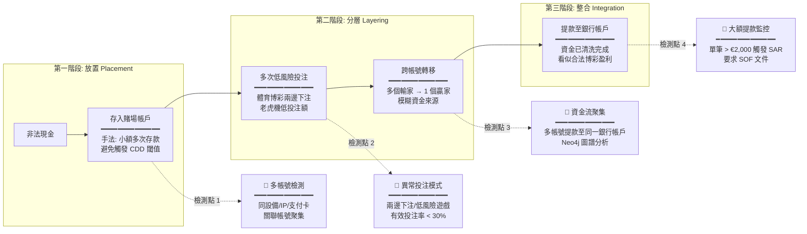

# 04-03 KYC/AML 合規系統 (KYC/AML Compliance System)

## 📋 文檔信息

**文檔版本**: 4.0.0
**最後更新**: 2026-02-04
**維護團隊**: Compliance Team & Risk Team
**前置依賴**:
- [04-01 風控框架](./05-01_Risk_Framework.md) - AML 監控、風險評分模型 (§7, §11)
- [04-02 欺詐檢測](./05-02_Fraud_Detection.md) - 資金流聚集檢測、洗錢風險 (§5)
- [03-01 玩家生命週期](../01_Player_Center/01-01_Player_Lifecycle.md) - KYC 分級認證體系 (§2.3)
- [05-05 數據安全策略](../06_Platform_Governance/06-05_Data_Security.md) - 個人資料加密、審計日誌 (§3, §8)

---

## 🎯 執行摘要

SmartAdmin iGaming 平台實施「Know Your Customer (KYC) / Anti-Money Laundering (AML)」合規系統，滿足全球多司法管轄區的監管要求。系統採用**分級驗證體系** (L0/L1/L2/L3) 和**風險為本** (Risk-Based Approach) 的 AML 監控策略，平衡用戶體驗與合規成本。

### 核心特性

| 特性 | 說明 | 業務價值 |
|------|------|---------|
| **分級驗證** | L0 (註冊) → L1 (身份) → L2 (地址) → L3 (SOF/SOW) | 降低首次註冊摩擦，漸進式提升信任度 |
| **自動化審核** | AI OCR + 人臉比對，90% 自動通過率 | 降低人力成本，提升審核效率 |
| **風險為本** | 高風險客戶進行增強盡職調查 (EDD) | 聚焦資源於高風險場景 |
| **多司法管轄區支援** | 英國 UKGC、馬耳他 MGA、直布羅陀、庫拉索 | 一套系統適配多市場 |
| **審計日誌** | 7 年保留期，滿足 AML 法規要求 | 合規稽核、歷史追溯 |

### 監管罰款警示

**2023 年歐洲監管罰款總額達 £3.48 億 / $4.43 億**，重大案例包括：

- **Entain (Ladbrokes Coral)**: £17M 罰款，未能進行適當的 Source of Funds (SOF) 檢查
- **Betfred**: £3.25M 罰款，允許玩家在 8 個月內存款 £210,000 而未觸發 AML 警示
- **Caesars Entertainment**: $1500 萬勒索款項，因員工安全意識不足導致內部系統被入侵

**關鍵教訓**:
- ✅ 健全的客戶盡職調查 (CDD) 程序至關重要
- ✅ 即時交易監控不可或缺
- ✅ VIP 客戶需要適當的 SOF/SOW 檢查
- ✅ 員工安全意識培訓不容忽視

---

## 1. KYC 分級驗證體系

### 1.1 四級認證標準

SmartAdmin 採用**漸進式 KYC 體系**，根據玩家行為動態調整驗證要求：

| 等級 | 驗證要求 | 提款限額 | 適用場景 | 自動化程度 |
|------|---------|---------|---------|-----------|
| **L0 (註冊)** | 手機/Email 驗證 | 禁止提款 | 首次註冊，試玩模式 | 100% 自動 |
| **L1 (身份驗證)** | 上傳證件 (Passport/ID)<br/>AI OCR + 人臉比對 | ≤ $2,000/日 | 小額玩家，日常提款 | 90% 自動 |
| **L2 (地址驗證)** | 上傳水電單/銀行對帳單<br/>地址匹配 | ≤ $10,000/日 | 中額玩家，VIP 等級提升 | 70% 自動 |
| **L3 (財富來源)** | 提供 SOF (Source of Funds)<br/>SOW (Source of Wealth) 文件 | 無限制 | 高額交易 (>€10,000)<br/>PEPs (政治人物) | 0% 自動 (人工審核) |

**觸發規則**:
```sql
-- L1 升級觸發條件
SELECT player_id
FROM players
WHERE kyc_level = 0
  AND (cumulative_deposit >= 500 OR first_withdrawal_requested = TRUE);

-- L2 升級觸發條件
SELECT player_id
FROM players
WHERE kyc_level = 1
  AND (cumulative_deposit >= 5000 OR vip_level >= 3);

-- L3 EDD 觸發條件
SELECT player_id
FROM players
WHERE (single_transaction >= 10000 OR cumulative_deposit >= 50000)
  OR is_pep = TRUE
  OR risk_score >= 80;
```

### 1.2 自動化審核流程

```mermaid
flowchart TD
    START[玩家上傳證件] --> OCR[AI OCR 辨識<br/>━━━━━━━━━━━━━━<br/>Provider: Tesseract + AWS Textract<br/>提取: 姓名, 生日, 證件號, 有效期]

    OCR --> VALIDATE{數據完整性檢查<br/>━━━━━━━━━━━━━━<br/>必填欄位 100% 覆蓋?<br/>照片清晰度 ≥ 300 DPI?}

    VALIDATE -->|失敗| REJECT1[自動駁回<br/>━━━━━━━━━━━━━━<br/>原因: 照片模糊/資料不全<br/>Action: 要求重新上傳]

    VALIDATE -->|通過| FACE[人臉比對<br/>━━━━━━━━━━━━━━<br/>Provider: AWS Rekognition<br/>匹配度閾值: ≥ 85%]

    FACE --> LIVENESS[活體檢測<br/>━━━━━━━━━━━━━━<br/>防偽措施: 眨眼/轉頭動作<br/>防止照片攻擊]

    LIVENESS --> WATCHLIST[黑名單檢查<br/>━━━━━━━━━━━━━━<br/>資料來源:<br/>- 內部欺詐名單<br/>- Cifas 國家欺詐資料庫<br/>- PEPs 政治人物名單]

    WATCHLIST -->|命中黑名單| REJECT2[自動阻擋<br/>━━━━━━━━━━━━━━<br/>Action: 永久封禁 + 通知合規團隊]

    WATCHLIST -->|未命中| RISK_SCORE[風險評分<br/>━━━━━━━━━━━━━━<br/>綜合: IP 地理位置, 設備指紋,<br/>註冊來源, 歷史行為]

    RISK_SCORE -->|分數 < 30| AUTO_APPROVE[✅ 自動通過<br/>━━━━━━━━━━━━━━<br/>KYC Level ++<br/>發送通知郵件]

    RISK_SCORE -->|分數 30-60| MANUAL[⚠️ 人工複審<br/>━━━━━━━━━━━━━━<br/>分配至合規團隊<br/>SLA: 24 小時內完成]

    RISK_SCORE -->|分數 > 60| FLAG[🚨 EDD 調查<br/>━━━━━━━━━━━━━━<br/>要求額外文件 (SOF/SOW)<br/>凍結帳戶直到調查完成]

    AUTO_APPROVE --> END[結束]
    MANUAL --> END
    FLAG --> END
    REJECT1 --> END
    REJECT2 --> END
```

**關鍵指標 (KPI)**:
- **自動通過率**: 目標 ≥ 90% (L1)，≥ 70% (L2)
- **人工審核 SLA**: 24 小時內完成 95% 案件
- **誤判率**: < 2% (合法玩家被錯誤駁回)
- **平均審核時間**: L1 < 5 分鐘，L2 < 30 分鐘

### 1.3 第三方整合

| 服務商 | 功能 | 整合方式 | 成本 |
|--------|------|---------|------|
| **Sumsub** | 全流程 KYC (OCR + 人臉 + 活體) | REST API + Webhook | $0.5-2.0/次 |
| **Jumio** | 身份驗證 + AML 篩查 | SDK + API | $1.0-3.0/次 |
| **AWS Rekognition** | 人臉比對 + 活體檢測 | AWS SDK | $0.001/張 |
| **Tesseract OCR** | 開源 OCR (自建方案) | Self-Hosted | 免費 |
| **Cifas** | 英國國家欺詐資料庫 | API (1,100+ 企業共享) | £5,000/年 |

**推薦方案**:
- **小型運營商 (< 10K 玩家)**: Sumsub 全包方案（快速上線）
- **中型運營商 (10K-100K)**: Jumio + AWS Rekognition（成本優化）
- **大型運營商 (> 100K)**: 自建 OCR + AWS Rekognition（最低成本）

---

## 2. AML 反洗錢合規

### 2.1 洗錢三階段與檢測策略



### 2.2 核心 AML 要求

#### 2.2.1 客戶盡職調查 (CDD - Customer Due Diligence)

**標準 CDD 流程**:
1. **客戶識別**: 收集基本信息（姓名、生日、地址、國籍）
2. **身份驗證**: 政府簽發證件 + 地址證明
3. **持續監控**: 交易行為異常檢測、定期重新驗證 (每 12 個月)

**觸發條件**:
- 歐盟 (EU): 單筆交易 ≥ €2,000
- 英國 (UKGC): 累計存款 ≥ £2,000 或首次提款
- 馬耳他 (MGA): 單筆交易 ≥ €2,000

#### 2.2.2 增強盡職調查 (EDD - Enhanced Due Diligence)

**適用對象**:
- **政治人物 (PEPs - Politically Exposed Persons)**: 現任/卸任政府官員、議員、軍官等
- **高風險地區客戶**: FATF 黑名單國家（如北韓、伊朗、緬甸）
- **大額交易客戶**: 單筆存款 > €10,000 或累計存款 > €50,000

**額外要求**:
- ✅ 財富來源 (SOW - Source of Wealth): 工資單、財產證明、遺產文件
- ✅ 資金來源 (SOF - Source of Funds): 銀行對帳單、投資組合報告
- ✅ 商業目的 (Purpose of Transaction): 聲明博彩動機
- ✅ 高級管理層批准: 需由 MLRO (Money Laundering Reporting Officer) 簽核

#### 2.2.3 可疑活動報告 (SAR - Suspicious Activity Report)

**必須報告的場景**:
- ✅ 玩家拒絕提供 KYC 文件或提供偽造文件
- ✅ 資金流聚集：多個帳號提款至同一銀行帳戶
- ✅ 異常投注模式：體育博彩兩邊下注、有效投注率 < 20%
- ✅ 大額現金交易：單筆存款 > €10,000 且無合理解釋
- ✅ 帳戶被多人共用：登入設備/IP 頻繁變更

**報告流程**:
```mermaid
flowchart TD
    DETECT[風控系統檢測異常] --> ALERT[生成 AML 警示<br/>━━━━━━━━━━━━━━<br/>風險分數 ≥ 80<br/>自動凍結帳戶]

    ALERT --> REVIEW[合規團隊審查<br/>━━━━━━━━━━━━━━<br/>調查: 交易記錄, 設備指紋,<br/>圖譜分析, 歷史行為]

    REVIEW -->|合理解釋| CLEAR[解除凍結<br/>━━━━━━━━━━━━━━<br/>標記為誤判<br/>調整風險模型]

    REVIEW -->|確認可疑| SAR[提交 SAR 報告<br/>━━━━━━━━━━━━━━<br/>至監管機構:<br/>- 英國 NCA<br/>- 馬耳他 FIAU<br/>SLA: 14 天內完成]

    SAR --> FREEZE[永久凍結帳戶<br/>━━━━━━━━━━━━━━<br/>沒收盈利<br/>退還本金 (視情況)]

    SAR --> RECORD[記錄保存 7 年<br/>━━━━━━━━━━━━━━<br/>滿足 AML 法規要求<br/>Hash Chain 防篡改]
```

**報告時限** (各司法管轄區要求):
- **英國 UKGC**: 自發現後 **14 天內**提交至 NCA (National Crime Agency)
- **馬耳他 MGA**: **15 天內**提交至 FIAU (Financial Intelligence Analysis Unit)
- **直布羅陀**: **7 天內**提交至 GFIU (Gibraltar Financial Intelligence Unit)

### 2.3 交易監控規則

#### 2.3.1 實時監控指標

| 指標 | 閾值 | 處理動作 | 誤判率 |
|------|------|---------|--------|
| **存款頻率** | > 10 筆/小時 | FLAG (人工審核) | 8% |
| **小額多次存款** | > 20 筆 < €50/日 | FLAG (可疑放置) | 12% |
| **兩邊下注** | 體育博彩對沖 > €1,000 | BLOCK (洗錢風險) | 3% |
| **資金流聚集** | 3+ 帳號 → 同銀行帳戶 | BLOCK + SAR | 1% |
| **有效投注率** | < 20% (連續 7 天) | FLAG (低風險遊戲) | 15% |
| **快速提款** | 存款 < 24 小時後提款 | FLAG (測試帳戶) | 20% |

**公式定義**:
```
有效投注率 = (實際風險投注額 / 總投注額) × 100%

實際風險投注額計算:
- 體育博彩兩邊下注: 0% (完全對沖)
- 老虎機低投注額 (< 最小投注額 10%): 30%
- 真人遊戲正常投注: 100%
```

#### 2.3.2 圖譜分析 (Neo4j)

**關聯帳號檢測**:
```cypher
// 檢測資金流聚集 (多個輸家 → 1 個贏家)
MATCH (loser:Player)-[d:DEPOSIT]->(platform:Platform)
MATCH (platform)-[w:WITHDRAWAL]->(winner:Player)
WHERE loser.id <> winner.id
  AND w.bank_account = loser.bank_account
  AND w.amount >= 1000
WITH winner, count(DISTINCT loser) AS loser_count
WHERE loser_count >= 3
RETURN winner.id, winner.username, loser_count
ORDER BY loser_count DESC;

// 檢測設備指紋聚集 (同設備多帳號)
MATCH (p:Player)-[:USES_DEVICE]->(d:Device)
WITH d, count(p) AS player_count
WHERE player_count >= 5
MATCH (p:Player)-[:USES_DEVICE]->(d)
RETURN d.fingerprint, collect(p.username) AS accounts, player_count
ORDER BY player_count DESC;
```

**BFS 深度限制**: 3 層（避免查詢超時，單次查詢 < 500ms）

---

## 3. 各司法管轄區要求差異

### 3.1 主要監管機構對比

| 司法管轄區 | 監管機構 | CDD 閾值 | SAR 時限 | 特殊要求 | 嚴格程度 |
|----------|---------|---------|---------|---------|---------|
| **英國** | UKGC | £2,000 累計存款 | 14 天 | 禁止信用卡博彩<br/>強制 GamStop 整合 | ⭐⭐⭐⭐⭐ 最嚴格 |
| **馬耳他** | MGA | €2,000 單筆交易 | 15 天 | 符合 EU AML 指令<br/>10 年牌照期 | ⭐⭐⭐⭐ |
| **直布羅陀** | Gibraltar Regulatory Authority | £2,000 | 7 天 | 專門的 AML Code of Practice<br/>會計審計要求 | ⭐⭐⭐⭐ |
| **庫拉索** | Curacao Gaming Control Board | $2,500 | 30 天 | 允許加密貨幣<br/>監管較寬鬆 | ⭐⭐ |
| **菲律賓** | PAGCOR | ₱100,000 (~$2,000) | 5 工作天 | AMLC (反洗錢委員會) 監督<br/>需本地服務器 | ⭐⭐⭐ |

### 3.2 英國 UKGC 特殊要求 (最嚴格)

**2024 年新規**:
- ✅ **禁止信用卡博彩** (2020 年 4 月起)
- ✅ **強制 SOF 檢查**: 累計存款 £2,000 時必須驗證資金來源
- ✅ **GamStop 自我排除**: 必須整合國家自我排除系統
- ✅ **Affordability Checks**: 累計淨損失 > £2,000/90天，需進行財務能力評估
- ✅ **禁止 VIP 豁免**: 所有玩家（包括 VIP）必須經過相同的 AML 檢查

**罰款案例**:
- **Entain (2022)**: £17M - 未對 VIP 玩家進行 SOF 檢查
- **Betfred (2021)**: £3.25M - 未觸發 AML 警示（玩家 8 個月內存款 £210,000）

### 3.3 EU AML 第五指令 (5AMLD)

**核心變更** (2020 年生效):
- ✅ 虛擬貨幣交易所納入監管
- ✅ 預付卡匿名額度降至 €150
- ✅ 高風險第三國名單更新 (23 個國家)
- ✅ 受益所有權透明度要求

**影響 iGaming 平台**:
- 加密貨幣存款需進行 KYC (即使小額)
- 預付卡支付需額外驗證
- 來自高風險國家的玩家自動觸發 EDD

---

## 4. 技術實施

### 4.1 數據庫設計

#### 4.1.1 KYC 驗證記錄表

```sql
CREATE TABLE kyc_verifications (
    id BIGINT PRIMARY KEY AUTO_INCREMENT,
    player_id BIGINT NOT NULL,
    tenant_id BIGINT NOT NULL,
    kyc_level INT NOT NULL COMMENT '0:L0, 1:L1, 2:L2, 3:L3',
    verification_type ENUM('IDENTITY', 'ADDRESS', 'SOF', 'SOW') NOT NULL,
    document_type ENUM('PASSPORT', 'ID_CARD', 'DRIVERS_LICENSE', 'UTILITY_BILL', 'BANK_STATEMENT') NOT NULL,

    -- OCR 提取數據
    extracted_data JSON COMMENT '{"name":"John Doe","dob":"1990-01-01","document_number":"AB123456"}',
    ocr_confidence DECIMAL(5,2) COMMENT '0.00-100.00%',

    -- 人臉比對
    face_match_score DECIMAL(5,2) COMMENT '0.00-100.00%',
    liveness_check BOOLEAN DEFAULT FALSE,

    -- 審核結果
    status ENUM('PENDING', 'APPROVED', 'REJECTED', 'MANUAL_REVIEW') NOT NULL DEFAULT 'PENDING',
    rejection_reason VARCHAR(500),
    reviewed_by BIGINT COMMENT '審核人員 ID (NULL if auto)',
    reviewed_at DATETIME,

    -- 風險評估
    risk_score INT COMMENT '0-100',
    risk_flags JSON COMMENT '["BLACKLIST_MATCH", "HIGH_RISK_COUNTRY", "PEP"]',

    -- 第三方服務
    provider ENUM('SUMSUB', 'JUMIO', 'AWS_REKOGNITION', 'IN_HOUSE') NOT NULL,
    provider_request_id VARCHAR(100),
    provider_response JSON,

    -- 審計
    created_at DATETIME NOT NULL DEFAULT CURRENT_TIMESTAMP,
    updated_at DATETIME NOT NULL DEFAULT CURRENT_TIMESTAMP ON UPDATE CURRENT_TIMESTAMP,

    INDEX idx_player_id (player_id),
    INDEX idx_tenant_status (tenant_id, status),
    INDEX idx_created_at (created_at)
) ENGINE=InnoDB COMMENT='KYC 驗證記錄表';
```

#### 4.1.2 AML 警示表

```sql
CREATE TABLE aml_alerts (
    id BIGINT PRIMARY KEY AUTO_INCREMENT,
    player_id BIGINT NOT NULL,
    tenant_id BIGINT NOT NULL,

    -- 警示類型
    alert_type ENUM('STRUCTURING', 'LAYERING', 'FUND_AGGREGATION', 'TWO_SIDED_BET', 'RAPID_WITHDRAWAL') NOT NULL,
    severity ENUM('LOW', 'MEDIUM', 'HIGH', 'CRITICAL') NOT NULL,

    -- 觸發條件
    trigger_rule VARCHAR(100) COMMENT 'RULE_CODE: AML_001, AML_002...',
    trigger_details JSON COMMENT '{"transaction_amount": 10000, "frequency": 15, "time_window": "1h"}',

    -- 調查結果
    investigation_status ENUM('OPEN', 'IN_PROGRESS', 'RESOLVED', 'ESCALATED', 'FALSE_POSITIVE') NOT NULL DEFAULT 'OPEN',
    investigation_notes TEXT,
    investigator_id BIGINT,

    -- SAR 報告
    sar_filed BOOLEAN DEFAULT FALSE,
    sar_reference VARCHAR(100),
    sar_filed_at DATETIME,
    sar_submitted_to ENUM('NCA_UK', 'FIAU_MALTA', 'GFIU_GIBRALTAR', 'OTHER'),

    -- 處理動作
    actions_taken JSON COMMENT '["ACCOUNT_FROZEN", "FUNDS_SEIZED", "PERMANENT_BAN"]',

    -- 審計
    created_at DATETIME NOT NULL DEFAULT CURRENT_TIMESTAMP,
    resolved_at DATETIME,

    INDEX idx_player_id (player_id),
    INDEX idx_tenant_status (tenant_id, investigation_status),
    INDEX idx_severity (severity),
    INDEX idx_created_at (created_at)
) ENGINE=InnoDB COMMENT='AML 警示表';
```

### 4.2 API 設計

#### 4.2.1 提交 KYC 文件

```java
/**
 * 提交 KYC 驗證文件
 */
@PostMapping("/api/kyc/submit")
@SaCheckLogin
public ResponseDTO<KycVerificationVO> submitKycDocument(@RequestBody @Valid KycSubmitForm form) {
    return kycService.submitDocument(form);
}

@Data
public class KycSubmitForm {
    @NotNull
    private KycLevelEnum targetLevel; // L1, L2, L3

    @NotNull
    private DocumentTypeEnum documentType; // PASSPORT, ID_CARD, etc.

    @NotBlank
    private String documentImageUrl; // S3/MinIO 文件路徑

    private String selfieImageUrl; // 人臉比對用 (L1 必須)

    private String addressProofUrl; // 地址證明 (L2 必須)

    private List<String> sofDocumentUrls; // SOF 文件列表 (L3 必須)
}
```

#### 4.2.2 查詢 KYC 狀態

```java
/**
 * 查詢玩家 KYC 狀態
 */
@GetMapping("/api/kyc/status")
@SaCheckLogin
public ResponseDTO<KycStatusVO> getKycStatus() {
    Long playerId = StpUtil.getLoginIdAsLong();
    return kycService.getPlayerKycStatus(playerId);
}

@Data
public class KycStatusVO {
    private Integer currentLevel; // 0, 1, 2, 3
    private KycStatusEnum status; // PENDING, APPROVED, REJECTED
    private String rejectionReason;
    private LocalDateTime submittedAt;
    private LocalDateTime reviewedAt;

    // 下一級要求
    private Integer nextLevel;
    private List<String> requiredDocuments; // ["PASSPORT", "UTILITY_BILL"]

    // 提款限額
    private BigDecimal dailyWithdrawalLimit;
}
```

#### 4.2.3 後台人工審核

```java
/**
 * 後台人工審核 KYC 文件
 */
@PostMapping("/api/admin/kyc/review")
@SaCheckPermission("kyc:review")
public ResponseDTO<Void> reviewKyc(@RequestBody @Valid KycReviewForm form) {
    return kycService.manualReview(form);
}

@Data
public class KycReviewForm {
    @NotNull
    private Long verificationId;

    @NotNull
    private KycStatusEnum decision; // APPROVED, REJECTED

    private String rejectionReason; // decision=REJECTED 時必填

    private Integer riskScore; // 0-100, 審核人員調整

    private List<String> riskFlags; // ["PEP", "HIGH_RISK_COUNTRY"]
}
```

### 4.3 風險評分模型

```java
/**
 * KYC 風險評分計算
 */
public int calculateKycRiskScore(Long playerId, KycVerificationEntity verification) {
    int score = 0;

    // 1. 身份維度 (權重: 高)
    if (verification.getOcrConfidence() < 90.0) {
        score += 20; // OCR 信心度低
    }
    if (verification.getFaceMatchScore() < 85.0) {
        score += 30; // 人臉匹配度低
    }
    if (!verification.getLivenessCheck()) {
        score += 40; // 活體檢測失敗
    }

    // 2. 設備維度 (權重: 高)
    if (deviceFingerprintService.isEmulator(playerId)) {
        score += 25; // 使用模擬器
    }
    if (deviceFingerprintService.isVpnDetected(playerId)) {
        score += 15; // 使用 VPN
    }

    // 3. 地理位置維度 (權重: 中)
    String country = geoService.getPlayerCountry(playerId);
    if (isHighRiskCountry(country)) {
        score += 20; // FATF 黑名單國家
    }
    if (geoService.isMismatch(playerId, verification.getDocumentCountry())) {
        score += 15; // 證件國家與 IP 不符
    }

    // 4. 黑名單維度 (權重: 極高)
    if (blacklistService.isPep(verification.getExtractedName())) {
        score += 50; // 政治人物
    }
    if (blacklistService.isInFraudDatabase(verification.getDocumentNumber())) {
        score += 80; // 欺詐數據庫命中
    }

    // 5. 歷史行為維度 (權重: 中)
    if (playerService.hasMultipleRejectedKyc(playerId)) {
        score += 10; // 多次被駁回
    }

    return Math.min(score, 100); // 上限 100
}
```

---

## 5. 監控與審計

### 5.1 關鍵指標 (KPI)

#### 5.1.1 KYC 指標

| 指標 | 定義 | 目標值 | 計算公式 |
|------|------|--------|---------|
| **KYC 完成率** | 已完成 L1 驗證的玩家比例 | ≥ 85% | (L1+ 玩家數 / 總玩家數) × 100% |
| **自動通過率** | 自動審核通過的比例 | ≥ 90% (L1)<br/>≥ 70% (L2) | (自動通過數 / 總提交數) × 100% |
| **平均審核時間** | 從提交到結果的平均時間 | < 5 分鐘 (L1)<br/>< 24 小時 (L2) | AVG(reviewed_at - created_at) |
| **駁回率** | 被拒絕的 KYC 提交比例 | < 10% | (REJECTED 數 / 總提交數) × 100% |
| **誤判率** | 合法玩家被錯誤駁回 | < 2% | (誤判數 / 總駁回數) × 100% |

#### 5.1.2 AML 指標

| 指標 | 定義 | 目標值 | 監管要求 |
|------|------|--------|---------|
| **SAR 提交及時率** | 在規定時限內提交 SAR | 100% | UKGC: 14 天<br/>MGA: 15 天 |
| **警示解決率** | 30 天內關閉的警示比例 | ≥ 95% | - |
| **誤判率** | FALSE_POSITIVE 警示比例 | < 15% | - |
| **SOF 審核完成率** | EDD 案件中完成 SOF 審核 | 100% | 高額交易強制要求 |

### 5.2 審計日誌 (7 年保留)

```sql
-- AML 審計日誌表 (滿足監管要求)
CREATE TABLE aml_audit_logs (
    id BIGINT PRIMARY KEY AUTO_INCREMENT,
    tenant_id BIGINT NOT NULL,
    player_id BIGINT,

    -- 事件類型
    event_type ENUM('KYC_SUBMIT', 'KYC_APPROVE', 'KYC_REJECT', 'AML_ALERT', 'SAR_FILED', 'ACCOUNT_FROZEN') NOT NULL,
    event_details JSON,

    -- 操作人員
    operator_id BIGINT COMMENT 'NULL if system',
    operator_type ENUM('SYSTEM', 'ADMIN', 'COMPLIANCE_OFFICER'),

    -- 防篡改
    hash_value VARCHAR(64) NOT NULL COMMENT 'HMAC-SHA256',
    previous_hash VARCHAR(64),

    -- 審計
    created_at DATETIME NOT NULL DEFAULT CURRENT_TIMESTAMP,

    INDEX idx_tenant_player (tenant_id, player_id),
    INDEX idx_event_type (event_type),
    INDEX idx_created_at (created_at)
) ENGINE=InnoDB COMMENT='AML 審計日誌 (7 年保留)';

-- Hash Chain 驗證
CREATE TRIGGER aml_audit_logs_hash_chain
BEFORE INSERT ON aml_audit_logs
FOR EACH ROW
BEGIN
    DECLARE prev_hash VARCHAR(64);

    -- 取得前一筆記錄的 hash
    SELECT hash_value INTO prev_hash
    FROM aml_audit_logs
    WHERE tenant_id = NEW.tenant_id
    ORDER BY id DESC
    LIMIT 1;

    -- 設定 previous_hash
    SET NEW.previous_hash = IFNULL(prev_hash, 'GENESIS');

    -- 計算當前 hash: HMAC(previous_hash + event_details + timestamp)
    SET NEW.hash_value = SHA2(CONCAT(NEW.previous_hash, NEW.event_details, NEW.created_at), 256);
END;
```

**數據保留策略**:
- 🟢 **熱數據 (Elasticsearch)**: 30 天 - 即時查詢
- 🟡 **溫數據 (S3)**: 1 年 - 定期審計
- 🔵 **冷數據 (AWS Glacier)**: 7 年 - 滿足 AML 法規要求

### 5.3 定期審計 (Quarterly Review)

**每季度審計項目**:
- ✅ Hash Chain 完整性驗證 (防篡改檢查)
- ✅ SAR 提交及時率統計 (100% 合規)
- ✅ KYC 誤判率分析 (< 2% 目標)
- ✅ EDD 案件 SOF 完成率 (100% 強制)
- ✅ 黑名單數據更新 (Cifas, PEPs, FATF)
- ✅ 員工培訓記錄審查 (每年 2 次 AML 培訓)

---

## 6. 最佳實踐與建議

### 6.1 平衡合規與用戶體驗

| 場景 | 傳統做法 (高摩擦) | SmartAdmin 優化 |
|------|----------------|----------------|
| **首次註冊** | 立即要求上傳證件 | L0 (僅手機驗證) → 允許試玩 → 首次提款時觸發 L1 |
| **KYC 審核** | 1-3 天人工審核 | 90% 自動通過 (< 5 分鐘) → 僅 10% 人工複審 |
| **大額交易** | 立即凍結 + 要求 SOF | 軟性提示 (預先通知) + 48 小時緩衝期 |
| **VIP 玩家** | 豁免 KYC (違規) | 平等對待 + 專屬客服協助文件準備 |

### 6.2 常見陷阱與規避

❌ **錯誤做法 1**: VIP 客戶豁免 KYC 檢查
- **風險**: 英國 Entain 因此被罰 £17M
- ✅ **正確做法**: 所有玩家（包括 VIP）必須經過相同的 AML 流程

❌ **錯誤做法 2**: 未對小額多次存款設置警示
- **風險**: 洗錢分層 (Structuring) 逃避監管
- ✅ **正確做法**: 設置 > 20 筆 < €50/日 自動觸發 FLAG

❌ **錯誤做法 3**: SAR 報告延遲提交
- **風險**: 監管罰款 + 牌照吊銷
- ✅ **正確做法**: 自動化流程 + SLA 監控 (14 天內 100% 提交)

❌ **錯誤做法 4**: 審計日誌未加密或可修改
- **風險**: 合規稽核失敗
- ✅ **正確做法**: Hash Chain + HMAC 防篡改 + 7 年保留

### 6.3 成本優化建議

| 方案 | 成本 | 優點 | 缺點 |
|------|------|------|------|
| **全外包 (Sumsub)** | $1.5-2.0/次 | 快速上線，無需開發 | 長期成本高 |
| **混合方案 (推薦)** | $0.3-0.5/次 | 自建 OCR + AWS Rekognition<br/>人臉比對 | 需維護自建服務 |
| **全自建** | $0.05-0.1/次 | 最低成本，完全控制 | 開發維護成本高 |

**成本試算 (10 萬玩家/年)**:
- 全外包: $150,000 - $200,000/年
- 混合方案: $30,000 - $50,000/年 (**推薦**)
- 全自建: $5,000 - $10,000/年 (不含人力成本)

---

## 7. 結論與檢查清單

### 7.1 合規檢查清單

**上線前必須完成**:
- [ ] KYC 分級體系實施 (L0/L1/L2/L3)
- [ ] 自動化審核流程 (OCR + 人臉比對 + 活體檢測)
- [ ] AML 交易監控規則 (至少 6 個核心規則)
- [ ] SAR 報告流程 (含時限監控)
- [ ] 審計日誌 Hash Chain (7 年保留)
- [ ] 第三方整合 (Sumsub/Jumio 或自建)
- [ ] 黑名單整合 (Cifas/PEPs/FATF)
- [ ] 員工 AML 培訓 (每年 2 次)
- [ ] MLRO 指定 (Money Laundering Reporting Officer)
- [ ] 合規政策文檔 (AML Policy, KYC Manual)

**定期維護**:
- [ ] 每季度審計 (Hash Chain 驗證, SAR 及時率)
- [ ] 每月黑名單更新 (Cifas, PEPs)
- [ ] 每半年風險模型調優 (降低誤判率)
- [ ] 每年監管要求更新 (UKGC/MGA 政策變更)

### 7.2 關鍵成功因素

1. ✅ **自動化優先**: 90% 自動通過率 → 降低人力成本
2. ✅ **風險為本**: 聚焦資源於高風險場景 (EDD, PEPs)
3. ✅ **數據驅動**: 定期審視 KPI，根據數據調整規則
4. ✅ **合規優先**: 所有決策必須符合 GDPR、AML 法規
5. ✅ **用戶體驗**: 漸進式 KYC，降低首次註冊摩擦

---

## 📚 相關文檔

### 業務參考
- [04-01 風控框架](./05-01_Risk_Framework.md) - AML 監控、風險評分模型
- [04-02 欺詐檢測](./05-02_Fraud_Detection.md) - 資金流聚集檢測、洗錢風險
- [03-01 玩家生命週期](../01_Player_Center/01-01_Player_Lifecycle.md) - KYC 觸發邏輯、註冊流程

### 技術參考
- [05-05 數據安全策略](../06_Platform_Governance/06-05_Data_Security.md) - 個人資料加密、審計日誌
- [09-04 審批工作流系統](../06_Platform_Governance/06-04_Approval_Workflow.md) - KYC 人工審核流程
- [12-03 網關架構](../09_Technical_Infrastructure/09-02-01_Gateway_Core.md) - API 安全、暴力破解防護

### 延伸閱讀
- [13-01 第三方整合標準](../14_Third_Party_Integration/14-01_Third_Party_Integration.md) - Sumsub/Jumio 整合指南
- FATF Guidance: [www.fatf-gafi.org](https://www.fatf-gafi.org)
- UKGC AML Guide: [www.gamblingcommission.gov.uk](https://www.gamblingcommission.gov.uk)

---

**文檔維護**: 每季度更新監管要求與罰款案例
**最後審核**: 2026-02-04 (Compliance Team)
