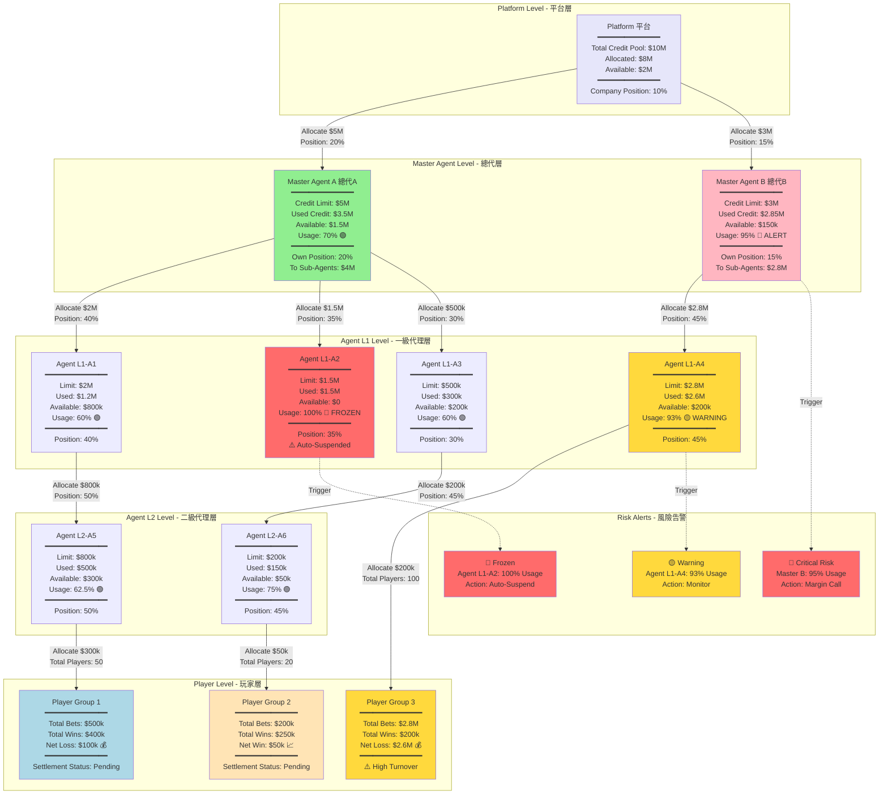
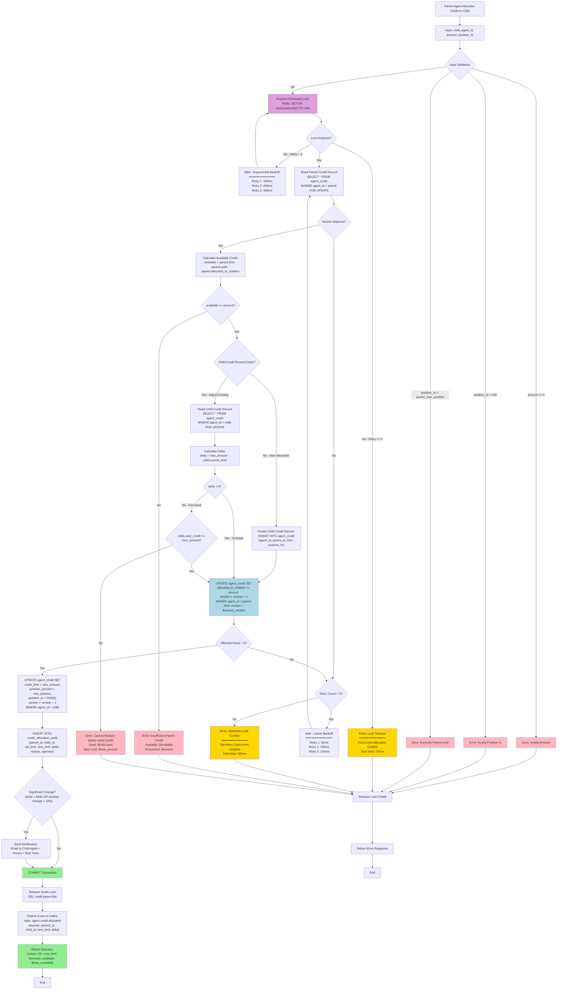

# 06-02 信用網與額度邏輯 (Credit Network Logic)

## 1. 系統概述
信用網 (Credit Network) 是亞洲市場特有的營運模式，與現金網 (Cash Market) 的核心差異在於 **「先遊玩、後結算」**。
系統需支援 **信用額度 (Credit Limit)** 的授予、消耗、歸還，以及代理體系內的 **佔成 (Position Taking)** 計算。

## 2. 核心邏輯模型

### 2.1 雙錢包體系 (Dual Wallet System)
為了兼容現金與信用模式，玩家帳戶應具備兩個獨立錢包：
- **Cash Wallet (現金錢包)**：透過金流充值，餘額 `Balance` 必須 > 0 才能下注。
- **Credit Wallet (信用錢包)**：
  - **Credit Limit (信用額度)**：由上級代理授予的最高可輸金額 (Max Loss)。
  - **Used Credit (已用額度)**：當前未結算的輸贏總和。
  - **Available Credit (可用額度)**：`Limit - Used`。
  - **邏輯**：下注時不扣除 Balance，而是增加 `Exposure` (曝險)。結算 (Settlement) 時才更新 `Used Credit`。

### 2.2 額度傳遞 (Credit Propagation)
額度由最高層級向下發放，形成樹狀結構：
`Platform` -> `Master Agent (總代)` -> `Agent L1` -> `Agent L2` -> `Player`

*   **授信 (Allocation)**：上級可隨時調整下級的 Limit。
*   **強平 (Liquidation)**：
    *   當下級 `Used / Limit > 90%` (警戒線)，發送通知。
    *   當 `Used >= Limit` (爆倉)，自動暫停下級所有玩家的下注權限。

#### 2.2.1 信用傳播樹狀圖 (Credit Network Tree)

以下樹狀圖展示了代理信用網絡的完整層級結構、額度分配、佔成機制及風險狀態：



**信用網絡關鍵指標說明**：

| 層級 | 代理 | Credit Limit | Used Credit | Usage % | 風險狀態 | 佔成 % | 下級分配 |
|------|------|-------------|-------------|---------|---------|--------|---------|
| **Platform** | 平台 | $10M | $8M | 80% | 🟢 Normal | 10% | $8M |
| **Master** | 總代 A | $5M | $3.5M | 70% | 🟢 Normal | 20% | $4M |
| **Master** | 總代 B | $3M | $2.85M | 95% | 🔴 **Margin Call** | 15% | $2.8M |
| **L1** | Agent A1 | $2M | $1.2M | 60% | 🟢 Normal | 40% | $800k |
| **L1** | Agent A2 | $1.5M | $1.5M | 100% | 🔴 **Frozen** | 35% | $0 (已爆倉) |
| **L1** | Agent A3 | $500k | $300k | 60% | 🟢 Normal | 30% | $200k |
| **L1** | Agent A4 | $2.8M | $2.6M | 93% | 🟡 **Warning** | 45% | $200k |
| **L2** | Agent A5 | $800k | $500k | 62.5% | 🟢 Normal | 50% | $300k |
| **L2** | Agent A6 | $200k | $150k | 75% | 🟢 Normal | 45% | $50k |

**風險警戒線規則**：

| Usage % 區間 | 風險等級 | 自動化動作 | 通知對象 |
|-------------|---------|-----------|---------|
| **0-80%** | 🟢 Normal | 無 | 無 |
| **81-90%** | 🟡 Warning | 發送告警郵件 | 代理本人 + 上級 |
| **91-99%** | 🟠 High Risk | 降低下級額度分配上限 | 代理 + 上級 + 風控 |
| **100%+** | 🔴 Critical | 自動凍結所有下級投注 | 全層級 + 緊急處理 |

**佔成傳遞計算範例** (以 Player Group 1 為例)：

假設 Player Group 1 淨虧損 $100k，佔成分配需經過標準化處理：

**Step 1: 計算原始佔成總和**

```
總輸金額: $100,000

各級宣告佔成:
- Agent L2-A5: 50%
- Agent L1-A1: 40%
- Master Agent A: 20%
- Platform: 10%

佔成總計: 50% + 40% + 20% + 10% = 120% ⚠️ (超過 100%)
```

**Step 2: 標準化計算** (Normalization)

由於佔成總和為 120% 而非 100%，需計算標準化係數：

```
標準化係數 = 玩家實際輸額 / 佔成理論總額
          = $100,000 / ($100,000 × 120%)
          = $100,000 / $120,000
          = 0.8333
```

**Step 3: 實際分配金額**

```
Player Group 1: -$100,000 (需支付)
  ↓
Agent L2-A5 (Position 50%):
  理論佔成: $100k × 50% = $50,000
  標準化後: $50,000 × 0.8333 = $41,665
  收取 $100k，保留 $41,665，上繳 $58,335
  ↓
Agent L1-A1 (Position 40%):
  理論佔成: $100k × 40% = $40,000
  標準化後: $40,000 × 0.8333 = $33,332
  從下級收 $58,335，保留 $33,332，上繳 $25,003
  ↓
Master Agent A (Position 20%):
  理論佔成: $100k × 20% = $20,000
  標準化後: $20,000 × 0.8333 = $16,666
  從下級收 $25,003，保留 $16,666，上繳 $8,337
  ↓
Platform (Position 10%):
  理論佔成: $100k × 10% = $10,000
  標準化後: $10,000 × 0.8333 = $8,333
  最終平台收入: $8,333

驗證總和: $41,665 + $33,332 + $16,666 + $8,333 = $99,996 ≈ $100,000 ✅
```

**關鍵公式**:


**信用額度級聯影響**：

當 Agent L1-A2 爆倉（Usage 100%）時：
1. ⚠️ **自動凍結**：所有下級玩家無法下注
2. 📧 **Margin Call**：系統發送追繳保證金通知
3. 🔒 **上級鎖定**：Master Agent A 的 Available Credit 同步減少 $1.5M
4. 📊 **級聯監控**：Master Agent A Usage 從 70% → 83.3%（接近警戒線）
5. 💰 **結算凍結**：該代理週結算前必須補足虧損，否則無法恢復額度

## 3. 佔成機制 (Position Taking)

佔成決定了代理與上級如何分擔玩家的輸贏風險。

### 3.1 佔成公式
`Agent Win/Loss = (Player Win/Loss) * (Agent Position %)`

**範例情境**：
*   玩家輸 $10,000。
*   代理 A (直屬) 佔成 40%。
*   代理 B (上級) 佔成 30%。
*   總代 C (最高級) 佔成 20% (剩餘 10% 歸平台/公司)。

**結果**：
*   玩家：-10,000 (需支付給代理 A)
*   代理 A：+4,000 (從玩家收 10k，上繳 6k)
*   代理 B：+3,000
*   總代 C：+2,000
*   平台：+1,000

### 3.2 佔成限制 (Constraint)
*   **Max Position**：下級佔成比例不得超過上級設定的上限。
*   **Auto-Hedge**：若代理不想承擔風險，可將佔成設為 0% (全額上繳，只賺水錢)。

## 4. 結算流程 (Settlement Process)

### 4.1 週期性結算
信用網通常採用 **週結 (Weekly)** 或 **月結 (Monthly)**。

1.  **Freeze (凍結)**：每週一 12:00 凍結上一週的 Credit 帳目。
2.  **Statement Generation (報表生成)**：計算每位代理應收/應付金額 (AR/AP)。
3.  **Settlement (對帳/清算)**：
    *   代理透過銀行轉帳/USDT 結算差額。
    *   上級確認收到款項後，執行 `Reset Credit` (恢復額度)。

### 4.2 信用結算工單 (Settlement Agent)
系統需提供 "帳務工單" 功能：
*   `Type`: Deposit (上繳贏利) / Refill (補足虧損)。
*   `Status`: Pending -> Reviewed -> Completed。

#### 4.2.1 週結算流程時序圖 (Weekly Settlement Sequence)

以下時序圖展示了信用網週結算的完整流程，從凍結帳目到額度恢復的端到端處理：

```mermaid
sequenceDiagram
    participant CronJob
    participant SettlementService
    participant AgentL2
    participant AgentL1
    participant MasterAgent
    participant Platform
    participant DB
    participant NotificationService
    participant PaymentGateway

    Note over CronJob,PaymentGateway: Weekly Settlement - Every Monday 12:00 AM (T+1)

    rect rgb(255, 230, 230)
        Note over CronJob,DB: Phase 1: Freeze & Calculate (12:00 - 13:00)

        CronJob->>SettlementService: triggerWeeklySettlement(week=W-1)
        SettlementService->>DB: BEGIN TRANSACTION (Isolation: SERIALIZABLE)

        SettlementService->>DB: UPDATE credit_accounts<br/>SET status='FROZEN', frozen_at=NOW()<br/>WHERE settlement_week = W-1

        SettlementService->>DB: SELECT * FROM agents<br/>ORDER BY level DESC (Leaf nodes first)
        DB-->>SettlementService: [AgentL2, AgentL1, Master, ...]

        loop For each Agent L2 (Bottom-Up)
            SettlementService->>AgentL2: calculatePosition(week=W-1)

            AgentL2->>DB: SELECT SUM(player_bets - player_wins)<br/>FROM player_transactions<br/>WHERE agent_id = L2 AND week = W-1
            DB-->>AgentL2: net_player_loss = $100,000

            AgentL2->>AgentL2: own_position = $100k × 50% (Position %) = $50,000
            AgentL2->>AgentL2: to_parent = $100k - $50k = $50,000

            AgentL2->>DB: INSERT INTO settlement_records<br/>(agent_id, week, player_loss, own_share, to_parent)<br/>VALUES (L2, W-1, $100k, $50k, $50k)

            AgentL2->>DB: UPDATE agent_credit<br/>SET used_credit += $50k,<br/>settlement_status = 'PENDING'

            AgentL2->>NotificationService: sendSettlementNotice(agentId=L2, amount=$50k)
        end

        loop For each Agent L1
            SettlementService->>AgentL1: aggregateChildPositions()

            AgentL1->>DB: SELECT SUM(to_parent) FROM settlement_records<br/>WHERE parent_id = L1 AND week = W-1
            DB-->>AgentL1: total_from_children = $50,000

            AgentL1->>DB: SELECT SUM(direct_player_loss) FROM player_transactions<br/>WHERE agent_id = L1 AND week = W-1
            DB-->>AgentL1: direct_player_loss = $20,000

            AgentL1->>AgentL1: total_player_loss = $50k + $20k = $70k
            AgentL1->>AgentL1: own_position = $70k × 40% = $28,000
            AgentL1->>AgentL1: to_parent = $70k - $28k = $42,000

            AgentL1->>DB: INSERT INTO settlement_records<br/>(agent_id, week, total_loss, own_share, to_parent)<br/>VALUES (L1, W-1, $70k, $28k, $42k)

            AgentL1->>NotificationService: sendSettlementNotice(agentId=L1, amount=$28k)
        end

        loop For each Master Agent
            SettlementService->>MasterAgent: aggregateChildPositions()

            MasterAgent->>DB: SELECT SUM(to_parent) FROM settlement_records<br/>WHERE parent_id = Master AND week = W-1
            DB-->>MasterAgent: total_from_children = $42,000

            MasterAgent->>MasterAgent: own_position = $42k × 20% = $8,400
            MasterAgent->>MasterAgent: to_platform = $42k - $8.4k = $33,600

            MasterAgent->>DB: INSERT INTO settlement_records<br/>(agent_id, week, total_loss, own_share, to_platform)<br/>VALUES (Master, W-1, $42k, $8.4k, $33.6k)

            MasterAgent->>NotificationService: sendSettlementNotice(agentId=Master, amount=$8.4k)
        end

        SettlementService->>Platform: aggregateMasterPositions()
        Platform->>DB: SELECT SUM(to_platform) FROM settlement_records<br/>WHERE parent_id = Platform AND week = W-1
        DB-->>Platform: total_platform_revenue = $33,600 + ... = $50,000

        Platform->>DB: INSERT INTO platform_revenue<br/>(week, total_revenue, source)<br/>VALUES (W-1, $50k, 'CREDIT_SETTLEMENT')

        SettlementService->>DB: COMMIT

        Note over SettlementService,DB: Settlement Records Generated & Frozen
    end

    rect rgb(230, 255, 230)
        Note over SettlementService,PaymentGateway: Phase 2: Payment Collection (13:00 - Friday 18:00)

        loop For each Agent (Bottom-Up Order)
            alt Agent owes money (Net Loss)
                NotificationService->>AgentL2: Email: "You owe $50k to Parent. Deadline: Friday 18:00"

                AgentL2->>PaymentGateway: Initiate Bank Transfer ($50k)
                PaymentGateway-->>AgentL2: Transfer Completed (Reference: TXN_12345)

                AgentL2->>SettlementService: submitPaymentProof(txn_id=TXN_12345, amount=$50k)
                SettlementService->>DB: INSERT INTO settlement_payments<br/>(agent_id, week, amount, txn_id, status)<br/>VALUES (L2, W-1, $50k, TXN_12345, 'PENDING_VERIFY')

                SettlementService->>AgentL1: notifyPaymentReceived(child=L2, amount=$50k)

            else Agent receives money (Net Win)
                NotificationService->>AgentL2: Email: "You will receive $30k from Parent"

                AgentL1->>PaymentGateway: Initiate Payout ($30k to L2)
                PaymentGateway-->>AgentL2: Funds Received
            end
        end
    end

    rect rgb(230, 230, 255)
        Note over SettlementService,Platform: Phase 3: Verification & Credit Reset (Friday 18:00 - Saturday 12:00)

        loop For each Settlement Payment
            SettlementService->>AgentL1: verifyPayment(child=L2, txn_id=TXN_12345)

            AgentL1->>PaymentGateway: GET /transactions/TXN_12345/verify
            PaymentGateway-->>AgentL1: {status: CONFIRMED, amount: $50k, from: AgentL2}

            alt Payment Verified
                AgentL1->>DB: UPDATE settlement_payments<br/>SET status='VERIFIED', verified_at=NOW()<br/>WHERE txn_id = TXN_12345

                AgentL1->>DB: UPDATE settlement_records<br/>SET payment_status='COMPLETED'<br/>WHERE agent_id = L2 AND week = W-1

                AgentL1->>SettlementService: confirmSettlementComplete(child=L2)

                SettlementService->>DB: UPDATE agent_credit<br/>SET used_credit = 0,<br/>status = 'ACTIVE',<br/>last_settlement = NOW()<br/>WHERE agent_id = L2

                SettlementService->>NotificationService: sendCreditResetNotice(agentId=L2)

            else Payment Not Received (Deadline Passed)
                AgentL1->>DB: UPDATE settlement_payments<br/>SET status='OVERDUE'<br/>WHERE txn_id = TXN_12345

                AgentL1->>DB: UPDATE agent_credit<br/>SET status='SUSPENDED',<br/>credit_limit = 0<br/>WHERE agent_id = L2

                AgentL1->>NotificationService: sendSuspensionNotice(agentId=L2, reason='OVERDUE_PAYMENT')

                Note over AgentL2: ⚠️ Agent Suspended - No Credit Until Payment
            end
        end
    end

    rect rgb(255, 255, 230)
        Note over SettlementService,Platform: Phase 4: Final Report & Audit (Saturday 12:00)

        SettlementService->>DB: SELECT * FROM settlement_records<br/>WHERE week = W-1

        SettlementService->>SettlementService: generateSettlementReport(week=W-1)

        SettlementService->>Platform: publishWeeklyReport({<br/>total_volume: $5M,<br/>total_platform_revenue: $50k,<br/>completed_agents: 95%,<br/>overdue_agents: 5%<br/>})

        Platform->>NotificationService: sendExecutiveSummary(recipients=[CFO, CEO])

        SettlementService->>DB: UPDATE settlement_batches<br/>SET status='COMPLETED', completed_at=NOW()<br/>WHERE week = W-1

        Note over Platform: Settlement Cycle Complete ✅
    end

    style AgentL2 fill:#ADD8E6
    style AgentL1 fill:#90EE90
    style MasterAgent fill:#FFE4B5
    style Platform fill:#E6E6FA
    style PaymentGateway fill:#DDA0DD
```

**結算流程關鍵階段說明**：

| 階段 | 時間窗口 | 主要動作 | 責任方 | 關鍵指標 |
|------|---------|---------|--------|---------|
| **Phase 1: Freeze & Calculate** | 週一 12:00 - 13:00 | 凍結帳目、計算佔成、生成報表 | System Automated | 計算準確率: 100% |
| **Phase 2: Payment Collection** | 週一 13:00 - 週五 18:00 | 代理上繳款項、驗證交易 | Agents | 準時繳款率: > 95% |
| **Phase 3: Verification & Reset** | 週五 18:00 - 週六 12:00 | 驗證付款、恢復額度 | Parent Agents | 驗證準確率: 100% |
| **Phase 4: Final Report** | 週六 12:00 | 生成週報、審計報告 | Platform | 報告完整性: 100% |

**佔成分配計算流程** (Bottom-Up 聚合)：

```
Step 1: Calculate Agent L2 Position
  Player Loss: $100,000
  Agent L2 Position (50%): $50,000
  To Parent (Agent L1): $50,000

Step 2: Calculate Agent L1 Position
  From Children: $50,000
  Direct Players: $20,000
  Total: $70,000
  Agent L1 Position (40%): $28,000
  To Parent (Master): $42,000

Step 3: Calculate Master Agent Position
  From Children: $42,000
  Master Position (20%): $8,400
  To Platform: $33,600

Step 4: Platform Revenue
  From Masters: $33,600
  Platform Position (10%): 已包含在上級分配中
  Total Revenue: $33,600
```

**逾期處理規則**：

| 逾期天數 | 自動化動作 | 額度影響 | 業務影響 |
|---------|-----------|---------|---------|
| **0-3 天** | 發送催繳郵件 | 無 | 無 |
| **4-7 天** | 降低 Credit Limit 50% | 現有額度減半 | 下級玩家部分受限 |
| **8-14 天** | 凍結 Credit Limit | Credit Limit = 0 | 所有下級無法下注 |
| **15+ 天** | 帳戶暫停 + 法務介入 | 永久凍結 | 關閉代理帳戶 |

**結算異常處理**：

| 異常類型 | 檢測方式 | 處理策略 | 通知對象 |
|---------|---------|---------|---------|
| **佔成計算錯誤** | SUM(child_positions) ≠ player_loss | 觸發人工審核 + 回滾事務 | 技術團隊 + 財務 |
| **重複結算** | settlement_week 已存在 | 拒絕重複執行 + 告警 | 系統管理員 |
| **額度超限** | 恢復後 Available Credit < 0 | 限制額度為 0 + 人工核查 | 風控 + 上級代理 |
| **支付驗證失敗** | Payment Gateway 返回 NOT_FOUND | 標記為逾期 + 發送催繳 | 代理 + 上級 |

### 信用分配流程圖 (Credit Allocation Flow)

以下流程圖展示了代理分配信用額度時的完整邏輯，包括併發控制、樂觀鎖、額度驗證及異常處理：



**併發控制關鍵設計**：

| 併發問題 | 場景描述 | 解決方案 | 實現方式 |
|---------|---------|---------|---------|
| **重複分配** | Parent 同時給 2 個 Child 分配額度，總額超過 Available | Redis 分散式鎖 | `SET NX credit:parent:${id}` TTL=30s |
| **版本衝突** | 2 個操作同時修改 Parent 的 `allocated_to_children` | 樂觀鎖 (Optimistic Locking) | `WHERE version = ? AND UPDATE version = version + 1` |
| **超額分配** | Child A 獲得額度後，Parent 的 Available 不足給 Child B | 悲觀鎖 (Pessimistic Locking) | `SELECT ... FOR UPDATE` |
| **額度收回衝突** | Parent 收回額度時，Child 正在使用 | 檢查 Child Used Credit | `child.used_credit <= new_limit` |
| **死鎖** | Parent A 鎖 Child B，Parent B 鎖 Child A | 按 agent_id 排序鎖定 | 總是先鎖 `MIN(parent_id, child_id)` |

**額度分配規則矩陣**：

| 操作類型 | Parent Available | Child Used | 允許? | 自動化動作 |
|---------|-----------------|-----------|-------|-----------|
| **首次分配** | >= Amount | N/A (新建) | ✅ | 創建 Child 記錄 |
| **增加額度** | >= Delta | 任意 | ✅ | Parent allocated += delta |
| **減少額度** | 任意 | <= New Limit | ✅ | Parent allocated -= delta |
| **減少額度** | 任意 | > New Limit | ❌ | 拒絕：Child 已用額度超過新限額 |
| **收回額度** | 任意 | > 0 | ❌ | 拒絕：必須先結算 Child Used Credit |
| **收回額度** | 任意 | = 0 | ✅ | 設定 Child Limit = 0，Parent allocated -= old_limit |

**審計日誌範例** (credit_allocation_audit 表)：


**通知觸發規則**：

| 條件 | 觸發閾值 | 通知對象 | 通知方式 | 內容範例 |
|------|---------|---------|---------|---------|
| **額度大幅增加** | Delta > $10,000 | Child + Parent + Risk | Email + SMS | "Your credit limit increased to $1.5M (+$500k)" |
| **佔成大幅調整** | Position 變化 > 10% | Child + Parent + Finance | Email | "Position changed from 40% to 50%" |
| **額度收回** | New Limit < Old Limit | Child + Parent | Email + In-App | "Credit limit reduced to $500k due to [Reason]" |
| **接近上限** | Used / Limit > 90% | Child + Parent | Email + SMS | "Warning: 92% credit used ($920k / $1M)" |
| **超額使用** | Used > Limit | Child + Parent + Risk | Urgent: Phone + Email | "CRITICAL: Credit limit exceeded. Account frozen." |

**錯誤碼定義**：

| 錯誤碼 | 錯誤類型 | HTTP Status | 描述 | 客戶端處理建議 |
|-------|---------|-------------|------|--------------|
| `CREDIT_001` | INVALID_AMOUNT | 400 | 分配額度 <= 0 | 驗證輸入金額 |
| `CREDIT_002` | INVALID_POSITION | 400 | 佔成百分比 > 100% | 驗證佔成範圍 |
| `CREDIT_003` | EXCEEDS_PARENT_LIMIT | 403 | 超過 Parent 允許的最大佔成 | 聯繫上級調整限制 |
| `CREDIT_004` | LOCK_TIMEOUT | 409 | 分散式鎖獲取超時 | 稍後重試 (Retry-After: 60s) |
| `CREDIT_005` | OPTIMISTIC_LOCK_CONFLICT | 409 | 樂觀鎖版本衝突 | 自動重試 (最多 3 次) |
| `CREDIT_006` | INSUFFICIENT_PARENT_CREDIT | 403 | Parent Available Credit 不足 | 等待 Parent 補充額度 |
| `CREDIT_007` | CANNOT_REDUCE_BELOW_USED | 409 | 無法降低至 Used Credit 以下 | 先結算 Child 負債 |

**Kafka 事件 Schema**：

```json
{
  "event_type": "agent.credit.allocated",
  "timestamp": "2026-01-27T15:30:00Z",
  "data": {
    "parent_id": "agent_001",
    "child_id": "agent_002",
    "old_limit": 1000000,
    "new_limit": 1500000,
    "delta": 500000,
    "position_percent": 45.0,
    "parent_available_after": 500000,
    "operator": "admin_123",
    "reason": "Performance upgrade"
  }
}
```

**下游消費者**：
- **Risk Management Service**: 監控額度異常變化（如突然增加 100%）
- **Notification Service**: 發送郵件/SMS 通知
- **Analytics Service**: 統計額度分配趨勢、代理活躍度
- **Audit Service**: 歸檔審計日誌（7 年保留期）

## 5. 風控邏輯
*   **異常佔成監控**：若某代理突然將佔成調至 100% 且下線玩家大量贏錢，觸發 "聯合套利" 警報。
*   **信用評分**：依據代理歷史結算準時度，給予信用評分，影響可獲取的最大額度。

### 5.1 風控規則引擎整合

信用網絡的風控檢測必須與 [05-01 風控系統](../05_Risk_Management/05-01_Risk_Control_System.md) 深度整合，實現實時監控與異常攔截。

**API 調用範例**：


**風險場景矩陣**：

| 風險場景 | 檢測指標 | 閾值 | 處置動作 | 參考文檔 |
|---------|---------|------|---------|---------|
| **聯合套利** | 佔成突增 + 下級大贏 | Position 變化 > 50% AND 玩家淨贏 > $100k | 凍結額度 + 人工審核 | [05-01 §3.2](../05_Risk_Management/05-01_Risk_Control_System.md#32-优惠滥用是最大风险来源) |
| **信用詐騙** | 新代理高額申請 | 註冊 < 30 天 AND 申請額度 > $50k | 降低額度 + 加強 KYC | [05-01 §3.3](../05_Risk_Management/05-01_Risk_Control_System.md#33-帳號安全面臨大規模自動化攻擊) |
| **結算逾期** | 歷史逾期率高 | 逾期次數 >= 3 次/年 | 降低信用評分 + 限制額度 | [05-01 §4.1](../05_Risk_Management/05-01_Risk_Control_System.md#41-整合點總覽-integration-points-overview) |
| **多帳號濫用** | 同設備多代理 | 設備指紋關聯 >= 3 個代理 | 阻擋分配 + 調查 | [05-01 §2.2](../05_Risk_Management/05-01_Risk_Control_System.md#多維欺詐檢測決策樹-multi-dimensional-fraud-detection-decision-tree) |

---

## 6. 數據模型 (Data Schema)

### 6.1 代理信用表 (agent_credit)


### 6.2 結算記錄表 (settlement_records)


---

## 📚 相關文檔

- [05-01 風控系統](../05_Risk_Management/05-01_Risk_Control_System.md) - 代理風險評估、異常佔成檢測
- [02-06 統一錢包模型](../02_Finance_Center/02-06_Unified_Wallet_Model.md) - 雙錢包體系、Credit Wallet 實現
- [06-01 代理管理系統](./06-01_Agent_Management_System.md) - 代理層級架構、權限管理

---

**最後更新**: 2026-01-27
**維護團隊**: Agent Network Team

---

**文檔版本**: 1.0.0
**最後更新**: 2026-01-28
**維護團隊**: Product Team & Backend Team
