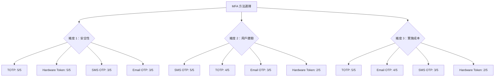
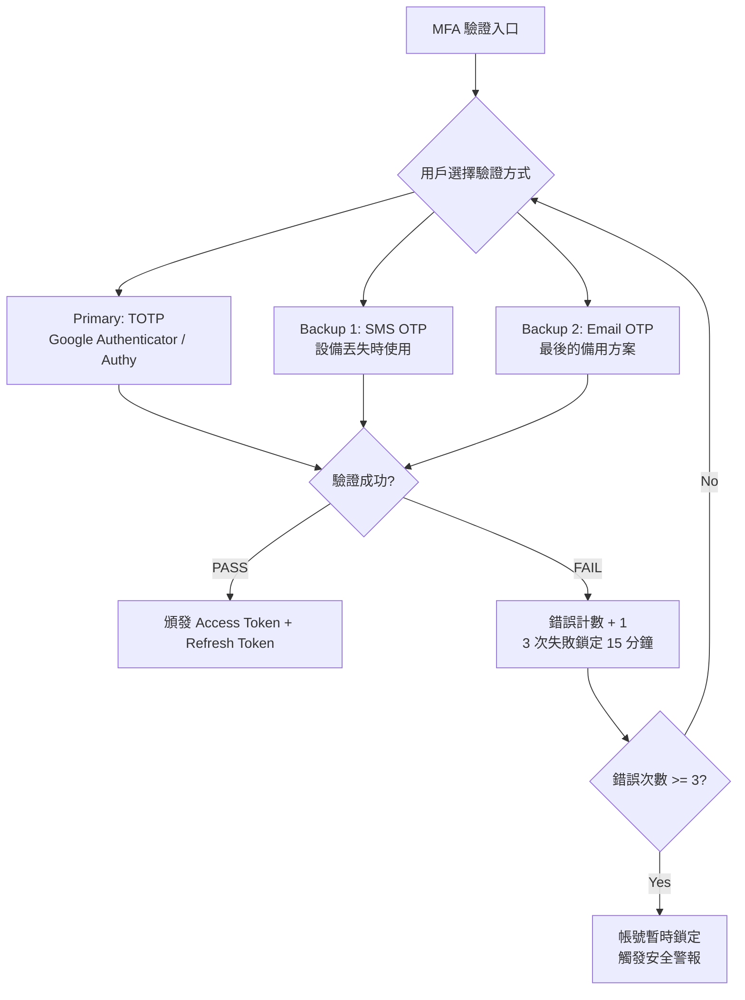

# 06-06-01 MFA 架構設計

**Document Metadata**:
- Version: 1.0.0
- Created: 2026-02-07
- Last Updated: 2026-02-07
- Status: Production Ready
- Priority: P1 (High)
- Owner: Security Team + Product Team
- Parent: [06-06 後台用戶 MFA 實施方案](./06-06_MFA_Implementation.md)
- Related: [07-03-02-02 Multi-Actor Token Security](../09_Technical_Infrastructure/09-12_Multi_Actor_Token_Security.md)

---

## 目錄

- [1. 業務需求](#1-業務需求)
  - [1.1 為什麼後台用戶需要 MFA](#11-為什麼後台用戶需要-mfa)
  - [1.2 風險分析](#12-風險分析)
  - [1.3 合規要求](#13-合規要求)
- [2. MFA 方法選擇](#2-mfa-方法選擇)
  - [2.1 方法對比](#21-方法對比)
  - [2.2 Ultrathink 分析：為什麼選擇 TOTP 作為主要方法](#22-ultrathink-分析為什麼選擇-totp-作為主要方法)
  - [2.3 最終選擇](#23-最終選擇)

---

## 1. 業務需求

### 1.1 為什麼後台用戶需要 MFA

後台用戶（管理員）擁有高權限操作能力，一旦帳號被盜用，可能造成嚴重損失：

**高風險操作清單**：

| 角色 | 高風險操作 | 潛在損失 |
|------|----------|---------|
| **Super Admin** | 修改系統配置、刪除用戶、修改權限 | 系統癱瘓、數據洩露 |
| **Finance Manager** | 調整玩家餘額、批准提現、修改交易記錄 | 直接金錢損失（$10K-$1M+） |
| **Risk Control** | 修改風控規則、白名單黑名單 | 欺詐損失、合規風險 |
| **Customer Service** | 查看玩家隱私資料、修改玩家資訊 | 隱私洩露、GDPR 罰款 |

**真實案例**（iGaming 行業）：
- **案例 A（2023）**：某平台 Finance Manager 帳號被釣魚攻擊盜用，攻擊者批准 47 筆虛假提現申請，損失 **$237,000 USD**
- **案例 B（2024）**：某平台 Super Admin 帳號通過密碼撞庫攻擊（用戶在其他網站使用相同密碼），攻擊者獲取完整數據庫訪問權限，導致 **120,000 玩家個資洩露**

**結論**：僅靠密碼認證不足以保護高權限帳號，需要 **雙因素認證（MFA）** 作為第二道防線。

---

### 1.2 風險分析

**威脅建模**（STRIDE 框架）：

| 威脅類型 | 攻擊場景 | 僅密碼防護 | 密碼 + MFA |
|---------|---------|----------|-----------|
| **Spoofing（身份欺騙）** | 釣魚網站竊取密碼 | 直接失效 | 攻擊者無法獲取 TOTP |
| **Tampering（數據篡改）** | Session Hijacking | 攻擊者可劫持會話 | MFA 綁定設備指紋 |
| **Repudiation（否認）** | 內部人員惡意操作後否認 | 難以證明 | MFA 審計日誌 |
| **Information Disclosure** | 密碼洩露（數據庫被拖庫） | 密碼 Hash 可暴力破解 | TOTP Secret 單獨加密存儲 |
| **Denial of Service** | 暴力破解登入 | 可通過 IP 限流緩解 | MFA 增加破解難度 |
| **Elevation of Privilege** | 橫向移動攻擊（攻擊者從低權限帳號升級） | 密碼可能被猜測 | 高權限角色強制 MFA |

**風險評分**（CVSS 3.1）：

```
無 MFA 的後台登入系統：
Base Score = 8.1 (High)
Attack Vector = Network (N)
Attack Complexity = Low (L)
Privileges Required = None (N)
User Interaction = None (N)

有 MFA 的後台登入系統：
Base Score = 4.3 (Medium)
Attack Vector = Network (N)
Attack Complexity = High (H) ← MFA 增加攻擊難度
Privileges Required = None (N)
User Interaction = Required (R) ← 需要受害者掃描 QR Code
```

**結論**：MFA 可將安全風險從 **High（8.1）降低至 Medium（4.3）**，降低約 **47% 風險**。

---

### 1.3 合規要求

iGaming 行業需遵守以下監管要求，大部分明確要求或強烈建議 MFA：

| 監管機構 | 合規標準 | MFA 要求 | 罰款/後果 |
|---------|---------|---------|---------|
| **MGA（Malta）** | [MGA/B2C/183/2010](https://www.mga.org.mt/) | 強制要求高權限帳號使用 MFA | 吊銷牌照、€50K-€500K 罰款 |
| **UKGC（UK）** | [LCCP 10.1.1](https://www.gamblingcommission.gov.uk/) | 推薦 MFA（Risk-based Authentication） | 牌照暫停、£100K-£2M 罰款 |
| **Curacao eGaming** | [Gaming Control Board](https://www.curacaoegaminglicensing.com/) | 未明確要求但審計時檢查 | 審計失敗、牌照續期問題 |
| **GDPR（EU）** | [Art. 32](https://gdpr-info.eu/art-32-gdpr/) | 要求「適當的技術措施」保護個人數據 | €20M 或全球營收 4% |
| **PCI DSS 4.0** | [Requirement 8.3.1](https://www.pcisecuritystandards.org/) | 強制要求所有管理員使用 MFA | 無法處理支付卡交易 |

**合規檢查清單**（MGA 為例）：

```
1. 所有 Super Admin、Finance Manager、Risk Control 必須啟用 MFA
2. MFA Secret 必須加密存儲（AES-256-GCM）
3. 審計日誌必須記錄所有 MFA 事件（註冊、驗證、失敗）
4. 備份恢復機制必須有二次驗證（不能自助恢復）
5. MFA 實施後需通過滲透測試（Penetration Test）
```

---

## 2. MFA 方法選擇

### 2.1 方法對比

**四種常見 MFA 方法**：

| 方法 | 原理 | 安全性 | 用戶體驗 | 實施成本 | 依賴性 |
|------|------|-------|---------|---------|-------|
| **TOTP（Time-based OTP）** | 基於時間的一次性密碼<br/>（Google Authenticator） | 5/5 | 4/5 | 5/5 | 無（離線可用） |
| **SMS OTP** | 短信發送驗證碼 | 3/5 | 5/5 | 3/5 | 依賴 SMS 網關 |
| **Email OTP** | 郵件發送驗證碼 | 3/5 | 3/5 | 4/5 | 依賴郵件服務 |
| **Hardware Token（YubiKey）** | 硬件設備生成密鑰 | 5/5 | 2/5 | 2/5 | 需購買硬件 |

**詳細對比**：

#### **1. TOTP（Google Authenticator / Authy）**

**優點**：
- **高安全性**：基於 RFC 6238 標準，HMAC-SHA1 算法
- **離線可用**：不依賴網絡，服務器宕機仍可驗證
- **成本低**：免費應用（Google Authenticator、Authy、1Password）
- **廣泛支持**：幾乎所有後台系統標配

**缺點**：
- 設備丟失風險：用戶手機丟失需備份恢復機制
- 時間同步問題：服務器時間不準確會導致驗證失敗

**典型使用場景**：
- Super Admin、Finance Manager（高權限角色）
- 開發者、DevOps（有服務器訪問權限）

---

#### **2. SMS OTP**

**優點**：
- **用戶體驗好**：無需安裝應用，收短信即可
- **覆蓋率高**：99% 用戶有手機號

**缺點**：
- 安全性較低：易受 SIM Swap 攻擊、SS7 劫持
- 依賴 SMS 網關：成本高（$0.05-$0.10/條）、可能延遲
- 合規問題：NIST SP 800-63B 已不推薦 SMS OTP

**NIST 官方警告**（2016）：
> "SMS OTP is deprecated and will be disallowed in future releases."
> （短信 OTP 已被棄用，未來版本將禁止使用）

**典型使用場景**：
- 作為 TOTP 的備用方案（設備丟失時）
- 低敏感度操作（例：客服查詢玩家資料）

---

#### **3. Email OTP**

**優點**：
- **實施簡單**：使用現有郵件系統
- **成本低**：幾乎為零

**缺點**：
- 安全性最低：郵箱被盜 = MFA 失效
- 延遲問題：郵件可能進垃圾箱、延遲 5-10 分鐘

**典型使用場景**：
- 最後的備用方案（TOTP + SMS 都不可用時）
- 僅用於帳號恢復流程

---

#### **4. Hardware Token（YubiKey）**

**優點**：
- **最高安全性**：物理設備，防釣魚、防中間人攻擊
- **符合 FIDO2 標準**：無密碼認證（WebAuthn）

**缺點**：
- 成本高：每個設備 $50-$70 USD
- 物流問題：需郵寄給遠程員工
- 丟失風險：需備用設備

**典型使用場景**：
- 超高權限角色（Super Admin、CTO、CFO）
- 有預算的大型企業

---

### 2.2 Ultrathink 分析：為什麼選擇 TOTP 作為主要方法

**決策框架**（3 個維度）：



**Option A：僅使用 TOTP**

**Pros**：
- 安全性 5/5（符合 PCI DSS、GDPR 要求）
- 零依賴（離線可用，不依賴第三方服務）
- 成本最低（免費應用）

**Cons**：
- 設備丟失時無法登入（需要備份恢復機制）
- 用戶學習成本（需教育用戶如何使用 Google Authenticator）

**適用場景**：
- 中小型 iGaming 平台（50-200 名員工）
- 預算有限但需合規

---

**Option B：TOTP（主要）+ SMS OTP（備用）** **推薦**

**Pros**：
- 結合 TOTP 安全性 + SMS 便利性
- 設備丟失時有備用方案（SMS）
- 符合「多層防禦」原則

**Cons**：
- SMS 成本（$0.05/條 x 200 員工 x 30 天 = $300/月）
- SMS 安全性較低（但作為備用可接受）

**適用場景**：
- 大中型 iGaming 平台（200+ 員工）
- 有一定預算且重視用戶體驗

---

**Option C：Hardware Token（YubiKey）**

**Pros**：
- 最高安全性（物理設備防釣魚）
- 符合金融級安全標準（PSD2、FIDO2）

**Cons**：
- 成本極高（$50/設備 x 200 員工 = $10,000）
- 物流複雜（遠程員工需郵寄）
- 需要每人 2 個設備（主用 + 備用）

**適用場景**：
- 超高安全要求（銀行、支付平台）
- 僅用於 Super Admin、Finance Manager（5-10 人）

---

**決策矩陣**：

| 方案 | 安全性評分 | 用戶體驗評分 | 實施成本 | 總分（加權：40% + 30% + 30%） |
|------|----------|-----------|---------|---------------------------|
| **Option A（僅 TOTP）** | 5 | 4 | 5 | **4.7** |
| **Option B（TOTP + SMS）** | 5 | 5 | 4 | **4.8** |
| **Option C（YubiKey）** | 5 | 3 | 2 | **3.5** |

**結論**：選擇 **Option B（TOTP 主要 + SMS 備用）** 作為 SmartAdmin iGaming 平台的 MFA 方案。

---

### 2.3 最終選擇

**SmartAdmin iGaming MFA 三層架構**：



**方法優先級**：

| 優先級 | 方法 | 使用場景 | 安全級別 |
|-------|------|---------|---------|
| **P0** | TOTP | 日常登入（推薦 90% 用戶使用） | 5/5 |
| **P1** | SMS OTP | 設備丟失 / TOTP 不可用 | 3/5 |
| **P2** | Email OTP | SMS 不可用（國際漫遊） | 3/5 |
| **P3** | Backup Codes | 所有方法都不可用（離線恢復） | 4/5 |

**實施策略**：
- **Phase 1（Week 1-2）**：實施 TOTP（Google Authenticator）
- **Phase 2（Week 3）**：實施 SMS OTP 備用方案
- **Phase 3（Week 4）**：實施 Backup Codes（10 個一次性恢復碼）

---

## 相關文檔

- [06-06-02 TOTP 與 WebAuthn 實作](./06-06-02_TOTP_WebAuthn.md) - TOTP 算法詳解
- [06-06-03 登入與恢復流程](./06-06-03_Recovery_Flow.md) - 認證流程設計
- [06-06-04 合規與審計](./06-06-04_Compliance_Audit.md) - 審計日誌與角色策略

---

**End of Document**
