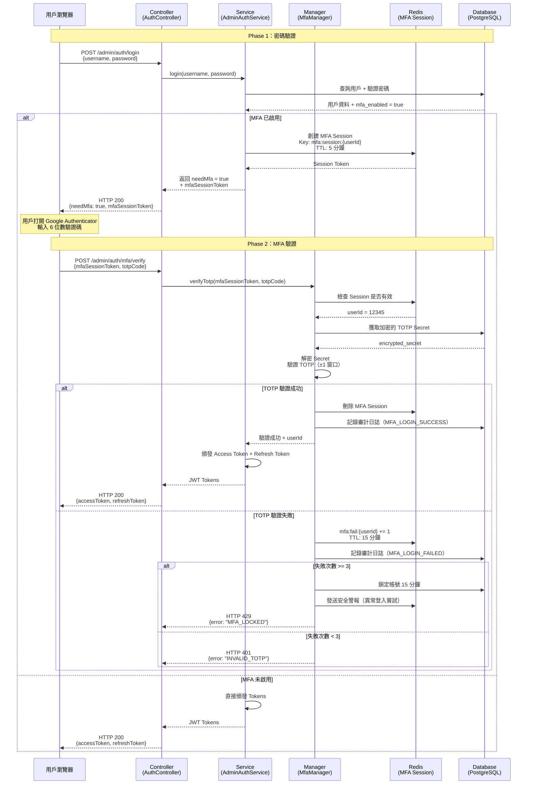
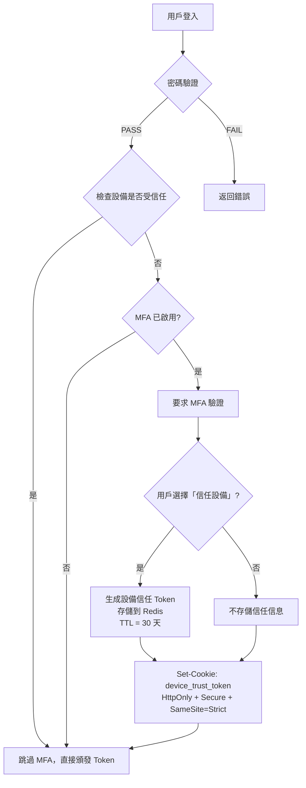
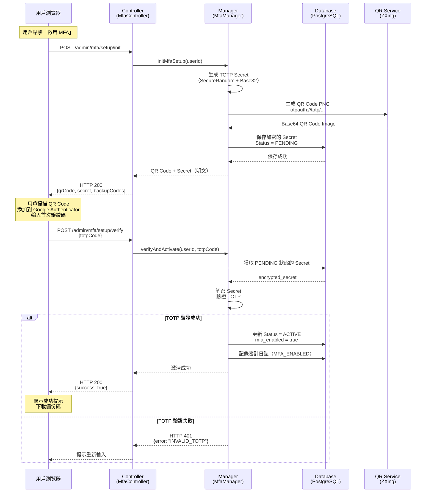

# 06-06-03 登入與恢復流程

**Document Metadata**:
- Version: 1.0.0
- Created: 2026-02-07
- Last Updated: 2026-02-07
- Status: Production Ready
- Priority: P1 (High)
- Owner: Security Team + Backend Team
- Parent: [06-06 後台用戶 MFA 實施方案](./06-06_MFA_Implementation.md)

---

## 目錄

- [4. 登入流程設計](#4-登入流程設計)
  - [4.1 兩階段認證流程](#41-兩階段認證流程)
  - [4.2 信任設備機制](#42-信任設備機制)
  - [4.3 錯誤處理](#43-錯誤處理)
- [5. MFA 註冊流程](#5-mfa-註冊流程)
  - [5.1 首次註冊](#51-首次註冊)
  - [5.2 QR Code 生成](#52-qr-code-生成)
  - [5.3 驗證與激活](#53-驗證與激活)

---

## 4. 登入流程設計

### 4.1 兩階段認證流程

**完整登入流程**（Mermaid 序列圖）：



**API 接口設計**：

#### **接口 1：密碼登入**

```http
POST /admin/auth/login
Content-Type: application/json

{
  "username": "admin@smartadmin.com",
  "password": "SecurePassword123!",
  "deviceFingerprint": "e3b0c44298fc1c149afbf4c8996fb92427ae41e4649b934ca495991b7852b855"
}
```

**響應（MFA 已啟用）**：

```json
{
  "code": 200,
  "msg": "Password verified. MFA required.",
  "data": {
    "needMfa": true,
    "mfaSessionToken": "mfa_sess_abc123xyz...",
    "expiresAt": "2026-02-05T10:05:00Z",
    "availableMethods": ["totp", "sms", "backup_code"]
  }
}
```

**響應（MFA 未啟用）**：

```json
{
  "code": 200,
  "msg": "Login successful.",
  "data": {
    "needMfa": false,
    "accessToken": "eyJhbGciOiJIUzI1NiIsInR5cCI6IkpXVCJ9...",
    "refreshToken": "rt_abc123xyz...",
    "user": {
      "userId": 12345,
      "username": "admin@smartadmin.com",
      "roles": ["SUPER_ADMIN"]
    }
  }
}
```

---

#### **接口 2：MFA 驗證**

```http
POST /admin/auth/mfa/verify
Content-Type: application/json

{
  "mfaSessionToken": "mfa_sess_abc123xyz...",
  "totpCode": "123456",
  "trustDevice": true  // 可選：信任當前設備 30 天
}
```

**響應（驗證成功）**：

```json
{
  "code": 200,
  "msg": "MFA verification successful.",
  "data": {
    "accessToken": "eyJhbGciOiJIUzI1NiIsInR5cCI6IkpXVCJ9...",
    "refreshToken": "rt_abc123xyz...",
    "user": {
      "userId": 12345,
      "username": "admin@smartadmin.com",
      "roles": ["SUPER_ADMIN"]
    }
  }
}
```

**響應（驗證失敗）**：

```json
{
  "code": 401,
  "msg": "Invalid TOTP code.",
  "data": {
    "remainingAttempts": 2,
    "lockoutDuration": null
  }
}
```

**響應（帳號鎖定）**：

```json
{
  "code": 429,
  "msg": "Too many failed MFA attempts. Account locked.",
  "data": {
    "remainingAttempts": 0,
    "lockoutDuration": 900,  // 15 分鐘（秒）
    "unlockAt": "2026-02-05T10:15:00Z"
  }
}
```

---

### 4.2 信任設備機制

**問題**：頻繁輸入 MFA 驗證碼影響用戶體驗（例如每天登入多次）。

**解決方案**：提供「信任此設備 30 天」選項，在信任期內跳過 MFA 驗證。

**實施設計**：



**數據結構設計**：

```sql
-- Redis Key-Value 結構（設備信任信息）
Key:   trusted_device:{userId}:{deviceFingerprint}
Value: {
  "userId": 12345,
  "deviceFingerprint": "e3b0c442...",
  "trustedAt": "2026-02-05T10:00:00Z",
  "expiresAt": "2026-03-07T10:00:00Z",
  "ipAddress": "203.0.113.42",
  "userAgent": "Mozilla/5.0..."
}
TTL:   2592000 秒（30 天）
```

**Device Fingerprint 計算**（JavaScript）：

```javascript
import FingerprintJS from '@fingerprintjs/fingerprintjs';

async function getDeviceFingerprint() {
  // 初始化 FingerprintJS
  const fp = await FingerprintJS.load();
  const result = await fp.get();

  // 返回設備唯一標識（99.5% 準確率）
  return result.visitorId;
}

// 登入時附加 Device Fingerprint
const deviceFingerprint = await getDeviceFingerprint();
const response = await fetch('/admin/auth/login', {
  method: 'POST',
  headers: { 'Content-Type': 'application/json' },
  body: JSON.stringify({
    username: 'admin@smartadmin.com',
    password: 'SecurePassword123!',
    deviceFingerprint: deviceFingerprint
  })
});
```

**安全性考量**：

| 風險 | 緩解措施 | 實施方案 |
|------|---------|---------|
| **設備信任 Token 洩露** | HttpOnly Cookie（無法被 JavaScript 讀取） | `Set-Cookie: HttpOnly; Secure` |
| **跨域攻擊（CSRF）** | SameSite=Strict | `SameSite=Strict` |
| **設備指紋碰撞** | 綁定 IP + User-Agent + Fingerprint 三元組 | 三元組驗證 |
| **信任期限過長** | 30 天 TTL（行業標準） | Redis `EXPIRE` |

---

### 4.3 錯誤處理

**MFA 驗證錯誤碼定義**：

| 錯誤碼 | HTTP 狀態碼 | 說明 | 處理建議 |
|-------|-----------|------|---------|
| `INVALID_MFA_SESSION` | 401 | MFA Session Token 不存在或已過期 | 重新執行 Phase 1（密碼登入） |
| `INVALID_TOTP` | 401 | TOTP 驗證碼錯誤 | 提示用戶重新輸入（剩餘嘗試次數） |
| `MFA_LOCKED` | 429 | 3 次失敗後帳號鎖定 | 顯示解鎖倒計時（15 分鐘） |
| `MFA_NOT_ENABLED` | 400 | 用戶未啟用 MFA 卻調用驗證接口 | 引導用戶啟用 MFA |
| `TIME_SYNC_ERROR` | 500 | 服務器時間與 NTP 不同步 | 觸發運維警報，重啟 NTP 服務 |

**前端錯誤處理範例**（Vue 3）：

```vue
<template>
  <div class="mfa-verify-form">
    <a-input
      v-model:value="totpCode"
      placeholder="請輸入 6 位數驗證碼"
      maxlength="6"
      :status="errorStatus"
    />

    <a-alert
      v-if="errorMessage"
      :type="alertType"
      :message="errorMessage"
      show-icon
      closable
    />

    <a-button type="primary" @click="verifyMfa" :loading="loading">
      驗證
    </a-button>
  </div>
</template>

<script setup>
import { ref } from 'vue';
import { message } from 'ant-design-vue';

const totpCode = ref('');
const errorMessage = ref('');
const errorStatus = ref('');
const alertType = ref('error');
const loading = ref(false);

async function verifyMfa() {
  loading.value = true;
  errorMessage.value = '';

  try {
    const response = await fetch('/admin/auth/mfa/verify', {
      method: 'POST',
      headers: { 'Content-Type': 'application/json' },
      body: JSON.stringify({
        mfaSessionToken: sessionStorage.getItem('mfaSessionToken'),
        totpCode: totpCode.value
      })
    });

    const result = await response.json();

    if (response.ok) {
      // 驗證成功
      message.success('登入成功！');
      localStorage.setItem('accessToken', result.data.accessToken);
      window.location.href = '/admin/dashboard';
    } else {
      // 驗證失敗
      handleMfaError(result);
    }
  } catch (error) {
    message.error('網絡錯誤，請稍後重試');
  } finally {
    loading.value = false;
  }
}

function handleMfaError(result) {
  errorStatus.value = 'error';

  switch (result.code) {
    case 401:
      if (result.msg.includes('INVALID_TOTP')) {
        errorMessage.value = `驗證碼錯誤，剩餘嘗試次數：${result.data.remainingAttempts}`;
        alertType.value = 'warning';
      } else if (result.msg.includes('INVALID_MFA_SESSION')) {
        errorMessage.value = 'Session 已過期，請重新登入';
        alertType.value = 'error';
        setTimeout(() => window.location.href = '/admin/login', 2000);
      }
      break;

    case 429:
      errorMessage.value = `帳號已鎖定，請在 ${result.data.lockoutDuration / 60} 分鐘後重試`;
      alertType.value = 'error';
      break;

    default:
      errorMessage.value = result.msg || '未知錯誤';
      alertType.value = 'error';
  }
}
</script>
```

---

## 5. MFA 註冊流程

### 5.1 首次註冊

**觸發時機**：
- 用戶首次登入後台（強制 MFA 角色）
- 用戶在「個人設置」中主動啟用 MFA
- 管理員為用戶強制啟用 MFA（安全策略）

**註冊流程圖**：



---

### 5.2 QR Code 生成

**使用 ZXing 庫生成 QR Code**：

```java
import com.google.zxing.BarcodeFormat;
import com.google.zxing.client.j2se.MatrixToImageWriter;
import com.google.zxing.common.BitMatrix;
import com.google.zxing.qrcode.QRCodeWriter;

import javax.imageio.ImageIO;
import java.awt.image.BufferedImage;
import java.io.ByteArrayOutputStream;
import java.util.Base64;

public class QrCodeGenerator {

    /**
     * 生成 TOTP QR Code（Base64 PNG 圖片）
     *
     * @param username 用戶名稱
     * @param secret Base32 編碼的 TOTP Secret
     * @param issuer 發行者名稱（顯示在 App 中）
     * @return Base64 編碼的 PNG 圖片
     */
    public static String generateQrCode(String username, String secret, String issuer) throws Exception {
        // Step 1: 構造 otpauth:// URL
        String otpauthUrl = String.format(
            "otpauth://totp/%s:%s?secret=%s&issuer=%s&algorithm=SHA1&digits=6&period=30",
            issuer,
            username,
            secret,
            issuer
        );

        // Step 2: 使用 ZXing 生成 QR Code
        QRCodeWriter qrCodeWriter = new QRCodeWriter();
        BitMatrix bitMatrix = qrCodeWriter.encode(otpauthUrl, BarcodeFormat.QR_CODE, 300, 300);

        // Step 3: 轉換為 BufferedImage
        BufferedImage qrImage = MatrixToImageWriter.toBufferedImage(bitMatrix);

        // Step 4: 轉換為 Base64 PNG
        ByteArrayOutputStream baos = new ByteArrayOutputStream();
        ImageIO.write(qrImage, "PNG", baos);
        byte[] imageBytes = baos.toByteArray();

        return "data:image/png;base64," + Base64.getEncoder().encodeToString(imageBytes);
    }
}

// 範例使用
String qrCodeBase64 = QrCodeGenerator.generateQrCode(
    "admin@smartadmin.com",
    "JBSWY3DPEHPK3PXP",
    "SmartAdmin iGaming"
);

// 輸出：data:image/png;base64,iVBORw0KGgoAAAANSUhEUgAA...
```

**前端顯示 QR Code**（Vue 3）：

```vue
<template>
  <div class="mfa-setup">
    <a-steps :current="currentStep">
      <a-step title="生成密鑰" />
      <a-step title="掃描 QR Code" />
      <a-step title="驗證激活" />
    </a-steps>

    <!-- Step 2: 掃描 QR Code -->
    <div v-if="currentStep === 1" class="qr-code-section">
      <h3>請使用 Google Authenticator 掃描此 QR Code</h3>
      

      <a-alert type="info" show-icon>
        <template #message>
          如果無法掃描，請手動輸入密鑰：<br/>
          <code>{{ totpSecret }}</code>
        </template>
      </a-alert>

      <h4>備份碼（請妥善保存）</h4>
      <a-textarea :value="backupCodesText" :rows="5" readonly />
      <a-button @click="downloadBackupCodes">下載備份碼</a-button>
    </div>

    <!-- Step 3: 驗證激活 -->
    <div v-if="currentStep === 2" class="verify-section">
      <h3>請輸入 Google Authenticator 中的 6 位數驗證碼</h3>
      <a-input
        v-model:value="totpCode"
        placeholder="123456"
        maxlength="6"
        size="large"
      />
      <a-button type="primary" @click="verifyAndActivate">
        激活 MFA
      </a-button>
    </div>
  </div>
</template>

<script setup>
import { ref } from 'vue';
import { message } from 'ant-design-vue';

const currentStep = ref(1);
const qrCodeImage = ref('');
const totpSecret = ref('');
const backupCodes = ref([]);
const totpCode = ref('');

// 初始化 MFA 設置
async function initMfaSetup() {
  const response = await fetch('/admin/mfa/setup/init', { method: 'POST' });
  const result = await response.json();

  if (response.ok) {
    qrCodeImage.value = result.data.qrCode;
    totpSecret.value = result.data.secret;
    backupCodes.value = result.data.backupCodes;
    currentStep.value = 1;
  }
}

// 下載備份碼
function downloadBackupCodes() {
  const text = backupCodes.value.join('\n');
  const blob = new Blob([text], { type: 'text/plain' });
  const url = URL.createObjectURL(blob);

  const a = document.createElement('a');
  a.href = url;
  a.download = 'smartadmin-mfa-backup-codes.txt';
  a.click();

  message.success('備份碼已下載');
}

// 驗證並激活 MFA
async function verifyAndActivate() {
  const response = await fetch('/admin/mfa/setup/verify', {
    method: 'POST',
    headers: { 'Content-Type': 'application/json' },
    body: JSON.stringify({ totpCode: totpCode.value })
  });

  const result = await response.json();

  if (response.ok) {
    message.success('MFA 已成功啟用！');
    currentStep.value = 3;
  } else {
    message.error('驗證碼錯誤，請重新輸入');
  }
}

// 頁面加載時初始化
initMfaSetup();
</script>
```

---

### 5.3 驗證與激活

**後端驗證邏輯**（Java）：

```java
import org.springframework.stereotype.Service;
import org.springframework.transaction.annotation.Transactional;

@Service
@RequiredArgsConstructor
public class MfaSetupService {

    private final MfaRepository mfaRepository;
    private final TotpValidator totpValidator;
    private final AuditLogService auditLogService;

    /**
     * 初始化 MFA 設置（生成 Secret + QR Code）
     *
     * @param userId 用戶 ID
     * @return MFA 設置信息（QR Code + Secret + Backup Codes）
     */
    @Transactional(rollbackFor = Throwable.class)
    public MfaSetupVO initMfaSetup(Long userId) {
        // Step 1: 檢查用戶是否已啟用 MFA
        if (mfaRepository.isMfaEnabled(userId)) {
            throw new BusinessException("MFA 已啟用，無法重複設置");
        }

        // Step 2: 生成 TOTP Secret（Base32 編碼）
        String totpSecret = TotpSecretGenerator.generateSecret();

        // Step 3: 生成 QR Code
        String username = getUserEmail(userId);  // 例：admin@smartadmin.com
        String qrCodeBase64 = QrCodeGenerator.generateQrCode(
            username,
            totpSecret,
            "SmartAdmin iGaming"
        );

        // Step 4: 生成 10 個備份碼（8 位數字）
        List<String> backupCodes = BackupCodeGenerator.generate(10);

        // Step 5: 加密並保存到數據庫（Status = PENDING）
        String encryptedSecret = encryptSecret(totpSecret);
        String encryptedBackupCodes = encryptBackupCodes(backupCodes);

        MfaEntity mfa = MfaEntity.builder()
            .userId(userId)
            .totpSecret(encryptedSecret)
            .backupCodes(encryptedBackupCodes)
            .status(MfaStatus.PENDING)
            .build();

        mfaRepository.save(mfa);

        // Step 6: 記錄審計日誌
        auditLogService.log(userId, "MFA_SETUP_INIT", "用戶開始設置 MFA");

        // Step 7: 返回前端（明文 Secret 僅此一次顯示）
        return MfaSetupVO.builder()
            .qrCode(qrCodeBase64)
            .secret(totpSecret)  // 明文顯示（僅一次）
            .backupCodes(backupCodes)
            .build();
    }

    /**
     * 驗證並激活 MFA
     *
     * @param userId 用戶 ID
     * @param totpCode 用戶輸入的 6 位數驗證碼
     * @return 激活結果
     */
    @Transactional(rollbackFor = Throwable.class)
    public ResponseDTO<Void> verifyAndActivate(Long userId, String totpCode) {
        // Step 1: 獲取 PENDING 狀態的 MFA 記錄
        MfaEntity mfa = mfaRepository.findByUserIdAndStatus(userId, MfaStatus.PENDING)
            .orElseThrow(() -> new BusinessException("未找到待激活的 MFA 設置"));

        // Step 2: 解密 TOTP Secret
        String decryptedSecret = decryptSecret(mfa.getTotpSecret());

        // Step 3: 驗證 TOTP 驗證碼
        boolean isValid = totpValidator.validate(totpCode, decryptedSecret);

        if (!isValid) {
            auditLogService.log(userId, "MFA_SETUP_VERIFY_FAILED", "TOTP 驗證失敗");
            return ResponseDTO.error(ErrorCode.INVALID_TOTP);
        }

        // Step 4: 激活 MFA
        mfa.setStatus(MfaStatus.ACTIVE);
        mfa.setActivatedAt(Instant.now());
        mfaRepository.save(mfa);

        // Step 5: 記錄審計日誌
        auditLogService.log(userId, "MFA_ENABLED", "MFA 已成功啟用");

        return ResponseDTO.ok();
    }
}
```

**數據庫表設計**：

```sql
CREATE TABLE t_admin_user_mfa (
    user_id             BIGINT PRIMARY KEY REFERENCES t_admin_user(user_id),
    totp_secret         VARCHAR(255) NOT NULL,          -- AES-256-GCM 加密
    backup_codes        TEXT,                           -- JSON 數組（AES 加密）
    status              VARCHAR(20) NOT NULL,           -- PENDING / ACTIVE / DISABLED
    activated_at        TIMESTAMP,                      -- 激活時間
    created_at          TIMESTAMP DEFAULT NOW(),
    updated_at          TIMESTAMP DEFAULT NOW()
);

-- 索引
CREATE INDEX idx_mfa_status ON t_admin_user_mfa(status);
CREATE INDEX idx_mfa_activated_at ON t_admin_user_mfa(activated_at);
```

---

## 相關文檔

- [06-06-01 MFA 架構設計](./06-06-01_MFA_Architecture.md) - 業務需求與方法選擇
- [06-06-02 TOTP 與 WebAuthn 實作](./06-06-02_TOTP_WebAuthn.md) - TOTP 算法詳解
- [06-06-04 合規與審計](./06-06-04_Compliance_Audit.md) - 審計日誌與角色策略

---

**End of Document**
