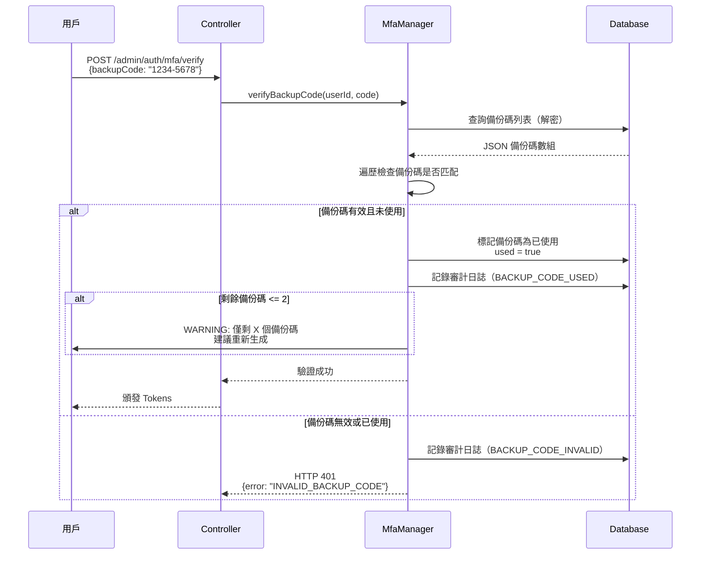
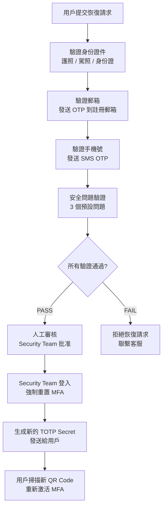
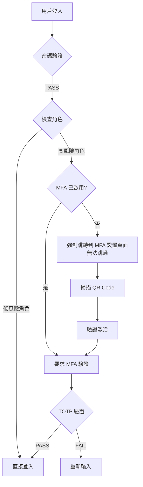
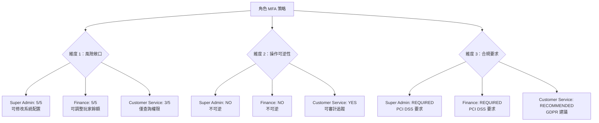

# 06-06-04 合規與審計

**Document Metadata**:
- Version: 1.0.0
- Created: 2026-02-07
- Last Updated: 2026-02-07
- Status: Production Ready
- Priority: P1 (High)
- Owner: Security Team + Compliance Team
- Parent: [06-06 後台用戶 MFA 實施方案](./06-06_MFA_Implementation.md)

---

## 目錄

- [6. 備份方案設計](#6-備份方案設計)
  - [6.1 Backup Codes（備份碼）](#61-backup-codes備份碼)
  - [6.2 設備丟失恢復流程](#62-設備丟失恢復流程)
  - [6.3 緊急聯繫人驗證](#63-緊急聯繫人驗證)
- [7. 角色級別 MFA 策略](#7-角色級別-mfa-策略)
  - [7.1 強制 MFA 角色](#71-強制-mfa-角色)
  - [7.2 可選 MFA 角色](#72-可選-mfa-角色)
  - [7.3 Ultrathink 分析：為什麼管理員強制而客服可選](#73-ultrathink-分析為什麼管理員強制而客服可選)
- [8. 審計日誌設計](#8-審計日誌設計)
  - [8.1 關鍵事件記錄](#81-關鍵事件記錄)
  - [8.2 異常行為檢測](#82-異常行為檢測)
- [9. 實施路線圖](#9-實施路線圖)
  - [9.1 Phase 1：核心 TOTP 功能](#91-phase-1核心-totp-功能)
  - [9.2 Phase 2：備份與恢復機制](#92-phase-2備份與恢復機制)
  - [9.3 Phase 3：高級安全特性](#93-phase-3高級安全特性)
- [10. 附錄](#10-附錄)
  - [10.1 常見問題](#101-常見問題)
  - [10.2 測試用例](#102-測試用例)

---

## 6. 備份方案設計

### 6.1 Backup Codes（備份碼）

**問題**：用戶手機丟失、Google Authenticator 卸載、設備損壞等情況無法使用 TOTP。

**解決方案**：生成 **10 個一次性備份碼**（8 位數字），用戶可用任意一個備份碼登入。

**備份碼生成算法**：

```java
import java.security.SecureRandom;
import java.util.ArrayList;
import java.util.List;

public class BackupCodeGenerator {

    private static final SecureRandom RANDOM = new SecureRandom();

    /**
     * 生成備份碼（8 位數字，格式：1234-5678）
     *
     * @param count 生成數量（推薦 10 個）
     * @return 備份碼列表
     */
    public static List<String> generate(int count) {
        List<String> codes = new ArrayList<>(count);

        for (int i = 0; i < count; i++) {
            // 生成 8 位數字（10000000 ~ 99999999）
            int code = RANDOM.nextInt(90000000) + 10000000;

            // 格式化為 1234-5678（方便閱讀）
            String formatted = String.format("%04d-%04d",
                code / 10000,
                code % 10000
            );

            codes.add(formatted);
        }

        return codes;
    }
}

// 範例輸出
List<String> backupCodes = BackupCodeGenerator.generate(10);
// [1234-5678, 9012-3456, 7890-1234, ...]
```

**存儲設計**（JSON 格式）：

```json
{
  "codes": [
    {
      "code": "1234-5678",
      "used": false,
      "usedAt": null
    },
    {
      "code": "9012-3456",
      "used": false,
      "usedAt": null
    },
    {
      "code": "7890-1234",
      "used": true,
      "usedAt": "2026-02-05T10:30:00Z"
    }
  ],
  "generatedAt": "2026-02-01T10:00:00Z"
}
```

**使用備份碼登入流程**：



**備份碼管理 API**：

#### **接口 1：查看剩餘備份碼數量**

```http
GET /admin/mfa/backup-codes/status
Authorization: Bearer {accessToken}
```

**響應**：

```json
{
  "code": 200,
  "msg": "Success",
  "data": {
    "totalCodes": 10,
    "usedCodes": 3,
    "remainingCodes": 7,
    "lastUsedAt": "2026-02-05T10:30:00Z"
  }
}
```

#### **接口 2：重新生成備份碼**

```http
POST /admin/mfa/backup-codes/regenerate
Authorization: Bearer {accessToken}
Content-Type: application/json

{
  "totpCode": "123456"  // 需要 TOTP 驗證
}
```

**響應**：

```json
{
  "code": 200,
  "msg": "Backup codes regenerated successfully.",
  "data": {
    "backupCodes": [
      "1111-2222",
      "3333-4444",
      "5555-6666"
    ]
  }
}
```

---

### 6.2 設備丟失恢復流程

**場景**：用戶手機丟失，無法使用 TOTP 也沒有備份碼。

**恢復流程**（多重驗證）：



**實施設計**：

#### **1. 用戶提交恢復請求**

```http
POST /admin/mfa/recovery/request
Content-Type: multipart/form-data

{
  "userId": 12345,
  "idCardPhoto": <File>,  // 身份證件照片
  "reason": "手機丟失，無法使用 Google Authenticator"
}
```

#### **2. Security Team 審核**

```sql
-- t_mfa_recovery_request 表
CREATE TABLE t_mfa_recovery_request (
    request_id      BIGSERIAL PRIMARY KEY,
    user_id         BIGINT NOT NULL REFERENCES t_admin_user(user_id),
    id_card_photo   TEXT,                       -- 身份證件照片 URL
    reason          TEXT,
    status          VARCHAR(20) NOT NULL,       -- PENDING / APPROVED / REJECTED
    reviewed_by     BIGINT REFERENCES t_admin_user(user_id),
    reviewed_at     TIMESTAMP,
    created_at      TIMESTAMP DEFAULT NOW()
);
```

**Security Team 審核界面**（SmartAdmin 後台）：

```vue
<template>
  <a-table :dataSource="recoveryRequests" :columns="columns">
    <template #bodyCell="{ column, record }">
      <template v-if="column.key === 'action'">
        <a-space>
          <a-button type="primary" @click="approveRequest(record)">
            批准
          </a-button>
          <a-button danger @click="rejectRequest(record)">
            拒絕
          </a-button>
        </a-space>
      </template>
    </template>
  </a-table>
</template>

<script setup>
const recoveryRequests = ref([]);

async function approveRequest(record) {
  await fetch(`/admin/mfa/recovery/${record.requestId}/approve`, {
    method: 'POST'
  });

  message.success('已批准恢復請求');
  loadRequests();
}
</script>
```

#### **3. 強制重置 MFA**

```java
@Transactional(rollbackFor = Throwable.class)
public ResponseDTO<Void> forceResetMfa(Long userId, Long reviewerUserId) {
    // Step 1: 刪除舊的 MFA 記錄
    mfaRepository.deleteByUserId(userId);

    // Step 2: 生成新的 TOTP Secret
    String newSecret = TotpSecretGenerator.generateSecret();
    String qrCode = QrCodeGenerator.generateQrCode(
        getUserEmail(userId),
        newSecret,
        "SmartAdmin iGaming"
    );

    // Step 3: 發送郵件給用戶
    emailService.sendMfaResetEmail(userId, qrCode, newSecret);

    // Step 4: 記錄審計日誌（CRITICAL 級別）
    auditLogService.log(userId, "MFA_FORCE_RESET", String.format(
        "Security Team 強制重置 MFA（審核人：%d）", reviewerUserId
    ));

    return ResponseDTO.ok();
}
```

---

### 6.3 緊急聯繫人驗證

**增強安全方案**：允許用戶在設置 MFA 時指定 **1-2 個緊急聯繫人**（同事 / 上級）。

**流程**：
1. 用戶提交恢復請求
2. 系統發送驗證郵件給緊急聯繫人
3. 緊急聯繫人點擊驗證鏈接（確認是本人請求）
4. Security Team 收到通知，加速審核流程

**實施設計**：

```sql
-- t_mfa_emergency_contacts 表
CREATE TABLE t_mfa_emergency_contacts (
    user_id             BIGINT NOT NULL REFERENCES t_admin_user(user_id),
    contact_user_id     BIGINT NOT NULL REFERENCES t_admin_user(user_id),
    contact_type        VARCHAR(20) NOT NULL,   -- COLLEAGUE / MANAGER
    verified            BOOLEAN DEFAULT FALSE,
    created_at          TIMESTAMP DEFAULT NOW(),
    PRIMARY KEY (user_id, contact_user_id)
);
```

**緊急聯繫人驗證郵件**：

```html
<p>您好 {{contactName}}，</p>

<p>{{userName}}（{{userEmail}}）提交了 MFA 恢復請求，聲稱手機丟失。</p>

<p>請點擊下方鏈接確認這是本人請求：</p>

<a href="https://admin.smartadmin.com/mfa/recovery/verify?token={{verificationToken}}">
  確認恢復請求
</a>

<p>如果這不是本人請求，請立即聯繫 Security Team。</p>
```

---

## 7. 角色級別 MFA 策略

### 7.1 強制 MFA 角色

**高風險角色**（必須啟用 MFA）：

| 角色 | 高風險操作 | 強制 MFA | 備註 |
|------|----------|---------|------|
| **Super Admin** | 修改系統配置、刪除用戶、修改權限 | 強制 | 無豁免條件 |
| **Finance Manager** | 調整玩家餘額、批准提現 | 強制 | 無豁免條件 |
| **Risk Control** | 修改風控規則、白名單黑名單 | 強制 | 無豁免條件 |
| **Database Admin** | 直接訪問生產數據庫 | 強制 | 需額外 YubiKey |
| **DevOps** | 部署代碼、修改服務器配置 | 強制 | 需額外 YubiKey |

**實施邏輯**：

```java
@Service
@RequiredArgsConstructor
public class MfaPolicyService {

    private final AdminUserService adminUserService;
    private final MfaRepository mfaRepository;

    /**
     * 檢查用戶是否需要強制啟用 MFA
     *
     * @param userId 用戶 ID
     * @return true 需要強制 MFA，false 可選
     */
    public boolean requiresMandatoryMfa(Long userId) {
        List<String> roles = adminUserService.getUserRoles(userId);

        // 強制 MFA 角色列表
        Set<String> mandatoryMfaRoles = Set.of(
            "SUPER_ADMIN",
            "FINANCE_MANAGER",
            "RISK_CONTROL",
            "DATABASE_ADMIN",
            "DEVOPS"
        );

        // 判斷用戶是否屬於強制 MFA 角色
        return roles.stream().anyMatch(mandatoryMfaRoles::contains);
    }

    /**
     * 登入前檢查 MFA 狀態
     *
     * @param userId 用戶 ID
     * @throws MfaNotEnabledException 如果用戶需要 MFA 但未啟用
     */
    public void validateMfaStatusBeforeLogin(Long userId) {
        if (requiresMandatoryMfa(userId)) {
            boolean mfaEnabled = mfaRepository.isMfaEnabled(userId);

            if (!mfaEnabled) {
                throw new MfaNotEnabledException(
                    "您的角色需要啟用 MFA 才能登入，請聯繫管理員設置"
                );
            }
        }
    }
}
```

**首次登入強制設置流程**：



---

### 7.2 可選 MFA 角色

**低風險角色**（可選 MFA）：

| 角色 | 主要職責 | MFA 要求 | 推薦度 |
|------|---------|---------|-------|
| **Customer Service** | 查詢玩家資料、回覆工單 | 可選 | 推薦啟用 |
| **Marketing** | 查看統計數據、編輯活動頁面 | 可選 | 建議啟用 |
| **Content Editor** | 編輯公告、新聞、幫助文檔 | 可選 | 可不啟用 |

**實施邏輯**：

```java
/**
 * 登入後顯示 MFA 推薦提示
 */
public void showMfaRecommendation(Long userId) {
    List<String> roles = adminUserService.getUserRoles(userId);
    boolean mfaEnabled = mfaRepository.isMfaEnabled(userId);

    if (!mfaEnabled && roles.contains("CUSTOMER_SERVICE")) {
        // 顯示提示橫幅（不阻擋登入）
        return ResponseDTO.ok().withWarning(
            "建議啟用 MFA 以提升帳號安全性。點擊前往設置 →"
        );
    }
}
```

**前端提示範例**：

```vue
<template>
  <a-alert
    v-if="showMfaBanner"
    type="warning"
    message="建議啟用多因素認證（MFA）"
    description="您的角色可訪問玩家隱私資料，啟用 MFA 可有效防止帳號被盜用。"
    closable
    @close="dismissBanner"
  >
    <template #action>
      <a-button type="primary" @click="navigateToMfaSetup">
        立即設置
      </a-button>
    </template>
  </a-alert>
</template>
```

---

### 7.3 Ultrathink 分析：為什麼管理員強制而客服可選

**決策框架**：



**Option A：所有角色強制 MFA**

**Pros**：
- 最高安全性（0 風險敞口）
- 合規性最佳（超出監管要求）

**Cons**：
- 用戶體驗差（Customer Service 流動性高，頻繁重置 MFA）
- 實施成本高（需為所有員工提供設備支持）
- 阻礙業務（緊急情況下客服無法快速登入處理工單）

**適用場景**：
- 銀行、支付平台（監管要求極高）
- 員工數量少（< 50 人）

---

**Option B：高風險角色強制 MFA，低風險角色可選** **推薦**

**Pros**：
- 平衡安全與體驗（保護高價值目標，不影響日常運營）
- 符合風險管理原則（資源優先分配給高風險區域）
- 合規性足夠（滿足 PCI DSS / MGA 要求）

**Cons**：
- 低風險角色仍有洩露風險（但影響可控）

**適用場景**：
- 中大型 iGaming 平台（100-500 員工）
- 有分層安全策略

---

**Option C：所有角色可選 MFA**

**Pros**：
- 用戶體驗最佳
- 實施成本最低

**Cons**：
- 安全風險高（高權限帳號可能不啟用 MFA）
- 不符合監管要求（PCI DSS 明確要求管理員使用 MFA）
- 無法通過合規審計

**適用場景**：
- 小型平台（< 20 員工）且無監管壓力

---

**決策矩陣**：

| 方案 | 安全性 | 用戶體驗 | 合規性 | 總分（40% + 30% + 30%） |
|------|-------|---------|-------|------------------------|
| Option A（全部強制） | 5 | 2 | 5 | **4.1** |
| Option B（差異化） | 5 | 4 | 5 | **4.8** |
| Option C（全部可選） | 2 | 5 | 2 | **2.8** |

**結論**：選擇 **Option B（高風險強制 + 低風險可選）** 作為 SmartAdmin iGaming 的 MFA 策略。

**實施準則**：

```
強制 MFA 角色（5 類）：
- Super Admin
- Finance Manager
- Risk Control
- Database Admin
- DevOps

可選 MFA 角色（3 類）：
- Customer Service（推薦啟用）
- Marketing（建議啟用）
- Content Editor（可不啟用）
```

---

## 8. 審計日誌設計

### 8.1 關鍵事件記錄

**所有 MFA 相關操作必須記錄審計日誌**（符合 GDPR Art. 30 要求）。

**事件類型定義**：

| 事件類型 | 級別 | 觸發時機 | 保留期限 |
|---------|------|---------|---------|
| `MFA_SETUP_INIT` | INFO | 用戶開始設置 MFA | 永久 |
| `MFA_ENABLED` | INFO | MFA 激活成功 | 永久 |
| `MFA_DISABLED` | CRITICAL | 用戶或管理員禁用 MFA | 永久 |
| `MFA_LOGIN_SUCCESS` | INFO | MFA 驗證成功登入 | 90 天 |
| `MFA_LOGIN_FAILED` | WARNING | TOTP 驗證失敗 | 永久 |
| `MFA_LOCKED` | CRITICAL | 3 次失敗後帳號鎖定 | 永久 |
| `BACKUP_CODE_USED` | WARNING | 使用備份碼登入 | 永久 |
| `BACKUP_CODE_REGENERATE` | INFO | 重新生成備份碼 | 永久 |
| `MFA_FORCE_RESET` | CRITICAL | Security Team 強制重置 MFA | 永久 |
| `DEVICE_TRUSTED` | INFO | 用戶信任設備 | 永久 |

**審計日誌表結構**：

```sql
CREATE TABLE t_audit_log_mfa (
    log_id              BIGSERIAL PRIMARY KEY,
    user_id             BIGINT NOT NULL REFERENCES t_admin_user(user_id),
    event_type          VARCHAR(50) NOT NULL,
    event_level         VARCHAR(20) NOT NULL,   -- INFO / WARNING / CRITICAL
    ip_address          INET,
    user_agent          TEXT,
    device_fingerprint  VARCHAR(64),
    details             JSONB,                   -- 額外詳情（JSON 格式）
    created_at          TIMESTAMP DEFAULT NOW()
);

-- 索引
CREATE INDEX idx_mfa_log_user_id ON t_audit_log_mfa(user_id);
CREATE INDEX idx_mfa_log_event_type ON t_audit_log_mfa(event_type);
CREATE INDEX idx_mfa_log_event_level ON t_audit_log_mfa(event_level);
CREATE INDEX idx_mfa_log_created_at ON t_audit_log_mfa(created_at);
```

**審計日誌範例**：

```json
{
  "logId": 12345,
  "userId": 67890,
  "eventType": "MFA_LOGIN_FAILED",
  "eventLevel": "WARNING",
  "ipAddress": "203.0.113.42",
  "userAgent": "Mozilla/5.0 (Windows NT 10.0; Win64; x64) AppleWebKit/537.36...",
  "deviceFingerprint": "e3b0c44298fc1c149afbf4c8996fb92427ae41e4649b934ca495991b7852b855",
  "details": {
    "reason": "INVALID_TOTP",
    "attemptCount": 2,
    "remainingAttempts": 1
  },
  "createdAt": "2026-02-05T10:30:15Z"
}
```

---

### 8.2 異常行為檢測

**基於審計日誌的異常檢測規則**：

#### **規則 1：短時間內多次 MFA 失敗**

```sql
-- 檢測邏輯：5 分鐘內 MFA 失敗 >= 3 次
SELECT
    user_id,
    COUNT(*) AS fail_count,
    ARRAY_AGG(ip_address) AS ip_list
FROM t_audit_log_mfa
WHERE event_type = 'MFA_LOGIN_FAILED'
  AND created_at >= NOW() - INTERVAL '5 minutes'
GROUP BY user_id
HAVING COUNT(*) >= 3;
```

**觸發動作**：
- 鎖定帳號 15 分鐘
- 發送警報給 Security Team
- 發送郵件通知用戶（帳號異常登入嘗試）

---

#### **規則 2：異常地理位置登入**

```sql
-- 檢測邏輯：1 小時內從不同國家登入
SELECT
    a.user_id,
    a.ip_address AS ip_1,
    b.ip_address AS ip_2,
    a.created_at AS time_1,
    b.created_at AS time_2
FROM t_audit_log_mfa a
JOIN t_audit_log_mfa b ON a.user_id = b.user_id
WHERE a.event_type = 'MFA_LOGIN_SUCCESS'
  AND b.event_type = 'MFA_LOGIN_SUCCESS'
  AND a.created_at < b.created_at
  AND b.created_at - a.created_at <= INTERVAL '1 hour'
  AND get_country(a.ip_address) != get_country(b.ip_address);
```

**觸發動作**：
- 發送警報給 Security Team（人工審核）
- 要求用戶下次登入時重新驗證（禁用信任設備）

---

#### **規則 3：頻繁使用備份碼**

```sql
-- 檢測邏輯：7 天內使用備份碼 >= 3 次
SELECT
    user_id,
    COUNT(*) AS backup_code_usage
FROM t_audit_log_mfa
WHERE event_type = 'BACKUP_CODE_USED'
  AND created_at >= NOW() - INTERVAL '7 days'
GROUP BY user_id
HAVING COUNT(*) >= 3;
```

**觸發動作**：
- 警告用戶：「您頻繁使用備份碼，建議重新設置 TOTP」
- 提示用戶：「是否設備丟失？點擊此處恢復 MFA」

---

#### **規則 4：MFA 被禁用**

```sql
-- 檢測邏輯：高風險角色的 MFA 被禁用
SELECT
    l.user_id,
    u.username,
    l.created_at,
    l.details->>'disabledBy' AS disabled_by
FROM t_audit_log_mfa l
JOIN t_admin_user u ON l.user_id = u.user_id
WHERE l.event_type = 'MFA_DISABLED'
  AND u.role_code IN ('SUPER_ADMIN', 'FINANCE_MANAGER', 'RISK_CONTROL');
```

**觸發動作**：
- **立即發送警報給 CTO / CISO**
- 人工審核：「為什麼高風險帳號禁用 MFA？」
- 如果非本人操作，視為安全事件，立即鎖定帳號

---

## 9. 實施路線圖

### 9.1 Phase 1：核心 TOTP 功能

**目標**：實施 TOTP 認證（Google Authenticator），支持高風險角色強制 MFA。

**時間**：Week 1-2（10 工作日）

**任務清單**：

| 任務 | 負責人 | 工時 | 依賴 |
|------|-------|------|------|
| 1. 設計數據庫表結構（t_admin_user_mfa、t_audit_log_mfa） | Backend Dev | 0.5 天 | - |
| 2. 實施 TOTP 生成與驗證邏輯（TotpValidator） | Backend Dev | 1 天 | - |
| 3. 實施 QR Code 生成（ZXing） | Backend Dev | 0.5 天 | Task 2 |
| 4. 實施 MFA 設置流程（initMfaSetup、verifyAndActivate） | Backend Dev | 2 天 | Task 2, 3 |
| 5. 實施 MFA 登入流程（兩階段認證） | Backend Dev | 2 天 | Task 4 |
| 6. 實施審計日誌記錄 | Backend Dev | 1 天 | Task 4, 5 |
| 7. 前端 MFA 設置頁面（Vue 3） | Frontend Dev | 2 天 | Task 4 |
| 8. 前端 MFA 登入頁面（Vue 3） | Frontend Dev | 1.5 天 | Task 5 |
| 9. 單元測試 + 集成測試 | QA | 2 天 | All |
| 10. 部署到測試環境 + 驗證 | DevOps | 0.5 天 | All |

**Deliverables**：
- TOTP 認證功能（Google Authenticator）
- 高風險角色強制 MFA 檢查
- 審計日誌記錄（INFO / WARNING / CRITICAL）
- 單元測試覆蓋率 >= 80%

---

### 9.2 Phase 2：備份與恢復機制

**目標**：實施備份碼、設備信任、設備丟失恢復流程。

**時間**：Week 3（5 工作日）

**任務清單**：

| 任務 | 負責人 | 工時 | 依賴 |
|------|-------|------|------|
| 1. 實施備份碼生成與驗證（BackupCodeGenerator） | Backend Dev | 1 天 | Phase 1 |
| 2. 實施設備信任機制（Device Fingerprint + Redis） | Backend Dev | 1.5 天 | Phase 1 |
| 3. 實施設備丟失恢復流程（人工審核） | Backend Dev | 1.5 天 | Phase 1 |
| 4. 前端備份碼管理頁面 | Frontend Dev | 1 天 | Task 1 |
| 5. 測試與驗證 | QA | 1 天 | All |

**Deliverables**：
- 10 個備份碼（8 位數字，一次性使用）
- 信任設備 30 天（跳過 MFA）
- 設備丟失恢復流程（Security Team 人工審核）

---

### 9.3 Phase 3：高級安全特性

**目標**：實施 SMS OTP 備用方案、異常行為檢測、合規審計報告。

**時間**：Week 4（5 工作日）

**任務清單**：

| 任務 | 負責人 | 工時 | 依賴 |
|------|-------|------|------|
| 1. 集成 SMS OTP 網關（Twilio / AWS SNS） | Backend Dev | 1 天 | Phase 1 |
| 2. 實施異常行為檢測規則（4 個規則） | Backend Dev | 1.5 天 | Phase 1, 2 |
| 3. 實施合規審計報告生成（GDPR / PCI DSS） | Backend Dev | 1 天 | Phase 1, 2 |
| 4. 前端 SMS OTP 登入流程 | Frontend Dev | 0.5 天 | Task 1 |
| 5. 滲透測試（Penetration Test） | Security Team | 2 天 | All |

**Deliverables**：
- SMS OTP 備用方案
- 異常行為檢測與自動警報
- 合規審計報告（可導出 PDF）
- 通過滲透測試（無 High / Critical 漏洞）

---

## 10. 附錄

### 10.1 常見問題

**Q1：用戶說「TOTP 驗證碼總是錯誤」怎麼辦？**

**A1**：99% 是時間同步問題。解決方案：
1. 檢查服務器 NTP 狀態：`ntpq -p`
2. 檢查用戶設備時間：「設置 → 日期與時間 → 自動設置」
3. 增加驗證窗口（臨時）：從 ±1 改為 ±2（允許 ±60 秒偏移）

---

**Q2：用戶手機丟失，沒有備份碼怎麼辦？**

**A2**：執行設備丟失恢復流程（Section 6.2）：
1. 用戶提交恢復請求（上傳身份證件）
2. 驗證郵箱 + 手機號 + 安全問題
3. Security Team 人工審核
4. 強制重置 MFA（生成新 Secret）

---

**Q3：為什麼不使用 SMS OTP 作為主要方法？**

**A3**：安全性問題：
- 易受 SIM Swap 攻擊（攻擊者偽造身份證更換 SIM 卡）
- 易受 SS7 劫持（電信網絡協議漏洞）
- NIST 已不推薦 SMS OTP（2016 年棄用）
- 僅作為備用方案使用

---

**Q4：TOTP 驗證碼 30 秒更換一次，如果用戶輸入時剛好過期怎麼辦？**

**A4**：允許 ±1 窗口（90 秒有效期）：
- 前一個窗口的驗證碼（-30s）有效
- 當前窗口的驗證碼有效
- 下一個窗口的驗證碼（+30s）有效

---

**Q5：是否需要支持硬件 Token（YubiKey）？**

**A5**：Phase 3 可選特性（僅用於 Super Admin）：
- 最高安全性（防釣魚、防中間人攻擊）
- 成本高（$50/設備）
- 物流複雜（遠程員工需郵寄）
- 建議：僅為 Super Admin、CTO、CFO 購買

---

### 10.2 測試用例

**測試範圍**：TOTP 驗證邏輯、MFA 登入流程、備份碼、異常檢測。

**測試用例清單**：

| 測試 ID | 測試場景 | 預期結果 |
|---------|---------|---------|
| TC-MFA-001 | 用戶首次設置 TOTP（掃描 QR Code） | Secret 加密存儲，Status = PENDING |
| TC-MFA-002 | 用戶輸入正確 TOTP 驗證碼激活 MFA | Status → ACTIVE，審計日誌記錄 |
| TC-MFA-003 | 用戶輸入錯誤 TOTP 驗證碼 | HTTP 401，錯誤計數 +1 |
| TC-MFA-004 | 用戶連續 3 次輸入錯誤 TOTP | 帳號鎖定 15 分鐘，觸發安全警報 |
| TC-MFA-005 | 用戶使用備份碼登入 | 登入成功，備份碼標記為已使用 |
| TC-MFA-006 | 用戶重複使用已用過的備份碼 | HTTP 401，審計日誌記錄 |
| TC-MFA-007 | 用戶選擇「信任此設備 30 天」 | Redis 存儲信任 Token（TTL 30 天） |
| TC-MFA-008 | 信任設備期間登入（跳過 MFA） | 直接頒發 Token，不要求 TOTP |
| TC-MFA-009 | 服務器時間偏移 +25 秒 | 驗證成功（±1 窗口） |
| TC-MFA-010 | 服務器時間偏移 +65 秒 | 驗證失敗（超出 ±1 窗口） |
| TC-MFA-011 | Security Team 強制重置用戶 MFA | 舊 Secret 刪除，生成新 Secret |
| TC-MFA-012 | 用戶從不同國家登入（1 小時內） | 觸發異常檢測，發送警報 |

**集成測試範例**（Spring Boot + JUnit 5）：

```java
@SpringBootTest
@AutoConfigureMockMvc
class MfaIntegrationTest {

    @Autowired
    private MockMvc mockMvc;

    @Autowired
    private MfaRepository mfaRepository;

    @Test
    @DisplayName("TC-MFA-001：用戶首次設置 TOTP")
    void testInitMfaSetup() throws Exception {
        // Given
        Long userId = 12345L;

        // When
        MvcResult result = mockMvc.perform(post("/admin/mfa/setup/init")
                .header("X-User-Id", userId))
            .andExpect(status().isOk())
            .andReturn();

        // Then
        String responseBody = result.getResponse().getContentAsString();
        JsonNode json = objectMapper.readTree(responseBody);

        assertThat(json.get("data").get("qrCode").asText()).startsWith("data:image/png;base64,");
        assertThat(json.get("data").get("secret").asText()).hasSize(32);  // Base32 = 32 chars

        // Verify database
        MfaEntity mfa = mfaRepository.findByUserId(userId).orElseThrow();
        assertThat(mfa.getStatus()).isEqualTo(MfaStatus.PENDING);
        assertThat(mfa.getTotpSecret()).isNotBlank();  // 加密後的 Secret
    }

    @Test
    @DisplayName("TC-MFA-004：連續 3 次輸入錯誤 TOTP 導致鎖定")
    void testMfaLockAfterThreeFailures() throws Exception {
        // Given
        Long userId = 12345L;
        String mfaSessionToken = "mfa_sess_test123";

        // When: 3 次錯誤嘗試
        for (int i = 0; i < 3; i++) {
            mockMvc.perform(post("/admin/auth/mfa/verify")
                    .contentType(MediaType.APPLICATION_JSON)
                    .content("{\"mfaSessionToken\":\"" + mfaSessionToken + "\",\"totpCode\":\"000000\"}"))
                .andExpect(status().isUnauthorized());
        }

        // Then: 第 4 次嘗試應返回 429
        mockMvc.perform(post("/admin/auth/mfa/verify")
                .contentType(MediaType.APPLICATION_JSON)
                .content("{\"mfaSessionToken\":\"" + mfaSessionToken + "\",\"totpCode\":\"000000\"}"))
            .andExpect(status().isTooManyRequests())
            .andExpect(jsonPath("$.msg").value(containsString("locked")));
    }
}
```

---

## 相關文檔

- [06-06-01 MFA 架構設計](./06-06-01_MFA_Architecture.md) - 業務需求與方法選擇
- [06-06-02 TOTP 與 WebAuthn 實作](./06-06-02_TOTP_WebAuthn.md) - TOTP 算法詳解
- [06-06-03 登入與恢復流程](./06-06-03_Recovery_Flow.md) - 認證流程設計

---

**End of Document**

**總結**：本文檔詳細設計了 SmartAdmin iGaming 平台的 MFA 實施方案，包括：
- TOTP（Google Authenticator）作為主要認證方法
- SMS OTP 作為備用方案
- 10 個備份碼用於緊急恢復
- 設備信任機制（30 天跳過 MFA）
- 角色級別 MFA 策略（高風險強制 + 低風險可選）
- 審計日誌與異常行為檢測
- 符合 PCI DSS、GDPR、MGA 合規要求

**下一步**：開始 Phase 1 實施（Week 1-2）。
