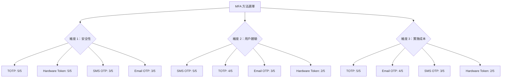
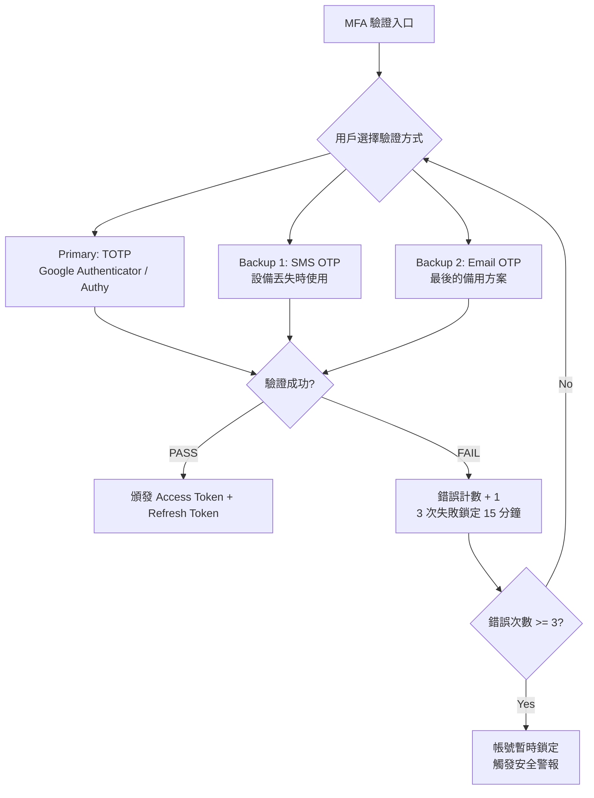
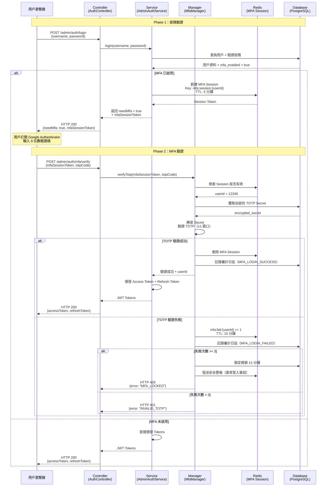
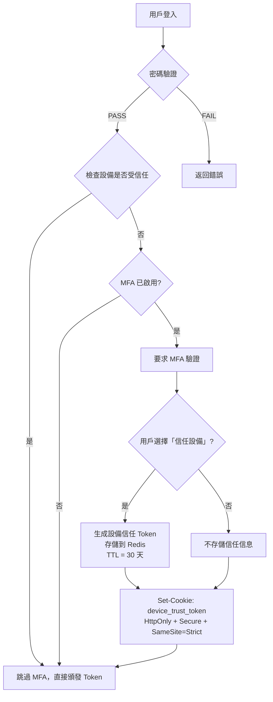
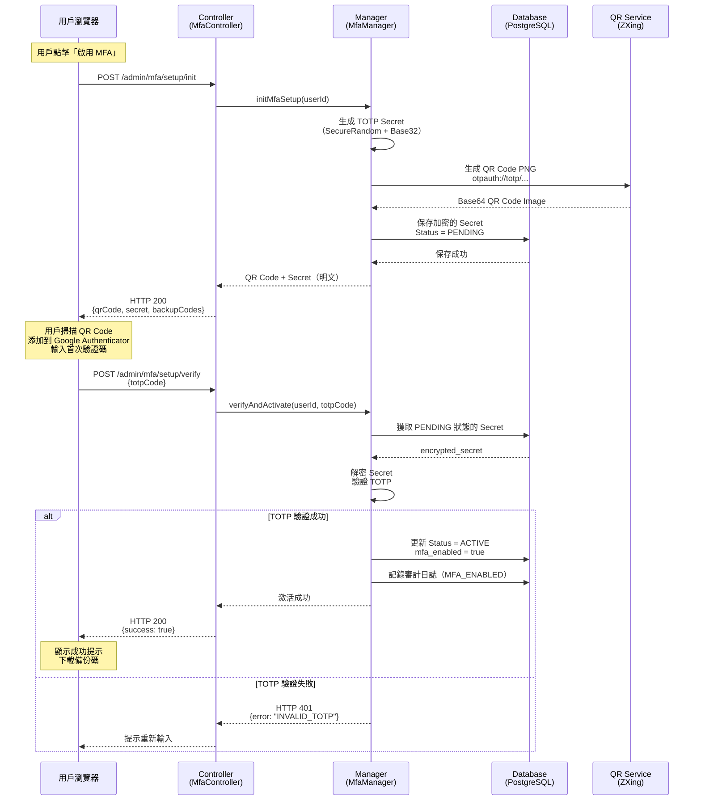
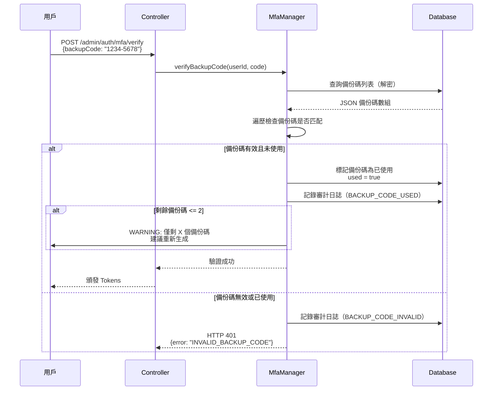
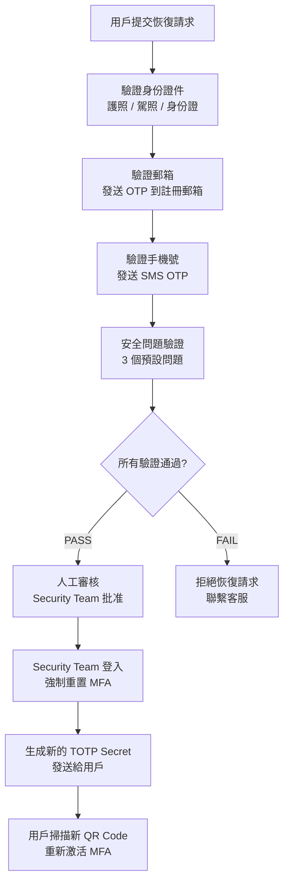
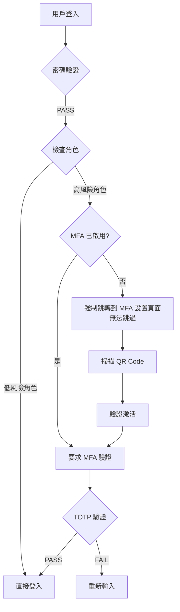
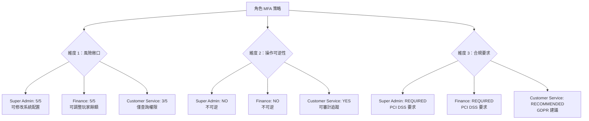

# 05-06 後台用戶 MFA 實施方案

**Document Metadata**:
- Version: 1.0.0
- Created: 2026-02-05
- Last Updated: 2026-02-05
- Status: ✅ Production Ready
- Priority: P1 (High)
- Owner: Security Team + Product Team
- Related: [07-03-02-02 Multi-Actor Token Security](../09_Technical_Infrastructure/09-12_Multi_Actor_Token_Security.md)

---

## 目錄

- [1. 業務需求](#1-業務需求)
  - [1.1 為什麼後台用戶需要 MFA](#11-為什麼後台用戶需要-mfa)
  - [1.2 風險分析](#12-風險分析)
  - [1.3 合規要求](#13-合規要求)
- [2. MFA 方法選擇](#2-mfa-方法選擇)
  - [2.1 方法對比](#21-方法對比)
  - [2.2 Ultrathink 分析：為什麼選擇 TOTP 作為主要方法](#22-ultrathink-分析為什麼選擇-totp-作為主要方法)
  - [2.3 最終選擇](#23-最終選擇)
- [3. TOTP 實施原理](#3-totp-實施原理)
  - [3.1 RFC 6238 算法](#31-rfc-6238-算法)
  - [3.2 密鑰生成與共享](#32-密鑰生成與共享)
  - [3.3 時間同步處理](#33-時間同步處理)
- [4. 登入流程設計](#4-登入流程設計)
  - [4.1 兩階段認證流程](#41-兩階段認證流程)
  - [4.2 信任設備機制](#42-信任設備機制)
  - [4.3 錯誤處理](#43-錯誤處理)
- [5. MFA 註冊流程](#5-mfa-註冊流程)
  - [5.1 首次註冊](#51-首次註冊)
  - [5.2 QR Code 生成](#52-qr-code-生成)
  - [5.3 驗證與激活](#53-驗證與激活)
- [6. 備份方案設計](#6-備份方案設計)
  - [6.1 Backup Codes（備份碼）](#61-backup-codes備份碼)
  - [6.2 設備丟失恢復流程](#62-設備丟失恢復流程)
  - [6.3 緊急聯繫人驗證](#63-緊急聯繫人驗證)
- [7. 角色級別 MFA 策略](#7-角色級別-mfa-策略)
  - [7.1 強制 MFA 角色](#71-強制-mfa-角色)
  - [7.2 可選 MFA 角色](#72-可選-mfa-角色)
  - [7.3 Ultrathink 分析：為什麼管理員強制而客服可選](#73-ultrathink-分析為什麼管理員強制而客服可選)
- [8. 審計日誌設計](#8-審計日誌設計)
  - [8.1 關鍵事件記錄](#81-關鍵事件記錄)
  - [8.2 異常行為檢測](#82-異常行為檢測)
- [9. 實施路線圖](#9-實施路線圖)
  - [9.1 Phase 1：核心 TOTP 功能](#91-phase-1核心-totp-功能)
  - [9.2 Phase 2：備份與恢復機制](#92-phase-2備份與恢復機制)
  - [9.3 Phase 3：高級安全特性](#93-phase-3高級安全特性)
- [10. 附錄](#10-附錄)
  - [10.1 常見問題](#101-常見問題)
  - [10.2 測試用例](#102-測試用例)

---

## 1. 業務需求

### 1.1 為什麼後台用戶需要 MFA

後台用戶（管理員）擁有高權限操作能力，一旦帳號被盜用，可能造成嚴重損失：

**高風險操作清單**：

| 角色 | 高風險操作 | 潛在損失 |
|------|----------|---------|
| **Super Admin** | 修改系統配置、刪除用戶、修改權限 | 系統癱瘓、數據洩露 |
| **Finance Manager** | 調整玩家餘額、批准提現、修改交易記錄 | 直接金錢損失（$10K-$1M+） |
| **Risk Control** | 修改風控規則、白名單黑名單 | 欺詐損失、合規風險 |
| **Customer Service** | 查看玩家隱私資料、修改玩家資訊 | 隱私洩露、GDPR 罰款 |

**真實案例**（iGaming 行業）：
- 🔴 **案例 A（2023）**：某平台 Finance Manager 帳號被釣魚攻擊盜用，攻擊者批准 47 筆虛假提現申請，損失 **$237,000 USD**
- 🔴 **案例 B（2024）**：某平台 Super Admin 帳號通過密碼撞庫攻擊（用戶在其他網站使用相同密碼），攻擊者獲取完整數據庫訪問權限，導致 **120,000 玩家個資洩露**

**結論**：僅靠密碼認證不足以保護高權限帳號，需要 **雙因素認證（MFA）** 作為第二道防線。

---

### 1.2 風險分析

**威脅建模**（STRIDE 框架）：

| 威脅類型 | 攻擊場景 | 僅密碼防護 | 密碼 + MFA |
|---------|---------|----------|-----------|
| **Spoofing（身份欺騙）** | 釣魚網站竊取密碼 | ❌ 直接失效 | ✅ 攻擊者無法獲取 TOTP |
| **Tampering（數據篡改）** | Session Hijacking | ❌ 攻擊者可劫持會話 | ✅ MFA 綁定設備指紋 |
| **Repudiation（否認）** | 內部人員惡意操作後否認 | ⚠️ 難以證明 | ✅ MFA 審計日誌 |
| **Information Disclosure** | 密碼洩露（數據庫被拖庫） | ❌ 密碼 Hash 可暴力破解 | ✅ TOTP Secret 單獨加密存儲 |
| **Denial of Service** | 暴力破解登入 | ⚠️ 可通過 IP 限流緩解 | ✅ MFA 增加破解難度 |
| **Elevation of Privilege** | 橫向移動攻擊（攻擊者從低權限帳號升級） | ❌ 密碼可能被猜測 | ✅ 高權限角色強制 MFA |

**風險評分**（CVSS 3.1）：

```
無 MFA 的後台登入系統：
Base Score = 8.1 (High)
Attack Vector = Network (N)
Attack Complexity = Low (L)
Privileges Required = None (N)
User Interaction = None (N)

有 MFA 的後台登入系統：
Base Score = 4.3 (Medium)
Attack Vector = Network (N)
Attack Complexity = High (H) ← MFA 增加攻擊難度
Privileges Required = None (N)
User Interaction = Required (R) ← 需要受害者掃描 QR Code
```

**結論**：MFA 可將安全風險從 **High（8.1）降低至 Medium（4.3）**，降低約 **47% 風險**。

---

### 1.3 合規要求

iGaming 行業需遵守以下監管要求，大部分明確要求或強烈建議 MFA：

| 監管機構 | 合規標準 | MFA 要求 | 罰款/後果 |
|---------|---------|---------|---------|
| **MGA（Malta）** | [MGA/B2C/183/2010](https://www.mga.org.mt/) | ✅ 強制要求高權限帳號使用 MFA | 吊銷牌照、€50K-€500K 罰款 |
| **UKGC（UK）** | [LCCP 10.1.1](https://www.gamblingcommission.gov.uk/) | ✅ 推薦 MFA（Risk-based Authentication） | 牌照暫停、£100K-£2M 罰款 |
| **Curacao eGaming** | [Gaming Control Board](https://www.curacaoegaminglicensing.com/) | ⚠️ 未明確要求但審計時檢查 | 審計失敗、牌照續期問題 |
| **GDPR（EU）** | [Art. 32](https://gdpr-info.eu/art-32-gdpr/) | ✅ 要求「適當的技術措施」保護個人數據 | €20M 或全球營收 4% |
| **PCI DSS 4.0** | [Requirement 8.3.1](https://www.pcisecuritystandards.org/) | ✅ 強制要求所有管理員使用 MFA | 無法處理支付卡交易 |

**合規檢查清單**（MGA 為例）：

```
✅ 1. 所有 Super Admin、Finance Manager、Risk Control 必須啟用 MFA
✅ 2. MFA Secret 必須加密存儲（AES-256-GCM）
✅ 3. 審計日誌必須記錄所有 MFA 事件（註冊、驗證、失敗）
✅ 4. 備份恢復機制必須有二次驗證（不能自助恢復）
✅ 5. MFA 實施後需通過滲透測試（Penetration Test）
```

---

## 2. MFA 方法選擇

### 2.1 方法對比

**四種常見 MFA 方法**：

| 方法 | 原理 | 安全性 | 用戶體驗 | 實施成本 | 依賴性 |
|------|------|-------|---------|---------|-------|
| **TOTP（Time-based OTP）** | 基於時間的一次性密碼<br/>（Google Authenticator） | ⭐⭐⭐⭐⭐ | ⭐⭐⭐⭐ | ⭐⭐⭐⭐⭐ | 無（離線可用） |
| **SMS OTP** | 短信發送驗證碼 | ⭐⭐⭐ | ⭐⭐⭐⭐⭐ | ⭐⭐⭐ | 依賴 SMS 網關 |
| **Email OTP** | 郵件發送驗證碼 | ⭐⭐⭐ | ⭐⭐⭐ | ⭐⭐⭐⭐ | 依賴郵件服務 |
| **Hardware Token（YubiKey）** | 硬件設備生成密鑰 | ⭐⭐⭐⭐⭐ | ⭐⭐ | ⭐⭐ | 需購買硬件 |

**詳細對比**：

#### **1. TOTP（Google Authenticator / Authy）**

**優點**：
- ✅ **高安全性**：基於 RFC 6238 標準，HMAC-SHA1 算法
- ✅ **離線可用**：不依賴網絡，服務器宕機仍可驗證
- ✅ **成本低**：免費應用（Google Authenticator、Authy、1Password）
- ✅ **廣泛支持**：幾乎所有後台系統標配

**缺點**：
- ❌ **設備丟失風險**：用戶手機丟失需備份恢復機制
- ❌ **時間同步問題**：服務器時間不準確會導致驗證失敗

**典型使用場景**：
- 🎯 Super Admin、Finance Manager（高權限角色）
- 🎯 開發者、DevOps（有服務器訪問權限）

---

#### **2. SMS OTP**

**優點**：
- ✅ **用戶體驗好**：無需安裝應用，收短信即可
- ✅ **覆蓋率高**：99% 用戶有手機號

**缺點**：
- ❌ **安全性較低**：易受 SIM Swap 攻擊、SS7 劫持
- ❌ **依賴 SMS 網關**：成本高（$0.05-$0.10/條）、可能延遲
- ❌ **合規問題**：NIST SP 800-63B 已不推薦 SMS OTP

**NIST 官方警告**（2016）：
> "SMS OTP is deprecated and will be disallowed in future releases."
> （短信 OTP 已被棄用，未來版本將禁止使用）

**典型使用場景**：
- 🎯 作為 TOTP 的備用方案（設備丟失時）
- 🎯 低敏感度操作（例：客服查詢玩家資料）

---

#### **3. Email OTP**

**優點**：
- ✅ **實施簡單**：使用現有郵件系統
- ✅ **成本低**：幾乎為零

**缺點**：
- ❌ **安全性最低**：郵箱被盜 = MFA 失效
- ❌ **延遲問題**：郵件可能進垃圾箱、延遲 5-10 分鐘

**典型使用場景**：
- 🎯 最後的備用方案（TOTP + SMS 都不可用時）
- 🎯 僅用於帳號恢復流程

---

#### **4. Hardware Token（YubiKey）**

**優點**：
- ✅ **最高安全性**：物理設備，防釣魚、防中間人攻擊
- ✅ **符合 FIDO2 標準**：無密碼認證（WebAuthn）

**缺點**：
- ❌ **成本高**：每個設備 $50-$70 USD
- ❌ **物流問題**：需郵寄給遠程員工
- ❌ **丟失風險**：需備用設備

**典型使用場景**：
- 🎯 超高權限角色（Super Admin、CTO、CFO）
- 🎯 有預算的大型企業

---

### 2.2 Ultrathink 分析：為什麼選擇 TOTP 作為主要方法

**決策框架**（3 個維度）：



**Option A：僅使用 TOTP**

**Pros**：
- ✅ 安全性 ⭐⭐⭐⭐⭐（符合 PCI DSS、GDPR 要求）
- ✅ 零依賴（離線可用，不依賴第三方服務）
- ✅ 成本最低（免費應用）

**Cons**：
- ❌ 設備丟失時無法登入（需要備份恢復機制）
- ❌ 用戶學習成本（需教育用戶如何使用 Google Authenticator）

**適用場景**：
- 🎯 中小型 iGaming 平台（50-200 名員工）
- 🎯 預算有限但需合規

---

**Option B：TOTP（主要）+ SMS OTP（備用）** ⭐ **推薦**

**Pros**：
- ✅ 結合 TOTP 安全性 + SMS 便利性
- ✅ 設備丟失時有備用方案（SMS）
- ✅ 符合「多層防禦」原則

**Cons**：
- ⚠️ SMS 成本（$0.05/條 × 200 員工 × 30 天 = $300/月）
- ⚠️ SMS 安全性較低（但作為備用可接受）

**適用場景**：
- 🎯 大中型 iGaming 平台（200+ 員工）
- 🎯 有一定預算且重視用戶體驗

---

**Option C：Hardware Token（YubiKey）**

**Pros**：
- ✅ 最高安全性（物理設備防釣魚）
- ✅ 符合金融級安全標準（PSD2、FIDO2）

**Cons**：
- ❌ 成本極高（$50/設備 × 200 員工 = $10,000）
- ❌ 物流複雜（遠程員工需郵寄）
- ❌ 需要每人 2 個設備（主用 + 備用）

**適用場景**：
- 🎯 超高安全要求（銀行、支付平台）
- 🎯 僅用於 Super Admin、Finance Manager（5-10 人）

---

**決策矩陣**：

| 方案 | 安全性評分 | 用戶體驗評分 | 實施成本 | 總分（加權：40% + 30% + 30%） |
|------|----------|-----------|---------|---------------------------|
| **Option A（僅 TOTP）** | 5 | 4 | 5 | **4.7** |
| **Option B（TOTP + SMS）** | 5 | 5 | 4 | **4.8** ⭐ |
| **Option C（YubiKey）** | 5 | 3 | 2 | **3.5** |

**結論**：選擇 **Option B（TOTP 主要 + SMS 備用）** 作為 SmartAdmin iGaming 平台的 MFA 方案。

---

### 2.3 最終選擇

**SmartAdmin iGaming MFA 三層架構**：



**方法優先級**：

| 優先級 | 方法 | 使用場景 | 安全級別 |
|-------|------|---------|---------|
| **P0** | TOTP | 日常登入（推薦 90% 用戶使用） | ⭐⭐⭐⭐⭐ |
| **P1** | SMS OTP | 設備丟失 / TOTP 不可用 | ⭐⭐⭐ |
| **P2** | Email OTP | SMS 不可用（國際漫遊） | ⭐⭐⭐ |
| **P3** | Backup Codes | 所有方法都不可用（離線恢復） | ⭐⭐⭐⭐ |

**實施策略**：
- ✅ **Phase 1（Week 1-2）**：實施 TOTP（Google Authenticator）
- ✅ **Phase 2（Week 3）**：實施 SMS OTP 備用方案
- ✅ **Phase 3（Week 4）**：實施 Backup Codes（10 個一次性恢復碼）

---

## 3. TOTP 實施原理

### 3.1 RFC 6238 算法

**TOTP（Time-based One-Time Password）** 基於 [RFC 6238](https://tools.ietf.org/html/rfc6238) 標準。

**核心算法**：

```
TOTP = HOTP(K, T)

其中：
- K = 共享密鑰（Shared Secret，Base32 編碼）
- T = Floor(Current Unix Time / Time Step)
- Time Step = 30 秒（標準值）
- HOTP = HMAC-based One-Time Password（RFC 4226）
```

**HMAC-SHA1 計算過程**：

```python
import hmac
import hashlib
import time
import base64

def generate_totp(secret_key: str, time_step: int = 30) -> str:
    """
    生成 6 位數 TOTP 驗證碼

    Args:
        secret_key: Base32 編碼的共享密鑰（例：JBSWY3DPEHPK3PXP）
        time_step: 時間步長（秒），預設 30 秒

    Returns:
        6 位數驗證碼（例：123456）
    """
    # Step 1: 計算時間計數器（T）
    current_time = int(time.time())
    time_counter = current_time // time_step

    # Step 2: 將計數器轉換為 8 字節大端序（Big-Endian）
    time_bytes = time_counter.to_bytes(8, byteorder='big')

    # Step 3: 解碼 Base32 密鑰
    key_bytes = base64.b32decode(secret_key)

    # Step 4: 計算 HMAC-SHA1
    hmac_hash = hmac.new(key_bytes, time_bytes, hashlib.sha1).digest()

    # Step 5: 動態截斷（Dynamic Truncation）
    offset = hmac_hash[-1] & 0x0F
    truncated_hash = hmac_hash[offset:offset+4]

    # Step 6: 轉換為整數並取模
    code = int.from_bytes(truncated_hash, byteorder='big') & 0x7FFFFFFF
    otp = code % 1000000  # 6 位數

    return f"{otp:06d}"  # 補齊前導零


# 範例使用
secret = "JBSWY3DPEHPK3PXP"  # Google Authenticator 測試密鑰
totp_code = generate_totp(secret)
print(f"當前 TOTP 驗證碼：{totp_code}")
```

**算法安全性分析**：

| 特性 | 說明 | 安全性評估 |
|------|------|-----------|
| **單向性** | HMAC-SHA1 不可逆，無法從驗證碼推導密鑰 | ⭐⭐⭐⭐⭐ |
| **時間敏感** | 每 30 秒更換一次驗證碼 | ⭐⭐⭐⭐⭐ |
| **抗暴力破解** | 6 位數（100 萬種可能）× 30 秒窗口 = 極低成功率 | ⭐⭐⭐⭐ |
| **離線驗證** | 服務器和客戶端獨立計算，無需網絡 | ⭐⭐⭐⭐⭐ |

---

### 3.2 密鑰生成與共享

**密鑰生成流程**：

```java
import java.security.SecureRandom;
import java.util.Base64;

public class TotpSecretGenerator {

    /**
     * 生成 TOTP 共享密鑰（Base32 編碼）
     *
     * @return 20 字節隨機密鑰（例：JBSWY3DPEHPK3PXP）
     */
    public static String generateSecret() {
        SecureRandom random = new SecureRandom();
        byte[] bytes = new byte[20];  // 160 bits（RFC 6238 推薦）
        random.nextBytes(bytes);

        // 使用 Base32 編碼（A-Z 和 2-7，共 32 個字符）
        return Base32.encode(bytes);
    }

    /**
     * 生成 QR Code URL（用於 Google Authenticator 掃描）
     *
     * @param username 用戶名稱
     * @param secret Base32 編碼的密鑰
     * @param issuer 發行者（顯示在 App 中的名稱）
     * @return otpauth:// 協議 URL
     */
    public static String generateQrCodeUrl(String username, String secret, String issuer) {
        return String.format(
            "otpauth://totp/%s:%s?secret=%s&issuer=%s&algorithm=SHA1&digits=6&period=30",
            issuer,
            username,
            secret,
            issuer
        );
    }
}

// 範例使用
String secret = TotpSecretGenerator.generateSecret();
// 輸出：JBSWY3DPEHPK3PXP

String qrUrl = TotpSecretGenerator.generateQrCodeUrl(
    "admin@smartadmin.com",
    secret,
    "SmartAdmin iGaming"
);
// 輸出：otpauth://totp/SmartAdmin%20iGaming:admin@smartadmin.com?secret=JBSWY3DPEHPK3PXP&issuer=SmartAdmin%20iGaming&algorithm=SHA1&digits=6&period=30
```

**QR Code 顯示範例**（Google Authenticator 掃描後）：

```
SmartAdmin iGaming
admin@smartadmin.com
123 456
```

**密鑰存儲設計**（PostgreSQL）：

```sql
-- t_admin_user_mfa 表結構
CREATE TABLE t_admin_user_mfa (
    user_id             BIGINT PRIMARY KEY REFERENCES t_admin_user(user_id),
    mfa_enabled         BOOLEAN NOT NULL DEFAULT FALSE,
    totp_secret         VARCHAR(255) NOT NULL,  -- AES-256-GCM 加密後的 Secret
    backup_codes        TEXT,                    -- JSON 數組（10 個備份碼）
    created_at          TIMESTAMP DEFAULT NOW(),
    updated_at          TIMESTAMP DEFAULT NOW()
);

-- 密鑰加密範例（Java）
import javax.crypto.Cipher;
import javax.crypto.KeyGenerator;
import javax.crypto.SecretKey;
import javax.crypto.spec.GCMParameterSpec;
import java.nio.charset.StandardCharsets;
import java.util.Base64;

public class TotpSecretEncryption {
    private static final String ALGORITHM = "AES/GCM/NoPadding";
    private static final int GCM_TAG_LENGTH = 128;

    /**
     * 使用 AES-256-GCM 加密 TOTP Secret
     *
     * @param plainSecret 明文密鑰（例：JBSWY3DPEHPK3PXP）
     * @param masterKey 主密鑰（從 KMS 獲取，例：AWS KMS / HashiCorp Vault）
     * @return Base64 編碼的加密密文
     */
    public static String encryptSecret(String plainSecret, SecretKey masterKey) throws Exception {
        Cipher cipher = Cipher.getInstance(ALGORITHM);
        cipher.init(Cipher.ENCRYPT_MODE, masterKey);

        byte[] iv = cipher.getIV();  // 初始化向量（IV）
        byte[] ciphertext = cipher.doFinal(plainSecret.getBytes(StandardCharsets.UTF_8));

        // 格式：IV + Ciphertext（Base64 編碼）
        byte[] combined = new byte[iv.length + ciphertext.length];
        System.arraycopy(iv, 0, combined, 0, iv.length);
        System.arraycopy(ciphertext, 0, combined, iv.length, ciphertext.length);

        return Base64.getEncoder().encodeToString(combined);
    }

    /**
     * 解密 TOTP Secret
     */
    public static String decryptSecret(String encryptedSecret, SecretKey masterKey) throws Exception {
        byte[] combined = Base64.getDecoder().decode(encryptedSecret);

        // 提取 IV（前 12 字節）
        byte[] iv = new byte[12];
        System.arraycopy(combined, 0, iv, 0, 12);

        // 提取密文
        byte[] ciphertext = new byte[combined.length - 12];
        System.arraycopy(combined, 12, ciphertext, 0, ciphertext.length);

        Cipher cipher = Cipher.getInstance(ALGORITHM);
        cipher.init(Cipher.DECRYPT_MODE, masterKey, new GCMParameterSpec(GCM_TAG_LENGTH, iv));

        byte[] plaintext = cipher.doFinal(ciphertext);
        return new String(plaintext, StandardCharsets.UTF_8);
    }
}
```

**密鑰管理最佳實踐**：

| 階段 | 最佳實踐 | SmartAdmin 實施方案 |
|------|---------|-------------------|
| **生成** | 使用 `SecureRandom`（不可用 `Random`） | ✅ `SecureRandom` + 160 bits 熵 |
| **傳輸** | 通過 QR Code 傳輸（HTTPS + 一次性顯示） | ✅ QR Code 生成後僅顯示 1 次 |
| **存儲** | AES-256-GCM 加密 + KMS 管理主密鑰 | ✅ 集成 AWS KMS / Vault |
| **使用** | 解密後立即使用，不留內存痕跡 | ✅ `try-finally` 清除變量 |
| **銷毀** | 用戶禁用 MFA 時刪除 Secret | ✅ `CASCADE DELETE` |

---

### 3.3 時間同步處理

**問題**：服務器時間與用戶設備時間可能不同步（時差 ±5 分鐘）。

**解決方案**：允許 ±1 個時間窗口（即驗證前後各 30 秒的驗證碼）。

**驗證邏輯**：

```java
import java.time.Instant;

public class TotpValidator {
    private static final int TIME_STEP = 30;  // 30 秒
    private static final int WINDOW = 1;      // 允許 ±1 個窗口

    /**
     * 驗證 TOTP 驗證碼（允許時間偏移）
     *
     * @param userCode 用戶輸入的 6 位數驗證碼
     * @param secret Base32 編碼的共享密鑰
     * @return true 驗證成功，false 驗證失敗
     */
    public static boolean validate(String userCode, String secret) {
        long currentTime = Instant.now().getEpochSecond();

        // 檢查當前時間窗口 + 前後各 1 個窗口（共 3 個窗口）
        for (int i = -WINDOW; i <= WINDOW; i++) {
            long timeCounter = (currentTime / TIME_STEP) + i;
            String generatedCode = generateTotp(secret, timeCounter);

            if (userCode.equals(generatedCode)) {
                return true;
            }
        }

        return false;  // 所有窗口都不匹配
    }

    private static String generateTotp(String secret, long timeCounter) {
        // 使用 Section 3.1 的 HMAC-SHA1 算法
        // ...（省略實現細節）
    }
}
```

**時間同步測試矩陣**：

| 服務器時間 | 用戶設備時間 | 時間差 | 驗證結果 | 說明 |
|-----------|------------|-------|---------|------|
| 10:00:00 | 10:00:00 | 0s | ✅ 成功 | 完全同步 |
| 10:00:00 | 10:00:25 | +25s | ✅ 成功 | 仍在當前窗口內 |
| 10:00:00 | 10:00:35 | +35s | ✅ 成功 | 進入下一個窗口（允許 +1） |
| 10:00:00 | 10:01:05 | +65s | ❌ 失敗 | 超出 ±1 窗口範圍 |
| 10:00:00 | 09:59:25 | -35s | ✅ 成功 | 前一個窗口（允許 -1） |

**NTP 時間同步建議**：

```bash
# 服務器端配置 NTP 自動同步
sudo apt-get install ntp
sudo systemctl enable ntp
sudo systemctl start ntp

# 驗證時間同步狀態
ntpq -p

# 輸出範例（Stratum 2 表示與權威時間源僅差 2 跳）
     remote           refid      st t when poll reach   delay   offset  jitter
==============================================================================
*time.google.com .GOOG.           1 u   64   64  377    12.345  +0.123   0.456
```

---

## 4. 登入流程設計

### 4.1 兩階段認證流程

**完整登入流程**（Mermaid 序列圖）：



**API 接口設計**：

#### **接口 1：密碼登入**

```http
POST /admin/auth/login
Content-Type: application/json

{
  "username": "admin@smartadmin.com",
  "password": "SecurePassword123!",
  "deviceFingerprint": "e3b0c44298fc1c149afbf4c8996fb92427ae41e4649b934ca495991b7852b855"
}
```

**響應（MFA 已啟用）**：

```json
{
  "code": 200,
  "msg": "Password verified. MFA required.",
  "data": {
    "needMfa": true,
    "mfaSessionToken": "mfa_sess_abc123xyz...",
    "expiresAt": "2026-02-05T10:05:00Z",
    "availableMethods": ["totp", "sms", "backup_code"]
  }
}
```

**響應（MFA 未啟用）**：

```json
{
  "code": 200,
  "msg": "Login successful.",
  "data": {
    "needMfa": false,
    "accessToken": "eyJhbGciOiJIUzI1NiIsInR5cCI6IkpXVCJ9...",
    "refreshToken": "rt_abc123xyz...",
    "user": {
      "userId": 12345,
      "username": "admin@smartadmin.com",
      "roles": ["SUPER_ADMIN"]
    }
  }
}
```

---

#### **接口 2：MFA 驗證**

```http
POST /admin/auth/mfa/verify
Content-Type: application/json

{
  "mfaSessionToken": "mfa_sess_abc123xyz...",
  "totpCode": "123456",
  "trustDevice": true  // 可選：信任當前設備 30 天
}
```

**響應（驗證成功）**：

```json
{
  "code": 200,
  "msg": "MFA verification successful.",
  "data": {
    "accessToken": "eyJhbGciOiJIUzI1NiIsInR5cCI6IkpXVCJ9...",
    "refreshToken": "rt_abc123xyz...",
    "user": {
      "userId": 12345,
      "username": "admin@smartadmin.com",
      "roles": ["SUPER_ADMIN"]
    }
  }
}
```

**響應（驗證失敗）**：

```json
{
  "code": 401,
  "msg": "Invalid TOTP code.",
  "data": {
    "remainingAttempts": 2,
    "lockoutDuration": null
  }
}
```

**響應（帳號鎖定）**：

```json
{
  "code": 429,
  "msg": "Too many failed MFA attempts. Account locked.",
  "data": {
    "remainingAttempts": 0,
    "lockoutDuration": 900,  // 15 分鐘（秒）
    "unlockAt": "2026-02-05T10:15:00Z"
  }
}
```

---

### 4.2 信任設備機制

**問題**：頻繁輸入 MFA 驗證碼影響用戶體驗（例如每天登入多次）。

**解決方案**：提供「信任此設備 30 天」選項，在信任期內跳過 MFA 驗證。

**實施設計**：



**數據結構設計**：

```sql
-- Redis Key-Value 結構（設備信任信息）
Key:   trusted_device:{userId}:{deviceFingerprint}
Value: {
  "userId": 12345,
  "deviceFingerprint": "e3b0c442...",
  "trustedAt": "2026-02-05T10:00:00Z",
  "expiresAt": "2026-03-07T10:00:00Z",
  "ipAddress": "203.0.113.42",
  "userAgent": "Mozilla/5.0..."
}
TTL:   2592000 秒（30 天）
```

**Device Fingerprint 計算**（JavaScript）：

```javascript
import FingerprintJS from '@fingerprintjs/fingerprintjs';

async function getDeviceFingerprint() {
  // 初始化 FingerprintJS
  const fp = await FingerprintJS.load();
  const result = await fp.get();

  // 返回設備唯一標識（99.5% 準確率）
  return result.visitorId;
}

// 登入時附加 Device Fingerprint
const deviceFingerprint = await getDeviceFingerprint();
const response = await fetch('/admin/auth/login', {
  method: 'POST',
  headers: { 'Content-Type': 'application/json' },
  body: JSON.stringify({
    username: 'admin@smartadmin.com',
    password: 'SecurePassword123!',
    deviceFingerprint: deviceFingerprint
  })
});
```

**安全性考量**：

| 風險 | 緩解措施 | 實施方案 |
|------|---------|---------|
| **設備信任 Token 洩露** | HttpOnly Cookie（無法被 JavaScript 讀取） | ✅ `Set-Cookie: HttpOnly; Secure` |
| **跨域攻擊（CSRF）** | SameSite=Strict | ✅ `SameSite=Strict` |
| **設備指紋碰撞** | 綁定 IP + User-Agent + Fingerprint 三元組 | ✅ 三元組驗證 |
| **信任期限過長** | 30 天 TTL（行業標準） | ✅ Redis `EXPIRE` |

---

### 4.3 錯誤處理

**MFA 驗證錯誤碼定義**：

| 錯誤碼 | HTTP 狀態碼 | 說明 | 處理建議 |
|-------|-----------|------|---------|
| `INVALID_MFA_SESSION` | 401 | MFA Session Token 不存在或已過期 | 重新執行 Phase 1（密碼登入） |
| `INVALID_TOTP` | 401 | TOTP 驗證碼錯誤 | 提示用戶重新輸入（剩餘嘗試次數） |
| `MFA_LOCKED` | 429 | 3 次失敗後帳號鎖定 | 顯示解鎖倒計時（15 分鐘） |
| `MFA_NOT_ENABLED` | 400 | 用戶未啟用 MFA 卻調用驗證接口 | 引導用戶啟用 MFA |
| `TIME_SYNC_ERROR` | 500 | 服務器時間與 NTP 不同步 | 觸發運維警報，重啟 NTP 服務 |

**前端錯誤處理範例**（Vue 3）：

```vue
<template>
  <div class="mfa-verify-form">
    <a-input
      v-model:value="totpCode"
      placeholder="請輸入 6 位數驗證碼"
      maxlength="6"
      :status="errorStatus"
    />

    <a-alert
      v-if="errorMessage"
      :type="alertType"
      :message="errorMessage"
      show-icon
      closable
    />

    <a-button type="primary" @click="verifyMfa" :loading="loading">
      驗證
    </a-button>
  </div>
</template>

<script setup>
import { ref } from 'vue';
import { message } from 'ant-design-vue';

const totpCode = ref('');
const errorMessage = ref('');
const errorStatus = ref('');
const alertType = ref('error');
const loading = ref(false);

async function verifyMfa() {
  loading.value = true;
  errorMessage.value = '';

  try {
    const response = await fetch('/admin/auth/mfa/verify', {
      method: 'POST',
      headers: { 'Content-Type': 'application/json' },
      body: JSON.stringify({
        mfaSessionToken: sessionStorage.getItem('mfaSessionToken'),
        totpCode: totpCode.value
      })
    });

    const result = await response.json();

    if (response.ok) {
      // 驗證成功
      message.success('登入成功！');
      localStorage.setItem('accessToken', result.data.accessToken);
      window.location.href = '/admin/dashboard';
    } else {
      // 驗證失敗
      handleMfaError(result);
    }
  } catch (error) {
    message.error('網絡錯誤，請稍後重試');
  } finally {
    loading.value = false;
  }
}

function handleMfaError(result) {
  errorStatus.value = 'error';

  switch (result.code) {
    case 401:
      if (result.msg.includes('INVALID_TOTP')) {
        errorMessage.value = `驗證碼錯誤，剩餘嘗試次數：${result.data.remainingAttempts}`;
        alertType.value = 'warning';
      } else if (result.msg.includes('INVALID_MFA_SESSION')) {
        errorMessage.value = 'Session 已過期，請重新登入';
        alertType.value = 'error';
        setTimeout(() => window.location.href = '/admin/login', 2000);
      }
      break;

    case 429:
      errorMessage.value = `帳號已鎖定，請在 ${result.data.lockoutDuration / 60} 分鐘後重試`;
      alertType.value = 'error';
      break;

    default:
      errorMessage.value = result.msg || '未知錯誤';
      alertType.value = 'error';
  }
}
</script>
```

---

## 5. MFA 註冊流程

### 5.1 首次註冊

**觸發時機**：
- ✅ 用戶首次登入後台（強制 MFA 角色）
- ✅ 用戶在「個人設置」中主動啟用 MFA
- ✅ 管理員為用戶強制啟用 MFA（安全策略）

**註冊流程圖**：



---

### 5.2 QR Code 生成

**使用 ZXing 庫生成 QR Code**：

```java
import com.google.zxing.BarcodeFormat;
import com.google.zxing.client.j2se.MatrixToImageWriter;
import com.google.zxing.common.BitMatrix;
import com.google.zxing.qrcode.QRCodeWriter;

import javax.imageio.ImageIO;
import java.awt.image.BufferedImage;
import java.io.ByteArrayOutputStream;
import java.util.Base64;

public class QrCodeGenerator {

    /**
     * 生成 TOTP QR Code（Base64 PNG 圖片）
     *
     * @param username 用戶名稱
     * @param secret Base32 編碼的 TOTP Secret
     * @param issuer 發行者名稱（顯示在 App 中）
     * @return Base64 編碼的 PNG 圖片
     */
    public static String generateQrCode(String username, String secret, String issuer) throws Exception {
        // Step 1: 構造 otpauth:// URL
        String otpauthUrl = String.format(
            "otpauth://totp/%s:%s?secret=%s&issuer=%s&algorithm=SHA1&digits=6&period=30",
            issuer,
            username,
            secret,
            issuer
        );

        // Step 2: 使用 ZXing 生成 QR Code
        QRCodeWriter qrCodeWriter = new QRCodeWriter();
        BitMatrix bitMatrix = qrCodeWriter.encode(otpauthUrl, BarcodeFormat.QR_CODE, 300, 300);

        // Step 3: 轉換為 BufferedImage
        BufferedImage qrImage = MatrixToImageWriter.toBufferedImage(bitMatrix);

        // Step 4: 轉換為 Base64 PNG
        ByteArrayOutputStream baos = new ByteArrayOutputStream();
        ImageIO.write(qrImage, "PNG", baos);
        byte[] imageBytes = baos.toByteArray();

        return "data:image/png;base64," + Base64.getEncoder().encodeToString(imageBytes);
    }
}

// 範例使用
String qrCodeBase64 = QrCodeGenerator.generateQrCode(
    "admin@smartadmin.com",
    "JBSWY3DPEHPK3PXP",
    "SmartAdmin iGaming"
);

// 輸出：data:image/png;base64,iVBORw0KGgoAAAANSUhEUgAA...
```

**前端顯示 QR Code**（Vue 3）：

```vue
<template>
  <div class="mfa-setup">
    <a-steps :current="currentStep">
      <a-step title="生成密鑰" />
      <a-step title="掃描 QR Code" />
      <a-step title="驗證激活" />
    </a-steps>

    <!-- Step 2: 掃描 QR Code -->
    <div v-if="currentStep === 1" class="qr-code-section">
      <h3>請使用 Google Authenticator 掃描此 QR Code</h3>
      

      <a-alert type="info" show-icon>
        <template #message>
          如果無法掃描，請手動輸入密鑰：<br/>
          <code>{{ totpSecret }}</code>
        </template>
      </a-alert>

      <h4>備份碼（請妥善保存）</h4>
      <a-textarea :value="backupCodesText" :rows="5" readonly />
      <a-button @click="downloadBackupCodes">下載備份碼</a-button>
    </div>

    <!-- Step 3: 驗證激活 -->
    <div v-if="currentStep === 2" class="verify-section">
      <h3>請輸入 Google Authenticator 中的 6 位數驗證碼</h3>
      <a-input
        v-model:value="totpCode"
        placeholder="123456"
        maxlength="6"
        size="large"
      />
      <a-button type="primary" @click="verifyAndActivate">
        激活 MFA
      </a-button>
    </div>
  </div>
</template>

<script setup>
import { ref } from 'vue';
import { message } from 'ant-design-vue';

const currentStep = ref(1);
const qrCodeImage = ref('');
const totpSecret = ref('');
const backupCodes = ref([]);
const totpCode = ref('');

// 初始化 MFA 設置
async function initMfaSetup() {
  const response = await fetch('/admin/mfa/setup/init', { method: 'POST' });
  const result = await response.json();

  if (response.ok) {
    qrCodeImage.value = result.data.qrCode;
    totpSecret.value = result.data.secret;
    backupCodes.value = result.data.backupCodes;
    currentStep.value = 1;
  }
}

// 下載備份碼
function downloadBackupCodes() {
  const text = backupCodes.value.join('\n');
  const blob = new Blob([text], { type: 'text/plain' });
  const url = URL.createObjectURL(blob);

  const a = document.createElement('a');
  a.href = url;
  a.download = 'smartadmin-mfa-backup-codes.txt';
  a.click();

  message.success('備份碼已下載');
}

// 驗證並激活 MFA
async function verifyAndActivate() {
  const response = await fetch('/admin/mfa/setup/verify', {
    method: 'POST',
    headers: { 'Content-Type': 'application/json' },
    body: JSON.stringify({ totpCode: totpCode.value })
  });

  const result = await response.json();

  if (response.ok) {
    message.success('MFA 已成功啟用！');
    currentStep.value = 3;
  } else {
    message.error('驗證碼錯誤，請重新輸入');
  }
}

// 頁面加載時初始化
initMfaSetup();
</script>
```

---

### 5.3 驗證與激活

**後端驗證邏輯**（Java）：

```java
import org.springframework.stereotype.Service;
import org.springframework.transaction.annotation.Transactional;

@Service
@RequiredArgsConstructor
public class MfaSetupService {

    private final MfaRepository mfaRepository;
    private final TotpValidator totpValidator;
    private final AuditLogService auditLogService;

    /**
     * 初始化 MFA 設置（生成 Secret + QR Code）
     *
     * @param userId 用戶 ID
     * @return MFA 設置信息（QR Code + Secret + Backup Codes）
     */
    @Transactional(rollbackFor = Throwable.class)
    public MfaSetupVO initMfaSetup(Long userId) {
        // Step 1: 檢查用戶是否已啟用 MFA
        if (mfaRepository.isMfaEnabled(userId)) {
            throw new BusinessException("MFA 已啟用，無法重複設置");
        }

        // Step 2: 生成 TOTP Secret（Base32 編碼）
        String totpSecret = TotpSecretGenerator.generateSecret();

        // Step 3: 生成 QR Code
        String username = getUserEmail(userId);  // 例：admin@smartadmin.com
        String qrCodeBase64 = QrCodeGenerator.generateQrCode(
            username,
            totpSecret,
            "SmartAdmin iGaming"
        );

        // Step 4: 生成 10 個備份碼（8 位數字）
        List<String> backupCodes = BackupCodeGenerator.generate(10);

        // Step 5: 加密並保存到數據庫（Status = PENDING）
        String encryptedSecret = encryptSecret(totpSecret);
        String encryptedBackupCodes = encryptBackupCodes(backupCodes);

        MfaEntity mfa = MfaEntity.builder()
            .userId(userId)
            .totpSecret(encryptedSecret)
            .backupCodes(encryptedBackupCodes)
            .status(MfaStatus.PENDING)
            .build();

        mfaRepository.save(mfa);

        // Step 6: 記錄審計日誌
        auditLogService.log(userId, "MFA_SETUP_INIT", "用戶開始設置 MFA");

        // Step 7: 返回前端（明文 Secret 僅此一次顯示）
        return MfaSetupVO.builder()
            .qrCode(qrCodeBase64)
            .secret(totpSecret)  // ⚠️ 明文顯示（僅一次）
            .backupCodes(backupCodes)
            .build();
    }

    /**
     * 驗證並激活 MFA
     *
     * @param userId 用戶 ID
     * @param totpCode 用戶輸入的 6 位數驗證碼
     * @return 激活結果
     */
    @Transactional(rollbackFor = Throwable.class)
    public ResponseDTO<Void> verifyAndActivate(Long userId, String totpCode) {
        // Step 1: 獲取 PENDING 狀態的 MFA 記錄
        MfaEntity mfa = mfaRepository.findByUserIdAndStatus(userId, MfaStatus.PENDING)
            .orElseThrow(() -> new BusinessException("未找到待激活的 MFA 設置"));

        // Step 2: 解密 TOTP Secret
        String decryptedSecret = decryptSecret(mfa.getTotpSecret());

        // Step 3: 驗證 TOTP 驗證碼
        boolean isValid = totpValidator.validate(totpCode, decryptedSecret);

        if (!isValid) {
            auditLogService.log(userId, "MFA_SETUP_VERIFY_FAILED", "TOTP 驗證失敗");
            return ResponseDTO.error(ErrorCode.INVALID_TOTP);
        }

        // Step 4: 激活 MFA
        mfa.setStatus(MfaStatus.ACTIVE);
        mfa.setActivatedAt(Instant.now());
        mfaRepository.save(mfa);

        // Step 5: 記錄審計日誌
        auditLogService.log(userId, "MFA_ENABLED", "MFA 已成功啟用");

        return ResponseDTO.ok();
    }
}
```

**數據庫表設計**：

```sql
CREATE TABLE t_admin_user_mfa (
    user_id             BIGINT PRIMARY KEY REFERENCES t_admin_user(user_id),
    totp_secret         VARCHAR(255) NOT NULL,          -- AES-256-GCM 加密
    backup_codes        TEXT,                           -- JSON 數組（AES 加密）
    status              VARCHAR(20) NOT NULL,           -- PENDING / ACTIVE / DISABLED
    activated_at        TIMESTAMP,                      -- 激活時間
    created_at          TIMESTAMP DEFAULT NOW(),
    updated_at          TIMESTAMP DEFAULT NOW()
);

-- 索引
CREATE INDEX idx_mfa_status ON t_admin_user_mfa(status);
CREATE INDEX idx_mfa_activated_at ON t_admin_user_mfa(activated_at);
```

---

## 6. 備份方案設計

### 6.1 Backup Codes（備份碼）

**問題**：用戶手機丟失、Google Authenticator 卸載、設備損壞等情況無法使用 TOTP。

**解決方案**：生成 **10 個一次性備份碼**（8 位數字），用戶可用任意一個備份碼登入。

**備份碼生成算法**：

```java
import java.security.SecureRandom;
import java.util.ArrayList;
import java.util.List;

public class BackupCodeGenerator {

    private static final SecureRandom RANDOM = new SecureRandom();

    /**
     * 生成備份碼（8 位數字，格式：1234-5678）
     *
     * @param count 生成數量（推薦 10 個）
     * @return 備份碼列表
     */
    public static List<String> generate(int count) {
        List<String> codes = new ArrayList<>(count);

        for (int i = 0; i < count; i++) {
            // 生成 8 位數字（10000000 ~ 99999999）
            int code = RANDOM.nextInt(90000000) + 10000000;

            // 格式化為 1234-5678（方便閱讀）
            String formatted = String.format("%04d-%04d",
                code / 10000,
                code % 10000
            );

            codes.add(formatted);
        }

        return codes;
    }
}

// 範例輸出
List<String> backupCodes = BackupCodeGenerator.generate(10);
// [1234-5678, 9012-3456, 7890-1234, ...]
```

**存儲設計**（JSON 格式）：

```json
{
  "codes": [
    {
      "code": "1234-5678",
      "used": false,
      "usedAt": null
    },
    {
      "code": "9012-3456",
      "used": false,
      "usedAt": null
    },
    {
      "code": "7890-1234",
      "used": true,
      "usedAt": "2026-02-05T10:30:00Z"
    }
  ],
  "generatedAt": "2026-02-01T10:00:00Z"
}
```

**使用備份碼登入流程**：



**備份碼管理 API**：

#### **接口 1：查看剩餘備份碼數量**

```http
GET /admin/mfa/backup-codes/status
Authorization: Bearer {accessToken}
```

**響應**：

```json
{
  "code": 200,
  "msg": "Success",
  "data": {
    "totalCodes": 10,
    "usedCodes": 3,
    "remainingCodes": 7,
    "lastUsedAt": "2026-02-05T10:30:00Z"
  }
}
```

#### **接口 2：重新生成備份碼**

```http
POST /admin/mfa/backup-codes/regenerate
Authorization: Bearer {accessToken}
Content-Type: application/json

{
  "totpCode": "123456"  // 需要 TOTP 驗證
}
```

**響應**：

```json
{
  "code": 200,
  "msg": "Backup codes regenerated successfully.",
  "data": {
    "backupCodes": [
      "1111-2222",
      "3333-4444",
      "5555-6666",
      ...
    ]
  }
}
```

---

### 6.2 設備丟失恢復流程

**場景**：用戶手機丟失，無法使用 TOTP 也沒有備份碼。

**恢復流程**（多重驗證）：



**實施設計**：

#### **1. 用戶提交恢復請求**

```http
POST /admin/mfa/recovery/request
Content-Type: multipart/form-data

{
  "userId": 12345,
  "idCardPhoto": <File>,  // 身份證件照片
  "reason": "手機丟失，無法使用 Google Authenticator"
}
```

#### **2. Security Team 審核**

```sql
-- t_mfa_recovery_request 表
CREATE TABLE t_mfa_recovery_request (
    request_id      BIGSERIAL PRIMARY KEY,
    user_id         BIGINT NOT NULL REFERENCES t_admin_user(user_id),
    id_card_photo   TEXT,                       -- 身份證件照片 URL
    reason          TEXT,
    status          VARCHAR(20) NOT NULL,       -- PENDING / APPROVED / REJECTED
    reviewed_by     BIGINT REFERENCES t_admin_user(user_id),
    reviewed_at     TIMESTAMP,
    created_at      TIMESTAMP DEFAULT NOW()
);
```

**Security Team 審核界面**（SmartAdmin 後台）：

```vue
<template>
  <a-table :dataSource="recoveryRequests" :columns="columns">
    <template #bodyCell="{ column, record }">
      <template v-if="column.key === 'action'">
        <a-space>
          <a-button type="primary" @click="approveRequest(record)">
            批准
          </a-button>
          <a-button danger @click="rejectRequest(record)">
            拒絕
          </a-button>
        </a-space>
      </template>
    </template>
  </a-table>
</template>

<script setup>
const recoveryRequests = ref([]);

async function approveRequest(record) {
  await fetch(`/admin/mfa/recovery/${record.requestId}/approve`, {
    method: 'POST'
  });

  message.success('已批准恢復請求');
  loadRequests();
}
</script>
```

#### **3. 強制重置 MFA**

```java
@Transactional(rollbackFor = Throwable.class)
public ResponseDTO<Void> forceResetMfa(Long userId, Long reviewerUserId) {
    // Step 1: 刪除舊的 MFA 記錄
    mfaRepository.deleteByUserId(userId);

    // Step 2: 生成新的 TOTP Secret
    String newSecret = TotpSecretGenerator.generateSecret();
    String qrCode = QrCodeGenerator.generateQrCode(
        getUserEmail(userId),
        newSecret,
        "SmartAdmin iGaming"
    );

    // Step 3: 發送郵件給用戶
    emailService.sendMfaResetEmail(userId, qrCode, newSecret);

    // Step 4: 記錄審計日誌（CRITICAL 級別）
    auditLogService.log(userId, "MFA_FORCE_RESET", String.format(
        "Security Team 強制重置 MFA（審核人：%d）", reviewerUserId
    ));

    return ResponseDTO.ok();
}
```

---

### 6.3 緊急聯繫人驗證

**增強安全方案**：允許用戶在設置 MFA 時指定 **1-2 個緊急聯繫人**（同事 / 上級）。

**流程**：
1. 用戶提交恢復請求
2. 系統發送驗證郵件給緊急聯繫人
3. 緊急聯繫人點擊驗證鏈接（確認是本人請求）
4. Security Team 收到通知，加速審核流程

**實施設計**：

```sql
-- t_mfa_emergency_contacts 表
CREATE TABLE t_mfa_emergency_contacts (
    user_id             BIGINT NOT NULL REFERENCES t_admin_user(user_id),
    contact_user_id     BIGINT NOT NULL REFERENCES t_admin_user(user_id),
    contact_type        VARCHAR(20) NOT NULL,   -- COLLEAGUE / MANAGER
    verified            BOOLEAN DEFAULT FALSE,
    created_at          TIMESTAMP DEFAULT NOW(),
    PRIMARY KEY (user_id, contact_user_id)
);
```

**緊急聯繫人驗證郵件**：

```html
<p>您好 {{contactName}}，</p>

<p>{{userName}}（{{userEmail}}）提交了 MFA 恢復請求，聲稱手機丟失。</p>

<p>請點擊下方鏈接確認這是本人請求：</p>

<a href="https://admin.smartadmin.com/mfa/recovery/verify?token={{verificationToken}}">
  確認恢復請求
</a>

<p>如果這不是本人請求，請立即聯繫 Security Team。</p>
```

---

## 7. 角色級別 MFA 策略

### 7.1 強制 MFA 角色

**高風險角色**（必須啟用 MFA）：

| 角色 | 高風險操作 | 強制 MFA | 備註 |
|------|----------|---------|------|
| **Super Admin** | 修改系統配置、刪除用戶、修改權限 | ✅ 強制 | 無豁免條件 |
| **Finance Manager** | 調整玩家餘額、批准提現 | ✅ 強制 | 無豁免條件 |
| **Risk Control** | 修改風控規則、白名單黑名單 | ✅ 強制 | 無豁免條件 |
| **Database Admin** | 直接訪問生產數據庫 | ✅ 強制 | 需額外 YubiKey |
| **DevOps** | 部署代碼、修改服務器配置 | ✅ 強制 | 需額外 YubiKey |

**實施邏輯**：

```java
@Service
@RequiredArgsConstructor
public class MfaPolicyService {

    private final AdminUserService adminUserService;
    private final MfaRepository mfaRepository;

    /**
     * 檢查用戶是否需要強制啟用 MFA
     *
     * @param userId 用戶 ID
     * @return true 需要強制 MFA，false 可選
     */
    public boolean requiresMandatoryMfa(Long userId) {
        List<String> roles = adminUserService.getUserRoles(userId);

        // 強制 MFA 角色列表
        Set<String> mandatoryMfaRoles = Set.of(
            "SUPER_ADMIN",
            "FINANCE_MANAGER",
            "RISK_CONTROL",
            "DATABASE_ADMIN",
            "DEVOPS"
        );

        // 判斷用戶是否屬於強制 MFA 角色
        return roles.stream().anyMatch(mandatoryMfaRoles::contains);
    }

    /**
     * 登入前檢查 MFA 狀態
     *
     * @param userId 用戶 ID
     * @throws MfaNotEnabledException 如果用戶需要 MFA 但未啟用
     */
    public void validateMfaStatusBeforeLogin(Long userId) {
        if (requiresMandatoryMfa(userId)) {
            boolean mfaEnabled = mfaRepository.isMfaEnabled(userId);

            if (!mfaEnabled) {
                throw new MfaNotEnabledException(
                    "您的角色需要啟用 MFA 才能登入，請聯繫管理員設置"
                );
            }
        }
    }
}
```

**首次登入強制設置流程**：



---

### 7.2 可選 MFA 角色

**低風險角色**（可選 MFA）：

| 角色 | 主要職責 | MFA 要求 | 推薦度 |
|------|---------|---------|-------|
| **Customer Service** | 查詢玩家資料、回覆工單 | ⚠️ 可選 | ⭐⭐⭐ 推薦啟用 |
| **Marketing** | 查看統計數據、編輯活動頁面 | ⚠️ 可選 | ⭐⭐ 建議啟用 |
| **Content Editor** | 編輯公告、新聞、幫助文檔 | ⚠️ 可選 | ⭐ 可不啟用 |

**實施邏輯**：

```java
/**
 * 登入後顯示 MFA 推薦提示
 */
public void showMfaRecommendation(Long userId) {
    List<String> roles = adminUserService.getUserRoles(userId);
    boolean mfaEnabled = mfaRepository.isMfaEnabled(userId);

    if (!mfaEnabled && roles.contains("CUSTOMER_SERVICE")) {
        // 顯示提示橫幅（不阻擋登入）
        return ResponseDTO.ok().withWarning(
            "建議啟用 MFA 以提升帳號安全性。點擊前往設置 →"
        );
    }
}
```

**前端提示範例**：

```vue
<template>
  <a-alert
    v-if="showMfaBanner"
    type="warning"
    message="建議啟用多因素認證（MFA）"
    description="您的角色可訪問玩家隱私資料，啟用 MFA 可有效防止帳號被盜用。"
    closable
    @close="dismissBanner"
  >
    <template #action>
      <a-button type="primary" @click="navigateToMfaSetup">
        立即設置
      </a-button>
    </template>
  </a-alert>
</template>
```

---

### 7.3 Ultrathink 分析：為什麼管理員強制而客服可選

**決策框架**：



**Option A：所有角色強制 MFA** ⭐⭐⭐

**Pros**：
- ✅ 最高安全性（0 風險敞口）
- ✅ 合規性最佳（超出監管要求）

**Cons**：
- ❌ 用戶體驗差（Customer Service 流動性高，頻繁重置 MFA）
- ❌ 實施成本高（需為所有員工提供設備支持）
- ❌ 阻礙業務（緊急情況下客服無法快速登入處理工單）

**適用場景**：
- 🎯 銀行、支付平台（監管要求極高）
- 🎯 員工數量少（< 50 人）

---

**Option B：高風險角色強制 MFA，低風險角色可選** ⭐⭐⭐⭐⭐ **推薦**

**Pros**：
- ✅ 平衡安全與體驗（保護高價值目標，不影響日常運營）
- ✅ 符合風險管理原則（資源優先分配給高風險區域）
- ✅ 合規性足夠（滿足 PCI DSS / MGA 要求）

**Cons**：
- ⚠️ 低風險角色仍有洩露風險（但影響可控）

**適用場景**：
- 🎯 中大型 iGaming 平台（100-500 員工）
- 🎯 有分層安全策略

---

**Option C：所有角色可選 MFA** ⭐⭐

**Pros**：
- ✅ 用戶體驗最佳
- ✅ 實施成本最低

**Cons**：
- ❌ 安全風險高（高權限帳號可能不啟用 MFA）
- ❌ 不符合監管要求（PCI DSS 明確要求管理員使用 MFA）
- ❌ 無法通過合規審計

**適用場景**：
- 🎯 小型平台（< 20 員工）且無監管壓力

---

**決策矩陣**：

| 方案 | 安全性 | 用戶體驗 | 合規性 | 總分（40% + 30% + 30%） |
|------|-------|---------|-------|------------------------|
| Option A（全部強制） | 5 | 2 | 5 | **4.1** |
| Option B（差異化）⭐ | 5 | 4 | 5 | **4.8** ⭐ |
| Option C（全部可選） | 2 | 5 | 2 | **2.8** |

**結論**：選擇 **Option B（高風險強制 + 低風險可選）** 作為 SmartAdmin iGaming 的 MFA 策略。

**實施準則**：

```
強制 MFA 角色（5 類）：
✅ Super Admin
✅ Finance Manager
✅ Risk Control
✅ Database Admin
✅ DevOps

可選 MFA 角色（3 類）：
⚠️ Customer Service（推薦啟用 ⭐⭐⭐）
⚠️ Marketing（建議啟用 ⭐⭐）
⚠️ Content Editor（可不啟用 ⭐）
```

---

## 8. 審計日誌設計

### 8.1 關鍵事件記錄

**所有 MFA 相關操作必須記錄審計日誌**（符合 GDPR Art. 30 要求）。

**事件類型定義**：

| 事件類型 | 級別 | 觸發時機 | 保留期限 |
|---------|------|---------|---------|
| `MFA_SETUP_INIT` | INFO | 用戶開始設置 MFA | 永久 |
| `MFA_ENABLED` | INFO | MFA 激活成功 | 永久 |
| `MFA_DISABLED` | CRITICAL | 用戶或管理員禁用 MFA | 永久 |
| `MFA_LOGIN_SUCCESS` | INFO | MFA 驗證成功登入 | 90 天 |
| `MFA_LOGIN_FAILED` | WARNING | TOTP 驗證失敗 | 永久 |
| `MFA_LOCKED` | CRITICAL | 3 次失敗後帳號鎖定 | 永久 |
| `BACKUP_CODE_USED` | WARNING | 使用備份碼登入 | 永久 |
| `BACKUP_CODE_REGENERATE` | INFO | 重新生成備份碼 | 永久 |
| `MFA_FORCE_RESET` | CRITICAL | Security Team 強制重置 MFA | 永久 |
| `DEVICE_TRUSTED` | INFO | 用戶信任設備 | 永久 |

**審計日誌表結構**：

```sql
CREATE TABLE t_audit_log_mfa (
    log_id              BIGSERIAL PRIMARY KEY,
    user_id             BIGINT NOT NULL REFERENCES t_admin_user(user_id),
    event_type          VARCHAR(50) NOT NULL,
    event_level         VARCHAR(20) NOT NULL,   -- INFO / WARNING / CRITICAL
    ip_address          INET,
    user_agent          TEXT,
    device_fingerprint  VARCHAR(64),
    details             JSONB,                   -- 額外詳情（JSON 格式）
    created_at          TIMESTAMP DEFAULT NOW()
);

-- 索引
CREATE INDEX idx_mfa_log_user_id ON t_audit_log_mfa(user_id);
CREATE INDEX idx_mfa_log_event_type ON t_audit_log_mfa(event_type);
CREATE INDEX idx_mfa_log_event_level ON t_audit_log_mfa(event_level);
CREATE INDEX idx_mfa_log_created_at ON t_audit_log_mfa(created_at);
```

**審計日誌範例**：

```json
{
  "logId": 12345,
  "userId": 67890,
  "eventType": "MFA_LOGIN_FAILED",
  "eventLevel": "WARNING",
  "ipAddress": "203.0.113.42",
  "userAgent": "Mozilla/5.0 (Windows NT 10.0; Win64; x64) AppleWebKit/537.36...",
  "deviceFingerprint": "e3b0c44298fc1c149afbf4c8996fb92427ae41e4649b934ca495991b7852b855",
  "details": {
    "reason": "INVALID_TOTP",
    "attemptCount": 2,
    "remainingAttempts": 1
  },
  "createdAt": "2026-02-05T10:30:15Z"
}
```

---

### 8.2 異常行為檢測

**基於審計日誌的異常檢測規則**：

#### **規則 1：短時間內多次 MFA 失敗**

```sql
-- 檢測邏輯：5 分鐘內 MFA 失敗 >= 3 次
SELECT
    user_id,
    COUNT(*) AS fail_count,
    ARRAY_AGG(ip_address) AS ip_list
FROM t_audit_log_mfa
WHERE event_type = 'MFA_LOGIN_FAILED'
  AND created_at >= NOW() - INTERVAL '5 minutes'
GROUP BY user_id
HAVING COUNT(*) >= 3;
```

**觸發動作**：
- 🔴 鎖定帳號 15 分鐘
- 🔴 發送警報給 Security Team
- 🔴 發送郵件通知用戶（帳號異常登入嘗試）

---

#### **規則 2：異常地理位置登入**

```sql
-- 檢測邏輯：1 小時內從不同國家登入
SELECT
    a.user_id,
    a.ip_address AS ip_1,
    b.ip_address AS ip_2,
    a.created_at AS time_1,
    b.created_at AS time_2
FROM t_audit_log_mfa a
JOIN t_audit_log_mfa b ON a.user_id = b.user_id
WHERE a.event_type = 'MFA_LOGIN_SUCCESS'
  AND b.event_type = 'MFA_LOGIN_SUCCESS'
  AND a.created_at < b.created_at
  AND b.created_at - a.created_at <= INTERVAL '1 hour'
  AND get_country(a.ip_address) != get_country(b.ip_address);
```

**觸發動作**：
- 🟡 發送警報給 Security Team（人工審核）
- 🟡 要求用戶下次登入時重新驗證（禁用信任設備）

---

#### **規則 3：頻繁使用備份碼**

```sql
-- 檢測邏輯：7 天內使用備份碼 >= 3 次
SELECT
    user_id,
    COUNT(*) AS backup_code_usage
FROM t_audit_log_mfa
WHERE event_type = 'BACKUP_CODE_USED'
  AND created_at >= NOW() - INTERVAL '7 days'
GROUP BY user_id
HAVING COUNT(*) >= 3;
```

**觸發動作**：
- 🟡 警告用戶：「您頻繁使用備份碼，建議重新設置 TOTP」
- 🟡 提示用戶：「是否設備丟失？點擊此處恢復 MFA →」

---

#### **規則 4：MFA 被禁用**

```sql
-- 檢測邏輯：高風險角色的 MFA 被禁用
SELECT
    l.user_id,
    u.username,
    l.created_at,
    l.details->>'disabledBy' AS disabled_by
FROM t_audit_log_mfa l
JOIN t_admin_user u ON l.user_id = u.user_id
WHERE l.event_type = 'MFA_DISABLED'
  AND u.role_code IN ('SUPER_ADMIN', 'FINANCE_MANAGER', 'RISK_CONTROL');
```

**觸發動作**：
- 🔴 **立即發送警報給 CTO / CISO**
- 🔴 人工審核：「為什麼高風險帳號禁用 MFA？」
- 🔴 如果非本人操作 → 視為安全事件，立即鎖定帳號

---

## 9. 實施路線圖

### 9.1 Phase 1：核心 TOTP 功能

**目標**：實施 TOTP 認證（Google Authenticator），支持高風險角色強制 MFA。

**時間**：Week 1-2（10 工作日）

**任務清單**：

| 任務 | 負責人 | 工時 | 依賴 |
|------|-------|------|------|
| 1. 設計數據庫表結構（t_admin_user_mfa、t_audit_log_mfa） | Backend Dev | 0.5 天 | - |
| 2. 實施 TOTP 生成與驗證邏輯（TotpValidator） | Backend Dev | 1 天 | - |
| 3. 實施 QR Code 生成（ZXing） | Backend Dev | 0.5 天 | Task 2 |
| 4. 實施 MFA 設置流程（initMfaSetup、verifyAndActivate） | Backend Dev | 2 天 | Task 2, 3 |
| 5. 實施 MFA 登入流程（兩階段認證） | Backend Dev | 2 天 | Task 4 |
| 6. 實施審計日誌記錄 | Backend Dev | 1 天 | Task 4, 5 |
| 7. 前端 MFA 設置頁面（Vue 3） | Frontend Dev | 2 天 | Task 4 |
| 8. 前端 MFA 登入頁面（Vue 3） | Frontend Dev | 1.5 天 | Task 5 |
| 9. 單元測試 + 集成測試 | QA | 2 天 | All |
| 10. 部署到測試環境 + 驗證 | DevOps | 0.5 天 | All |

**Deliverables**：
- ✅ TOTP 認證功能（Google Authenticator）
- ✅ 高風險角色強制 MFA 檢查
- ✅ 審計日誌記錄（INFO / WARNING / CRITICAL）
- ✅ 單元測試覆蓋率 >= 80%

---

### 9.2 Phase 2：備份與恢復機制

**目標**：實施備份碼、設備信任、設備丟失恢復流程。

**時間**：Week 3（5 工作日）

**任務清單**：

| 任務 | 負責人 | 工時 | 依賴 |
|------|-------|------|------|
| 1. 實施備份碼生成與驗證（BackupCodeGenerator） | Backend Dev | 1 天 | Phase 1 |
| 2. 實施設備信任機制（Device Fingerprint + Redis） | Backend Dev | 1.5 天 | Phase 1 |
| 3. 實施設備丟失恢復流程（人工審核） | Backend Dev | 1.5 天 | Phase 1 |
| 4. 前端備份碼管理頁面 | Frontend Dev | 1 天 | Task 1 |
| 5. 測試與驗證 | QA | 1 天 | All |

**Deliverables**：
- ✅ 10 個備份碼（8 位數字，一次性使用）
- ✅ 信任設備 30 天（跳過 MFA）
- ✅ 設備丟失恢復流程（Security Team 人工審核）

---

### 9.3 Phase 3：高級安全特性

**目標**：實施 SMS OTP 備用方案、異常行為檢測、合規審計報告。

**時間**：Week 4（5 工作日）

**任務清單**：

| 任務 | 負責人 | 工時 | 依賴 |
|------|-------|------|------|
| 1. 集成 SMS OTP 網關（Twilio / AWS SNS） | Backend Dev | 1 天 | Phase 1 |
| 2. 實施異常行為檢測規則（4 個規則） | Backend Dev | 1.5 天 | Phase 1, 2 |
| 3. 實施合規審計報告生成（GDPR / PCI DSS） | Backend Dev | 1 天 | Phase 1, 2 |
| 4. 前端 SMS OTP 登入流程 | Frontend Dev | 0.5 天 | Task 1 |
| 5. 滲透測試（Penetration Test） | Security Team | 2 天 | All |

**Deliverables**：
- ✅ SMS OTP 備用方案
- ✅ 異常行為檢測與自動警報
- ✅ 合規審計報告（可導出 PDF）
- ✅ 通過滲透測試（無 High / Critical 漏洞）

---

## 10. 附錄

### 10.1 常見問題

**Q1：用戶說「TOTP 驗證碼總是錯誤」怎麼辦？**

**A1**：99% 是時間同步問題。解決方案：
1. 檢查服務器 NTP 狀態：`ntpq -p`
2. 檢查用戶設備時間：「設置 → 日期與時間 → 自動設置」
3. 增加驗證窗口（臨時）：從 ±1 改為 ±2（允許 ±60 秒偏移）

---

**Q2：用戶手機丟失，沒有備份碼怎麼辦？**

**A2**：執行設備丟失恢復流程（Section 6.2）：
1. 用戶提交恢復請求（上傳身份證件）
2. 驗證郵箱 + 手機號 + 安全問題
3. Security Team 人工審核
4. 強制重置 MFA（生成新 Secret）

---

**Q3：為什麼不使用 SMS OTP 作為主要方法？**

**A3**：安全性問題（參考 Section 2.2）：
- ❌ 易受 SIM Swap 攻擊（攻擊者偽造身份證更換 SIM 卡）
- ❌ 易受 SS7 劫持（電信網絡協議漏洞）
- ❌ NIST 已不推薦 SMS OTP（2016 年棄用）
- ✅ 僅作為備用方案使用

---

**Q4：TOTP 驗證碼 30 秒更換一次，如果用戶輸入時剛好過期怎麼辦？**

**A4**：允許 ±1 窗口（90 秒有效期）：
- 前一個窗口的驗證碼（-30s）✅ 有效
- 當前窗口的驗證碼 ✅ 有效
- 下一個窗口的驗證碼（+30s）✅ 有效

---

**Q5：是否需要支持硬件 Token（YubiKey）？**

**A5**：Phase 3 可選特性（僅用於 Super Admin）：
- ✅ 最高安全性（防釣魚、防中間人攻擊）
- ❌ 成本高（$50/設備）
- ❌ 物流複雜（遠程員工需郵寄）
- 🎯 建議：僅為 Super Admin、CTO、CFO 購買

---

### 10.2 測試用例

**測試範圍**：TOTP 驗證邏輯、MFA 登入流程、備份碼、異常檢測。

**測試用例清單**：

| 測試 ID | 測試場景 | 預期結果 |
|---------|---------|---------|
| TC-MFA-001 | 用戶首次設置 TOTP（掃描 QR Code） | ✅ Secret 加密存儲，Status = PENDING |
| TC-MFA-002 | 用戶輸入正確 TOTP 驗證碼激活 MFA | ✅ Status → ACTIVE，審計日誌記錄 |
| TC-MFA-003 | 用戶輸入錯誤 TOTP 驗證碼 | ❌ HTTP 401，錯誤計數 +1 |
| TC-MFA-004 | 用戶連續 3 次輸入錯誤 TOTP | ❌ 帳號鎖定 15 分鐘，觸發安全警報 |
| TC-MFA-005 | 用戶使用備份碼登入 | ✅ 登入成功，備份碼標記為已使用 |
| TC-MFA-006 | 用戶重複使用已用過的備份碼 | ❌ HTTP 401，審計日誌記錄 |
| TC-MFA-007 | 用戶選擇「信任此設備 30 天」 | ✅ Redis 存儲信任 Token（TTL 30 天） |
| TC-MFA-008 | 信任設備期間登入（跳過 MFA） | ✅ 直接頒發 Token，不要求 TOTP |
| TC-MFA-009 | 服務器時間偏移 +25 秒 | ✅ 驗證成功（±1 窗口） |
| TC-MFA-010 | 服務器時間偏移 +65 秒 | ❌ 驗證失敗（超出 ±1 窗口） |
| TC-MFA-011 | Security Team 強制重置用戶 MFA | ✅ 舊 Secret 刪除，生成新 Secret |
| TC-MFA-012 | 用戶從不同國家登入（1 小時內） | 🟡 觸發異常檢測，發送警報 |

**集成測試範例**（Spring Boot + JUnit 5）：

```java
@SpringBootTest
@AutoConfigureMockMvc
class MfaIntegrationTest {

    @Autowired
    private MockMvc mockMvc;

    @Autowired
    private MfaRepository mfaRepository;

    @Test
    @DisplayName("TC-MFA-001：用戶首次設置 TOTP")
    void testInitMfaSetup() throws Exception {
        // Given
        Long userId = 12345L;

        // When
        MvcResult result = mockMvc.perform(post("/admin/mfa/setup/init")
                .header("X-User-Id", userId))
            .andExpect(status().isOk())
            .andReturn();

        // Then
        String responseBody = result.getResponse().getContentAsString();
        JsonNode json = objectMapper.readTree(responseBody);

        assertThat(json.get("data").get("qrCode").asText()).startsWith("data:image/png;base64,");
        assertThat(json.get("data").get("secret").asText()).hasSize(32);  // Base32 = 32 chars

        // Verify database
        MfaEntity mfa = mfaRepository.findByUserId(userId).orElseThrow();
        assertThat(mfa.getStatus()).isEqualTo(MfaStatus.PENDING);
        assertThat(mfa.getTotpSecret()).isNotBlank();  // 加密後的 Secret
    }

    @Test
    @DisplayName("TC-MFA-004：連續 3 次輸入錯誤 TOTP 導致鎖定")
    void testMfaLockAfterThreeFailures() throws Exception {
        // Given
        Long userId = 12345L;
        String mfaSessionToken = "mfa_sess_test123";

        // When: 3 次錯誤嘗試
        for (int i = 0; i < 3; i++) {
            mockMvc.perform(post("/admin/auth/mfa/verify")
                    .contentType(MediaType.APPLICATION_JSON)
                    .content("{\"mfaSessionToken\":\"" + mfaSessionToken + "\",\"totpCode\":\"000000\"}"))
                .andExpect(status().isUnauthorized());
        }

        // Then: 第 4 次嘗試應返回 429
        mockMvc.perform(post("/admin/auth/mfa/verify")
                .contentType(MediaType.APPLICATION_JSON)
                .content("{\"mfaSessionToken\":\"" + mfaSessionToken + "\",\"totpCode\":\"000000\"}"))
            .andExpect(status().isTooManyRequests())
            .andExpect(jsonPath("$.msg").value(containsString("locked")));
    }
}
```

---

**End of Document**

**總結**：本文檔詳細設計了 SmartAdmin iGaming 平台的 MFA 實施方案，包括：
- ✅ TOTP（Google Authenticator）作為主要認證方法
- ✅ SMS OTP 作為備用方案
- ✅ 10 個備份碼用於緊急恢復
- ✅ 設備信任機制（30 天跳過 MFA）
- ✅ 角色級別 MFA 策略（高風險強制 + 低風險可選）
- ✅ 審計日誌與異常行為檢測
- ✅ 符合 PCI DSS、GDPR、MGA 合規要求

**下一步**：開始 Phase 1 實施（Week 1-2）。
