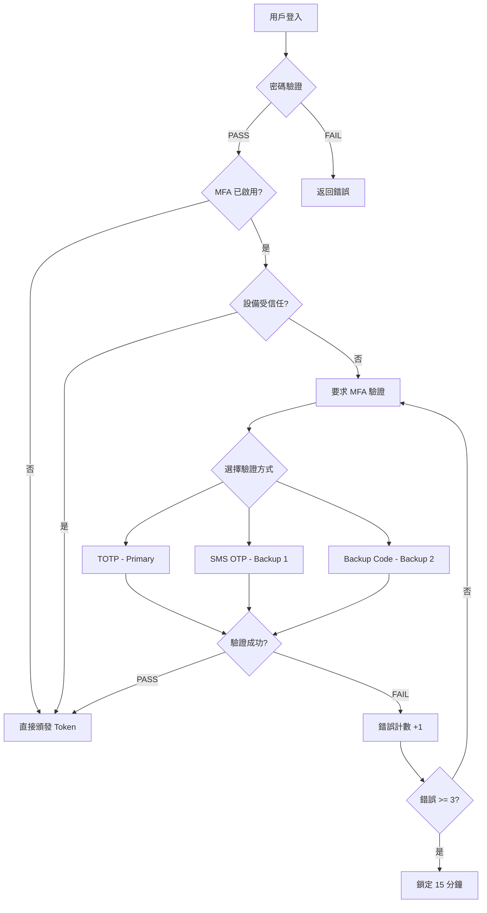

# 06-06 後台用戶 MFA 實施方案

**Document Metadata**:
- Version: 2.0.0
- Created: 2026-02-05
- Last Updated: 2026-02-07
- Status: Production Ready
- Priority: P1 (High)
- Owner: Security Team + Product Team
- Related: [09-12 Multi-Actor Token Security](../09_Technical_Infrastructure/09-12_Multi_Actor_Token_Security.md)

---

## 概述

本文檔為 SmartAdmin iGaming 平台的**多因素認證（MFA）實施方案**總覽，詳細內容已拆分為以下子文檔：

| 文檔 | 內容 | 狀態 |
|------|------|------|
| [06-06-01 MFA 架構設計](./06-06-01_MFA_Architecture.md) | 業務需求、風險分析、合規要求、MFA 方法選擇 | Production |
| [06-06-02 TOTP 與 WebAuthn 實作](./06-06-02_TOTP_WebAuthn.md) | RFC 6238 算法、密鑰管理、時間同步處理 | Production |
| [06-06-03 登入與恢復流程](./06-06-03_Recovery_Flow.md) | 兩階段認證、信任設備、MFA 註冊流程 | Production |
| [06-06-04 合規與審計](./06-06-04_Compliance_Audit.md) | 備份碼、設備恢復、角色策略、審計日誌 | Production |

---

## 快速參考

### MFA 方法優先級

| 優先級 | 方法 | 使用場景 | 安全級別 |
|-------|------|---------|---------|
| **P0** | TOTP | 日常登入（推薦 90% 用戶使用） | 5/5 |
| **P1** | SMS OTP | 設備丟失 / TOTP 不可用 | 3/5 |
| **P2** | Email OTP | SMS 不可用（國際漫遊） | 3/5 |
| **P3** | Backup Codes | 所有方法都不可用（離線恢復） | 4/5 |

### 角色 MFA 策略

**強制 MFA 角色**（5 類）：
- Super Admin
- Finance Manager
- Risk Control
- Database Admin
- DevOps

**可選 MFA 角色**（3 類）：
- Customer Service（推薦啟用）
- Marketing（建議啟用）
- Content Editor（可不啟用）

### 關鍵 API 端點

| 端點 | 方法 | 說明 |
|------|------|------|
| `/admin/auth/login` | POST | 密碼登入（Phase 1） |
| `/admin/auth/mfa/verify` | POST | MFA 驗證（Phase 2） |
| `/admin/mfa/setup/init` | POST | 初始化 MFA 設置 |
| `/admin/mfa/setup/verify` | POST | 驗證並激活 MFA |
| `/admin/mfa/backup-codes/status` | GET | 查看備份碼狀態 |
| `/admin/mfa/backup-codes/regenerate` | POST | 重新生成備份碼 |

### 審計事件類型

| 事件類型 | 級別 | 說明 |
|---------|------|------|
| `MFA_SETUP_INIT` | INFO | 用戶開始設置 MFA |
| `MFA_ENABLED` | INFO | MFA 激活成功 |
| `MFA_DISABLED` | CRITICAL | MFA 被禁用 |
| `MFA_LOGIN_SUCCESS` | INFO | MFA 驗證成功 |
| `MFA_LOGIN_FAILED` | WARNING | TOTP 驗證失敗 |
| `MFA_LOCKED` | CRITICAL | 帳號鎖定 |
| `BACKUP_CODE_USED` | WARNING | 使用備份碼登入 |
| `MFA_FORCE_RESET` | CRITICAL | 強制重置 MFA |

---

## 架構總覽

---

## 實施路線圖

| Phase | 時間 | 目標 | 狀態 |
|-------|------|------|------|
| **Phase 1** | Week 1-2 | 核心 TOTP 功能 | Planned |
| **Phase 2** | Week 3 | 備份與恢復機制 | Planned |
| **Phase 3** | Week 4 | 高級安全特性 | Planned |

---

## 合規要求摘要

| 監管機構 | 標準 | MFA 要求 |
|---------|------|---------|
| **MGA（Malta）** | MGA/B2C/183/2010 | 強制（高權限帳號） |
| **UKGC（UK）** | LCCP 10.1.1 | 推薦 |
| **GDPR（EU）** | Art. 32 | 要求適當技術措施 |
| **PCI DSS 4.0** | Requirement 8.3.1 | 強制（所有管理員） |

---

## 子文檔導航

### [06-06-01 MFA 架構設計](./06-06-01_MFA_Architecture.md)

**內容**：
- 1. 業務需求
  - 1.1 為什麼後台用戶需要 MFA
  - 1.2 風險分析（STRIDE + CVSS）
  - 1.3 合規要求
- 2. MFA 方法選擇
  - 2.1 方法對比（TOTP / SMS / Email / YubiKey）
  - 2.2 Ultrathink 分析：為什麼選擇 TOTP
  - 2.3 最終選擇：三層架構

### [06-06-02 TOTP 與 WebAuthn 實作](./06-06-02_TOTP_WebAuthn.md)

**內容**：
- 3. TOTP 實施原理
  - 3.1 RFC 6238 算法（HMAC-SHA1）
  - 3.2 密鑰生成與共享（QR Code + AES-256-GCM）
  - 3.3 時間同步處理（±1 窗口）

### [06-06-03 登入與恢復流程](./06-06-03_Recovery_Flow.md)

**內容**：
- 4. 登入流程設計
  - 4.1 兩階段認證流程
  - 4.2 信任設備機制（30 天）
  - 4.3 錯誤處理
- 5. MFA 註冊流程
  - 5.1 首次註冊
  - 5.2 QR Code 生成（ZXing）
  - 5.3 驗證與激活

### [06-06-04 合規與審計](./06-06-04_Compliance_Audit.md)

**內容**：
- 6. 備份方案設計
  - 6.1 Backup Codes（10 個一次性備份碼）
  - 6.2 設備丟失恢復流程
  - 6.3 緊急聯繫人驗證
- 7. 角色級別 MFA 策略
  - 7.1 強制 MFA 角色
  - 7.2 可選 MFA 角色
  - 7.3 Ultrathink 分析：差異化策略
- 8. 審計日誌設計
  - 8.1 關鍵事件記錄
  - 8.2 異常行為檢測
- 9. 實施路線圖
- 10. 附錄（FAQ + 測試用例）

---

## 技術總結

本 MFA 實施方案提供：

- **TOTP（Google Authenticator）** 作為主要認證方法
- **SMS OTP** 作為備用方案
- **10 個備份碼** 用於緊急恢復
- **設備信任機制**（30 天跳過 MFA）
- **角色級別 MFA 策略**（高風險強制 + 低風險可選）
- **審計日誌與異常行為檢測**
- **符合 PCI DSS、GDPR、MGA 合規要求**

---

**End of Index Document**
