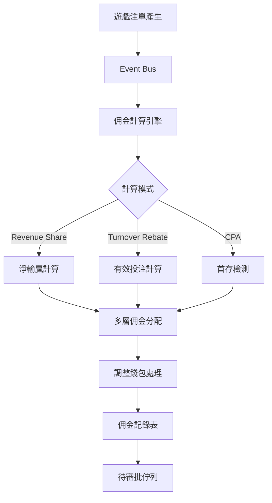

# 03-04 代理系統 (Agent System)

## 1. 系統概述
代理系統 (Affiliate/Agent System) 是 iGaming 平台獲客的核心。
本系統支援 **無限層級 (Unlimited Levels)** 的代理模式，以及基於 **商戶 (Tenant)** 的獨立代理體系。

## 2. 核心功能需求

### 2.1 代理層級與關係 (Hierarchy)
- **綁定關係**：
  - 透過推廣連結 (Referral Link) 或邀請碼 (Code) 綁定玩家。
  - 綁定關係永久有效，或設定 "保護期" (如 30 天)。
- **層級結構**：
  - 總代 (Master Agent) -> 一級代理 -> 二級代理 -> ... -> 會員。
  - 支援 **佔成 (Credit/Position Taking)** 與 **單純佣金 (Commission)** 兩種模式。

### 2.2 佣金計算 (Commission Calculation)
- **佣金計畫 (Commission Plan)**：
  - **輸贏分潤 (Revenue Share)**：基於淨輸贏 (Net Win = Bet - Win - Bonus - Fee)。
    - 例：淨輸贏 < 10萬 (30%)、10萬~50萬 (40%)、> 50萬 (50%)。
  - **流水佣金 (Turnover Rebate)**：基於有效投注額 (Valid Bet)。
    - 例：百家樂流水 0.8%、老虎機流水 1.0%。
  - **CPA (Cost Per Acquisition)**：每帶來一個首存 ($50+) 的活躍會員，獎勵 $100。
- **結算週期**：
  - 日結 (每日 02:00)
  - 週結 (每週一)
  - 月結 (每月 1 號)

### 2.3 調整錢包與遲結算 (Adjustment Wallet)
解決 "跨週期注單" 或 "歷史帳務修正" 的問題。
- **原則**：已結算 (Settled) 的歷史報表 **不可修改** (Immutable)。
- **機制**：
  - 若 1月 的注單在 2/5 發生 Rollback。
  - 系統 **不修改** 1月報表。
  - 系統在 2月 報表中新增一筆 `Type=ADJUSTMENT` 的負數金額。
- **公式**：
  `本期應付 = 本期產生佣金 + 上期結轉餘額 (Carried Over) + 人工/系統調整項`


### 2.3 代理後台 (Agent Portal)
- **獨立登入入口**，與玩家前台分離。
- **儀表板 (Dashboard)**：顯示今日新增會員、今日佣金、活躍人數。
- **推廣工具**：生成推廣連結、下載 Banner 素材。
- **報表**：下級會員報表、輸贏報表。

## 3. 業務規則與審批
- **佣金發放**：
  - 系統自動計算佣金報表 (Pending)。
  - **審批流程**：財務人員複核佣金數據 (排除套利與異常) -> 主管批准 -> 發放至代理錢包。
- **負盈利結轉 (Negative Carryover)**：
  - **定義**：當月 `Net Win` 為負 (玩家大贏)，導致代理佣金為負數時，該負值需結轉至下月扣除。
  - **公式**：
    `Carryover_Next = Min(0, Current_Commission + Carryover_Prev)`
  - **歸零機制 (Reset Rules)**：
    - **Threshold Reset**: 若負值 < -$1,000,000 (視配置)，平台吸收 50% 以避免代理流失。
    - **Time Reset**: 每年 1/1 自動歸零 (可選，通常用於激勵新年度推廣)。
    - **Active Activity**: 若代理連續 3 個月無新增活躍玩家，停止歸零福利。

## 4. 風控
- **同 IP 偵測**：代理與其下線玩家使用相同 IP，標記為異常 (可能是代理自己刷佣金)。

---

## 5. 技術架構設計

### 5.1 代理層級樹存儲方案

代理層級樹的存儲方案有兩種主流選擇：

**方案對比**：

| 方案 | 優點 | 缺點 | 適用場景 |
|------|------|------|----------|
| **Nested Set (嵌套集)** | 查詢下線樹效率高（單次查詢）| 插入/移動節點成本高 | 讀多寫少 |
| **Closure Table (閉包表)** | 插入/移動靈活 | 存儲空間大 | 寫操作頻繁 |

**推薦方案**: **Closure Table** + **Path 冗餘字段**

**理由**：
- 代理層級變動頻繁（新代理加入、轉移上級）
- Closure Table 支持快速插入和路徑查詢
- Path 字段 (`/1/5/12/`) 提供快速層級判斷

### 5.2 佣金計算引擎架構



**架構特點**：
- **Event-Driven**: 注單事件觸發佣金計算
- **Batch Processing**: 每日 02:00 批次結算
- **Adjustment Ledger**: 調整項獨立記錄，不修改歷史報表

### 5.3 調整錢包實現 (Adjustment Ledger)

**設計原則**：
- 歷史報表不可變 (Immutable)
- 調整項作為獨立交易記錄
- 支持人工調整和系統自動調整

**調整場景**：
1. **遲到注單** (Late Arrival): 上期注單在本期才結算
2. **注單回滾** (Rollback): 遊戲廠商撤銷注單
3. **人工調整** (Manual Adjustment): 財務糾正錯誤

---

## 6. 數據庫 Schema 設計

### 6.1 affiliate_agent 表（代理主表）

```sql
CREATE TABLE affiliate_agent (
    agent_id BIGINT PRIMARY KEY AUTO_INCREMENT,
    tenant_id VARCHAR(32) NOT NULL,                  -- 租戶ID
    username VARCHAR(50) NOT NULL,                   -- 代理帳號
    parent_agent_id BIGINT,                          -- 上級代理ID
    hierarchy_path VARCHAR(500),                     -- 層級路徑 /1/5/12/
    agent_level INT NOT NULL DEFAULT 1,              -- 代理等級
    commission_plan_id BIGINT,                       -- 佣金計畫ID
    total_players INT DEFAULT 0,                     -- 總下線玩家數
    active_players INT DEFAULT 0,                    -- 活躍玩家數
    total_commission DECIMAL(15,2) DEFAULT 0.00,     -- 累計佣金
    status VARCHAR(20) DEFAULT 'ACTIVE',             -- ACTIVE/LOCKED/CLOSED
    created_at TIMESTAMP DEFAULT CURRENT_TIMESTAMP,
    updated_at TIMESTAMP DEFAULT CURRENT_TIMESTAMP ON UPDATE CURRENT_TIMESTAMP,

    INDEX idx_tenant_username (tenant_id, username),
    INDEX idx_parent_agent (parent_agent_id),
    INDEX idx_hierarchy_path (hierarchy_path(200)),  -- 前綴索引
    UNIQUE KEY uk_tenant_username (tenant_id, username)
) ENGINE=InnoDB DEFAULT CHARSET=utf8mb4;
```

### 6.2 affiliate_hierarchy 表（層級關係表 - Closure Table）

```sql
CREATE TABLE affiliate_hierarchy (
    id BIGINT PRIMARY KEY AUTO_INCREMENT,
    tenant_id VARCHAR(32) NOT NULL,
    ancestor_id BIGINT NOT NULL,                     -- 祖先代理ID
    descendant_id BIGINT NOT NULL,                   -- 後代代理ID
    depth INT NOT NULL,                              -- 層級深度 (0=自己)

    INDEX idx_ancestor (ancestor_id, depth),
    INDEX idx_descendant (descendant_id),
    UNIQUE KEY uk_ancestor_descendant (ancestor_id, descendant_id)
) ENGINE=InnoDB DEFAULT CHARSET=utf8mb4;
```

### 6.3 affiliate_commission_plan 表（佣金計畫配置）

```sql
CREATE TABLE affiliate_commission_plan (
    plan_id BIGINT PRIMARY KEY AUTO_INCREMENT,
    tenant_id VARCHAR(32) NOT NULL,
    plan_name VARCHAR(100) NOT NULL,                 -- 計畫名稱
    plan_type VARCHAR(20) NOT NULL,                  -- REVENUE_SHARE/TURNOVER/CPA
    tiers JSON,                                      -- 階梯配置 (JSON格式)
    settlement_period VARCHAR(20),                   -- DAILY/WEEKLY/MONTHLY
    negative_carryover BOOLEAN DEFAULT TRUE,         -- 是否支持負盈利結轉
    reset_threshold DECIMAL(15,2),                   -- 歸零閾值
    status VARCHAR(20) DEFAULT 'ACTIVE',
    created_at TIMESTAMP DEFAULT CURRENT_TIMESTAMP,

    INDEX idx_tenant (tenant_id)
) ENGINE=InnoDB DEFAULT CHARSET=utf8mb4;

-- tiers JSON 範例：
-- [
--   {"min": 0, "max": 100000, "rate": 0.30},
--   {"min": 100000, "max": 500000, "rate": 0.40},
--   {"min": 500000, "max": null, "rate": 0.50}
-- ]
```

### 6.4 affiliate_commission_record 表（佣金記錄）

```sql
CREATE TABLE affiliate_commission_record (
    record_id BIGINT PRIMARY KEY AUTO_INCREMENT,
    tenant_id VARCHAR(32) NOT NULL,
    agent_id BIGINT NOT NULL,
    settlement_date DATE NOT NULL,                   -- 結算日期
    plan_type VARCHAR(20) NOT NULL,                  -- 佣金類型
    gross_amount DECIMAL(15,2) NOT NULL,             -- 毛佣金
    adjustment_amount DECIMAL(15,2) DEFAULT 0.00,    -- 調整金額
    carryover_amount DECIMAL(15,2) DEFAULT 0.00,     -- 結轉金額
    net_amount DECIMAL(15,2) NOT NULL,               -- 淨佣金
    status VARCHAR(20) DEFAULT 'PENDING',            -- PENDING/APPROVED/PAID
    approved_by BIGINT,                              -- 審批人ID
    approved_at TIMESTAMP,
    created_at TIMESTAMP DEFAULT CURRENT_TIMESTAMP,

    INDEX idx_agent_settlement (agent_id, settlement_date),
    INDEX idx_status (status),
    UNIQUE KEY uk_agent_settlement_type (agent_id, settlement_date, plan_type)
) ENGINE=InnoDB DEFAULT CHARSET=utf8mb4;
```

### 6.5 affiliate_adjustment 表（調整項）

```sql
CREATE TABLE affiliate_adjustment (
    adjustment_id BIGINT PRIMARY KEY AUTO_INCREMENT,
    tenant_id VARCHAR(32) NOT NULL,
    agent_id BIGINT NOT NULL,
    adjustment_type VARCHAR(20) NOT NULL,            -- LATE_ARRIVAL/ROLLBACK/MANUAL
    amount DECIMAL(15,2) NOT NULL,                   -- 調整金額（可為負）
    original_settlement_date DATE,                   -- 原始結算日期
    target_settlement_date DATE NOT NULL,            -- 目標結算日期
    reason TEXT,                                     -- 調整原因
    created_by BIGINT,                               -- 創建人ID
    created_at TIMESTAMP DEFAULT CURRENT_TIMESTAMP,

    INDEX idx_agent_target_date (agent_id, target_settlement_date)
) ENGINE=InnoDB DEFAULT CHARSET=utf8mb4;
```

### 6.6 索引設計說明

**關鍵索引**：
1. **player_id 索引**: 快速查詢玩家所屬代理
2. **agent_id + settlement_date 索引**: 佣金記錄查詢
3. **hierarchy_path 前綴索引**: 支持層級路徑查詢
4. **ancestor_id + depth 索引**: Closure Table 快速查詢下線樹

**SQL 查詢範例 - 查詢代理下線樹**：

```sql
-- 查詢 agent_id=10 的所有下線代理（包含自己）
SELECT a.*
FROM affiliate_agent a
INNER JOIN affiliate_hierarchy h
    ON h.descendant_id = a.agent_id
WHERE h.ancestor_id = 10
    AND h.tenant_id = 'tenant_001'
ORDER BY h.depth, a.agent_id;
```

**SQL 查詢範例 - 計算佣金**：

```sql
-- 計算單個代理的月度佣金（Revenue Share 模式）
SELECT
    agent_id,
    SUM(CASE
        WHEN net_win BETWEEN 0 AND 100000 THEN net_win * 0.30
        WHEN net_win BETWEEN 100000 AND 500000 THEN 100000 * 0.30 + (net_win - 100000) * 0.40
        WHEN net_win > 500000 THEN 100000 * 0.30 + 400000 * 0.40 + (net_win - 500000) * 0.50
        ELSE 0
    END) AS total_commission
FROM (
    SELECT
        ag.agent_id,
        SUM(b.bet_amount - b.win_amount) AS net_win
    FROM affiliate_agent ag
    INNER JOIN player p ON p.referrer_agent_id = ag.agent_id
    INNER JOIN bet_record b ON b.player_id = p.player_id
    WHERE ag.agent_id = 10
        AND b.settlement_date BETWEEN '2026-02-01' AND '2026-02-28'
        AND b.status = 'SETTLED'
    GROUP BY ag.agent_id
) sub
GROUP BY agent_id;
```

---

## 7. API 設計與整合

### 7.1 推廣連結生成 API

**Endpoint**: `POST /api/affiliate/referral-link`

**Request**:
```json
{
  "agentId": 12345,
  "campaign": "spring_promotion",
  "expiresIn": 7776000  // 90天（秒）
}
```

**Response**:
```json
{
  "code": "00000",
  "message": "success",
  "data": {
    "referralLink": "https://example.com/register?ref=ABC123XYZ",
    "referralCode": "ABC123XYZ",
    "qrCodeUrl": "https://cdn.example.com/qr/ABC123XYZ.png",
    "expiresAt": "2026-05-05T00:00:00Z"
  }
}
```

### 7.2 代理綁定驗證 API

**Endpoint**: `POST /api/affiliate/bind-player`

**Request**:
```json
{
  "playerId": 56789,
  "referralCode": "ABC123XYZ"
}
```

**Response**:
```json
{
  "code": "00000",
  "message": "success",
  "data": {
    "agentId": 12345,
    "bindingStatus": "SUCCESS",
    "protectionPeriod": 30  // 保護期天數
  }
}
```

### 7.3 佣金查詢 API

**Endpoint**: `GET /api/affiliate/commission/history`

**Query Parameters**:
- `agentId`: 代理ID
- `startDate`: 開始日期
- `endDate`: 結束日期
- `page`: 頁碼
- `pageSize`: 每頁數量

**Response**:
```json
{
  "code": "00000",
  "message": "success",
  "data": {
    "list": [
      {
        "recordId": 100001,
        "settlementDate": "2026-02-01",
        "planType": "REVENUE_SHARE",
        "grossAmount": 5000.00,
        "adjustmentAmount": -200.00,
        "carryoverAmount": -500.00,
        "netAmount": 4300.00,
        "status": "APPROVED"
      }
    ],
    "total": 50,
    "page": 1,
    "pageSize": 20
  }
}
```

### 7.4 調整項管理 API

**Endpoint**: `POST /api/affiliate/adjustment`

**Request**:
```json
{
  "agentId": 12345,
  "adjustmentType": "MANUAL",
  "amount": 500.00,
  "targetSettlementDate": "2026-02-28",
  "reason": "補發上月遺漏佣金"
}
```

**Response**:
```json
{
  "code": "00000",
  "message": "success",
  "data": {
    "adjustmentId": 20001,
    "status": "PENDING_APPROVAL"
  }
}
```

---

## 8. SmartAdmin 架構映射

### 8.1 AffiliateEntity (Entity 層)

```java
package net.lab1024.sa.affiliate.domain.entity;

import com.baomidou.mybatisplus.annotation.IdType;
import com.baomidou.mybatisplus.annotation.TableId;
import com.baomidou.mybatisplus.annotation.TableName;
import lombok.Data;
import java.math.BigDecimal;
import java.time.LocalDateTime;

/**
 * 代理實體
 *
 * @author SmartAdmin Team
 * @since 2026-02-04
 */
@Data
@TableName("affiliate_agent")
public class AffiliateEntity {

    @TableId(type = IdType.AUTO)
    private Long agentId;

    /**
     * 租戶ID（多租戶隔離）
     */
    private String tenantId;

    /**
     * 代理帳號
     */
    private String username;

    /**
     * 上級代理ID
     */
    private Long parentAgentId;

    /**
     * 層級路徑（Closure Table 冗餘字段）
     * 格式：/1/5/12/
     * 用途：快速判斷層級關係
     */
    private String hierarchyPath;

    /**
     * 代理等級（1=總代, 2=一級代理, ...）
     */
    private Integer agentLevel;

    /**
     * 佣金計畫ID
     */
    private Long commissionPlanId;

    /**
     * 總下線玩家數
     */
    private Integer totalPlayers;

    /**
     * 活躍玩家數（近30天有投注）
     */
    private Integer activePlayers;

    /**
     * 累計佣金
     */
    private BigDecimal totalCommission;

    /**
     * 狀態（ACTIVE, LOCKED, CLOSED）
     */
    private String status;

    private LocalDateTime createdAt;

    private LocalDateTime updatedAt;
}
```

### 8.2 AffiliateCommissionManager (Manager 層)

```java
package net.lab1024.sa.affiliate.manager;

import lombok.RequiredArgsConstructor;
import lombok.extern.slf4j.Slf4j;
import net.lab1024.sa.affiliate.domain.entity.AffiliateCommissionRecord;
import net.lab1024.sa.affiliate.dao.AffiliateCommissionRecordDao;
import org.springframework.stereotype.Service;
import org.springframework.transaction.annotation.Transactional;

import java.math.BigDecimal;
import java.time.LocalDate;
import java.util.List;

/**
 * 代理佣金 Manager 層
 *
 * 職責：
 * 1. 佣金計算與發放（需要事務）
 * 2. 多表操作（commission_record + adjustment）
 * 3. 負盈利結轉邏輯
 *
 * @author SmartAdmin Team
 * @since 2026-02-04
 */
@Slf4j
@Service
@RequiredArgsConstructor
public class AffiliateCommissionManager {

    private final AffiliateCommissionRecordDao commissionRecordDao;

    /**
     * 計算並發放佣金（事務保證）
     *
     * @param agentId 代理ID
     * @param settlementDate 結算日期
     * @return 佣金記錄ID
     */
    @Transactional(rollbackFor = Throwable.class)
    public Long calculateAndIssueCommission(Long agentId, LocalDate settlementDate) {
        log.info("開始計算代理 {} 的 {} 佣金", agentId, settlementDate);

        // 1. 查詢上期結轉金額
        BigDecimal carryoverAmount = commissionRecordDao.getCarryoverAmount(agentId, settlementDate.minusMonths(1));

        // 2. 計算本期毛佣金（從 bet_record 表聚合）
        BigDecimal grossAmount = commissionRecordDao.calculateGrossCommission(agentId, settlementDate);

        // 3. 查詢本期調整項（從 affiliate_adjustment 表）
        BigDecimal adjustmentAmount = commissionRecordDao.getAdjustmentAmount(agentId, settlementDate);

        // 4. 計算淨佣金
        BigDecimal netAmount = grossAmount.add(carryoverAmount).add(adjustmentAmount);

        // 5. 負盈利結轉邏輯
        BigDecimal nextCarryover = BigDecimal.ZERO;
        if (netAmount.compareTo(BigDecimal.ZERO) < 0) {
            nextCarryover = netAmount;  // 負值結轉至下期
            netAmount = BigDecimal.ZERO;  // 本期不發放
            log.warn("代理 {} 本期佣金為負 {}，結轉至下期", agentId, nextCarryover);
        }

        // 6. 插入佣金記錄
        AffiliateCommissionRecord record = new AffiliateCommissionRecord();
        record.setAgentId(agentId);
        record.setSettlementDate(settlementDate);
        record.setPlanType("REVENUE_SHARE");
        record.setGrossAmount(grossAmount);
        record.setAdjustmentAmount(adjustmentAmount);
        record.setCarryoverAmount(carryoverAmount);
        record.setNetAmount(netAmount);
        record.setStatus("PENDING");  // 待審批

        commissionRecordDao.insert(record);

        log.info("代理 {} 佣金計算完成，recordId={}", agentId, record.getRecordId());
        return record.getRecordId();
    }

    /**
     * 審批佣金發放
     *
     * @param recordId 佣金記錄ID
     * @param approvedBy 審批人ID
     */
    @Transactional(rollbackFor = Throwable.class)
    public void approveCommission(Long recordId, Long approvedBy) {
        AffiliateCommissionRecord record = commissionRecordDao.selectById(recordId);

        if (record == null) {
            throw new IllegalArgumentException("佣金記錄不存在：" + recordId);
        }

        if (!"PENDING".equals(record.getStatus())) {
            throw new IllegalStateException("佣金記錄狀態異常：" + record.getStatus());
        }

        // 更新狀態為已審批
        record.setStatus("APPROVED");
        record.setApprovedBy(approvedBy);
        record.setApprovedAt(LocalDateTime.now());

        commissionRecordDao.updateById(record);

        // TODO: 發放至代理錢包（調用 WalletManager）

        log.info("佣金記錄 {} 已審批，審批人={}", recordId, approvedBy);
    }
}
```

### 8.3 AffiliateService (Service 層)

```java
package net.lab1024.sa.affiliate.service;

import io.vavr.control.Option;
import lombok.RequiredArgsConstructor;
import lombok.extern.slf4j.Slf4j;
import net.lab1024.sa.affiliate.domain.entity.AffiliateEntity;
import net.lab1024.sa.affiliate.dao.AffiliateDao;
import net.lab1024.sa.affiliate.manager.AffiliateCommissionManager;
import org.springframework.stereotype.Service;

import java.time.LocalDate;
import java.util.List;

/**
 * 代理 Service 層
 *
 * 職責：
 * 1. 單表查詢（直接調用 Dao）
 * 2. 業務邏輯封裝（不需要事務）
 * 3. 返回 Vavr Option（SmartAdmin 規範）
 *
 * @author SmartAdmin Team
 * @since 2026-02-04
 */
@Slf4j
@Service
@RequiredArgsConstructor
public class AffiliateService {

    private final AffiliateDao affiliateDao;
    private final AffiliateCommissionManager commissionManager;

    /**
     * 根據 agentId 查詢代理信息
     *
     * @param agentId 代理ID
     * @return Option<AffiliateEntity>
     */
    public Option<AffiliateEntity> getAgentById(Long agentId) {
        AffiliateEntity agent = affiliateDao.selectById(agentId);
        return Option.of(agent);
    }

    /**
     * 查詢代理下線樹
     *
     * @param agentId 代理ID
     * @return 下線代理列表（包含自己）
     */
    public List<AffiliateEntity> getDownlineTree(Long agentId) {
        return affiliateDao.selectDownlineTree(agentId);
    }

    /**
     * 計算代理佣金（委託給 Manager 層）
     *
     * @param agentId 代理ID
     * @param settlementDate 結算日期
     * @return 佣金記錄ID
     */
    public Long calculateCommission(Long agentId, LocalDate settlementDate) {
        return commissionManager.calculateAndIssueCommission(agentId, settlementDate);
    }
}
```

### 8.4 Java 代碼範例 - 層級樹查詢

```java
package net.lab1024.sa.affiliate.dao;

import com.baomidou.mybatisplus.core.mapper.BaseMapper;
import net.lab1024.sa.affiliate.domain.entity.AffiliateEntity;
import org.apache.ibatis.annotations.Mapper;
import org.apache.ibatis.annotations.Select;

import java.util.List;

/**
 * 代理 Dao
 *
 * @author SmartAdmin Team
 * @since 2026-02-04
 */
@Mapper
public interface AffiliateDao extends BaseMapper<AffiliateEntity> {

    /**
     * 查詢代理下線樹（使用 Closure Table）
     *
     * SQL 邏輯：
     * 1. 從 affiliate_hierarchy 表查詢所有後代關係
     * 2. JOIN affiliate_agent 表獲取代理詳細信息
     * 3. 按層級深度排序
     *
     * @param ancestorId 祖先代理ID
     * @return 下線代理列表
     */
    @Select("""
        SELECT a.*
        FROM affiliate_agent a
        INNER JOIN affiliate_hierarchy h
            ON h.descendant_id = a.agent_id
        WHERE h.ancestor_id = #{ancestorId}
        ORDER BY h.depth, a.agent_id
        """)
    List<AffiliateEntity> selectDownlineTree(Long ancestorId);
}
```

### 8.5 Java 代碼範例 - 負盈利結轉

```java
/**
 * 負盈利結轉公式實現
 *
 * 公式：Carryover_Next = Min(0, Current_Commission + Carryover_Prev)
 *
 * 範例：
 * - 上期結轉：-$10,000
 * - 本期佣金：+$8,000
 * - 本期淨額：-$2,000 → 結轉至下期
 */
public BigDecimal calculateCarryover(BigDecimal currentCommission, BigDecimal previousCarryover) {
    BigDecimal netAmount = currentCommission.add(previousCarryover);

    // 若淨額為負，結轉至下期；若為正，不結轉
    return netAmount.compareTo(BigDecimal.ZERO) < 0 ? netAmount : BigDecimal.ZERO;
}
```

---

## 9. 監控與告警

### 9.1 佣金計算異常監控

**監控指標**：
- **計算時間 > 5 分鐘**: 代理數量過多或 SQL 查詢慢
- **佣金金額異常**: 單個代理佣金 > $100,000（可能是刷量）

**告警規則**：
```yaml
# Prometheus 告警規則
groups:
  - name: affiliate_commission
    rules:
      - alert: CommissionCalculationSlow
        expr: affiliate_commission_calculation_duration_seconds > 300
        for: 5m
        labels:
          severity: warning
        annotations:
          summary: "佣金計算超時"
          description: "代理 {{ $labels.agent_id }} 佣金計算耗時 {{ $value }} 秒"

      - alert: CommissionAmountAnomaly
        expr: affiliate_commission_amount > 100000
        labels:
          severity: critical
        annotations:
          summary: "佣金金額異常"
          description: "代理 {{ $labels.agent_id }} 佣金金額 {{ $value }} 超過閾值"
```

### 9.2 負盈利結轉告警

**監控指標**：
- **單代理負值 > $100K**: 需人工審核，可能觸發歸零機制
- **連續 3 個月負盈利**: 代理下線玩家全贏，異常

**告警通知**：
- Email：財務團隊
- Telegram：運營團隊

### 9.3 同 IP 異常檢測告警

**監控邏輯**：
```sql
-- 檢測代理與下線玩家使用相同 IP
SELECT
    ag.agent_id,
    ag.username AS agent_username,
    p.player_id,
    p.username AS player_username,
    p.last_login_ip
FROM affiliate_agent ag
INNER JOIN player p ON p.referrer_agent_id = ag.agent_id
WHERE p.last_login_ip = (
    SELECT last_login_ip
    FROM admin_user
    WHERE user_id = ag.agent_id
)
  AND ag.status = 'ACTIVE';
```

**告警規則**：
- 發現同 IP 立即鎖定代理帳戶
- 發送告警給風控團隊

### 9.4 Grafana 儀表板設計

**儀表板面板**：

1. **佣金總覽**：
   - 今日佣金總額（折線圖）
   - 待審批佣金數量（數字面板）
   - 已發放佣金總額（累計）

2. **代理排行**：
   - Top 10 代理（按佣金排序）
   - 新增代理趨勢（柱狀圖）

3. **異常監控**：
   - 計算超時次數（折線圖）
   - 負盈利結轉金額（柱狀圖）
   - 同 IP 檢測告警（表格）

**Grafana Query 範例**：
```promql
# 查詢今日佣金總額
sum(affiliate_commission_amount{status="APPROVED"}) by (tenant_id)

# 查詢佣金計算平均時間
avg(affiliate_commission_calculation_duration_seconds) by (agent_id)
```

---

**文檔版本**: 4.0.0
**最後更新**: 2026-02-04
**維護團隊**: Product Team & Backend Team

---

## 📚 相關文檔

### 核心依賴
- [06-02 信用網絡邏輯](./07-02_Credit_Network_Logic.md) - 代理信用體系
- [07-01 租戶層級架構](../06_Platform_Governance/06-01_Multi_Tenant.md) - 多租戶模型

### 業務整合
- [05-01 風控系統](../05_Risk_Control/05-01_Risk_Framework.md) - 代理風控

### 技術參考
- [SmartAdmin 架構規則](../../.agent/rules/foundation/F04-architecture-rules.md) - Manager 層事務規範
- [SmartAdmin 設計模式](../../.claude/shared/knowledge/smartadmin-patterns.md) - Vavr Option 使用
