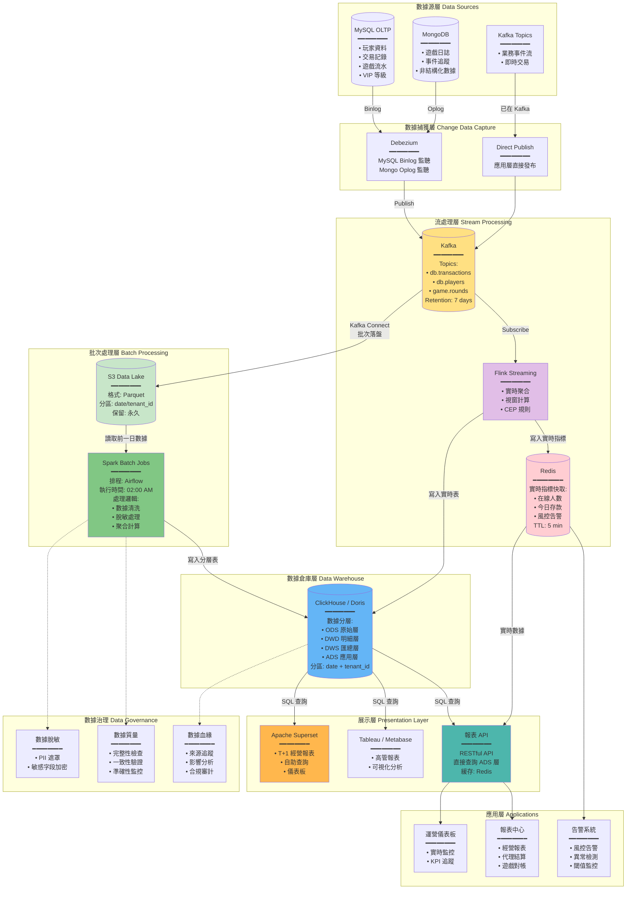

# 07-04 數據管道與 BI 架構 (Data Pipeline & BI Architecture)

## 1. 系統概述
為解決傳統 OLTP 資料庫在處理報表查詢時的效能瓶頸，本模組定義了 **OLAP (Online Analytical Processing)** 的數據流架構。
目標是支撐 **T+1 經營報表** 與 **準實時 (Near Real-time) 風控儀表板**。

## 2. 核心架構 (Data Flow)

### 2.0 完整數據管線架構圖 (Complete Data Pipeline Architecture)

**概述**：採用 Lambda 架構變體，同時支援批次處理 (Batch) 與流處理 (Streaming)，滿足 T+1 報表與準實時儀表板需求。



**架構特點說明**：

| 架構特點 | 說明 | 技術選型 | 適用場景 |
|---------|------|---------|---------|
| **Lambda 架構變體** | 批次層 (Batch Layer) + 速度層 (Speed Layer) 並行處理 | Spark (批次) + Flink (流) | T+1 報表 + 實時監控 |
| **數據湖 (Data Lake)** | S3 存儲原始 Parquet 文件，永久保留 | AWS S3 / MinIO | 數據回溯、審計、機器學習 |
| **數據倉庫 (DWH)** | 結構化存儲，支援 OLAP 查詢 | ClickHouse / StarRocks | 快速聚合查詢 (秒級) |
| **實時快取** | Redis 存儲實時指標，減輕 DWH 壓力 | Redis Cluster | 高頻查詢 (在線人數、今日存款) |
| **多租戶隔離** | 邏輯隔離 (tenant_id 分區)，非物理隔離 | ClickHouse Partition | 支援跨租戶平台級報表 |

**數據流路徑對比**：

| 路徑類型 | 延遲 | 數據完整性 | 查詢靈活性 | 成本 | 適用場景 |
|---------|------|-----------|-----------|------|---------|
| **實時路徑<br/>(Hot Path)** | < 5 秒 | 可能有遺漏 | 簡單聚合 | 高 (Redis 內存) | 運營監控、風控告警 |
| **準實時路徑<br/>(Warm Path)** | 5-60 秒 | 較高 | 中等複雜度 | 中 (Flink → ClickHouse) | 實時儀表板、異常檢測 |
| **批次路徑<br/>(Cold Path)** | T+1 (次日) | 100% 完整 | 複雜 Join + 聚合 | 低 (S3 + Spark) | 經營報表、結算對帳 |

**關鍵設計決策**：

1. **為何需要數據湖 (S3)?**
   - **原因**: ClickHouse 刪除數據成本高，S3 作為不可變數據源
   - **好處**: 支援數據回溯、重新計算、機器學習訓練
   - **成本**: S3 Glacier 每 GB 僅 $0.004/月

2. **為何同時使用 Flink 和 Spark?**
   - **Flink**: 流處理引擎，毫秒級延遲，適合實時聚合
   - **Spark**: 批處理引擎，支援複雜 ETL 邏輯，T+1 報表首選
   - **互補**: Flink 處理實時，Spark 處理批次，各司其職

3. **為何 Redis 只存 5 分鐘?**
   - **原因**: Redis 主要用於高頻查詢緩存 (如運營儀表板每 10 秒刷新)
   - **策略**: 超過 5 分鐘的數據從 ClickHouse 查詢
   - **成本**: Redis 內存昂貴 (每 GB $0.15/h)，不適合長期存儲

4. **為何選擇 ClickHouse 而非傳統 MySQL?**
   - **性能**: ClickHouse 列式存儲，聚合查詢快 100-1000x
   - **範例**: 查詢 10 億條記錄的 SUM(amount) → MySQL (30s+)，ClickHouse (< 1s)
   - **限制**: 不支援高頻 UPDATE/DELETE，僅適合 OLAP

5. **為何需要數據脫敏?**
   - **合規**: GDPR、CCPA 要求保護 PII
   - **風險**: 數據倉庫通常有更多人員訪問權限 (BI 分析師、數據科學家)
   - **策略**: 在 DWD 層脫敏，確保下游 (DWS/ADS) 不含原始 PII

**性能基準 (Benchmark)**：

| 操作 | MySQL (OLTP) | ClickHouse (OLAP) | 提升倍數 |
|------|-------------|------------------|---------|
| COUNT(*) - 1 億條 | 30 秒 | 0.5 秒 | 60x |
| SUM(amount) - 1 億條 | 45 秒 | 0.8 秒 | 56x |
| GROUP BY + AVG - 1 億條 | 120 秒 | 2 秒 | 60x |
| 複雜 JOIN (3 表) - 1000 萬條 | 300 秒 | 5 秒 | 60x |
| 寫入 TPS | 10,000 | 100,000+ | 10x |

---

### 2.1 數據分層架構詳解 (Data Layering Architecture)

**概述**：採用經典四層數據倉庫架構，確保數據從原始到應用的漸進式處理與質量提升。

```mermaid
flowchart TD
    subgraph ODS[📦 ODS 層 - Operational Data Store\n原始數據層]
        ODS_DESC[特性:\n━━━━━━━━\n• 與業務庫 1:1 映射\n• 不做任何轉換\n• 保留完整歷史\n• 支援數據回溯\n━━━━━━━━\n更新頻率: 準實時 (CDC)\n保留期限: 永久\n分區策略: date + tenant_id]

        ODS_TABLES[典型表結構\n━━━━━━━━\n• ods_players\n• ods_transactions\n• ods_game_rounds\n• ods_deposits\n• ods_withdrawals\n━━━━━━━━\n命名規則: ods_{table_name}]
    end

    subgraph DWD[🔧 DWD 層 - Data Warehouse Detail\n明細數據層]
        DWD_DESC[特性:\n━━━━━━━━\n• 數據清洗\n• PII 脫敏\n• 字段標準化\n• 維度關聯\n• 業務規則過濾\n━━━━━━━━\n更新頻率: T+1 批次\n保留期限: 2 年\n分區策略: date + tenant_id]

        DWD_PROCESS[處理邏輯\n━━━━━━━━\n1️⃣ 數據清洗:\n  • NULL 處理\n  • 異常值過濾\n  • 重複記錄去重\n2️⃣ 脫敏處理:\n  • phone: 0912***789\n  • email: r***@gmail.com\n  • name: R** C**\n3️⃣ 維度關聯:\n  • JOIN dim_vip_level\n  • JOIN dim_game_category\n4️⃣ 業務過濾:\n  • 排除測試帳號\n  • 排除無效交易]

        DWD_TABLES[典型表結構\n━━━━━━━━\n• dwd_player_profile\n• dwd_transaction_detail\n• dwd_game_round_detail\n• dwd_deposit_detail\n• dwd_withdrawal_detail\n━━━━━━━━\n命名規則: dwd_{domain}_detail]
    end

    subgraph DWS[📊 DWS 層 - Data Warehouse Summary\n匯總數據層]
        DWS_DESC[特性:\n━━━━━━━━\n• 按時間維度聚合\n• 按業務維度聚合\n• 預計算指標\n• 支援鑽取分析\n━━━━━━━━\n更新頻率: T+1 批次\n保留期限: 3 年\n分區策略: date]

        DWS_AGG[聚合維度\n━━━━━━━━\n• 時間維度:\n  - 日 (day)\n  - 週 (week)\n  - 月 (month)\n  - 年 (year)\n• 業務維度:\n  - 租戶 (tenant)\n  - 遊戲類型 (game_type)\n  - VIP 等級 (vip_level)\n  - 國家 (country)\n  - 代理 (agent)]

        DWS_TABLES[典型表結構\n━━━━━━━━\n• dws_daily_revenue\n• dws_daily_player_summary\n• dws_daily_game_summary\n• dws_monthly_tenant_pnl\n• dws_weekly_agent_settlement\n━━━━━━━━\n命名規則: dws_{period}_{domain}_summary]
    end

    subgraph ADS[🎯 ADS 層 - Application Data Service\n應用數據層]
        ADS_DESC[特性:\n━━━━━━━━\n• 面向特定應用\n• 寬表設計\n• 高度優化\n• 直接查詢\n━━━━━━━━\n更新頻率: T+1 批次 或 實時\n保留期限: 6 個月\n索引策略: 優化查詢性能]

        ADS_APPS[應用場景\n━━━━━━━━\n• 運營儀表板:\n  - ads_daily_kpi_dashboard\n• 經營報表:\n  - ads_monthly_financial_report\n• 代理結算:\n  - ads_agent_settlement_report\n• 玩家分析:\n  - ads_player_segmentation\n• 風控監控:\n  - ads_risk_alert_summary]

        ADS_TABLES[典型表結構\n━━━━━━━━\n• ads_daily_kpi (運營 KPI)\n• ads_merchant_revenue (商戶收入)\n• ads_player_ltv (玩家 LTV)\n• ads_game_performance (遊戲表現)\n━━━━━━━━\n命名規則: ads_{application}_{metric}]
    end

    ODS -->|Spark ETL\n數據清洗 + 脫敏| DWD
    DWD -->|Spark SQL\n聚合計算| DWS
    DWS -->|Spark SQL\n寬表構建| ADS

    DWD -.->|某些場景直接聚合| ADS

    subgraph EXAMPLES[典型 ETL 範例]
        EX1[範例 1: 每日收入報表\n━━━━━━━━━━━━━━━━\nODS:\n  SELECT * FROM ods_transactions\n  WHERE date = '2026-01-27'\n↓\nDWD:\n  清洗無效交易 + 脫敏玩家資訊\n  INSERT INTO dwd_transaction_detail\n↓\nDWS:\n  SELECT date, tenant_id,\n    SUM(amount) as total_revenue,\n    COUNT(DISTINCT player_id) as active_players\n  FROM dwd_transaction_detail\n  GROUP BY date, tenant_id\n  INSERT INTO dws_daily_revenue\n↓\nADS:\n  JOIN 維度表 + 計算衍生指標\n  INSERT INTO ads_daily_kpi]

        EX2[範例 2: 玩家 LTV 分析\n━━━━━━━━━━━━━━━━\nDWD:\n  dwd_player_profile (基礎資料)\n  dwd_transaction_detail (交易明細)\n↓\nDWS:\n  按玩家聚合生命週期指標\n  - 首存日期\n  - 累計存款\n  - 累計提款\n  - 遊戲頻率\n↓\nADS:\n  應用 LTV 預測模型\n  分群標籤 (高價值/中價值/低價值)\n  INSERT INTO ads_player_ltv]
    end

    ADS -.-> EXAMPLES

    subgraph QUALITY[數據質量檢查]
        Q1[ODS → DWD 檢查\n━━━━━━━━\n• 記錄數一致性\n• 主鍵重複檢查\n• NULL 值比例\n• 異常值檢測]

        Q2[DWD → DWS 檢查\n━━━━━━━━\n• 聚合結果準確性\n• 分組完整性\n• 時間連續性\n• 維度覆蓋率]

        Q3[DWS → ADS 檢查\n━━━━━━━━\n• 業務邏輯正確性\n• KPI 指標合理性\n• 報表數據一致性\n• 查詢性能達標]
    end

    DWD -.-> Q1
    DWS -.-> Q2
    ADS -.-> Q3

    %% 樣式定義
    style ODS fill:#E3F2FD
    style DWD fill:#FFF9C4
    style DWS fill:#C8E6C9
    style ADS fill:#FFE0B2
    style EXAMPLES fill:#F3E5F5
    style QUALITY fill:#FFCDD2
```

**四層架構對比矩陣**：

| 特性 | ODS | DWD | DWS | ADS |
|------|-----|-----|-----|-----|
| **數據來源** | 業務庫 (MySQL/Mongo) | ODS 層 | DWD 層 | DWS 層 (或 DWD 直接) |
| **數據粒度** | 原始明細 | 清洗後明細 | 聚合匯總 | 應用寬表 |
| **數據量級** | 最大 (TB 級) | 大 (TB 級) | 中 (GB 級) | 小 (GB 級) |
| **更新頻率** | 準實時 (CDC) | T+1 批次 | T+1 批次 | T+1 或 實時 |
| **查詢頻率** | 極低 (僅 ETL) | 低 (偶爾鑽取) | 中 (分析查詢) | 極高 (前端直接查詢) |
| **索引策略** | 分區索引 | 分區 + 部分二級索引 | 分區 + 聚合索引 | 完整索引優化 |
| **保留期限** | 永久 | 2 年 | 3 年 | 6 個月 |
| **脫敏要求** | ❌ 原始數據 | ✅ 完全脫敏 | ✅ 完全脫敏 | ✅ 完全脫敏 |
| **訪問權限** | DBA Only | 數據工程師 | BI 分析師 + 數據科學家 | 所有應用 |
| **典型查詢** | `SELECT * WHERE id = X` | `SELECT * WHERE date BETWEEN ... AND ...` | `SELECT SUM(...) GROUP BY ...` | `SELECT * FROM ads_table WHERE date = TODAY` |

**ETL 流程時間表 (Airflow DAG)**：

```text
02:00 - 02:15  ODS → DWD (數據清洗 + 脫敏)
02:15 - 02:45  DWD → DWS (聚合計算)
02:45 - 03:00  DWS → ADS (寬表構建)
03:00 - 03:05  數據質量檢查
03:05         發送完成通知 + 報表可用
```

**關鍵設計原則**：

1. **漸進式處理 (Progressive Processing)**：
   - **原則**: 每一層只做該層該做的事，不跨層處理
   - **好處**: 職責清晰，故障隔離，易於排查

2. **冪等性保證 (Idempotency)**：
   - **原則**: 所有 ETL 任務支援重複執行，結果一致
   - **實現**: 使用 `INSERT OVERWRITE` 或 `DROP PARTITION` + `INSERT`

3. **分區策略 (Partitioning Strategy)**：
   - **時間分區**: 所有表必須按 `date` 分區
   - **租戶分區**: 多租戶表必須加 `tenant_id` 子分區
   - **好處**: 支援增量更新，避免全表掃描

4. **數據血緣 (Data Lineage)**：
   - **原則**: 每一層數據必須可追溯到上一層
   - **實現**: 在 ETL 日誌中記錄 source_table → target_table 映射
   - **工具**: Apache Atlas / DataHub

5. **質量優先 (Quality First)**：
   - **原則**: 寧可報表延遲，不可數據錯誤
   - **實現**: 每層 ETL 後執行數據質量檢查
   - **閾值**: 若異常率 > 5%，阻斷下游 ETL，觸發告警

**典型 SQL 範例 (ClickHouse)**：


**運營優化建議**：

- **監控 ETL 執行時間**: 每層 ETL 應 < 15 分鐘，總耗時 < 1 小時
- **監控數據延遲**: ADS 層數據應在 03:00 前可用 (SLA: 99.5%)
- **監控數據質量**: 設置自動化質量檢查，異常率閾值 < 5%
- **監控存儲成本**: ODS 層佔 70% 存儲，考慮定期歸檔至 S3 Glacier
- **監控查詢性能**: ADS 層查詢應 < 3 秒 (P95)，否則需優化索引

---

## 3. 報表類型與實現策略

### 3.0 實時 vs 批次處理決策矩陣 (Real-time vs Batch Processing Decision Matrix)

**概述**：根據業務場景的延遲要求、數據完整性需求、查詢複雜度選擇適合的處理模式。

```mermaid
flowchart TD
    START[新增報表需求] --> LATENCY{延遲要求?\n━━━━━━━━}

    LATENCY -->|< 5 秒\n實時監控| REALTIME_PATH[實時處理路徑\nReal-time Path]
    LATENCY -->|5 秒 - 1 分鐘\n準實時| NEAR_REALTIME_PATH[準實時路徑\nNear Real-time Path]
    LATENCY -->|> 1 分鐘\n可接受 T+1| BATCH_PATH[批次處理路徑\nBatch Path]

    REALTIME_PATH --> RT_COMPLEX{查詢複雜度?}
    RT_COMPLEX -->|簡單聚合\nSUM/COUNT/AVG| RT_REDIS[方案 A: Redis\n━━━━━━━━\n技術棧:\n• Redis Counter/Hash\n• Lua Script 原子操作\n• TTL: 5 min\n━━━━━━━━\n優勢:\n• 延遲 < 1ms\n• 支援高並發 (10K+ QPS)\n缺點:\n• 僅簡單聚合\n• 內存成本高\n━━━━━━━━\n適用場景:\n• 在線人數\n• 今日存款總額\n• 風控告警計數]

    RT_COMPLEX -->|中等複雜\nGROUP BY + JOIN| RT_FLINK[方案 B: Flink SQL\n━━━━━━━━\n技術棧:\n• Flink Streaming SQL\n• 滑動視窗 (5s/1min)\n• State Backend: RocksDB\n━━━━━━━━\n優勢:\n• 支援複雜聚合\n• 支援 JOIN\n• 可擴展\n缺點:\n• 運維複雜\n• 資源消耗高\n━━━━━━━━\n適用場景:\n• 實時遊戲排行榜\n• 實時交易監控\n• 異常行為檢測]

    RT_COMPLEX -->|極高複雜\n多表 JOIN + 子查詢| RT_REJECT[❌ 不適合實時\n━━━━━━━━\n建議:\n1️⃣ 降低複雜度\n2️⃣ 預計算部分結果\n3️⃣ 改用準實時/批次\n━━━━━━━━\n原因:\n• 實時複雜查詢成本極高\n• 延遲不可控\n• 資源消耗巨大]

    NEAR_REALTIME_PATH --> NRT_COMPLETE{數據完整性要求?}
    NRT_COMPLETE -->|可接受少量遺漏| NRT_STREAM[方案 C: Flink → ClickHouse\n━━━━━━━━\n技術棧:\n• Flink 消費 Kafka\n• 寫入 ClickHouse 實時表\n• 更新頻率: 10s-1min\n━━━━━━━━\n優勢:\n• 低延遲 (5-60s)\n• 支援複雜查詢\n• 可鑽取分析\n缺點:\n• 可能丟失少量數據\n• 需處理重複/亂序\n━━━━━━━━\n適用場景:\n• 運營儀表板\n• 實時 KPI 追蹤\n• 玩家實時行為分析]

    NRT_COMPLETE -->|必須 100% 完整| NRT_HYBRID[方案 D: 混合模式\n━━━━━━━━\n技術棧:\n• Flink 實時 (初步結果)\n• Spark 批次 (修正補全)\n• 雙寫 ClickHouse\n━━━━━━━━\n優勢:\n• 兼顧實時性與準確性\n• 最終一致性保證\n缺點:\n• 架構複雜\n• 需處理數據修正\n━━━━━━━━\n適用場景:\n• 財務報表 (需最終準確)\n• 合規報表\n• 結算對帳]

    BATCH_PATH --> BATCH_VOLUME{數據量級?}
    BATCH_VOLUME -->|< 1 億條\n中小數據量| BATCH_SPARK[方案 E: Spark Batch\n━━━━━━━━\n技術棧:\n• Spark SQL\n• 從 S3 讀 Parquet\n• 寫入 ClickHouse\n• 排程: Airflow\n━━━━━━━━\n優勢:\n• 支援複雜 ETL\n• 數據 100% 完整\n• 成本可控\n缺點:\n• T+1 延遲\n• 不支援實時\n━━━━━━━━\n適用場景:\n• 經營報表\n• 月度損益表\n• 代理結算]

    BATCH_VOLUME -->|> 1 億條\n大數據量| BATCH_OPTIMIZE[方案 F: 優化批次處理\n━━━━━━━━\n技術棧:\n• Spark 分區並行\n• ClickHouse 分布式表\n• 增量計算 (僅處理變化)\n• 物化視圖預聚合\n━━━━━━━━\n優勢:\n• 處理 PB 級數據\n• 高度可擴展\n缺點:\n• 硬件成本高\n• 運維複雜\n━━━━━━━━\n適用場景:\n• 全平台數據分析\n• 機器學習訓練\n• 歷史數據回溯]

    RT_REDIS --> IMPL_EXAMPLE
    RT_FLINK --> IMPL_EXAMPLE
    NRT_STREAM --> IMPL_EXAMPLE
    NRT_HYBRID --> IMPL_EXAMPLE
    BATCH_SPARK --> IMPL_EXAMPLE
    BATCH_OPTIMIZE --> IMPL_EXAMPLE
    RT_REJECT --> START

    IMPL_EXAMPLE[實施檢查清單\n━━━━━━━━━━━━\n✅ 成本評估 (CPU/內存/存儲)\n✅ SLA 定義 (延遲/可用性)\n✅ 監控告警配置\n✅ 數據質量檢查\n✅ 故障恢復方案\n✅ 擴展性驗證]

    %% 樣式定義
    style RT_REDIS fill:#FFCDD2
    style RT_FLINK fill:#E1BEE7
    style NRT_STREAM fill:#C8E6C9
    style NRT_HYBRID fill:#FFF9C4
    style BATCH_SPARK fill:#BBDEFB
    style BATCH_OPTIMIZE fill:#B2DFDB
    style RT_REJECT fill:#FF5252,color:#FFF
    style IMPL_EXAMPLE fill:#E8F5E9
```

**方案對比矩陣**：

| 方案 | 延遲 | 數據完整性 | 查詢複雜度 | 成本 | QPS 支援 | 適用場景 |
|------|------|-----------|-----------|------|---------|---------|
| **A: Redis** | < 1ms | 可能遺漏 | 簡單 (SUM/COUNT) | 高 (內存) | 10K+ | 實時監控、計數器 |
| **B: Flink SQL** | < 5s | 較高 (99%+) | 中等 (GROUP BY + JOIN) | 中高 (CPU) | 1K+ | 實時排行榜、異常檢測 |
| **C: Flink → ClickHouse** | 5-60s | 較高 (99%+) | 高 (任意 SQL) | 中 | 500+ | 運營儀表板、KPI 追蹤 |
| **D: 混合模式** | 實時 + T+1 修正 | 100% (最終一致) | 極高 | 高 | 500+ | 財務報表、結算對帳 |
| **E: Spark Batch** | T+1 | 100% | 極高 | 低 | N/A (離線) | 經營報表、月度分析 |
| **F: 優化批次** | T+1 | 100% | 極高 | 中 | N/A (離線) | PB 級數據、ML 訓練 |

**決策樹使用範例**：

| 報表需求 | 延遲要求 | 複雜度 | 數據完整性 | 推薦方案 | 理由 |
|---------|---------|--------|-----------|---------|------|
| **在線人數統計** | < 1s | 簡單 (COUNT) | 可遺漏 | A: Redis | 高頻查詢，簡單計數 |
| **今日存款總額** | < 5s | 簡單 (SUM) | 可遺漏 | A: Redis | 高頻查詢，容忍少量延遲 |
| **實時遊戲排行榜** | < 5s | 中等 (GROUP BY + ORDER) | 較高 | B: Flink SQL | 需聚合排序，實時更新 |
| **運營 KPI 儀表板** | < 1 分鐘 | 高 (多維度聚合) | 較高 | C: Flink → ClickHouse | 支援鑽取分析，可接受分鐘級延遲 |
| **每日財務報表** | T+1 | 極高 (多表 JOIN) | 100% | E: Spark Batch | 必須準確，可接受次日出報表 |
| **月度損益表** | T+1 | 極高 | 100% | E: Spark Batch | 合規報表，絕對準確 |
| **代理結算報表** | T+1 | 極高 | 100% | D: 混合模式 | 需實時預覽 + T+1 最終確認 |
| **風控實時告警** | < 5s | 中等 (CEP 規則) | 較高 | B: Flink SQL | 複雜事件處理，低延遲 |
| **玩家 LTV 分析** | T+1 | 極高 (ML 模型) | 100% | F: 優化批次 | 大數據量，複雜計算 |
| **全平台數據回溯** | N/A | 極高 | 100% | F: 優化批次 | PB 級數據，歷史分析 |

**成本分析 (每月估算)**：

| 方案 | 硬件成本 | 人力成本 | 總成本 (月) | 適用規模 |
|------|---------|---------|------------|---------|
| A: Redis | Redis Cluster (32GB × 3) = $450 | 低 (運維簡單) | ~$600 | 中小型 |
| B: Flink SQL | Flink Cluster (16C 64G × 3) = $1,200 | 高 (需專家) | ~$3,000 | 中大型 |
| C: Flink → ClickHouse | Flink + ClickHouse (32C 128G × 3) = $2,500 | 中高 | ~$4,500 | 大型 |
| D: 混合模式 | Flink + Spark + ClickHouse = $3,500 | 極高 (雙棧運維) | ~$7,000 | 超大型 |
| E: Spark Batch | Spark Cluster (Spot 實例) = $500 | 中 | ~$1,500 | 中大型 |
| F: 優化批次 | Spark + ClickHouse 分布式 = $5,000 | 極高 | ~$10,000 | 超大型 |

**關鍵決策因素權重**：

1. **延遲要求 (35%)**：
   - < 5 秒 → 必須實時/準實時
   - 5s - 1 分鐘 → 準實時優先
   - > 1 分鐘 → 批次處理即可

2. **數據完整性 (30%)**：
   - 100% 要求 → 批次處理 或 混合模式
   - 99%+ 可接受 → Flink 流處理
   - 95%+ 可接受 → Redis 實時

3. **查詢複雜度 (20%)**：
   - 簡單聚合 → Redis
   - 中等複雜 → Flink SQL
   - 極高複雜 → Spark Batch

4. **成本預算 (10%)**：
   - 有限預算 → Spark Batch (Spot 實例)
   - 中等預算 → Flink 流處理
   - 充裕預算 → 混合模式 (最佳方案)

5. **團隊能力 (5%)**：
   - 缺乏流處理經驗 → 優先批次處理
   - 有 Flink 專家 → 可考慮實時方案

**運營建議**：

- **從簡單開始**: 優先實施 Spark Batch (T+1 報表)，滿足 80% 需求
- **按需添加實時**: 僅對高價值場景 (風控、運營監控) 添加實時處理
- **避免過度設計**: 不要為了「實時」而實時，評估真實業務價值
- **成本監控**: 實時處理成本可能是批次處理的 5-10x，需嚴格 ROI 評估
- **團隊培訓**: 實時處理需專業團隊，建議先外包或諮詢再內部化

---

### 3.1 實時儀表板 (Real-time Dashboard)
*   **場景**：在線人數、今日存款總額、風控警報。
*   **技術**：
    *   **Source**: Redis (Counter) 或 Flink Streaming SQL。
    *   **Latency**: < 5 秒。
    *   **限制**：僅提供簡易聚合，不支援複雜 Join。

### 3.2 T+1 經營報表 (Historical Report)
*   **場景**：月度損益表、代理業績結算、遊戲商對帳。
*   **技術**：
    *   **Source**: ClickHouse / StarRocks。
    *   **排程**：每日凌晨 02:00 執行 Spark/Airflow 任務，計算前一日數據。
    *   **優勢**：支援海量數據 (億級) 的秒級查詢。

---

## 4. 數據治理 (Data Governance)

### 4.1 脫敏規範 (Data Masking)
*   進入 Data Warehouse 前，所有 **PII (Personal Identifiable Information)** 必須脫敏。
*   規則：
    *   Name -> `R** C**`
    *   Phone -> `0912***789`
    *   ID -> `A12****89`

### 4.2 數據保留策略 (Retention)
*   **Hot Data (SSD)**: 最近 3 個月 (高頻查詢)。
*   **Warm Data (HDD)**: 3個月 - 1年。
*   **Cold Data (S3 Glacier)**: 1年以上 (僅供審計歸檔)。

## 6. 特殊業務處理 (Advanced Operations)

### 6.1 數據修正與冪等覆蓋 (Data Correction)
當上游產生 "歷史帳務作廢" (Void Transaction) 時：
1.  **策略**: **Idempotent Overwrite (冪等覆蓋)**。
2.  **執行**: Airflow 接收 `date` 參數，刪除該日期的 ClickHouse Partition，並重新從 ODS 執行 ETL。
3.  **Command**: `ALTER TABLE dws_revenue DROP PARTITION '2023-10-01';`

### 6.2 多商戶隔離策略 (OLAP Multi-Tenancy)
*   **模式**: **Logical Isolation (邏輯隔離)**。
*   **實作**: 所有商戶共用同一張大表，但在 Partition Key 中包含 `tenant_id`。
*   **優勢**: 避免維護數千個 DB 實例，且支援跨商戶的平台級報表 (如：全站總 GGR)。
*   **查詢**: 必須強制帶入 `WHERE tenant_id = ?`，否則拒絕執行。

---

## 5. 技術選型建議
*   **CDC**: Debezium (穩定、支援 MySQL Binlog)。
*   **Message Queue**: Kafka (高吞吐)。
*   **OLAP Engine**: 
    *   **ClickHouse**: 單表查詢極快，適合日誌分析。
    *   **StarRocks / Doris**: 支援 Join 較好，適合複雜報表。
*   **Scheduler**: Apache Airflow (DAG 管理)。

---

**文檔版本**: 1.0.0
**最後更新**: 2026-01-28
**維護團隊**: Platform Team & DevOps Team

---

## 📚 相關文檔

### 前置依賴
- [07-01 租戶層級架構](./07-01_Hierarchy_Architecture.md) - 多租戶模型

### 業務整合
- [02-03 對帳系統](../02_Finance_Center/02-03_Reconciliation_System.md) - 數據管道應用
- [10-01 報表架構](../10_Reporting_&_BI/10-01_Reporting_Architecture.md) - BI 數據管道
