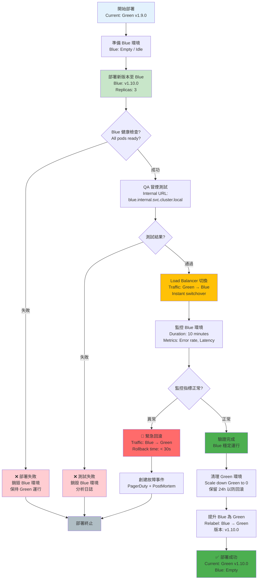

# 07-01 部署架構與 DevOps 規範 (Deployment Architecture)

## 1. 系統概述
為確保平台 **99.99% 高可用性**，必須建立標準化的 CI/CD 流程與環境隔離策略。
核心原則：**"Infrastructure as Code (IaC)"** 與 **"Immutable Infrastructure"**。

## 2. 環境策略 (Environment Strategy)

### 2.1 三級環境
1.  **Development (DEV)**:
    *   **用途**: 開發自測、聯調。
    *   **部署**: 自動觸發 (Commit push to `feature/*`)。
    *   **數據**: 假數據 (Mock Data)。
2.  **Staging (UAT)**:
    *   **用途**: QA 驗收、甚至是營運預覽 (Pre-production)。
    *   **部署**: 手動觸發 (Merge to `develop`)。
    *   **數據**: 脫敏後的生產數據備份 (Sanitized Prod Dump)。
3.  **Production (PROD)**:
    *   **用途**: 真實玩家流量。
    *   **部署**: 審批後觸發 (Tag trigger `v1.2.3`)。
    *   **數據**: 真實數據。

---

## 3. 部署策略 (Deployment Strategy)

### 3.1 藍綠部署 (Blue-Green Deployment)
*   **適用**: 所有無狀態服務 (Stateless Services)，如 API Gateway, Game Service。
*   **流程**:
    1.  現有流量在 `Green` 環境。
    2.  新版本部署至 `Blue` 環境 (此時無流量)。
    3.  QA 在 `Blue` 進行冒煙測試 (Smoke Test)。
    4.  Load Balancer 切換流量至 `Blue`。
    5.  觀察 10 分鐘，無異常則銷毀 `Green`。

##### 📊 Diagram: 藍綠部署切換流程 (Blue-Green Deployment Switching Flow)



**藍綠部署優勢**:
- ✅ **零停機**: 流量瞬間切換，無服務中斷
- ✅ **快速回滾**: < 30 秒回滾至舊版本
- ✅ **完整測試**: Blue 環境可充分驗證
- ⚠️ **資源成本**: 需要 2 倍資源（Green + Blue 同時運行）

### 3.2 金絲雀發布 (Canary Release - Comprehensive Strategy)

*   **適用**: 核心高風險服務，如 Wallet Service, Payment Gateway, Risk Engine。
*   **目標**: 在最小影響範圍內驗證新版本，確保生產環境穩定性。

#### 3.2.1 Canary Deployment 架構

```
[Canary Deployment Architecture]
┌──────────────────────────────────────────────────────────────────┐
│  Load Balancer (Istio/Linkerd/NGINX)                            │
│  ┌────────────────────────────────────────────────────────────┐  │
│  │  Traffic Split Configuration                              │  │
│  │  - Canary Weight: 0% → 5% → 25% → 50% → 100%            │  │
│  │  - Routing Strategy: User ID hash (stable routing)       │  │
│  └────────────────────────────────────────────────────────────┘  │
│                          ↓ Traffic Split                         │
├──────────────────────────────────────────────────────────────────┤
│  Stable Version (v1.9.0)                        Canary (v1.10.0) │
│  ┌─────────────────────────────────┐  ┌────────────────────────┐  │
│  │  Replicas: 10                   │  │  Replicas: 1 (5%)      │  │
│  │  CPU: 2 cores                   │  │  CPU: 2 cores          │  │
│  │  Memory: 4GB                    │  │  Memory: 4GB           │  │
│  │  Health: /health                │  │  Health: /health       │  │
│  │  Ready: 10/10                   │  │  Ready: 1/1            │  │
│  └─────────────────────────────────┘  └────────────────────────┘  │
│                          ↓ Metrics Collection                    │
├──────────────────────────────────────────────────────────────────┤
│  Monitoring & Observability                                      │
│  ┌────────────────────────────────────────────────────────────┐  │
│  │  Prometheus: error_rate, latency_p99, request_count       │  │
│  │  Grafana: Real-time dashboard (Stable vs Canary)         │  │
│  │  Alertmanager: Auto-rollback triggers                    │  │
│  └────────────────────────────────────────────────────────────┘  │
└──────────────────────────────────────────────────────────────────┘
```

#### 3.2.2 完整部署流程 (Progressive Rollout)

**Phase 0: Pre-Deployment (T-30min)**
- 確認 Staging 環境所有測試通過 (E2E tests, Load tests)
- 創建 Rollback Plan 文檔
- 通知 On-Call 工程師 (Slack + PagerDuty)
- 確認監控系統正常 (Prometheus, Grafana, APM)

**Phase 1: Canary Deployment (T+0 → T+30min, 5% traffic)**

```yaml
# Kubernetes Deployment (Canary)
apiVersion: apps/v1
kind: Deployment
metadata:
  name: wallet-service-canary
  namespace: igaming-prod
  labels:
    app: wallet-service
    version: v1.10.0
    track: canary
spec:
  replicas: 1  # 5% of total (if total=20 pods)
  selector:
    matchLabels:
      app: wallet-service
      version: v1.10.0
  template:
    metadata:
      labels:
        app: wallet-service
        version: v1.10.0
        track: canary
    spec:
      containers:
      - name: wallet-service
        image: ecr.example.com/wallet-service:v1.10.0
        resources:
          requests:
            cpu: 2
            memory: 4Gi
          limits:
            cpu: 4
            memory: 8Gi
        livenessProbe:
          httpGet:
            path: /health/live
            port: 8080
          initialDelaySeconds: 30
          periodSeconds: 10
          failureThreshold: 3
        readinessProbe:
          httpGet:
            path: /health/ready
            port: 8080
          initialDelaySeconds: 15
          periodSeconds: 5
          successThreshold: 2
```

```yaml
# Istio VirtualService (Traffic Split)
apiVersion: networking.istio.io/v1beta1
kind: VirtualService
metadata:
  name: wallet-service
spec:
  hosts:
  - wallet-service
  http:
  - match:
    - headers:
        canary:
          exact: "true"
    route:
    - destination:
        host: wallet-service
        subset: canary
      weight: 100
  - route:
    - destination:
        host: wallet-service
        subset: stable
      weight: 95
    - destination:
        host: wallet-service
        subset: canary
      weight: 5
```

**監控指標 (Phase 1)**:

| 指標 | Baseline (Stable) | Canary Target | Alert Threshold |
|---|---|---|---|
| Error Rate | 0.1% | < 0.2% | > 0.5% (rollback) |
| Latency P99 | 200ms | < 400ms | > 600ms (rollback) |
| Latency P50 | 80ms | < 160ms | > 240ms (rollback) |
| HTTP 5xx Count | 10/min | < 20/min | > 50/min (rollback) |
| Memory Usage | 60% | < 75% | > 90% (rollback) |
| Pod Restart Count | 0 | 0 | > 3 (rollback) |

**自動決策邏輯**:


**Phase 2: Gradual Ramp (T+30min → T+90min, 25% → 50%)**

若 Phase 1 成功，逐步增加流量：

```bash
# Update traffic split to 25%
kubectl patch virtualservice wallet-service --type merge -p '
{
  "spec": {
    "http": [{
      "route": [
        {"destination": {"host": "wallet-service", "subset": "stable"}, "weight": 75},
        {"destination": {"host": "wallet-service", "subset": "canary"}, "weight": 25}
      ]
    }]
  }
}
'

# Wait 30 minutes, monitor metrics

# Update traffic split to 50%
kubectl patch virtualservice wallet-service --type merge -p '
{
  "spec": {
    "http": [{
      "route": [
        {"destination": {"host": "wallet-service", "subset": "stable"}, "weight": 50},
        {"destination": {"host": "wallet-service", "subset": "canary"}, "weight": 50}
      ]
    }]
  }
}
'
```

**每個流量增加階段都重複監控評估，任何異常立即回滾。**

**Phase 3: Full Rollout (T+90min → T+120min, 100%)**

```bash
# Update traffic split to 100%
kubectl patch virtualservice wallet-service --type merge -p '
{
  "spec": {
    "http": [{
      "route": [
        {"destination": {"host": "wallet-service", "subset": "canary"}, "weight": 100}
      ]
    }]
  }
}
'

# Wait 30 minutes for final validation
```

**Phase 4: Cleanup (T+120min → T+24h)**

```bash
# Promote canary to stable
kubectl label deployment wallet-service-canary track=stable --overwrite
kubectl delete deployment wallet-service-stable

# Update labels
kubectl label deployment wallet-service-canary version=stable --overwrite

# Remove canary resources
kubectl delete virtualservice wallet-service-canary
```

**保留舊版本 24 小時**: 即使 100% 流量切換至新版本，舊版本 pods 仍保留 24 小時（縮減至 1 replica），以防發現隱藏問題需緊急回滾。

#### 3.2.3 健康檢查協議 (Health Check Protocol)

**Liveness Probe (存活探針)**:
- **目的**: 偵測應用死鎖或崩潰，K8s 自動重啟 pod
- **路徑**: `/health/live`
- **實作範例**:

```javascript
// Node.js Express
app.get('/health/live', (req, res) => {
  // Basic check: Is process responsive?
  res.status(200).json({ status: 'alive', timestamp: Date.now() });
});
```

**Readiness Probe (就緒探針)**:
- **目的**: 確認應用已準備好接收流量（DB 連接、外部依賴可用）
- **路徑**: `/health/ready`
- **實作範例**:

```javascript
app.get('/health/ready', async (req, res) => {
  const checks = {
    database: await checkDatabaseConnection(),
    redis: await checkRedisConnection(),
    kafka: await checkKafkaProducer(),
    externalAPI: await checkExternalAPIReachable()
  };

  const allHealthy = Object.values(checks).every(check => check === true);

  if (allHealthy) {
    res.status(200).json({ status: 'ready', checks });
  } else {
    res.status(503).json({ status: 'not_ready', checks });
  }
});

async function checkDatabaseConnection() {
  try {
    await db.query('SELECT 1');
    return true;
  } catch (err) {
    logger.error('Database health check failed:', err);
    return false;
  }
}
```

**Startup Probe (啟動探針 - Optional for slow-start apps)**:
- **目的**: 給予應用更長的啟動時間（如 Java Spring Boot 需 60 秒）
- **路徑**: `/health/startup`
- **配置**:

```yaml
startupProbe:
  httpGet:
    path: /health/startup
    port: 8080
  initialDelaySeconds: 0
  periodSeconds: 10
  failureThreshold: 30  # 300 seconds total (10s * 30)
```

#### 3.2.4 自動回滾機制 (Automated Rollback)

**觸發條件**:

| 觸發器 | 條件 | 回滾動作 |
|---|---|---|
| **Error Rate Spike** | error_rate > baseline * 5 | 立即回滾至 stable |
| **Latency Degradation** | latency_p99 > baseline * 2 | 立即回滾至 stable |
| **HTTP 5xx Surge** | 5xx_count > 50/min | 立即回滾至 stable |
| **Health Check Failure** | readiness probe fail > 3 times | K8s 自動停止流量 |
| **Memory Leak** | memory_usage > 90% for 5 min | 立即回滾 + 重啟 pods |
| **Pod Crash Loop** | restart_count > 3 in 10 min | 立即回滾 + 調查 |
| **Manual Abort** | Engineer triggers /api/rollback | 手動回滾 |

**自動回滾腳本**:

```bash
#!/bin/bash
# rollback_canary.sh

echo "🚨 Initiating emergency rollback..."

# Step 1: Set traffic to 0% for canary
kubectl patch virtualservice wallet-service --type merge -p '
{
  "spec": {
    "http": [{
      "route": [
        {"destination": {"host": "wallet-service", "subset": "stable"}, "weight": 100}
      ]
    }]
  }
}
'

# Step 2: Scale down canary pods
kubectl scale deployment wallet-service-canary --replicas=0

# Step 3: Notify team
curl -X POST "https://hooks.slack.com/services/XXX" \
  -d '{"text": "🚨 Canary rollback executed. Stable version restored."}'

# Step 4: Create incident ticket
curl -X POST "https://api.pagerduty.com/incidents" \
  -H "Authorization: Token token=XXX" \
  -d '{
    "incident": {
      "type": "incident",
      "title": "Canary Deployment Failed - Auto Rollback Executed",
      "service": {"id": "service_id", "type": "service_reference"}
    }
  }'

echo "✅ Rollback completed. Investigate canary logs for root cause."
```

#### 3.2.5 Feature Flag 整合 (Progressive Feature Enablement)

除了流量切換，還可搭配 Feature Flag 進行更細粒度控制：

```javascript
// Using LaunchDarkly
const featureFlag = ldClient.variation('new-wallet-algorithm', user, false);

if (featureFlag) {
  // Use new algorithm (canary feature)
  processWithNewAlgorithm();
} else {
  // Use stable algorithm
  processWithOldAlgorithm();
}
```

**好處**:
- 即使 100% 流量在新版本，仍可透過 Feature Flag 瞬間切回舊邏輯
- 可針對特定用戶群組（如 VIP）先啟用新功能
- 不需重新部署即可開關功能

#### 3.2.6 Canary 分析報告範本

```markdown
# Canary Deployment Report: wallet-service v1.10.0

## Deployment Summary
- **Service**: wallet-service
- **Version**: v1.9.0 → v1.10.0
- **Start Time**: 2026-01-27 10:00 UTC
- **End Time**: 2026-01-27 12:00 UTC
- **Total Duration**: 2 hours
- **Result**: ✅ SUCCESS / ❌ ROLLBACK

## Traffic Split Timeline
- 10:00 - 10:30: 5% traffic (Canary validation)
- 10:30 - 11:00: 25% traffic (Gradual ramp)
- 11:00 - 11:30: 50% traffic (Gradual ramp)
- 11:30 - 12:00: 100% traffic (Full rollout)

## Metrics Comparison

| Metric | Stable (v1.9.0) | Canary (v1.10.0) | Delta | Status |
|---|---|---|---|---|
| Error Rate | 0.08% | 0.09% | +0.01% | ✅ Within threshold |
| Latency P99 | 195ms | 210ms | +15ms | ✅ Within threshold |
| Latency P50 | 75ms | 78ms | +3ms | ✅ Within threshold |
| HTTP 5xx/min | 8 | 10 | +2 | ✅ Within threshold |
| Memory Usage | 58% | 62% | +4% | ✅ Within threshold |
| CPU Usage | 45% | 48% | +3% | ✅ Within threshold |

## Incidents During Deployment
- None

## Rollback Triggers
- None activated

## Lessons Learned
- Canary validation time (30 min) was sufficient
- No unexpected behavior observed
- New algorithm improved transaction processing by 12%

## Recommendation
- ✅ APPROVE for production rollout
- Consider reducing canary duration to 20 min for low-risk changes
```

---

---

## 4. 基礎設施 (Infrastructure)

### 4.1 Kubernetes (K8s) 標準
*   **Namespace**: `igaming-dev`, `igaming-uat`, `igaming-prod`。
*   **Resources**: 每個 Pod 必須設定 `requests` 與 `limits` (避免資源爭搶)。
*   **Probes**: 必須配置 `livenessProbe` (死鎖重啟) 與 `readinessProbe` (啟動完成才接流量)。

### 4.2 GitOps 流程
*   **工具**: ArgoCD。
*   **原理**: 
    1.  CI Build Docker Image -> Push to ECR。
    2.  CI Update `helm-charts/values.yaml` (image tag change)。
## 5. 系統引導與種子數據 (System Bootstrapping)

### 5.1 初始管理員 (Seed Admin)
系統首次部署後，數據庫為空，無法登入。需透過 `k8s-job` 注入初始數據。
*   **Job**: `seed-admin-job`
*   **Env Vars**: `ADMIN_EMAIL`, `ADMIN_PASSWORD` (From K8s Secrets).
*   **Logic**:
    1.  檢查 `admin_users` 表是否為空。
    2.  若為空，創建 Super Admin 帳號與 "全權限角色"。
    3.  若不為空，跳過 (Idempotent)。

### 5.2 基礎配置載入 (Config Seeding)
*   **字典表**: 載入 ISO 貨幣代碼 (USD, THB)、國家代碼、語言列表。
*   **預設商戶**: 創建 `default_tenant` (ID: 1001)，用於平台測試。
*   **遊戲配置**: 執行 `GameDiscoveryJob` 首次全量同步。


---

**文檔版本**: 1.0.0
**最後更新**: 2026-01-28
**維護團隊**: DevOps Team & SRE Team

---

## 📚 相關文檔

### 前置依賴
- [00-04 技術棧](../00_Foundation/concepts/00-04_Technology_Stack.md) - 技術選型

### 相關文檔
- [12-03 網關架構](./07-02-01_Gateway_Core.md) - API Gateway
- [12-06 性能監控](./07-06_Performance_Monitoring.md) - APM 集成
