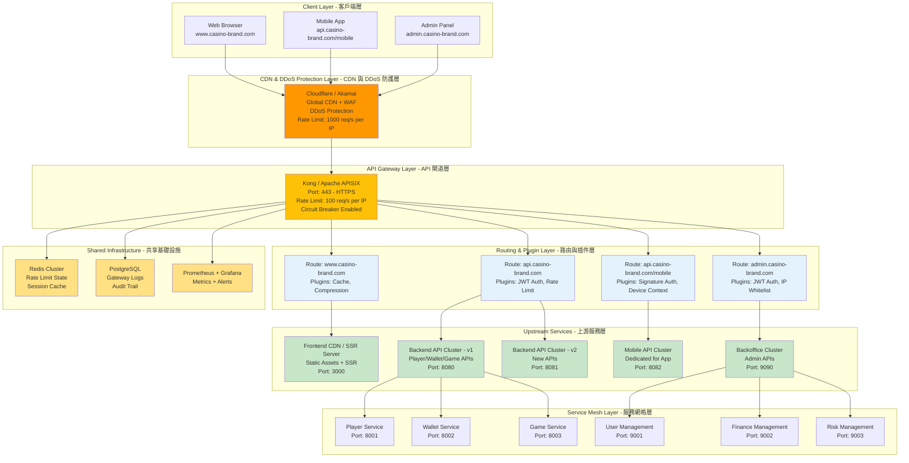

# 07-02-01 網關核心架構 (Gateway Core Architecture)

## 1. 系統概述
API Gateway 是所有外部流量進入平台的唯一入口。
本模組基於 **Apache APISIX** 或 **Kong** 構建，負責路由分發、流量控制與基礎安全。

## 2. 路由策略 (Routing Strategy)

### 2.1 統一接入 (Unified Ingress)
所有流量通過 HTTPS 443 端口接入，根據 `Host` 與 `Path` 分發。
*   `api.casino-brand.com` -> 轉發至 Backend API Cluster。
*   `www.casino-brand.com` -> 轉發至 Frontend CDN / SSR Server。
*   `admin.casino-brand.com` -> 轉發至 Backoffice Cluster (需 IP 白名單)。

##### 📊 Diagram 1: API Gateway 統一接入架構 (API Gateway Unified Ingress Architecture)



**架構說明**:

| 層級 | 組件 | 職責 | 技術棧 | 性能指標 |
|------|------|------|--------|----------|
| **CDN & DDoS 層** | Cloudflare / Akamai | 全球加速、DDoS 防護、WAF | Cloudflare Pro | P99 < 50ms (edge cache hit) |
| **API Gateway 層** | Kong / Apache APISIX | 路由分發、認證授權、限流熔斷 | Kong 3.x / APISIX 3.x | P99 < 100ms (gateway latency) |
| **Routing 層** | Route + Plugins | 根據 Host/Path 路由 + 插件鏈 | Lua plugins | Routing decision < 5ms |
| **Upstream 層** | Backend API Clusters | 業務邏輯處理 | Spring Boot 3.x | P99 < 500ms (API response) |
| **Service Mesh 層** | Microservices | 微服務架構 | Spring Cloud / K8s | Internal latency < 50ms |
| **Shared Infrastructure** | Redis, PostgreSQL, Monitoring | 共享基礎設施 | Redis 7.x, PostgreSQL 16.x | Redis P99 < 10ms |

**路由配置範例**:

**Route 1: Web Frontend (www.casino-brand.com)**
```yaml
routes:
  - name: frontend-route
    hosts:
      - www.casino-brand.com
    paths:
      - /
    strip_path: false
    plugins:
      - name: proxy-cache
        config:
          cache_ttl: 300  # 5 minutes
      - name: response-transformer
        config:
          add:
            headers:
              - "X-Cache-Status: HIT"
      - name: gzip
        config:
          min_length: 1000
```

**Route 2: Public API (api.casino-brand.com)**
```yaml
routes:
  - name: api-route
    hosts:
      - api.casino-brand.com
    paths:
      - /v1/*
      - /v2/*
    strip_path: false
    plugins:
      - name: jwt
        config:
          secret_is_base64: false
      - name: rate-limiting
        config:
          minute: 100
          policy: redis
      - name: request-id
        config:
          header_name: X-Request-ID
```

**Route 3: Mobile API (api.casino-brand.com/mobile)**
```yaml
routes:
  - name: mobile-route
    hosts:
      - api.casino-brand.com
    paths:
      - /mobile/v1/*
    strip_path: true
    plugins:
      - name: signature-auth  # Custom plugin
        config:
          app_secret: ${APP_SECRET}
          timestamp_tolerance: 300  # 5 minutes
          nonce_ttl: 300
      - name: device-context  # Custom plugin
        config:
          extract_headers:
            - X-Device-ID
            - X-Model
            - X-OS
      - name: rate-limiting
        config:
          minute: 50  # Stricter for mobile
```

**Route 4: Admin Backoffice (admin.casino-brand.com)**
```yaml
routes:
  - name: admin-route
    hosts:
      - admin.casino-brand.com
    paths:
      - /api/*
    strip_path: false
    plugins:
      - name: ip-restriction
        config:
          allow:
            - 192.168.1.0/24  # Office IP
            - 10.0.0.0/16     # VPN IP
      - name: jwt
        config:
          claims_to_verify:
            - role: admin
      - name: request-termination  # Fail-secure if auth fails
        config:
          status_code: 403
          message: "Access Denied - Admin only"
```

**流量分發邏輯**:

```
Request arrives at Cloudflare
  ↓
1. DDoS Protection + WAF Check
  ↓
2. DNS Resolution → Kong Gateway (origin)
  ↓
3. Kong matches Host + Path:
   - www.casino-brand.com → R1 → CDN/SSR
   - api.casino-brand.com/v1/* → R2 → API v1 Cluster
   - api.casino-brand.com/mobile/* → R3 → Mobile API Cluster
   - admin.casino-brand.com → R4 → Backoffice Cluster (IP check)
  ↓
4. Apply Plugin Chain:
   - Authentication (JWT / Signature)
   - Rate Limiting (Redis)
   - Circuit Breaker (if upstream unhealthy)
  ↓
5. Forward to Upstream Service
  ↓
6. Response Transformation + Cache
  ↓
7. Return to Client
```

### 2.2 行動端專屬路由 (Mobile App Routing)
App 流量需特殊處理，以支援 "熱更新" 與 "簽名驗證"。
*   **Path**: `/api/mobile/v1/*`
*   **Plugin**:
    *   **Device Context**: 自動提取 Header 中的 `X-Device-ID`, `X-Model`, `X-OS` 並注入 Upstream Header，供後端 Risk Engine 使用。
    *   **Signature Auth**: 驗證 App 本地私鑰簽名 (防止 API 被腳本直接調用)。

**App 簽名規範 (Signature Spec)**:
所有來自 App 的請求必須包含以下 Header：
- `X-App-Version`: `1.0.0`
- `X-Timestamp`: `1716382910` (誤差允許 +/- 5分鐘)
- `X-Nonce`: `UUID` (防重放)
- `X-Signature`: `HMAC-SHA256(Path + Body + Timestamp + Nonce, AppSecret)`

**Gateway 驗證邏輯**:
1. 檢查 `Timestamp` 是否在有效期內。
2. 檢查 `Nonce` 是否曾在 Redis 中出現過 (TTL 5min)。
3. 使用後端保存的 `AppSecret` 重新計算簽名並比對。
4. 失敗則返回 `401 Unauthorized`。

---

