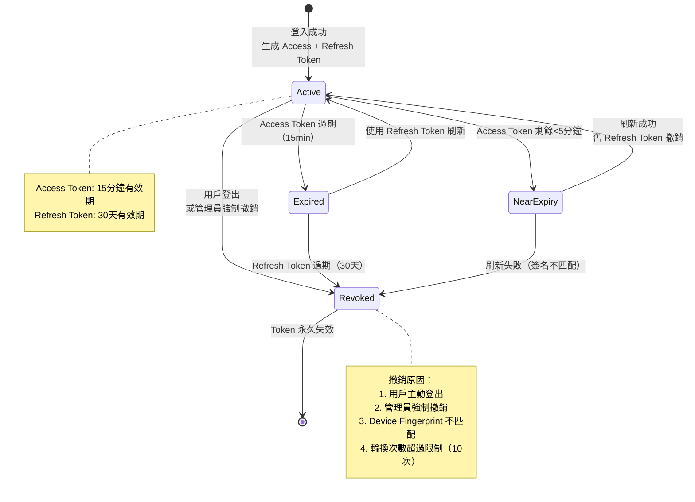
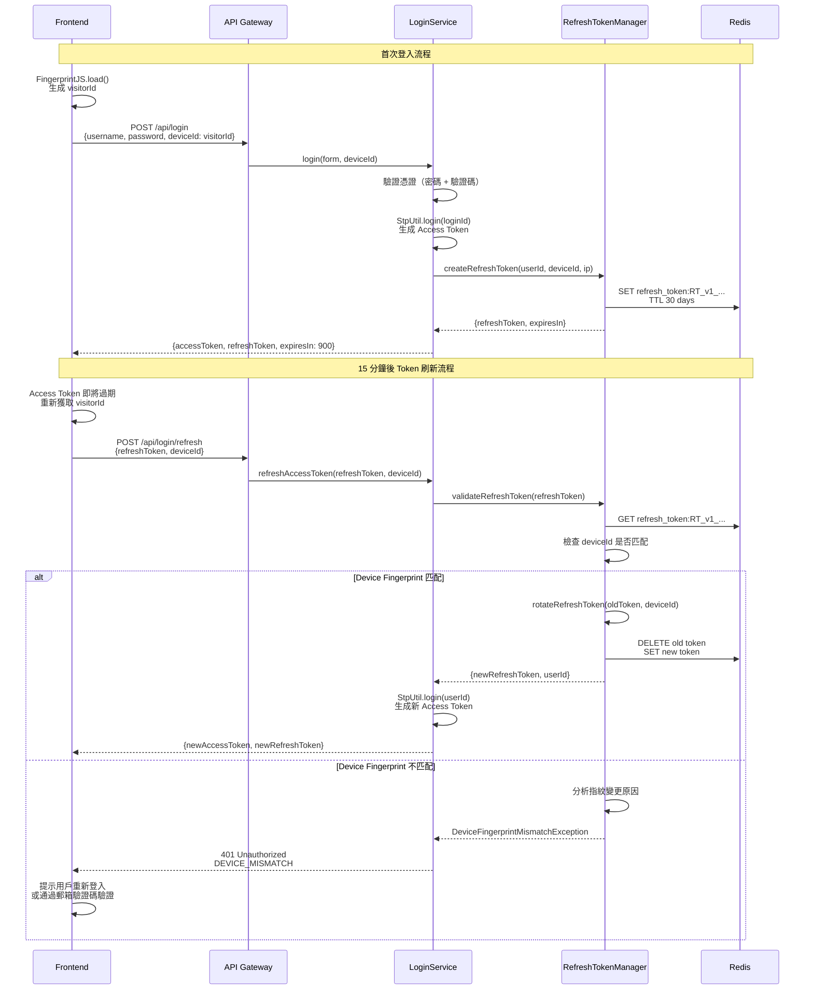
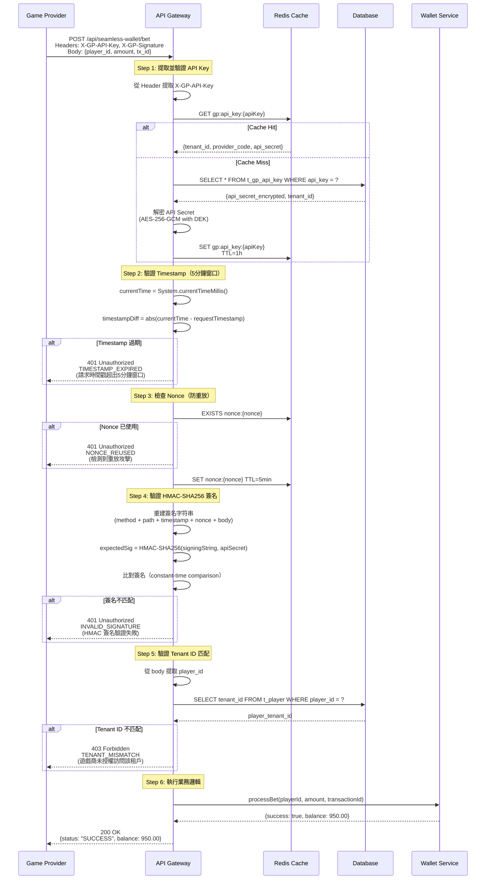
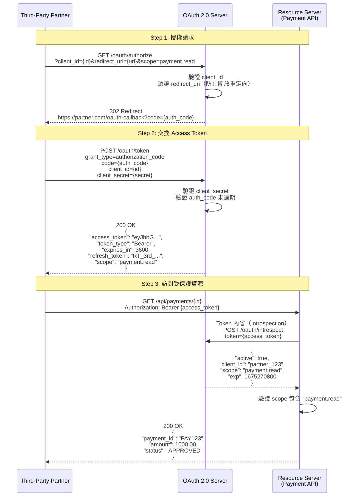
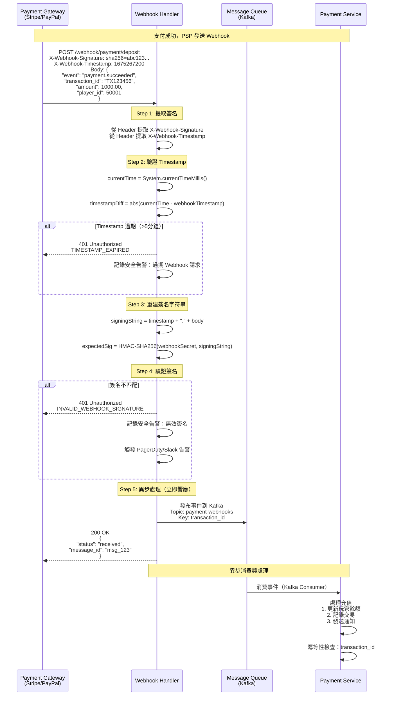
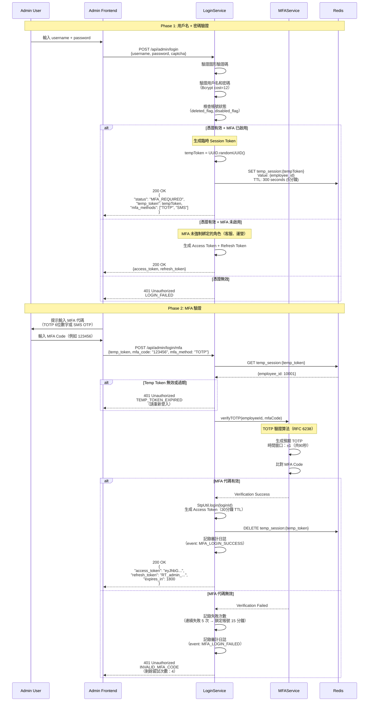
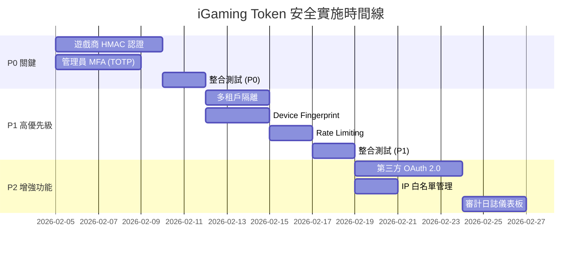

# 07-03-02-02 多主體 Token 安全方案 (Multi-Actor Token Security)

> **版本**: 1.0.0
> **最後更新**: 2026-02-05
> **目的**: 定義四種主體（玩家、遊戲商、第三方平台、後台用戶）的差異化 Token 安全策略
> **狀態**: ✅ 設計完成，待實施
> **設計原則**: Step-by-step reasonable ultrathink（深度分析每個設計決策）

---

## 📋 目錄

- [架構總覽](#架構總覽)
- [四種主體認證策略對比](#四種主體認證策略對比)
- [玩家 Token 方案](#玩家-token-方案)
- [遊戲商 Token 方案](#遊戲商-token-方案)
- [第三方平台 Token 方案](#第三方平台-token-方案)
- [後台用戶 Token 方案](#後台用戶-token-方案)
- [多租戶 Token 隔離](#多租戶-token-隔離)
- [威脅模型與安全加固](#威脅模型與安全加固)
- [實施建議](#實施建議)
- [相關文檔](#相關文檔)

---

## 🏗️ 架構總覽

### 認證架構圖

```mermaid
graph TD
    subgraph "玩家認證流程<br/>Player Authentication"
        A1[Player Login<br/>Web/iOS/Android] --> A2[LoginService<br/>Password + Captcha]
        A2 --> A3[Generate Access Token<br/>Sa-Token: 15min]
        A2 --> A4[Generate Refresh Token<br/>RefreshTokenManager: 30 days]
        A3 --> A5[Device Fingerprint<br/>FingerprintJS]
        A4 --> A6[Redis Storage<br/>Token Rotation]
    end

    subgraph "遊戲商認證流程<br/>Game Provider"
        B1[GP API Request] --> B2[API Gateway<br/>Validate API Key]
        B2 --> B3[HMAC-SHA256<br/>Signature Verification]
        B3 --> B4{Signature Valid?}
        B4 -->|Yes| B5[Process Request<br/>Idempotency Check]
        B4 -->|No| B6[Reject 401]
    end

    subgraph "第三方平台認證流程<br/>Partner"
        C1[OAuth Request] --> C2[OAuth 2.0 Server<br/>Client Credentials]
        C2 --> C3[Generate JWT<br/>1 hour]
        C3 --> C4[IP Whitelist]
        C4 --> C5[Rate Limit]
    end

    subgraph "後台用戶認證流程<br/>Admin"
        D1[Admin Login] --> D2[MFA Verification<br/>TOTP/SMS]
        D2 --> D3[Generate Token<br/>30min]
        D3 --> D4[IP Restriction]
        D4 --> D5[RBAC Permission]
        D5 --> D6[Audit Log]
    end
```



### 設計原則

#### 1. 差異化策略（Differentiated Strategy）

**核心原則**：根據主體類型選擇最適合的 Token 類型和驗證策略。

| 主體類型 | Token 類型選擇 | 理由 |
|---------|--------------|------|
| **玩家** | JWT（Redis Opaque） | 需攜帶用戶上下文（user_id, tenant_id, roles）給前端授權使用 |
| **遊戲商** | Opaque Token（API Key） | Server-to-server 通信，opaque token 防止 token 檢查攻擊 |
| **第三方** | JWT（OAuth 2.0） | 業界標準，易於集成第三方系統（支付網關、KYC 供應商） |
| **後台用戶** | JWT（Redis Opaque） + MFA | 高安全性需求，防止特權操作被未授權訪問 |

#### 2. 最小特權原則（Principle of Least Privilege）

每種主體僅獲得完成其任務所需的最小權限：
- **玩家**：僅訪問自己的錢包、投注記錄、個人資料
- **遊戲商**：僅訪問指定租戶的錢包 API（Balance、Bet、Result、Rollback）
- **第三方**：僅訪問授權的 API 端點（如支付 API、KYC API）
- **後台用戶**：基於 RBAC 角色的細粒度權限控制

#### 3. 深度防禦（Defense in Depth）

多層安全措施確保即使單一控制失效，系統仍保持安全：

```
Layer 1: Token 驗證（JWT 簽名、HMAC 簽名、Refresh Token 有效性）
    ↓
Layer 2: 身份驗證（Device Fingerprint、MFA、IP 白名單）
    ↓
Layer 3: 授權驗證（RBAC 權限、租戶隔離、資源所有權）
    ↓
Layer 4: Rate Limiting（防止暴力破解、API 濫用）
    ↓
Layer 5: 審計日誌（記錄所有敏感操作，用於事後追溯）
```

---

## 📊 四種主體認證策略對比

| 主體類型 | Token 類型 | Access Token<br/>有效期 | Refresh Token<br/>有效期 | 驗證方式 | 主要安全措施 |
|---------|-----------|------------------------|------------------------|---------|------------|
| **玩家<br/>(Player)** | JWT<br/>(Redis Opaque) | 15 分鐘 | 30 天 | Sa-Token + Device Fingerprint | Token Rotation<br/>+ MFA（可選） |
| **遊戲商<br/>(Game Provider)** | Opaque Token<br/>(API Key) | 永久有效<br/>（直到撤銷） | N/A | HMAC-SHA256 簽名 | IP 白名單<br/>+ Rate Limit<br/>+ 請求簽名 |
| **第三方<br/>(Third-Party)** | JWT<br/>(OAuth 2.0) | 1 小時 | 7 天 | OAuth 2.0<br/>Client Credentials | Webhook 簽名<br/>+ IP 白名單<br/>+ Rate Limit |
| **後台用戶<br/>(Admin)** | JWT<br/>(Redis Opaque) | 30 分鐘 | 7 天 | Sa-Token + MFA | TOTP/SMS<br/>+ IP 限制<br/>+ 審計日誌 |

### 設計決策分析（Ultrathink）

#### 決策 1：為何玩家使用 JWT 而遊戲商使用 Opaque Token？

**分析過程**：

我們評估了三種方案：

**選項 A（全部使用 JWT）**：
- ✅ 優點：統一實現，單一代碼庫，易於維護
- ✅ 優點：JWT 自包含，無需查詢數據庫即可驗證
- ❌ 缺點：向遊戲商暴露內部 Token 結構（安全風險）
- ❌ 缺點：無法針對各主體優化 TTL（玩家需短 TTL，GP 需長 TTL）
- ❌ 缺點：JWT 無法撤銷（除非維護黑名單，失去無狀態優勢）

**選項 B（差異化策略 - 已選擇）**：
- ✅ 優點：針對性安全設計（JWT 用於玩家、Opaque Token 用於 GP）
- ✅ 優點：最佳性能（HMAC 用於 GP server-to-server、JWT 用於玩家前端）
- ✅ 優點：靈活調整 TTL（玩家 15min、GP 永久有效）
- ✅ 優點：GP 的 Opaque Token 防止 token 檢查攻擊
- ❌ 缺點：實現複雜度較高，需維護多套認證流程
- ❌ 缺點：開發和測試成本增加

**選項 C（全部使用 OAuth 2.0）**：
- ✅ 優點：業界標準，互操作性佳，易於與第三方系統集成
- ✅ 優點：完整的授權框架（支持多種 Grant Types）
- ❌ 缺點：對 GP 的 server-to-server 通信過度設計
- ❌ 缺點：OAuth 握手開銷高（Authorization Code Flow 需 3 次往返）
- ❌ 缺點：實現成本高，需額外的 Authorization Server

**決策理由**：
- **玩家**：前端需要攜帶用戶上下文（user_id, tenant_id, roles）進行前端授權判斷 → JWT（自包含）
- **遊戲商**：Server-to-server 通信，不需要傳遞用戶上下文，opaque token 防止 token 檢查攻擊 → API Key + HMAC
- **第三方**：需與外部系統（支付網關、KYC 供應商）集成，業界標準 OAuth 2.0 降低集成成本 → OAuth 2.0
- **後台用戶**：高安全性需求，需要 JWT 攜帶角色信息 + MFA 額外驗證 → JWT + MFA

**Trade-off 權衡**：
**安全性** (⭐⭐⭐⭐⭐) vs **實現成本** (⭐⭐⭐) → **選擇選項 B（差異化策略）**

**結論**：雖然選項 B 的實現複雜度較高，但其針對性安全設計大幅提升了系統整體安全性，是 iGaming 平台的最佳選擇。

---

## 🎮 玩家 Token 方案

### Token 格式設計

#### LoginId 格式（支持多租戶）

```
格式：userType:tenantId:userId

範例：
- 2:1001:50001  （租戶 1001 的玩家 ID 50001）
- 2:1002:50002  （租戶 1002 的玩家 ID 50002）

組成：
- userType: 用戶類型枚舉值（2 = PLAYER）
- tenantId: 租戶 ID（支持多租戶隔離）
- userId: 玩家 ID（業務主鍵）
```

#### Access Token Payload (JWT Claims)

```json
{
  "sub": "2:1001:50001",           // 主題（完整的 LoginId）
  "user_id": 50001,                // 玩家 ID
  "tenant_id": 1001,               // 租戶 ID
  "user_type": "PLAYER",           // 用戶類型
  "device_id": "fp_abc123xyz",     // 設備指紋
  "roles": ["PLAYER", "VIP_GOLD"], // 角色清單
  "iat": 1675267200,               // 簽發時間（Unix timestamp）
  "exp": 1675268100                // 過期時間（簽發後 15 分鐘）
}
```

#### Refresh Token 格式（Opaque）

```
格式：RT_v1_{tenant_id}_{user_id}_{uuid}_{checksum}

範例：
RT_v1_1001_50001_a3b2c1d4e5f6_ab12cd34

組成：
- RT_v1: 前綴 + 版本號（支持未來格式升級）
- tenant_id: 租戶 ID（1001）
- user_id: 玩家 ID（50001）
- uuid: 隨機 UUID（高熵，防止猜測）
- checksum: HMAC-SHA256 校驗和（前 8 字符，防止偽造）
```

### 生命週期管理

#### Token 生命週期狀態機



### Device Fingerprint 整合

#### Device Fingerprint 驗證流程



#### Device Fingerprint 不匹配處理策略

| 風險級別 | 指紋變更原因 | 處理策略 | 用戶體驗影響 |
|---------|------------|---------|------------|
| **低風險<br/>(⭐)** | 瀏覽器更新<br/>清除 Cookie | 允許刷新 + 記錄警告日誌 | 無影響 |
| **中風險<br/>(⭐⭐⭐)** | VPN 變更<br/>代理服務器 | 要求郵箱/SMS 驗證碼 | 需額外驗證（~30秒） |
| **高風險<br/>(⭐⭐⭐⭐⭐)** | 完全不同的設備<br/>（如 iOS → Android） | 強制重新登入 + 安全告警 | 需完整登入流程（~1分鐘） |

### Refresh Token 輪換策略

#### Token Rotation 機制

**核心原則**：每次刷新 Access Token 時，同時生成新的 Refresh Token，舊 Refresh Token 立即失效。

**設計理由**：
防止 Refresh Token 被盜用後長期濫用。攻擊者竊取 Refresh Token 後，合法用戶的下一次刷新會使竊取的 Token 失效。

**實施細節**：

```
T0: 用戶登入，獲得 Refresh Token (RT_v1_abc123)
T1: 攻擊者通過 MITM 攻擊竊取 RT_v1_abc123
T2: 合法用戶刷新 Access Token
    → 伺服器生成新 Refresh Token (RT_v1_def456)
    → 伺服器撤銷舊 Refresh Token (RT_v1_abc123) - Redis DELETE
T3: 攻擊者嘗試使用竊取的 RT_v1_abc123
    → 伺服器查詢 Redis：Token 不存在
    → 伺服器拒絕：401 Unauthorized (REFRESH_TOKEN_REVOKED)
    → 觸發安全告警：檢測到疑似被盜 Refresh Token
結果: ✅ 攻擊被阻止，用戶受到保護
```

**安全機制說明**：

無輪換次數限制，依賴以下三層防護：

```
Layer 1: 30 天絕對 TTL（Redis 自動清除過期 Token）
Layer 2: Token Rotation（每次刷新後舊 Token 立即失效）
Layer 3: Device Fingerprint 綁定（防止跨設備 Token 盜用）
```

**設計理由**：
- ✅ 符合行業標準（Google Refresh Token 永久有效直到 6 個月不使用）
- ✅ 用戶體驗優先（iGaming 玩家典型遊戲時長 2-6 小時）
- ✅ 安全性足夠（3 層防護已提供 ⭐⭐⭐⭐ 級別保護）

### 威脅分析與緩解措施

| 威脅 | 場景 | 緩解措施 | 有效性評級 |
|-----|------|---------|----------|
| **Token 竊取<br/>(Token Theft)** | XSS 攻擊竊取 LocalStorage 中的 Access Token | 短 TTL（15min）限制曝光時間 + HttpOnly Cookie 存儲 Refresh Token | ⭐⭐⭐⭐ |
| **Token 重放<br/>(Replay Attack)** | 攻擊者重用被盜的 Refresh Token | Token Rotation（舊 token 立即撤銷）+ Device Fingerprint 綁定 | ⭐⭐⭐⭐⭐ |
| **會話固定<br/>(Session Fixation)** | 攻擊者誘導用戶使用預先設定的惡意 token | Device Fingerprint 綁定 + IP 地址驗證 | ⭐⭐⭐⭐ |
| **暴力破解<br/>(Brute Force)** | 攻擊者嘗試猜測 Refresh Token | 高熵（UUID 128-bit + checksum 32-bit）+ Rate Limiting | ⭐⭐⭐⭐⭐ |
| **跨設備盜用<br/>(Cross-Device Theft)** | 攻擊者在不同設備使用被盜 token | Device Fingerprint 驗證 + 郵箱/SMS 二次驗證 | ⭐⭐⭐⭐ |

**有效性評級說明**：
⭐⭐⭐⭐⭐ = 極高（攻擊成功率 <1%）
⭐⭐⭐⭐ = 高（攻擊成功率 <5%）
⭐⭐⭐ = 中等（攻擊成功率 <20%）

---

## 🎯 遊戲商 Token 方案

### Token 格式（API Key + Secret）

#### API Key 格式

```
格式：GP_{tenant_id}_{provider_code}_{uuid}_{checksum}

範例：
GP_1001_PRAGMATIC_PLAY_a1b2c3d4e5f6_ab12cd34

組成：
- GP: 前綴（標識遊戲供應商類型）
- tenant_id: 租戶 ID（1001）- 多租戶隔離
- provider_code: 供應商標識（PRAGMATIC_PLAY）
- uuid: 隨機 UUID（a1b2c3d4e5f6）- 高熵，防止猜測
- checksum: HMAC-SHA256 校驗和前 8 字符（ab12cd34）- 防止偽造
```

#### API Secret 管理

**生成**：
```
API Secret = Base64(SecureRandom.nextBytes(32))
範例：3wZ9xK2pL7mQ4nR6sT8vY1aC5bD7eF9gH0jK3lM5nP8=

特性：
- 長度：32 字節（256-bit）
- 編碼：Base64（便於傳輸和存儲）
- 熵值：256-bit（暴力破解需 2^256 次嘗試）
```

**存儲**：
- 明文 API Key：存儲在數據庫（用於查找）
- 加密 API Secret：使用 AES-256-GCM 加密後存儲（DEK 加密）
- Redis 緩存：API Key → API Secret（明文，TTL=1 小時）

### HMAC-SHA256 簽名驗證流程

#### 簽名生成（遊戲商端）

**步驟 1：構建簽名字符串**

```
簽名字符串格式：
HTTP_METHOD + "\n" +
REQUEST_PATH + "\n" +
TIMESTAMP + "\n" +
NONCE + "\n" +
REQUEST_BODY

範例：
POST
/api/seamless-wallet/bet
1675267200000
a1b2c3d4-e5f6-7890-1234-567890abcdef
{"player_id":"50001","amount":100.00,"currency":"USD","transaction_id":"TX123456"}
```

**步驟 2：計算 HMAC-SHA256 簽名**

```
簽名 = HMAC-SHA256(API_SECRET, 簽名字符串)
     = HMAC-SHA256("3wZ9xK2pL7mQ4nR6sT8vY1aC5bD7eF9gH0jK3lM5nP8=", 簽名字符串)
     = "a1b2c3d4e5f6789012345678901234567890abcdef1234567890abcdef123456"
```

**步驟 3：添加到 HTTP Headers**

```
POST /api/seamless-wallet/bet HTTP/1.1
Host: igaming-api.example.com
X-GP-API-Key: GP_1001_PRAGMATIC_PLAY_a1b2c3d4e5f6_ab12cd34
X-GP-Timestamp: 1675267200000
X-GP-Nonce: a1b2c3d4-e5f6-7890-1234-567890abcdef
X-GP-Signature: a1b2c3d4e5f6789012345678901234567890abcdef1234567890abcdef123456
Content-Type: application/json

{"player_id":"50001","amount":100.00,"currency":"USD","transaction_id":"TX123456"}
```

#### 簽名驗證（平台端）



### 四種 API 的差異化驗證

| API 類型 | Token 驗證 | HMAC 簽名 | 冪等性 Key | 重試窗口 | 特殊處理 |
|---------|-----------|-----------|-----------|---------|---------|
| **Balance** | ✅ 嚴格 | ✅ 必需 | N/A（唯讀） | N/A | 無 |
| **Bet** | ✅ 嚴格 | ✅ 必需 | `transaction_id` | 1 小時 (Redis)<br/>+ 永久 (DB) | 冪等性三層防護 |
| **Result** | ⚠️ 條件<br/>（長週期遊戲） | ✅ 必需 | `transaction_id` | 24 小時 (Redis)<br/>+ 永久 (DB) | Token 過期時允許<br/>`round_id + bet_tx_id` 驗證 |
| **Rollback** | ⚠️ 條件<br/>（管理員操作） | ✅ 必需 | `transaction_id` | 7 天 (Redis)<br/>+ 永久 (DB) | 允許管理員 Token<br/>（用於對帳補單） |

**詳細驗證策略**：

參考現有文檔：[02_Finance_Center/seamless-wallet/core/01-security.md](../../02_Finance_Center/seamless-wallet/core/01-security.md#part-1-token-驗證機制)

### 冪等性防護集成

**三層防護架構**：

```
Layer 1: Redis 緩存（快速路徑，99% 命中率）
    ↓ 檢查 Key: idempotency:{transaction_id}
    ↓ 命中 → 返回緩存結果（<5ms）
    ↓ 未命中 ↓

Layer 2: 數據庫唯一約束（Truth Source，100% 可靠）
    ↓ INSERT INTO t_transaction (tx_id, ...) -- UNIQUE(tx_id)
    ↓ 違反約束 → 返回已存在的交易結果
    ↓ 成功插入 ↓

Layer 3: 分布式鎖（Redisson，防止並發寫入）
    ↓ tryLock(key: "lock:tx:{transaction_id}", timeout: 5s)
    ↓ 獲取鎖失敗 → 等待重試（最多 3 次）
    ↓ 獲取鎖成功 ↓ 執行業務邏輯 ↓ 釋放鎖
```

**Redis 緩存設計**：

```
Key: idempotency:{transaction_id}
Value: JSON.stringify({
    result: "SUCCESS",
    balance: 950.00,
    timestamp: 1675267200000
})
TTL:
- Bet API: 1 小時
- Result API: 24 小時（長週期遊戲支持）
- Rollback API: 7 天（對帳窗口）
```

### 威脅分析與緩解措施

| 威脅 | 場景 | 緩解措施 | 有效性評級 |
|-----|------|---------|----------|
| **簽名偽造<br/>(Signature Forgery)** | 攻擊者嘗試偽造 HMAC 簽名 | API Secret 永不暴露（僅存儲加密版本）+ 高熵（256-bit） | ⭐⭐⭐⭐⭐ |
| **重放攻擊<br/>(Replay Attack)** | 攻擊者重發有效的 API 請求 | Nonce（Redis 5分鐘 TTL）+ Timestamp 驗證（5分鐘窗口） | ⭐⭐⭐⭐⭐ |
| **中間人攻擊<br/>(MITM)** | 攻擊者攔截並篡改 API 請求 | HTTPS（TLS 1.3）+ HMAC 完整性檢查（篡改後簽名失效） | ⭐⭐⭐⭐⭐ |
| **API Key 洩露<br/>(Key Leakage)** | GP 的 API Key 在日誌中暴露 | Key 輪換（每 90 天）+ Rate Limit（每分鐘 500 請求）+ IP 白名單 | ⭐⭐⭐⭐ |
| **租戶隔離繞過<br/>(Tenant Isolation Bypass)** | GP 嘗試訪問其他租戶的玩家數據 | API Key 中包含 tenant_id + 請求 body 中的 player 必須屬於該租戶 | ⭐⭐⭐⭐⭐ |

---

## 🔗 第三方平台 Token 方案

### OAuth 2.0 Authorization Code Flow

**使用場景**：
- **支付網關**：Nuvei, Stripe, PayPal（充值/提款回調）
- **KYC 供應商**：Jumio, Onfido（身份驗證）
- **分析平台**：Google Analytics, Mixpanel（事件追蹤）

**OAuth 2.0 完整流程**：



### API Key + Secret 管理

**雙因子認證（API Key + API Secret）**：

```
API Key: 公開標識符（可在 URL 中傳遞）
範例：ak_partner_1001_abc123def456

API Secret: 私密密鑰（僅用於簽名，永不傳輸）
範例：sk_partner_1001_xyz789uvw012（Base64，256-bit）

驗證方式：
1. API Key 識別第三方身份
2. API Secret 用於 HMAC-SHA256 簽名驗證請求完整性
```

### Webhook 簽名驗證

**Webhook 流程（範例：支付網關充值成功回調）**：



**Webhook Secret 管理**：

```
生成：
webhook_secret = Base64(SecureRandom.nextBytes(32))

存儲：
1. 平台端：加密存儲（AES-256-GCM）
2. 第三方端：環境變量（不寫入代碼/日誌）

輪換：
- 定期輪換（每 180 天）
- 雙 Secret 並存（舊 Secret 保留 7 天，支持平滑過渡）
```

### IP 白名單 + Rate Limit

**IP 白名單**：

```
配置示例：
{
  "partner_id": "partner_1001",
  "allowed_ips": [
    "203.0.113.0/24",          // 第三方辦公室網段
    "198.51.100.50",           // 第三方生產服務器 IP
    "2001:db8::/32"            // IPv6 支持
  ],
  "created_at": "2026-02-01T00:00:00Z"
}

驗證邏輯：
if request.ip NOT IN allowed_ips:
    return 403 Forbidden (IP_NOT_WHITELISTED)
```

**Rate Limit 策略**：

| 端點 | 限制 | 時間窗口 | 算法 | 超限行為 |
|-----|------|---------|------|---------|
| `/api/payment/*` | 1000 請求 | 1 分鐘 | Fixed Window | 429 Too Many Requests<br/>+ Retry-After header |
| `/api/kyc/*` | 100 請求 | 1 分鐘 | Sliding Window | 429 Too Many Requests |
| `/webhook/*` | 500 請求 | 1 分鐘 | Token Bucket | 429 Too Many Requests<br/>+ 安全告警 |

---

## 👨‍💼 後台用戶 Token 方案

### MFA (Multi-Factor Authentication) 流程

**支持的 MFA 方法**：

| 方法 | 安全性 | 用戶體驗 | 成本 | 推薦度 | 適用場景 |
|-----|-------|---------|------|-------|---------|
| **TOTP<br/>(Google Authenticator)** | ⭐⭐⭐⭐ | ⭐⭐⭐⭐ | ⭐⭐⭐⭐⭐ | ✅ 主要方案 | Super Admin、財務專員、風控專員 |
| **SMS OTP** | ⭐⭐⭐ | ⭐⭐⭐⭐⭐ | ⭐⭐ | ⚠️ 備份方案 | 設備丟失時恢復 |
| **Email OTP** | ⭐⭐ | ⭐⭐⭐ | ⭐⭐⭐⭐⭐ | ⚠️ 最終備份 | 無法接收 SMS 時 |
| **硬件令牌<br/>(YubiKey)** | ⭐⭐⭐⭐⭐ | ⭐⭐⭐ | ⭐ | 🔮 未來考慮 | 高安全性場景（CEO、CTO） |

**決策理由**：
- **主要方案選擇 TOTP**：無需額外硬件成本、離線可用、安全性高（⭐⭐⭐⭐）
- **備份方案選擇 SMS**：設備丟失時提供恢復路徑、用戶體驗好（⭐⭐⭐⭐⭐）

**MFA 強制綁定範圍**：

| 用戶角色 | MFA 要求 | 理由 |
|---------|---------|------|
| **Super Admin** | ✅ 強制 | 擁有所有權限，風險最高（可刪除數據、修改配置） |
| **Tenant Admin** | ✅ 強制 | 可管理租戶配置和財務操作 |
| **財務專員** | ✅ 強制 | 可批准提款和調整玩家餘額 |
| **風控專員** | ✅ 強制 | 可封禁玩家帳戶和凍結資金 |
| **客服** | ⚠️ 可選 | 僅查看權限，風險較低 |
| **運營專員** | ⚠️ 可選 | 配置活動和獎金，風險中等 |

### 登入流程設計（含 MFA）



### TOTP 實現原理（RFC 6238）

**TOTP 算法**：

```
TOTP = HOTP(K, T)

其中：
K = 共享密鑰（Base32 編碼，160-bit）
T = floor((當前 Unix 時間 - T0) / X)
    T0 = 0（Unix 紀元，1970-01-01 00:00:00 UTC）
    X = 30 秒（時間步長）

HOTP(K, C) = Truncate(HMAC-SHA1(K, C))
    C = Counter（對於 TOTP，C = T）
    Truncate = 動態截斷算法（取最後 4 bits 作為偏移量）

輸出：6 位數字（000000 - 999999）
```

**時間窗口容忍**：

```
為防止時間漂移導致驗證失敗，驗證時檢查 ±1 時間窗口（共 3 個窗口，90 秒）：

當前時間步長 T = floor(1675267200 / 30) = 55842240

驗證窗口：
- T-1 = 55842239（過去 30 秒）
- T   = 55842240（當前 30 秒）✅ 最優先匹配
- T+1 = 55842241（未來 30 秒）

偽代碼：
for i in [-1, 0, 1]:
    expected_code = generate_totp(secret, current_step + i)
    if user_input_code == expected_code:
        return True
return False
```

### IP 限制 + Session 管理

**IP 限制策略**：

```
配置示例：
{
  "employee_id": 10001,
  "role": "Super Admin",
  "allowed_ip_ranges": [
    "10.0.1.0/24",            // 公司辦公室內網
    "203.0.113.50"            // VPN 出口 IP
  ],
  "ip_check_enabled": true
}

驗證邏輯：
if ip_check_enabled AND request.ip NOT IN allowed_ip_ranges:
    log.warn("IP violation", employee_id, request.ip)
    return 403 Forbidden (IP_NOT_ALLOWED)
    + 發送安全告警（Slack/Email）
```

**Session 管理策略**：

| 策略 | 配置 | 理由 |
|-----|------|------|
| **閒置超時<br/>(Idle Timeout)** | 15 分鐘無活動自動登出 | 防止用戶離開座位後他人使用 |
| **絕對超時<br/>(Absolute Timeout)** | 登入後 8 小時強制重新登入 | 限制 Token 最大生命週期 |
| **並發登入限制<br/>(Concurrent Sessions)** | 禁止同一帳號多地同時登入 | 防止帳號共享（Sa-Token: is-concurrent=false） |

### RBAC 權限集成（Sa-Token）

**權限驗證流程**：

```
HTTP Request → AdminInterceptor.preHandle()
    ↓
Step 1: 從 Token 提取 employee_id
    ↓
Step 2: 檢查 @NoNeedLogin 註解（公開端點）
    ↓ 不存在 ↓
Step 3: 驗證登入狀態（Token 有效性）
    ↓
Step 4: 檢查 @SaCheckPermission 註解
    ↓
Step 5: 從 Redis 加載用戶權限列表
    Key: user_permission:{employee_id}
    Value: ["system:user:add", "finance:withdrawal:approve", ...]
    ↓
Step 6: 驗證用戶是否擁有所需權限
    ↓
Step 7: 放行請求 → Controller 處理業務邏輯
```

**超管豁免規則**：

```
if (requestEmployee.getAdministratorFlag()) {
    // 超管跳過權限檢查
    return true;
}
```

### 審計日誌設計

**審計級別**：

| 級別 | 觸發條件 | 保留期限 | 告警 | 範例 |
|-----|---------|---------|------|------|
| **CRITICAL<br/>(⭐⭐⭐⭐⭐)** | 提款批准、玩家封禁、餘額調整 | 7 年 | 立即（Slack + Email） | 批准 $10,000 提款 |
| **HIGH<br/>(⭐⭐⭐⭐)** | KYC 批准、角色變更、配置更新 | 3 年 | 每日摘要 | 將用戶角色從「客服」改為「財務專員」 |
| **MEDIUM<br/>(⭐⭐⭐)** | 報表導出、玩家搜索 | 1 年 | 每週摘要 | 導出 10,000 筆玩家數據 |
| **LOW<br/>(⭐⭐)** | 儀表板查看、登入/登出 | 90 天 | 無告警 | 查看儀表板頁面 |

**審計日誌結構**：

```json
{
  "log_id": "audit_123456789",
  "timestamp": "2026-02-05T10:30:00Z",
  "level": "CRITICAL",
  "event_type": "WITHDRAWAL_APPROVED",
  "employee_id": 10001,
  "employee_name": "John Doe",
  "role": "財務專員",
  "ip_address": "203.0.113.50",
  "user_agent": "Mozilla/5.0 ...",
  "action_details": {
    "player_id": 50001,
    "amount": 10000.00,
    "currency": "USD",
    "withdrawal_id": "WD123456"
  },
  "result": "SUCCESS"
}
```

---

## 🏢 多租戶 Token 隔離

### LoginId 格式擴展

**當前格式（SmartAdmin v4.0.0）**：

```
userType:employeeId

範例：
1:10001  （管理員員工 ID 10001）
```

**多租戶格式（建議）**：

```
userType:tenantId:userId

範例：
1:1001:10001  （租戶 1001 的管理員員工 ID 10001）
2:1001:50001  （租戶 1001 的玩家 ID 50001）
2:1002:50002  （租戶 1002 的玩家 ID 50002）

組成：
- userType: 用戶類型枚舉值（1=管理員, 2=玩家）
- tenantId: 租戶 ID（支持多租戶隔離）
- userId: 用戶 ID（管理員員工 ID 或玩家 ID）
```

### 租戶驗證邏輯

#### Token 生成（登入時）

**修改 LoginService.login() 方法**：

```
// 構建多租戶 LoginId
String loginId = UserTypeEnum.ADMIN_EMPLOYEE.getValue() + ":" +
                 employee.getTenantId() + ":" +
                 employee.getEmployeeId();

// 範例：loginId = "1:1001:10001"

StpUtil.login(loginId, new SaLoginModel().setTimeout(30 * 60));
```

#### Token 驗證（每個 API 請求）

**新增 TenantInterceptor**：

```
概念流程：

HTTP Request → TenantInterceptor.preHandle()
    ↓
Step 1: 從 Token 解析 tenant_id
    loginId = StpUtil.getLoginId()  // "1:1001:10001"
    tenant_id = extractTenantId(loginId)  // 1001
    ↓
Step 2: 從請求 body/params 獲取 tenant_id
    player_id = request.getParameter("player_id")
    tenant_id_from_request = getTenantIdByPlayerId(player_id)
    ↓
Step 3: 比對 tenant_id
    if (tenant_id_from_token != tenant_id_from_request):
        log.warn("Tenant mismatch")
        throw ForbiddenException("Cross-tenant access denied")
    ↓
Step 4: 設置 TenantContext（ThreadLocal）
    TenantContext.setTenantId(tenant_id)
    ↓
Step 5: 放行請求
```

### 跨租戶訪問防護

#### MyBatis 攔截器（自動 tenant_id 過濾）

**概念設計**：

```
MyBatis Interceptor: TenantSqlInterceptor

攔截點：Executor.query() / Executor.update()

邏輯：
1. 從 TenantContext 獲取當前租戶 ID
2. 解析 SQL 語句（使用 JSqlParser）
3. 在 WHERE 子句中自動添加 tenant_id 過濾條件

SQL 轉換示例：

原始 SQL（開發者編寫）：
SELECT * FROM t_player WHERE player_id = 50001;

轉換後 SQL（攔截器自動修改）：
SELECT * FROM t_player WHERE player_id = 50001 AND tenant_id = 1001;

效果：
✅ 開發者無需在每個 SQL 中手動添加 tenant_id 條件
✅ 防止開發者遺漏 tenant_id 導致跨租戶數據洩露
✅ 集中管理租戶隔離邏輯
```

#### 數據庫層級隔離（PostgreSQL RLS）

**Row-Level Security (RLS)** 提供數據庫級別的強制隔離：

```sql
-- 範例：為 t_player 表啟用 RLS

ALTER TABLE t_player ENABLE ROW LEVEL SECURITY;

-- 創建 RLS 策略：用戶只能訪問自己租戶的數據
CREATE POLICY tenant_isolation_policy ON t_player
    USING (tenant_id = current_setting('app.current_tenant_id')::bigint);

-- 應用層設置當前租戶 ID（每個請求開始時）
SET LOCAL app.current_tenant_id = 1001;

-- 執行查詢（PostgreSQL 自動應用 RLS 策略）
SELECT * FROM t_player WHERE player_id = 50001;
-- PostgreSQL 內部執行：
-- SELECT * FROM t_player WHERE player_id = 50001 AND tenant_id = 1001;
```

**優勢**：
- ✅ 數據庫級別強制隔離（即使應用層繞過，數據庫也會攔截）
- ✅ 防禦深度提升（多層防護）
- ✅ 適用於所有查詢（包括 ORM 和原生 SQL）

---

## 🛡️ 威脅模型與安全加固

### OWASP Top 10 威脅分析

| OWASP 風險 | iGaming 情境 | Token 層級緩解措施 | 額外控制 | 有效性 |
|-----------|-------------|-------------------|---------|--------|
| **A01: 訪問控制失效<br/>(Broken Access Control)** | 玩家訪問其他玩家的錢包餘額 | Token 中的 tenant_id 驗證 + RBAC 權限檢查 | MyBatis 租戶過濾器 + PostgreSQL RLS | ⭐⭐⭐⭐⭐ |
| **A02: 加密失效<br/>(Cryptographic Failures)** | Token 簽名偽造、中間人攻擊 | HMAC-SHA256 (GP)<br/>JWT RSA-256 (Players)<br/>TLS 1.3 (傳輸) | Token 靜態加密（AES-256-GCM） | ⭐⭐⭐⭐⭐ |
| **A03: 注入<br/>(Injection)** | 通過 Token payload 進行 SQL 注入 | Token payload 白名單驗證 + 輸入校驗 | 參數化查詢 + ORM | ⭐⭐⭐⭐⭐ |
| **A04: 不安全設計<br/>(Insecure Design)** | Token 永不過期、無 MFA | 短 TTL（15min-1h）+ Refresh Token 輪換 + 後台 MFA | Rate Limiting + IP 白名單 | ⭐⭐⭐⭐⭐ |
| **A07: 認證失效<br/>(Identification and Authentication Failures)** | 弱密碼 + 無 MFA + 暴力破解 | 管理員強制 MFA<br/>玩家 Device Fingerprint | Bcrypt (cost 12)<br/>登入失敗鎖定（5次/15分鐘） | ⭐⭐⭐⭐ |

### Rate Limiting 設計

#### Rate Limit 策略

| 主體類型 | 端點 | 限制 | 時間窗口 | 算法 | 超限行為 |
|---------|------|------|---------|------|---------|
| **玩家** | `/api/login` | 10 次嘗試 | 15 分鐘 | Sliding Window | 403 Forbidden<br/>+ 臨時封禁 IP 15 分鐘 |
| **玩家** | `/api/wallet/*` | 100 請求 | 1 分鐘 | Token Bucket | 429 Too Many Requests<br/>+ Retry-After: 60 |
| **遊戲商** | `/api/seamless-wallet/bet` | 500 請求 | 1 分鐘 | Leaky Bucket | 429 Too Many Requests |
| **第三方** | `/api/payment/*` | 1000 請求 | 1 分鐘 | Fixed Window | 429 Too Many Requests |
| **管理員** | `/api/admin/withdrawal/approve` | 20 請求 | 1 分鐘 | Sliding Window | 429 Too Many Requests<br/>+ 審計日誌 |

#### 算法對比

| 算法 | 特點 | 優點 | 缺點 | 適用場景 |
|-----|------|------|------|---------|
| **Fixed Window** | 固定時間窗口計數 | 實現簡單、性能高 | 窗口邊界突發流量問題 | 第三方 API（流量穩定） |
| **Sliding Window** | 滑動時間窗口計數 | 平滑處理突發流量 | 實現複雜、內存佔用高 | 登入端點（防止暴力破解） |
| **Token Bucket** | 令牌桶算法 | 允許短時突發、長期平均限制 | 實現較複雜 | 玩家錢包 API（允許合理突發） |
| **Leaky Bucket** | 漏桶算法 | 嚴格限制請求速率 | 不允許突發流量 | 遊戲商 Bet API（嚴格限流） |

---

## 🚀 實施建議

### P0/P1/P2 優先級分類

#### P0（關鍵 - 第 1-2 週）

| 任務 | 組件 | 工作量 | 理由 |
|-----|------|-------|------|
| **1. 玩家 Token - OAuth 2.0 Refresh Token** | RefreshTokenManager.java<br/>RefreshTokenService.java | ✅ 已完成 | Production Ready，參考 [07-03-02-01_OAuth_Refresh_Token_Implementation.md](./07-03-02-01_OAuth_Refresh_Token_Implementation.md) |
| **2. 遊戲商 Token - HMAC 簽名驗證** | GpApiKeyService.java<br/>GpSignatureValidator.java<br/>GpAuthenticationFilter.java | 5 天<br/>(1 名後端開發) | 遊戲商是平台收入核心，優先級最高 |
| **3. 管理員 Token - MFA (TOTP)** | TOTPService.java<br/>MFAController.java | 4 天<br/>(1 名後端開發) | 防止特權操作被未授權訪問，合規要求 |

#### P1（高優先級 - 第 3-4 週）

| 任務 | 組件 | 工作量 | 理由 |
|-----|------|-------|------|
| **4. 多租戶 Token 隔離** | LoginService.java（修改）<br/>TenantInterceptor.java<br/>TenantSqlInterceptor.java | 3 天<br/>(1 名後端開發) | 多租戶架構核心，防止數據洩露 |
| **5. Device Fingerprint 整合** | DeviceFingerprintService.java<br/>frontend/fingerprint.ts | 3 天<br/>(1 名後端 + 1 名前端) | 防止跨設備 Token 盜用 |
| **6. Rate Limiting** | RateLimitService.java<br/>RateLimitInterceptor.java | 2 天<br/>(1 名後端開發) | 防止 API 濫用和暴力破解 |

#### P2（增強功能 - 第 5-6 週）

| 任務 | 組件 | 工作量 | 理由 |
|-----|------|-------|------|
| **7. 第三方 OAuth 2.0 Server** | OAuth2AuthorizationServer.java | 5 天 | 支持第三方平台集成 |
| **8. IP 白名單管理** | IpWhitelistService.java | 2 天 | 增強遊戲商和第三方安全性 |
| **9. 審計日誌儀表板** | AuditLogDashboard.vue | 3 天 | 合規性和事後追溯 |

### 實施時間線



**總時間線**：
- **P0（關鍵）**：11 天（2 週）
- **P1（高優先級）**：10 天（2 週）
- **P2（增強）**：10 天（2 週）
- **總計**：31 天（約 6.5 週），需 2 名後端開發 + 1 名前端開發

---

## 📚 相關文檔

### 核心設計文檔

- 📘 **[07-03-02-01 OAuth 2.0 Refresh Token 實施方案](./07-03-02-01_OAuth_Refresh_Token_Implementation.md)** - 玩家 Token 的完整實施方案（Production Ready）
- 📘 **[02_Finance_Center/seamless-wallet/core/01-security.md](../../02_Finance_Center/seamless-wallet/core/01-security.md)** - 遊戲商 Token 驗證決策樹和冪等性設計
- 📘 **[05_Platform_Governance/05-06_MFA_Implementation.md](../../05_Platform_Governance/05-06_MFA_Implementation.md)** - 後台用戶 MFA 實施方案（待創建）
- 📘 **[07-03-03 Token 驗證服務設計](./07-03-03_Token_Validation_Service.md)** - 集中式 Token 驗證服務架構（待創建）

### SmartAdmin 框架文檔

- 📘 **[SmartAdmin Patterns](.claude/shared/knowledge/smartadmin-patterns.md)** - SmartAdmin 核心模式（ResponseDTO、Sa-Token、Bean Conversion）
- 📘 **[Architecture Rules](.agent/rules/foundation/10-architecture-rules.md)** - 分層架構規則（Controller → Service → Manager → Dao）

### 業界標準與合規

- 📘 **RFC 6749** - OAuth 2.0 Authorization Framework
- 📘 **RFC 6238** - TOTP: Time-Based One-Time Password Algorithm
- 📘 **OWASP ASVS** - Application Security Verification Standard
- 📘 **NIST SP 800-63B** - Digital Identity Guidelines: Authentication and Lifecycle Management
- 📘 **GDPR** - General Data Protection Regulation（歐盟通用數據保護條例）
- 📘 **等保三級** - 中國信息安全等級保護（第三級）

---

**文檔狀態**：✅ 已完成，等待實施

**下一步**：
1. 審查本文檔與現有 SmartAdmin 架構的兼容性
2. 確認四種主體的認證需求是否完整
3. 啟動 P0 任務實施（遊戲商 HMAC 認證、管理員 MFA）
