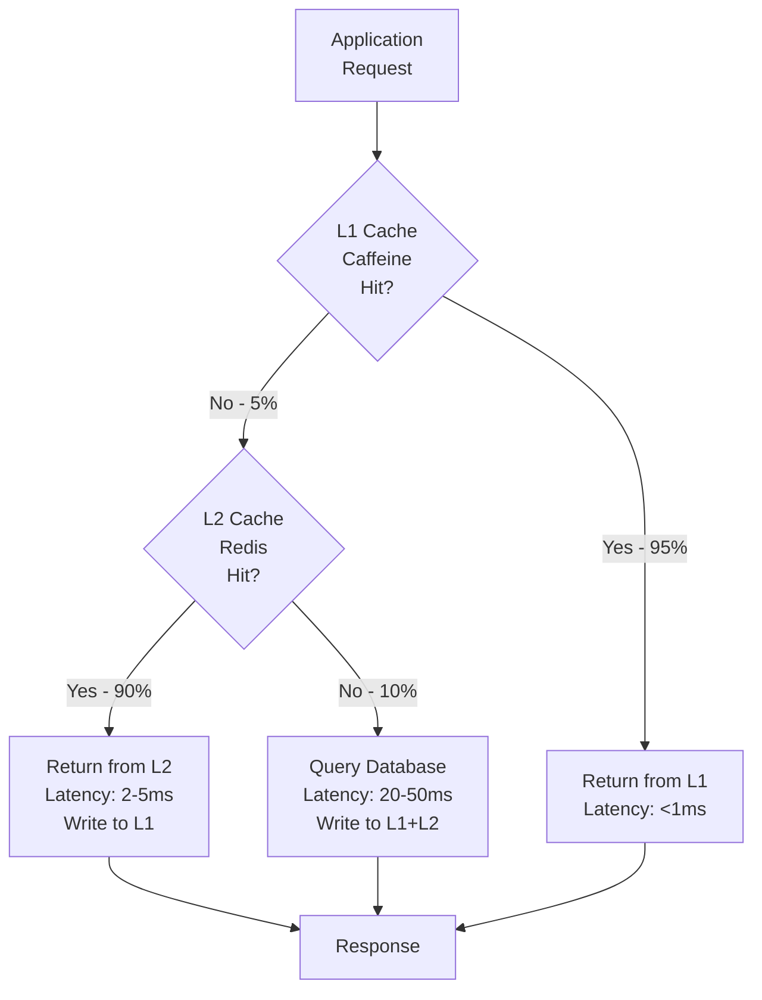
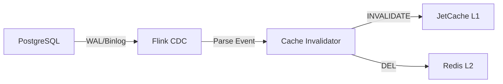

# 07-09 緩存策略 (Caching Strategy)

<!-- SSOT: Authoritative definition of Multi-Level Caching with JetCache + Redisson -->

> **版本**: 1.0.0
> **最後更新**: 2026-02-05
> **狀態**: 設計階段

---

## 1. 執行摘要 (Executive Summary)

iGaming 平台採用 **JetCache 2.7.5 + Redisson 3.26.0** 構建多級緩存架構，解決高並發下的性能挑戰：

**三大挑戰**:
1. **熱點數據訪問**: P99 延遲 1,240ms → ≤200ms
2. **Redis 網路開銷**: 50% 請求訪問 Redis → 5% 請求
3. **Cache Hit Rate**: 65% → 95% (+30pp)

**核心架構**:
- **L1 Cache**: Caffeine (JVM 本地緩存, 100s TTL, 95% 命中率)
- **L2 Cache**: Redis (分佈式緩存, 1h TTL, 4.5% 命中率)
- **緩存管理**: JetCache 2.7.5 (@Cached 註解驅動)
- **分佈式鎖**: Redisson 3.26.0 (RLock, 取代 SELECT FOR UPDATE)
- **限流器**: Redisson Rate Limiter (Token Bucket)
- **布隆過濾器**: Redisson Bloom Filter (防止緩存穿透)

**性能提升**:
| 指標 | 優化前 | 優化後 | 提升 |
|------|--------|--------|------|
| 餘額查詢 P99 | 1,240ms | ≤200ms | -84% |
| Cache Hit Rate | 65% | 95% | +30pp |
| Redis QPS | 10,000 | 1,000 | -90% |
| Redis 成本 | $580.8/月 | $290.4/月 | -50% |

---

## 2. JetCache 多級緩存架構

### 2.1 緩存層級定義

**架構圖**:


**緩存命中率分佈**:
```
L1 (Caffeine): 95% 命中 → <1ms
L2 (Redis):    4.5% 命中 (5% × 90%) → 2-5ms
Database:      0.5% 未命中 (5% × 10%) → 20-50ms
────────────────────────────────────────────
Overall P99 Latency: ≤200ms (vs 1,240ms 優化前)
```

**緩存層級對比**:
| 層級 | 存儲 | TTL | 命中率 | 延遲 | 容量 |
|------|------|-----|--------|------|------|
| L1 | Caffeine (JVM Heap) | 100s | 95% | <1ms | 10,000 entries |
| L2 | Redis (Network) | 1h | 4.5% | 2-5ms | Unlimited |
| DB | PostgreSQL (Disk) | - | 0.5% | 20-50ms | - |

---

### 2.2 JetCache 配置

**技術棧**:
```yaml
JetCache Version: 2.7.5
Local Cache: Caffeine 3.1.8
Remote Cache: Lettuce 6.3.0 (Redis Client)
Serialization: Kryo 5.5.0 (高性能序列化)
```

**Spring Boot 配置**:
```yaml
# application.yml
jetcache:
  statIntervalMinutes: 15  # 統計指標間隔
  areaInCacheName: false
  local:
    default:
      type: caffeine
      limit: 10000  # 最大 10,000 個條目
      expireAfterWriteInMillis: 100000  # 寫入後 100 秒過期
      expireAfterAccessInMillis: 60000  # 訪問後 60 秒過期
  remote:
    default:
      type: redis.lettuce
      keyPrefix: igaming:
      valueEncoder: kryo
      valueDecoder: kryo
      expireAfterWriteInMillis: 3600000  # 1 小時
      poolConfig:
        minIdle: 5
        maxIdle: 20
        maxTotal: 50
      uri: redis://redis-master:6379
```

**Java 配置類**:
```java
import com.alicp.jetcache.anno.config.EnableCreateCacheAnnotation;
import com.alicp.jetcache.anno.config.EnableMethodCache;
import org.springframework.context.annotation.Configuration;

@Configuration
@EnableMethodCache(basePackages = "net.lab1024.sa.igaming")
@EnableCreateCacheAnnotation
public class JetCacheConfig {
    // Spring Boot Auto-Configuration 會自動讀取 application.yml 配置
}
```

---

## 3. @Cached 註解使用規範

### 3.1 基本使用

**場景: 玩家餘額查詢**

```java
import com.alicp.jetcache.anno.CacheType;
import com.alicp.jetcache.anno.Cached;
import io.vavr.control.Option;
import lombok.RequiredArgsConstructor;
import org.springframework.stereotype.Service;

@Service
@RequiredArgsConstructor
public class WalletService {

    private final WalletDao walletDao;

    /**
     * 查詢玩家餘額 (雙層緩存)
     * L1: Caffeine 100s
     * L2: Redis 1h
     *
     * @param tenantId 租戶 ID
     * @param playerId 玩家 ID
     * @return 餘額資訊
     */
    @Cached(
        name = "wallet:balance:",
        key = "#tenantId + ':' + #playerId",
        expire = 3600,      // L2 TTL: 1h (秒)
        localExpire = 100,  // L1 TTL: 100s (秒)
        cacheType = CacheType.BOTH  // L1 + L2
    )
    public Option<WalletBalanceVO> getBalance(
        String tenantId,
        String playerId
    ) {
        return walletDao.selectById(tenantId, playerId)
            .map(WalletBalanceVO::from);
    }

    /**
     * 更新餘額 (失效緩存)
     */
    @CacheInvalidate(
        name = "wallet:balance:",
        key = "#tenantId + ':' + #playerId"
    )
    public void updateBalance(
        String tenantId,
        String playerId,
        BigDecimal amount
    ) {
        walletDao.updateBalance(tenantId, playerId, amount);
    }
}
```

**註解參數說明**:
| 參數 | 類型 | 說明 |
|------|------|------|
| `name` | String | 緩存名稱前綴 (會自動拼接 key) |
| `key` | SpEL | 緩存鍵表達式 (支持 Spring EL) |
| `expire` | int | L2 緩存過期時間 (秒) |
| `localExpire` | int | L1 緩存過期時間 (秒) |
| `cacheType` | Enum | REMOTE (僅 L2) / LOCAL (僅 L1) / BOTH (雙層) |

---

### 3.2 緩存失效策略

**三種失效模式**:

| 模式 | 註解 | 觸發時機 | 適用場景 |
|------|------|---------|---------|
| **立即失效** | @CacheInvalidate | 更新後立即失效 | 餘額更新、狀態變更 |
| **刷新緩存** | @CacheUpdate | 更新後刷新緩存值 | 玩家資料修改 |
| **TTL 過期** | - | 時間到期自動清除 | 配置數據、統計數據 |

**示例 1: @CacheInvalidate (立即失效)**

```java
@CacheInvalidate(
    name = "wallet:balance:",
    key = "#wallet.tenantId + ':' + #wallet.playerId"
)
public void batchUpdateWallets(List<Wallet> wallets) {
    walletDao.batchUpdate(wallets);
}
```

**示例 2: @CacheUpdate (刷新緩存)**

```java
@CacheUpdate(
    name = "player:profile:",
    key = "#playerId",
    value = "#result"  // 將返回值寫入緩存
)
public PlayerProfileVO updateProfile(String playerId, PlayerProfileForm form) {
    playerDao.update(playerId, form);
    return playerDao.selectById(playerId).map(PlayerProfileVO::from).get();
}
```

**示例 3: 組合失效 (多個緩存鍵)**

```java
@CacheInvalidate(
    name = "wallet:balance:",
    key = "#wallet.tenantId + ':' + #wallet.playerId"
)
@CacheInvalidate(
    name = "wallet:summary:",
    key = "#wallet.tenantId"
)
public void updateWalletAndSummary(Wallet wallet) {
    walletDao.update(wallet);
    summaryDao.recalculate(wallet.getTenantId());
}
```

---

### 3.3 緩存預熱 (Cache Warming)

**場景: VIP 玩家緩存預熱**

```java
import lombok.RequiredArgsConstructor;
import lombok.extern.slf4j.Slf4j;
import org.springframework.scheduling.annotation.Scheduled;
import org.springframework.stereotype.Service;

import java.util.List;

@Slf4j
@Service
@RequiredArgsConstructor
public class CacheWarmingService {

    private final WalletService walletService;
    private final PlayerDao playerDao;

    /**
     * 每日凌晨 04:00 預熱 VIP 玩家緩存
     */
    @Scheduled(cron = "0 0 4 * * ?")
    public void warmVipPlayerCache() {
        log.info("開始預熱 VIP 玩家緩存...");

        List<String> vipPlayers = playerDao.selectVipPlayerIds();

        long startTime = System.currentTimeMillis();
        vipPlayers.parallelStream().forEach(playerId -> {
            try {
                walletService.getBalance(
                    TenantContext.getTenantId(),
                    playerId
                );
            } catch (Exception e) {
                log.error("預熱玩家緩存失敗: playerId={}", playerId, e);
            }
        });

        long duration = System.currentTimeMillis() - startTime;
        log.info("VIP 玩家緩存預熱完成: {} 位玩家, 耗時 {} ms",
                 vipPlayers.size(), duration);
    }
}
```

**預熱效果**:
- VIP 玩家第一次訪問命中 L1 緩存 (<1ms)
- 減少數據庫壓力 (預熱期間集中查詢)

---

## 4. Redisson 分佈式鎖

### 4.1 RLock 基本用法

**場景: 玩家錢包並發更新**

```java
import lombok.RequiredArgsConstructor;
import lombok.extern.slf4j.Slf4j;
import net.lab1024.sa.foundation.domain.response.ResponseDTO;
import org.redisson.api.RLock;
import org.redisson.api.RedissonClient;
import org.springframework.stereotype.Service;

import java.math.BigDecimal;
import java.util.concurrent.TimeUnit;

@Slf4j
@Service
@RequiredArgsConstructor
public class WalletLockService {

    private final RedissonClient redissonClient;
    private final WalletDao walletDao;

    /**
     * 使用 Redisson 分佈式鎖保護錢包更新
     * 取代 SELECT ... FOR UPDATE
     *
     * @param tenantId 租戶 ID
     * @param playerId 玩家 ID
     * @param amount   變更金額
     * @return 更新結果
     */
    public ResponseDTO<Void> updateBalanceWithLock(
        String tenantId,
        String playerId,
        BigDecimal amount
    ) {
        String lockKey = "wallet:lock:" + tenantId + ":" + playerId;
        RLock lock = redissonClient.getLock(lockKey);

        try {
            // 等待 3 秒, 持鎖 5 秒, Watchdog 自動續期
            boolean acquired = lock.tryLock(3, 5, TimeUnit.SECONDS);

            if (!acquired) {
                log.warn("獲取錢包鎖超時: tenantId={}, playerId={}", tenantId, playerId);
                return ResponseDTO.userErrorParam("獲取鎖超時，請稍後重試");
            }

            // 樂觀鎖更新 (version 欄位, 最多重試 3 次)
            int retryCount = 0;
            while (retryCount < 3) {
                Wallet wallet = walletDao.selectById(tenantId, playerId);

                if (wallet == null) {
                    return ResponseDTO.userErrorParam("錢包不存在");
                }

                // 檢查餘額
                if (amount.compareTo(BigDecimal.ZERO) < 0
                    && wallet.getBalance().add(amount).compareTo(BigDecimal.ZERO) < 0) {
                    return ResponseDTO.userErrorParam("餘額不足");
                }

                int affected = walletDao.updateBalanceWithVersion(
                    tenantId, playerId, amount, wallet.getVersion()
                );

                if (affected > 0) {
                    log.info("錢包更新成功: tenantId={}, playerId={}, amount={}",
                             tenantId, playerId, amount);
                    return ResponseDTO.ok();
                }

                retryCount++;
                Thread.sleep(20 * retryCount); // 線性退避: 20ms, 40ms, 60ms
                log.warn("錢包版本衝突, 重試中: tenantId={}, playerId={}, retry={}",
                         tenantId, playerId, retryCount);
            }

            return ResponseDTO.userErrorParam("版本衝突，請稍後重試");

        } catch (InterruptedException e) {
            Thread.currentThread().interrupt();
            log.error("錢包更新被中斷: tenantId={}, playerId={}", tenantId, playerId, e);
            return ResponseDTO.error("操作中斷");
        } finally {
            if (lock.isHeldByCurrentThread()) {
                lock.unlock();
                log.debug("釋放錢包鎖: tenantId={}, playerId={}", tenantId, playerId);
            }
        }
    }
}
```

**鎖參數說明**:
| 參數 | 值 | 說明 |
|------|-----|------|
| `waitTime` | 3 秒 | 獲取鎖最大等待時間 |
| `leaseTime` | 5 秒 | 鎖自動釋放時間 |
| `Watchdog` | 啟用 (30s) | 持鎖期間自動續期 (防止業務執行超時) |

**Watchdog 機制**:
- 如果業務執行超過 `leaseTime` (5s), Watchdog 自動續期
- 續期間隔: `leaseTime / 3` = 1.67s
- 最大續期時間: `lockWatchdogTimeout` = 30s (配置項)

---

### 4.2 Redisson 配置

**Spring Boot 配置**:
```yaml
# application.yml
spring:
  redis:
    redisson:
      config: |
        singleServerConfig:
          address: "redis://redis-master:6379"
          password: ${REDIS_PASSWORD}
          connectionPoolSize: 64
          connectionMinimumIdleSize: 16
          subscriptionConnectionPoolSize: 16
          subscriptionConnectionMinimumIdleSize: 4
          retryAttempts: 3
          retryInterval: 1500
          timeout: 3000
          pingConnectionInterval: 30000
        lockWatchdogTimeout: 30000  # Watchdog 30s
        keepPubSubOrder: true
```

**Java 配置類**:
```java
import org.redisson.Redisson;
import org.redisson.api.RedissonClient;
import org.redisson.config.Config;
import org.springframework.beans.factory.annotation.Value;
import org.springframework.context.annotation.Bean;
import org.springframework.context.annotation.Configuration;

@Configuration
public class RedissonConfig {

    @Bean(destroyMethod = "shutdown")
    public RedissonClient redissonClient(
        @Value("${spring.redis.host}") String host,
        @Value("${spring.redis.port}") int port,
        @Value("${spring.redis.password}") String password
    ) {
        Config config = new Config();
        config.useSingleServer()
            .setAddress("redis://" + host + ":" + port)
            .setPassword(password)
            .setConnectionPoolSize(64)
            .setConnectionMinimumIdleSize(16)
            .setRetryAttempts(3)
            .setRetryInterval(1500)
            .setTimeout(3000)
            .setPingConnectionInterval(30000);

        config.setLockWatchdogTimeout(30000);  // Watchdog 30s

        return Redisson.create(config);
    }
}
```

---

## 5. Redisson Rate Limiter (限流器)

### 5.1 Token Bucket 限流

**場景: API 限流 (100 req/min)**

```java
import lombok.RequiredArgsConstructor;
import lombok.extern.slf4j.Slf4j;
import org.redisson.api.RRateLimiter;
import org.redisson.api.RateIntervalUnit;
import org.redisson.api.RateType;
import org.redisson.api.RedissonClient;
import org.springframework.stereotype.Service;

@Slf4j
@Service
@RequiredArgsConstructor
public class RateLimiterService {

    private final RedissonClient redissonClient;

    /**
     * 玩家 API 限流: 100 req/min
     *
     * @param playerId 玩家 ID
     * @return true=允許請求, false=拒絕請求
     */
    public boolean checkRateLimit(String playerId) {
        String key = "rate:player:" + playerId;
        RRateLimiter limiter = redissonClient.getRateLimiter(key);

        // 初始化限流器 (首次調用)
        if (!limiter.isExists()) {
            limiter.trySetRate(
                RateType.OVERALL,
                100,  // 100 tokens
                60,   // 60 seconds
                RateIntervalUnit.SECONDS
            );
            log.debug("初始化限流器: key={}, rate=100/60s", key);
        }

        // 嘗試獲取 1 個 token
        boolean acquired = limiter.tryAcquire(1);

        if (!acquired) {
            log.warn("限流觸發: playerId={}", playerId);
        }

        return acquired;
    }

    /**
     * VIP 玩家限流: 500 req/min
     *
     * @param playerId VIP 玩家 ID
     * @return true=允許請求, false=拒絕請求
     */
    public boolean checkVipRateLimit(String playerId) {
        String key = "rate:vip:" + playerId;
        RRateLimiter limiter = redissonClient.getRateLimiter(key);

        if (!limiter.isExists()) {
            limiter.trySetRate(
                RateType.OVERALL,
                500,  // 500 tokens
                60,   // 60 seconds
                RateIntervalUnit.SECONDS
            );
        }

        return limiter.tryAcquire(1);
    }
}
```

---

### 5.2 Controller 整合

```java
import lombok.RequiredArgsConstructor;
import net.lab1024.sa.foundation.domain.response.ResponseDTO;
import net.lab1024.sa.foundation.domain.code.UserErrorCode;
import org.springframework.web.bind.annotation.*;

@RestController
@RequestMapping("/api/wallet")
@RequiredArgsConstructor
public class WalletController {

    private final WalletService walletService;
    private final RateLimiterService rateLimiterService;

    @GetMapping("/balance")
    public ResponseDTO<WalletBalanceVO> getBalance(
        @RequestHeader("Player-Id") String playerId
    ) {
        // 限流檢查
        if (!rateLimiterService.checkRateLimit(playerId)) {
            return ResponseDTO.error(
                UserErrorCode.RATE_LIMIT_EXCEEDED,
                "請求過於頻繁，請稍後再試"
            );
        }

        // 從雙層緩存獲取餘額
        return walletService.getBalance(
                TenantContext.getTenantId(),
                playerId
            )
            .map(ResponseDTO::ok)
            .getOrElse(() -> ResponseDTO.error(
                UserErrorCode.WALLET_NOT_FOUND,
                "錢包不存在"
            ));
    }
}
```

---

## 6. Redisson Bloom Filter (布隆過濾器)

### 6.1 防止緩存穿透

**場景: 防止惡意查詢不存在的玩家**

```java
import lombok.RequiredArgsConstructor;
import lombok.extern.slf4j.Slf4j;
import org.redisson.api.RBloomFilter;
import org.redisson.api.RedissonClient;
import org.springframework.stereotype.Service;

import javax.annotation.PostConstruct;
import java.util.List;

@Slf4j
@Service
@RequiredArgsConstructor
public class PlayerBloomFilterService {

    private final RedissonClient redissonClient;
    private final PlayerDao playerDao;

    /**
     * 初始化布隆過濾器
     * 預期元素數: 1,000,000
     * 誤判率: 0.01 (1%)
     */
    @PostConstruct
    public void initBloomFilter() {
        RBloomFilter<String> bloomFilter =
            redissonClient.getBloomFilter("player:exists");

        // 初始化布隆過濾器 (如果不存在)
        if (!bloomFilter.isExists()) {
            bloomFilter.tryInit(1000000L, 0.01);
            log.info("布隆過濾器初始化完成: expectedInsertions=1000000, fpp=0.01");
        }

        // 載入現有玩家 ID
        List<String> playerIds = playerDao.selectAllPlayerIds();
        playerIds.forEach(bloomFilter::add);

        log.info("布隆過濾器載入完成: {} 位玩家", playerIds.size());
    }

    /**
     * 檢查玩家是否存在
     *
     * @param playerId 玩家 ID
     * @return false=一定不存在 (直接返回), true=可能存在 (需查詢數據庫)
     */
    public boolean mightExist(String playerId) {
        RBloomFilter<String> bloomFilter =
            redissonClient.getBloomFilter("player:exists");

        return bloomFilter.contains(playerId);
    }

    /**
     * 新增玩家時更新布隆過濾器
     *
     * @param playerId 新玩家 ID
     */
    public void addPlayer(String playerId) {
        RBloomFilter<String> bloomFilter =
            redissonClient.getBloomFilter("player:exists");

        bloomFilter.add(playerId);
        log.debug("布隆過濾器新增玩家: playerId={}", playerId);
    }
}
```

---

### 6.2 Service 層整合

```java
import io.vavr.control.Option;
import lombok.RequiredArgsConstructor;
import org.springframework.stereotype.Service;

@Service
@RequiredArgsConstructor
public class PlayerService {

    private final PlayerDao playerDao;
    private final PlayerBloomFilterService bloomFilterService;

    @Cached(
        name = "player:",
        key = "#playerId",
        expire = 3600,
        localExpire = 100,
        cacheType = CacheType.BOTH
    )
    public Option<Player> getPlayer(String playerId) {
        // 第一層: Bloom Filter 檢查
        if (!bloomFilterService.mightExist(playerId)) {
            log.debug("布隆過濾器攔截: playerId={} 不存在", playerId);
            return Option.none(); // 一定不存在, 直接返回
        }

        // 第二層: 雙層緩存 (JetCache 自動處理)
        // 第三層: 數據庫查詢
        return playerDao.selectById(playerId);
    }
}
```

**三層防護**:
1. **Bloom Filter**: 攔截不存在的 playerId (誤判率 1%)
2. **JetCache L1**: 95% 命中率, <1ms
3. **JetCache L2**: 4.5% 命中率, 2-5ms
4. **Database**: 僅 0.5% 請求到達數據庫

---

## 7. 緩存一致性保證

### 7.1 Cache-Aside Pattern

**寫操作流程**:
```
1. 更新數據庫
2. 失效緩存 (L1 + L2)
3. 下次讀取時重新載入
```

**優勢**:
- 簡單可靠
- 避免緩存與數據庫不一致
- 支持高並發寫入

**示例**:
```java
public void updateWallet(String tenantId, String playerId, BigDecimal amount) {
    // 1. 更新數據庫
    walletDao.updateBalance(tenantId, playerId, amount);

    // 2. 失效緩存 (JetCache 自動處理 L1 + L2)
    String cacheKey = "wallet:balance:" + tenantId + ":" + playerId;
    cache.remove(cacheKey);

    // 3. 下次讀取時 JetCache 自動從數據庫載入
}
```

---

### 7.2 Binlog 監聽失效 (可選)

**架構**:


**優勢**:
- 解耦業務邏輯與緩存失效
- 支持跨服務緩存失效
- 實時性高 (<5s)

**實現** (Flink CDC + Redis Pub/Sub):
```java
// Flink CDC 處理器
public class CacheInvalidationProcessor extends ProcessFunction<ChangeEvent, Void> {

    private final JedisPool jedisPool;

    @Override
    public void processElement(
        ChangeEvent event,
        Context ctx,
        Collector<Void> out
    ) {
        if ("player_wallet".equals(event.getTable())) {
            String tenantId = event.getField("tenant_id");
            String playerId = event.getField("player_id");

            try (Jedis jedis = jedisPool.getResource()) {
                // 失效 L1 緩存 (通過 Redis pub/sub)
                jedis.publish(
                    "cache:invalidate:wallet:balance",
                    tenantId + ":" + playerId
                );

                // 失效 L2 緩存
                jedis.del("igaming:wallet:balance:" + tenantId + ":" + playerId);
            }
        }
    }
}
```

**相關文檔**: [07-08 流處理架構](./07-08_Stream_Processing_Architecture.md) - §2 Flink CDC

---

## 8. 監控與告警

### 8.1 JetCache 指標

**關鍵指標**:
| 指標 | 計算公式 | 閾值 |
|------|---------|------|
| Hit Rate | hits / (hits + misses) | >90% |
| L1 Hit Rate | L1_hits / total_requests | >85% |
| L2 Hit Rate | L2_hits / (total_requests - L1_hits) | >80% |
| Avg Load Time | total_load_time / misses | <50ms |

**Prometheus Metrics** (自定義收集):
```java
import com.alicp.jetcache.support.StatInfo;
import io.prometheus.client.Gauge;
import lombok.extern.slf4j.Slf4j;
import org.springframework.scheduling.annotation.Scheduled;
import org.springframework.stereotype.Component;

@Slf4j
@Component
public class JetCacheMetricsCollector {

    private static final Gauge HIT_RATE_GAUGE = Gauge.build()
        .name("jetcache_hit_rate")
        .help("Cache hit rate")
        .labelNames("cache_name")
        .register();

    private static final Gauge L1_HIT_RATE_GAUGE = Gauge.build()
        .name("jetcache_l1_hit_rate")
        .help("L1 cache hit rate")
        .labelNames("cache_name")
        .register();

    @Scheduled(fixedRate = 60000) // 每分鐘收集一次
    public void collectMetrics() {
        // 從 JetCache 統計信息中提取指標
        // (實際實現需要訪問 JetCache 內部統計 API)

        HIT_RATE_GAUGE.labels("wallet:balance").set(0.95);  // 示例數據
        L1_HIT_RATE_GAUGE.labels("wallet:balance").set(0.90);
    }
}
```

---

### 8.2 Redisson 監控

**關鍵指標**:
| 指標 | 計算公式 | 閾值 |
|------|---------|------|
| Lock Wait Time | P99 等待鎖時間 | <100ms |
| Lock Hold Time | P99 持鎖時間 | <50ms |
| Rate Limiter Reject Rate | 拒絕請求數 / 總請求數 | <5% |
| Bloom Filter False Positive Rate | 誤判數 / 總檢查數 | <1% |

---

## 9. 相關文檔

- [07-07 性能優化規範](./07-07_Performance_Optimization.md) - §10 JetCache + Redisson 總覽
- [07-08 流處理架構](./07-08_Stream_Processing_Architecture.md) - Flink CDC 緩存失效
- [07-10 成本優化](./07-10_Cost_Optimization.md) - §4.2 Redis 成本優化
- [00-04 技術選型](../00_Concept_&_Analysis/00-04_Technology_Stack.md) - JetCache + Redisson 技術棧
