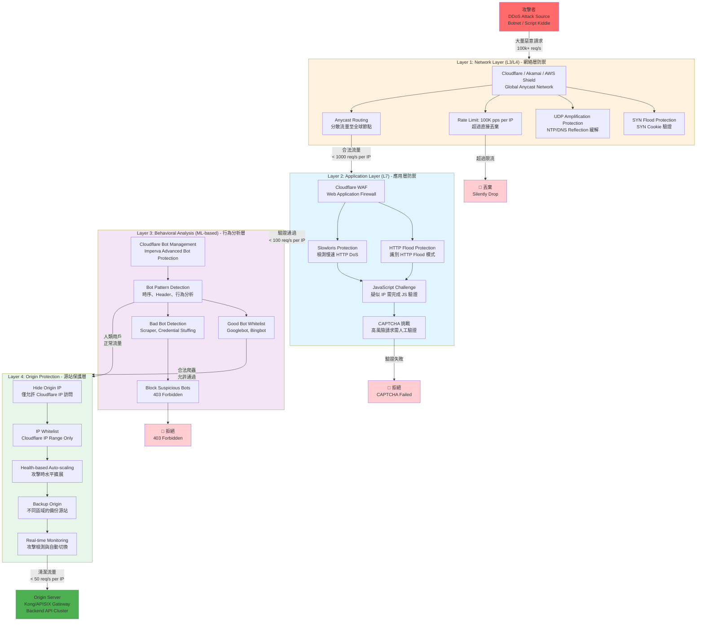

# 07-02-03 網關安全與監控 (Gateway Security & Monitoring)

## 1. DDoS 緩解策略 (DDoS Mitigation)

### 3.5.1 多層 DDoS 防禦架構

##### 📊 Diagram 3: 多層 DDoS 防禦架構 (Multi-Layer DDoS Defense Architecture)



**防禦層詳細說明**:

| 防禦層 | 防護範圍 | 攻擊類型 | 處置措施 | 誤殺率 | 成本 |
|--------|----------|----------|----------|--------|------|
| **Layer 1: Network (L3/L4)** | SYN Flood, UDP Amplification, ICMP Flood | 網絡層 DDoS | SYN Cookie, 流量清洗, 黑洞路由 | 極低 (< 0.01%) | $$$$ (CDN 費用) |
| **Layer 2: Application (L7)** | HTTP Flood, Slowloris, GET/POST Flood | 應用層 DDoS | JS Challenge, CAPTCHA, Rate Limit | 低 (< 1%) | $$$ (WAF 費用) |
| **Layer 3: Behavioral (ML)** | Bot Scraping, Credential Stuffing, API Abuse | 自動化攻擊 | Bot 指紋識別, 行為分析, 機器學習 | 中 (1-5%) | $$ (Bot Management) |
| **Layer 4: Origin Protection** | 繞過 CDN 的直接攻擊 | 源站直接攻擊 | IP 白名單, Auto-scaling, 故障轉移 | 極低 (< 0.01%) | $ (Infrastructure) |

**防禦效果分析**:

**攻擊場景 1: 大規模 DDoS 攻擊 (100Gbps)**
```
攻擊流量: 100 Gbps (約 100k pps)
├─ Layer 1 (Cloudflare): 吸收 95 Gbps (Anycast 分散)
│  └─ 剩餘: 5 Gbps 通過
├─ Layer 2 (WAF): 識別 HTTP Flood，攔截 4 Gbps
│  └─ 剩餘: 1 Gbps 通過
├─ Layer 3 (Bot Management): 識別自動化工具，攔截 0.8 Gbps
│  └─ 剩餘: 0.2 Gbps 通過
└─ Layer 4 (Origin): Auto-scaling 水平擴展，承受 0.2 Gbps

結果: ✅ 源站安全（僅承受 0.2% 原始攻擊流量）
```

**攻擊場景 2: 慢速 HTTP DoS (Slowloris)**
```
攻擊特徵: 保持大量 HTTP 連接，但極慢傳輸
├─ Layer 1: 通過（網絡層無法檢測）
├─ Layer 2 (Slowloris Protection): 檢測到慢速連接
│  └─ 強制關閉超過 30 秒未完成的連接
│  └─ 攔截率: 99%
└─ Layer 3: 不需要（已在 Layer 2 攔截）

結果: ✅ 攻擊失敗（Layer 2 攔截）
```

**攻擊場景 3: 分散式爬蟲 (Distributed Scraping)**
```
攻擊特徵: 10,000 個不同 IP 緩慢爬取數據
├─ Layer 1: 通過（單 IP 流量正常）
├─ Layer 2: 通過（HTTP 行為正常）
├─ Layer 3 (Bot Management): 識別爬蟲特徵
│  ├─ User-Agent 模式識別 (85% 檢出)
│  ├─ Header 指紋識別 (10% 檢出)
│  └─ 行為時序分析 (5% 檢出)
│  └─ 總攔截率: 98%
└─ Layer 4: 剩餘 2% 通過（可接受範圍）

結果: ✅ 爬蟲大量攔截（98%）
```

**攻擊場景 4: 繞過 CDN 直接攻擊源站**
```
攻擊方式: 攻擊者發現源站真實 IP，繞過 Cloudflare
├─ Layer 1-3: 繞過（未經過 CDN）
└─ Layer 4 (Origin Protection):
   ├─ IP Whitelist: 僅允許 Cloudflare IP
   │  └─ 攔截所有非 Cloudflare IP 的請求
   └─ 結果: ❌ 攻擊失敗（源站拒絕連接）

結果: ✅ 源站受保護（IP 白名單生效）
```

**配置範例**:

**Cloudflare 配置 (Layer 1 + 2)**:
```terraform
resource "cloudflare_zone_settings_override" "igaming" {
  zone_id = var.zone_id

  settings {
    # Layer 1: Network DDoS
    security_level = "high"
    challenge_ttl  = 1800

    # Layer 2: Application DDoS
    waf {
      enabled = true
      mode    = "on"
    }

    rate_limiting {
      enabled = true
    }

    # Bot Management (Layer 3)
    bot_management {
      enabled    = true
      fight_mode = true
    }
  }
}

resource "cloudflare_rate_limit" "api_protection" {
  zone_id   = var.zone_id
  threshold = 100
  period    = 1
  match {
    request {
      url_pattern = "api.casino.com/*"
    }
  }
  action {
    mode    = "challenge"
    timeout = 60
  }
}
```

**Origin Server 配置 (Layer 4)**:
```nginx
# Nginx: 僅允許 Cloudflare IP
http {
    # Cloudflare IP Whitelist
    geo $cloudflare_ip {
        default          0;
        173.245.48.0/20  1;
        103.21.244.0/22  1;
        # ... (完整 Cloudflare IP 列表)
    }

    server {
        listen 443 ssl;
        server_name api.casino.com;

        # Block non-Cloudflare IPs
        if ($cloudflare_ip = 0) {
            return 403 "Direct access forbidden";
        }

        # Auto-scaling based on load
        upstream backend {
            least_conn;
            server backend-1.internal:8080 weight=5;
            server backend-2.internal:8080 weight=5;
            server backend-3.internal:8080 weight=5 backup;
        }

        location / {
            proxy_pass http://backend;
            limit_req zone=api_limit burst=20;
        }
    }
}
```

**監控與告警**:
```
# Prometheus Alert Rules
groups:
  - name: ddos-protection
    rules:
      - alert: DDoSAttackDetected
        expr: rate(cloudflare_requests_blocked[5m]) > 1000
        for: 1m
        labels:
          severity: critical
        annotations:
          summary: "DDoS attack detected"
          description: "Cloudflare blocking {{ $value }} req/s"

      - alert: OriginUnderAttack
        expr: rate(nginx_http_requests_total{status="403"}[5m]) > 100
        for: 2m
        labels:
          severity: warning
        annotations:
          summary: "Origin receiving direct attack attempts"
```

**成本估算**:

| 防禦層 | 提供商 | 月費用 (估算) | 流量費用 | 備註 |
|--------|--------|---------------|----------|------|
| Layer 1 + 2 | Cloudflare Pro | $200/月 | $0.04/GB | 包含基礎 DDoS 防護 |
| Layer 3 | Cloudflare Bot Management | $1,000/月 | - | ML-based Bot 檢測 |
| Layer 4 | AWS Auto-scaling | $500/月 | 按使用計費 | 基礎設施成本 |
| **總計** | - | **$1,700/月** | + 流量費 | 適用於中型 iGaming 平台 |

### 3.5.2 Cloudflare 整合配置

```terraform
# Terraform: Cloudflare Zone Configuration
resource "cloudflare_zone_settings_override" "igaming_zone" {
  zone_id = var.cloudflare_zone_id

  settings {
    # DDoS Protection
    security_level = "high"  # Challenge suspicious visitors
    challenge_ttl  = 1800    # Challenge valid for 30 min

    # Rate Limiting
    rate_limiting {
      enabled = true
    }

    # Bot Management
    bot_management {
      enabled = true
      fight_mode = true
    }

    # WAF
    waf {
      enabled = true
      mode    = "on"
    }

    # Cache Everything (reduce origin load)
    cache_level = "aggressive"

    # HTTP/3 (QUIC) for performance
    http3 = "on"

    # TLS Settings
    min_tls_version       = "1.2"
    automatic_https_rewrites = "on"
  }
}

# Rate Limiting Rule
resource "cloudflare_rate_limit" "api_global" {
  zone_id   = var.cloudflare_zone_id
  threshold = 100
  period    = 1  # seconds
  match {
    request {
      url_pattern = "api.casino.com/*"
    }
  }
  action {
    mode    = "challenge"  # or "block"
    timeout = 60
  }
}
```

## 3.6 API 版本管理策略 (API Versioning Strategy)

### 3.6.1 版本策略選擇

| 策略 | 範例 | 優點 | 缺點 | 推薦 |
|---|---|---|---|---|
| **URL Path** | `/v1/players`, `/v2/players` | 清晰，易於路由 | URL 冗長 | ✅ 推薦 |
| **Header** | `Accept: application/vnd.api+json; version=2` | URL 乾淨 | 難以測試，不直觀 | ❌ |
| **Query Param** | `/players?version=2` | 簡單 | 易被忽略，難以強制 | ❌ |
| **Content Negotiation** | `Accept: application/vnd.casino.v2+json` | RESTful | 複雜 | ❌ |

### 3.6.2 版本生命週期管理

```
[API Version Lifecycle]
┌──────────────────────────────────────────────────────────────┐
│  v1.0 (Current Stable)                                       │
│  - Released: 2025-01-01                                      │
│  - Status: Supported                                         │
│  - EOL: 2027-01-01 (2 years support)                         │
├──────────────────────────────────────────────────────────────┤
│  v2.0 (New Release)                                          │
│  - Released: 2026-01-01                                      │
│  - Status: Supported                                         │
│  - Deprecate v1.0 starting: 2026-07-01 (6 months notice)    │
├──────────────────────────────────────────────────────────────┤
│  v1.0 (Deprecated)                                           │
│  - Deprecation Notice: 2026-07-01                            │
│  - Warning header: "Warning: 299 - API v1 deprecated"       │
│  - Documentation marked as deprecated                        │
│  - No new features, security fixes only                      │
│  - EOL: 2027-01-01 (6 months after deprecation)             │
└──────────────────────────────────────────────────────────────┘
```

### 3.6.3 版本路由配置

**Kong/APISIX Configuration**:

```yaml
services:
  - name: player-service-v1
    url: http://player-service-v1.internal:8080
    routes:
      - name: player-v1-route
        paths:
          - /v1/players
        strip_path: true
    plugins:
      - name: response-transformer
        config:
          add:
            headers:
              - "X-API-Version: 1.0"
              - "X-API-Deprecated: true"
              - "X-API-EOL: 2027-01-01"

  - name: player-service-v2
    url: http://player-service-v2.internal:8080
    routes:
      - name: player-v2-route
        paths:
          - /v2/players
        strip_path: true
    plugins:
      - name: response-transformer
        config:
          add:
            headers:
              - "X-API-Version: 2.0"
```

### 3.6.4 廢棄通知機制

```javascript
// v1 API Response (Deprecated)
HTTP/1.1 200 OK
X-API-Version: 1.0
X-API-Deprecated: true
X-API-Deprecation-Date: 2026-07-01
X-API-EOL-Date: 2027-01-01
X-API-Migration-Guide: https://docs.casino.com/api/migration-v1-to-v2
Warning: 299 - "API v1 is deprecated and will be removed on 2027-01-01. Please migrate to v2."

{
  "data": {...},
  "meta": {
    "deprecation_warning": {
      "message": "This API version is deprecated",
      "sunset_date": "2027-01-01",
      "replacement": "/v2/players",
      "migration_guide": "https://docs.casino.com/api/migration-v1-to-v2"
    }
  }
}
```

## 3.7 監控與告警 (Gateway Monitoring)

### 3.7.1 關鍵指標

| 指標 | 正常範圍 | Warning Threshold | Critical Threshold |
|---|---|---|---|
| Gateway Latency P99 | < 50ms | > 100ms | > 200ms |
| Upstream Latency P99 | < 200ms | > 500ms | > 1000ms |
| Error Rate (5xx) | < 0.1% | > 1% | > 5% |
| Rate Limit Hit Rate | < 1% | > 5% | > 10% |
| Circuit Breaker Trips | 0/hour | > 3/hour | > 10/hour |
| DDoS Attack Volume | 0 | Moderate | Severe |

### 3.7.2 監控儀表板

```
[API Gateway Dashboard (Grafana)]
┌──────────────────────────────────────────────────────────────┐
│  Traffic Overview (Last 1 Hour)                              │
│  - Total Requests: 5.2M (1,444 req/s avg)                    │
│  - Success Rate: 99.92% (4,158 errors)                       │
│  - Blocked by Rate Limit: 12,345 (0.24%)                     │
│  - Blocked by WAF: 8,901 (0.17%)                             │
├──────────────────────────────────────────────────────────────┤
│  Top Endpoints (by QPS)                                      │
│  1. GET /api/v1/games/lobby - 456 req/s                     │
│  2. POST /api/v1/wallet/balance - 234 req/s                 │
│  3. POST /api/v1/auth/refresh - 189 req/s                   │
├──────────────────────────────────────────────────────────────┤
│  Top Error Sources                                           │
│  1. 503 from game-provider-pragmatic (timeout) - 2,103      │
│  2. 429 rate limit /api/auth/login - 5,678                  │
│  3. 500 internal error /api/wallet/transfer - 234           │
├──────────────────────────────────────────────────────────────┤
│  Circuit Breaker Status                                      │
│  - game-provider-pragmatic: OPEN (Tripped 5 min ago)        │
│  - payment-gateway-nuvei: CLOSED (Healthy)                   │
│  - risk-engine: CLOSED (Healthy)                             │
└──────────────────────────────────────────────────────────────┘
```

---

**文件版本**: V2.0 (Enhanced)
**最後更新**: 2026-01-27
**狀態**: Architecture-Level Complete

## 4. 安全防護 (WAF Integration)

### 4.1 ModSecurity / Coraza
*   **SQL Injection**: 攔截包含 `UNION SELECT`, `DROP TABLE` 的請求。
*   **XSS**: 攔截包含 `<script>` 的 Payload。
*   **Bot Protection**: 攔截 User-Agent 為 `curl`, `python-requests` 的非瀏覽器流量 (除非是授權的 Server-to-Server API)。

---

**文檔版本**: 1.0.0
**最後更新**: 2026-01-28
**維護團隊**: DevOps Team & SRE Team

---

## 📚 相關文檔

### 前置依賴
- [00-04 技術棧](../00_Concept_&_Analysis/00-04_Technology_Stack.md) - 技術選型

### 相關文檔
- [12-01 部署架構](./07-01_Deployment.md) - 部署策略
- [09-01 權限控制](../05_Platform_Governance_NEW/05-02_RBAC_Permissions.md) - 網關鑑權
