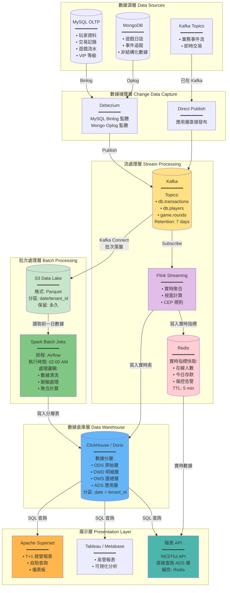

# 06-01 報表與 BI 架構 (Reporting & BI Architecture)

> **MIGRATED FROM**:
> - 08-04_Reporting_Architecture.md (470 lines)
> - 10-04_Data_Pipeline_Architecture.md (data pipeline sections, ~250 lines)
>
> **Version**: 2.0.0
> **Last Updated**: 2026-02-04
> **Merge Strategy**: 完整數據管道 + BI 架構整合

---

## 📋 目錄

1. [系統概述](#1-系統概述-system-overview)
2. [數據管道架構](#2-數據管道架構-data-pipeline-architecture)
3. [數據分層架構](#3-數據分層架構-data-layering-architecture)
4. [報表類型體系](#4-報表類型體系-report-classification)
5. [BI 工具選型](#5-bi-工具選型-bi-tool-selection)
6. [報表調度系統](#6-報表調度系統-report-scheduling)
7. [性能優化策略](#7-性能優化策略-performance-optimization)
8. [數據治理](#8-數據治理-data-governance)
9. [相關文檔](#9-相關文檔)

---

## 1. 系統概述 (System Overview)

IGaming 平台的報表與 BI 系統負責為不同角色提供**數據洞察**與**決策支持**。系統採用 Lambda 架構變體，同時支援批次處理 (Batch) 與流處理 (Streaming)，滿足 T+1 報表與準實時儀表板需求。

**核心功能**：
- **多維度分析**：玩家行為、遊戲表現、財務指標、風控事件
- **即時性**：T+0 即時報表（5 分鐘延遲）、T+1 日報、T+7 週報、T+30 月報
- **可視化**：Grafana 儀表板、Metabase 自助分析、Excel/PDF 導出
- **合規性**：MGA/Curacao 監管報表、審計追蹤
- **可擴展性**：支持自定義報表、API 集成、數據導出

---

## 2. 數據管道架構 (Data Pipeline Architecture)

### 2.1 完整數據管線架構圖

**概述**：採用 Lambda 架構變體，同時支援批次處理 (Batch) 與流處理 (Streaming)，滿足 T+1 報表與準實時儀表板需求。



### 2.2 架構特點

| 架構特點 | 說明 | 技術選型 | 適用場景 |
|---------|------|---------|---------|
| **Lambda 架構變體** | 批次層 (Batch Layer) + 速度層 (Speed Layer) 並行處理 | Spark (批次) + Flink (流) | T+1 報表 + 實時監控 |
| **數據湖 (Data Lake)** | S3 存儲原始 Parquet 文件，永久保留 | AWS S3 / MinIO | 數據回溯、審計、機器學習 |
| **數據倉庫 (DWH)** | 結構化存儲，支援 OLAP 查詢 | ClickHouse / StarRocks | 快速聚合查詢 (秒級) |
| **實時快取** | Redis 存儲實時指標，減輕 DWH 壓力 | Redis Cluster | 高頻查詢 (在線人數、今日存款) |
| **多租戶隔離** | 邏輯隔離 (tenant_id 分區)，非物理隔離 | ClickHouse Partition | 支援跨租戶平台級報表 |

### 2.3 數據流路徑對比

| 路徑類型 | 延遲 | 數據完整性 | 查詢靈活性 | 成本 | 適用場景 |
|---------|------|-----------|-----------|------|---------|
| **實時路徑 (Hot Path)** | < 5 秒 | 可能有遺漏 | 簡單聚合 | 高 (Redis 內存) | 運營監控、風控告警 |
| **準實時路徑 (Warm Path)** | 5-60 秒 | 較高 | 中等複雜度 | 中 (Flink → ClickHouse) | 實時儀表板、異常檢測 |
| **批次路徑 (Cold Path)** | T+1 (次日) | 100% 完整 | 複雜 Join + 聚合 | 低 (S3 + Spark) | 經營報表、結算對帳 |

---

## 3. 數據分層架構 (Data Layering Architecture)

### 3.1 四層架構

**ODS (Operational Data Store) → DWD (Data Warehouse Detail) → DWS (Data Warehouse Summary) → ADS (Application Data Service)**

```text
┌─────────────────────────────────────────────────────┐
│  ADS (Application Data Service)                      │
│  - 即用報表 (Pre-aggregated)                         │
│  - API 接口數據                                      │
│  - Grafana / Metabase 數據源                         │
└────────────────┬────────────────────────────────────┘
                 │
┌────────────────▼────────────────────────────────────┐
│  DWS (Data Warehouse Summary)                        │
│  - 日/週/月聚合表                                    │
│  - 維度彙總 (by Game, by Player Segment, by Date)   │
│  - 預計算指標 (GGR, NGR, LTV, ARPU)                 │
└────────────────┬────────────────────────────────────┘
                 │
┌────────────────▼────────────────────────────────────┐
│  DWD (Data Warehouse Detail)                         │
│  - 清洗後的事實表 (Fact Tables)                      │
│  - 標準化維度表 (Dimension Tables)                   │
│  - 數據質量校驗                                      │
└────────────────┬────────────────────────────────────┘
                 │
┌────────────────▼────────────────────────────────────┐
│  ODS (Operational Data Store)                        │
│  - PostgreSQL 主庫 (OLTP)                            │
│  - Kafka CDC 實時流                                  │
│  - MongoDB 審計日誌                                  │
└─────────────────────────────────────────────────────┘
```

### 3.2 四層架構對比矩陣

| 特性 | ODS | DWD | DWS | ADS |
|------|-----|-----|-----|-----|
| **數據來源** | 業務庫 (MySQL/Mongo) | ODS 層 | DWD 層 | DWS 層 (或 DWD 直接) |
| **數據粒度** | 原始明細 | 清洗後明細 | 聚合匯總 | 應用寬表 |
| **數據量級** | 最大 (TB 級) | 大 (TB 級) | 中 (GB 級) | 小 (GB 級) |
| **更新頻率** | 準實時 (CDC) | T+1 批次 | T+1 批次 | T+1 或 實時 |
| **查詢頻率** | 極低 (僅 ETL) | 低 (偶爾鑽取) | 中 (分析查詢) | 極高 (前端直接查詢) |
| **保留期限** | 永久 | 2 年 | 3 年 | 6 個月 |
| **脫敏要求** | ❌ 原始數據 | ✅ 完全脫敏 | ✅ 完全脫敏 | ✅ 完全脫敏 |

### 3.3 ETL 流程時間表 (Airflow DAG)

```text
02:00 - 02:15  ODS → DWD (數據清洗 + 脫敏)
02:15 - 02:45  DWD → DWS (聚合計算)
02:45 - 03:00  DWS → ADS (寬表構建)
03:00 - 03:05  數據質量檢查
03:05         發送完成通知 + 報表可用
```

---

## 4. 報表類型體系 (Report Classification)

### 4.1 財務報表 (Financial Reports)

**GGR/NGR 報表 (Gross Gaming Revenue / Net Gaming Revenue)**

**計算公式**:
```text
GGR = Total Bets - Total Wins
NGR = GGR - Bonuses - Chargebacks - Refunds
```

**關鍵指標**:
- GGR by Game Type (Slot, Live, Sports)
- NGR by Player Segment (VIP, Regular, New)
- GGR Margin (GGR / Total Bets)
- NGR Margin (NGR / GGR)

**刷新頻率**: 每小時更新（T+0）
**數據表**: `dws.fact_ggr_ngr_hourly`

---

**出入金報表 (Deposit & Withdrawal Report)**

**關鍵指標**:
- Total Deposits (按 PSP、幣種、地區)
- Total Withdrawals (按審核狀態、風險等級)
- Net Deposit (Deposit - Withdrawal)
- PSP Success Rate (成功率、平均手續費)
- Deposit/Withdrawal Ratio (健康指標)

**刷新頻率**: 實時（5 分鐘延遲）
**數據表**: `dws.fact_deposit_withdrawal_daily`

---

### 4.2 運營報表 (Operational Reports)

**玩家活躍度報表 (Player Activity Report)**

**關鍵指標**:
- DAU (Daily Active Users)
- MAU (Monthly Active Users)
- Stickiness (DAU / MAU)
- New Registrations
- Churn Rate (流失率)

**刷新頻率**: 每日（T+1）
**數據表**: `dws.dim_player_activity_daily`

---

**遊戲表現報表 (Game Performance Report)**

**關鍵指標**:
- Total Bets / Total Wins (按遊戲)
- Actual RTP (實際 RTP)
- Avg Bet Size
- Top Performing Games (GGR 排名)
- Game Popularity (活躍玩家數)

**刷新頻率**: 每小時（T+0）
**數據表**: `dws.fact_game_performance_hourly`

---

### 4.3 風控報表 (Risk Control Reports)

**異常投注報表 (Suspicious Betting Report)**

**觸發條件**:
- 對沖檢測 (Hedging)
- 套利檢測 (Arbitrage)
- 異常贏率 (Win Rate > 55%)
- 流水異常 (短時間內完成大額流水)

**刷新頻率**: 實時（5 分鐘延遲）
**數據表**: `dws.fact_risk_events`

---

### 4.4 合規報表 (Compliance Reports)

**MGA 監管報表 (Malta Gaming Authority Compliance Report)**

**必須包含**:
- Total GGR (按遊戲類型)
- Total Bets / Total Wins
- Player Count (by Jurisdiction)
- RTP Verification (實際 RTP vs 聲明 RTP)
- Responsible Gaming Metrics (自我排除人數、存款限額設置)

**提交頻率**: 每月（T+30）
**數據表**: `ads.report_mga_compliance_monthly`

---

## 5. BI 工具選型 (BI Tool Selection)

### 5.1 工具對比矩陣

| 工具 | 開源 | 易用性 | 性能 | 成本 | 推薦場景 |
|------|------|-------|------|------|---------|
| **Metabase** | ✅ | ⭐⭐⭐⭐⭐ | ⭐⭐⭐ | 免費 | 自助分析、輕量級 BI |
| **Apache Superset** | ✅ | ⭐⭐⭐⭐ | ⭐⭐⭐⭐ | 免費 | 開發者友好、SQL 自由度高 |
| **Tableau** | ❌ | ⭐⭐⭐⭐⭐ | ⭐⭐⭐⭐⭐ | $$$$ | 企業級 BI、深度分析 |
| **Power BI** | ❌ | ⭐⭐⭐⭐ | ⭐⭐⭐⭐ | $$$ | Microsoft 生態 |
| **Grafana** | ✅ | ⭐⭐⭐⭐ | ⭐⭐⭐⭐⭐ | 免費 | 實時監控、時序數據 |

---

### 5.2 推薦架構

**分層使用策略**:

```text
┌─────────────────────────────────────────────────────┐
│  Grafana (實時監控)                                  │
│  - GGR/NGR 實時儀表板                                │
│  - 風控事件監控                                      │
│  - 系統性能監控                                      │
└────────────────┬────────────────────────────────────┘
                 │
┌────────────────▼────────────────────────────────────┐
│  Metabase (自助分析)                                 │
│  - 業務團隊自助查詢                                  │
│  - 玩家分群分析                                      │
│  - 活動效果分析                                      │
└────────────────┬────────────────────────────────────┘
                 │
┌────────────────▼────────────────────────────────────┐
│  Apache Superset (高級分析)                          │
│  - 數據科學家深度分析                                │
│  - 複雜 SQL 查詢                                     │
│  - 自定義可視化                                      │
└────────────────┬────────────────────────────────────┘
                 │
┌────────────────▼────────────────────────────────────┐
│  ClickHouse / PostgreSQL (數據倉庫)                  │
│  - DWS (Data Warehouse Summary) 層                   │
│  - ADS (Application Data Service) 層                 │
└─────────────────────────────────────────────────────┘
```

---

## 6. 報表調度系統 (Report Scheduling)

### 6.1 Snail-Job 集成

**調度策略**:

```yaml
# GGR/NGR 每小時報表
job_name: generate_ggr_ngr_hourly
cron: 0 */1 * * * ?  # 每小時執行
handler: GgrNgrReportHandler
params:
  source_table: dwd.fact_bets
  target_table: dws.fact_ggr_ngr_hourly
  aggregation_level: hourly
retry: 3
timeout: 600  # 10 minutes
```

```yaml
# 玩家活躍度每日報表
job_name: generate_player_activity_daily
cron: 0 0 2 * * ?  # 每日 02:00 執行
handler: PlayerActivityReportHandler
params:
  source_table: dwd.fact_player_sessions
  target_table: dws.dim_player_activity_daily
  date: yesterday
retry: 3
timeout: 1800  # 30 minutes
```

---

### 6.2 報表生成流程

```
1. 調度觸發 (Snail-Job Cron)
    ↓
2. 數據抽取 (Extract from DWD)
    ↓
3. 數據轉換 (Transform: Aggregation, Calculation)
    ↓
4. 數據加載 (Load to DWS/ADS)
    ↓
5. 緩存預熱 (Redis Cache Warm-up)
    ↓
6. 通知推送 (Slack/Email Notification)
```

---

## 7. 性能優化策略 (Performance Optimization)

### 7.1 查詢優化

**ClickHouse 性能基準**：

| 操作 | MySQL (OLTP) | ClickHouse (OLAP) | 提升倍數 |
|------|-------------|------------------|---------|
| COUNT(*) - 1 億條 | 30 秒 | 0.5 秒 | 60x |
| SUM(amount) - 1 億條 | 45 秒 | 0.8 秒 | 56x |
| GROUP BY + AVG - 1 億條 | 120 秒 | 2 秒 | 60x |
| 複雜 JOIN (3 表) - 1000 萬條 | 300 秒 | 5 秒 | 60x |
| 寫入 TPS | 10,000 | 100,000+ | 10x |

---

### 7.2 緩存策略

**Redis 緩存**:
```markdown
- 熱門報表 TTL: 5 分鐘
- 歷史報表 TTL: 1 小時
- 自定義查詢: 不緩存
```

**緩存鍵設計**:
```text
report:{report_type}:{date}:{filters_hash}
例: report:ggr_hourly:2026-01-28:abc123
```

---

### 7.3 併發控制

**限流策略**:
- 每用戶每分鐘: 10 次查詢
- 每租戶每分鐘: 100 次查詢
- 導出任務隊列: 最多 5 個並發

---

## 8. 數據治理 (Data Governance)

### 8.1 脫敏規範 (Data Masking)

進入 Data Warehouse 前，所有 **PII (Personal Identifiable Information)** 必須脫敏。

**規則**：
- Name → `R** C**`
- Phone → `0912***789`
- ID → `A12****89`
- Email → `r***@gmail.com`

---

### 8.2 數據保留策略 (Retention)

**Hot Data (SSD)**: 最近 3 個月 (高頻查詢)
**Warm Data (HDD)**: 3 個月 - 1 年
**Cold Data (S3 Glacier)**: 1 年以上 (僅供審計歸檔)

---

### 8.3 數據修正與冪等覆蓋 (Data Correction)

當上游產生 "歷史帳務作廢" (Void Transaction) 時：

1. **策略**: **Idempotent Overwrite (冪等覆蓋)**
2. **執行**: Airflow 接收 `date` 參數，刪除該日期的 ClickHouse Partition，並重新從 ODS 執行 ETL
3. **Command**: `ALTER TABLE dws_revenue DROP PARTITION '2023-10-01';`

---

### 8.4 多商戶隔離策略 (Multi-Tenancy)

**模式**: **Logical Isolation (邏輯隔離)**

**實作**: 所有商戶共用同一張大表，但在 Partition Key 中包含 `tenant_id`

**優勢**: 避免維護數千個 DB 實例，且支援跨商戶的平台級報表 (如：全站總 GGR)

**查詢**: 必須強制帶入 `WHERE tenant_id = ?`，否則拒絕執行

---

## 9. 📚 相關文檔

### 前置知識
- [00-03 數據模型總覽](../00_Foundation/concepts/00-05_Data_Model.md) - 數據分層架構、表結構設計
- [00-04 技術選型標準](../00_Foundation/concepts/00-04_Technology_Stack.md) - ClickHouse、Kafka、Airflow 技術棧

### 核心依賴
- [01-06 對帳系統](../02_Finance_Center/02-03_Reconciliation_System.md) - 數據管道應用（GGR/NGR 計算）
- [04-01 風控系統](../05_Risk_Control/05-01_Risk_Framework.md) - 風控報表數據來源

### Analytics & Operations
- [06-02 客戶服務](../13_Customer_Service/13-01_CS_Platform_Design.md) - 客服 BI 整合
- [06-03 第三方整合](../14_Third_Party_Integration/14-01_Third_Party_Integration.md) - 數據分析工具整合

### Technical Infrastructure
- [07-02 網關架構](../09_Technical_Infrastructure/09-02-01_Gateway_Core.md) - API 速率限制
- [07-03 API 設計標準](../09_Technical_Infrastructure/09-03-01_Design_Principles.md) - RESTful 報表 API

---

**文檔版本**: 4.0.0
**最後更新**: 2026-02-04
**維護團隊**: Data Team & BI Team & Platform Team
**遷移歷史**:
- 從 08-04_Reporting_Architecture.md (470 lines) 合併報表與 BI 架構
- 從 10-04_Data_Pipeline_Architecture.md 合併數據管道架構（250 lines）
- 新增實時 vs 批次處理決策內容
