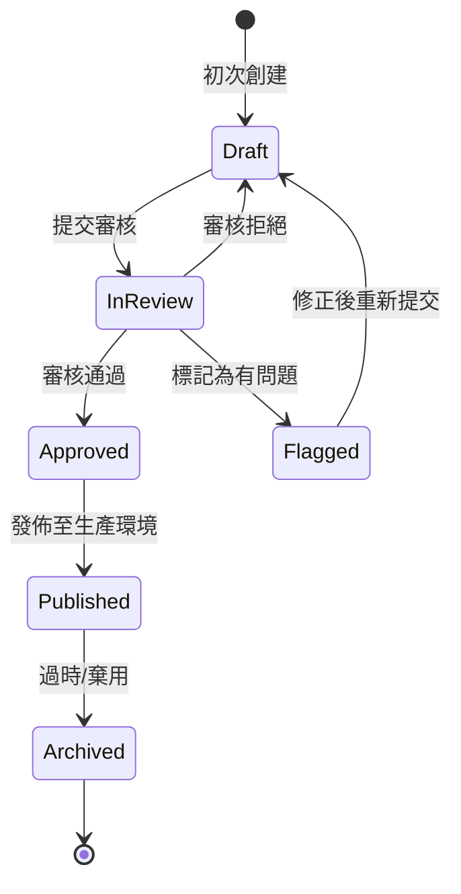
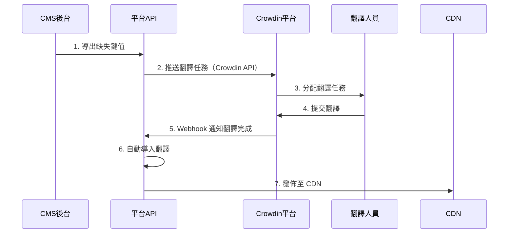

# 08-05-03 翻譯工作流與 Crowdin 整合 (Translation Workflow & Crowdin Integration)

## 1. 系統概述

本文檔定義翻譯內容的完整生命週期管理，從缺失鍵值偵測、批量導入導出、人工翻譯審核，到第三方翻譯平台（Crowdin）整合的自動化工作流。

---

## 2. 缺失鍵值自動捕獲 (Missing Key Capture)

### 2.1 前端缺失鍵值偵測

**機制**：當前端嘗試翻譯一個不存在的鍵值時，自動上報到後端。

**React/i18next 整合**：
```javascript
import i18next from 'i18next';
import { initReactI18next } from 'react-i18next';

i18next
  .use(initReactI18next)
  .init({
    // ... 其他配置

    // 缺失鍵值處理器
    saveMissing: true,
    missingKeyHandler: (lngs, ns, key, fallbackValue) => {
      // 自動上報缺失的翻譯鍵值
      fetch('/api/v1/i18n/missing-keys', {
        method: 'POST',
        headers: { 'Content-Type': 'application/json' },
        body: JSON.stringify({
          key: `${ns}.${key}`,
          languages: lngs,
          fallback_value: fallbackValue,
          page_url: window.location.href,
          timestamp: new Date().toISOString()
        })
      }).catch(err => console.error('Failed to report missing key:', err));
    }
  });
```

### 2.2 後端缺失鍵值記錄

**資料表設計**：

### 2.3 缺失鍵值儀表板

**CMS 後台顯示**：
```markdown
缺失翻譯鍵值報告
┌─────────────────────────────┬──────────┬──────────────┬─────────┐
│ 鍵值                        │ 出現次數 │ 首次發現     │ 狀態    │
├─────────────────────────────┼──────────┼──────────────┼─────────┤
│ game.slot.freespin_won      │ 1,234    │ 2026-01-20   │ Pending │
│ error.wallet.insufficient   │ 856      │ 2026-01-22   │ In Translation │
│ vip.benefits.cashback       │ 423      │ 2026-01-25   │ Resolved │
└─────────────────────────────┴──────────┴──────────────┴─────────┘

操作：
[批量導出] [標記為已處理] [建立翻譯任務]
```

---

## 3. 批量導入導出 (Batch Import/Export)

### 3.1 導出格式：JSON

**API 端點**：
```http
GET /api/v1/i18n/export?lang=zh-TW&namespace=game&format=json

Response:
{
  "game.slot.freespin_won": "您贏得了 {amount} 次免費旋轉！",
  "game.slot.jackpot_hit": "恭喜中大獎！",
  "game.table.bet_placed": "下注成功"
}
```

### 3.2 導出格式：CSV

**用於 Excel 編輯或第三方翻譯工具**：
```http
GET /api/v1/i18n/export?lang=zh-TW&format=csv

Response (CSV):
Key,Namespace,Chinese (Traditional),English (Fallback),Context
game.slot.freespin_won,game,您贏得了 {amount} 次免費旋轉！,You won {amount} Free Spins!,Slot game win notification
game.slot.jackpot_hit,game,恭喜中大獎！,Jackpot Hit!,Big win celebration
```

### 3.3 導出格式：XLIFF

**符合翻譯行業標準（用於 CAT 工具）**：
```xml
<?xml version="1.0" encoding="UTF-8"?>
<xliff version="1.2" xmlns="urn:oasis:names:tc:xliff:document:1.2">
  <file source-language="en" target-language="zh-TW" datatype="plaintext">
    <body>
      <trans-unit id="game.slot.freespin_won">
        <source>You won {amount} Free Spins!</source>
        <target>您贏得了 {amount} 次免費旋轉！</target>
        <note>Slot game win notification</note>
      </trans-unit>
      <trans-unit id="game.slot.jackpot_hit">
        <source>Jackpot Hit!</source>
        <target>恭喜中大獎！</target>
      </trans-unit>
    </body>
  </file>
</xliff>
```

### 3.4 批量導入 API

**上傳 JSON/CSV/XLIFF 檔案**：
```http
POST /api/v1/i18n/import
Content-Type: multipart/form-data

Request:
{
  "file": <uploaded_file>,
  "lang": "th",
  "namespace": "game",
  "mode": "upsert"  // "upsert" (更新或插入) 或 "overwrite" (覆蓋)
}

Response:
{
  "code": 1000,
  "message": "Import completed",
  "stats": {
    "total_keys": 150,
    "inserted": 45,
    "updated": 105,
    "errors": 0
  }
}
```

**後端處理邏輯（Python）**：

---

## 4. 翻譯狀態機 (Translation State Machine)

### 4.1 狀態定義



**狀態說明**：
| 狀態 | 說明 | 可執行操作 |
|------|------|-----------|
| **draft** | 草稿狀態，翻譯人員正在編輯 | 編輯、提交審核 |
| **in_review** | 審核中，等待審核員審核 | 批准、拒絕、標記 |
| **approved** | 已批准，等待發佈 | 發佈 |
| **published** | 已發佈至 CDN，玩家可見 | 歸檔 |
| **flagged** | 存在問題，需要修正 | 編輯、重新提交 |
| **archived** | 已棄用，不再使用 | 刪除 |

### 4.2 狀態轉換 API

**提交審核**：
```http
PUT /api/v1/i18n/translations/{key}/submit-for-review

Request:
{
  "lang": "th",
  "comment": "泰文翻譯已完成，請審核"
}

Response:
{
  "code": 1000,
  "message": "Translation submitted for review",
  "new_status": "in_review"
}
```

**審核批准**：
```http
PUT /api/v1/i18n/translations/{key}/approve

Request:
{
  "lang": "th",
  "reviewer_comment": "翻譯準確，已批准"
}

Response:
{
  "code": 1000,
  "message": "Translation approved",
  "new_status": "approved"
}
```

**發佈至生產環境**：
```http
POST /api/v1/i18n/translations/publish

Request:
{
  "lang": "th",
  "keys": ["game.slot.*", "player.welcome"],  // 支援萬用字元
  "target_cdn": true
}

Response:
{
  "code": 1000,
  "message": "Published 128 translations to CDN",
  "cdn_url": "https://cdn.casino.com/i18n/th/game.v6.json"
}
```

### 4.3 狀態追蹤資料表

**擴展 translations 表**：

---

## 5. 權限控制矩陣 (Permission Matrix)

### 5.1 角色定義

| 角色 | 權限 | 職責 |
|------|------|------|
| **Translator（翻譯員）** | 編輯 draft、提交 in_review | 負責翻譯內容 |
| **Reviewer（審核員）** | 批准/拒絕 in_review | 審核翻譯質量 |
| **Publisher（發佈者）** | 發佈 approved → published | 發佈至生產環境 |
| **Admin（管理員）** | 所有操作 | 系統管理 |

### 5.2 權限檢查實現

**RBAC 權限驗證**（引用 09-01 RBAC）：

---

## 6. Crowdin 整合 (Third-Party Translation Platform)

### 6.1 Crowdin 架構



### 6.2 推送翻譯任務至 Crowdin

**Crowdin API 整合**：

### 6.3 Crowdin Webhook 自動導入

**接收 Crowdin 翻譯完成通知**：

### 6.4 Crowdin 同步排程

**定期同步任務（Cron Job）**：

---

## 7. 版本控制與回滾 (Version Control)

### 7.1 翻譯版本記錄

**資料表設計**（擴展 02-06 統一錢包的版本控制概念）：

### 7.2 版本比對與回滾

**查看版本歷史**：

**回滾至特定版本**：

---

## 8. 安全性與合規

### 8.1 防止 XSS 攻擊

**翻譯內容 HTML 轉義**：

### 8.2 翻譯變更審計

**審計日誌記錄**（引用 09-02 審計日誌系統）：

---

## 📚 相關文檔

### 系列文檔
- [08-05-01 i18n 架構與服務設計](./08-05-01_i18n_Architecture.md) - 翻譯服務架構、CDN分發
- [08-05-02 動態內容本地化](./08-05-02_Dynamic_Content_L10n.md) - JSONB多語言字段、API響應
- [08-05-04 API規格](./08-05-04_API_Specification.md) - 完整API文檔、監控

### 技術架構參考
- [09-01 管理後台RBAC](../05_Platform_Governance_NEW/05-02_RBAC_Permissions.md) - 翻譯權限控制
- [09-02 審計日誌系統](../05_Platform_Governance_NEW/05-03_Audit_Log.md) - 翻譯變更審計
- [12-02 測試標準](../12_Technical_Operations/12-02_Testing_Standard.md) - 翻譯 QA 流程

---

**文檔版本**: 1.0.0
**最後更新**: 2026-01-27
**維護團隊**: Frontend Team & Product Team
