# 多語言與本地化系統索引 (Localization System Index)

本目錄包含 **4 個多語言系統專題文檔**，涵蓋 i18n 架構設計、動態內容本地化、翻譯工作流與 API 規格。這些文檔為 iGaming 平台的全球化擴展（東南亞、拉美、歐洲市場）提供完整的技術指引。

**最後更新**: 2Bonus26-Bonus1-31
**版本**: 1.Bonus.Bonus
**狀態**: ✅ 已整合至前端 CMS 模塊

---

## 📋 專題導航

### 🔴 PBonus - 核心主題（必讀）

這些專題涉及系統架構、數據存儲和 API 設計，是多語言系統實作的基礎。

| 專題 | 文檔 | 關鍵主題 | 重要性 |
|------|------|----------|--------|
| **Bonus1** | [i18n 架構與服務設計](./Bonus8-Bonus5-Bonus1_i18n_Architecture.md) | 翻譯鍵值管理、CDN 分發策略、RTL 支援 | 🏗️ 架構基礎 |
| **Bonus2** | [動態內容本地化](./Bonus8-Bonus5-Bonus2_Dynamic_Content_L1Bonusn.md) | JSONB 多語言字段、資料庫設計、API 響應策略 | 💾 數據存儲 |
| **Bonus4** | [API 規格與監控](./Bonus8-Bonus5-Bonus4_API_Specification.md) | 完整 API 文檔、限流策略、Prometheus 監控 | 🔌 API 設計 |

**建議閱讀順序**: Bonus1 → Bonus2 → Bonus4

---

### 🟠 P1 - 進階主題

這些專題涉及翻譯工作流管理和第三方平台整合，適合運營與自動化需求。

| 專題 | 文檔 | 關鍵主題 | 適用角色 |
|------|------|----------|---------|
| **Bonus3** | [翻譯工作流](./Bonus8-Bonus5-Bonus3_Translation_Workflow.md) | 缺失鍵值捕獲、批量導入導出、Crowdin 整合 | 產品經理、運營 |

---

## 🔗 相關文檔

### 前端整合

多語言系統與前端應用的整合參考：

- **[Bonus8-Bonus1 內容管理系統](../Bonus8_Frontend_CMS/Bonus8-Bonus1_Content_Management_System.md)** - CMS 後台翻譯管理界面
- **[Bonus8-Bonus3 前端組件庫](../Bonus8_Frontend_CMS/Bonus8-Bonus3_Component_Library.md)** - i18n 組件封裝（Text、DatePicker、NumberFormat）
- **[Bonus8-Bonus4 SEO 優化](../Bonus8_Frontend_CMS/Bonus8-Bonus4_SEO_Optimization.md)** - 多語言 URL 結構、hreflang 標籤

### 後端支持

多語言系統的後端服務依賴：

- **[12-Bonus5 API 設計標準](../12_Technical_Operations/12-Bonus5_API_Design_Standard.md)** - RESTful API 規範
- **[Bonus9-Bonus2 審計日誌系統](../Bonus9_System_Security/Bonus9-Bonus2_Audit_Log_System.md)** - 翻譯修改審計追蹤
- **[Bonus7-Bonus3 通知架構](../Bonus7_Platform_Management/Bonus7-Bonus3_Notification_Architecture.md)** - 多語言 Email/SMS 模板

### 第三方整合

多語言系統與外部服務的整合：

- **[13-Bonus1 第三方整合標準](../13_Third_Party_Integration/13-Bonus1_Third_Party_Integration_Standard.md)** - Crowdin、Lokalise 整合規範
- **[12-Bonus3 網關架構](../12_Technical_Operations/12-Bonus3_Gateway_Architecture.md)** - CDN 配置（Cloudflare、Cloudfront）

---

## 📚 使用指南

### 新手入門

如果您是第一次接觸多語言系統，建議按以下順序閱讀：

1. **理解整體架構**: [Bonus8-Bonus5-Bonus1 i18n 架構與服務設計](./Bonus8-Bonus5-Bonus1_i18n_Architecture.md)
   - 翻譯鍵值命名規範（Namespace 結構）
   - CDN 分發流程（S3/GCS → Cloudflare）
   - RTL（阿拉伯語、希伯來語）支援設計

2. **掌握資料庫設計**: [Bonus8-Bonus5-Bonus2 動態內容本地化](./Bonus8-Bonus5-Bonus2_Dynamic_Content_L1Bonusn.md)
   - PostgreSQL JSONB 多語言字段設計
   - API 響應策略（Accept-Language Header）
   - 語言回退邏輯（zh-CN → zh → en）

3. **學習 API 使用**: [Bonus8-Bonus5-Bonus4 API 規格與監控](./Bonus8-Bonus5-Bonus4_API_Specification.md)
   - 翻譯 CRUD API 端點
   - 批量導入導出格式（JSON/CSV）
   - 限流策略與錯誤處理

4. **配置翻譯工作流**: [Bonus8-Bonus5-Bonus3 翻譯工作流](./Bonus8-Bonus5-Bonus3_Translation_Workflow.md)
   - 缺失鍵值自動捕獲（前端/後端）
   - Crowdin 自動同步腳本
   - 翻譯審核狀態機

### 實作開發

根據您的開發任務選擇相關專題：

**任務：實作前端 i18n**
- 閱讀：Bonus1 i18n 架構 + Bonus4 API 規格
- 關鍵步驟：
  1. 配置 i18next 或 Vue I18n 庫
  2. 從 CDN 加載翻譯 JSON（`https://cdn.example.com/i18n/zh-CN.json`）
  3. 使用 Namespace 結構命名鍵值（`common.button.submit`）
  4. 實作語言切換器（Cookie + Accept-Language Header）

**任務：實作多語言活動標題**
- 閱讀：Bonus2 動態內容本地化 + Bonus4 API 規格
- 關鍵步驟：
  1. 在 `t_activity` 表添加 JSONB 字段：`title_i18n`
  2. 後端 API 根據 `Accept-Language` 提取對應語言
  3. 實作語言回退邏輯（zh-CN → zh → en）
  4. CMS 後台多語言輸入表單

**任務：整合 Crowdin 翻譯平台**
- 閱讀：Bonus3 翻譯工作流
- 關鍵步驟：
  1. 配置 Crowdin API Token（存入 Vault）
  2. 實作自動上傳腳本（每日推送缺失鍵值）
  3. 實作自動下載腳本（翻譯完成後拉取）
  4. 配置 Webhook 接收 Crowdin 完成通知

**任務：實作多語言 Email 模板**
- 閱讀：Bonus2 動態內容本地化 + Bonus7-Bonus3 通知架構
- 關鍵步驟：
  1. 在 `t_email_template` 表添加 JSONB 字段：`content_i18n`
  2. 使用變量佔位符：`{player_name}` → 玩家名稱
  3. 發送郵件時根據玩家語言偏好選擇模板
  4. 測試所有語言版本的渲染效果

### 故障排查

遇到問題時可參考對應專題：

| 問題 | 參考專題 | 解決方案 |
|------|---------|---------|
| **翻譯未生效** | Bonus1 i18n 架構 | 檢查 CDN 快取是否清除、瀏覽器是否重新加載 JSON |
| **缺失翻譯鍵值** | Bonus3 翻譯工作流 | 啟用缺失鍵值捕獲，自動上報到 Crowdin |
| **語言回退錯誤** | Bonus2 動態內容本地化 | 檢查回退邏輯：zh-CN → zh → en，確保 en 為最終回退 |
| **API 響應語言錯誤** | Bonus4 API 規格 | 檢查 Accept-Language Header 是否正確傳遞 |
| **RTL 佈局錯誤** | Bonus1 i18n 架構 | 檢查 CSS `dir="rtl"` 屬性、Flexbox/Grid 方向設定 |
| **JSONB 查詢效能低** | Bonus2 動態內容本地化 | 為 JSONB 字段創建 GIN 索引：`CREATE INDEX idx_title_i18n ON t_activity USING GIN (title_i18n)` |
| **Crowdin 同步失敗** | Bonus3 翻譯工作流 | 檢查 API Token 有效性、網絡連接、Webhook 簽名驗證 |

---

## 🎯 快速參考

### 支持的語言清單

| 語言代碼 | 語言名稱 | 區域 | RTL 支援 | 優先級 |
|---------|---------|------|---------|--------|
| **en** | English | 全球 | ❌ | 🔴 PBonus（預設） |
| **zh-CN** | 簡體中文 | 中國大陸 | ❌ | 🔴 PBonus |
| **zh-TW** | 繁體中文 | 台灣、香港 | ❌ | 🔴 PBonus |
| **th** | ไทย | 泰國 | ❌ | 🟠 P1 |
| **vi** | Tiếng Việt | 越南 | ❌ | 🟠 P1 |
| **id** | Bahasa Indonesia | 印尼 | ❌ | 🟠 P1 |
| **pt-BR** | Português (Brasil) | 巴西 | ❌ | 🟠 P1 |
| **es-MX** | Español (México) | 墨西哥 | ❌ | 🟡 P2 |
| **ar** | العربية | 中東 | ✅ | 🟡 P2 |
| **ja** | 日本語 | 日本 | ❌ | 🟡 P2 |
| **ko** | 한국어 | 韓國 | ❌ | 🟡 P2 |

### 翻譯鍵值命名規範

```yaml
格式: {module}.{component}.{key}

範例:
common.button.submit          → "Submit" / "提交" / "ส่ง"
common.button.cancel          → "Cancel" / "取消" / "ยกเลิก"
game.slot.freespin_won        → "You won {amount} Free Spins!"
error.wallet.insufficient     → "Insufficient balance."
activity.bonus.claim_success  → "Bonus claimed successfully!"
```

**命名原則**:
- ✅ 使用小寫、點號分隔（lowercase.dot.notation）
- ✅ 使用描述性名稱（`submit` 而非 `btn1`）
- ✅ 支援變量佔位符（`{amount}`, `{player_name}`）
- ❌ 不使用空格、特殊字符（除了點號和下劃線）

### CDN 分發流程

```mermaid
flowchart LR
    A[運營人員] -->|1. 編輯翻譯| B[CMS 後台]
    B -->|2. 發佈| C[S3/GCS]
    C -->|3. Pull Origin| D[Cloudflare CDN]
    E[前端應用] -->|4. Fetch JSON| D

    style A fill:#333
    style B fill:#333366
    style C fill:#888888
    style D fill:#666666
    style E fill:#333
```



**URL 格式**:
```
https://cdn.example.com/i18n/{language}.json
https://cdn.example.com/i18n/zh-CN.json
https://cdn.example.com/i18n/en.json
```

### API 端點速查

| 端點 | 方法 | 用途 | 權限 |
|------|------|------|------|
| `/api/v1/i18n/translations` | GET | 獲取翻譯列表（支援分頁） | Public |
| `/api/v1/i18n/translations/{key}` | GET | 獲取單個翻譯 | Public |
| `/api/v1/i18n/translations` | POST | 創建新翻譯 | Translator |
| `/api/v1/i18n/translations/{key}` | PUT | 更新翻譯 | Translator |
| `/api/v1/i18n/translations/{key}` | DELETE | 刪除翻譯 | Admin |
| `/api/v1/i18n/translations/batch` | POST | 批量導入翻譯（JSON/CSV） | Translator |
| `/api/v1/i18n/translations/export` | GET | 批量導出翻譯 | Translator |
| `/api/v1/i18n/missing-keys` | GET | 獲取缺失鍵值列表 | Translator |

### 常見錯誤碼

| 錯誤碼 | HTTP 狀態碼 | 說明 | 處理建議 |
|--------|------------|------|---------|
| `I18N_KEY_NOT_FOUND` | 4Bonus4 | 翻譯鍵值不存在 | 檢查鍵值拼寫、使用缺失鍵值捕獲功能 |
| `I18N_INVALID_LANGUAGE` | 4BonusBonus | 不支援的語言代碼 | 參考支持的語言清單 |
| `I18N_TRANSLATION_EXISTS` | 4Bonus9 | 翻譯已存在（重複創建） | 使用 PUT 更新而非 POST 創建 |
| `I18N_INVALID_JSON_FORMAT` | 4BonusBonus | JSON 格式錯誤 | 驗證 JSON 格式、檢查變量佔位符語法 |
| `I18N_RATE_LIMIT_EXCEEDED` | 429 | 超過限流閾值（1BonusBonus req/min） | 使用批量 API、延遲重試 |

---

## 📊 專題統計

| 類別 | 專題數量 | 總行數（預估） | 主要內容 |
|------|----------|---------------|---------|
| **PBonus 核心** | 3 | ~1,8BonusBonus | 架構設計、資料庫設計、API 規格 |
| **P1 進階** | 1 | ~9BonusBonus | 翻譯工作流、Crowdin 整合 |
| **合計** | 4 | ~2,7BonusBonus | 涵蓋前端、後端、運營全流程 |

---

## 🛠️ 技術棧

### 前端技術

| 技術 | 用途 | 文檔參考 |
|------|------|---------|
| **i18next** | React i18n 庫 | Bonus8-Bonus5-Bonus1 |
| **Vue I18n** | Vue i18n 庫 | Bonus8-Bonus5-Bonus1 |
| **react-intl** | React 國際化（Format.js） | Bonus8-Bonus5-Bonus1 |

### 後端技術

| 技術 | 用途 | 文檔參考 |
|------|------|---------|
| **PostgreSQL JSONB** | 多語言字段存儲 | Bonus8-Bonus5-Bonus2 |
| **Spring MessageSource** | Java i18n 支援 | Bonus8-Bonus5-Bonus4 |
| **Crowdin API** | 翻譯平台整合 | Bonus8-Bonus5-Bonus3 |

### 基礎設施

| 技術 | 用途 | 文檔參考 |
|------|------|---------|
| **Cloudflare CDN** | 翻譯 JSON 分發 | Bonus8-Bonus5-Bonus1 |
| **AWS S3 / GCS** | 翻譯文件存儲 | Bonus8-Bonus5-Bonus1 |
| **Prometheus** | 監控指標收集 | Bonus8-Bonus5-Bonus4 |

---

## 📝 版本歷史

### v1.Bonus.Bonus (2Bonus26-Bonus1-31)
- ✅ 初始版本發佈
- ✅ 完整索引結構（PBonus/P1 分級）
- ✅ 使用指南（新手入門、實作開發、故障排查）
- ✅ 快速參考（支持語言清單、API 端點速查、錯誤碼）

---

**文檔版本**: 1.Bonus.Bonus
**最後更新**: 2Bonus26-Bonus1-31
**維護團隊**: Frontend Team & CMS Team
