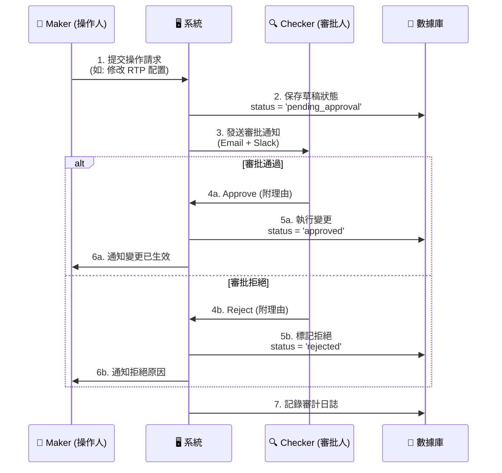
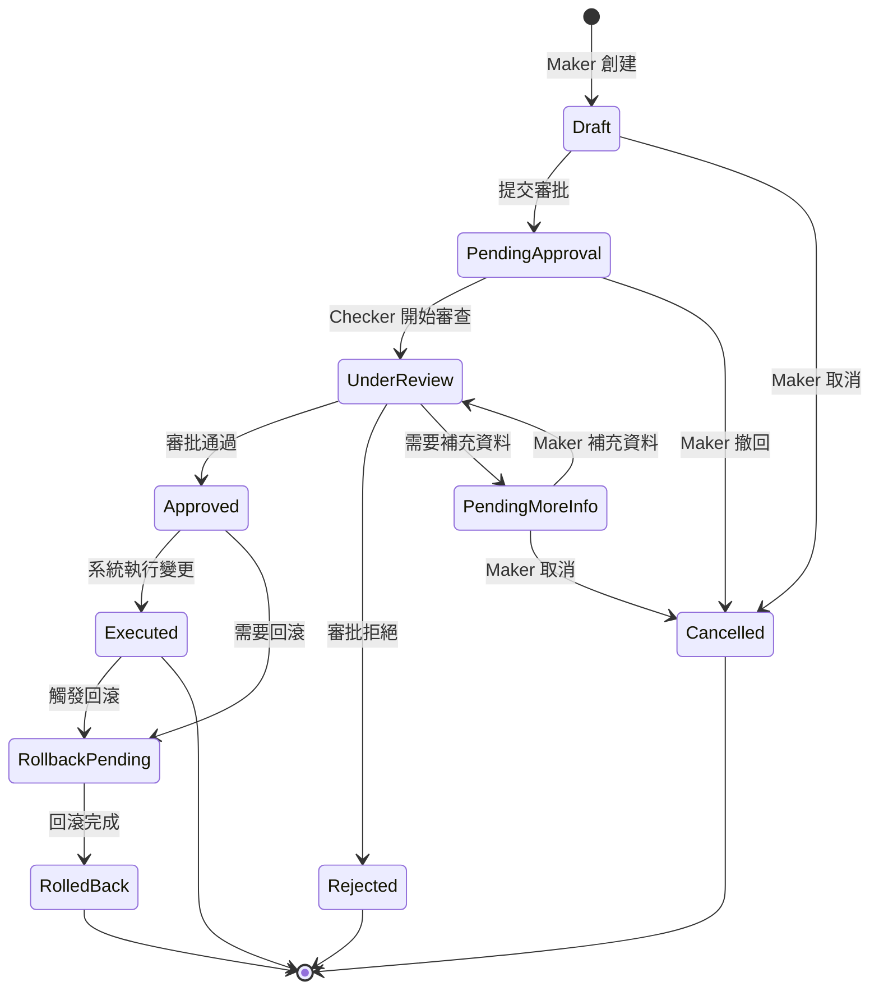

# 09-04 審批工作流系統 (Approval Workflow System)

> **相關文檔**: [09-02 審計日誌系統](./09-02_Audit_Log_System.md) - 所有審批操作的日誌記錄與查詢

## 1. 系統概述

### 1.1 設計目標
審批工作流系統（Approval Workflow System）是博彩平台風險控制的核心機制，通過 **Maker-Checker 模式** 確保高風險操作經過雙人或多級審核，防止單點人為錯誤或惡意操作。

### 1.2 核心價值
- **風險控制**：高額提款、配置變更等關鍵操作必須經過審批
- **職責分離**：操作人（Maker）與審批人（Checker）分離，防止濫用權限
- **審計追蹤**：每個審批決策都記錄在案，滿足合規要求（MGA、UKGC）
- **可回滾性**：支持快照與回滾，確保配置變更可追溯、可恢復

---

## 2. Maker-Checker 模式

### 2.1 基本流程



### 2.2 數據模型


### 2.3 權限矩陣

| 操作類型 | Maker 權限要求 | Checker 權限要求 | 自動審批閾值 |
|---------|---------------|-----------------|-------------|
| **提款審批** | CS Agent | Finance Manager | < $100 自動通過 |
| **配置變更** | DevOps Engineer | CTO/VP of Engineering | 無自動審批 |
| **VIP 升級** | VIP Manager | COO | 無自動審批 |
| **手動發紅利** | CS Supervisor | Finance Manager | < $50 自動通過 |
| **風控標籤** | Risk Analyst | Risk Manager | 無自動審批 |
| **玩家數據修正** | CS Supervisor | Compliance Officer | 無自動審批 |

---

## 3. 多級審批鏈 (Multi-Level Approval)

### 3.1 分級審批規則

**提款審批範例**：

| 提款金額 | 審批級別 | 審批人 | SLA |
|---------|---------|--------|-----|
| < $100 | **L0** | 自動審批 | 即時 |
| $100 - $5,000 | **L1** | 財務專員 | 30分鐘 |
| $5,001 - $50,000 | **L2** | 財務經理 | 2小時 |
| > $50,000 | **L3** | 財務總監 + 風控總監 (雙簽) | 24小時 |

### 3.2 雙簽機制 (Dual Approval)

**適用場景**：高風險操作需要兩個不同角色同時審批。

**數據模型擴展**：

**邏輯實現**：

---

## 4. 工作流狀態機 (Workflow State Machine)

### 4.1 狀態轉換圖



### 4.2 狀態邏輯實現


---

## 5. 配置快照與回滾 (Snapshot & Rollback)

### 5.1 快照機制

**目標**：在每次配置變更執行前，保存當前狀態快照，確保可回滾。

**數據模型**：

**快照創建邏輯**：

### 5.2 回滾機制

**觸發場景**：
1. **人工觸發**：管理員發現配置錯誤，手動回滾
2. **自動觸發**：監控系統檢測到異常（如 RTP 暴跌），自動回滾
3. **時間窗口**：配置變更後 24 小時內可回滾

**回滾流程**：

### 5.3 自動回滾觸發器

**監控指標範例**：

---

## 6. 審批 UI/UX 設計

### 6.1 審批工作台

**功能要求**：
1. **待審批隊列**：優先級排序（Critical > High > Normal > Low）
2. **快速審批**：一鍵批准/拒絕（附快速理由模板）
3. **詳情面板**：
   - Maker 信息與提交理由
   - 變更前後對比（Diff View）
   - 相關審計日誌（該玩家/配置的歷史變更）
   - 風險評估（自動計算風險分數）

**UI 佈局示意**：
```
┌─────────────────────────────────────────────────────┐
│  🔔 待審批請求 (3)          🔍 搜索   🔽 篩選       │
├─────────────────────────────────────────────────────┤
│ ⚠️ [Critical] 提款審批 - $75,000   👤 Alice  2分鐘前│
│   玩家: VIP_001 | 理由: VIP 高額提款請求            │
│   [ 查看詳情 ] [ ✅ 批准 ] [ ❌ 拒絕 ]              │
├─────────────────────────────────────────────────────┤
│ ⚡ [High] 配置變更 - RTP 調整   👤 Bob  15分鐘前    │
│   遊戲: SlotGame_123 | 變更: RTP 96% → 95%         │
│   [ 查看詳情 ] [ ✅ 批准 ] [ ❌ 拒絕 ]              │
├─────────────────────────────────────────────────────┤
│ 📄 [Normal] 手動發紅利 - $200   👤 Carol  1小時前   │
│   玩家: Player_456 | 理由: 客服補償                │
│   [ 查看詳情 ] [ ✅ 批准 ] [ ❌ 拒絕 ]              │
└─────────────────────────────────────────────────────┘
```

### 6.2 變更對比視圖 (Diff View)

**提款審批範例**：
```json
// Diff View
{
  "request_type": "withdraw",
  "player_id": "12345",
  "player_vip_level": 5,
  "withdrawal_details": {
    "amount": "$75,000",
    "method": "Bank Transfer",
    "account": "****1234"
  },
  "risk_signals": [
    "✅ KYC: Verified",
    "✅ 流水完成: 150% (要求 100%)",
    "⚠️ 首次大額提款 (歷史最高: $10,000)",
    "✅ 帳戶年齡: 18個月",
    "✅ 無風控標籤"
  ],
  "maker_comment": "VIP 玩家正常大額提款，已完成額外身份驗證",
  "suggested_action": "批准（風險分數: 12/100）"
}
```

**配置變更範例**（Diff View）：
```diff
// Game RTP Configuration
{
  "game_id": "slot_dragon_gold",
  "game_name": "Dragon Gold Slots",
- "rtp": 0.9600,
+ "rtp": 0.9500,
  "effective_from": "2026-02-01 00:00:00 UTC"
}

⚠️ 風險提示:
- RTP 降低 1% 可能影響玩家滿意度
- 預計月營收增加: +$25,000
- 建議: 同步調整遊戲促銷力度
```

### 6.3 快速操作模板

**拒絕理由模板**：
```javascript
const REJECTION_TEMPLATES = [
  {
    category: '風險過高',
    reasons: [
      '玩家存在多個帳戶（疑似對沖）',
      '流水未完成（當前 {progress}%，要求 100%）',
      '近期存在異常投注行為',
      'KYC 資料不完整'
    ]
  },
  {
    category: '資料不足',
    reasons: [
      '需補充銀行帳戶證明',
      '需提供交易明細截圖',
      '請聯繫玩家確認提款意圖'
    ]
  },
  {
    category: '政策限制',
    reasons: [
      '超過日提款限額（VIP{level} 限額: ${limit}）',
      '該支付方式不支持該金額',
      '需等待 {hours} 小時後才能再次提款'
    ]
  }
];
```

---

## 7. 通知與告警

### 7.1 通知渠道

| 事件 | Maker 通知 | Checker 通知 | 管理層通知 |
|------|-----------|-------------|-----------|
| **請求提交** | ✅ Email | ✅ Email + Slack + 系統內消息 | - |
| **審批通過** | ✅ Email + 系統內消息 | - | - |
| **審批拒絕** | ✅ Email + 系統內消息<br/>（含拒絕理由） | - | - |
| **超時未審批** | - | ⚠️ Slack 提醒 | ⚠️ Email（超過 SLA） |
| **自動回滾觸發** | ✅ Email | ✅ Email + 電話 | 🚨 Email + SMS + 電話 |

### 7.2 Slack 整合範例


---

## 8. 與審計日誌系統整合

### 8.1 關聯查詢

**場景**：審批人在審查時，需要查看目標實體的歷史變更記錄。

**查詢範例**：

### 8.2 審批鏈追蹤

**場景**：合規審計需要追蹤特定配置的完整審批鏈。

**查詢範例**：

---

## 9. 效能監控

### 9.1 關鍵指標 (KPI)


### 9.2 SLA 達成率

| 審批類型 | SLA 目標 | 達成率（上月） | 趨勢 |
|---------|---------|---------------|------|
| 提款審批 | 30分鐘 | 92% | 📈 +3% |
| 配置變更 | 2小時 | 88% | 📉 -2% |
| VIP 升級 | 24小時 | 98% | ➡️ 持平 |
| 手動發紅利 | 1小時 | 95% | 📈 +5% |

### 9.3 告警規則


---

## 10. 最佳實踐

### 10.1 審批前檢查清單

**提款審批 Checklist**：
- [ ] KYC 狀態: Approved
- [ ] 流水完成率: ≥100%
- [ ] 風控標籤: 無 High Risk 或 Bonus Abuser
- [ ] 提款方式: 與存款方式一致（反洗錢要求）
- [ ] 日提款次數: 未超過限額
- [ ] 帳戶年齡: ≥7天（防止快速套現）

**配置變更 Checklist**：
- [ ] 變更理由充分（附 Jira Ticket 或 RFC 文檔）
- [ ] 影響範圍評估（影響玩家數/營收預估）
- [ ] 回滾計劃明確
- [ ] 已通過 Staging 環境測試
- [ ] 變更時間窗口合理（避開高峰期）

### 10.2 安全建議

1. **權限最小化**：Maker 不能審批自己的請求（系統強制驗證）
2. **雙因素驗證**：高風險操作（如大額提款審批）需要 2FA
3. **IP 白名單**：審批操作僅允許從公司網絡或 VPN 發起
4. **會話超時**：審批頁面 15 分鐘無操作自動登出
5. **操作錄屏**：審批過程可選錄屏（合規要求）

---

## 📚 相關文檔

### 前置知識（必讀）
- [09-02 審計日誌系統](09-02_Audit_Log_System.md) - 審批操作的審計追蹤
- [01-01 玩家賬戶系統](../03_Player_Journey/03-01_Player_Lifecycle.md) - 玩家數據結構

### 核心依賴
- [02-01 提款風控](../01_Player_Center/01-05_Withdrawal_Risk.md) - 提款審批規則
- [05-01 風控系統](../04_Risk_Control/04-01_Risk_Framework.md) - 風險評分邏輯
- [07-03 通知架構](../07_Platform_Management/07-03_Notification_Architecture.md) - 審批通知實現

### 相關實作
- [11-01 客服平台設計](../06_Analytics_Operations_NEW/06-02_Customer_Service.md) - 客服操作審批（補單、踢線）
- [08-01 配置管理系統](../08_Frontend_CMS/08-01_Config_Management_System.md) - 配置變更審批
- [04-01 活動系統設計](../03_Player_Journey/03-03_Activity_Bonus.md) - 紅利發放審批

### 延伸閱讀
- [09-03 權限與認證](../09_System_Security/09-03_Authentication_Authorization.md) - RBAC 權限控制
- [12-05 API 設計標準](../12_DevOps_Observability/12-05_API_Design_Standard.md) - 審批 API 設計規範

---

**文檔版本**: 1.0.0
**最後更新**: 2026-01-27
**維護團隊**: Security & Compliance Team

## CHANGELOG

### v1.0.0 (2026-01-27)
- 初始版本：從 09-02 拆分出審批工作流系統
- 新增：Maker-Checker 模式詳細設計
- 新增：多級審批鏈與雙簽機制
- 新增：工作流狀態機實現
- 新增：配置快照與自動回滾機制
- 新增：審批 UI/UX 設計指南
- 新增：效能監控與告警規則
