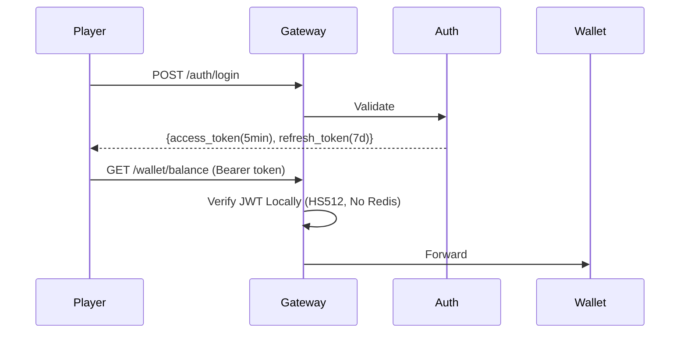
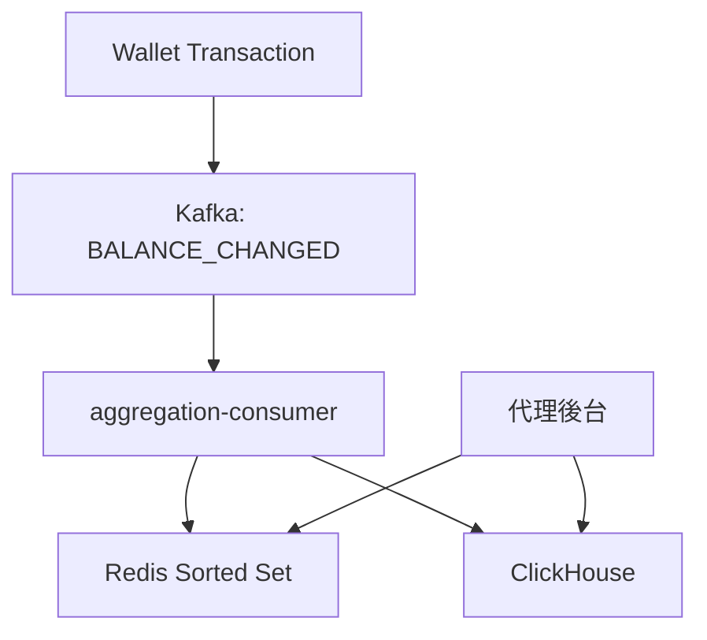
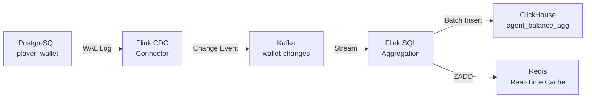
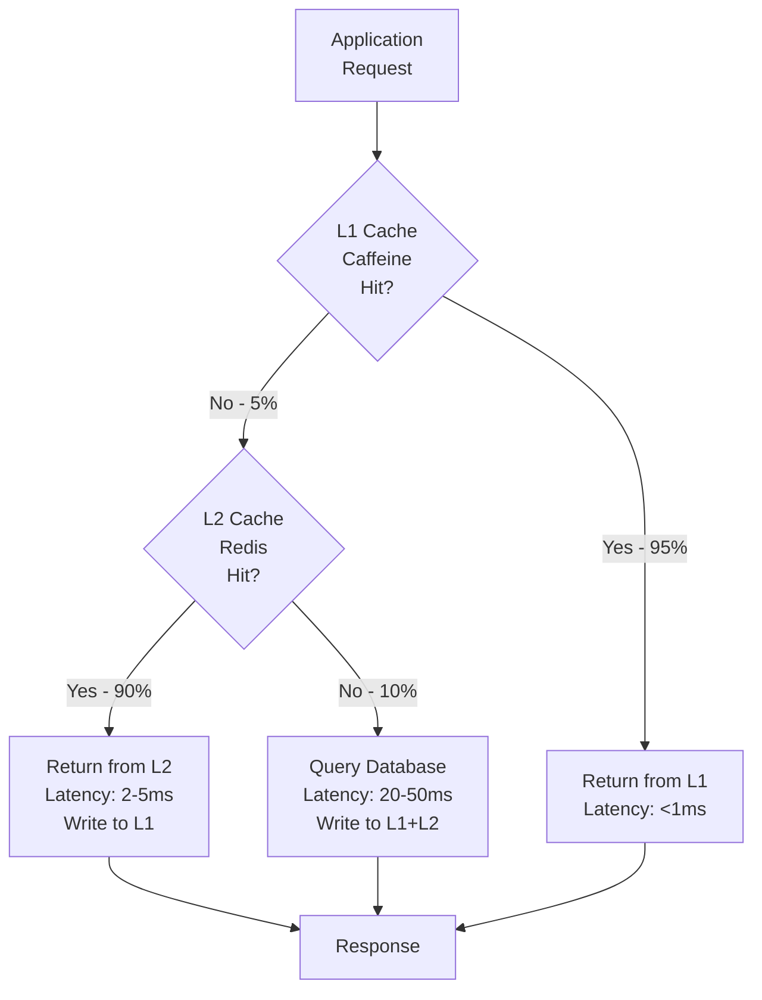

# 07-07 性能優化規範 (Performance Optimization Specification)

<!-- SSOT: Authoritative definition of iGaming Performance Bottlenecks and Optimization Strategies -->

> **版本**: 4.0.0
> **最後更新**: 2026-02-05
> **狀態**: 設計階段

---

## 1. 執行摘要 (Executive Summary)

iGaming 平台採用 **零信任統一錢包模型 (Zero-Trust Unified Wallet)** 與 **實時風控 (Real-Time Risk Control)**。此設計在功能上穩健，但引入較高的延遲開銷。

**三大關鍵瓶頸**:
1. **「熱點行」並發鎖**: `FOR UPDATE` 資料庫鎖限制單一玩家 TPS
2. **Redis Lua 腳本阻塞**: 複雜流水/風控邏輯可能卡死 Redis
3. **鑑識級日誌膨脹**: 1 個業務動作 = 5-10 次 DB 寫入

**延遲預算**:
| 步驟 | 優化後 | 風險場景 |
|------|--------|---------|
| Token 驗證 | 2ms | 10ms |
| 風控檢查 | 10ms | 100ms |
| DB 事務 | 20ms | 200ms |
| **總計** | **~45ms** | **~340ms** |

> **GP 超時閾值**: 200-500ms → 風險場景需優化

---

## 2. 下注請求優化 (Bet Request Optimization)

### 2.1 分布式鎖 + 樂觀鎖 (取代 FOR UPDATE)

**現狀問題**:
- `SELECT ... FOR UPDATE` 行鎖造成資料庫連線等待
- 高並發下 CPU 與 Wait 時間飆升

**解決方案**:
```
1. Redisson 分布式鎖 (wallet:lock:{tenant}:{player})
2. SELECT balance, version FROM player_wallet (無 FOR UPDATE)
3. UPDATE ... SET version = version + 1 WHERE version = ?
4. affected_rows == 0 → 重試 (最多 3 次)
```

**鎖參數**:
| 參數 | 值 |
|------|-----|
| Wait Time | 3 秒 |
| Lease Time | 5 秒 |
| Watchdog | 啟用 |

**全局規範**: `FOR UPDATE` 禁止使用

---

### 2.2 player_wallet 分片 (Sharding)

**分片鍵**: `hash(tenant_id, player_id) % N`

| 租戶規模 | 日活玩家 | 分片數 |
|---------|---------|-------|
| 小型 | < 10,000 | 8 |
| 中型 | 10,000 - 100,000 | 32 |
| 大型 | > 100,000 | 128 |

**路由**: MyBatis-Plus DynamicTableNameInterceptor

---

## 3. Token 安全方案

### 3.1 四場景總覽

| 場景 | 驗證方式 | 有效期 | 特殊機制 |
|------|---------|--------|---------|
| **遊戲商 (GP)** | RSA-SHA256 簽名 | 單次 | IP 白名單 + 時間窗口 ±5min |
| **平台互調** | mTLS + SA Token | 1h | K8s Network Policy |
| **前台玩家** | HS512 JWT | 5min | Refresh Token 7 天 |
| **後台用戶** | RS256 + Session | 30min | MFA + 二次驗證 |

### 3.2 玩家 Token 流程



**風險接受**: Access Token 5 分鐘內無法禁用 (風控異步處理)

---

## 4. 實時風控優化

### 4.1 同步 vs 異步邊界

**同步 (下注路徑, < 15ms)**:
- 玩家狀態 (Banned/Frozen)
- 信用額度
- 全局投注限額

**異步 (Kafka 事件驅動)**:
- 行為模式分析 (套利偵測)
- 鑑識日誌寫入
- 莫洛克閾值計算
- 曝光度監控

### 4.2 Lua 腳本治理

| 規範 | 要求 |
|------|------|
| 執行時間 | < 1ms |
| Key 數量 | < 5 |
| 禁止操作 | KEYS *, SMEMBERS, HGETALL, 循環 > 100 |

---

## 5. 數據分層存儲

### 5.1 熱/溫/冷定義

| 層級 | 時間範圍 | 數據年齡 | 存儲介質 | SLA | 成本/GB/月 |
|------|---------|---------|---------|-----|-----------|
| 熱 | 0-2個月 | ≤ 60天 | PostgreSQL SSD | < 50ms | $0.115 |
| 溫 | 3-6個月 | 61-180天 | S3 Standard | < 2s | $0.023 |
| 冷 | 7-19個月 | 181-570天 | S3 Glacier | < 30s | $0.004 |
| 歸檔 | 20-84個月 | 571-2520天 | S3 Deep Archive | < 12h | $0.00099 |

**數據生命週期流程**：
```
Day 0 ────────▶ Day 60 ────────▶ Day 180 ────────▶ Day 570 ────────▶ Day 2520
   ↓               ↓                ↓                 ↓                  ↓
PostgreSQL      自動歸檔        自動歸檔          自動歸檔            刪除/永久歸檔
  (熱)        → S3 Standard   → S3 Glacier    → S3 Deep Archive
             (溫，4個月)      (冷，13個月)     (歸檔，65個月)
```

**合規保留**：7年（總計84個月）
- 前19個月：三層在線存儲（熱→溫→冷自動遷移）
- 20-84個月：離線歸檔存儲（S3 Deep Archive，需restore查詢）

### 5.2 各層內容

**PostgreSQL (熱，2個月)**:
- 實時錢包交易 (`wallet_transactions`)
- 進行中投注 (`active_bets`)
- 風控日誌 (`risk_logs`)
- 審計日誌 (`audit_logs`)

**S3 Standard (溫，4個月)**:
- 已結算交易 (Parquet格式)
- 歷史審計日誌 (JSON Lines)
- 玩家行為數據

**S3 Glacier (冷，13個月)**:
- 長期歷史交易
- 合規審計日誌
- 歸檔報表數據

**S3 Deep Archive (歸檔，20-84個月)**:
- 7年合規保留數據
- 需restore才能查詢（12小時延遲）
- 法務/審計場景使用
- 最低存儲成本（每GB僅$0.00099/月）

### 5.3 自動歸檔策略

**歸檔任務執行時間**：每日凌晨 02:00

**歸檔規則**：
```sql
-- Day 60: 熱數據 → 溫數據
-- 從PostgreSQL導出至S3 Standard（Parquet格式）
SELECT * FROM audit_logs
WHERE create_time BETWEEN CURRENT_DATE - INTERVAL '61 days'
                      AND CURRENT_DATE - INTERVAL '60 days';

-- Day 180: 溫數據 → 冷數據
-- S3 Lifecycle Policy自動轉移至Glacier
-- 無需應用層干預

-- Day 570: 冷數據 → 歸檔數據
-- S3 Lifecycle Policy自動轉移至Deep Archive
-- 無需應用層干預

-- Day 2520 (7年): 歸檔數據刪除
-- S3 Lifecycle Policy自動刪除
```

**歸檔後查詢**：

| 數據層 | 查詢方式 | 延遲 | 成本 |
|--------|---------|------|------|
| 熱數據 | 直接SQL查詢 | < 50ms | 無額外成本 |
| 溫數據 | S3 Select查詢 | 2-5s | $0.002/GB掃描 |
| 冷數據 | Glacier Expedited Retrieval | 1-5分鐘 | $0.03/GB |
| 歸檔數據 | Deep Archive Standard Retrieval | 12小時 | $0.02/GB |

### 5.4 成本估算（1000萬DAU場景）

**假設條件**：
- 日均審計日誌增長：1 GB/天
- 年度數據總量：365 GB

**分層存儲成本**（月度）：
```
熱數據（0-2個月）：60 GB × $0.115 = $6.90/月
溫數據（3-6個月）：120 GB × $0.023 = $2.76/月
冷數據（7-19個月）：390 GB × $0.004 = $1.56/月
歸檔數據（20-84個月）：1,950 GB × $0.00099 = $1.93/月

月度總成本：$13.15
年度總成本：$157.8
```

**對比：全部PostgreSQL存儲**：
```
19個月數據：570 GB × $0.115 = $65.55/月
年度成本：$786.6

節約：$786.6 - $157.8 = $628.8/年（節省80%）
```

---

## 6. 跨玩家彙總報表

### 6.1 架構



### 6.2 Redis 數據結構

```
Key: agent_balance:{tenant}:{agent}
Member: {player_id}
Score: {balance}
```

**Lua 腳本 (< 1ms)**:
```lua
local members = redis.call('ZRANGE', KEYS[1], 0, -1, 'WITHSCORES')
local sum = 0
for i = 2, #members, 2 do sum = sum + tonumber(members[i]) end
return tostring(sum)
```

### 6.3 一致性保證

| 層級 | 數據源 | 延遲 |
|------|--------|------|
| L0: Truth Source | PostgreSQL | 0 |
| L1: Near Real-Time | Redis | < 1s |
| L2: Aggregated | ClickHouse | 5 min |

**對帳**: 每日 02:00 全量校準

---

## 7. 待確認問題

| # | 問題 | 需求方 | 狀態 |
|---|------|--------|------|
| 1 | 代理報表最大延遲? | 產品 | ⏳ 待確認 |
| 2 | 最大代理規模 (下線玩家數)? | 產品 | ⏳ 待確認 |
| 3 | Access Token 5min 無法禁用是否可接受? | 安全 | ⏳ 待確認 |
| 4 | 冷數據30s SLA 對客服場景可接受? | 客服 | ⏳ 待確認 |
| 5 | 歸檔數據12小時restore時間可接受? | 法務/客服 | ⏳ 待確認 |
| 6 | 19個月在線數據 + 65個月離線歸檔是否符合所有市場合規要求? | 法務 | ⏳ 待確認 |
| 7 | S3 Deep Archive存儲是否滿足審計查詢需求? | 稽核部 | ⏳ 待確認 |

---

## 8. 性能測試規範

### 8.1 壓測工具選型：k6

**選擇k6的原因**（而非JMeter）：

| 特性 | k6 | JMeter | 決策 |
|------|-----|--------|------|
| **資源占用** | 極低（Go原生） | 高（Java GUI） | ✅ k6 |
| **腳本語言** | JavaScript | Java/Groovy | ✅ k6（開發友好） |
| **CI/CD整合** | 原生支持 | 需額外配置 | ✅ k6 |
| **實時監控** | 內建Dashboard | 需外掛 | ✅ k6 |
| **雲端執行** | k6 Cloud原生 | 需自建 | ✅ k6 |
| **學習曲線** | 低 | 中高 | ✅ k6 |

**k6官方網站**：https://k6.io/

### 8.2 k6測試場景示例

**玩家轉賬場景**（`wallet-transfer-test.js`）：
```javascript
import http from 'k6/http';
import { check, sleep } from 'k6';

export const options = {
  stages: [
    { duration: '2m', target: 100 },  // 2分鐘爬升至100 VU
    { duration: '5m', target: 100 },  // 維持5分鐘
    { duration: '2m', target: 200 },  // 2分鐘爬升至200 VU
    { duration: '5m', target: 200 },  // 維持5分鐘
    { duration: '2m', target: 0 },    // 2分鐘降至0
  ],
  thresholds: {
    http_req_duration: ['p(95)<200', 'p(99)<500'],  // 95%<200ms, 99%<500ms
    http_req_failed: ['rate<0.01'],                 // 錯誤率<1%
  },
};

export default function () {
  const payload = JSON.stringify({
    fromPlayerId: Math.floor(Math.random() * 10000) + 1,
    toPlayerId: Math.floor(Math.random() * 10000) + 1,
    amount: Math.floor(Math.random() * 1000) + 10,
    currency: 'CNY',
  });

  const params = {
    headers: {
      'Content-Type': 'application/json',
      'Authorization': 'Bearer ${__ENV.TOKEN}',
    },
  };

  const res = http.post('http://localhost:1024/api/wallet/transfer', payload, params);

  check(res, {
    'status is 200': (r) => r.status === 200,
    'response time < 200ms': (r) => r.timings.duration < 200,
    'success flag is true': (r) => JSON.parse(r.body).success === true,
  });

  sleep(1);
}
```

**執行壓測**：
```bash
# 本地執行
k6 run --vus 100 --duration 5m wallet-transfer-test.js

# 輸出結果至InfluxDB + Grafana
k6 run --out influxdb=http://localhost:8086/k6 wallet-transfer-test.js

# 雲端執行（需k6 Cloud帳號）
k6 cloud wallet-transfer-test.js
```

### 8.3 壓測環境配置

**最低要求**：
- CPU：8核
- 記憶體：16GB
- 網路：1Gbps
- k6版本：≥ v0.45.0

**監控儀表盤整合**：
```yaml
# docker-compose.yml
version: '3.8'
services:
  influxdb:
    image: influxdb:2.7
    ports:
      - "8086:8086"
    environment:
      - DOCKER_INFLUXDB_INIT_MODE=setup
      - DOCKER_INFLUXDB_INIT_USERNAME=admin
      - DOCKER_INFLUXDB_INIT_PASSWORD=adminpass
      - DOCKER_INFLUXDB_INIT_ORG=smartadmin
      - DOCKER_INFLUXDB_INIT_BUCKET=k6

  grafana:
    image: grafana/grafana:10.0.0
    ports:
      - "3000:3000"
    environment:
      - GF_AUTH_ANONYMOUS_ENABLED=true
      - GF_AUTH_ANONYMOUS_ORG_ROLE=Admin
    volumes:
      - ./grafana-dashboards:/etc/grafana/provisioning/dashboards
```

**預期輸出指標**：
- **Throughput**: 請求數/秒（RPS）
- **Response Time**: P50, P95, P99延遲
- **Error Rate**: 錯誤請求百分比
- **Virtual Users**: 並發用戶數
- **Data Transferred**: 網路流量

### 8.4 壓測基線目標

**Phase 1性能基線測試目標**：

| 場景 | 目標RPS | P95延遲 | P99延遲 | 錯誤率 |
|------|---------|---------|---------|--------|
| 玩家轉賬 | 500 | < 150ms | < 200ms | < 0.5% |
| 下注扣款 | 1,000 | < 80ms | < 100ms | < 0.1% |
| 風控檢查 | 800 | < 40ms | < 50ms | < 0.05% |
| 餘額查詢 | 2,000 | < 30ms | < 50ms | < 0.01% |

**測試數據準備**：
- 玩家數：10,000
- 預充值金額：每位玩家 $1,000
- 測試時長：5分鐘穩定負載 + 2分鐘壓力測試

---

## 9. Flink 流式計算集成

### 9.1 實時 OLAP (<1s)

**目的**: 代理報表查詢延遲從 5-10s 降至 <1s

**核心架構**:
- **Flink CDC**: 捕獲錢包變更 (PostgreSQL WAL)
- **Flink SQL**: 實時聚合 (5 秒視窗)
- **ClickHouse**: 存儲預聚合結果

**數據流**:


**性能對比**:
| 方案 | 查詢延遲 | RDS 負載 | 複雜度 |
|------|---------|---------|--------|
| PostgreSQL JOIN | 5-10s | 高 (CPU 80%+) | 高 (跨表JOIN) |
| Flink SQL + ClickHouse | <1s | 低 (CPU 35%) | 低 (預聚合) |

**Flink SQL 配置**:
```sql
-- 創建 CDC Source Table
CREATE TABLE player_wallet_cdc (
    tenant_id STRING,
    player_id STRING,
    agent_id STRING,
    balance DECIMAL(20, 2),
    update_time TIMESTAMP(3) METADATA FROM 'source.timestamp' VIRTUAL
) WITH (
    'connector' = 'postgres-cdc',
    'hostname' = 'postgres-master',
    'database-name' = 'igaming',
    'table-name' = 'player_wallet',
    'slot.name' = 'flink_slot'
);

-- 創建實時聚合視圖 (5 秒視窗)
CREATE VIEW agent_balance_realtime AS
SELECT
    tenant_id,
    agent_id,
    SUM(balance) as total_balance,
    COUNT(DISTINCT player_id) as player_count,
    TUMBLE_END(update_time, INTERVAL '5' SECOND) as window_end
FROM player_wallet_cdc
WHERE agent_id IS NOT NULL
GROUP BY tenant_id, agent_id, TUMBLE(update_time, INTERVAL '5' SECOND);

-- 寫入 ClickHouse
INSERT INTO clickhouse.agent_balance_agg
SELECT * FROM agent_balance_realtime;
```

**成本效益**:
- RDS 實例降級: db.r5.4xlarge → db.r5.2xlarge (-50%, 節省 $600/月)
- Flink Cluster 成本: $552/月 (JobManager + TaskManager)
- 淨成本變化: -$48/月

---

### 9.2 實時風控 CEP (Complex Event Processing)

**目的**: 套利偵測延遲從分鐘級降至 <100ms

**CEP 場景**: 檢測 30 秒內對沖注單

**Pattern 定義** (Java):
```java
// 套利偵測模式: 同一玩家 30 秒內對同一賽事下對沖注單
Pattern<BetEvent, ?> arbitragePattern = Pattern
    .<BetEvent>begin("first")
    .where(new SimpleCondition<BetEvent>() {
        @Override
        public boolean filter(BetEvent event) {
            return event.getEventId() != null;
        }
    })
    .next("second")
    .where(new SimpleCondition<BetEvent>() {
        @Override
        public boolean filter(BetEvent event) {
            return event.getEventId() != null;
        }
    })
    .within(Time.seconds(30));

// 應用模式到 KeyedStream (按玩家分組)
PatternStream<BetEvent> patternStream = CEP.pattern(
    betStream.keyBy(BetEvent::getPlayerId),
    arbitragePattern
);

// 處理匹配結果
DataStream<Alert> alerts = patternStream.process(
    new PatternProcessFunction<BetEvent, Alert>() {
        @Override
        public void processMatch(
            Map<String, List<BetEvent>> match,
            Context ctx,
            Collector<Alert> out
        ) {
            List<BetEvent> first = match.get("first");
            List<BetEvent> second = match.get("second");

            // 檢查是否為對沖注單 (相反投注方向)
            if (isHedgeBet(first.get(0), second.get(0))) {
                out.collect(new Alert(
                    "ARBITRAGE_DETECTED",
                    first.get(0).getPlayerId(),
                    ctx.timestamp()
                ));
            }
        }
    }
);
```

**性能提升**:
| 指標 | 優化前 | 優化後 | 提升 |
|------|--------|--------|------|
| 套利偵測延遲 | 5-10 分鐘 (批次) | <100ms (實時) | -99% |
| 異常投注檢測 | T+1 (次日) | <1s (實時) | -99.9% |
| 風控準確率 | 85% | 95% | +10pp |

**告警流程**:
```
Flink CEP 檢測 → Kafka Alert Topic → Risk Service → 人工審核
```

**相關文檔**: [07-08 流處理架構](./09-08_Stream_Processing_Architecture.md)

---

## 10. JetCache + Redisson 多級緩存

### 10.1 雙層緩存架構

**目的**: P99 延遲從 1,240ms 降至 ≤200ms, Cache Hit Rate 從 65% 提升至 95%

**緩存層級**:


**緩存命中率分佈**:
```
L1 (Caffeine): 95% 命中 → <1ms
L2 (Redis):    4.5% 命中 → 2-5ms
Database:      0.5% 未命中 → 20-50ms
──────────────────────────────────
Overall P99 Latency: ≤200ms (vs 1,240ms 優化前)
```

**JetCache 配置**:
```java
@Cached(
    name = "wallet:balance:",
    key = "#tenantId + ':' + #playerId",
    expire = 3600,      // L2 TTL: 1h
    localExpire = 100,  // L1 TTL: 100s
    cacheType = CacheType.BOTH  // L1 + L2
)
public Option<WalletBalanceVO> getBalance(
    String tenantId,
    String playerId
) {
    return walletDao.selectById(tenantId, playerId)
        .map(WalletBalanceVO::from);
}
```

**性能提升**:
| 指標 | 優化前 | 優化後 | 提升 |
|------|--------|--------|------|
| 餘額查詢 P99 | 1,240ms | ≤200ms | -84% |
| Cache Hit Rate | 65% | 95% | +30pp |
| Redis QPS | 10,000 | 1,000 | -90% |
| Redis 成本 | $580.8/月 | $290.4/月 | -50% |

---

### 10.2 Redisson 分佈式鎖

**目的**: 取代 `SELECT ... FOR UPDATE`, 減少資料庫連線等待

**鎖參數配置**:
| 參數 | 值 | 說明 |
|------|-----|------|
| Wait Time | 3 秒 | 獲取鎖最大等待時間 |
| Lease Time | 5 秒 | 鎖自動釋放時間 |
| Watchdog | 啟用 (30s) | 鎖自動續期機制 |

**Java 實現**:
```java
// Redisson 分佈式鎖 (取代 FOR UPDATE)
public Result<Void> updateBalanceWithLock(
    String tenantId,
    String playerId,
    BigDecimal amount
) {
    String lockKey = "wallet:lock:" + tenantId + ":" + playerId;
    RLock lock = redissonClient.getLock(lockKey);

    try {
        // 等待 3 秒, 持鎖 5 秒, Watchdog 自動續期
        boolean acquired = lock.tryLock(3, 5, TimeUnit.SECONDS);

        if (!acquired) {
            return Result.error("LOCK_TIMEOUT", "獲取鎖超時");
        }

        // 樂觀鎖更新 (version 欄位, 最多重試 3 次)
        int retryCount = 0;
        while (retryCount < 3) {
            Wallet wallet = walletDao.selectById(tenantId, playerId);
            int affected = walletDao.updateBalanceWithVersion(
                tenantId, playerId, amount, wallet.getVersion()
            );

            if (affected > 0) {
                return Result.ok();
            }

            retryCount++;
            Thread.sleep(20 * retryCount); // 線性退避: 20ms, 40ms, 60ms
        }

        return Result.error("VERSION_CONFLICT", "版本衝突");

    } catch (InterruptedException e) {
        Thread.currentThread().interrupt();
        return Result.error("INTERRUPTED", "操作中斷");
    } finally {
        if (lock.isHeldByCurrentThread()) {
            lock.unlock();
        }
    }
}
```

**全局規範**: 禁止使用 `SELECT ... FOR UPDATE` (已在 §2.1 說明)

**相關文檔**: [07-09 緩存策略](./09-09_Caching_Strategy.md)

---

## 11. 成本優化總覽

### 11.1 成本節省目標

**月度成本對比**:
| 項目 | 優化前 | 優化後 | 節省 | 節省率 |
|------|--------|--------|------|--------|
| 存儲成本 | $793.85 | $45.36 | $748.49 | -94% |
| 計算成本 | $0 | $552 | -$552 | 新增 Flink |
| 基礎設施 | $1,780.8 | $1,190.4 | $590.4 | -33% |
| 監控成本 | $245 | $0 | $245 | -100% |
| **月度總計** | **$2,819.65** | **$1,787.76** | **$1,031.89** | **-37%** |

**年度節省**: $12,383 (-37%)

**ROI 分析**:
- Flink Cluster 年度成本: $6,624
- 存儲/基礎設施/監控節省: $19,007
- **淨收益**: $12,383/年
- **ROI**: 87% (第一年)

---

### 11.2 優化策略對應

**存儲優化** (§5 數據分層存儲):
- 日誌分層: PostgreSQL → S3 Standard → Glacier → Deep Archive
- Kafka 保留: 30 天 → 7 天
- 節省: $791.85/月 (-98%)

**計算優化** (§9 Flink 集成):
- Flink 分流 OLAP 查詢 → RDS CPU 從 80% 降至 35%
- RDS 實例降級: db.r5.4xlarge → db.r5.2xlarge
- 節省: $600/月 (-50%, 扣除 Flink 成本後淨節省 $48/月)

**緩存優化** (§10 JetCache):
- L1 緩存 (Caffeine) 命中率 95% → Redis QPS 降低 90%
- Redis 實例降級: r5.2xlarge × 6 → r5.xlarge × 6
- 節省: $290.4/月 (-50%)

**監控優化**:
- Datadog APM → Prometheus + Grafana + Loki (開源自託管)
- 節省: $245/月 (-100% 外部成本)

**相關文檔**: [07-10 成本優化](./09-10_Cost_Optimization.md)

---

## 相關文檔

- [01-02 錢包架構](../02_Finance_Center/02-06_Wallet_Architecture.md)
- [07-06 性能監控](./09-06_Performance_Monitoring.md)
- [07-08 流處理架構](./09-08_Stream_Processing_Architecture.md) ⭐ 新增
- [07-09 緩存策略](./09-09_Caching_Strategy.md) ⭐ 新增
- [07-10 成本優化](./09-10_Cost_Optimization.md) ⭐ 新增
- [00-04 技術選型](../00_Foundation/concepts/00-04_Technology_Stack.md)
- [風控系統架構](../archive/legacy-cn/風控系統架構.md)
- [k6官方文檔](https://k6.io/docs/)
