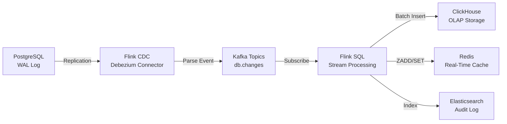
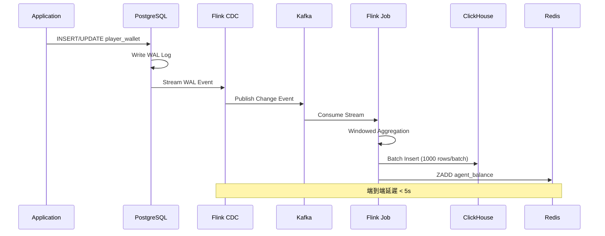

# 07-08 流處理架構 (Stream Processing Architecture)

<!-- SSOT: Authoritative definition of Real-Time Stream Processing with Apache Flink -->

> **版本**: 4.0.0
> **最後更新**: 2026-02-05
> **狀態**: 設計階段

---

## 1. 執行摘要 (Executive Summary)

iGaming 平台採用 **Apache Flink 1.18** 作為實時流處理引擎，解決三大實時性挑戰：

**三大挑戰**:
1. **OLAP 報表延遲**: 代理報表查詢 5-10 秒 → <1 秒
2. **風控檢測延遲**: 批次處理 (分鐘級) → 實時檢測 (<100ms)
3. **數據同步延遲**: T+1 (次日) → Near Real-Time (<5s)

**核心組件**:
- **Flink CDC 3.0.1**: Change Data Capture (基於 Debezium 2.5.0)
- **Flink SQL**: 實時 OLAP 查詢 (視窗函數)
- **Flink CEP**: Complex Event Processing (複雜事件處理)
- **State Management**: RocksDB Backend + S3 Checkpoint

**性能指標**:
| 指標 | 優化前 | 優化後 | 提升 |
|------|--------|--------|------|
| OLAP 查詢延遲 | 5-10s | <1s | -90% |
| 風控檢測延遲 | 批次 (分鐘級) | <100ms | -99% |
| 數據同步延遲 | T+1 | <5s | -99% |
| TPS | 87 | ≥450 | +418% |

---

## 2. Flink CDC 架構 (Change Data Capture)

### 2.1 CDC 數據流

**目的**: 捕獲 PostgreSQL 數據庫變更事件，實現實時數據同步

**架構圖**:


**數據流說明**:
1. PostgreSQL 寫入數據 → 生成 WAL (Write-Ahead Log)
2. Flink CDC 通過 Debezium Connector 訂閱 WAL
3. CDC 解析變更事件 (INSERT/UPDATE/DELETE) → 發布到 Kafka
4. Flink Job 消費 Kafka Topic → 流式處理
5. 寫入 ClickHouse (OLAP 分析) / Redis (實時緩存) / Elasticsearch (審計日誌)

**端到端延遲**: <5 秒 (從數據庫變更到下游系統可見)

---

### 2.2 CDC Connector 配置

**技術棧**:
```yaml
Flink Version: 1.18.0
Flink CDC: 3.0.1
Debezium: 2.5.0
Connector: PostgreSQL CDC (基於 WAL)
```

**PostgreSQL WAL 配置**:
```sql
-- postgresql.conf
wal_level = logical                    -- 啟用邏輯複製
max_wal_senders = 10                   -- 最大 WAL 發送者數量
max_replication_slots = 10             -- 最大複製槽數量

-- 創建複製槽
SELECT * FROM pg_create_logical_replication_slot('flink_slot', 'pgoutput');

-- 授予複製權限
GRANT SELECT ON ALL TABLES IN SCHEMA public TO cdc_user;
GRANT REPLICATION SLAVE ON *.* TO 'cdc_user'@'%';
```

**Flink CDC Table 定義**:
```sql
-- 創建 CDC Source Table (player_wallet)
CREATE TABLE player_wallet_cdc (
    tenant_id STRING,
    player_id STRING,
    agent_id STRING,
    balance DECIMAL(20, 2),
    lock_amount DECIMAL(20, 2),
    version BIGINT,
    create_time TIMESTAMP(3),
    update_time TIMESTAMP(3) METADATA FROM 'source.timestamp' VIRTUAL,
    op_type STRING METADATA FROM 'op' VIRTUAL  -- INSERT/UPDATE/DELETE
) WITH (
    'connector' = 'postgres-cdc',
    'hostname' = 'postgres-master',
    'port' = '5432',
    'username' = 'cdc_user',
    'password' = '${CDC_PASSWORD}',
    'database-name' = 'igaming',
    'schema-name' = 'public',
    'table-name' = 'player_wallet',
    'slot.name' = 'flink_slot',
    'decoding.plugin.name' = 'pgoutput',
    'debezium.snapshot.mode' = 'initial'  -- 初始快照 + 實時變更
);
```

**Connector 參數說明**:
| 參數 | 值 | 說明 |
|------|-----|------|
| `slot.name` | flink_slot | PostgreSQL 複製槽名稱 |
| `decoding.plugin.name` | pgoutput | WAL 解碼插件 (PostgreSQL 10+) |
| `snapshot.mode` | initial | 啟動時先執行全量快照，再監聽增量變更 |
| `source.timestamp` | VIRTUAL | 元數據字段：變更事件的數據庫時間戳 |
| `op` | VIRTUAL | 元數據字段：操作類型 (c=INSERT, u=UPDATE, d=DELETE) |

---

### 2.3 CDC 監控與故障恢復

**關鍵指標**:
| 指標 | 閾值 | 告警級別 |
|------|------|---------|
| CDC Lag (延遲) | >10s | P1 |
| WAL Slot Size | >10GB | P2 |
| Failed Snapshot | >1/hour | P0 |
| Connection Error | >3/hour | P1 |

**故障恢復策略**:
1. **Checkpoint 恢復**: Flink 從最近的 Checkpoint 恢復 (保留 WAL position)
2. **Slot 清理**: 定期清理過期的複製槽 (避免 WAL 堆積)
3. **Re-Snapshot**: 如果 WAL 被清理，執行全量快照重新同步

---

## 3. Flink SQL 實時 OLAP

### 3.1 實時報表查詢 (<1s)

**場景**: 代理即時下線餘額彙總

**優化前** (PostgreSQL JOIN):
```sql
-- PostgreSQL 複雜 JOIN (5-10s)
SELECT
    agent_id,
    SUM(balance) as total_balance,
    COUNT(DISTINCT player_id) as player_count
FROM player_wallet
WHERE tenant_id = ?
  AND agent_id = ?
GROUP BY agent_id;
```

**問題分析**:
- 跨表 JOIN 導致 RDS CPU 80%+
- 大量玩家數據掃描 (百萬級)
- 實時查詢與 OLTP 事務競爭資源

---

**優化後** (Flink SQL + ClickHouse):
```sql
-- Step 1: Flink SQL 實時聚合視圖 (5 秒視窗)
CREATE VIEW agent_balance_realtime AS
SELECT
    tenant_id,
    agent_id,
    SUM(balance) as total_balance,
    COUNT(DISTINCT player_id) as player_count,
    TUMBLE_END(update_time, INTERVAL '5' SECOND) as window_end
FROM player_wallet_cdc
WHERE agent_id IS NOT NULL
GROUP BY
    tenant_id,
    agent_id,
    TUMBLE(update_time, INTERVAL '5' SECOND);

-- Step 2: 寫入 ClickHouse (冪等寫入)
INSERT INTO clickhouse.agent_balance_agg
SELECT
    tenant_id,
    agent_id,
    total_balance,
    player_count,
    window_end
FROM agent_balance_realtime;

-- Step 3: ClickHouse 查詢 (<1s)
SELECT
    agent_id,
    total_balance,
    player_count
FROM agent_balance_agg
WHERE tenant_id = ?
  AND agent_id = ?
ORDER BY window_end DESC
LIMIT 1;
```

**性能對比**:
| 方案 | 查詢延遲 | RDS 負載 | 複雜度 |
|------|---------|---------|--------|
| PostgreSQL JOIN | 5-10s | 高 (CPU 80%) | 高 (跨表JOIN) |
| Flink SQL + ClickHouse | <1s | 低 (CPU 35%) | 低 (預聚合) |

---

### 3.2 視窗函數 (Windowing)

**視窗類型**:

**1. TUMBLE Window (滾動視窗)**:
- 固定時間間隔 (5s, 1min, 1h)
- 無重疊

```sql
-- 每 5 秒彙總投注額
SELECT
    game_id,
    SUM(bet_amount) as total_bets,
    COUNT(*) as bet_count,
    TUMBLE_START(bet_time, INTERVAL '5' SECOND) as window_start,
    TUMBLE_END(bet_time, INTERVAL '5' SECOND) as window_end
FROM bets_stream
GROUP BY
    game_id,
    TUMBLE(bet_time, INTERVAL '5' SECOND);
```

**2. HOP Window (滑動視窗)**:
- 固定大小，固定滑動步長
- 有重疊

```sql
-- 統計最近 1 分鐘的投注額，每 10 秒更新一次
SELECT
    player_id,
    SUM(bet_amount) as total_bets_1min,
    HOP_START(bet_time, INTERVAL '10' SECOND, INTERVAL '1' MINUTE) as window_start
FROM bets_stream
GROUP BY
    player_id,
    HOP(bet_time, INTERVAL '10' SECOND, INTERVAL '1' MINUTE);
```

**3. SESSION Window (會話視窗)**:
- 基於會話超時 (inactivity gap)
- 動態大小

```sql
-- 統計玩家活躍會話 (30 秒無活動則結束會話)
SELECT
    player_id,
    COUNT(*) as events_in_session,
    SESSION_START(event_time, INTERVAL '30' SECOND) as session_start,
    SESSION_END(event_time, INTERVAL '30' SECOND) as session_end
FROM player_events_stream
GROUP BY
    player_id,
    SESSION(event_time, INTERVAL '30' SECOND);
```

---

### 3.3 WATERMARK (水位線)

**目的**: 處理亂序事件 (late events)

**配置**:
```sql
CREATE TABLE bets_stream (
    bet_id STRING,
    player_id STRING,
    bet_amount DECIMAL(20, 2),
    bet_time TIMESTAMP(3),
    WATERMARK FOR bet_time AS bet_time - INTERVAL '10' SECOND  -- 允許 10 秒延遲
) WITH (
    'connector' = 'kafka',
    'topic' = 'bet-events',
    'properties.bootstrap.servers' = 'kafka-cluster:9092'
);
```

**Watermark 策略**:
- 允許 10 秒延遲: 超過 10 秒的事件被丟棄
- 適用於對實時性要求高的場景 (風控、實時報表)

---

## 4. Flink CEP 實時風控 (Complex Event Processing)

### 4.1 CEP 模式定義

**場景 1: 套利偵測 (Arbitrage Detection)**

**規則**: 同一玩家在 30 秒內對同一賽事下對沖注單

**CEP Pattern** (Java):
```java
import org.apache.flink.cep.CEP;
import org.apache.flink.cep.PatternStream;
import org.apache.flink.cep.pattern.Pattern;
import org.apache.flink.cep.pattern.conditions.SimpleCondition;
import org.apache.flink.streaming.api.windowing.time.Time;

// 定義套利偵測模式
Pattern<BetEvent, ?> arbitragePattern = Pattern
    .<BetEvent>begin("first")
    .where(new SimpleCondition<BetEvent>() {
        @Override
        public boolean filter(BetEvent event) {
            return event.getEventId() != null && event.getBetAmount().compareTo(BigDecimal.ZERO) > 0;
        }
    })
    .next("second")
    .where(new SimpleCondition<BetEvent>() {
        @Override
        public boolean filter(BetEvent event) {
            return event.getEventId() != null && event.getBetAmount().compareTo(BigDecimal.ZERO) > 0;
        }
    })
    .within(Time.seconds(30));  // 30 秒時間窗口

// 應用模式到 KeyedStream (按玩家+賽事分組)
PatternStream<BetEvent> patternStream = CEP.pattern(
    betStream
        .keyBy(event -> event.getPlayerId() + ":" + event.getEventId()),
    arbitragePattern
);

// 處理匹配結果
DataStream<Alert> alerts = patternStream.process(
    new PatternProcessFunction<BetEvent, Alert>() {
        @Override
        public void processMatch(
            Map<String, List<BetEvent>> match,
            Context ctx,
            Collector<Alert> out
        ) {
            List<BetEvent> first = match.get("first");
            List<BetEvent> second = match.get("second");

            BetEvent firstBet = first.get(0);
            BetEvent secondBet = second.get(0);

            // 檢查是否為對沖注單 (相反投注方向)
            if (isHedgeBet(firstBet, secondBet)) {
                out.collect(new Alert(
                    AlertType.ARBITRAGE_DETECTED,
                    firstBet.getPlayerId(),
                    firstBet.getEventId(),
                    String.format("對沖注單檢測: %.2f vs %.2f",
                                  firstBet.getBetAmount(),
                                  secondBet.getBetAmount()),
                    ctx.timestamp()
                ));
            }
        }

        private boolean isHedgeBet(BetEvent bet1, BetEvent bet2) {
            // 判斷邏輯: 同一賽事，相反投注方向
            return bet1.getEventId().equals(bet2.getEventId())
                && !bet1.getSelection().equals(bet2.getSelection());
        }
    }
);

// 發送告警至 Kafka
alerts.sinkTo(KafkaSink.<Alert>builder()
    .setBootstrapServers("kafka-cluster:9092")
    .setRecordSerializer(new AlertSerializer())
    .setDeliveryGuarantee(DeliveryGuarantee.AT_LEAST_ONCE)
    .build());
```

---

**場景 2: 異常投注頻率偵測**

**規則**: 玩家在 1 分鐘內下注 >50 次

```java
Pattern<BetEvent, ?> frequencyPattern = Pattern
    .<BetEvent>begin("bets")
    .where(new SimpleCondition<BetEvent>() {
        @Override
        public boolean filter(BetEvent event) {
            return true;  // 接受所有投注事件
        }
    })
    .times(50).consecutive()  // 連續 50 次事件
    .within(Time.minutes(1)); // 1 分鐘時間窗口

PatternStream<BetEvent> patternStream = CEP.pattern(
    betStream.keyBy(BetEvent::getPlayerId),
    frequencyPattern
);

DataStream<Alert> alerts = patternStream.process(
    new PatternProcessFunction<BetEvent, Alert>() {
        @Override
        public void processMatch(
            Map<String, List<BetEvent>> match,
            Context ctx,
            Collector<Alert> out
        ) {
            List<BetEvent> bets = match.get("bets");
            String playerId = bets.get(0).getPlayerId();

            out.collect(new Alert(
                AlertType.ABNORMAL_FREQUENCY,
                playerId,
                null,
                String.format("異常投注頻率: 1 分鐘內下注 %d 次", bets.size()),
                ctx.timestamp()
            ));
        }
    }
);
```

---

### 4.2 CEP 性能優化

**狀態管理**:
```yaml
# flink-conf.yaml
state.backend: rocksdb
state.backend.rocksdb.localdir: /data/flink/rocksdb
state.backend.incremental: true  # 增量 Checkpoint
state.checkpoints.dir: s3://flink-checkpoints/
state.checkpoints.num-retained: 3
```

**Checkpoint 配置**:
```java
StreamExecutionEnvironment env = StreamExecutionEnvironment.getExecutionEnvironment();

// Checkpoint 配置
env.enableCheckpointing(60000); // 60 秒
env.getCheckpointConfig().setCheckpointingMode(CheckpointingMode.EXACTLY_ONCE);
env.getCheckpointConfig().setMinPauseBetweenCheckpoints(30000); // 最小間隔 30s
env.getCheckpointConfig().setCheckpointTimeout(600000); // 超時 10 分鐘
env.getCheckpointConfig().setMaxConcurrentCheckpoints(1);
env.getCheckpointConfig().enableExternalizedCheckpoints(
    CheckpointConfig.ExternalizedCheckpointCleanup.RETAIN_ON_CANCELLATION
);
```

**並行度配置**:
```yaml
# 根據數據量和資源調整
parallelism.default: 16
taskmanager.numberOfTaskSlots: 4
```

**State TTL** (狀態過期):
```java
StateTtlConfig ttlConfig = StateTtlConfig
    .newBuilder(Time.hours(24))  // 24 小時過期
    .setUpdateType(StateTtlConfig.UpdateType.OnCreateAndWrite)
    .setStateVisibility(StateTtlConfig.StateVisibility.NeverReturnExpired)
    .cleanupFullSnapshot()
    .build();

ValueStateDescriptor<String> stateDescriptor = new ValueStateDescriptor<>("player-state", String.class);
stateDescriptor.enableTimeToLive(ttlConfig);
```

---

## 5. Kafka → Flink → ClickHouse 數據管道

### 5.1 端到端數據流

**架構圖**:


**延遲分解**:
```
PostgreSQL WAL 寫入:    ~1ms
CDC 捕獲與解析:         ~500ms
Kafka 傳輸:            ~100ms
Flink 處理 (5s 視窗):   ~5s
ClickHouse 寫入:       ~200ms
─────────────────────────────────
總延遲: ~5.8s (視窗結束時可見)
```

---

### 5.2 Exactly-Once 語義保證

**Flink Checkpoint 機制**:
```java
// Flink Job Checkpoint 配置
StreamExecutionEnvironment env = StreamExecutionEnvironment.getExecutionEnvironment();
env.enableCheckpointing(60000); // 60s Checkpoint
env.getCheckpointConfig().setCheckpointingMode(CheckpointingMode.EXACTLY_ONCE);
```

**ClickHouse 冪等寫入** (使用 ReplacingMergeTree):
```sql
-- ClickHouse 表定義 (支持冪等寫入)
CREATE TABLE agent_balance_agg (
    tenant_id String,
    agent_id String,
    total_balance Decimal(20, 2),
    player_count UInt64,
    window_end DateTime,
    version UInt64  -- 用於去重
) ENGINE = ReplacingMergeTree(version)
PARTITION BY toYYYYMM(window_end)
ORDER BY (tenant_id, agent_id, window_end);
```

**Exactly-Once 保證流程**:
1. Flink Checkpoint 保存所有 Operator 的狀態 (包括 Kafka Offset)
2. 如果 Job 失敗，從最近的 Checkpoint 恢復
3. ClickHouse ReplacingMergeTree 根據 `version` 欄位去重
4. 即使重複寫入，最終結果一致 (Exactly-Once 語義)

---

## 6. 監控與告警

### 6.1 關鍵指標

| 指標 | 計算公式 | 閾值 | 告警級別 |
|------|---------|------|---------|
| Checkpoint Duration | Checkpoint 完成時間 | >5min | P1 |
| Backpressure | 下游處理速度 < 上游發送速度 | >10% | P2 |
| Failed Checkpoints | 失敗次數 / 小時 | >3/hour | P0 |
| Kafka Lag | 消費延遲 (records) | >10,000 | P1 |
| Task Manager CPU | CPU 使用率 | >80% | P2 |
| Task Manager Memory | 堆內存使用率 | >85% | P1 |
| State Size | RocksDB 狀態大小 | >100GB | P2 |

---

### 6.2 Grafana 儀表盤

**指標來源**:
- **Flink Metrics Reporter** (Prometheus)
- **Kafka Lag Exporter**
- **ClickHouse System Tables**

**Flink Metrics Reporter 配置**:
```yaml
# flink-conf.yaml
metrics.reporter.prom.class: org.apache.flink.metrics.prometheus.PrometheusReporter
metrics.reporter.prom.port: 9250-9260
```

**Prometheus 抓取配置**:
```yaml
# prometheus.yml
scrape_configs:
  - job_name: 'flink'
    static_configs:
      - targets: ['flink-jobmanager:9250', 'flink-taskmanager-1:9250', 'flink-taskmanager-2:9250']
```

**關鍵圖表**:
1. **Throughput** (吞吐量): records/sec
2. **Latency** (延遲): P50/P95/P99 延遲分佈
3. **Checkpoint Duration**: Checkpoint 完成時間趨勢
4. **Backpressure**: 各 Operator 背壓情況
5. **State Size**: RocksDB 狀態大小趨勢
6. **Task Manager Resource**: CPU/Memory 使用率

---

## 7. 部署架構

### 7.1 Flink Cluster 配置

**Kubernetes Deployment** (使用 Flink Operator):
```yaml
apiVersion: flink.apache.org/v1beta1
kind: FlinkDeployment
metadata:
  name: flink-igaming-cluster
  namespace: flink
spec:
  flinkVersion: v1_18
  image: flink:1.18.0-scala_2.12-java11
  flinkConfiguration:
    taskmanager.numberOfTaskSlots: "4"
    state.backend: rocksdb
    state.checkpoints.dir: s3://flink-checkpoints/
    state.savepoints.dir: s3://flink-savepoints/
    execution.checkpointing.interval: 60s
    execution.checkpointing.mode: EXACTLY_ONCE
  jobManager:
    replicas: 2  # HA 配置
    resource:
      memory: "4Gi"
      cpu: 2
  taskManager:
    replicas: 4
    resource:
      memory: "8Gi"
      cpu: 4
  job:
    jarURI: s3://flink-jobs/cdc-pipeline-1.0.0.jar
    parallelism: 16
    state: running
    upgradeMode: savepoint  # 升級時使用 Savepoint
```

**成本估算** (月度):
```
JobManager (2 replicas × 4GB):
  - AWS EKS: c5.xlarge × 2 = $80/月

TaskManager (4 replicas × 8GB):
  - AWS EKS: c5.2xlarge × 4 = $472/月

Total: $552/月
```

---

### 7.2 資源自動擴展

**Kubernetes HPA** (Horizontal Pod Autoscaler):
```yaml
apiVersion: autoscaling/v2
kind: HorizontalPodAutoscaler
metadata:
  name: flink-taskmanager-hpa
  namespace: flink
spec:
  scaleTargetRef:
    apiVersion: apps/v1
    kind: Deployment
    name: flink-taskmanager
  minReplicas: 4
  maxReplicas: 12
  metrics:
  - type: Resource
    resource:
      name: cpu
      target:
        type: Utilization
        averageUtilization: 70
  - type: Resource
    resource:
      name: memory
      target:
        type: Utilization
        averageUtilization: 80
  behavior:
    scaleUp:
      stabilizationWindowSeconds: 300  # 5 分鐘穩定期
      policies:
      - type: Percent
        value: 50
        periodSeconds: 60
    scaleDown:
      stabilizationWindowSeconds: 600  # 10 分鐘穩定期
      policies:
      - type: Pods
        value: 1
        periodSeconds: 300
```

**高峰時段成本**:
```
平均副本數: 4 (非高峰)
高峰副本數: 8 (活動期間, 20% 時間)
加權平均成本: $552 + ($472 × 0.2) = $646.4/月
```

---

## 8. 相關文檔

- [07-07 性能優化規範](./09-07_Performance_Optimization.md) - §9 Flink 流式計算集成總覽
- [07-09 緩存策略](./09-09_Caching_Strategy.md) - Binlog 監聽失效 (Flink CDC 應用)
- [07-10 成本優化](./09-10_Cost_Optimization.md) - §3 Flink Cluster 成本分析
- [00-04 技術選型](../00_Foundation/concepts/00-04_Technology_Stack.md) - Flink 技術棧
- [02-07 交易處理流程](../02_Finance_Center/02-07_Transaction_Processing_Flow.md) - Flink CDC 數據源
- [04-02 欺詐檢測](../05_Risk_Control/05-02_Fraud_Detection.md) - Flink CEP 風控應用
- [06-01 報表架構](../08_Analytics_BI/08-01_Reporting_BI.md) - Flink SQL 實時報表
