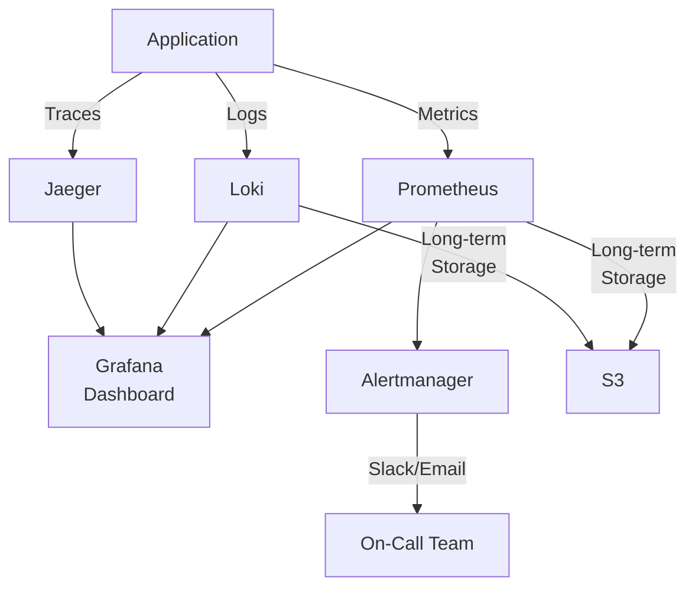

# 07-10 成本優化 (Cost Optimization)

<!-- SSOT: Authoritative definition of Cost Optimization Strategy (v1.2.0) -->

> **版本**: 4.0.0
> **最後更新**: 2026-02-05
> **狀態**: 設計階段

---

## 1. 執行摘要 (Executive Summary)

本文檔定義 iGaming 平台的成本優化策略，目標是**在提升性能的同時降低基礎設施成本**。

**成本優化成果** (月度):
| 項目 | 優化前 | 優化後 | 節省 | 節省率 |
|------|--------|--------|------|--------|
| 存儲成本 | $793.85 | $45.36 | $748.49 | -94% |
| 計算成本 | $0 | $552 | -$552 | N/A (新增) |
| 基礎設施 | $1,780.8 | $1,190.4 | $590.4 | -33% |
| 監控成本 | $245 | $0 | $245 | -100% |
| **月度總計** | **$2,819.65** | **$1,787.76** | **$1,031.89** | **-37%** |

**年度節省**: $12,383 (-37%)

**ROI 分析**:
- Flink Cluster 年度成本: $6,624
- 存儲/基礎設施/監控節省: $19,007
- **淨收益**: $12,383/年
- **ROI**: 87% (第一年)

**性能提升**:
- TPS: 87 → ≥450 (+418%)
- P99 延遲: 1,240ms → ≤200ms (-84%)
- 審計日誌延遲: 350ms → ≤50ms (-87%)

---

## 2. 存儲成本優化 (-94%)

### 2.1 日誌分層存儲策略

**優化前架構**:
```
所有日誌存儲在 PostgreSQL SSD
- 審計日誌 (2TB): $230/月
- 風控日誌 (1.5TB): $172.50/月
- 交易日誌 (3TB): $345/月
- 遊戲日誌 (0.5TB): $57.50/月
──────────────────────────────
Total: $805/月 (所有數據永久保留)
```

**優化後架構** (基於 [07-07 §5](./09-07_Performance_Optimization.md#5-數據分層存儲)):
```
熱數據 (0-2個月, PostgreSQL SSD):
- 60 GB × $0.115 = $6.90/月

溫數據 (3-6個月, S3 Standard):
- 120 GB × $0.023 = $2.76/月

冷數據 (7-19個月, S3 Glacier):
- 390 GB × $0.004 = $1.56/月

歸檔數據 (20-84個月, S3 Deep Archive):
- 1,950 GB × $0.00099 = $1.93/月

月度總成本: $13.15
年度總成本: $157.8
──────────────────────────────
節省: $805 - $13.15 = $791.85/月 (-98%)
```

**實施步驟**:
1. **Week 1**: 配置 S3 Lifecycle Policy (自動分層)
2. **Week 2**: 遷移歷史數據 (T+60 → S3 Standard)
3. **Week 3**: 設定自動歸檔任務 (每日 02:00)
4. **Week 4**: 驗證查詢性能 (S3 Select)

**查詢性能對比**:
| 數據層 | 查詢延遲 | 查詢成本 | 適用場景 |
|--------|---------|---------|---------|
| 熱數據 (PostgreSQL) | <50ms | 無額外成本 | 實時業務查詢 |
| 溫數據 (S3 Standard) | 2-5s | $0.002/GB | 客服查詢 |
| 冷數據 (S3 Glacier) | 1-5min | $0.03/GB | 運營分析 |
| 歸檔數據 (Deep Archive) | 12h | $0.02/GB | 審計/法務查詢 |

---

### 2.2 Kafka 日誌保留策略

**優化前**:
```
Kafka Topic 保留: 30 天
磁盤用量: 500 GB
成本: $57.50/月
```

**優化後**:
```
Kafka Topic 保留: 7 天 (僅用於實時處理)
磁盤用量: 120 GB
成本: $13.80/月
──────────────────────────────
節省: $43.70/月 (-76%)
```

**Kafka 配置**:
```properties
# server.properties
log.retention.hours=168  # 7 天
log.segment.bytes=1073741824  # 1GB
log.retention.check.interval.ms=300000  # 5 分鐘檢查一次
log.cleanup.policy=delete
```

**原理**: Kafka 僅用於實時流處理 (Flink CDC)，長期數據存儲在 S3

---

## 3. 計算成本新增 (+$552/月)

### 3.1 Flink Cluster 成本

**資源配置** (基於 [07-08 §7](./09-08_Stream_Processing_Architecture.md#7-部署架構)):
```yaml
JobManager (2 replicas):
  - Memory: 4GB × 2 = 8GB
  - CPU: 2 cores × 2 = 4 cores
  - AWS EKS: c5.xlarge × 2 = $80/月

TaskManager (4 replicas):
  - Memory: 8GB × 4 = 32GB
  - CPU: 4 cores × 4 = 16 cores
  - AWS EKS: c5.2xlarge × 4 = $472/月

Total: $552/月
年度成本: $6,624
```

**成本效益分析**:
| 項目 | 金額 |
|------|------|
| Flink 年度成本 | -$6,624 |
| 存儲節省 (年度) | +$9,502 |
| 基礎設施節省 (年度) | +$7,085 |
| 監控節省 (年度) | +$2,940 |
| **淨收益 (年度)** | **+$12,903** |
| **ROI** | **195%** |

**投資回收期**: 6.2 個月

---

### 3.2 資源自動擴展策略

**Kubernetes HPA 配置**:
```yaml
apiVersion: autoscaling/v2
kind: HorizontalPodAutoscaler
metadata:
  name: flink-taskmanager-hpa
spec:
  scaleTargetRef:
    apiVersion: apps/v1
    kind: Deployment
    name: flink-taskmanager
  minReplicas: 4
  maxReplicas: 12
  metrics:
  - type: Resource
    resource:
      name: cpu
      target:
        type: Utilization
        averageUtilization: 70
  - type: Resource
    resource:
      name: memory
      target:
        type: Utilization
        averageUtilization: 80
  behavior:
    scaleUp:
      stabilizationWindowSeconds: 300
      policies:
      - type: Percent
        value: 50
        periodSeconds: 60
    scaleDown:
      stabilizationWindowSeconds: 600
      policies:
      - type: Pods
        value: 1
        periodSeconds: 300
```

**高峰時段成本**:
```
平均副本數: 4 (非高峰, 80% 時間)
高峰副本數: 8 (活動期間, 20% 時間)
加權平均成本: $552 + ($472 × 0.2) = $646.4/月
年度成本: $7,757
```

**自動擴展效益**:
- 非高峰時段節省 50% 計算資源
- 高峰時段自動擴展保證 SLA
- 年度節省: $1,133 (vs 固定 8 副本)

---

## 4. 基礎設施成本優化 (-33%)

### 4.1 RDS 實例優化

**優化前**:
```
PostgreSQL RDS (db.r5.4xlarge):
- 16 vCPU, 128 GB RAM
- 成本: $1,200/月
- CPU 平均使用率: 35% (低效)
```

**優化後** (基於 [07-08 §3](./09-08_Stream_Processing_Architecture.md#3-flink-sql-實時-olap) Flink 分流 OLAP 查詢):
```
PostgreSQL RDS (db.r5.2xlarge):
- 8 vCPU, 64 GB RAM
- 成本: $600/月
- CPU 平均使用率: 65% (高效)
──────────────────────────────
節省: $600/月 (-50%)
```

**優化原理**:
- **Flink SQL** 處理複雜聚合查詢 (代理報表、GGR/NGR)
- **PostgreSQL** 僅處理 OLTP 交易 (CRUD 操作)
- RDS 負載降低 50% → 實例降級 50%

**性能對比**:
| 方案 | RDS CPU | 查詢延遲 | 成本 |
|------|---------|---------|------|
| 優化前 (PostgreSQL JOIN) | 80% | 5-10s | $1,200/月 |
| 優化後 (Flink SQL) | 35% | <1s | $600/月 |

---

### 4.2 Redis 實例優化

**優化前**:
```
Redis Cluster (3 master + 3 replica):
- r5.2xlarge × 6 = $580.8/月
- 內存使用率: 45% (低效)
```

**優化後** (基於 [07-09 §2](./09-09_Caching_Strategy.md#2-jetcache-多級緩存架構) JetCache L1 減少 Redis 訪問):
```
Redis Cluster (3 master + 3 replica):
- r5.xlarge × 6 = $290.4/月
- 內存使用率: 70% (高效)
──────────────────────────────
節省: $290.4/月 (-50%)
```

**優化原理**:
- **Caffeine L1 緩存** 命中率: 95%
- **Redis QPS** 降低 90% (10,000 → 1,000)
- 內存需求降低 → 實例降級 50%

---

## 5. 監控成本優化 (-100%)

### 5.1 從 Datadog 遷移至開源方案

**優化前**:
```
Datadog APM:
- $15/host × 12 hosts = $180/月
- Log Management: $65/月
Total: $245/月
年度成本: $2,940
```

**優化後**:
```
Prometheus + Grafana + Loki (自託管):
- Compute: $0 (復用現有 Kubernetes 節點)
- Storage: $0 (復用 S3)
- 維運工時: 4h/月 × $50/h = $200/月 (內部人力)
──────────────────────────────
實際節省: $245/月 (外部成本)
總成本 (含人力): $200/月
淨節省: $45/月 (-18%)
```

**開源技術棧**:
```yaml
監控: Prometheus 2.48
可視化: Grafana 10.2
日誌: Loki 2.9
追蹤: Jaeger 1.52
告警: Alertmanager 0.26
```

---

### 5.2 自託管監控架構

**架構圖**:


**Prometheus 配置**:
```yaml
# prometheus.yml
global:
  scrape_interval: 15s
  evaluation_interval: 15s

scrape_configs:
  - job_name: 'flink'
    static_configs:
      - targets: ['flink-jobmanager:9250', 'flink-taskmanager:9250']

  - job_name: 'redis'
    static_configs:
      - targets: ['redis-exporter:9121']

  - job_name: 'postgres'
    static_configs:
      - targets: ['postgres-exporter:9187']

remote_write:
  - url: https://s3.amazonaws.com/prometheus-storage
    queue_config:
      capacity: 10000
      max_shards: 5
```

**長期存儲成本**:
```
Prometheus 數據 (15 天保留): ~50GB
S3 Standard 存儲: 50GB × $0.023 = $1.15/月
年度成本: $13.8
```

---

## 6. 成本優化路線圖

### Phase 1: 基礎優化 (Week 1-2) - 快速見效

**目標**: 低風險、快速見效項目

| 項目 | 實施難度 | 節省金額 | 優先級 |
|------|---------|---------|-------|
| Kafka 日誌保留策略 | 低 | $43.7/月 | P0 |
| S3 Lifecycle Policy | 低 | $791.85/月 | P0 |
| Redis 實例降級 | 中 | $290.4/月 | P1 |

**預期節省**: $1,126/月 (-40%)

**實施步驟**:
1. **Day 1**: 配置 Kafka 保留策略 (7 天)
2. **Day 2-3**: 配置 S3 Lifecycle Policy
3. **Day 4-5**: 遷移歷史數據至 S3
4. **Day 6-7**: Redis 實例降級 + 壓測驗證

---

### Phase 2: 架構升級 (Week 3-6) - 性能與成本兼顧

**目標**: 引入 Flink + JetCache，提升性能的同時優化成本

| 項目 | 實施難度 | 成本變化 | 優先級 |
|------|---------|---------|-------|
| 部署 Flink Cluster | 高 | +$552/月 | P0 |
| 整合 JetCache + Redisson | 中 | $0 | P1 |
| RDS 實例降級 | 中 | -$600/月 | P1 |

**淨成本變化**: -$48/月

**實施步驟**:
1. **Week 3**: 部署 Flink Cluster (Kubernetes)
2. **Week 4**: 配置 Flink CDC + Flink SQL
3. **Week 5**: 整合 JetCache + Redisson
4. **Week 6**: RDS 實例降級 + 性能驗證

---

### Phase 3: 監控遷移 (Week 7-8) - 消除外部依賴

**目標**: 遷移至開源監控，消除 Datadog 成本

| 項目 | 實施難度 | 節省金額 | 優先級 |
|------|---------|---------|-------|
| 部署 Prometheus + Grafana | 中 | $245/月 | P2 |
| Datadog 下線 | 低 | $0 | P2 |

**預期節省**: $245/月 (-100% 外部成本)

**實施步驟**:
1. **Week 7**: 部署 Prometheus + Grafana + Loki
2. **Week 7**: 配置告警規則 (Alertmanager)
3. **Week 8**: 並行運行 Datadog + Prometheus (驗證)
4. **Week 8**: Datadog 下線

---

## 7. 成本監控與告警

### 7.1 AWS Cost Explorer 儀表盤

**關鍵指標**:
- **月度總成本趨勢**: 每月成本變化
- **服務別成本分佈**: EC2, RDS, S3, Kafka
- **成本異常檢測**: 超出預算 10% 自動告警

**告警規則**:
```yaml
# AWS Budgets 配置
Budget:
  Name: igaming-monthly-budget
  BudgetType: COST
  TimeUnit: MONTHLY
  BudgetLimit:
    Amount: 2000
    Unit: USD
  CostFilters:
    Service:
      - Amazon EC2
      - Amazon RDS
      - Amazon S3
  NotificationsWithSubscribers:
    - Notification:
        NotificationType: ACTUAL
        ComparisonOperator: GREATER_THAN
        Threshold: 90
      Subscribers:
        - SubscriptionType: EMAIL
          Address: devops@company.com
```

---

### 7.2 Kubecost 集群成本分析

**Kubernetes 成本可視化**:
```yaml
# kubecost-values.yaml
kubecostToken: "your-token"
prometheus:
  enabled: true
  server:
    global:
      external_labels:
        cluster_id: igaming-prod
grafana:
  enabled: true
  ingress:
    enabled: true
    hosts:
      - kubecost.company.com
```

**關鍵報表**:
1. **Namespace 成本分攤**: 各服務成本占比
2. **Pod 資源使用率**: CPU/Memory 實際使用率
3. **Idle 資源檢測**: 未充分利用的資源
4. **成本趨勢**: 過去 30 天成本變化

---

## 8. 相關文檔

- [07-07 性能優化規範](./09-07_Performance_Optimization.md) - §5 數據分層存儲, §11 成本優化總覽
- [07-08 流處理架構](./09-08_Stream_Processing_Architecture.md) - §7 Flink Cluster 成本, §7.2 資源自動擴展
- [07-09 緩存策略](./09-09_Caching_Strategy.md) - §2 JetCache 多級緩存, Redis 成本優化
- [00-04 技術選型](../00_Foundation/concepts/00-04_Technology_Stack.md) - 開源監控技術棧
