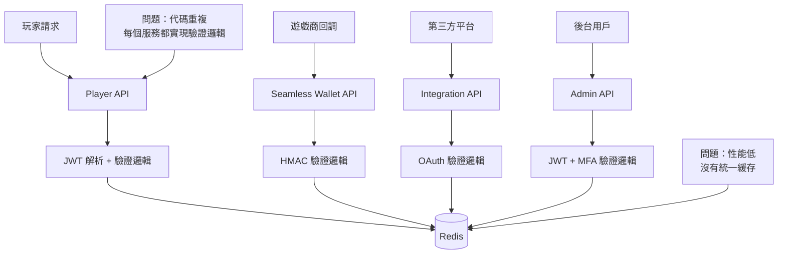
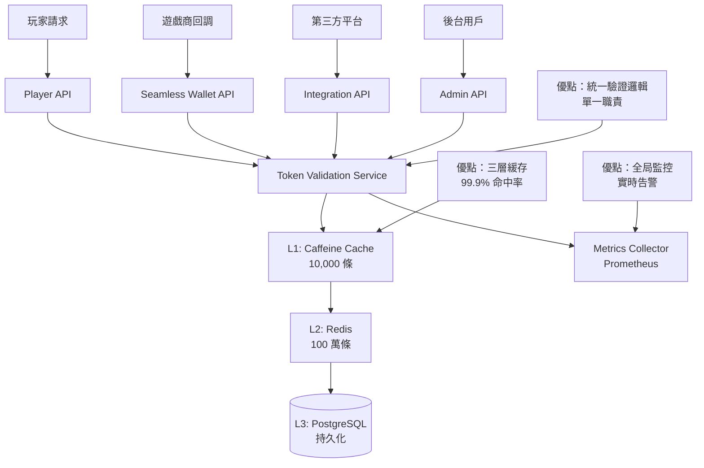

# 09-13-01 Token 驗證服務 - 驗證架構設計

**Document Metadata**:
- Version: 1.0.0
- Created: 2026-02-07
- Last Updated: 2026-02-07
- Status: Production Ready
- Priority: P2 (Medium)
- Owner: Backend Team + Infrastructure Team
- Parent: [09-13 Token Validation Service](09-13_Token_Validation_Service.md)
- Related:
  - [09-12 Multi-Actor Token Security](09-12_Multi_Actor_Token_Security.md)
  - [09-11 OAuth Refresh Token Implementation](09-11_OAuth_Refresh_Token_Implementation.md)

---

## 目錄

- [1. 架構概覽](#1-架構概覽)
  - [1.1 為什麼需要獨立的 Token 驗證服務](#11-為什麼需要獨立的-token-驗證服務)
  - [1.2 設計目標](#12-設計目標)
  - [1.3 系統定位](#13-系統定位)
- [2. 服務職責](#2-服務職責)
  - [2.1 核心功能](#21-核心功能)
  - [2.2 非功能性需求](#22-非功能性需求)
- [3. API 設計](#3-api-設計)
  - [3.1 單一驗證接口](#31-單一驗證接口)
  - [3.2 批量驗證接口](#32-批量驗證接口)
  - [3.3 撤銷接口](#33-撤銷接口)
  - [3.4 內省接口（Introspection）](#34-內省接口introspection)

---

## 1. 架構概覽

### 1.1 為什麼需要獨立的 Token 驗證服務

**問題背景**：SmartAdmin iGaming 平台有 4 種不同角色需要 Token 驗證：

| 角色 | Token 類型 | 驗證需求 | 當前實施方式 |
|------|----------|---------|------------|
| **玩家（Player）** | JWT（Redis Opaque） | 高頻驗證（每次 API 調用） | 分散在各個微服務 |
| **遊戲商（Game Provider）** | Opaque Token + HMAC | 中頻驗證（遊戲回調） | 分散在 Seamless Wallet API |
| **第三方平台** | JWT（OAuth 2.0） | 低頻驗證（數據同步） | 分散在各個集成模塊 |
| **後台用戶（Admin）** | JWT + MFA | 中頻驗證（後台操作） | 分散在 Admin API |

**當前痛點**：

1. **代碼重複**：每個微服務都實現一遍 Token 驗證邏輯（JWT 解析、簽名驗證、過期檢查）
2. **性能問題**：沒有統一緩存，重複查詢 Redis/PostgreSQL
3. **安全風險**：不同微服務的驗證邏輯不一致（例如有的檢查 Device Fingerprint，有的不檢查）
4. **難以監控**：無法統計全局的 Token 驗證失敗率、黑名單命中率
5. **撤銷困難**：玩家被封禁後，需要通知所有微服務刷新黑名單

**解決方案**：獨立的 **Token 驗證服務（Token Validation Service）**。

**架構對比**：

#### **Before（分散式驗證）**：



#### **After（集中式驗證）**：



---

### 1.2 設計目標

**功能目標**：

| 目標 | 說明 | 優先級 |
|------|------|-------|
| **統一驗證** | 支持 4 種 Token 類型（JWT Player、Opaque Game、OAuth Third-party、JWT Admin） | P0 |
| **高性能** | 99 百分位延遲 < 10ms（L1 緩存命中時） | P0 |
| **高可用** | SLA 99.95%（每月宕機時間 < 22 分鐘） | P0 |
| **安全性** | 防重放攻擊、防暴力破解、黑名單實時生效 | P0 |
| **可擴展** | 支持水平擴展（Stateless 服務） | P1 |
| **可觀測** | Prometheus 指標、分布式追蹤、審計日誌 | P1 |

**非功能性目標**：

- **性能**：10,000 QPS（單實例），P99 延遲 < 50ms
- **可用性**：Multi-AZ 部署，自動故障轉移
- **安全性**：TLS 加密、mTLS（服務間通信）
- **合規性**：審計日誌保留 90 天（GDPR / PCI DSS）

---

### 1.3 系統定位

**Token Validation Service 在微服務架構中的定位**：

```mermaid
graph TD
    subgraph Client Layer
        A[玩家 App]
        B[遊戲商服務器]
        C[第三方平台]
        D[後台管理界面]
    end

    subgraph API Gateway Layer
        E[Kong API Gateway]
    end

    subgraph Business Services Layer
        F[Player API]
        G[Seamless Wallet API]
        H[Integration API]
        I[Admin API]
    end

    subgraph Infrastructure Services Layer
        J[Token Validation Service] ⭐
        K[Notification Service]
        L[Audit Log Service]
    end

    subgraph Data Layer
        M[(Redis Cluster)]
        N[(PostgreSQL Primary)]
        O[(PostgreSQL Replica)]
    end

    A --> E
    B --> E
    C --> E
    D --> E

    E --> F
    E --> G
    E --> H
    E --> I

    F --> J
    G --> J
    H --> J
    I --> J

    J --> M
    J --> N
    J --> O

    F --> K
    G --> L
```

**職責邊界**：

| 服務 | 職責 | 不負責 |
|------|------|-------|
| **Token Validation Service** | Token 解析、簽名驗證、過期檢查、黑名單檢查、限流 | Token 頒發（由 Auth Service 負責） |
| **Auth Service** | Token 頒發、用戶登入、Refresh Token 輪換 | Token 驗證（委託給 Token Validation Service） |
| **Business Services** | 業務邏輯處理 | Token 驗證（委託給 Token Validation Service） |

---

## 2. 服務職責

### 2.1 核心功能

**1. Token 解析與簽名驗證**

```java
public interface TokenParser {
    /**
     * 解析並驗證 Token
     *
     * @param token JWT 或 Opaque Token
     * @param actorType 角色類型（PLAYER / GAME_PROVIDER / THIRD_PARTY / ADMIN）
     * @return 驗證結果（包含用戶 ID、權限、元數據）
     * @throws InvalidTokenException Token 無效、過期、簽名錯誤
     */
    TokenValidationResult validate(String token, ActorType actorType);
}
```

**支持的 Token 類型**：

| Token 類型 | 格式 | 驗證方式 | 示例 |
|-----------|------|---------|------|
| **JWT（Player）** | Header.Payload.Signature | RS256 簽名驗證 + Redis 黑名單 | `eyJhbGciOiJSUzI1NiIsInR5cCI6IkpXVCJ9...` |
| **JWT（Admin）** | Header.Payload.Signature | RS256 簽名驗證 + MFA Session 檢查 | `eyJhbGciOiJSUzI1NiIsInR5cCI6IkpXVCJ9...` |
| **Opaque（Game）** | 隨機字符串 | Redis 查詢 + HMAC-SHA256 簽名驗證 | `gp_token_abc123xyz...` |
| **OAuth（Third-party）** | JWT | RS256 簽名驗證 + Scope 檢查 | `eyJhbGciOiJSUzI1NiIsInR5cCI6IkpXVCJ9...` |

---

**2. 黑名單檢查**

**場景**：
- 玩家被封禁（風控檢測到欺詐行為）
- 玩家主動登出（Refresh Token 需立即失效）
- 管理員強制下線（安全事件）

**實施**：

```java
public interface BlacklistChecker {
    /**
     * 檢查 Token 是否在黑名單中
     *
     * @param tokenId Token 唯一標識（JWT jti 或 Opaque token_id）
     * @param userId 用戶 ID
     * @return true 在黑名單中（拒絕訪問），false 不在黑名單中
     */
    boolean isBlacklisted(String tokenId, Long userId);

    /**
     * 將 Token 加入黑名單
     *
     * @param tokenId Token 唯一標識
     * @param userId 用戶 ID
     * @param ttl 黑名單 TTL（與 Token 剩餘有效期相同）
     */
    void addToBlacklist(String tokenId, Long userId, Duration ttl);
}
```

**Redis 數據結構**：

```redis
# Key 格式：blacklist:token:{tokenId}
# Value：用戶 ID + 封禁原因
# TTL：與 Token 剩餘有效期相同

SET blacklist:token:abc123xyz "{\"userId\": 12345, \"reason\": \"FRAUD_DETECTED\"}" EX 900

# 批量檢查（Pipeline）
MGET blacklist:token:abc123 blacklist:token:def456 blacklist:token:ghi789
```

---

**3. 重放攻擊防護**

**Nonce 驗證**（針對 Game Provider Opaque Token）：

```java
public interface NonceValidator {
    /**
     * 驗證 Nonce（確保每個請求唯一）
     *
     * @param nonce 隨機字符串（UUID）
     * @param window 時間窗口（5 分鐘內的 Nonce 被記錄）
     * @return true 首次使用，false 重複使用（拒絕請求）
     */
    boolean validateAndStore(String nonce, Duration window);
}
```

**Redis 實施**：

```redis
# Key 格式：nonce:{nonce}
# Value：timestamp
# TTL：5 分鐘

SET nonce:550e8400-e29b-41d4-a716-446655440000 "1738742400" EX 300

# 原子性檢查（Lua 腳本）
EVAL "if redis.call('EXISTS', KEYS[1]) == 1 then return 0 else redis.call('SET', KEYS[1], ARGV[1], 'EX', 300) return 1 end" 1 nonce:550e8400-e29b-41d4-a716-446655440000 1738742400
```

---

**4. 限流**

**限流策略**（基於 Token Bucket 算法）：

| 角色 | 限流規則 | 時間窗口 | 超出後處理 |
|------|---------|---------|-----------|
| **玩家** | 100 次驗證/分鐘 | 1 分鐘 | HTTP 429 |
| **遊戲商** | 1000 次驗證/分鐘 | 1 分鐘 | HTTP 429 |
| **第三方平台** | 200 次驗證/分鐘 | 1 分鐘 | HTTP 429 |
| **後台用戶** | 50 次驗證/分鐘 | 1 分鐘 | HTTP 429 |

**Redis Lua 腳本實施**（Token Bucket）：

```lua
-- Key 格式：ratelimit:{userId}:{actorType}
-- Value：{tokens: 100, lastRefill: 1738742400}

local key = KEYS[1]
local capacity = tonumber(ARGV[1])  -- 桶容量（例：100）
local refillRate = tonumber(ARGV[2])  -- 補充速率（例：100/60秒）
local now = tonumber(ARGV[3])

local bucket = redis.call('HGETALL', key)
if #bucket == 0 then
    -- 初始化桶
    redis.call('HMSET', key, 'tokens', capacity, 'lastRefill', now)
    redis.call('EXPIRE', key, 60)
    return 1  -- 允許通過
end

local tokens = tonumber(bucket[2])
local lastRefill = tonumber(bucket[4])

-- 計算補充的 tokens
local elapsed = now - lastRefill
local refill = math.floor(elapsed * refillRate)
tokens = math.min(capacity, tokens + refill)

if tokens >= 1 then
    tokens = tokens - 1
    redis.call('HMSET', key, 'tokens', tokens, 'lastRefill', now)
    return 1  -- 允許通過
else
    return 0  -- 拒絕（超出限流）
end
```

---

### 2.2 非功能性需求

**性能需求**：

| 指標 | 目標值 | 測量方式 |
|------|-------|---------|
| **吞吐量** | 10,000 QPS（單實例） | JMeter 壓力測試 |
| **延遲（P50）** | < 5ms | Prometheus Histogram |
| **延遲（P99）** | < 50ms | Prometheus Histogram |
| **緩存命中率** | > 99% | Caffeine + Redis 統計 |
| **錯誤率** | < 0.1% | Prometheus Counter |

**可用性需求**：

| 指標 | 目標值 | 實施方式 |
|------|-------|---------|
| **SLA** | 99.95%（每月宕機 < 22 分鐘） | Multi-AZ 部署 + 自動故障轉移 |
| **MTTR** | < 5 分鐘 | Kubernetes 自動重啟 |
| **RPO** | 0（無數據丟失） | Redis Persistence（AOF） |
| **RTO** | < 1 分鐘 | 主從切換（Redis Sentinel） |

---

## 3. API 設計

### 3.1 單一驗證接口

**接口定義**：

```http
POST /api/token/validate
Content-Type: application/json
X-Request-ID: 550e8400-e29b-41d4-a716-446655440000

{
  "token": "eyJhbGciOiJSUzI1NiIsInR5cCI6IkpXVCJ9...",
  "actorType": "PLAYER",
  "requestMetadata": {
    "ipAddress": "203.0.113.42",
    "userAgent": "Mozilla/5.0...",
    "deviceFingerprint": "e3b0c44298fc1c149afbf4c8996fb92427ae41e4649b934ca495991b7852b855"
  }
}
```

**響應（驗證成功）**：

```json
{
  "code": 200,
  "msg": "Token valid",
  "data": {
    "valid": true,
    "userId": 12345,
    "actorType": "PLAYER",
    "permissions": ["PLAYER:READ", "PLAYER:WITHDRAW"],
    "metadata": {
      "tenantId": "tenant_abc",
      "deviceFingerprint": "e3b0c44298fc1c149afbf4c8996fb92427ae41e4649b934ca495991b7852b855",
      "issuedAt": "2026-02-05T10:00:00Z",
      "expiresAt": "2026-02-05T10:15:00Z"
    }
  }
}
```

**響應（驗證失敗）**：

```json
{
  "code": 401,
  "msg": "Token invalid",
  "data": {
    "valid": false,
    "errorCode": "TOKEN_EXPIRED",
    "errorMessage": "Token has expired at 2026-02-05T10:15:00Z"
  }
}
```

**錯誤碼定義**：

| 錯誤碼 | HTTP 狀態碼 | 說明 | 處理建議 |
|-------|-----------|------|---------|
| `TOKEN_EXPIRED` | 401 | Token 已過期 | 使用 Refresh Token 刷新 |
| `TOKEN_INVALID_SIGNATURE` | 401 | 簽名驗證失敗 | 拒絕請求，記錄安全事件 |
| `TOKEN_BLACKLISTED` | 401 | Token 在黑名單中 | 拒絕請求，提示用戶重新登入 |
| `TOKEN_MALFORMED` | 400 | Token 格式錯誤 | 返回客戶端錯誤 |
| `RATE_LIMIT_EXCEEDED` | 429 | 超出限流 | 稍後重試 |
| `NONCE_REUSED` | 403 | Nonce 重複使用（重放攻擊） | 拒絕請求，記錄安全事件 |

---

### 3.2 批量驗證接口

**使用場景**：
- API Gateway 批量驗證多個 Token（減少網絡往返）
- Batch Job 驗證大量玩家 Token（例如每日簽到獎勵）

**接口定義**：

```http
POST /api/token/validate/batch
Content-Type: application/json

{
  "tokens": [
    {
      "token": "eyJhbGciOiJSUzI1NiIsInR5cCI6IkpXVCJ9...",
      "actorType": "PLAYER"
    },
    {
      "token": "gp_token_abc123xyz...",
      "actorType": "GAME_PROVIDER"
    }
  ]
}
```

**響應**：

```json
{
  "code": 200,
  "msg": "Batch validation complete",
  "data": {
    "results": [
      {
        "index": 0,
        "valid": true,
        "userId": 12345,
        "actorType": "PLAYER"
      },
      {
        "index": 1,
        "valid": false,
        "errorCode": "TOKEN_EXPIRED"
      }
    ],
    "summary": {
      "total": 2,
      "valid": 1,
      "invalid": 1
    }
  }
}
```

**性能優化**：
- Redis Pipeline（批量查詢黑名單）
- 並行驗證（CompletableFuture）
- 最大批量數量：100 個（防止單次請求過大）

---

### 3.3 撤銷接口

**接口定義**：

```http
POST /api/token/revoke
Content-Type: application/json
Authorization: Bearer {adminAccessToken}

{
  "tokenId": "abc123xyz",  // JWT jti 或 Opaque token_id
  "userId": 12345,
  "reason": "FRAUD_DETECTED",
  "revokeAllTokens": false  // true 撤銷該用戶所有 Token
}
```

**響應**：

```json
{
  "code": 200,
  "msg": "Token revoked successfully",
  "data": {
    "revokedCount": 1,
    "expiresAt": "2026-02-05T10:15:00Z"
  }
}
```

**實施邏輯**：

```java
@Transactional(rollbackFor = Throwable.class)
public ResponseDTO<RevokeResult> revokeToken(RevokeRequest request) {
    if (request.isRevokeAllTokens()) {
        // 撤銷該用戶所有 Token
        List<String> tokenIds = tokenRepository.findAllActiveTokensByUserId(request.getUserId());

        for (String tokenId : tokenIds) {
            blacklistService.addToBlacklist(tokenId, request.getUserId(), getTtl(tokenId));
        }

        // 記錄審計日誌（CRITICAL 級別）
        auditLogService.log(request.getUserId(), "ALL_TOKENS_REVOKED", request.getReason());

        return ResponseDTO.ok(new RevokeResult(tokenIds.size()));
    } else {
        // 撤銷單個 Token
        blacklistService.addToBlacklist(request.getTokenId(), request.getUserId(), getTtl(request.getTokenId()));

        auditLogService.log(request.getUserId(), "TOKEN_REVOKED", request.getReason());

        return ResponseDTO.ok(new RevokeResult(1));
    }
}
```

---

### 3.4 內省接口（Introspection）

**用途**：查詢 Token 的詳細信息（不進行驗證）。

**接口定義**：

```http
POST /api/token/introspect
Content-Type: application/json
Authorization: Bearer {adminAccessToken}

{
  "token": "eyJhbGciOiJSUzI1NiIsInR5cCI6IkpXVCJ9..."
}
```

**響應**：

```json
{
  "code": 200,
  "msg": "Success",
  "data": {
    "active": true,
    "tokenType": "ACCESS_TOKEN",
    "userId": 12345,
    "actorType": "PLAYER",
    "scope": ["PLAYER:READ", "PLAYER:WITHDRAW"],
    "issuedAt": "2026-02-05T10:00:00Z",
    "expiresAt": "2026-02-05T10:15:00Z",
    "issuer": "smartadmin-auth-service",
    "deviceFingerprint": "e3b0c44298fc1c149afbf4c8996fb92427ae41e4649b934ca495991b7852b855",
    "isBlacklisted": false
  }
}
```

**使用場景**：
- 後台管理界面查詢玩家 Token 狀態
- Security Team 調查異常登入事件
- Debug 工具（開發環境）

---

**Related Documents**:
- [09-13-02 Cache Performance](09-13-02_Cache_Performance.md) - 驗證流程設計、三層緩存策略
- [09-13-03 Edge Deployment](09-13-03_Edge_Deployment.md) - 重放攻擊防護、限流熔斷、高可用設計、監控告警
