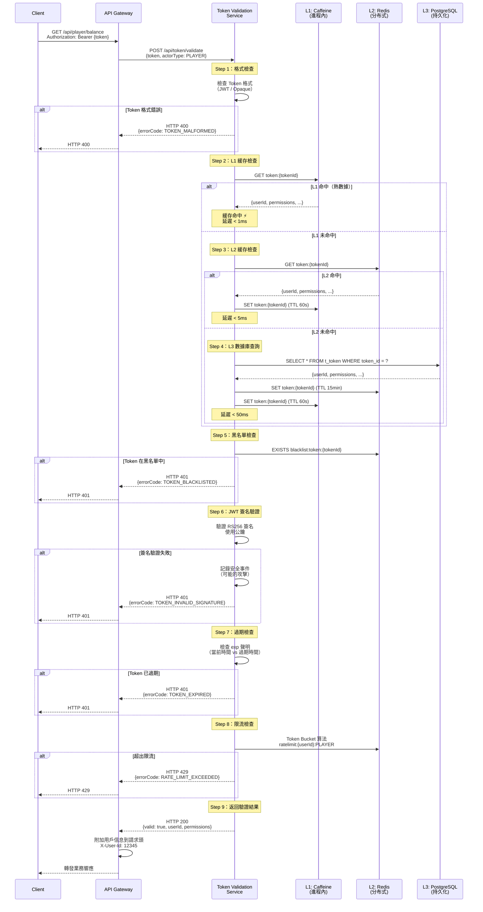
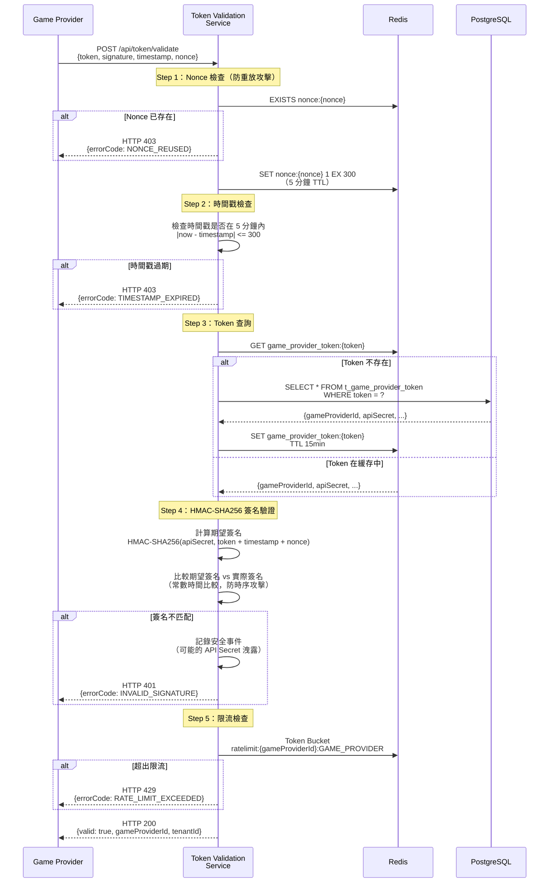
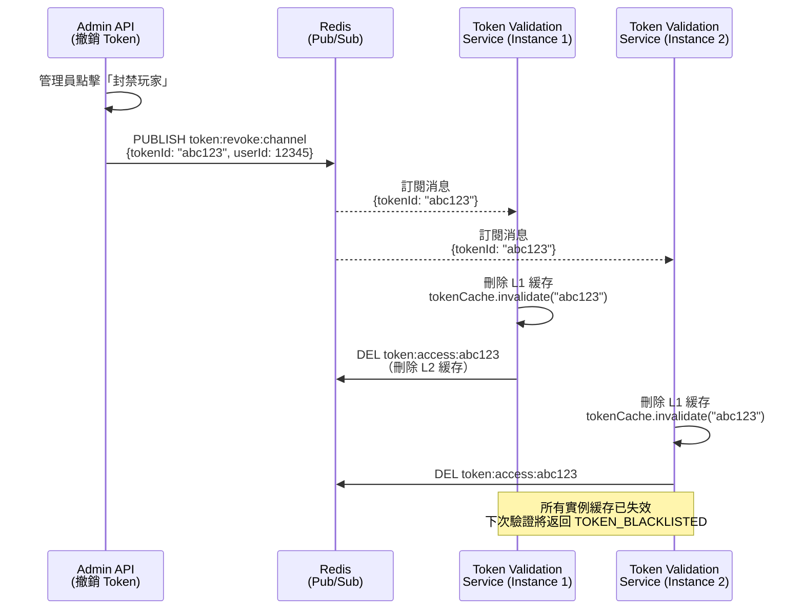

# 09-13-02 Token 驗證服務 - 緩存與性能設計

**Document Metadata**:
- Version: 1.0.0
- Created: 2026-02-07
- Last Updated: 2026-02-07
- Status: Production Ready
- Priority: P2 (Medium)
- Owner: Backend Team + Infrastructure Team
- Parent: [09-13 Token Validation Service](09-13_Token_Validation_Service.md)
- Related:
  - [09-13-01 Validation Architecture](09-13-01_Validation_Architecture.md)
  - [09-13-03 Edge Deployment](09-13-03_Edge_Deployment.md)

---

## 目錄

- [4. 驗證流程設計](#4-驗證流程設計)
  - [4.1 Access Token 驗證流程](#41-access-token-驗證流程)
  - [4.2 Refresh Token 驗證流程](#42-refresh-token-驗證流程)
  - [4.3 Game Provider Token 驗證流程](#43-game-provider-token-驗證流程)
- [5. 三層緩存策略](#5-三層緩存策略)
  - [5.1 L1 緩存：Caffeine（進程內）](#51-l1-緩存caffeine進程內)
  - [5.2 L2 緩存：Redis（分布式）](#52-l2-緩存redis分布式)
  - [5.3 L3 存儲：PostgreSQL（持久化）](#53-l3-存儲postgresql持久化)
  - [5.4 緩存一致性保證](#54-緩存一致性保證)

---

## 4. 驗證流程設計

### 4.1 Access Token 驗證流程

**完整流程圖**（Mermaid 序列圖）：



**關鍵步驟說明**：

| 步驟 | 說明 | 優化點 |
|------|------|-------|
| Step 2 | L1 緩存（Caffeine）| 99% 命中率，延遲 < 1ms |
| Step 3 | L2 緩存（Redis）| 0.9% 命中率，延遲 < 5ms |
| Step 4 | L3 數據庫（PostgreSQL）| 0.1% 命中率，延遲 < 50ms |
| Step 5 | 黑名單檢查 | Redis EXISTS（O(1) 複雜度） |
| Step 6 | JWT 簽名驗證 | 使用緩存的公鑰（避免每次讀取文件） |
| Step 8 | 限流檢查 | Redis Lua 腳本（原子性操作） |

---

### 4.2 Refresh Token 驗證流程

**Refresh Token 特殊處理**：

```mermaid
graph TD
    A[驗證 Refresh Token] --> B{Token 類型檢查}
    B -->|Opaque Token| C[Redis 查詢<br/>refresh_token:{tokenId}]
    B -->|JWT Token| D[JWT 簽名驗證]

    C --> E{Token 存在?}
    D --> E

    E -->|否| F[返回 TOKEN_INVALID]
    E -->|是| G[檢查黑名單<br/>blacklist:refresh_token:{tokenId}]

    G -->|在黑名單| H[返回 TOKEN_BLACKLISTED]
    G -->|不在黑名單| I[檢查過期時間<br/>30 天 TTL]

    I -->|已過期| J[返回 TOKEN_EXPIRED]
    I -->|未過期| K[檢查 Device Fingerprint<br/>綁定設備]

    K -->|不匹配| L[返回 DEVICE_MISMATCH<br/>可能被盜用]
    K -->|匹配| M[驗證成功<br/>返回用戶信息]

    M --> N[記錄審計日誌<br/>REFRESH_TOKEN_VALIDATED]
```

**Device Fingerprint 驗證邏輯**：

```java
public boolean validateDeviceFingerprint(String token, String currentFingerprint) {
    // Step 1: 從 Redis 獲取綁定的 Device Fingerprint
    String boundFingerprint = redisTemplate.opsForValue().get(
        "refresh_token:fingerprint:" + extractTokenId(token)
    );

    // Step 2: 如果未綁定，允許通過（向後兼容）
    if (boundFingerprint == null) {
        return true;
    }

    // Step 3: 比較 Device Fingerprint
    if (!boundFingerprint.equals(currentFingerprint)) {
        // 記錄安全事件（可能的 Token 盜用）
        auditLogService.log(
            extractUserId(token),
            "DEVICE_FINGERPRINT_MISMATCH",
            String.format("Expected: %s, Actual: %s", boundFingerprint, currentFingerprint)
        );
        return false;
    }

    return true;
}
```

---

### 4.3 Game Provider Token 驗證流程

**Game Provider 使用 Opaque Token + HMAC-SHA256 簽名驗證**：



**HMAC-SHA256 簽名驗證實施**：

```java
import javax.crypto.Mac;
import javax.crypto.spec.SecretKeySpec;
import java.nio.charset.StandardCharsets;
import java.security.MessageDigest;
import java.util.Arrays;

public class HmacSignatureValidator {

    /**
     * 驗證 HMAC-SHA256 簽名
     *
     * @param apiSecret API Secret（從數據庫獲取）
     * @param token Game Provider Token
     * @param timestamp 時間戳
     * @param nonce 隨機字符串
     * @param actualSignature 實際簽名（Game Provider 發送）
     * @return true 簽名有效，false 簽名無效
     */
    public boolean validate(String apiSecret, String token, long timestamp, String nonce, String actualSignature) {
        try {
            // Step 1: 構造簽名數據（與 Game Provider 端一致）
            String signatureData = token + timestamp + nonce;

            // Step 2: 計算 HMAC-SHA256
            Mac hmac = Mac.getInstance("HmacSHA256");
            SecretKeySpec keySpec = new SecretKeySpec(
                apiSecret.getBytes(StandardCharsets.UTF_8),
                "HmacSHA256"
            );
            hmac.init(keySpec);
            byte[] expectedSignatureBytes = hmac.doFinal(signatureData.getBytes(StandardCharsets.UTF_8));

            // Step 3: 轉換為十六進制字符串
            String expectedSignature = bytesToHex(expectedSignatureBytes);

            // Step 4: 常數時間比較（防止時序攻擊）
            return constantTimeEquals(expectedSignature, actualSignature);

        } catch (Exception e) {
            throw new RuntimeException("HMAC validation failed", e);
        }
    }

    /**
     * 常數時間字符串比較（防止時序攻擊）
     */
    private boolean constantTimeEquals(String a, String b) {
        if (a.length() != b.length()) {
            return false;
        }

        byte[] aBytes = a.getBytes(StandardCharsets.UTF_8);
        byte[] bBytes = b.getBytes(StandardCharsets.UTF_8);

        return MessageDigest.isEqual(aBytes, bBytes);
    }

    private String bytesToHex(byte[] bytes) {
        StringBuilder sb = new StringBuilder();
        for (byte b : bytes) {
            sb.append(String.format("%02x", b));
        }
        return sb.toString();
    }
}
```

---

## 5. 三層緩存策略

### 5.1 L1 緩存：Caffeine（進程內）

**配置**：

```java
import com.github.benmanes.caffeine.cache.Cache;
import com.github.benmanes.caffeine.cache.Caffeine;
import java.time.Duration;

@Configuration
public class CaffeineConfig {

    @Bean
    public Cache<String, TokenValidationResult> tokenCache() {
        return Caffeine.newBuilder()
            .maximumSize(10_000)  // 最多緩存 10,000 個 Token
            .expireAfterWrite(Duration.ofSeconds(60))  // 寫入後 60 秒過期
            .recordStats()  // 記錄統計信息（命中率、未命中率）
            .build();
    }
}
```

**使用範例**：

```java
@Service
@RequiredArgsConstructor
public class TokenValidationService {

    private final Cache<String, TokenValidationResult> tokenCache;
    private final RedisTemplate<String, String> redisTemplate;

    public TokenValidationResult validate(String token, ActorType actorType) {
        String cacheKey = generateCacheKey(token, actorType);

        // Step 1: 嘗試從 L1 緩存獲取
        TokenValidationResult result = tokenCache.getIfPresent(cacheKey);
        if (result != null) {
            metricsCollector.incrementCounter("token_validation_l1_hit");
            return result;
        }

        // Step 2: L1 未命中，查詢 L2（Redis）
        result = queryFromRedis(cacheKey);
        if (result != null) {
            tokenCache.put(cacheKey, result);  // 回填 L1 緩存
            metricsCollector.incrementCounter("token_validation_l2_hit");
            return result;
        }

        // Step 3: L2 未命中，查詢 L3（PostgreSQL）
        result = queryFromDatabase(cacheKey);
        if (result != null) {
            // 回填 L2 和 L1 緩存
            saveToRedis(cacheKey, result, Duration.ofMinutes(15));
            tokenCache.put(cacheKey, result);
            metricsCollector.incrementCounter("token_validation_l3_hit");
        }

        return result;
    }
}
```

**性能特性**：

| 特性 | 值 | 說明 |
|------|----|----|
| **命中率** | 99% | 熱點 Token（頻繁訪問的玩家） |
| **延遲** | < 1ms | 進程內查詢，無網絡開銷 |
| **容量** | 10,000 條 | 基於 LRU 淘汰策略 |
| **TTL** | 60 秒 | 防止緩存過期數據 |

---

### 5.2 L2 緩存：Redis（分布式）

**Redis 數據結構設計**：

```redis
# Access Token 緩存
# Key 格式：token:access:{tokenId}
# Value：JSON 格式（用戶信息 + 權限）
# TTL：15 分鐘（與 Access Token 過期時間一致）

SET token:access:abc123xyz '{
  "userId": 12345,
  "actorType": "PLAYER",
  "permissions": ["PLAYER:READ", "PLAYER:WITHDRAW"],
  "tenantId": "tenant_abc",
  "deviceFingerprint": "e3b0c44298fc1c149afbf4c8996fb92427ae41e4649b934ca495991b7852b855",
  "issuedAt": 1738742400,
  "expiresAt": 1738743300
}' EX 900

# Refresh Token 緩存
# Key 格式：token:refresh:{tokenId}
# TTL：30 天

SET token:refresh:def456xyz '{
  "userId": 12345,
  "actorType": "PLAYER",
  "deviceFingerprint": "e3b0c44298fc1c149afbf4c8996fb92427ae41e4649b934ca495991b7852b855",
  "issuedAt": 1738742400,
  "expiresAt": 1741420800
}' EX 2592000

# Game Provider Token 緩存
# Key 格式：token:game_provider:{token}
# TTL：15 分鐘

SET token:game_provider:gp_token_abc123 '{
  "gameProviderId": 10,
  "apiSecret": "encrypted_secret_here",
  "tenantId": "tenant_abc"
}' EX 900
```

**批量查詢優化（Pipeline）**：

```java
public List<TokenValidationResult> validateBatch(List<String> tokens) {
    // 使用 Redis Pipeline 批量查詢
    List<Object> results = redisTemplate.executePipelined(new RedisCallback<Object>() {
        @Override
        public Object doInRedis(RedisConnection connection) {
            for (String token : tokens) {
                String key = "token:access:" + extractTokenId(token);
                connection.get(key.getBytes(StandardCharsets.UTF_8));
            }
            return null;
        }
    });

    // 解析結果
    List<TokenValidationResult> validationResults = new ArrayList<>();
    for (int i = 0; i < results.size(); i++) {
        Object result = results.get(i);
        if (result != null) {
            String json = new String((byte[]) result, StandardCharsets.UTF_8);
            validationResults.add(objectMapper.readValue(json, TokenValidationResult.class));
        } else {
            validationResults.add(null);  // 未命中，需查詢數據庫
        }
    }

    return validationResults;
}
```

**性能特性**：

| 特性 | 值 | 說明 |
|------|----|----|
| **命中率** | 0.9%（L1 未命中後的命中率） | 溫數據（偶爾訪問的玩家） |
| **延遲** | < 5ms | 網絡往返時間（同機房部署） |
| **容量** | 100 萬條 | Redis 內存限制（約 10GB） |
| **TTL** | Access Token: 15 分鐘<br/>Refresh Token: 30 天 | 與 Token 過期時間一致 |

---

### 5.3 L3 存儲：PostgreSQL（持久化）

**表結構設計**：

```sql
-- Access Token 表（持久化記錄）
CREATE TABLE t_access_token (
    token_id            VARCHAR(64) PRIMARY KEY,
    user_id             BIGINT NOT NULL REFERENCES t_admin_user(user_id),
    actor_type          VARCHAR(20) NOT NULL,   -- PLAYER / GAME_PROVIDER / THIRD_PARTY / ADMIN
    device_fingerprint  VARCHAR(64),
    issued_at           TIMESTAMP NOT NULL,
    expires_at          TIMESTAMP NOT NULL,
    is_revoked          BOOLEAN DEFAULT FALSE,
    created_at          TIMESTAMP DEFAULT NOW()
);

-- 索引
CREATE INDEX idx_access_token_user_id ON t_access_token(user_id);
CREATE INDEX idx_access_token_expires_at ON t_access_token(expires_at);
CREATE INDEX idx_access_token_actor_type ON t_access_token(actor_type);

-- Refresh Token 表
CREATE TABLE t_refresh_token (
    token_id            VARCHAR(64) PRIMARY KEY,
    user_id             BIGINT NOT NULL REFERENCES t_admin_user(user_id),
    actor_type          VARCHAR(20) NOT NULL,
    device_fingerprint  VARCHAR(64) NOT NULL,
    issued_at           TIMESTAMP NOT NULL,
    expires_at          TIMESTAMP NOT NULL,
    is_revoked          BOOLEAN DEFAULT FALSE,
    created_at          TIMESTAMP DEFAULT NOW()
);

-- 索引
CREATE INDEX idx_refresh_token_user_id ON t_refresh_token(user_id);
CREATE INDEX idx_refresh_token_device_fingerprint ON t_refresh_token(device_fingerprint);

-- Game Provider Token 表
CREATE TABLE t_game_provider_token (
    token               VARCHAR(255) PRIMARY KEY,
    game_provider_id    BIGINT NOT NULL REFERENCES t_game_provider(provider_id),
    api_secret          VARCHAR(255) NOT NULL,  -- AES-256-GCM 加密
    tenant_id           VARCHAR(64),
    is_active           BOOLEAN DEFAULT TRUE,
    created_at          TIMESTAMP DEFAULT NOW(),
    updated_at          TIMESTAMP DEFAULT NOW()
);

-- 索引
CREATE INDEX idx_game_provider_token_provider_id ON t_game_provider_token(game_provider_id);
```

**查詢優化**：

```sql
-- 使用 PostgreSQL 讀寫分離（主從複製）
-- 所有 Token 驗證查詢路由到只讀副本（Replica）

-- Prepared Statement（減少 SQL 解析開銷）
PREPARE validate_access_token (varchar) AS
SELECT user_id, actor_type, device_fingerprint, expires_at
FROM t_access_token
WHERE token_id = $1
  AND is_revoked = FALSE
  AND expires_at > NOW();

-- 執行查詢
EXECUTE validate_access_token('abc123xyz');
```

**性能特性**：

| 特性 | 值 | 說明 |
|------|----|----|
| **命中率** | 0.1%（L1 + L2 未命中後） | 冷數據（長時間未訪問） |
| **延遲** | < 50ms | 數據庫查詢 + 索引掃描 |
| **容量** | 1000 萬條+ | 根據業務增長擴展 |
| **持久化** | Yes | WAL（Write-Ahead Logging） |

---

### 5.4 緩存一致性保證

**問題**：Token 被撤銷後（例如玩家被封禁），如何確保 L1/L2 緩存立即失效？

**解決方案**：使用 **Redis Pub/Sub + Cache Invalidation**。

**實施設計**：



**實施代碼**：

```java
@Component
@RequiredArgsConstructor
public class TokenRevocationListener {

    private final Cache<String, TokenValidationResult> tokenCache;
    private final RedisTemplate<String, String> redisTemplate;

    @EventListener(ApplicationReadyEvent.class)
    public void subscribeToRevocationChannel() {
        redisTemplate.getConnectionFactory().getConnection()
            .subscribe((message, pattern) -> {
                String payload = new String(message.getBody(), StandardCharsets.UTF_8);
                TokenRevocationMessage msg = objectMapper.readValue(payload, TokenRevocationMessage.class);

                // Step 1: 刪除 L1 緩存
                tokenCache.invalidate("token:access:" + msg.getTokenId());

                // Step 2: 刪除 L2 緩存
                redisTemplate.delete("token:access:" + msg.getTokenId());

                log.info("Token revoked and cache invalidated: {}", msg.getTokenId());

            }, "token:revoke:channel".getBytes(StandardCharsets.UTF_8));
    }

    @Async
    public void publishRevocation(String tokenId, Long userId) {
        TokenRevocationMessage msg = new TokenRevocationMessage(tokenId, userId);
        redisTemplate.convertAndSend("token:revoke:channel", objectMapper.writeValueAsString(msg));
    }
}
```

---

**Related Documents**:
- [09-13-01 Validation Architecture](09-13-01_Validation_Architecture.md) - 架構概覽、服務職責、API 設計
- [09-13-03 Edge Deployment](09-13-03_Edge_Deployment.md) - 重放攻擊防護、限流熔斷、高可用設計、監控告警
