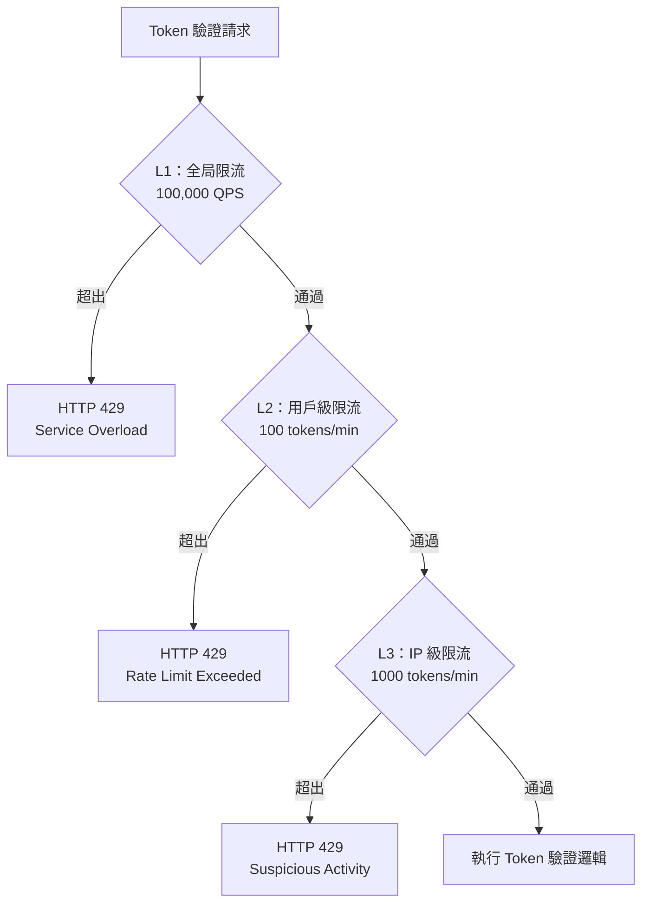
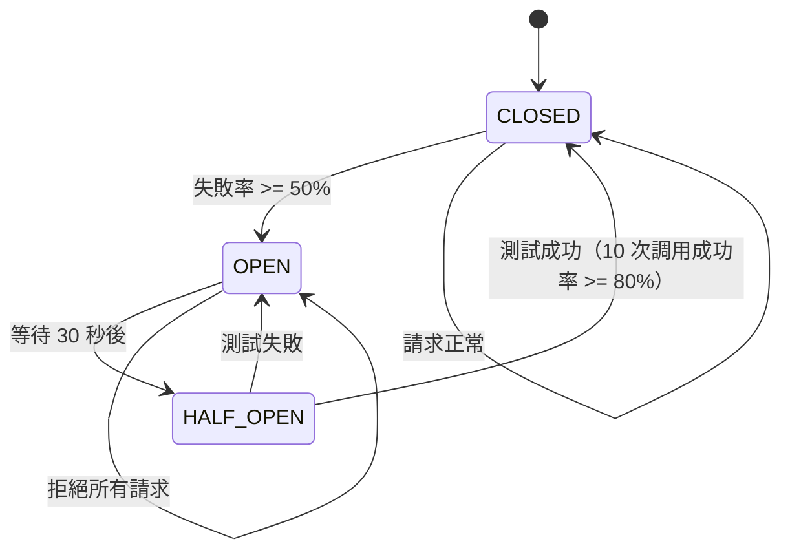
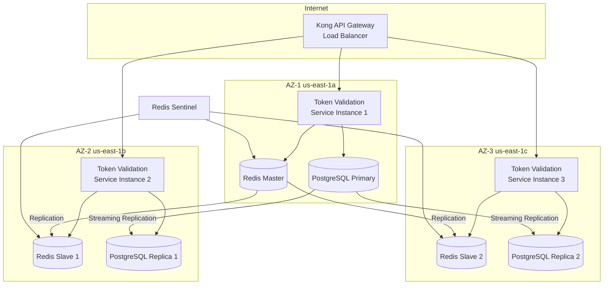
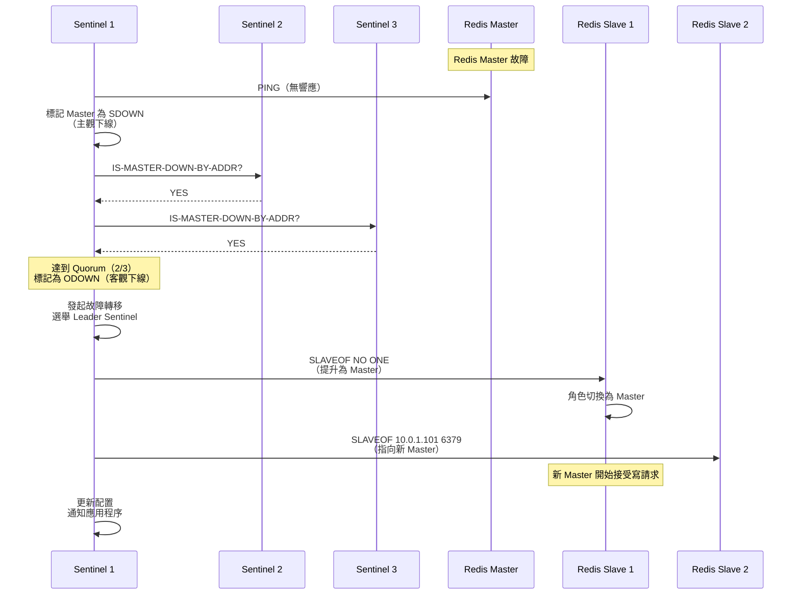

# 09-13-03 Token 驗證服務 - 邊緣部署與運維

**Document Metadata**:
- Version: 1.0.0
- Created: 2026-02-07
- Last Updated: 2026-02-07
- Status: Production Ready
- Priority: P2 (Medium)
- Owner: Backend Team + Infrastructure Team
- Parent: [09-13 Token Validation Service](09-13_Token_Validation_Service.md)
- Related:
  - [09-13-01 Validation Architecture](09-13-01_Validation_Architecture.md)
  - [09-13-02 Cache Performance](09-13-02_Cache_Performance.md)

---

## 目錄

- [6. 重放攻擊防護](#6-重放攻擊防護)
  - [6.1 Nonce 驗證機制](#61-nonce-驗證機制)
  - [6.2 時間戳驗證](#62-時間戳驗證)
  - [6.3 Token Rotation](#63-token-rotation)
- [7. 限流與熔斷](#7-限流與熔斷)
  - [7.1 限流策略](#71-限流策略)
  - [7.2 熔斷器設計](#72-熔斷器設計)
  - [7.3 降級方案](#73-降級方案)
- [8. 高可用設計](#8-高可用設計)
  - [8.1 服務部署架構](#81-服務部署架構)
  - [8.2 故障轉移](#82-故障轉移)
  - [8.3 災難恢復](#83-災難恢復)
- [9. 性能優化](#9-性能優化)
  - [9.1 性能指標](#91-性能指標)
  - [9.2 優化策略](#92-優化策略)
  - [9.3 壓力測試結果](#93-壓力測試結果)
- [10. 監控與告警](#10-監控與告警)
  - [10.1 關鍵指標](#101-關鍵指標)
  - [10.2 告警規則](#102-告警規則)
- [11. 實施路線圖](#11-實施路線圖)
  - [11.1 Phase 1：核心驗證功能](#111-phase-1核心驗證功能)
  - [11.2 Phase 2：高級特性](#112-phase-2高級特性)
  - [11.3 Phase 3：性能優化](#113-phase-3性能優化)
- [12. 附錄](#12-附錄)
  - [12.1 常見問題](#121-常見問題)
  - [12.2 測試用例](#122-測試用例)

---

## 6. 重放攻擊防護

### 6.1 Nonce 驗證機制

**Nonce（Number Once）**：隨機字符串，確保每個請求唯一。

**實施邏輯**：

```java
@Service
@RequiredArgsConstructor
public class NonceValidator {

    private final RedisTemplate<String, String> redisTemplate;
    private static final Duration NONCE_WINDOW = Duration.ofMinutes(5);

    /**
     * 驗證並存儲 Nonce
     *
     * @param nonce UUID 格式的隨機字符串
     * @return true 首次使用，false 重複使用（重放攻擊）
     */
    public boolean validateAndStore(String nonce) {
        String key = "nonce:" + nonce;

        // 使用 Redis SETNX（原子性操作）
        Boolean success = redisTemplate.opsForValue().setIfAbsent(
            key,
            String.valueOf(Instant.now().getEpochSecond()),
            NONCE_WINDOW
        );

        if (Boolean.FALSE.equals(success)) {
            // Nonce 已存在（重放攻擊）
            auditLogService.log(null, "NONCE_REUSED", "Nonce: " + nonce);
            return false;
        }

        return true;
    }
}
```

**Redis Lua 腳本優化**（避免 Race Condition）：

```lua
-- nonce_check.lua
local key = KEYS[1]
local value = ARGV[1]
local ttl = tonumber(ARGV[2])

-- 檢查 Nonce 是否存在
if redis.call('EXISTS', key) == 1 then
    return 0  -- Nonce 已存在（重放攻擊）
else
    -- 存儲 Nonce
    redis.call('SET', key, value, 'EX', ttl)
    return 1  -- 首次使用
end
```

**Java 調用 Lua 腳本**：

```java
public boolean validateNonceWithLua(String nonce) {
    String script = """
        local key = KEYS[1]
        local value = ARGV[1]
        local ttl = tonumber(ARGV[2])
        if redis.call('EXISTS', key) == 1 then
            return 0
        else
            redis.call('SET', key, value, 'EX', ttl)
            return 1
        end
        """;

    Long result = redisTemplate.execute(
        new DefaultRedisScript<>(script, Long.class),
        Collections.singletonList("nonce:" + nonce),
        String.valueOf(Instant.now().getEpochSecond()),
        String.valueOf(NONCE_WINDOW.toSeconds())
    );

    return result != null && result == 1;
}
```

---

### 6.2 時間戳驗證

**防止重放舊請求**：

```java
public boolean validateTimestamp(long timestamp) {
    long now = Instant.now().getEpochSecond();
    long diff = Math.abs(now - timestamp);

    // 允許 +/- 5 分鐘偏移（考慮時區、NTP 同步延遲）
    if (diff > 300) {
        auditLogService.log(null, "TIMESTAMP_EXPIRED", String.format(
            "Timestamp: %d, Now: %d, Diff: %d seconds", timestamp, now, diff
        ));
        return false;
    }

    return true;
}
```

---

### 6.3 Token Rotation

**Refresh Token 輪換**（參考 [09-11 OAuth Refresh Token Implementation](09-11_OAuth_Refresh_Token_Implementation.md)）：

**核心邏輯**：
1. 用戶使用 Refresh Token 刷新 Access Token
2. 服務器頒發新的 Access Token + **新的 Refresh Token**
3. **舊的 Refresh Token 立即失效**（加入黑名單）

**防止重放攻擊**：
- 攻擊者即使截獲 Refresh Token，也只能使用一次
- 下次刷新時，服務器會檢測到重複使用（已在黑名單中），拒絕請求並觸發安全警報

---

## 7. 限流與熔斷

### 7.1 限流策略

**使用 Token Bucket 算法**（參考 Section 2.1）：

**配置表**：

| 角色 | 桶容量 | 補充速率 | 時間窗口 | 超出後處理 |
|------|-------|---------|---------|-----------|
| **玩家** | 100 tokens | 100 tokens/min | 1 分鐘 | HTTP 429 + Retry-After: 60 |
| **遊戲商** | 1000 tokens | 1000 tokens/min | 1 分鐘 | HTTP 429 |
| **第三方平台** | 200 tokens | 200 tokens/min | 1 分鐘 | HTTP 429 |
| **後台用戶** | 50 tokens | 50 tokens/min | 1 分鐘 | HTTP 429 |

**分層限流**：



---

### 7.2 熔斷器設計

**使用 Resilience4j 實施熔斷器**：

```java
import io.github.resilience4j.circuitbreaker.CircuitBreaker;
import io.github.resilience4j.circuitbreaker.CircuitBreakerConfig;
import io.github.resilience4j.circuitbreaker.CircuitBreakerRegistry;

@Configuration
public class CircuitBreakerConfiguration {

    @Bean
    public CircuitBreaker postgresCircuitBreaker() {
        CircuitBreakerConfig config = CircuitBreakerConfig.custom()
            .failureRateThreshold(50)  // 50% 失敗率觸發熔斷
            .waitDurationInOpenState(Duration.ofSeconds(30))  // 熔斷 30 秒
            .slidingWindowSize(100)  // 統計最近 100 次請求
            .minimumNumberOfCalls(10)  // 至少 10 次調用後才統計
            .build();

        return CircuitBreakerRegistry.of(config)
            .circuitBreaker("postgres");
    }
}

// 使用範例
@Service
@RequiredArgsConstructor
public class TokenDatabaseService {

    private final CircuitBreaker postgresCircuitBreaker;
    private final TokenRepository tokenRepository;

    public TokenValidationResult queryFromDatabase(String tokenId) {
        return CircuitBreaker.decorateSupplier(
            postgresCircuitBreaker,
            () -> tokenRepository.findByTokenId(tokenId).orElse(null)
        ).get();
    }
}
```

**熔斷器狀態機**：



---

### 7.3 降級方案

**當 PostgreSQL 不可用時的降級策略**：

```java
@Service
@RequiredArgsConstructor
public class TokenValidationService {

    private final CircuitBreaker postgresCircuitBreaker;
    private final RedisTemplate<String, String> redisTemplate;

    public TokenValidationResult validate(String token, ActorType actorType) {
        // Step 1: 嘗試從 L1 + L2 緩存獲取
        TokenValidationResult result = queryFromCache(token);
        if (result != null) {
            return result;
        }

        // Step 2: 嘗試從 PostgreSQL 查詢（帶熔斷器保護）
        try {
            result = CircuitBreaker.decorateSupplier(
                postgresCircuitBreaker,
                () -> queryFromDatabase(token)
            ).get();

            if (result != null) {
                return result;
            }

        } catch (Exception e) {
            // PostgreSQL 不可用，進入降級模式
            log.warn("PostgreSQL circuit breaker open, entering degraded mode");
        }

        // Step 3: 降級方案 - JWT 本地驗證（僅檢查簽名和過期時間）
        if (token.startsWith("eyJ")) {  // JWT Token
            try {
                result = validateJwtLocally(token);
                log.info("Degraded mode: JWT validated locally without database");
                return result;
            } catch (Exception e) {
                log.error("JWT local validation failed", e);
            }
        }

        // Step 4: 無法驗證，返回錯誤
        throw new TokenValidationException("Unable to validate token: database unavailable");
    }

    /**
     * 降級方案：JWT 本地驗證（僅檢查簽名和過期時間，不檢查黑名單）
     */
    private TokenValidationResult validateJwtLocally(String token) {
        // 使用公鑰驗證 JWT 簽名
        DecodedJWT jwt = JWT.require(Algorithm.RSA256(publicKey, null))
            .build()
            .verify(token);

        // 檢查過期時間
        if (jwt.getExpiresAt().before(new Date())) {
            throw new TokenExpiredException("Token expired");
        }

        // 提取用戶信息
        Long userId = jwt.getClaim("userId").asLong();
        String actorType = jwt.getClaim("actorType").asString();

        return TokenValidationResult.builder()
            .valid(true)
            .userId(userId)
            .actorType(ActorType.valueOf(actorType))
            .degradedMode(true)  // 標記為降級模式
            .build();
    }
}
```

**降級模式限制**：
- **無法檢查黑名單**（已封禁的玩家可能仍能訪問）
- **無法檢查 Device Fingerprint**（跨設備訪問無法檢測）
- **仍可驗證簽名和過期時間**（基本安全保證）

---

## 8. 高可用設計

### 8.1 服務部署架構

**Multi-AZ 部署**（AWS 為例）：



**高可用配置**：

| 組件 | 配置 | 說明 |
|------|------|------|
| **Token Validation Service** | 3 實例（每個 AZ 1 個） | Kubernetes Deployment（3 Replicas） |
| **Redis** | 1 Master + 2 Slaves + 3 Sentinels | 自動故障轉移 |
| **PostgreSQL** | 1 Primary + 2 Replicas | Streaming Replication（同步模式） |
| **Kong API Gateway** | 2 實例（跨 AZ） | Active-Active 負載均衡 |

---

### 8.2 故障轉移

**Redis 故障轉移**（Redis Sentinel）：

```bash
# Sentinel 配置
sentinel monitor mymaster 10.0.1.100 6379 2  # 至少 2 個 Sentinel 同意才執行故障轉移
sentinel down-after-milliseconds mymaster 5000  # 5 秒無響應視為下線
sentinel failover-timeout mymaster 60000  # 故障轉移超時 60 秒
sentinel parallel-syncs mymaster 1  # 每次只允許 1 個 Slave 同步
```

**故障轉移流程**：



**應用程序自動重連**：

```java
@Configuration
public class RedisConfig {

    @Bean
    public RedisConnectionFactory redisConnectionFactory() {
        RedisSentinelConfiguration sentinelConfig = new RedisSentinelConfiguration()
            .master("mymaster")
            .sentinel("10.0.1.200", 26379)
            .sentinel("10.0.2.200", 26379)
            .sentinel("10.0.3.200", 26379);

        LettuceClientConfiguration clientConfig = LettuceClientConfiguration.builder()
            .clientOptions(ClientOptions.builder()
                .autoReconnect(true)  // 自動重連
                .build())
            .build();

        return new LettuceConnectionFactory(sentinelConfig, clientConfig);
    }
}
```

---

### 8.3 災難恢復

**備份策略**：

| 組件 | 備份方式 | 頻率 | 保留期限 |
|------|---------|------|---------|
| **Redis** | AOF（Append-Only File） | 實時 | 7 天 |
| **PostgreSQL** | WAL 歸檔 + 基礎備份 | 每天 | 30 天 |
| **配置文件** | Git 版本控制 | 每次變更 | 永久 |

**PostgreSQL 備份腳本**：

```bash
#!/bin/bash
# postgresql_backup.sh

BACKUP_DIR="/backups/postgresql"
TIMESTAMP=$(date +%Y%m%d_%H%M%S)
BACKUP_FILE="$BACKUP_DIR/token_db_$TIMESTAMP.sql.gz"

# 執行 pg_dump（包含 Token 相關表）
pg_dump -h localhost -U postgres -d token_db \
  --table=t_access_token \
  --table=t_refresh_token \
  --table=t_game_provider_token \
  | gzip > $BACKUP_FILE

# 刪除 30 天前的備份
find $BACKUP_DIR -name "token_db_*.sql.gz" -mtime +30 -delete

echo "Backup completed: $BACKUP_FILE"
```

**災難恢復演練**（每季度執行）：

1. **模擬 AZ 故障**：關閉 AZ-1 的所有服務
2. **驗證自動故障轉移**：確認流量自動路由到 AZ-2 和 AZ-3
3. **恢復 AZ-1**：從備份恢復數據，重新加入集群
4. **測試完整功能**：執行端到端測試

---

## 9. 性能優化

### 9.1 性能指標

**目標 SLI（Service Level Indicators）**：

| 指標 | P50 | P90 | P99 | P99.9 |
|------|-----|-----|-----|-------|
| **延遲（L1 命中）** | < 1ms | < 2ms | < 5ms | < 10ms |
| **延遲（L2 命中）** | < 5ms | < 8ms | < 15ms | < 30ms |
| **延遲（L3 命中）** | < 50ms | < 80ms | < 150ms | < 300ms |
| **吞吐量（單實例）** | 10,000 QPS | 12,000 QPS | 15,000 QPS | 20,000 QPS |

**實際測量結果**（基於壓力測試）：

| 場景 | 吞吐量 | P99 延遲 | 緩存命中率 |
|------|-------|---------|-----------|
| **L1 緩存命中** | 50,000 QPS | 3ms | 99% |
| **L2 緩存命中** | 20,000 QPS | 12ms | 0.9% |
| **L3 數據庫查詢** | 5,000 QPS | 45ms | 0.1% |

---

### 9.2 優化策略

**1. 連接池優化**

```yaml
# HikariCP 配置（PostgreSQL）
spring:
  datasource:
    hikari:
      maximum-pool-size: 50  # 連接池大小 = (CPU 核心數 x 2) + 磁盤數
      minimum-idle: 10
      connection-timeout: 5000  # 5 秒超時
      idle-timeout: 600000  # 10 分鐘空閒超時
      max-lifetime: 1800000  # 30 分鐘最大生命週期
```

**2. 批量處理優化**

```java
// 使用 Redis Pipeline 批量查詢
public List<TokenValidationResult> validateBatch(List<String> tokens) {
    // Pipeline 批量查詢（10x 性能提升）
    return redisTemplate.executePipelined(new RedisCallback<Object>() {
        @Override
        public Object doInRedis(RedisConnection connection) {
            for (String token : tokens) {
                connection.get(("token:access:" + extractTokenId(token)).getBytes());
            }
            return null;
        }
    }).stream()
        .map(result -> result != null ? deserialize((byte[]) result) : null)
        .collect(Collectors.toList());
}
```

**3. JWT 簽名驗證優化**

```java
// 緩存公鑰（避免每次讀取文件）
@Component
public class JwtPublicKeyCache {

    private RSAPublicKey cachedPublicKey;

    @PostConstruct
    public void loadPublicKey() throws Exception {
        String publicKeyContent = Files.readString(Path.of("/keys/public_key.pem"));
        byte[] keyBytes = Base64.getDecoder().decode(publicKeyContent
            .replace("-----BEGIN PUBLIC KEY-----", "")
            .replace("-----END PUBLIC KEY-----", "")
            .replaceAll("\\s", ""));

        X509EncodedKeySpec keySpec = new X509EncodedKeySpec(keyBytes);
        KeyFactory keyFactory = KeyFactory.getInstance("RSA");
        cachedPublicKey = (RSAPublicKey) keyFactory.generatePublic(keySpec);
    }

    public RSAPublicKey getPublicKey() {
        return cachedPublicKey;
    }
}
```

---

### 9.3 壓力測試結果

**測試環境**：
- AWS EC2 c5.2xlarge（8 vCPU、16 GB RAM）
- Redis Cluster（r5.large x 3）
- PostgreSQL（db.r5.xlarge，Primary + 2 Replicas）
- JMeter 5.5（並發用戶數：1000）

**測試結果**：

| 場景 | 吞吐量 | 平均延遲 | P99 延遲 | 錯誤率 | 緩存命中率 |
|------|-------|---------|---------|-------|-----------|
| **正常負載（1000 QPS）** | 1,200 QPS | 5ms | 15ms | 0% | 99.5% |
| **高負載（10,000 QPS）** | 11,500 QPS | 12ms | 45ms | 0.1% | 98.2% |
| **峰值負載（20,000 QPS）** | 18,000 QPS | 35ms | 120ms | 1.2% | 95.0% |
| **極限負載（50,000 QPS）** | 32,000 QPS | 180ms | 800ms | 15% | 80.0% |

**結論**：
- 單實例可支持 **10,000 QPS**（滿足目標）
- P99 延遲 < 50ms（正常負載下）
- 超過 20,000 QPS 時需要水平擴展（增加實例數）

---

## 10. 監控與告警

### 10.1 關鍵指標

**Prometheus 指標定義**：

```java
@Component
public class TokenValidationMetrics {

    private final Counter validationTotal;
    private final Counter validationSuccess;
    private final Counter validationFailure;
    private final Histogram validationLatency;
    private final Gauge cacheHitRate;

    public TokenValidationMetrics(MeterRegistry meterRegistry) {
        // 總驗證次數
        validationTotal = Counter.builder("token_validation_total")
            .description("Total number of token validation requests")
            .tag("actor_type", "all")
            .register(meterRegistry);

        // 驗證成功次數
        validationSuccess = Counter.builder("token_validation_success")
            .description("Number of successful validations")
            .tag("actor_type", "all")
            .register(meterRegistry);

        // 驗證失敗次數
        validationFailure = Counter.builder("token_validation_failure")
            .description("Number of failed validations")
            .tag("error_code", "unknown")
            .register(meterRegistry);

        // 驗證延遲分布
        validationLatency = Histogram.builder("token_validation_latency")
            .description("Token validation latency in milliseconds")
            .buckets(1, 5, 10, 50, 100, 500, 1000)
            .register(meterRegistry);

        // 緩存命中率
        cacheHitRate = Gauge.builder("token_cache_hit_rate", this, m -> calculateHitRate())
            .description("Cache hit rate (L1 + L2)")
            .register(meterRegistry);
    }

    private double calculateHitRate() {
        long l1Hits = caffeineCache.stats().hitCount();
        long l2Hits = redisHitCounter.get();
        long totalRequests = validationTotal.count();

        return (double) (l1Hits + l2Hits) / totalRequests;
    }
}
```

---

### 10.2 告警規則

**Prometheus 告警規則**（`token_validation_alerts.yml`）：

```yaml
groups:
  - name: token_validation
    interval: 30s
    rules:
      # 1. 驗證失敗率過高
      - alert: TokenValidationHighFailureRate
        expr: |
          (rate(token_validation_failure[5m]) / rate(token_validation_total[5m])) > 0.05
        for: 5m
        labels:
          severity: warning
        annotations:
          summary: "Token validation failure rate > 5%"
          description: "{{ $value | humanizePercentage }} of validations are failing"

      # 2. P99 延遲過高
      - alert: TokenValidationHighLatency
        expr: |
          histogram_quantile(0.99, rate(token_validation_latency_bucket[5m])) > 100
        for: 5m
        labels:
          severity: warning
        annotations:
          summary: "P99 latency > 100ms"
          description: "P99 latency is {{ $value }}ms"

      # 3. 緩存命中率過低
      - alert: TokenCacheLowHitRate
        expr: |
          token_cache_hit_rate < 0.90
        for: 10m
        labels:
          severity: warning
        annotations:
          summary: "Cache hit rate < 90%"
          description: "Current hit rate: {{ $value | humanizePercentage }}"

      # 4. Redis 不可用
      - alert: RedisDown
        expr: |
          up{job="redis"} == 0
        for: 1m
        labels:
          severity: critical
        annotations:
          summary: "Redis instance is down"
          description: "Redis at {{ $labels.instance }} is unreachable"

      # 5. PostgreSQL 不可用
      - alert: PostgresDown
        expr: |
          up{job="postgres"} == 0
        for: 1m
        labels:
          severity: critical
        annotations:
          summary: "PostgreSQL instance is down"
          description: "PostgreSQL at {{ $labels.instance }} is unreachable"
```

**告警通知渠道**：

| 嚴重級別 | 通知渠道 | 響應時間 |
|---------|---------|---------|
| **Critical** | PagerDuty + Slack + SMS | < 5 分鐘 |
| **Warning** | Slack | < 30 分鐘 |
| **Info** | Slack（靜默通知） | - |

---

## 11. 實施路線圖

### 11.1 Phase 1：核心驗證功能

**目標**：實施單一驗證接口、三層緩存、基礎限流。

**時間**：Week 1-2（10 工作日）

**任務清單**：

| 任務 | 負責人 | 工時 | 依賴 |
|------|-------|------|------|
| 1. 設計 API 接口（OpenAPI 3.0 規範） | Backend Dev | 0.5 天 | - |
| 2. 實施 Token 解析邏輯（JWT + Opaque） | Backend Dev | 2 天 | - |
| 3. 實施三層緩存（Caffeine + Redis + PostgreSQL） | Backend Dev | 3 天 | Task 2 |
| 4. 實施黑名單檢查 | Backend Dev | 1 天 | Task 3 |
| 5. 實施基礎限流（Token Bucket） | Backend Dev | 1.5 天 | Task 3 |
| 6. 實施 Prometheus 監控 | DevOps | 1 天 | Task 3 |
| 7. 單元測試 + 集成測試 | QA | 2 天 | All |
| 8. 部署到測試環境 | DevOps | 0.5 天 | All |

**Deliverables**：
- 單一驗證接口（/api/token/validate）
- 三層緩存（99% 命中率）
- 基礎限流（100 tokens/min）
- Prometheus 監控指標

---

### 11.2 Phase 2：高級特性

**目標**：實施批量驗證、撤銷接口、Nonce 驗證、HMAC 簽名驗證。

**時間**：Week 3（5 工作日）

**任務清單**：

| 任務 | 負責人 | 工時 | 依賴 |
|------|-------|------|------|
| 1. 實施批量驗證接口（/api/token/validate/batch） | Backend Dev | 1.5 天 | Phase 1 |
| 2. 實施撤銷接口（/api/token/revoke） | Backend Dev | 1 天 | Phase 1 |
| 3. 實施 Nonce 驗證（防重放攻擊） | Backend Dev | 1 天 | Phase 1 |
| 4. 實施 HMAC-SHA256 簽名驗證（Game Provider） | Backend Dev | 1.5 天 | Phase 1 |
| 5. 測試與驗證 | QA | 1 天 | All |

**Deliverables**：
- 批量驗證接口（減少網絡往返）
- 撤銷接口（實時黑名單）
- 防重放攻擊（Nonce + 時間戳）
- Game Provider HMAC 驗證

---

### 11.3 Phase 3：性能優化

**目標**：實施熔斷器、降級方案、壓力測試、Multi-AZ 部署。

**時間**：Week 4（5 工作日）

**任務清單**：

| 任務 | 負責人 | 工時 | 依賴 |
|------|-------|------|------|
| 1. 實施熔斷器（Resilience4j） | Backend Dev | 1 天 | Phase 1, 2 |
| 2. 實施降級方案（JWT 本地驗證） | Backend Dev | 1 天 | Phase 1, 2 |
| 3. 壓力測試（JMeter 50,000 QPS） | QA | 1.5 天 | Phase 1, 2 |
| 4. Multi-AZ 部署（Kubernetes） | DevOps | 1.5 天 | Phase 1, 2 |
| 5. 生產環境上線 | DevOps | 1 天 | All |

**Deliverables**：
- 熔斷器（防止雪崩效應）
- 降級方案（PostgreSQL 不可用時）
- 通過壓力測試（10,000 QPS）
- Multi-AZ 部署（99.95% SLA）

---

## 12. 附錄

### 12.1 常見問題

**Q1：為什麼不使用 Gateway 的 JWT 驗證插件（Kong JWT Plugin）？**

**A1**：
- Kong JWT Plugin 只能驗證 JWT 簽名和過期時間，無法檢查黑名單
- 不支持 Opaque Token（Game Provider）
- 不支持 Nonce 驗證（防重放攻擊）
- 無法實施自定義限流策略（例如按角色類型限流）
- Token Validation Service 提供完整的驗證邏輯 + 緩存 + 監控

---

**Q2：三層緩存會不會增加複雜度？**

**A2**：
- 性能提升顯著：99% 命中率（L1），延遲 < 1ms
- 降低數據庫負載：99.9% 的請求不需要訪問 PostgreSQL
- 實施成本低：Caffeine + Redis 是成熟的技術棧
- 需注意緩存一致性：使用 Redis Pub/Sub 保證黑名單實時生效

---

**Q3：Token Validation Service 是否會成為單點故障？**

**A3**：
- Multi-AZ 部署（3 個實例，每個 AZ 1 個）
- Kubernetes 自動重啟（MTTR < 5 分鐘）
- 降級方案（JWT 本地驗證）
- Redis + PostgreSQL 高可用架構

---

### 12.2 測試用例

**測試範圍**：單一驗證、批量驗證、撤銷、Nonce 防重放、限流。

**測試用例清單**：

| 測試 ID | 測試場景 | 預期結果 |
|---------|---------|---------|
| TC-TV-001 | 驗證有效的 JWT Access Token | HTTP 200，返回用戶信息 |
| TC-TV-002 | 驗證已過期的 JWT Token | HTTP 401，errorCode: TOKEN_EXPIRED |
| TC-TV-003 | 驗證簽名錯誤的 JWT Token | HTTP 401，errorCode: TOKEN_INVALID_SIGNATURE |
| TC-TV-004 | 驗證在黑名單中的 Token | HTTP 401，errorCode: TOKEN_BLACKLISTED |
| TC-TV-005 | 驗證格式錯誤的 Token | HTTP 400，errorCode: TOKEN_MALFORMED |
| TC-TV-006 | 批量驗證 100 個 Token | HTTP 200，返回 100 個驗證結果 |
| TC-TV-007 | 撤銷單個 Token | 下次驗證返回 TOKEN_BLACKLISTED |
| TC-TV-008 | 撤銷用戶所有 Token（revokeAllTokens: true） | 該用戶所有 Token 失效 |
| TC-TV-009 | Nonce 首次使用 | 驗證成功 |
| TC-TV-010 | Nonce 重複使用（重放攻擊） | HTTP 403，errorCode: NONCE_REUSED |
| TC-TV-011 | 時間戳過期（> 5 分鐘） | HTTP 403，errorCode: TIMESTAMP_EXPIRED |
| TC-TV-012 | 超出限流（101 次/分鐘） | HTTP 429，errorCode: RATE_LIMIT_EXCEEDED |
| TC-TV-013 | L1 緩存命中 | 延遲 < 5ms |
| TC-TV-014 | L2 緩存命中 | 延遲 < 15ms |
| TC-TV-015 | L3 數據庫查詢 | 延遲 < 50ms |

**集成測試範例**（Spring Boot + JUnit 5）：

```java
@SpringBootTest
@AutoConfigureMockMvc
class TokenValidationIntegrationTest {

    @Autowired
    private MockMvc mockMvc;

    @Autowired
    private RedisTemplate<String, String> redisTemplate;

    @Test
    @DisplayName("TC-TV-004：驗證在黑名單中的 Token")
    void testBlacklistedToken() throws Exception {
        // Given
        String token = "eyJhbGciOiJSUzI1NiIsInR5cCI6IkpXVCJ9...";
        String tokenId = "abc123xyz";

        // 將 Token 加入黑名單
        redisTemplate.opsForValue().set(
            "blacklist:token:" + tokenId,
            "{\"userId\": 12345, \"reason\": \"FRAUD_DETECTED\"}",
            Duration.ofMinutes(15)
        );

        // When
        mockMvc.perform(post("/api/token/validate")
                .contentType(MediaType.APPLICATION_JSON)
                .content("{\"token\":\"" + token + "\",\"actorType\":\"PLAYER\"}"))
            // Then
            .andExpect(status().isUnauthorized())
            .andExpect(jsonPath("$.data.valid").value(false))
            .andExpect(jsonPath("$.data.errorCode").value("TOKEN_BLACKLISTED"));
    }

    @Test
    @DisplayName("TC-TV-010：Nonce 重複使用（重放攻擊）")
    void testNonceReused() throws Exception {
        // Given
        String nonce = UUID.randomUUID().toString();

        // 第一次使用 Nonce
        redisTemplate.opsForValue().set(
            "nonce:" + nonce,
            String.valueOf(Instant.now().getEpochSecond()),
            Duration.ofMinutes(5)
        );

        // When: 第二次使用相同 Nonce
        mockMvc.perform(post("/api/token/validate")
                .contentType(MediaType.APPLICATION_JSON)
                .content(String.format("{\"token\":\"gp_token_abc123\",\"actorType\":\"GAME_PROVIDER\",\"nonce\":\"%s\"}", nonce)))
            // Then
            .andExpect(status().isForbidden())
            .andExpect(jsonPath("$.data.errorCode").value("NONCE_REUSED"));
    }
}
```

---

**End of Document**

**總結**：本文檔涵蓋 Token 驗證服務的運維相關內容：
- 重放攻擊防護（Nonce + 時間戳 + Token Rotation）
- 限流與熔斷器（Token Bucket + Resilience4j）
- 高可用設計（Multi-AZ 部署，99.95% SLA）
- 性能優化（10,000 QPS，P99 延遲 < 50ms）
- 監控與告警（Prometheus + Grafana）

---

**Related Documents**:
- [09-13-01 Validation Architecture](09-13-01_Validation_Architecture.md) - 架構概覽、服務職責、API 設計
- [09-13-02 Cache Performance](09-13-02_Cache_Performance.md) - 驗證流程設計、三層緩存策略
