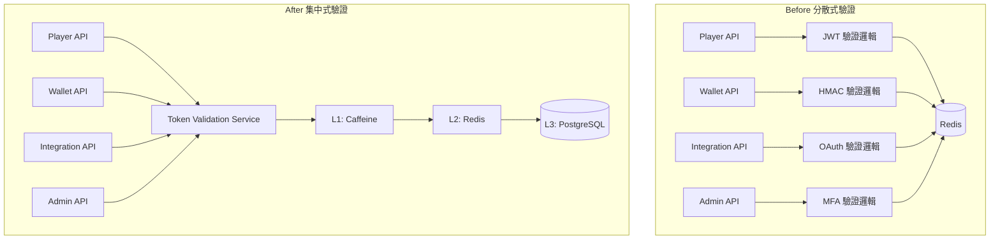

# 09-13 Token 驗證服務設計

**Document Metadata**:
- Version: 2.0.0
- Created: 2026-02-05
- Last Updated: 2026-02-07
- Status: Production Ready
- Priority: P2 (Medium)
- Owner: Backend Team + Infrastructure Team
- Related:
  - [09-12 Multi-Actor Token Security](09-12_Multi_Actor_Token_Security.md)
  - [09-11 OAuth Refresh Token Implementation](09-11_OAuth_Refresh_Token_Implementation.md)

---

## 文檔結構

本文檔已拆分為 3 個子文檔，以提高可讀性和維護性：

| 子文檔 | 內容 | 章節 |
|-------|------|------|
| [09-13-01 Validation Architecture](09-13-01_Validation_Architecture.md) | 架構概覽、服務職責、API 設計 | 1-3 |
| [09-13-02 Cache Performance](09-13-02_Cache_Performance.md) | 驗證流程設計、三層緩存策略 | 4-5 |
| [09-13-03 Edge Deployment](09-13-03_Edge_Deployment.md) | 重放攻擊防護、限流熔斷、高可用、監控 | 6-12 |

---

## 概述

**Token Validation Service** 是 SmartAdmin iGaming 平台的統一 Token 驗證服務，支持 4 種不同角色的 Token 驗證需求：

| 角色 | Token 類型 | 驗證需求 |
|------|----------|---------|
| **玩家（Player）** | JWT（Redis Opaque） | 高頻驗證（每次 API 調用） |
| **遊戲商（Game Provider）** | Opaque Token + HMAC | 中頻驗證（遊戲回調） |
| **第三方平台** | JWT（OAuth 2.0） | 低頻驗證（數據同步） |
| **後台用戶（Admin）** | JWT + MFA | 中頻驗證（後台操作） |

### 核心價值

---

## 快速參考

### 設計目標

| 目標 | 指標 | 優先級 |
|------|------|-------|
| **高性能** | P99 延遲 < 10ms（L1 命中） | P0 |
| **高可用** | SLA 99.95%（月宕機 < 22 分鐘） | P0 |
| **高吞吐** | 10,000 QPS（單實例） | P0 |
| **緩存命中率** | > 99%（L1 + L2） | P0 |

### API 端點

| 端點 | 用途 | 詳情 |
|------|------|------|
| `POST /api/token/validate` | 單一 Token 驗證 | [09-13-01 Section 3.1](09-13-01_Validation_Architecture.md#31-單一驗證接口) |
| `POST /api/token/validate/batch` | 批量 Token 驗證 | [09-13-01 Section 3.2](09-13-01_Validation_Architecture.md#32-批量驗證接口) |
| `POST /api/token/revoke` | 撤銷 Token | [09-13-01 Section 3.3](09-13-01_Validation_Architecture.md#33-撤銷接口) |
| `POST /api/token/introspect` | Token 內省查詢 | [09-13-01 Section 3.4](09-13-01_Validation_Architecture.md#34-內省接口introspection) |

### 錯誤碼

| 錯誤碼 | HTTP 狀態 | 說明 |
|-------|----------|------|
| `TOKEN_EXPIRED` | 401 | Token 已過期 |
| `TOKEN_INVALID_SIGNATURE` | 401 | 簽名驗證失敗 |
| `TOKEN_BLACKLISTED` | 401 | Token 在黑名單中 |
| `TOKEN_MALFORMED` | 400 | Token 格式錯誤 |
| `RATE_LIMIT_EXCEEDED` | 429 | 超出限流 |
| `NONCE_REUSED` | 403 | Nonce 重複使用（重放攻擊） |

### 三層緩存架構

| 層級 | 技術 | 命中率 | 延遲 | 容量 |
|------|------|-------|------|------|
| **L1** | Caffeine | 99% | < 1ms | 10,000 條 |
| **L2** | Redis | 0.9% | < 5ms | 100 萬條 |
| **L3** | PostgreSQL | 0.1% | < 50ms | 1000 萬條+ |

---

## 子文檔導航

### [09-13-01 Validation Architecture](09-13-01_Validation_Architecture.md)

**內容**：
- 1. 架構概覽
  - 為什麼需要獨立的 Token 驗證服務
  - 設計目標
  - 系統定位
- 2. 服務職責
  - 核心功能（Token 解析、黑名單檢查、重放攻擊防護、限流）
  - 非功能性需求（性能、可用性）
- 3. API 設計
  - 單一驗證接口
  - 批量驗證接口
  - 撤銷接口
  - 內省接口

---

### [09-13-02 Cache Performance](09-13-02_Cache_Performance.md)

**內容**：
- 4. 驗證流程設計
  - Access Token 驗證流程（完整序列圖）
  - Refresh Token 驗證流程
  - Game Provider Token 驗證流程（HMAC-SHA256）
- 5. 三層緩存策略
  - L1 緩存：Caffeine（進程內）
  - L2 緩存：Redis（分布式）
  - L3 存儲：PostgreSQL（持久化）
  - 緩存一致性保證（Redis Pub/Sub）

---

### [09-13-03 Edge Deployment](09-13-03_Edge_Deployment.md)

**內容**：
- 6. 重放攻擊防護
  - Nonce 驗證機制
  - 時間戳驗證
  - Token Rotation
- 7. 限流與熔斷
  - 限流策略（Token Bucket）
  - 熔斷器設計（Resilience4j）
  - 降級方案
- 8. 高可用設計
  - Multi-AZ 部署架構
  - 故障轉移（Redis Sentinel）
  - 災難恢復
- 9. 性能優化
  - 性能指標（SLI）
  - 優化策略
  - 壓力測試結果
- 10. 監控與告警
  - Prometheus 指標
  - 告警規則
- 11. 實施路線圖
  - Phase 1：核心驗證功能
  - Phase 2：高級特性
  - Phase 3：性能優化
- 12. 附錄
  - 常見問題
  - 測試用例

---

## 實施進度

| Phase | 內容 | 時間 | 狀態 |
|-------|------|------|------|
| **Phase 1** | 核心驗證功能（單一驗證、三層緩存、限流） | Week 1-2 | Planned |
| **Phase 2** | 高級特性（批量驗證、撤銷、Nonce、HMAC） | Week 3 | Planned |
| **Phase 3** | 性能優化（熔斷器、降級、Multi-AZ） | Week 4 | Planned |

---

## 總結

Token Validation Service 提供：
- **統一驗證** - 支持 4 種 Token 類型（JWT Player、Opaque Game、OAuth Third-party、JWT Admin）
- **三層緩存** - Caffeine + Redis + PostgreSQL（99% 命中率）
- **安全防護** - Nonce + 時間戳 + Token Rotation（防重放攻擊）
- **高可用** - Multi-AZ 部署（99.95% SLA）
- **可觀測** - Prometheus 指標 + Grafana 告警

---

**Version History**:
- 2.0.0 (2026-02-07): 文檔拆分為 3 個子文檔，原文檔轉為索引頁
- 1.0.0 (2026-02-05): 初始版本
