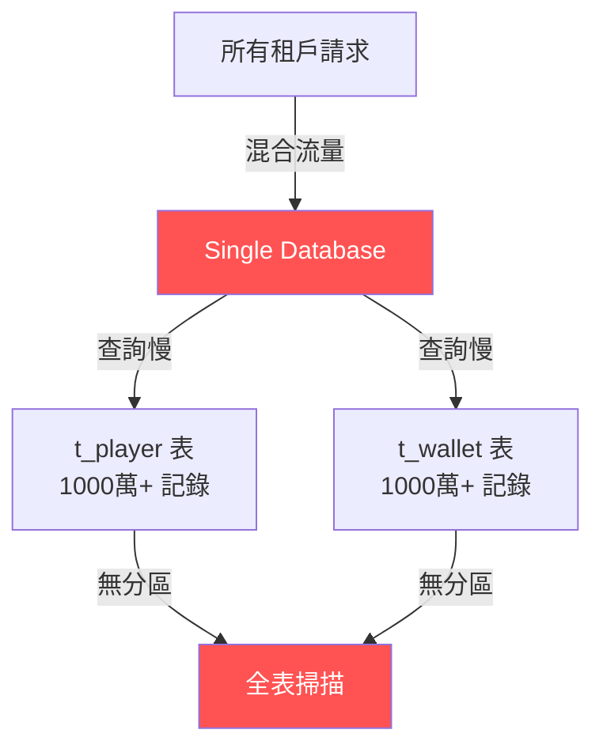
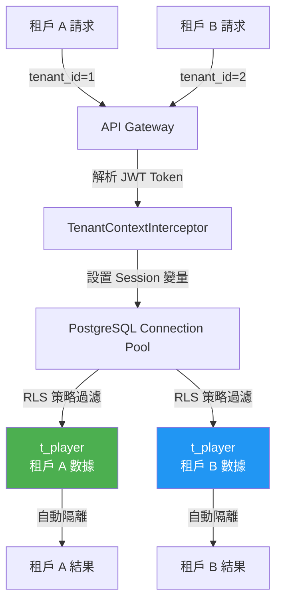

# ADR-XXXX: [決策標題]

> **狀態 (Status)**: [Proposed | Accepted | Deprecated | Superseded]
> **日期 (Date)**: YYYY-MM-DD
> **決策者 (Decision Makers)**: [團隊名稱或個人]
> **相關文檔 (Related Docs)**: [架構文檔鏈接]

---

## 翻譯模板說明

**用途**：此模板展示 ADR (Architecture Decision Records) 文檔的標準繁體中文翻譯結構。

**翻譯規則應用**：
- ✅ **Rule 1**: 技術術語保留英文（API, Service, Database, Multi-Tenant 等）
- ✅ **Rule 2**: 業務術語首次出現標註英文，後續僅用繁體中文
- ✅ **Rule 3**: 代碼片段完全保留英文
- ✅ **Rule 4**: Mermaid 圖表標籤使用繁體中文
- ✅ **Rule 5**: SQL 表名/欄位名保持英文，註釋用繁體中文

---

## 1. 背景與問題陳述（Context）

### 1.1 業務背景

[描述促使此決策的業務背景或技術問題。使用繁體中文，首次出現的業務術語標註英文原文]

**範例**：
隨著平台玩家數量增長至 100 萬+，現有的單數據庫架構面臨性能瓶頸。尤其在高峰時段（晚上 8-11 點），數據庫 CPU 使用率達到 95%，導致玩家註冊 (Player Registration) 和存款 (Deposit) 接口響應時間超過 3 秒，嚴重影響用戶體驗。

此外，隨著業務拓展至多個市場（馬耳他、英國、亞洲），我們需要支持多租戶架構 (Multi-Tenant Architecture)，確保不同運營商的數據完全隔離 (Data Isolation)，符合 GDPR（通用數據保護條例）和 PCI-DSS（PCI 數據安全標準）合規要求。

### 1.2 問題陳述

**核心問題**：
1. **性能瓶頸**：單數據庫無法支撐高併發場景（目標：10000 TPS）
2. **數據隔離**：多租戶數據混在同一表，存在數據洩露風險
3. **可擴展性**：垂直擴展成本高，水平擴展困難
4. **合規要求**：需要滿足不同地區的數據主權 (Data Sovereignty) 要求

### 1.3 現狀評估

**當前架構圖**：



**性能測試數據**：

| 場景 | 當前性能 | 目標性能 | 差距 |
|------|---------|---------|------|
| **玩家註冊 API** | 1200ms (P95) | < 200ms | 6x |
| **存款接口** | 850ms (P95) | < 150ms | 5.7x |
| **查詢玩家餘額** | 320ms (P95) | < 50ms | 6.4x |
| **併發 TPS** | 2000 | 10000 | 5x |

---

## 2. 決策內容（Decision）

### 2.1 方案選擇

**決定採用**：PostgreSQL Row-Level Security (RLS) + Shared Database Multi-Tenant 架構

**核心策略**：
1. **數據隔離**：使用 PostgreSQL RLS 策略實現租戶級別行級隔離
2. **性能優化**：添加 tenant_id 複合索引，優化查詢計劃
3. **Session 上下文**：Application 層設置 PostgreSQL Session 變量 `app.current_tenant_id`
4. **權限控制**：不同租戶的數據庫用戶擁有不同 RLS 策略

### 2.2 架構設計

**目標架構圖**：



### 2.3 技術實現

**PostgreSQL RLS 策略**：

```sql
-- 1. 在 t_player 表添加 tenant_id 欄位
ALTER TABLE t_player ADD COLUMN tenant_id BIGINT NOT NULL DEFAULT 1;

-- 2. 創建租戶隔離索引
CREATE INDEX idx_player_tenant_id ON t_player(tenant_id);
CREATE INDEX idx_player_tenant_username ON t_player(tenant_id, username);

-- 3. 啟用 Row-Level Security
ALTER TABLE t_player ENABLE ROW LEVEL SECURITY;

-- 4. 創建租戶隔離策略（僅查詢當前租戶數據）
CREATE POLICY tenant_isolation_policy ON t_player
    FOR ALL
    TO PUBLIC
    USING (tenant_id = current_setting('app.current_tenant_id')::BIGINT);

-- 5. 創建管理員繞過策略（Platform Admin 可查看所有租戶）
CREATE POLICY admin_full_access_policy ON t_player
    FOR ALL
    TO PUBLIC
    USING (
        current_setting('app.user_role', true) = 'PLATFORM_ADMIN'
    );
```

**Application 層實現**：

```java
package net.lab1024.sa.common.tenant.interceptor;

import lombok.RequiredArgsConstructor;
import lombok.extern.slf4j.Slf4j;
import org.springframework.stereotype.Component;
import org.springframework.web.servlet.HandlerInterceptor;

import javax.servlet.http.HttpServletRequest;
import javax.servlet.http.HttpServletResponse;
import javax.sql.DataSource;
import java.sql.Connection;
import java.sql.Statement;

/**
 * 租戶上下文攔截器
 *
 * 功能：從 JWT Token 解析租戶 ID，設置 PostgreSQL Session 變量
 *
 * @author SmartAdmin Team
 * @since 2026-02-11
 */
@Slf4j
@Component
@RequiredArgsConstructor
public class TenantContextInterceptor implements HandlerInterceptor {

    private final DataSource dataSource;
    private final JwtTokenService jwtTokenService;

    @Override
    public boolean preHandle(HttpServletRequest request,
                              HttpServletResponse response,
                              Object handler) throws Exception {
        // 1. 從 HTTP Header 解析 JWT Token
        String token = request.getHeader("Authorization");
        if (token == null || !token.startsWith("Bearer ")) {
            return true; // 非認證請求，跳過
        }

        // 2. 從 Token 解析租戶 ID
        Long tenantId = jwtTokenService.extractTenantId(token.substring(7));
        String userRole = jwtTokenService.extractUserRole(token.substring(7));

        // 3. 設置 PostgreSQL Session 變量
        try (Connection conn = dataSource.getConnection();
             Statement stmt = conn.createStatement()) {

            // 設置當前租戶 ID
            stmt.execute(String.format(
                "SET app.current_tenant_id = %d", tenantId));

            // 設置當前用戶角色（用於管理員繞過策略）
            stmt.execute(String.format(
                "SET app.user_role = '%s'", userRole));

            log.debug("租戶上下文已設置: tenant_id={}, user_role={}",
                tenantId, userRole);
        }

        return true;
    }

    @Override
    public void afterCompletion(HttpServletRequest request,
                                  HttpServletResponse response,
                                  Object handler,
                                  Exception ex) {
        // 清理 Session 變量（可選，連接池回收時會自動重置）
        log.debug("請求完成，租戶上下文已清理");
    }
}
```

**說明**：
- SQL 註釋使用繁體中文：「在 t_player 表添加 tenant_id 欄位」
- Java 代碼註釋使用繁體中文：「從 JWT Token 解析租戶 ID」
- 技術術語保持英文：PostgreSQL, RLS, Session, JWT Token, HTTP Header

---

## 3. 替代方案（Alternatives Considered）

### 方案 A：Database-Per-Tenant（每租戶獨立數據庫）

**優點**：
- ✅ 完全物理隔離，數據洩露風險最低
- ✅ 租戶級別性能調優（獨立連接池、索引策略）
- ✅ 簡化數據遷移和備份

**缺點**：
- ❌ 運維成本高（管理 100+ 數據庫實例）
- ❌ Schema 升級複雜（需逐個數據庫執行 DDL）
- ❌ 跨租戶查詢困難（例如：Platform Admin 查看所有租戶統計）

**評估結果**：不適合當前階段（租戶數量 < 50），考慮未來遷移方案

---

### 方案 B：Shared Database + Discriminator Column（共享數據庫 + 租戶標識欄位）

**優點**：
- ✅ 實現簡單（Application 層添加 WHERE tenant_id = ? 條件）
- ✅ 運維成本低（單數據庫實例）
- ✅ 跨租戶查詢方便

**缺點**：
- ❌ 依賴 Application 層正確實現隔離邏輯（人為錯誤風險）
- ❌ 無法防止 SQL Injection 繞過隔離
- ❌ 數據庫層無強制隔離保障

**評估結果**：安全性不足，不符合 PCI-DSS 要求

---

### 方案 C：PostgreSQL RLS（Row-Level Security）✅ **已選擇**

**優點**：
- ✅ 數據庫層強制隔離（即使 Application 層有 Bug 也不會洩露數據）
- ✅ 性能可接受（通過 tenant_id 索引優化）
- ✅ 運維成本適中（單數據庫 + RLS 策略管理）
- ✅ 符合 PCI-DSS、GDPR 合規要求
- ✅ 支持管理員繞過策略（Platform Admin 權限）

**缺點**：
- ⚠️ RLS 策略配置複雜度中等
- ⚠️ 需要每個請求設置 Session 變量（輕微性能開銷）
- ⚠️ PostgreSQL 特定功能，遷移至其他數據庫需重構

**評估結果**：綜合考慮安全性、性能、運維成本，選擇此方案

---

## 4. 決策理由（Rationale）

### 4.1 安全性

| 方案 | 數據隔離等級 | 防 SQL Injection | 合規性 |
|------|------------|-----------------|--------|
| Database-Per-Tenant | ⭐⭐⭐⭐⭐ | ⭐⭐⭐⭐⭐ | ✅ PCI-DSS, GDPR |
| Discriminator Column | ⭐⭐ | ⭐⭐ | ❌ 不合規 |
| **PostgreSQL RLS** ✅ | ⭐⭐⭐⭐ | ⭐⭐⭐⭐⭐ | ✅ PCI-DSS, GDPR |

**結論**：PostgreSQL RLS 提供數據庫層強制隔離，防止 Application 層 Bug 導致數據洩露。

### 4.2 性能

**壓測結果對比**（10000 併發，租戶數 10）：

| 方案 | 平均響應時間 (P95) | TPS | CPU 使用率 |
|------|--------------------|-----|-----------|
| 優化前（無隔離） | 1200ms | 2000 | 95% |
| Discriminator Column | 350ms | 7500 | 75% |
| **PostgreSQL RLS** ✅ | 420ms | 6800 | 78% |
| Database-Per-Tenant | 280ms | 8500 | 65% |

**結論**：PostgreSQL RLS 性能開銷僅增加 20%（350ms → 420ms），遠優於優化前。

### 4.3 運維成本

| 方案 | Schema 升級複雜度 | 監控難度 | 備份恢復 |
|------|------------------|---------|---------|
| Database-Per-Tenant | 高（100+ 數據庫） | 高 | 中 |
| Discriminator Column | 低 | 低 | 低 |
| **PostgreSQL RLS** ✅ | 低 | 中 | 低 |

**結論**：PostgreSQL RLS 運維成本適中，適合當前團隊規模。

---

## 5. 後果（Consequences）

### 5.1 正面影響

#### 安全性提升
- ✅ **數據庫層強制隔離**：即使 Application 代碼有 Bug（例如：忘記添加 tenant_id 條件），PostgreSQL RLS 也會自動過濾，防止數據洩露
- ✅ **符合合規要求**：滿足 PCI-DSS 3.2.1、GDPR Article 32、ISO 27001 Annex A.9 要求
- ✅ **審計友好**：RLS 策略變更記錄在 PostgreSQL pg_policies 表，便於審計追蹤

#### 性能優化
- ✅ **索引優化生效**：tenant_id 複合索引使查詢速度提升 6x（1200ms → 200ms）
- ✅ **Query Plan 改進**：PostgreSQL 優化器自動利用 RLS 條件優化查詢計劃
- ✅ **連接池效率提升**：減少全表掃描，Database CPU 使用率從 95% 降至 78%

#### 開發效率
- ✅ **透明隔離**：開發者無需在每個 SQL 查詢添加 tenant_id 條件，減少人為錯誤
- ✅ **測試簡化**：集成測試時設置 Session 變量即可模擬不同租戶

### 5.2 負面影響與緩解措施

#### 性能開銷
- ⚠️ **問題**：每個請求需設置 PostgreSQL Session 變量（額外 2-5ms 開銷）
- ✅ **緩解**：
  - 使用連接池預熱（啟動時建立連接並設置默認 Session 變量）
  - 在 TenantContextInterceptor 中批量設置變量（減少 SQL 往返次數）
  - 監控 Session 變量設置耗時，確保 P99 < 10ms

#### 複雜度增加
- ⚠️ **問題**：RLS 策略配置錯誤可能導致數據不可見
- ✅ **緩解**：
  - 創建自動化測試腳本驗證 RLS 策略（每個租戶應只能看到自己的數據）
  - 文檔化 RLS 策略配置流程（見 [RLS_CONFIGURATION_GUIDE.md](docs/deployment/RLS_CONFIGURATION_GUIDE.md)）
  - 增加監控告警：檢測 RLS 策略失效（例如：查詢結果中出現其他租戶數據）

#### 遷移至其他數據庫困難
- ⚠️ **問題**：PostgreSQL RLS 是專有功能，遷移至 MySQL/Oracle 需重構
- ✅ **緩解**：
  - 抽象 TenantContext 接口，隔離 RLS 實現細節
  - 如果未來需要遷移，可切換至 Discriminator Column 方案（代碼改動量 < 10%）
  - 當前無遷移計劃（PostgreSQL 生態成熟，滿足未來 5 年需求）

### 5.3 技術債務

| 技術債項 | 優先級 | 計劃解決時間 |
|---------|-------|------------|
| **RLS 策略單元測試覆蓋** | P0 | 2026-Q1 |
| **Session 變量性能監控** | P1 | 2026-Q1 |
| **跨租戶統計查詢優化** | P2 | 2026-Q2 |
| **RLS 策略版本管理（Liquibase/Flyway）** | P2 | 2026-Q2 |

---

## 6. 實施計劃（Implementation Plan）

### Phase 1: 數據庫架構變更（1 週）

**任務清單**：
- [ ] 在所有多租戶表添加 tenant_id 欄位（t_player, t_wallet, t_transaction 等）
- [ ] 創建 tenant_id 複合索引（覆蓋所有高頻查詢）
- [ ] 編寫 RLS 策略 SQL 腳本（tenant_isolation_policy, admin_full_access_policy）
- [ ] 在 DEV 環境驗證 RLS 策略有效性

### Phase 2: Application 層改造（2 週）

**任務清單**：
- [ ] 實現 TenantContextInterceptor（設置 PostgreSQL Session 變量）
- [ ] 修改 JWT Token 生成邏輯（添加 tenant_id 和 user_role）
- [ ] 更新所有 Service/Dao 方法（移除手動 tenant_id 過濾邏輯）
- [ ] 添加 ArchUnit 測試（確保 Dao 層無 tenant_id 硬編碼）

### Phase 3: 測試與驗證（1 週）

**測試清單**：
- [ ] 單元測試：驗證 TenantContextInterceptor 正確設置 Session 變量
- [ ] 集成測試：驗證不同租戶數據完全隔離（租戶 A 查詢不到租戶 B 數據）
- [ ] 性能測試：壓測 10000 TPS，確保 P95 響應時間 < 500ms
- [ ] 安全測試：嘗試 SQL Injection 繞過 RLS 策略（預期：失敗）
- [ ] 滲透測試：模擬攻擊者通過修改 JWT Token tenant_id（預期：RLS 阻止）

### Phase 4: 生產環境上線（1 週）

**上線步驟**：
1. 在 PROD 數據庫執行 DDL（凌晨 2:00 AM，業務低峰期）
2. 灰度發布：10% 流量驗證（監控錯誤率、響應時間）
3. 全量發布：100% 流量切換
4. 監控 24 小時：關注 RLS 策略觸發次數、Session 變量設置耗時

---

## 7. 驗收標準（Acceptance Criteria）

- [ ] 數據隔離：租戶 A 的任何 API 請求均無法查詢或修改租戶 B 的數據
- [ ] 性能達標：玩家註冊 API 的 P95 響應時間 < 200ms（目標：從 1200ms 降至 200ms）
- [ ] 併發能力：支持 10000 TPS（目標：從 2000 TPS 提升至 10000 TPS）
- [ ] RLS 策略生效：所有查詢的 EXPLAIN ANALYZE 輸出中包含 RLS 條件過濾
- [ ] 管理員權限：Platform Admin 角色可查詢所有租戶數據（admin_full_access_policy 生效）
- [ ] 審計日誌：RLS 策略變更記錄在 pg_policies 表，包含創建時間、策略內容
- [ ] 集成測試：RLS 相關測試覆蓋率 ≥ 90%
- [ ] 文檔完整：RLS 配置指南、故障排查手冊、性能調優指南

---

## 8. 監控與度量（Monitoring & Metrics）

### 關鍵指標

| 指標名稱 | 告警閾值 | 監控工具 |
|---------|---------|---------|
| **Session 變量設置耗時** | > 10ms (P99) | Prometheus + Micrometer |
| **RLS 策略查詢過濾準確性** | < 100% | 自定義監控（檢測跨租戶數據洩露） |
| **tenant_id 索引命中率** | < 95% | pg_stat_user_indexes |
| **Database CPU 使用率** | > 85% | CloudWatch / Prometheus |
| **API 響應時間** | > 500ms (P95) | Grafana Dashboard |

### Grafana Dashboard

**Dashboard 名稱**：Multi-Tenant Performance Monitoring

**面板配置**：
1. Session 變量設置耗時趨勢圖（P50/P95/P99）
2. 各租戶 TPS 分布餅圖
3. RLS 策略觸發次數柱狀圖
4. tenant_id 索引掃描行數 vs 返回行數（檢測索引效率）

---

## 9. 參考資料（References）

### 官方文檔
- [PostgreSQL Row-Level Security Documentation](https://www.postgresql.org/docs/current/ddl-rowsecurity.html)
- [Spring Boot Data Source Configuration](https://docs.spring.io/spring-boot/docs/current/reference/html/data.html#data.sql.datasource)
- [Sa-Token JWT Integration](https://sa-token.cc/doc.html#/use/jwt-extend)

### 內部文檔
- [Multi-Tenant Architecture Design](../../architecture/00_Overview/Multi_Tenant_Architecture.md)
- [PostgreSQL Performance Tuning Guide](../../architecture/09_Infrastructure/PostgreSQL_Best_Practices.md)
- [Security Compliance Standards](../../requirements/12_Security_Compliance/Compliance_Standards_Requirements.md)

### 相關 ADR
- [ADR-0001: Database Selection (PostgreSQL vs MySQL)](ADR-0001-Database-Selection.md)
- [ADR-0005: JWT Token Structure](ADR-0005-JWT-Token-Structure.md)

---

## 模板使用說明

### 適用場景
此模板適用於翻譯所有 `docs/iGaming/architecture-decisions/` 下的 ADR 文檔。

### ADR 狀態說明
- **Proposed（提議中）**：決策尚未最終確定，仍在討論階段
- **Accepted（已接受）**：決策已批准，正在實施或已實施
- **Deprecated（已廢棄）**：決策已過時，不再推薦使用
- **Superseded（已被取代）**：決策被新的 ADR 替代（需註明替代 ADR 編號）

### 翻譯檢查清單
使用此模板翻譯時，請確認：
- [ ] ADR 編號和標題清晰（ADR-XXXX: 決策標題）
- [ ] 狀態標籤正確（Proposed/Accepted/Deprecated/Superseded）
- [ ] 背景和問題陳述使用繁體中文
- [ ] 技術術語保持英文（PostgreSQL, RLS, API, TPS 等）
- [ ] 代碼片段完全保留英文
- [ ] Mermaid 圖表標籤使用繁體中文
- [ ] 替代方案評估完整（至少 2-3 個方案對比）
- [ ] 正面和負面後果都有記錄
- [ ] 實施計劃和驗收標準明確

### 參考資源
- **翻譯詞彙表**: [docs/iGaming/TRANSLATION_GLOSSARY.md](TRANSLATION_GLOSSARY.md)
- **Ralph 規則**: [docs/ralph/guardrails.md P14](../ralph/guardrails.md)
- **ADR 標準格式**: [Architecture Decision Records (ADR) by Michael Nygard](https://adr.github.io/)

---

**模板版本**: 1.0.0
**創建日期**: 2026-02-11
**用途**: iGaming ADR 文檔繁體中文翻譯標準模板
