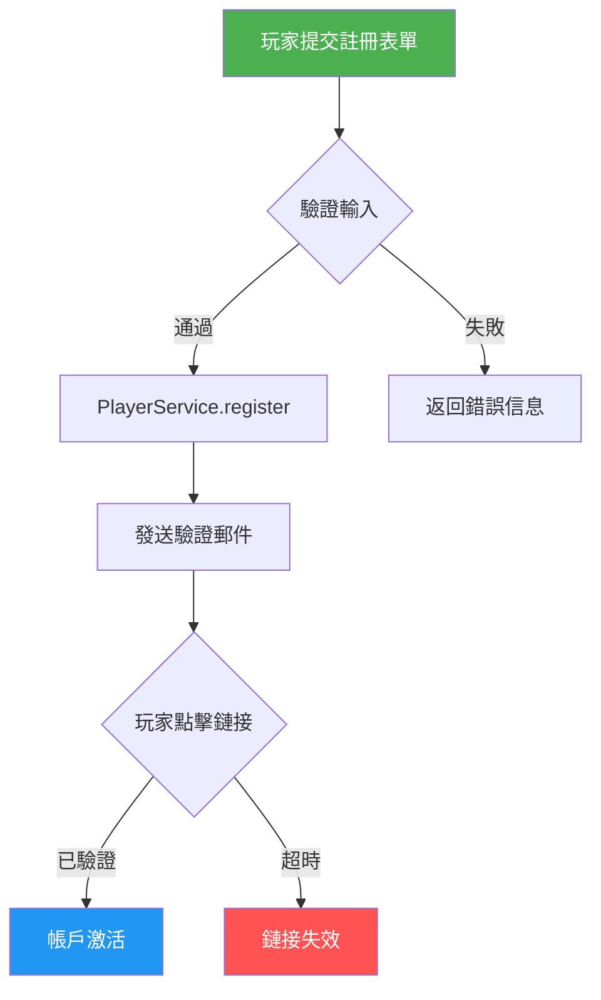

# [模塊名稱] 需求

> **Canonical Source**: [source-archive/XX_Category/XX-YY](../../source-archive/XX_Category/XX-YY_Source_File.md)
> **View Type**: Business Requirements
> **Target Audience**: [目標受眾角色]
> **Related Architecture**: [架構文檔標題](../../architecture/XX_Module/Architecture_File.md)
> **Last Synced**: YYYY-MM-DD

---

## 翻譯模板說明

**用途**：此模板展示 Requirements 文檔的標準繁體中文翻譯結構。

**翻譯規則應用**：
- ✅ **Rule 1**: 技術術語保留英文（Controller, Service, API, Database 等）
- ✅ **Rule 2**: 業務術語首次出現標註英文，後續僅用繁體中文
- ✅ **Rule 3**: 代碼片段完全保留英文
- ✅ **Rule 4**: Mermaid 圖表標籤使用繁體中文
- ✅ **Rule 5**: SQL 表名/欄位名保持英文，註釋用繁體中文

---

## 1. 概述（Overview）

### 1.1 業務背景

[業務背景描述，使用繁體中文。首次出現的業務術語需標註英文原文]

**範例**：
玩家帳戶管理系統 (Player Account Management System) 負責處理用戶註冊 (User Registration)、認證 (Authentication) 和個人資料管理 (Profile Management)。系統必須支持身份驗證 (KYC, Know Your Customer) 流程，確保符合反洗錢 (AML, Anti-Money Laundering) 法規要求。

後續提及時僅使用繁體中文：
玩家完成 KYC 驗證後，系統將解鎖完整的存款 (Deposit) 和提款 (Withdrawal) 功能。

### 1.2 核心功能

| 功能模組 | 描述 | 優先級 |
|---------|------|-------|
| **玩家註冊** | 支持郵箱/電話註冊，驗證碼驗證 | P0 |
| **身份驗證 (KYC)** | 文檔上傳、人臉識別、地址驗證 | P0 |
| **帳戶安全** | 多因素認證 (MFA)、Session 管理 | P0 |

---

## 2. 功能需求（Functional Requirements）

### 2.1 玩家註冊流程

**流程圖**（Mermaid 範例）：



**說明**：
- 節點標籤使用繁體中文：「玩家提交註冊表單」、「驗證輸入」
- 類名/方法名保持英文：`PlayerService.register`
- 流程描述使用繁體中文：「通過」、「失敗」

### 2.2 數據模型需求

**玩家表結構** (Player Table Schema)：

```sql
-- 玩家基本信息表
CREATE TABLE t_player (
    player_id BIGINT PRIMARY KEY,
    username VARCHAR(50) NOT NULL UNIQUE,
    encrypted_real_name VARBINARY(256),
    encrypted_phone VARBINARY(256),
    phone_index CHAR(64),
    encrypted_email VARBINARY(256),
    email_index CHAR(64),
    password_hash VARCHAR(128) NOT NULL,
    kyc_status VARCHAR(20) DEFAULT 'PENDING',
    created_at TIMESTAMP DEFAULT CURRENT_TIMESTAMP,
    updated_at TIMESTAMP DEFAULT CURRENT_TIMESTAMP
);

-- 欄位說明（使用 COMMENT）
COMMENT ON TABLE t_player IS '玩家基本信息表';
COMMENT ON COLUMN t_player.player_id IS '玩家唯一標識';
COMMENT ON COLUMN t_player.username IS '用戶名（公開）';
COMMENT ON COLUMN t_player.encrypted_real_name IS '真實姓名（AES-256-GCM 加密）';
COMMENT ON COLUMN t_player.encrypted_phone IS '電話號碼（AES-256-GCM 加密）';
COMMENT ON COLUMN t_player.phone_index IS '電話盲索引（HMAC-SHA256，用於查詢）';
COMMENT ON COLUMN t_player.encrypted_email IS '電子郵件（AES-256-GCM 加密）';
COMMENT ON COLUMN t_player.email_index IS '郵件盲索引（HMAC-SHA256，用於查詢）';
COMMENT ON COLUMN t_player.password_hash IS '密碼哈希（Argon2id）';
COMMENT ON COLUMN t_player.kyc_status IS '身份驗證狀態：PENDING/APPROVED/REJECTED';
COMMENT ON COLUMN t_player.created_at IS '創建時間（UTC）';
COMMENT ON COLUMN t_player.updated_at IS '最後更新時間（UTC）';

-- 索引
CREATE INDEX idx_player_kyc_status ON t_player(kyc_status);
CREATE INDEX idx_player_phone_index ON t_player(phone_index);
CREATE INDEX idx_player_email_index ON t_player(email_index);
```

**說明**：
- 表名和欄位名保持英文：`t_player`, `player_id`, `kyc_status`
- SQL COMMENT 使用繁體中文描述欄位用途
- 技術細節標註（AES-256-GCM, HMAC-SHA256, Argon2id）保持英文

---

## 3. 非功能需求（Non-Functional Requirements）

### 3.1 性能需求

| 指標 | 目標值 | 測量方式 |
|------|-------|---------|
| **註冊接口響應時間** | < 200ms (P95) | Prometheus metrics |
| **併發註冊處理能力** | 1000 TPS | JMeter 壓測 |
| **Database 連接池利用率** | < 70% | HikariCP metrics |

**說明**：
- 技術術語保持英文：Prometheus, JMeter, HikariCP, TPS
- 業務描述使用繁體中文：「註冊接口響應時間」、「併發註冊處理能力」

### 3.2 安全需求

**加密標準**：

| 數據類型 | 加密方式 | 密鑰管理 |
|---------|---------|---------|
| **個人身份信息 (PII)** | AES-256-GCM | AWS KMS (DEK/KEK) |
| **密碼** | Argon2id | 不可逆哈希 |
| **Session Token** | JWT (HS256) | Redis 存儲 |

**訪問控制** (Access Control)：

```java
// Controller 層權限檢查示例
@RestController
@RequestMapping("/api/player")
@RequiredArgsConstructor
public class PlayerController {

    private final PlayerService playerService;

    /**
     * 獲取玩家個人資料（需登入）
     *
     * @param playerId 玩家 ID
     * @return 玩家資料 VO
     */
    @GetMapping("/{playerId}/profile")
    @SaCheckPermission("player:profile:view")
    public ResponseDTO<PlayerProfileVO> getProfile(@PathVariable Long playerId) {
        return playerService.getProfile(playerId)
            .map(ResponseDTO::ok)
            .getOrElse(ResponseDTO.error(UserErrorCode.PLAYER_NOT_FOUND));
    }
}
```

**說明**：
- 代碼註釋使用繁體中文（根據項目要求）
- 類名/方法名/注解保持英文：`PlayerController`, `PlayerService`, `@SaCheckPermission`
- 業務術語在註釋中使用繁體中文：「玩家個人資料」、「玩家 ID」

---

## 4. 業務價值（Business Value）

**此功能為業務帶來的價值**：

1. **提升用戶體驗**：簡化註冊流程，降低註冊門檻，提高轉換率 (Conversion Rate)
2. **合規保障**：完整的 KYC 流程確保符合 MGA（馬耳他博彩管理局）、UKGC（英國博彩委員會）監管要求
3. **風險控制**：實時身份驗證降低欺詐風險 (Fraud Risk)，保護平台資金安全
4. **數據安全**：符合 GDPR（通用數據保護條例）、PCI-DSS（PCI 數據安全標準）加密標準

---

## 5. 成功指標（Success Metrics）

| 指標 | 目標值 | 測量週期 |
|------|-------|---------|
| **註冊轉換率** | ≥ 70% | 每週 |
| **KYC 驗證通過率** | ≥ 85% | 每週 |
| **首次存款率 (FTD)** | ≥ 40% | 每月 |
| **平均註冊時長** | ≤ 3 分鐘 | 每日 |
| **註冊失敗率** | ≤ 5% | 每日 |

**說明**：
- 業務指標使用繁體中文：「註冊轉換率」、「平均註冊時長」
- 技術/英文縮寫保持原樣：FTD (First Time Deposit)

---

## 6. 驗收標準（Acceptance Criteria）

- [ ] 玩家可使用郵箱或電話號碼註冊，系統發送驗證碼 (OTP, One-Time Password) 進行驗證
- [ ] 註冊表單驗證規則：用戶名 3-50 字符、密碼至少 8 字符（含大小寫、數字、特殊符號）
- [ ] PlayerService 使用 Vavr 的 Option 類型處理可選值（禁用 java.util.Optional）
- [ ] 密碼使用 Argon2id 哈希算法存儲，迭代次數 ≥ 3，記憶體成本 ≥ 64MB
- [ ] 個人身份信息 (PII) 字段（真實姓名、電話、郵箱、身份證號）使用 AES-256-GCM 加密存儲
- [ ] 查詢敏感字段（電話、郵箱）使用盲索引 (Blind Index, HMAC-SHA256) 實現加密後查詢
- [ ] KYC 驗證狀態變更記錄至審計日誌 (Audit Log)，包含操作人、時間戳、變更前後狀態
- [ ] Controller 使用 @SaCheckPermission 進行權限檢查，未授權請求返回 403 Forbidden
- [ ] 註冊接口實現限流 (Rate Limiting)：單 IP 每分鐘最多 5 次請求
- [ ] 集成測試 (Integration Test) 覆蓋率 ≥ 80%，使用 Testcontainers 啟動 PostgreSQL 和 Redis

---

## 7. 依賴與約束（Dependencies & Constraints）

### 7.1 技術依賴

| 依賴項 | 版本要求 | 用途 |
|-------|---------|------|
| **Spring Boot** | 3.5.4 | 應用框架 |
| **PostgreSQL** | 15+ | 主數據庫 |
| **Redis** | 7+ | Session 存儲、限流 |
| **AWS KMS** | - | 密鑰管理服務 (Key Management Service) |
| **Vavr** | 0.10.4 | 函數式編程庫 |

### 7.2 外部服務

- **SMS Gateway**: 發送手機驗證碼 (OTP)
- **Email Service**: 發送驗證郵件
- **KYC Provider**: 第三方身份驗證服務 (例如：Onfido, Jumio)

---

## 8. 風險與緩解（Risks & Mitigation）

| 風險 | 影響 | 緩解措施 |
|------|------|---------|
| **PII 數據洩露** | 高 | 加密存儲 + 訪問控制 + 審計日誌 |
| **暴力破解攻擊** | 中 | 限流 + 驗證碼 + 帳戶鎖定機制 |
| **KYC 服務不可用** | 中 | 實現重試機制 + 降級方案（手動審核） |
| **Database 性能瓶頸** | 低 | 索引優化 + 連接池調優 + Read Replica |

---

## 模板使用說明

### 適用場景
此模板適用於翻譯所有 `docs/iGaming/requirements/` 下的需求文檔。

### 翻譯檢查清單
使用此模板翻譯時，請確認：
- [ ] 標題和章節標題使用繁體中文
- [ ] 首次出現的業務術語標註了英文原文
- [ ] 技術術語（Controller, Service, API 等）保持英文
- [ ] 代碼片段完全保留英文
- [ ] SQL 表名/欄位名保持英文，COMMENT 使用繁體中文
- [ ] Mermaid 圖表標籤使用繁體中文，類名/方法名保持英文
- [ ] 相關鏈接路徑正確（Canonical Source, Related Architecture）

### 參考資源
- **翻譯詞彙表**: [docs/iGaming/TRANSLATION_GLOSSARY.md](TRANSLATION_GLOSSARY.md)
- **Ralph 規則**: [docs/ralph/guardrails.md P14](../ralph/guardrails.md)
- **實際範例**: [requirements/12_Security_Compliance/Compliance_Standards_Requirements.md](requirements/12_Security_Compliance/Compliance_Standards_Requirements.md)

---

**模板版本**: 1.0.0
**創建日期**: 2026-02-11
**用途**: iGaming Requirements 文檔繁體中文翻譯標準模板
