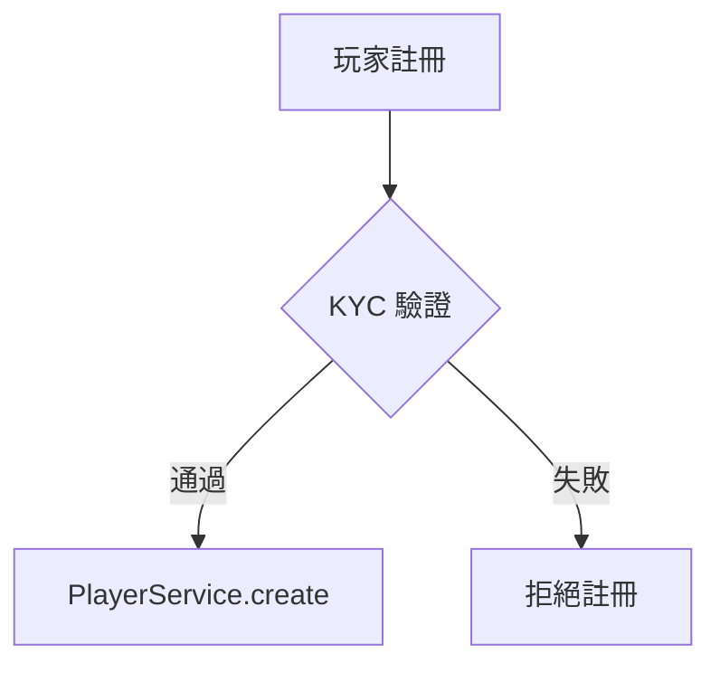
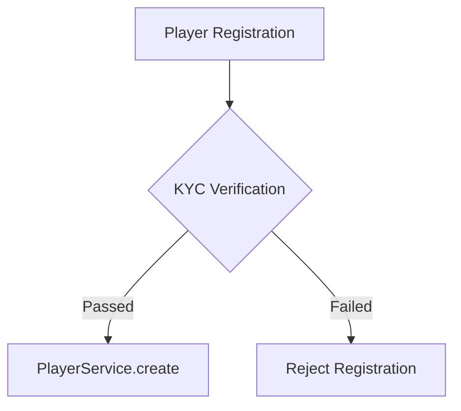
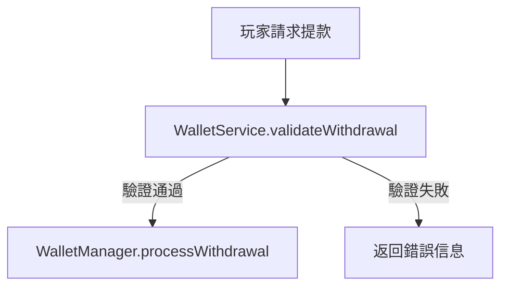

# iGaming Documentation Translation Glossary

> **版本**: 1.0.0
> **創建日期**: 2026-02-11
> **用途**: iGaming 文檔繁體中文化標準詞彙表
> **適用範圍**: `docs/iGaming/` 下所有 Requirements、Architecture、ADR 文檔

---

## 翻譯原則（Translation Rules）

### Rule 1: 技術術語不翻譯
SmartAdmin 架構層、基礎設施、代碼相關術語**保持英文**。

**範例**：
- ✅ `PlayerService` → 保留
- ❌ `PlayerService` → 玩家服務（錯誤）

### Rule 2: 業務術語翻譯 + 首次標註英文
業務術語使用繁體中文，**首次出現時標註英文**。

**範例**：
- ✅ `有效投注額 (Valid Turnover)`
- ✅ `自我排除 (Self-Exclusion)`
- 後續出現僅用中文：「計算有效投注額」

### Rule 3: 技術文檔中保留英文代碼片段
所有 Java/SQL/YAML 代碼片段、類名、方法名、變量名**完全保留英文**。

### Rule 4: Mermaid 圖表標籤使用中文
Mermaid 圖表中的**節點標籤、流程描述使用繁體中文**，但類名/方法名保持英文。

**範例**：


### Rule 5: SQL 表格/欄位名稱保留英文
SQL 表名、欄位名、索引名**保持英文**，但註釋使用繁體中文。

**範例**：
```sql
CREATE TABLE t_player (
    player_id BIGINT PRIMARY KEY,
    kyc_status VARCHAR(20)
);
COMMENT ON COLUMN t_player.kyc_status IS '身份驗證狀態';
```

---

## 技術術語（Technical Terms - 保留英文）

### SmartAdmin 架構層（Architecture Layers）

| 英文術語 | 說明 | 範例 |
|---------|------|------|
| **Controller** | 控制器層 | `PlayerController` |
| **Service** | 服務層 | `PlayerService` |
| **Manager** | 業務管理層（含 @Transactional） | `PlayerManager` |
| **Dao** | 數據訪問層 | `PlayerDao` |
| **Repository** | 倉儲層 | `PlayerRepository` |
| **Entity** | 實體類 | `PlayerEntity` |
| **VO** | 視圖對象 | `PlayerVO` |
| **DTO** | 數據傳輸對象 | `PlayerDTO` |
| **Form** | 表單對象 | `PlayerAddForm` |
| **QueryForm** | 查詢表單 | `PlayerQueryForm` |
| **UpdateForm** | 更新表單 | `PlayerUpdateForm` |
| **ResponseDTO** | 響應對象 | `ResponseDTO.ok(data)` |
| **PageResult** | 分頁結果 | `PageResult<PlayerVO>` |

### Spring 注解（Annotations）

| 英文術語 | 說明 | 使用規則 |
|---------|------|---------|
| **@Transactional** | 事務注解 | 僅在 Manager 層使用 |
| **@RequiredArgsConstructor** | 構造器注入 | 強制使用（禁用 @Autowired） |
| **@SaCheckPermission** | 權限檢查 | Controller 方法上使用 |
| **@NoNeedLogin** | 無需登入 | 公開 API 使用 |
| **@Cacheable** | 緩存注解 | 僅在 Manager 層使用 |
| **@Service** | 服務類標註 | Service 層使用 |
| **@Component** | 組件標註 | Manager/Util 類使用 |
| **@RestController** | REST 控制器 | Controller 層使用 |

### 基礎設施（Infrastructure）

| 英文術語 | 說明 | 使用場景 |
|---------|------|---------|
| **API** | 應用程式介面 | REST API, API Gateway |
| **REST** | RESTful 風格 | HTTP 接口設計 |
| **HTTP** | 超文本傳輸協議 | 通訊協議 |
| **HTTPS** | 安全 HTTP | 加密通訊 |
| **JSON** | 數據交換格式 | API 請求/響應 |
| **YAML** | 配置文件格式 | application.yml |
| **Database** | 數據庫 | PostgreSQL, MySQL |
| **PostgreSQL** | 數據庫系統 | 主數據庫 |
| **Redis** | 緩存數據庫 | 分佈式緩存 |
| **Kafka** | 消息隊列 | 異步消息 |
| **Multi-Tenant** | 多租戶架構 | SaaS 架構模式 |
| **Row-Level Security (RLS)** | 行級安全 | PostgreSQL 數據隔離 |
| **Session** | 會話 | 用戶會話管理 |
| **Token** | 令牌 | JWT Token, Access Token |
| **JWT** | JSON Web Token | 認證令牌格式 |
| **OAuth** | 授權協議 | 第三方登入 |
| **SSO** | 單點登入 | Single Sign-On |
| **TLS** | 傳輸層安全 | TLS 1.3 |
| **AES-256-GCM** | 加密算法 | 數據加密 |
| **HMAC-SHA256** | 哈希算法 | Blind Index 生成 |

### 數據結構與類型（Data Structures）

| 英文術語 | 說明 | 使用場景 |
|---------|------|---------|
| **Option** | Vavr 可選類型 | `Option<User>` (禁用 java.util.Optional) |
| **Try** | Vavr 異常處理 | `Try<Result>` |
| **Either** | Vavr 二選一類型 | `Either<Error, Success>` |
| **List** | 列表 | `List<String>` |
| **Map** | 映射 | `Map<String, Object>` |
| **Set** | 集合 | `Set<Long>` |

### 測試術語（Testing）

| 英文術語 | 說明 | 使用場景 |
|---------|------|---------|
| **Unit Test** | 單元測試 | JUnit 5 測試 |
| **Integration Test** | 集成測試 | Testcontainers 測試 |
| **ArchUnit** | 架構測試 | ArchitectureTest.java |
| **Mock** | 模擬對象 | Mockito 模擬 |
| **Stub** | 樁對象 | 測試樁 |

---

## 業務術語（Business Terms - 繁體中文）

### 玩家管理（Player Management）

| 英文術語 | 繁體中文 | 縮寫/備註 | 首次使用範例 |
|---------|---------|----------|-------------|
| **Player** | 玩家 | - | 玩家 (Player) |
| **User** | 用戶 | - | 用戶 (User) |
| **Account** | 帳戶 | - | 玩家帳戶 (Player Account) |
| **Registration** | 註冊 | - | 玩家註冊 (Player Registration) |
| **Login** | 登入 | - | 登入 (Login) |
| **Logout** | 登出 | - | 登出 (Logout) |
| **Profile** | 個人資料 | - | 個人資料 (Profile) |
| **Real Name** | 真實姓名 | PII 敏感數據 | 真實姓名 (Real Name) |
| **Date of Birth** | 出生日期 | DOB | 出生日期 (Date of Birth, DOB) |
| **Phone Number** | 電話號碼 | PII 敏感數據 | 電話號碼 (Phone Number) |
| **Email Address** | 電子郵件地址 | PII 敏感數據 | 電子郵件地址 (Email Address) |
| **ID Number** | 身份證號 | PII 敏感數據 | 身份證號 (ID Number) |
| **Bank Account** | 銀行帳號 | PII 敏感數據 | 銀行帳號 (Bank Account) |
| **Password** | 密碼 | 使用 Argon2id 哈希 | 密碼 (Password) |
| **IP Address** | IP 地址 | - | IP 地址 (IP Address) |
| **Device ID** | 設備標識 | - | 設備標識 (Device ID) |
| **Session** | 會話 | 保持英文 | Session |
| **Active Users** | 活躍用戶 | - | 活躍用戶 (Active Users) |
| **Online Players** | 在線玩家 | - | 在線玩家 (Online Players) |

### 財務與錢包（Finance & Wallet）

| 英文術語 | 繁體中文 | 縮寫/備註 | 首次使用範例 |
|---------|---------|----------|-------------|
| **Wallet** | 錢包 | - | 玩家錢包 (Player Wallet) |
| **Balance** | 餘額 | - | 帳戶餘額 (Account Balance) |
| **Playable Balance** | 可下注餘額 | - | 可下注餘額 (Playable Balance) |
| **Frozen Balance** | 凍結餘額 | - | 凍結餘額 (Frozen Balance) |
| **Bonus Balance** | 獎金餘額 | - | 獎金餘額 (Bonus Balance) |
| **Deposit** | 存款 | - | 存款 (Deposit) |
| **Withdrawal** | 提款 | - | 提款 (Withdrawal) |
| **Transaction** | 交易 | - | 交易 (Transaction) |
| **Transfer** | 轉賬 | - | 轉賬 (Transfer) |
| **Payment Gateway** | 支付閘道 | PSP | 支付閘道 (Payment Gateway, PSP) |
| **Payment Method** | 支付方式 | - | 支付方式 (Payment Method) |
| **Credit Card** | 信用卡 | - | 信用卡 (Credit Card) |
| **E-Wallet** | 電子錢包 | - | 電子錢包 (E-Wallet) |
| **Bank Transfer** | 銀行轉賬 | - | 銀行轉賬 (Bank Transfer) |
| **Cryptocurrency** | 加密貨幣 | - | 加密貨幣 (Cryptocurrency) |
| **Currency** | 幣種 | - | 幣種 (Currency) |
| **Exchange Rate** | 匯率 | - | 匯率 (Exchange Rate) |
| **Fee** | 手續費 | - | 手續費 (Fee) |
| **Commission** | 佣金 | - | 佣金 (Commission) |

### 投注與遊戲（Betting & Gaming）

| 英文術語 | 繁體中文 | 縮寫/備註 | 首次使用範例 |
|---------|---------|----------|-------------|
| **Bet** | 投注 | - | 投注 (Bet) |
| **Wager** | 下注 | - | 下注 (Wager) |
| **Stake** | 注額 | - | 注額 (Stake) |
| **Valid Turnover** | 有效投注額 | 流水 | 有效投注額 (Valid Turnover) |
| **Effective Turnover** | 有效流水 | - | 有效流水 (Effective Turnover) |
| **Betting Limit** | 投注限額 | - | 投注限額 (Betting Limit) |
| **Minimum Bet** | 最小投注額 | - | 最小投注額 (Minimum Bet) |
| **Maximum Bet** | 最大投注額 | - | 最大投注額 (Maximum Bet) |
| **Win** | 贏 | - | 贏 (Win) |
| **Loss** | 輸 | - | 輸 (Loss) |
| **Payout** | 派彩 | - | 派彩 (Payout) |
| **Odds** | 賠率 | - | 賠率 (Odds) |
| **Return to Player** | 玩家回報率 | RTP | 玩家回報率 (Return to Player, RTP) |
| **House Edge** | 莊家優勢 | - | 莊家優勢 (House Edge) |
| **Game Round** | 遊戲局 | - | 遊戲局 (Game Round) |
| **Game Session** | 遊戲會話 | - | 遊戲會話 (Game Session) |
| **Free Spins** | 免費旋轉 | - | 免費旋轉 (Free Spins) |
| **Bonus Game** | 獎勵遊戲 | - | 獎勵遊戲 (Bonus Game) |
| **Jackpot** | 累積獎金 | - | 累積獎金 (Jackpot) |
| **Progressive Jackpot** | 累進式獎金 | - | 累進式獎金 (Progressive Jackpot) |

### 促銷與獎勵（Promotions & Bonuses）

| 英文術語 | 繁體中文 | 縮寫/備註 | 首次使用範例 |
|---------|---------|----------|-------------|
| **Promotion** | 促銷活動 | - | 促銷活動 (Promotion) |
| **Bonus** | 獎金 | - | 獎金 (Bonus) |
| **Welcome Bonus** | 歡迎獎金 | - | 歡迎獎金 (Welcome Bonus) |
| **Deposit Bonus** | 存款獎金 | - | 存款獎金 (Deposit Bonus) |
| **No Deposit Bonus** | 無存款獎金 | - | 無存款獎金 (No Deposit Bonus) |
| **Reload Bonus** | 續存獎金 | - | 續存獎金 (Reload Bonus) |
| **Cashback** | 返水 | - | 返水 (Cashback) |
| **Rebate** | 回饋 | - | 回饋 (Rebate) |
| **Loyalty Program** | 忠誠計劃 | - | 忠誠計劃 (Loyalty Program) |
| **Loyalty Points** | 忠誠點數 | - | 忠誠點數 (Loyalty Points) |
| **VIP Program** | VIP 計劃 | - | VIP 計劃 (VIP Program) |
| **VIP Level** | VIP 等級 | - | VIP 等級 (VIP Level) |
| **Tier** | 層級 | - | 層級 (Tier) |
| **Reward** | 獎勵 | - | 獎勵 (Reward) |
| **Wagering Requirement** | 流水要求 | - | 流水要求 (Wagering Requirement) |
| **Rollover** | 投注倍數 | - | 投注倍數 (Rollover) |
| **Bonus Terms** | 獎金條款 | - | 獎金條款 (Bonus Terms) |
| **Expiry Date** | 到期日期 | - | 到期日期 (Expiry Date) |

### 風險與合規（Risk & Compliance）

| 英文術語 | 繁體中文 | 縮寫/備註 | 首次使用範例 |
|---------|---------|----------|-------------|
| **Risk Management** | 風險管理 | - | 風險管理 (Risk Management) |
| **Risk Control** | 風控 | - | 風控 (Risk Control) |
| **Fraud Detection** | 欺詐檢測 | - | 欺詐檢測 (Fraud Detection) |
| **KYC** | 身份驗證 | Know Your Customer | 身份驗證 (KYC, Know Your Customer) |
| **AML** | 反洗錢 | Anti-Money Laundering | 反洗錢 (AML, Anti-Money Laundering) |
| **Identity Verification** | 身份驗證 | - | 身份驗證 (Identity Verification) |
| **Document Verification** | 文檔驗證 | - | 文檔驗證 (Document Verification) |
| **Address Verification** | 地址驗證 | - | 地址驗證 (Address Verification) |
| **Selfie Verification** | 自拍驗證 | - | 自拍驗證 (Selfie Verification) |
| **Liveness Detection** | 活體檢測 | - | 活體檢測 (Liveness Detection) |
| **Suspicious Activity** | 可疑活動 | - | 可疑活動 (Suspicious Activity) |
| **Transaction Monitoring** | 交易監控 | - | 交易監控 (Transaction Monitoring) |
| **Blacklist** | 黑名單 | - | 黑名單 (Blacklist) |
| **Whitelist** | 白名單 | - | 白名單 (Whitelist) |
| **Risk Score** | 風險評分 | - | 風險評分 (Risk Score) |
| **Risk Level** | 風險等級 | - | 風險等級 (Risk Level) |
| **High Risk Player** | 高風險玩家 | - | 高風險玩家 (High Risk Player) |
| **Compliance** | 合規 | - | 合規 (Compliance) |
| **Regulatory Requirements** | 監管要求 | - | 監管要求 (Regulatory Requirements) |
| **License** | 牌照 | - | 運營牌照 (Operating License) |
| **Audit** | 審計 | - | 審計 (Audit) |
| **Audit Log** | 審計日誌 | - | 審計日誌 (Audit Log) |

### 責任博彩（Responsible Gaming）

| 英文術語 | 繁體中文 | 縮寫/備註 | 首次使用範例 |
|---------|---------|----------|-------------|
| **Responsible Gaming** | 責任博彩 | RG | 責任博彩 (Responsible Gaming, RG) |
| **Self-Exclusion** | 自我排除 | - | 自我排除 (Self-Exclusion) |
| **Cooling-off Period** | 冷靜期 | - | 冷靜期 (Cooling-off Period) |
| **Deposit Limit** | 存款限額 | - | 存款限額 (Deposit Limit) |
| **Loss Limit** | 虧損限額 | - | 虧損限額 (Loss Limit) |
| **Session Limit** | 會話限額 | - | 會話限額 (Session Limit) |
| **Time Limit** | 時間限額 | - | 時間限額 (Time Limit) |
| **Reality Check** | 現實檢查 | - | 現實檢查 (Reality Check) |
| **Gambling Addiction** | 賭博成癮 | - | 賭博成癮 (Gambling Addiction) |
| **Problem Gambling** | 問題賭博 | - | 問題賭博 (Problem Gambling) |

### 安全與加密（Security & Encryption）

| 英文術語 | 繁體中文 | 縮寫/備註 | 首次使用範例 |
|---------|---------|----------|-------------|
| **Encryption** | 加密 | - | 數據加密 (Data Encryption) |
| **Decryption** | 解密 | - | 解密 (Decryption) |
| **Hashing** | 哈希 | - | 密碼哈希 (Password Hashing) |
| **Authentication** | 認證 | - | 用戶認證 (User Authentication) |
| **Authorization** | 授權 | - | 授權 (Authorization) |
| **Access Control** | 訪問控制 | - | 訪問控制 (Access Control) |
| **Permission** | 權限 | - | 權限 (Permission) |
| **Role** | 角色 | RBAC | 角色 (Role) |
| **Multi-Factor Authentication** | 多因素認證 | MFA, 2FA | 多因素認證 (Multi-Factor Authentication, MFA) |
| **Two-Factor Authentication** | 雙因素認證 | 2FA | 雙因素認證 (Two-Factor Authentication, 2FA) |
| **OTP** | 一次性密碼 | One-Time Password | 一次性密碼 (OTP, One-Time Password) |
| **TOTP** | 基於時間的一次性密碼 | Time-based OTP | TOTP |
| **WebAuthn** | Web 認證 | - | WebAuthn |
| **Biometric** | 生物識別 | - | 生物識別 (Biometric) |
| **PII** | 個人身份信息 | Personally Identifiable Information | 個人身份信息 (PII, Personally Identifiable Information) |
| **Data Masking** | 數據脫敏 | - | 數據脫敏 (Data Masking) |
| **Blind Index** | 盲索引 | HMAC-based | 盲索引 (Blind Index) |
| **Crypto-Shredding** | 加密銷毀 | - | 加密銷毀 (Crypto-Shredding) |
| **Key Management** | 密鑰管理 | - | 密鑰管理 (Key Management) |
| **DEK** | 數據加密密鑰 | Data Encryption Key | 數據加密密鑰 (DEK, Data Encryption Key) |
| **KEK** | 密鑰加密密鑰 | Key Encryption Key | 密鑰加密密鑰 (KEK, Key Encryption Key) |

### 合規標準（Compliance Standards）

| 英文術語 | 繁體中文 | 縮寫/備註 | 首次使用範例 |
|---------|---------|----------|-------------|
| **PCI-DSS** | PCI 數據安全標準 | Payment Card Industry Data Security Standard | PCI 數據安全標準 (PCI-DSS) |
| **ISO 27001** | ISO 27001 信息安全管理 | - | ISO 27001 信息安全管理標準 |
| **GDPR** | 通用數據保護條例 | General Data Protection Regulation | 通用數據保護條例 (GDPR) |
| **SOC 2** | SOC 2 合規 | Service Organization Control 2 | SOC 2 合規 |
| **eCOGRA** | eCOGRA 認證 | - | eCOGRA 認證 |
| **GLI** | GLI 認證 | Gaming Laboratories International | GLI 認證 |
| **MGA** | 馬耳他博彩管理局 | Malta Gaming Authority | 馬耳他博彩管理局 (MGA) |
| **UKGC** | 英國博彩委員會 | UK Gambling Commission | 英國博彩委員會 (UKGC) |
| **RTS** | 遠程技術標準 | Remote Technical Standards | 遠程技術標準 (RTS) |

### 數據與報表（Data & Reporting）

| 英文術語 | 繁體中文 | 縮寫/備註 | 首次使用範例 |
|---------|---------|----------|-------------|
| **Report** | 報表 | - | 報表 (Report) |
| **Dashboard** | 儀表板 | - | 儀表板 (Dashboard) |
| **Analytics** | 分析 | - | 數據分析 (Data Analytics) |
| **Metrics** | 指標 | - | 業務指標 (Business Metrics) |
| **KPI** | 關鍵績效指標 | Key Performance Indicator | 關鍵績效指標 (KPI) |
| **Revenue** | 收入 | - | 收入 (Revenue) |
| **Profit** | 利潤 | - | 利潤 (Profit) |
| **Gross Gaming Revenue** | 總博彩收入 | GGR | 總博彩收入 (Gross Gaming Revenue, GGR) |
| **Net Gaming Revenue** | 淨博彩收入 | NGR | 淨博彩收入 (Net Gaming Revenue, NGR) |
| **Conversion Rate** | 轉換率 | - | 轉換率 (Conversion Rate) |
| **Retention Rate** | 留存率 | - | 留存率 (Retention Rate) |
| **Churn Rate** | 流失率 | - | 流失率 (Churn Rate) |
| **Active Users** | 活躍用戶 | DAU/MAU | 活躍用戶 (Active Users) |
| **Daily Active Users** | 日活躍用戶 | DAU | 日活躍用戶 (DAU, Daily Active Users) |
| **Monthly Active Users** | 月活躍用戶 | MAU | 月活躍用戶 (MAU, Monthly Active Users) |

### 系統與運維（System & Operations）

| 英文術語 | 繁體中文 | 縮寫/備註 | 首次使用範例 |
|---------|---------|----------|-------------|
| **Environment** | 環境 | - | 開發環境 (Development Environment) |
| **Development** | 開發 | DEV | 開發環境 (Development, DEV) |
| **Testing** | 測試 | UAT | 測試環境 (Testing, UAT) |
| **Production** | 生產 | PROD | 生產環境 (Production, PROD) |
| **Deployment** | 部署 | - | 部署 (Deployment) |
| **Monitoring** | 監控 | - | 系統監控 (System Monitoring) |
| **Alert** | 告警 | - | 告警 (Alert) |
| **Incident** | 事件 | - | 故障事件 (Incident) |
| **Rollback** | 回滾 | - | 回滾 (Rollback) |
| **Backup** | 備份 | - | 數據備份 (Data Backup) |
| **Recovery** | 恢復 | - | 災難恢復 (Disaster Recovery) |
| **High Availability** | 高可用性 | HA | 高可用性 (High Availability, HA) |
| **Scalability** | 可擴展性 | - | 可擴展性 (Scalability) |
| **Performance** | 性能 | - | 系統性能 (System Performance) |
| **Throughput** | 吞吐量 | - | 吞吐量 (Throughput) |
| **Latency** | 延遲 | - | 延遲 (Latency) |
| **Load Balancing** | 負載均衡 | - | 負載均衡 (Load Balancing) |

---

## 使用範例（Usage Examples）

### 範例 1: Requirements 文檔標題翻譯

**英文原文**：
```markdown
# Player Account Management Requirements

## Overview
The Player Account Management system handles user registration, authentication, and profile management.
```

**繁體中文翻譯**：
```markdown
# 玩家帳戶管理需求

## 概述
玩家帳戶管理系統處理用戶註冊 (User Registration)、認證 (Authentication) 和個人資料管理 (Profile Management)。
```

### 範例 2: Architecture 文檔代碼片段

**英文原文**：
```markdown
## Service Layer Implementation

```java
@Service
@RequiredArgsConstructor
public class PlayerService {
    private final PlayerDao playerDao;

    public Option<PlayerVO> getPlayer(Long playerId) {
        return playerDao.selectById(playerId)
            .map(this::toVO);
    }
}
```
```

**繁體中文翻譯**：
```markdown
## Service 層實現

**說明**：PlayerService 負責玩家 (Player) 的業務邏輯處理。使用 Vavr 的 Option 類型處理可選值（禁用 java.util.Optional）。

```java
@Service
@RequiredArgsConstructor
public class PlayerService {
    private final PlayerDao playerDao;

    public Option<PlayerVO> getPlayer(Long playerId) {
        return playerDao.selectById(playerId)
            .map(this::toVO);
    }
}
```
```

### 範例 3: Mermaid 圖表翻譯

**英文原文**：


**繁體中文翻譯**：


**說明**：
- 節點標籤使用繁體中文：「玩家註冊」、「KYC 驗證」
- 類名/方法名保持英文：`PlayerService.create`
- 流程描述使用繁體中文：「通過」、「失敗」

### 範例 4: SQL 語句翻譯

**英文原文**：
```sql
-- Player table schema
CREATE TABLE t_player (
    player_id BIGINT PRIMARY KEY,
    username VARCHAR(50) NOT NULL,
    real_name VARCHAR(100),
    phone VARCHAR(20),
    email VARCHAR(100),
    kyc_status VARCHAR(20),
    created_at TIMESTAMP DEFAULT CURRENT_TIMESTAMP
);
```

**繁體中文翻譯**：
```sql
-- 玩家表結構
CREATE TABLE t_player (
    player_id BIGINT PRIMARY KEY,
    username VARCHAR(50) NOT NULL,
    real_name VARCHAR(100),
    phone VARCHAR(20),
    email VARCHAR(100),
    kyc_status VARCHAR(20),
    created_at TIMESTAMP DEFAULT CURRENT_TIMESTAMP
);

-- 欄位說明
COMMENT ON COLUMN t_player.player_id IS '玩家 ID';
COMMENT ON COLUMN t_player.username IS '用戶名';
COMMENT ON COLUMN t_player.real_name IS '真實姓名（PII 敏感數據，需加密）';
COMMENT ON COLUMN t_player.phone IS '電話號碼（PII 敏感數據，需加密）';
COMMENT ON COLUMN t_player.email IS '電子郵件地址（PII 敏感數據，需加密）';
COMMENT ON COLUMN t_player.kyc_status IS '身份驗證狀態（KYC Status）';
COMMENT ON COLUMN t_player.created_at IS '創建時間';
```

**說明**：
- 註釋使用繁體中文：「玩家表結構」、「欄位說明」
- 表名/欄位名保持英文：`t_player`, `player_id`, `kyc_status`
- COMMENT 使用繁體中文描述：「玩家 ID」、「身份驗證狀態」
- 技術術語保持英文：PII, KYC Status

### 範例 5: 業務需求描述

**英文原文**：
```markdown
## Valid Turnover Calculation

The system must calculate Valid Turnover for bonus wagering requirements.

**Formula**:
```
Valid Turnover = Bet Amount × Game Weight × Valid Coefficient
```

**Requirements**:
- Valid Turnover must be tracked per player
- Different games have different weights
- Bonus must be wagered 30x before withdrawal
```

**繁體中文翻譯**：
```markdown
## 有效投注額計算

系統必須計算有效投注額 (Valid Turnover) 用於獎金流水要求 (Bonus Wagering Requirements)。

**公式**：
```
有效投注額 = 投注金額 × 遊戲權重 × 有效係數
```

**需求**：
- 有效投注額必須按玩家 (Player) 追蹤
- 不同遊戲具有不同權重 (Game Weight)
- 獎金必須完成 30 倍流水要求後才能提款 (Withdrawal)

**數據存儲**：
- 使用 `PlayerWalletService` 記錄有效投注額
- 實時更新 `playable_balance` 欄位
```

---

## 邊緣情況處理（Edge Cases）

### Case 1: 技術術語嵌入句子中

**範例**：
- ❌ 錯誤：「玩家服務負責處理業務邏輯」（PlayerService 被翻譯）
- ✅ 正確：「PlayerService 負責處理玩家業務邏輯」（保留 PlayerService）

### Case 2: 業務術語首次出現

**範例**：
- ✅ 正確：「系統支持自我排除 (Self-Exclusion) 功能，玩家可自願排除賭博活動」
- 後續：「玩家可通過自我排除功能設置冷靜期」（不再標註英文）

### Case 3: 縮寫詞處理

**範例**：
- ✅ 正確：「KYC（身份驗證，Know Your Customer）流程」
- 後續：「完成 KYC 驗證後...」（可使用縮寫）

### Case 4: 混合使用技術與業務術語

**範例**：
- ✅ 正確：「PlayerService 通過調用 WalletManager 處理玩家錢包 (Player Wallet) 的有效投注額 (Valid Turnover) 計算」

### Case 5: Mermaid 圖表中的類名

**範例**：


**說明**：
- 節點描述使用繁體中文
- 類名.方法名保持英文：`WalletService.validateWithdrawal`

---

## 驗證檢查清單（Validation Checklist）

翻譯完成後，請檢查以下項目：

### 技術術語檢查
- [ ] 所有 Controller/Service/Manager/Dao 類名保持英文
- [ ] 所有 @Transactional/@SaCheckPermission 注解保持英文
- [ ] 所有 Entity/VO/DTO/Form 類名保持英文
- [ ] 所有 API/REST/HTTP/JSON 術語保持英文
- [ ] 所有 Multi-Tenant/RLS/Session/Token 術語保持英文

### 業務術語檢查
- [ ] 首次出現的業務術語標註了英文原文
- [ ] 後續使用僅使用繁體中文
- [ ] 專有名詞翻譯一致（例如：Valid Turnover 統一為「有效投注額」）
- [ ] 縮寫詞首次標註了全稱（例如：KYC, AML, PII）

### 代碼片段檢查
- [ ] Java 代碼片段完全保持英文
- [ ] SQL 表名/欄位名保持英文
- [ ] SQL COMMENT 使用繁體中文
- [ ] YAML 配置文件保持英文
- [ ] 代碼註釋（如有）使用繁體中文

### Mermaid 圖表檢查
- [ ] 節點標籤使用繁體中文
- [ ] 類名/方法名保持英文
- [ ] 流程描述使用繁體中文
- [ ] 圖表標題使用繁體中文

### 格式檢查
- [ ] Markdown 標題層級正確
- [ ] 代碼塊使用正確的語言標識（```java, ```sql, ```yaml）
- [ ] 表格對齊正確
- [ ] 鏈接有效（內部鏈接相對路徑正確）

---

## 自動化驗證腳本（Automation Scripts）

### 1. 技術術語驗證
```bash
# scripts/check-technical-terms.sh
./scripts/check-technical-terms.sh docs/iGaming/
```

**檢查項目**：
- 檢測誤翻譯的技術術語（例如：「玩家服務」應為 PlayerService）
- 檢測缺失的英文類名（例如：「服務層」應指明具體 Service 類）

### 2. 繁體中文編碼驗證
```bash
# scripts/validate-zh-tw-encoding.sh
./scripts/validate-zh-tw-encoding.sh docs/iGaming/
```

**檢查項目**：
- 確認文件使用 UTF-8 編碼
- 檢測簡體中文誤用（應全部使用繁體中文）
- 檢測亂碼字符

### 3. 術語一致性驗證
```bash
# scripts/check-terminology-consistency-zh-tw.sh
./scripts/check-terminology-consistency-zh-tw.sh docs/iGaming/
```

**檢查項目**：
- 檢查業務術語翻譯一致性
- 檢測混用不同譯名（例如：「有效投注額」vs「流水」）
- 統計術語使用頻率

### 4. Mermaid 圖表驗證
```bash
# scripts/validate-mermaid.sh
./scripts/validate-mermaid.sh docs/iGaming/
```

**檢查項目**：
- Mermaid 語法正確性
- 檢測 `\n` 誤用（應使用 `<br/>`）
- 檢測 stateDiagram-v2 中的 `<br/>` 誤用（應使用多行 note 塊）

---

## 版本歷史（Version History）

| 版本 | 日期 | 變更內容 | 作者 |
|------|------|---------|------|
| 1.0.0 | 2026-02-11 | 初始版本：500+ 業務術語繁體中文對照表 | SmartAdmin Team |

---

## 相關文檔（Related Documentation）

- [docs/ralph/guardrails.md](../ralph/guardrails.md) - Ralph Loop P14 術語標準化規則
- [CLAUDE.md](../../CLAUDE.md) - SmartAdmin AI 助手文檔語言規範
- [docs/ralph/progress.md](../ralph/progress.md) - Ralph Loop 執行進度
- iGaming 文檔繁體中文化計劃 v2.0.0（原始計劃檔已歸檔）

---

**最後更新**: 2026-02-11
**維護者**: SmartAdmin Team
**版本**: 1.0.0
