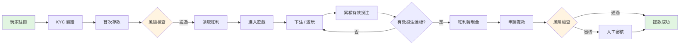

# iGaming 系統總覽

> **Canonical Source**: [00-01_Quickstart.md](../../source-archive/00_Foundation/00-01_Quickstart.md)
> **讀者對象（Audience）**: 架構師、後端工程師、DevOps 工程師
> **業務需求（Business Requirements）**: [Platform_Overview.md](../../requirements/01_Player_Experience/01_Platform_Overview.md)
> **最後同步（Last Synced）**: 2026-02-08

---

## 1. 系統架構總覽

iGaming 平台圍繞五個核心技術子系統構建。本文檔為加入團隊的工程師提供技術快速上手指南。

---

## 2. 錢包與可下注餘額（Wallet and Bettable Balance）

### 2.1 核心公式

```
可下注餘額 = 現金餘額 - 鎖定金額 - 進行中投注
```

### 2.2 關鍵場景

- **下注**：檢查可下注餘額 --> 鎖定資金 --> 扣款
- **遊戲結算**：釋放鎖定 --> 結算輸贏 --> 更新餘額

### 2.3 參考文檔

- SSOT: [02-06 Wallet Architecture -- Playable Balance](../../source-archive/02_Finance_Center/02-06_Wallet_Architecture.md#22-playable-balance-formula)

---

## 3. 有效投注額計算（Turnover Calculation / Valid Bets）

### 3.1 算法

```
有效投注 = 投注金額 × 有效性比例 × 遊戲類型權重

範例：
- 老虎機（Slots）：100% 有效投注
- 百家樂（Baccarat）：95% 有效投注（和局例外）
- 體育博彩（Sports Betting）：僅計算實際風險金額
```

### 3.2 業務整合點

| 整合點 | 有效投注角色 |
|-------------|---------------|
| 優惠活動（Promotions） | 「存款 100，送 50 紅利，20 倍有效投注」→ 需要 3,000 有效投注 |
| VIP 等級（VIP Tiers） | 每月有效投注 >= 100,000 → VIP 升級 |
| AML 檢查 | 存款後必須完成 1 倍有效投注才能提款 |

### 3.3 關鍵場景

- **紅利發放**：玩家領取紅利 --> 綁定有效投注要求
- **VIP 升級**：月末有效投注彙總 --> 計算等級
- **風控檢查**：存款無有效投注後立即提款 --> 拒絕

### 3.4 參考文檔

- SSOT: [03-04 Turnover Calculation -- Valid Bet Algorithm](../../source-archive/03_Game_Center/03-04_Turnover_Calculation.md#有效投注算法)

---

## 4. Token 驗證與 API 安全

### 4.1 Token 驗證流程

```
1. 遊戲供應商（Game Provider, GP）請求 Token（玩家 ID + 時間戳 + 簽名）
2. 平台驗證 HMAC 簽名
3. 檢查 Token 過期時間（5 分鐘 TTL）
4. 檢查 Token 重放（防止重放攻擊）
5. 返回 Token + 玩家餘額
```

### 4.2 冪等性設計（防止重複扣款）

```
每個 GP 請求必須攜帶唯一的 Request ID。
平台使用 Redis + DB + 分布式鎖（三層防護）。

流程：
- 首次 Debit 請求  --> 扣款成功 --> 記錄 Request ID
- 重複 Debit 請求 --> 檢測到已存在的 Request ID --> 返回原始結果
```

### 4.3 三層驗證原理

| 層級 | 目的 | 覆蓋範圍 |
|-------|---------|----------|
| Redis | 快速查找（處理 99% 的情況） | 主要緩存 |
| DB | Redis 不可用時的後備方案 | 持久性保證 |
| 分布式鎖（Distributed Lock） | 極端並發下防止重複扣款 | 競態條件保護 |

這是防禦性編程 -- 即使 Redis 失效，資金安全仍有保證。

### 4.4 SmartAdmin 冪等性實現

```java
@Service
@RequiredArgsConstructor
public class WalletIdempotencyService {

    private final WalletTransactionDao transactionDao;
    private final WalletIdempotencyManager idempotencyManager;
    private final RedisTemplate<String, String> redisTemplate;

    private static final String IDEMPOTENCY_KEY_PREFIX = "wallet:idempotency:";

    /**
     * 使用三層保護檢查冪等性。
     * 如果交易已處理，返回緩存結果。
     */
    public Option<TransactionResult> checkIdempotency(String txId) {
        // Layer 1: Redis 緩存查找（最快）
        String cacheKey = IDEMPOTENCY_KEY_PREFIX + txId;
        String cached = redisTemplate.opsForValue().get(cacheKey);
        if (cached != null) {
            return Option.of(JSON.parseObject(cached, TransactionResult.class));
        }

        // Layer 2: 數據庫查找（後備方案）
        return Option.of(transactionDao.selectByTxId(txId))
            .map(entity -> {
                TransactionResult result = SmartBeanUtil.copy(entity, TransactionResult.class);
                // 為未來查找重新填充緩存
                redisTemplate.opsForValue().set(cacheKey, JSON.toJSONString(result),
                    Duration.ofHours(1));
                return result;
            });
    }

    /**
     * 使用分布式鎖保護處理扣款。
     * 委託給 Manager 層進行事務操作。
     */
    public ResponseDTO<TransactionResult> processDebit(DebitRequestForm form) {
        // 首先檢查冪等性
        Option<TransactionResult> existing = checkIdempotency(form.getTxId());
        if (existing.isDefined()) {
            return ResponseDTO.ok(existing.get());
        }

        // 委託給 Manager 處理帶分布式鎖的事務
        return idempotencyManager.executeDebitWithLock(form);
    }
}
```

### 4.4 參考文檔

- SSOT: [03-03 Seamless Wallet Analysis -- Token Verification](../../source-archive/03_Game_Center/03-03_Seamless_Wallet_Analysis.md#token-驗證流程)

---

## 5. Multi-Tenant 架構與數據隔離

### 5.1 租戶層級（Tenant Hierarchy）

```
層級 1：平台（Platform）
  └─ 層級 2：品牌 / 租戶（Brand / Tenant）
       └─ 層級 3：代理（Agent）
            └─ 層級 4：玩家（Player）
```

### 5.2 數據隔離策略

| 層級 | 隔離方法 | 實現方式 |
|-------|-----------------|----------------|
| 數據庫（Database） | 每個租戶獨立 Schema | PostgreSQL Schema 隔離 |
| 緩存（Cache） | Redis Key 前綴包含租戶 ID | `{tenantId}:{key}` 模式 |
| 應用層（Application） | ThreadLocal 注入租戶上下文 | Request filter 設置上下文 |
| API | JWT Token 包含租戶 ID | Token 驗證提取租戶 |

### 5.3 Multi-Tenant 數據庫架構

```sql
-- 核心租戶管理表
CREATE TABLE t_tenant (
    id              BIGSERIAL PRIMARY KEY,
    tenant_code     VARCHAR(50) NOT NULL UNIQUE,
    tenant_name     VARCHAR(200) NOT NULL,
    schema_name     VARCHAR(100) NOT NULL UNIQUE,
    status          SMALLINT NOT NULL DEFAULT 1,
    config_json     JSONB,
    created_at      TIMESTAMP NOT NULL DEFAULT NOW(),
    updated_at      TIMESTAMP NOT NULL DEFAULT NOW(),
    deleted         BOOLEAN NOT NULL DEFAULT FALSE
);

CREATE INDEX idx_tenant_status ON t_tenant(status) WHERE deleted = FALSE;
CREATE INDEX idx_tenant_code ON t_tenant(tenant_code) WHERE deleted = FALSE;

-- 帶租戶隔離的錢包交易表
CREATE TABLE t_wallet_transaction (
    id              BIGSERIAL PRIMARY KEY,
    tenant_id       BIGINT NOT NULL,
    player_id       BIGINT NOT NULL,
    tx_id           VARCHAR(100) NOT NULL,
    tx_type         VARCHAR(20) NOT NULL,
    amount          DECIMAL(18, 4) NOT NULL,
    balance_before  DECIMAL(18, 4) NOT NULL,
    balance_after   DECIMAL(18, 4) NOT NULL,
    status          SMALLINT NOT NULL DEFAULT 1,
    created_at      TIMESTAMP NOT NULL DEFAULT NOW(),
    CONSTRAINT uk_wallet_tx_id UNIQUE (tenant_id, tx_id)
);

-- 啟用 Row-Level Security 實現租戶隔離
ALTER TABLE t_wallet_transaction ENABLE ROW LEVEL SECURITY;

CREATE POLICY tenant_isolation_policy ON t_wallet_transaction
    USING (tenant_id = current_setting('app.current_tenant')::bigint);

CREATE INDEX idx_wallet_tx_player ON t_wallet_transaction(tenant_id, player_id, created_at DESC);
CREATE INDEX idx_wallet_tx_status ON t_wallet_transaction(tenant_id, status) WHERE status != 1;
```

### 5.3 關鍵場景

- **品牌創建**：創建租戶 --> 初始化 Schema --> 配置遊戲
- **API 調用**：解析 JWT --> 注入租戶上下文 --> 查詢數據（按租戶自動過濾）
- **報表生成**：數據按租戶隔離 --> 每個品牌獨立報表

### 5.4 性能影響

| 組件 | 開銷 | 備註 |
|-----------|----------|-------|
| Schema 隔離 | 可忽略 | PostgreSQL 原生支持 |
| 緩存層 | 可忽略 | Redis Key 前綴成本極小 |
| 應用層 | < 1ms | ThreadLocal 注入 |
| **總開銷** | **< 5%** | 負載測試確認 |

### 5.5 參考文檔

- SSOT: [06-01 Multi-Tenant -- Isolation Strategy](../../source-archive/06_Platform_Governance/06-01_Multi_Tenant.md#隔離策略)

---

## 6. 風控規則引擎（Risk Control Rule Engine）

### 6.1 架構組件

```
規則引擎（Rule Engine）(LiteFlow / Drools)
  ├─ 存款風控：每日存款次數/金額限制
  ├─ 提款風控：KYC 驗證、AML 檢查
  ├─ 投注風控：對沖檢測、異常投注模式
  └─ 優惠風控：紅利濫用檢測

檢查點（Checkpoints）：
- 存款前：頻率檢查 --> 通過/拒絕
- 提款前：有效投注檢查 --> 通過/待審核/拒絕
- 投注時：實時對沖檢測 --> 通過/拒絕
- 優惠領取：資格檢查 --> 通過/拒絕
```

### 6.2 風險評分決策流程

```
觸發檢查 --> 規則引擎計算風險分數 --> 決策
- 低風險  (0-30):  自動批准
- 中風險 (31-70): 人工審核
- 高風險  (71-100): 自動拒絕
```

### 6.3 參考文檔

- SSOT: [05-01 Risk Framework -- Rule Engine](../../source-archive/05_Risk_Control/05-01_Risk_Framework.md#規則引擎)

---

## 7. 端到端玩家旅程（End-to-End Player Journey - Technical Flow）



**核心概念映射到流程**：
1. **錢包（Wallet）** -- 步驟 C（存款）、E（紅利）、J（轉換）、M（提款）
2. **有效投注（Turnover）** -- 步驟 G（投注）、H（累積）、I（閾值檢查）
3. **Token 驗證** -- 步驟 F（進入遊戲）
4. **Multi-Tenant** -- 步驟 A（註冊時分配租戶）
5. **風控（Risk Control）** -- 步驟 D（存款風控）、L（提款風控）

---

## 8. 基於角色的技術閱讀路徑

### 後端工程師（Backend Engineers）

| 優先級 | 主題 | 文檔 |
|----------|-------|----------|
| P0 | 錢包架構 | [02-06 Wallet Architecture](../../source-archive/02_Finance_Center/02-06_Wallet_Architecture.md) |
| P0 | Seamless Wallet API | [03-03 Seamless Wallet Analysis](../../source-archive/03_Game_Center/03-03_Seamless_Wallet_Analysis.md) |
| P0 | 有效投注計算 | [03-04 Turnover Calculation](../../source-archive/03_Game_Center/03-04_Turnover_Calculation.md) |
| P1 | 風控引擎 | [05-01 Risk Framework](../../source-archive/05_Risk_Control/05-01_Risk_Framework.md) |
| P1 | Multi-Tenant 架構 | [06-01 Multi-Tenant](../../source-archive/06_Platform_Governance/06-01_Multi_Tenant.md) |

### 架構師（Architects）

| 優先級 | 主題 | 文檔 |
|----------|-------|----------|
| P0 | 解決方案總覽 | [00-01 Quickstart](../../source-archive/00_Foundation/00-01_Quickstart.md) |
| P0 | Multi-Tenant 架構 | [06-01 Multi-Tenant](../../source-archive/06_Platform_Governance/06-01_Multi_Tenant.md) |
| P0 | 數據安全 | [06-05 Data Security](../../source-archive/06_Platform_Governance/06-05_Data_Security.md) |
| P1 | 部署架構 | [09-01 Deployment](../../source-archive/09_Technical_Infrastructure/09-01_Deployment.md) |
| P1 | API Gateway | [09-02-01 Gateway Core](../../source-archive/09_Technical_Infrastructure/09-02-01_Gateway_Core.md) |

### DevOps 工程師

| 優先級 | 主題 | 文檔 |
|----------|-------|----------|
| P0 | 部署 | [09-01 Deployment](../../source-archive/09_Technical_Infrastructure/09-01_Deployment.md) |
| P0 | 維護 | [09-05 Maintenance](../../source-archive/09_Technical_Infrastructure/09-05_Maintenance.md) |
| P1 | API Gateway 配置 | [09-02-01 Gateway Core](../../source-archive/09_Technical_Infrastructure/09-02-01_Gateway_Core.md) |

### QA 工程師

| 優先級 | 主題 | 文檔 |
|----------|-------|----------|
| P0 | QA 標準 | [09-04 QA Standards](../../source-archive/09_Technical_Infrastructure/09-04_QA_Standards.md) |
| P0 | 錢包邊緣案例 | [03-01 Game Integration Standard](../../source-archive/03_Game_Center/03-01_Game_Integration_Standard.md) |
| P1 | 風控測試場景 | [05-02 Fraud Detection](../../source-archive/05_Risk_Control/05-02_Fraud_Detection.md) |

---

## 9. 上手時間線（Onboarding Timeline）

### Day 1（2 小時）
- 閱讀本總覽（10 分鐘）
- 深入閱讀 5 個核心概念中的 2 個（1 小時）
- 瀏覽業務流程圖（20 分鐘）
- 閱讀您角色的 P0 文檔（30 分鐘）

### Week 1（10 小時）
- 完成所有 5 個核心概念的深度閱讀
- 閱讀業務流程文檔
- 閱讀您角色的所有 P0 + P1 文檔
- 設置並運行本地開發環境

### Month 1（40 小時）
- 閱讀完整的文檔樹
- 實現您的第一個功能模塊
- 參與代碼審查以理解生產代碼
- 成為團隊內的領域專家

---

## 10. 版本歷史

| 版本 | 日期 | 變更 |
|---------|------|---------|
| 2.0.0 | 2026-02-03 | v2 重構 -- 重新設計導航，專注於 5 個核心概念 |
| 1.0.0 | 2026-01-27 | 初始版本 |
