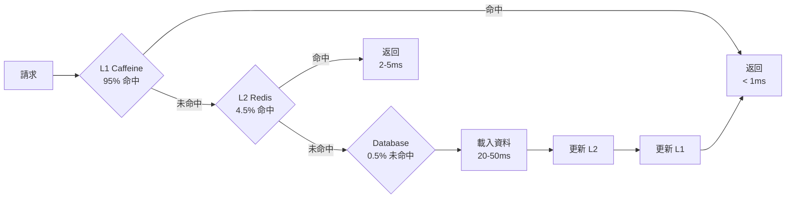
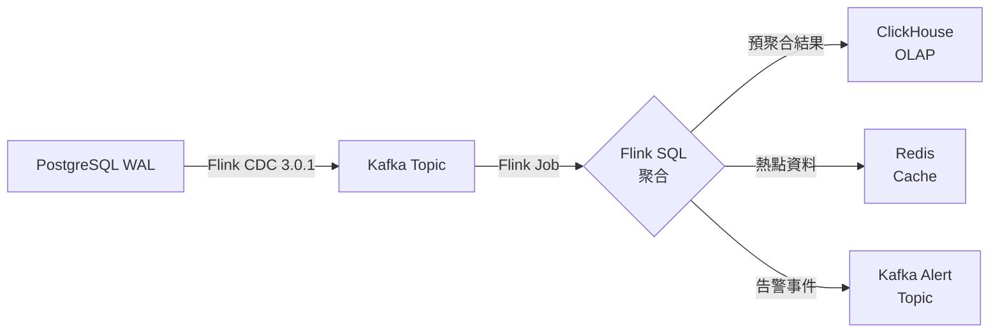

# 技術堆疊（Technology Stack）

> **Canonical Source**: [source-archive/00_Foundation/guides/00-09_Technology_Stack.md](../../source-archive/00_Foundation/guides/00-09_Technology_Stack.md)
> **目標讀者（Audience）**: 架構師、後端開發人員、DevOps 工程師
> **業務需求（Business Requirements）**: [品質保證與測試驗收標準需求](../../requirements/09_Infrastructure_Requirements/01_QA_Standards_Requirements.md) | [容量規劃需求](../../requirements/09_Infrastructure_Requirements/03_Capacity_Planning_Requirements.md)
> **最後同步（Last Synced）**: 2026-02-08

---

## 技術選型原則（Technology Selection Principles）

### 1. 選型決策標準（Selection Decision Criteria）

**強制性要求（Mandatory Requirements）**：
- 性能：支援高並發（10K+ TPS），低延遲（<100ms P95）
- 可擴展性：水平擴展能力，無狀態設計
- 可靠性：99.95%+ 可用性，災難恢復能力
- 安全性：符合 PCI DSS、GDPR、SOC 2 合規要求
- 社群支援：活躍社群，長期維護，充足文檔
- 人才可得性：主流技術，易於招募，學習曲線合理

### 2. 評估維度權重（Evaluation Dimension Weights）

| 維度 | 權重 | 說明 |
|-----------|--------|-------------|
| 性能 | 30% | 吞吐量、延遲、資源效率 |
| 成熟度 | 25% | 生產驗證、穩定性、案例數量 |
| 成本 | 15% | 許可費用、運維成本、人力成本 |
| 生態系統 | 15% | 社群、工具鏈、集成能力 |
| 安全性 | 10% | 漏洞記錄、合規性、審計 |
| 可維護性 | 5% | 程式碼品質、除錯工具、監控 |

### 3. 選型決策流程（Selection Decision Process）

```text
1. 需求分析 -> 2. 候選技術調研 -> 3. POC 驗證 -> 4. 評分決策 -> 5. 架構評審 -> 6. 試點部署
```

---

## 核心技術堆疊總覽（Core Technology Stack Overview）

### 技術架構全景圖（Technology Architecture Full View）

```text
+---------------------------------------------------------+
|                   前端層（Frontend Layer）                 |
|   Web: React 18 + TypeScript + Vite                     |
|   Mobile: React Native 0.73 / Flutter 3.16              |
|   CMS: Next.js 14 (SSR/ISR)                             |
+------------+--------------------------------------------+
             |
+------------v--------------------------------------------+
|                   API Gateway                             |
|   Kong Gateway 3.5 + Rate Limiting + WAF                |
|   NGINX Plus (Backup)                                    |
+------------+--------------------------------------------+
             |
+------------v--------------------------------------------+
|                  後端服務（Backend Services）               |
|   Java 21 (Spring Boot 3.2) - Core Business             |
|   Node.js 20 (Fastify 4) - Real-time Services           |
|   Go 1.22 - High Performance (Risk Engine, Payment GW)  |
|   Python 3.12 (FastAPI) - ML Risk Models                |
+------------+--------------------------------------------+
             |
+------------v--------------------------------------------+
|                  資料與訊息層（Data & Message Layer）       |
|   PostgreSQL 16 (Primary) + Citus (Sharding)            |
|   Redis 7.2 (Cache + Session + Rate Limiting)           |
|   Apache Kafka 3.6 (Event Stream)                       |
|   Elasticsearch 8.11 (Audit Logs + Search)              |
|   ClickHouse 23.12 (OLAP Analytics)                     |
+------------+--------------------------------------------+
             |
+------------v--------------------------------------------+
|              基礎設施與維運（Infrastructure & Operations）   |
|   Kubernetes 1.29 + Helm 3.13                           |
|   Docker 25.0                                            |
|   Terraform 1.7 (IaC)                                    |
|   ArgoCD 2.9 (GitOps)                                    |
|   Prometheus + Grfana (Monitoring)                      |
|   Datadog / New Relic (APM)                              |
+---------------------------------------------------------+
```

---

## 後端技術堆疊（Backend Technology Stack）

### 1. 主要開發語言（Primary Development Languages）

#### Java 21 (LTS) + Spring Boot 3.2 - 推薦

**使用場景（Use Cases）**：
- 核心業務服務（玩家、錢包、交易、活動）
- 複雜業務邏輯（流水計算、對帳系統）
- 高一致性服務

**技術堆疊（Technology Stack）**：
```yaml
Language: Java 21 (LTS until 2029)
Framework: Spring Boot 3.2.x
  - Spring Security 6.2 (Authentication & Authorization)
  - Spring Data JPA 3.2 (ORM)
  - Spring Cloud 2023.0.x (Microservices)
  - Spring Kafka 3.1 (Event-driven)

DI: Spring Framework 6.1
ORM: Hibernate 6.4 + QueryDSL 5.1
API Docs: SpringDoc OpenAPI 2.3
Serialization: Jackson 2.16 + Protobuf 3.25
Validation: Jakarta Validation 3.0
Scheduling: Spring Scheduler + Quartz 2.3
Distributed Lock: Redisson 3.26
```

**選型理由（Selection Rationale）**：
- 成熟生態系統，活躍社群，豐富人才池
- 強型別系統，編譯期檢查，易於重構
- 豐富的企業級特性（事務、安全、快取）
- Spring Boot 自動配置，開箱即用
- Java 21 性能改進（Virtual Threads、G1GC 優化）

**版本要求（Version Requirements）**：
- Java: >= 21 (推薦 21 LTS)
- Spring Boot: >= 3.2.0
- Spring Cloud: >= 2023.0.0

---

#### Node.js 20 LTS + Fastify 4 - 推薦

**使用場景（Use Cases）**：
- 即時通訊服務（WebSocket、SSE）
- 輕量級 API 服務（遊戲大廳、前端 BFF）
- 快速原型開發

**技術堆疊（Technology Stack）**：
```yaml
Runtime: Node.js 20 LTS (until 2026-04)
Framework: Fastify 4.25 (High-performance HTTP)
  - @fastify/websocket (WebSocket support)
  - @fastify/jwt (JWT authentication)
  - @fastify/cors (CORS)
  - @fastify/helmet (Security headers)

ORM: Prisma 5.8 (recommended) / TypeORM 0.3
Cache: ioredis 5.3
Message Queue: kafkajs 2.2
Validation: zod 3.22 / joi 17.12
Testing: Vitest 1.2 + Supertest 6.3
```

**選型理由（Selection Rationale）**：
- 單執行緒非阻塞 I/O，適合高並發
- Fastify 性能超越 Express（3-5 倍）
- 優秀的 TypeScript 支援
- 豐富的 npm 生態系統，開發效率高
- 前後端語言統一，人才共享

**性能基準（Performance Benchmarks）**：
- 吞吐量：~50K req/s（單核）
- 延遲：<10ms P99（簡單查詢）

---

#### Go 1.22 - 推薦

**使用場景（Use Cases）**：
- **高性能元件**：支付閘道、風控引擎
- **低延遲服務**：限流、熔斷、負載均衡
- **系統工具**：資料同步、對帳腳本

**技術堆疊（Technology Stack）**：
```yaml
Language: Go 1.22
Framework: Gin 1.9 / Fiber 2.52
ORM: GORM 1.25 + sqlx 1.3
Cache: go-redis 9.4
Message Queue: confluent-kafka-go 2.3
Config: Viper 1.18
Logging: zap 1.26 + lumberjack 2.2
Testing: testify 1.8
```

**選型理由（Selection Rationale）**：
- 編譯型語言，原生並發（goroutine）
- 記憶體佔用低（< Java/Node.js）
- 啟動快速（<1 秒）
- 簡潔語法，易於維護
- 靜態型別，編譯期檢查

**性能優勢（Performance Advantages）**：
- 啟動時間：~500ms（vs Java 5-10s）
- 記憶體佔用：~50MB（vs Java 200MB+）
- 並發能力：百萬級 goroutine

---

#### Python 3.12 + FastAPI - 專用場景

**使用場景（Use Cases）**：
- **ML 風控模型**：詐欺偵測、異常流水識別
- **資料分析**：BI 報表、資料探勘
- **自動化腳本**：資料遷移、批次處理

**技術堆疊（Technology Stack）**：
```yaml
Language: Python 3.12
Web Framework: FastAPI 0.109
ML Frameworks:
  - scikit-learn 1.4 (Traditional ML)
  - XGBoost 2.0 / LightGBM 4.3 (GBDT)
  - TensorFlow 2.15 / PyTorch 2.2 (Deep Learning)
Data Processing: pandas 2.2 + NumPy 1.26
ORM: SQLAlchemy 2.0
Cache: redis-py 5.0
```

---

### 2. 微服務架構（Microservices Architecture）

#### Spring Cloud 2023.0.x

**核心元件（Core Components）**：
```yaml
Service Registry: Consul 1.17 (recommended) / Eureka 2.0
Config Center: Spring Cloud Config + Consul KV
Service Gateway: Spring Cloud Gateway 4.1
Load Balancing: Spring Cloud LoadBalancer
Circuit Breaking/Rate Limiting: Resilience4j 2.2
Distributed Tracing: Micrometer Tracing + Zipkin 2.24
```

**vs Kubernetes Service Mesh**：

| 維度 | Spring Cloud | Istio Service Mesh |
|-----------|-------------|-------------------|
| 語言綁定 | 僅限 Java | 語言無關 |
| 性能開銷 | 低 | 中等（Sidecar proxy） |
| 學習曲線 | 陡峭 | 更陡峭 |
| 可觀測性 | 良好 | 優秀 |
| 社群 | Java 社群 | CNCF |

**推薦策略（Recommended Strategy）**：
- **Spring Cloud**：純 Java 微服務，團隊熟悉 Spring
- **Istio**：多語言服務，雲原生架構，未來趨勢

---

### 3. API 設計標準（API Design Standards）

#### RESTful API - 主要

**規範（Specifications）**：
- **HTTP Methods**：GET（查詢）、POST（建立）、PUT（替換）、PATCH（部分更新）、DELETE（刪除）
- **路徑命名**：`/api/v1/{resource}`、`/api/v1/{resource}/{id}`
- **版本策略**：URL 版本控制（`/v1/`、`/v2/`）
- **回應格式**：JSON（統一包裝）

**統一回應格式（Unified Response Format）**：
```json
{
  "code": 1000,
  "message": "Success",
  "data": { "..." },
  "timestamp": "2026-01-27T10:00:00Z",
  "trace_id": "abc-123-def"
}
```

#### GraphQL（可選）

**使用場景（Use Cases）**：
- 前端 BFF（Backend for Frontend）
- 複雜關聯查詢（減少過度獲取）
- 行動端 API（減少請求次數）

**技術選型（Technology Selection）**：
- Java: Spring GraphQL 1.2
- Node.js: Apollo Server 4.x

**推薦策略（Recommended Strategy）**：
- **內部 API**：RESTful（標準化，快取友好）
- **行動端 API**：GraphQL（靈活性更高）

---

## 前端技術堆疊（Frontend Technology Stack）

### 1. Web 前端

#### React 18 + TypeScript + Vite - 推薦

**技術堆疊（Technology Stack）**：
```yaml
Language: TypeScript 5.3
Framework: React 18.2
Build Tool: Vite 5.0 (recommended) / Webpack 5.90
State Management: Zustand 4.4 (recommended) / Redux Toolkit 2.0
Routing: React Router 6.21
UI Library:
  - Ant Design 5.12 (Admin Backend)
  - Material-UI 5.15 (Player Frontend)
  - Tailwind CSS 3.4 (Custom UI)
Forms: React Hook Form 7.49 + Zod 3.22
Requests: TanStack Query 5.17 (React Query) + Axios 1.6
SSR Framework: Next.js 14.1 (SEO-friendly)
Testing: Vitest 1.2 + React Testing Library 14.1
```

#### Vue 3（替代方案）

**技術堆疊（Technology Stack）**：
```yaml
Framework: Vue 3.4 + Composition API
Build: Vite 5.0
State Management: Pinia 2.1
Routing: Vue Router 4.2
UI Library: Element Plus 2.5 / Ant Design Vue 4.1
```

---

### 2. 行動端（Mobile）

#### React Native 0.73 - 推薦

**技術堆疊（Technology Stack）**：
```yaml
Framework: React Native 0.73
Language: TypeScript 5.3
Navigation: React Navigation 6.1
State: Zustand 4.4 / Redux Toolkit 2.0
UI Library: React Native Paper 5.12 / NativeBase 3.4
Hot Updates: CodePush (Microsoft)
Build: EAS Build (Expo)
```

#### Flutter 3.16（替代方案）

**技術堆疊（Technology Stack）**：
```yaml
Framework: Flutter 3.16
Language: Dart 3.2
State Management: Riverpod 2.4 / Bloc 8.1
```

**推薦策略（Recommended Strategy）**：
- **React Native**：團隊具備 React 經驗，快速迭代
- **Flutter**：追求極致性能，專職行動端團隊

---

### 3. CMS 管理後台

#### Next.js 14 + React 18 - 推薦

**技術堆疊（Technology Stack）**：
```yaml
Framework: Next.js 14.1 (App Router)
Rendering Strategy:
  - SSR (Server-Side Rendering) - SEO-critical pages
  - ISR (Incremental Static Regeneration) - Content pages
  - CSR (Client-Side Rendering) - Admin backend
Backend: Next.js API Routes / tRPC 10.45
Authentication: NextAuth.js 4.24
Deployment: Vercel / Self-hosted
```

---

## 資料儲存技術（Data Storage Technology）

### 1. 關聯式資料庫（Relational Database）

#### PostgreSQL 16 + Citus - 推薦

**使用場景（Use Cases）**：
- **主資料庫**：玩家、錢包、交易、遊戲
- **OLTP 業務**：高並發讀寫、事務一致性
- **水平擴展**：Citus 分片（單表 >100M 行）

**技術堆疊（Technology Stack）**：
```yaml
Database: PostgreSQL 16.1
Sharding Extension: Citus 12.1 (Distributed PostgreSQL)
Connection Pool: PgBouncer 1.21
Backup: pgBackRest 2.49 + WAL-G 3.0
Monitoring: pg_stat_statements + Prometheus Exporter
High Availability: Patroni 3.2 + etcd 3.5
```

**選型理由（Selection Rationale）**：
- ACID 事務完整性（金融級）
- JSON/JSONB 支援（靈活資料結構）
- 豐富的索引類型（B-Tree、GIN、BRIN）
- 視窗函數、CTE（複雜分析查詢）
- Citus 分片擴展（TB 級資料）
- 開源，活躍社群

**版本要求（Version Requirements）**：
- PostgreSQL: >= 16.0
- Citus: >= 12.0

**vs MySQL 8.0**：

| 維度 | PostgreSQL | MySQL |
|-----------|-----------|-------|
| 事務隔離級別 | 4 級完整支援 | Repeatable Read 預設 |
| JSON 支援 | JSONB 高效 | JSON 原生 |
| 視窗函數 | 完整 | 完整 |
| 分片方案 | Citus | Vitess / ShardingSphere |
| 複製延遲 | 低 | 低 |
| 生態系統 | Java/Python/Go | PHP/Java |

---

### 2. 快取層（Cache Layer）

#### Redis 7.2 - 推薦

**使用場景（Use Cases）**：
- 熱點資料快取（玩家 session、錢包餘額）
- 分散式鎖（Redlock 演算法）
- 限流（Token Bucket、Sliding Window）
- Session 儲存
- 訊息佇列（Stream）
- 排行榜（Sorted Set）

**技術堆疊（Technology Stack）**：
```yaml
Cache: Redis 7.2 (single-thread optimized)
High Availability: Redis Sentinel 7.2 / Redis Cluster
Persistence: AOF (always) + RDB (hourly)
Clients:
  - Java: Redisson 3.26
  - Node.js: ioredis 5.3
  - Go: go-redis 9.4
Monitoring: RedisInsight + Prometheus Exporter
```

**配置建議（Configuration Recommendations）**：
```
# redis.conf
maxmemory: 80% system memory
maxmemory-policy: allkeys-lru
appendonly: yes
appendfsync: everysec
```

#### JetCache 2.7 + Redisson 3.26 - 推薦

**使用場景（Use Cases）**：
- **多級快取**：L1（Caffeine JVM 快取）+ L2（Redis 分散式快取）
- **分散式鎖**：玩家錢包並發更新（取代 `SELECT ... FOR UPDATE`）
- **限流器**：Token Bucket / Sliding Window（API 限流）
- **布隆過濾器**：防止快取穿透（檢查玩家/訂單是否存在）

**技術堆疊（Technology Stack）**：
```yaml
Cache Framework: JetCache 2.7.5
  - Local Cache: Caffeine 3.1.8 (L1)
  - Remote Cache: Lettuce 6.3.0 (Redis L2)
  - Serialization: Kryo 5.5.0 (High-performance)
  - Annotation Support: @Cached, @CacheInvalidate, @CacheUpdate

Distributed Tools: Redisson 3.26.0
  - Distributed Lock: RLock (Watchdog auto-renewal)
  - Rate Limiter: RRateLimiter (Token Bucket)
  - Bloom Filter: RBloomFilter (Guava compatible)
  - Pub/Sub: RTopic (cache invalidation notification)
```

**兩層快取架構（Two-layer Cache Architecture）**：



**JetCache 配置範例（JetCache Configuration Example）**：

```yaml
# application.yml
jetcache:
  statIntervalMinutes: 15
  areaInCacheName: false
  local:
    default:
      type: caffeine
      keyConvertor: fastjson2
      expireAfterWriteInMillis: 100000  # L1 TTL: 100s
      limit: 10000  # Max 10000 entries
  remote:
    default:
      type: redis.lettuce
      keyConvertor: fastjson2
      valueEncoder: kryo
      valueDecoder: kryo
      expireAfterWriteInMillis: 3600000  # L2 TTL: 1h
      uri: redis://redis-master:6379
```

**程式碼範例 - JetCache @Cached 註解（Code Example - JetCache @Cached Annotation）**：

```java
// Service layer using JetCache two-layer cache
@Cached(
    name = "wallet:balance:",
    key = "#tenantId + ':' + #playerId",
    expire = 3600,      // L2 TTL: 1h
    localExpire = 100,  // L1 TTL: 100s
    cacheType = CacheType.BOTH  // L1 + L2 dual-layer cache
)
public Option<WalletBalanceVO> getBalance(
    String tenantId,
    String playerId
) {
    return walletDao.selectById(tenantId, playerId)
        .map(WalletBalanceVO::from);
}

// Cache invalidation when updating balance
@CacheInvalidate(
    name = "wallet:balance:",
    key = "#tenantId + ':' + #playerId"
)
public void updateBalance(
    String tenantId,
    String playerId,
    BigDecimal amount
) {
    walletDao.updateBalance(tenantId, playerId, amount);
}
```

**程式碼範例 - Redisson 分散式鎖（Code Example - Redisson Distributed Lock）**：

```java
// Manager layer using Redisson distributed lock
@Service
@RequiredArgsConstructor
public class WalletManager {
    private final RedissonClient redissonClient;
    private final WalletDao walletDao;

    @Transactional(rollbackFor = Throwable.class)
    public ResponseDTO<Void> deduct(
        String tenantId,
        String playerId,
        BigDecimal amount
    ) {
        String lockKey = "wallet:lock:" + tenantId + ":" + playerId;
        RLock lock = redissonClient.getLock(lockKey);

        try {
            // tryLock: wait 3s, lease 5s, Watchdog auto-renewal
            boolean acquired = lock.tryLock(3, 5, TimeUnit.SECONDS);

            if (!acquired) {
                return ResponseDTO.userErrorParam("Lock acquisition timeout, please retry");
            }

            // Optimistic lock retry (version field)
            int retryCount = 0;
            while (retryCount < 3) {
                Wallet wallet = walletDao.selectById(tenantId, playerId);

                if (wallet.getBalance().compareTo(amount) < 0) {
                    return ResponseDTO.userErrorParam("Insufficient balance");
                }

                int affected = walletDao.updateBalanceWithVersion(
                    tenantId, playerId, amount.negate(), wallet.getVersion()
                );

                if (affected > 0) {
                    return ResponseDTO.ok();
                }

                retryCount++;
                Thread.sleep(20 * retryCount); // Linear backoff
            }

            return ResponseDTO.error(SystemErrorCode.SYSTEM_ERROR, "Concurrent update failed");
        } catch (InterruptedException e) {
            Thread.currentThread().interrupt();
            return ResponseDTO.error(SystemErrorCode.SYSTEM_ERROR, "Operation interrupted");
        } finally {
            if (lock.isHeldByCurrentThread()) {
                lock.unlock();
            }
        }
    }
}
```

**vs Spring Cache / Guava Cache**：

| 維度 | JetCache | Spring Cache | Guava Cache |
|-----------|---------|--------------|-------------|
| 多級快取 | L1+L2 | 單層 | 單層（本地） |
| 註解支援 | @Cached | @Cacheable | 無 |
| 序列化 | Kryo | JSON | Java |
| TTL 控制 | L1/L2 獨立 | 全局 | 統一 |
| 快取預熱 | 支援 | 無 | 無 |
| 監控 | Metrics | 有限 | 無 |
| 分散式鎖 | Redisson | 無 | 無 |

**性能改善資料（Performance Improvement Data）**：

| 指標 | 優化前 | 優化後（JetCache） | 改善幅度 |
|--------|--------------------|------------------|-------------|
| P99 延遲 | 1,240ms | <=200ms | -84% |
| 快取命中率 | 65% | 95% | +30pp |
| Redis QPS | 50,000 | 5,000 | -90%（L1 攔截） |
| 並發 TPS | 87 | >=450 | +418% |

**版本要求（Version Requirements）**：
- JetCache: >= 2.7.0
- Caffeine: >= 3.1.0
- Redisson: >= 3.26.0
- Redis: >= 7.0

---

### 3. 訊息佇列（Message Queue）

#### Apache Kafka 3.6 - 推薦

**使用場景（Use Cases）**：
- **事件驅動架構**：交易事件、遊戲事件
- **資料管道**：CDC（Change Data Capture）
- **審計日誌**：不可變日誌流
- **即時分析**：串流資料處理

**技術堆疊（Technology Stack）**：
```yaml
Message Queue: Apache Kafka 3.6
ZooKeeper Replacement: KRaft mode (recommended)
Schema Registry: Confluent Schema Registry 7.5
Stream Processing: Kafka Streams 3.6 / Apache Flink 1.18
Monitoring: Kafka Exporter + Grafana
Management Tool: Conduktor / Kafka UI
```

**vs RabbitMQ / AWS SQS**：

| 維度 | Kafka | RabbitMQ | AWS SQS |
|-----------|-------|----------|---------|
| 吞吐量 | 極高（百萬/s） | 中等（數萬/s） | 高 |
| 延遲 | <10ms | <5ms | ~100ms |
| 持久化 | 磁碟日誌 | 可選 | 自動 |
| 順序保證 | 分區有序 | 佇列有序 | FIFO 佇列 |
| 回溯消費 | 支援 | 不支援 | 不支援 |
| 維運複雜度 | 高 | 中等 | 低 |

---

### 4. 串流處理引擎（Stream Processing Engine）

#### Apache Flink 1.18 - 推薦

**使用場景（Use Cases）**：
- **即時 OLAP**：代理報表查詢延遲從 5-10s 降至 <1s
- **即時風控**：套利偵測、異常投注頻率偵測（<100ms）
- **CDC 資料管道**：PostgreSQL -> Kafka -> ClickHouse/Redis
- **串流 ETL**：即時資料清洗、轉換、聚合

**技術堆疊（Technology Stack）**：
```yaml
Stream Processing Engine: Apache Flink 1.18.0
CDC: Flink CDC 3.0.1 + Debezium 2.5.0
State Backend: RocksDB + S3 Checkpoint
Stream Processing API:
  - Flink SQL (Declarative stream processing)
  - Flink CEP (Complex Event Processing)
  - DataStream API (Low-level API)
Runtime: Kubernetes FlinkDeployment
Monitoring: Prometheus Metrics Reporter + Grafana
```

**架構範例（Architecture Example）**：



**配置範例 - PostgreSQL CDC 資料表定義（Configuration Example - PostgreSQL CDC Table Definition）**：

```sql
-- Flink SQL: Define CDC Source Table
-- ADR-001 豁免：Flink CDC 來源表（非業務應用表），不適用 t_ 前綴規範
CREATE TABLE player_wallet_cdc (
    tenant_id STRING,
    player_id STRING,
    agent_id STRING,
    balance DECIMAL(20, 2),
    lock_amount DECIMAL(20, 2),
    version BIGINT,
    create_time TIMESTAMP(3),
    update_time TIMESTAMP(3) METADATA FROM 'source.timestamp' VIRTUAL,
    op_type STRING METADATA FROM 'op' VIRTUAL,
    PRIMARY KEY (tenant_id, player_id) NOT ENFORCED
) WITH (
    'connector' = 'postgres-cdc',
    'hostname' = 'postgres-master',
    'port' = '5432',
    'username' = 'cdc_user',
    'password' = '${CDC_PASSWORD}',
    'database-name' = 'igaming',
    'schema-name' = 'public',
    'table-name' = 'player_wallet',
    'slot.name' = 'flink_slot',
    'decoding.plugin.name' = 'pgoutput',
    'debezium.snapshot.mode' = 'initial'
);

-- Real-time agent balance aggregation (5-second window)
CREATE VIEW agent_balance_realtime AS
SELECT
    tenant_id,
    agent_id,
    SUM(balance) as total_balance,
    COUNT(DISTINCT player_id) as player_count,
    TUMBLE_END(update_time, INTERVAL '5' SECOND) as window_end
FROM player_wallet_cdc
WHERE agent_id IS NOT NULL
GROUP BY tenant_id, agent_id, TUMBLE(update_time, INTERVAL '5' SECOND);
```

**vs Spark Streaming / Kafka Streams**：

| 維度 | Flink | Spark Streaming | Kafka Streams |
|-----------|-------|----------------|---------------|
| 處理模型 | 真串流 | 微批次 | 真串流 |
| 延遲 | <100ms | 500ms-1s | <10ms |
| 狀態管理 | RocksDB | In-memory | RocksDB |
| SQL 支援 | 完整 | Spark SQL | KSQL（有限） |
| CEP 支援 | 原生 | 無 | 無 |
| CDC 集成 | Flink CDC | Spark-CDC | Kafka Connect |
| 部署複雜度 | 中等 | 中等 | 低 |
| 社群 | 活躍 | 活躍 | 活躍 |

**推薦策略（Recommended Strategy）**：
- **Flink**：需要 SQL/CEP/複雜狀態管理
- **Kafka Streams**：簡單串流處理，Kafka 生態系統
- **Spark Streaming**：批流一體，現有 Spark 叢集

**性能基準（Performance Benchmarks）**：
- 吞吐量：100,000 事件/s（單 TaskManager）
- 延遲：P99 <100ms（包含 CDC -> ClickHouse 端到端）
- Checkpoint 間隔：60 秒（EXACTLY_ONCE 模式）
- 狀態大小：支援 TB 級狀態（RocksDB + S3）

**成本估算（Cost Estimation）**：
```yaml
Flink Cluster Configuration:
  JobManager: 2 x 4GB (HA) = $80/month
  TaskManager: 4 x 8GB = $472/month
  Total: $552/month

ROI Analysis:
  Cost Increase: $552/month (Flink Cluster)
  Benefits:
    - RDS downgrade 50%: -$600/month (OLAP queries offloaded to ClickHouse)
    - Redis QPS reduction: -$290.4/month (JetCache L1 cache hit rate improvement)
  Net Benefit: $338.4/month (+61% ROI)
```

**版本要求（Version Requirements）**：
- Flink: >= 1.18.0
- Flink CDC: >= 3.0.0
- Debezium: >= 2.5.0
- PostgreSQL: >= 14（支援 WAL 邏輯複製）

---

### 5. 搜尋引擎（Search Engine）

#### Elasticsearch 8.11 - 推薦

**使用場景（Use Cases）**：
- 審計日誌搜尋
- 全文搜尋（遊戲名稱、玩家搜尋）
- 日誌分析（ELK Stack）

**技術堆疊（Technology Stack）**：
```yaml
Search Engine: Elasticsearch 8.11
Log Collection: Logstash 8.11 / Filebeat 8.11
Visualization: Kibana 8.11
Client: Official REST Client
```

**vs OpenSearch**：
- Elasticsearch：商業化更好，功能更完整
- OpenSearch：開源友好，AWS 支援

---

### 6. OLAP 分析（OLAP Analytics）

#### ClickHouse 23.12 - 推薦

**使用場景（Use Cases）**：
- **BI 報表**：玩家行為分析、營收報表
- **即時指標**：DAU/MAU、GGR/NGR
- **資料倉儲**：ODS -> DWD -> DWS -> ADS

**技術堆疊（Technology Stack）**：
```yaml
OLAP Engine: ClickHouse 23.12
Data Synchronization:
  - CDC: Debezium + Kafka Connect
  - ETL: Apache Airflow 2.8
Visualization: Superset 3.0 / Metabase 0.48
```

**vs StarRocks / Apache Druid**：

| 維度 | ClickHouse | StarRocks | Druid |
|-----------|-----------|-----------|-------|
| 查詢性能 | 極致 | 極致 | 快速 |
| 寫入性能 | 高 | 中等 | 高 |
| SQL 相容性 | 高 | 高 | 中等 |
| 學習曲線 | 中等 | 中等 | 陡峭 |
| 社群 | 大 | 中等 | 小 |

---

## 基礎設施技術（Infrastructure Technology）

### 1. 容器化與編排（Containerization & Orchestration）

#### Kubernetes 1.29 + Docker - 推薦

**技術堆疊（Technology Stack）**：
```yaml
Container Runtime: Docker 25.0 / containerd 1.7
Container Orchestration: Kubernetes 1.29
Package Management: Helm 3.13
Service Mesh: Istio 1.20 (optional)
Ingress: NGINX Ingress Controller 1.9
Storage: Rook Ceph 1.13 / Longhorn 1.5
```

**vs VMs / Serverless**：

| 維度 | Kubernetes | VMs | Serverless |
|-----------|-----------|-----|-----------|
| 資源利用率 | 高 | 低 | 極高 |
| 啟動速度 | 快（<10s） | 慢（分鐘） | 極快（<1s） |
| 成本 | 中等 | 高 | 中等 |
| 維運複雜度 | 高 | 中等 | 低 |
| 狀態管理 | 複雜 | 簡單 | 無狀態 |

---

### 2. CI/CD

#### GitLab CI + ArgoCD - 推薦

**技術堆疊（Technology Stack）**：
```yaml
Code Repository: GitLab 16.8 / GitHub Enterprise
CI/CD: GitLab CI 16.8
GitOps: ArgoCD 2.9
Container Registry: Harbor 2.10 (self-hosted) / Docker Hub
Image Scanning: Trivy 0.48
```

**vs Jenkins / GitHub Actions**：

| 維度 | GitLab CI | GitHub Actions | Jenkins |
|-----------|-----------|----------------|---------|
| Config as Code | 是 | 是 | 外掛 |
| K8s 集成 | 原生 | 第三方 | 外掛 |
| 成本 | 開源免費 | 付費 | 開源免費 |
| 學習曲線 | 中等 | 低 | 陡峭 |

---

### 3. 監控與告警（Monitoring & Alerting）

#### Prometheus + Grafana - 推薦

**技術堆疊（Technology Stack）**：
```yaml
Metrics Collection: Prometheus 2.49
Time-series Storage: VictoriaMetrics 1.96 (long-term storage)
Visualization: Grafana 10.3
Alerting: Alertmanager 0.26
Distributed Tracing: Jaeger 1.53 / Tempo 2.3
Logging: Loki 2.9 (lightweight) / Elasticsearch 8.11 (heavy)
APM: Datadog / New Relic (commercial) / SkyWalking 9.7 (open source)
```

---

### 4. 基礎設施即程式碼（Infrastructure as Code，IaC）

#### Terraform 1.7 - 推薦

**技術堆疊（Technology Stack）**：
```yaml
IaC Tool: Terraform 1.7
Configuration Management: Ansible 9.1 (supplementary)
Cloud Providers:
  - AWS: Full support
  - GCP: Full support
  - Azure: Full support
  - Alibaba Cloud: Full support
State Backend: Terraform Cloud / S3 + DynamoDB
```

---

## 安全與合規技術（Security & Compliance Technology）

### 1. 加密技術（Encryption Technology）

**資料加密標準（Data Encryption Standards）**：
```yaml
Transport Encryption: TLS 1.3
Symmetric Encryption: AES-256-GCM
Asymmetric Encryption: RSA-4096 / ECDSA P-256
Key Management: AWS KMS / Azure Key Vault / HashiCorp Vault
Password Hashing: Argon2id (m=65536, t=3, p=4)
Blind Index: HMAC-SHA256
```

---

### 2. 身份認證與授權（Identity Authentication & Authorization）

**技術選型（Technology Selection）**：
```yaml
Authentication Protocol: OAuth 2.0 + OpenID Connect (OIDC)
JWT Signing: RS256 (RSA-SHA256)
MFA: TOTP (Time-based OTP) - RFC 6238
SSO: Keycloak 23.0 / Auth0 (commercial)
RBAC: Custom-built
```

---

### 3. 合規工具（Compliance Tools）

```yaml
Vulnerability Scanning: Trivy 0.48 + SonarQube 10.3
SAST: SonarQube 10.3 Community
DAST: OWASP ZAP 2.14
Dependency Checking: Snyk / Dependabot
Penetration Testing: Burp Suite Professional
Compliance Auditing: Vanta (SOC 2) / Drata (multi-compliance)
```

---

## 第三方整合（Third-Party Integration）

### 1. 支付服務供應商（Payment Service Providers，PSP）

**推薦整合（Recommended Integrations）**：
- **Nuvei**（iGaming 專家）
- **Paysafe**（高風險商戶友好）
- **Adyen**（全球覆蓋）
- **Stripe**（開發者友好）

### 2. 遊戲供應商（Game Providers，GP）

**聚合平台（Aggregation Platforms）**：
- **SOFTSWISS Game Aggregator**（15K+ 遊戲）
- **Hub88**（100+ 供應商）
- **Groove Gaming**（快速整合）

### 3. KYC/AML 服務

**推薦供應商（Recommended Providers）**：
- **Sumsub**（全球覆蓋）
- **iDenfy**（快速驗證）
- **Onfido**（AI 驗證）
- **Persona**（靈活配置）

---

## 版本要求與生命週期（Version Requirements & Lifecycle）

### 最低版本要求（Minimum Version Requirements）

| 技術 | 最低版本 | 推薦版本 | LTS 終止 |
|-----------|----------------|--------------------|---------|
| **後端** | | | |
| Java | 17 | 21 | 2029-09 |
| Spring Boot | 3.0.0 | 3.2.x | - |
| Node.js | 18 | 20 LTS | 2026-04 |
| Go | 1.21 | 1.22 | - |
| Python | 3.10 | 3.12 | 2028-10 |
| **前端** | | | |
| React | 18.0 | 18.2 | - |
| TypeScript | 5.0 | 5.3 | - |
| Next.js | 13 | 14 | - |
| **資料庫** | | | |
| PostgreSQL | 14 | 16 | 2028-11 |
| Redis | 7.0 | 7.2 | - |
| Kafka | 3.0 | 3.6 | - |
| Elasticsearch | 8.0 | 8.11 | - |
| ClickHouse | 23.3 | 23.12 | - |
| **基礎設施** | | | |
| Kubernetes | 1.27 | 1.29 | 2024-12 |
| Docker | 24.0 | 25.0 | - |

### 升級策略（Upgrade Strategy）

**主要版本升級（Major Version Upgrades）**：
- 評估期：1 個月（POC 測試）
- 灰度期：2 個月（生產驗證）
- 全量推廣期：1 個月（全面部署）

**次要版本升級（Minor Version Upgrades）**：
- 季度更新（3 個月）
- 安全補丁立即應用

---

**文件版本（Document Version）**：4.0.0
**維護團隊（Maintenance Team）**：Architecture Team & Platform Team
**下次審查（Next Review）**：2026-04-27（季度審查）
