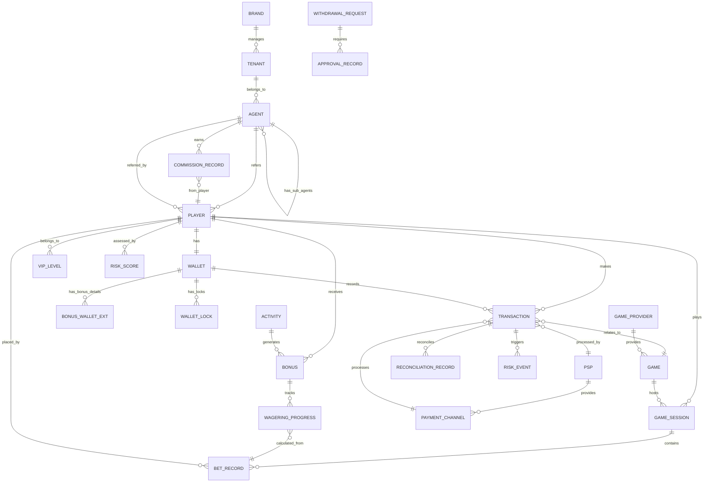
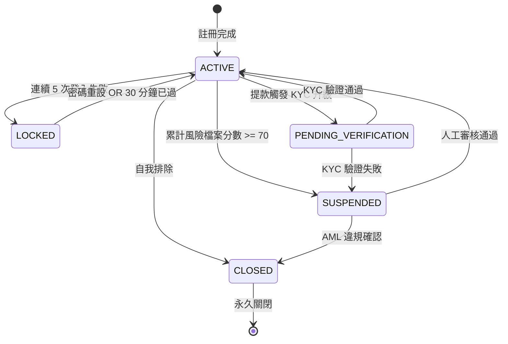
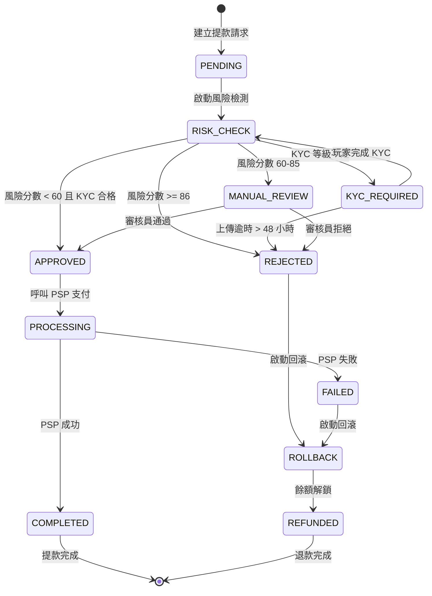
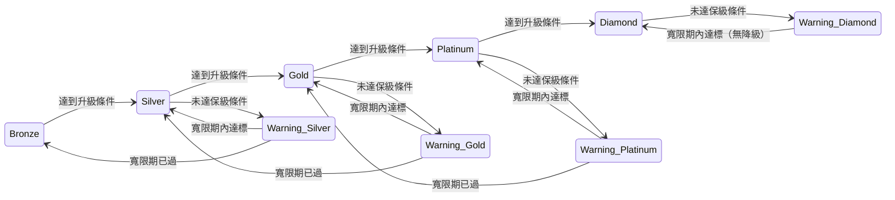

# 資料模型架構（Data Model Architecture）

> **Canonical Source**: [source-archive/00_Foundation/guides/00-10_Data_Model.md](../../source-archive/00_Foundation/guides/00-10_Data_Model.md)
> **目標讀者（Audience）**: 架構師、後端開發人員、DevOps
> **業務需求（Business Requirements）**: N/A（純技術文檔）
> **最後同步（Last Synced）**: 2026-02-08

---

## 1. 實體關係圖（Entity Relationship Diagram）

### 1.1 全域 ER 圖（Global ER Diagram）



---

## 2. 實體分層架構（Entity Layered Architecture）

### 2.1 第一層：多租戶與組織階層（Layer 1: Multi-Tenant & Organization Hierarchy）

```
Super Admin (系統層級)
    +-- Brand (品牌)
        +-- Tenant (租戶/營運商)
            +-- Agent (代理)
                +-- Player (玩家)
```

**核心實體（Core Entities）**:

| 實體（Entity） | 表名（Table Name） | 說明（Description） |
|--------|-----------|-------------|
| Brand | `brands` | 品牌實體 |
| Tenant | `tenants` | 租戶 / 營運商 |
| Agent | `agents` | 代理系統（無限層級巢狀） |
| Player | `players` | 終端玩家 |

### 2.2 第二層：金融核心（Layer 2: Financial Core）

```
Player Wallet (玩家錢包主表 t_wallet)
    +-- CASH (現金錢包)     — 必有，1 筆/玩家
    +-- BONUS (優惠錢包)    — 匯總餘額，0~1 筆/玩家
    +-- CREDIT (信用額度)   — Phase 2+，0~1 筆/玩家
    |
    +-- Bonus Extension (t_wallet_bonus_ext)  — 每筆活動 Bonus 明細
    +-- Wallet Lock (t_wallet_lock)           — 鎖定機制明細（非錢包類型）
```

> **設計決策**：採用「主表 + 擴展表」混合方案。`t_wallet` 統一管理所有錢包類型的 `balance` 和 `locked_amount`，特殊欄位透過擴展表承載。LOCKED 不是錢包類型，而是 CASH 錢包上的「扣住機制」。詳見 → [Financial_Implementation.md §2.1](../02_Finance_Service/04_Financial_Implementation.md)

**核心實體（Core Entities）**:

| 實體（Entity） | 表名（Table Name） | 說明（Description） |
|--------|-----------|-------------|
| Wallet | `t_wallet` | 統一錢包主表（wallet_type: CASH, BONUS, CREDIT） |
| Bonus Wallet Extension | `t_wallet_bonus_ext` | 每筆活動 Bonus 明細（流水要求、過期時間、遊戲限制） |
| Wallet Lock | `t_wallet_lock` | 鎖定機制明細（待結算注單、待審核提款） |
| Transaction | `t_wallet_transaction` | 所有資金流動記錄 |
| Withdrawal Request | `withdrawal_requests` | 提款申請 |
| Deposit Record | `deposit_records` | 存款記錄 |

### 2.3 第三層：遊戲與投注（Layer 3: Game & Betting）

```
Game Provider (遊戲提供商)
    +-- Game (遊戲)
        +-- Game Session (遊戲場次)
            +-- Bet Record (投注記錄)
```

**核心實體（Core Entities）**:

| 實體（Entity） | 表名（Table Name） | 說明（Description） |
|--------|-----------|-------------|
| Game Provider | `game_providers` | 遊戲提供商（GP） |
| Game | `games` | 遊戲目錄 |
| Game Session | `game_sessions` | 遊戲場次 |
| Bet Record | `bet_records` | 投注詳情 |
| Game Round Aggregation | `game_round_aggregation` | 遊戲回合匯總 |

### 2.4 第四層：活動與風險控制（Layer 4: Activity & Risk Control）

**活動系統（Activity System）**:

| 實體（Entity） | 表名（Table Name） | 說明（Description） |
|--------|-----------|-------------|
| Activity | `activities` | 活動配置 |
| Bonus | `bonuses` | 紅利發放記錄 |
| Wagering Progress | `wagering_progress` | 流水進度追蹤 |

**風險控制系統（Risk Control System）**:

| 實體（Entity） | 表名（Table Name） | 說明（Description） |
|--------|-----------|-------------|
| Risk Rule | `risk_rules` | 風險控制規則配置 |
| Risk Score | `risk_scores` | 玩家風險分數 |
| Risk Event | `risk_events` | 風險事件記錄 |
| Approval Workflow | `approval_workflows` | 審批工作流 |

---

## 3. 狀態機設計（State Machine Designs）

### 3.1 玩家帳號狀態機（Player Account State Machine）

> **SSOT**: 完整定義見 [01-01_Player_Lifecycle.md](../../source-archive/01_Player_Center/01-01_Player_Lifecycle.md)

**五狀態定義（Five-State Definition）**:

| 狀態碼（State Code） | 觸發條件（Trigger Condition） | 業務影響（Business Impact） | 恢復路徑（Recovery Path） |
|-----------|------------------|-----------------|---------------|
| `ACTIVE` | 預設狀態 | 無限制 | N/A |
| `LOCKED` | 連續 5 次登入失敗（與 MFA 鎖定獨立） | 登入禁止 30 分鐘 | 密碼重設 OR 自動解鎖 |
| `SUSPENDED` | 累計風險檔案分數 (Cumulative Profile Risk Score) >= 70 | 存款/提款/投注禁止 | 人工審核通過 |
| `PENDING_VERIFICATION` | 提款觸發 KYC 升級 | 提款限額（<$1000） | KYC 驗證通過 |
| `CLOSED` | 自我排除 OR AML 違規 | 所有操作禁止，永久性 | 不可恢復 |

**狀態轉換圖（State Transition Diagram）**:



> **風險分數領域釐清（Risk Score Domain Clarification）**:
> - **累計風險檔案分數 (Cumulative Profile Risk Score)**：由 KYC 狀態、存款模式、投注行為等長期累積，觸發帳號級動作（SUSPENDED）。詳見 → [Risk_System_Architecture.md](../05_Risk_Engine/01_Risk_System_Architecture.md)
> - **單次交易風險分數 (Per-Transaction Risk Score)**：每次提款請求即時評估，觸發訂單級動作（OrderStatus.REVIEWING）。詳見 → [Financial_Implementation.md](../02_Finance_Service/04_Financial_Implementation.md) Section 7.3

**狀態轉換 SQL 範例（State Transition SQL Examples）**:

```sql
-- ACTIVE -> LOCKED (login failure trigger)
UPDATE players
SET account_status = 'LOCKED',
    locked_until = NOW() + INTERVAL '30 MINUTE',
    failed_login_attempts = failed_login_attempts + 1,
    updated_at = NOW()
WHERE player_id = ?
  AND account_status = 'ACTIVE'
  AND failed_login_attempts >= 4;

-- LOCKED -> ACTIVE (auto-unlock)
UPDATE players
SET account_status = 'ACTIVE',
    failed_login_attempts = 0,
    locked_until = NULL,
    updated_at = NOW()
WHERE account_status = 'LOCKED'
  AND locked_until < NOW();
```

### 3.2 提款狀態機（Withdrawal State Machine）

> **SSOT**: 完整 SAGA 定義見 [01-05_Withdrawal_Risk.md](../../source-archive/01_Player_Center/01-05_Withdrawal_Risk.md)

**十狀態定義（Ten-State Definition）**:

| 狀態碼（State Code） | 說明（Description） | 可能轉換（Possible Transitions） | 業務影響（Business Impact） |
|-----------|-------------|---------------------|-----------------|
| `PENDING` | 提款請求已建立 | RISK_CHECK, REJECTED | 餘額鎖定 |
| `RISK_CHECK` | 風險檢測進行中 | KYC_REQUIRED, APPROVED, MANUAL_REVIEW | 即時風險評分 |
| `KYC_REQUIRED` | 需要 KYC 升級 | RISK_CHECK | 等待玩家上傳文件 |
| `MANUAL_REVIEW` | 人工審核 | APPROVED, REJECTED | L1/L2/L3 審核員介入 |
| `APPROVED` | 審核通過 | PROCESSING | 準備支付 |
| `PROCESSING` | PSP 支付進行中 | COMPLETED, FAILED | 呼叫 PSP API |
| `COMPLETED` | 提款成功 | [終態] | 資金已到達 |
| `FAILED` | 提款失敗 | ROLLBACK | PSP 返回失敗 |
| `ROLLBACK` | 餘額回滾進行中 | REFUNDED | 釋放鎖定餘額 |
| `REFUNDED` | 已退款 | [終態] | 餘額解鎖 |
| `REJECTED` | 審核拒絕 | REFUNDED | 風險/人工拒絕 |

> **持久化映射說明（Persistence Mapping）**: `RISK_CHECK`、`KYC_REQUIRED`、`MANUAL_REVIEW` 為業務概念狀態，在 `OrderStatus` 枚舉中統一以 `REVIEWING` 持久化。細分狀態透過 `review_type` 欄位區分。詳見 → [Financial_Implementation.md](../02_Finance_Service/04_Financial_Implementation.md) Section 7.3

**SAGA 編排流程圖（SAGA Orchestration Flow Diagram）**:



**步驟 2.5 延遲風險檢查查詢（Step 2.5 Delayed Risk Check Query）** (v2.1.0):

```sql
-- Check historical risk proposals
SELECT COUNT(*) as pending_proposals
FROM withdrawal_risk_correlations wrc
JOIN withdrawal_requests wr ON wrc.withdrawal_id = wr.id
WHERE wrc.player_id = ?
  AND wrc.time_range_start <= NOW()
  AND wrc.time_range_end >= NOW()
  AND wr.status IN ('MANUAL_REVIEW', 'RISK_CHECK');

-- If pending_proposals > 0, current withdrawal forced into MANUAL_REVIEW
```

### 3.3 VIP 等級狀態機（VIP Tier State Machine）

> **SSOT**: 完整 VIP 系統設計見 [01-06_VIP_Loyalty.md](../../source-archive/01_Player_Center/01-06_VIP_Loyalty.md)

**五層級定義（Five-Tier Definition）**:

| 層級（Tier） | 保級條件（月度）（Retention Condition） | 升級條件（Upgrade Condition） | 警告狀態（Warning State） | 寬限期（Grace Period） |
|------|------------------------------|-------------------|---------------|--------------|
| Bronze | $100 存款 OR $1K 流水 | $1K 存款 OR $10K 流水 | 無 | 無 |
| Silver | $1K 存款 OR $10K 流水 | $5K 存款 OR $50K 流水 | 7 天警告 | 30 天 |
| Gold | $5K 存款 OR $50K 流水 | $20K 存款 OR $200K 流水 | 14 天警告 | 60 天 |
| Platinum | $20K 存款 OR $200K 流水 | $100K 存款 OR $1M 流水 | 21 天警告 | 90 天 |
| Diamond | $100K 存款 OR $1M 流水 | N/A | 30 天警告 | 永久（除非違規） |

**狀態轉換圖（State Transition Diagram）**:



**降級補償配置（Demotion Compensation Configuration）**:

```yaml
demotion_compensation:
  Silver_to_Bronze:
    - One-time $50 cashback
    - 1.5x rakeback multiplier for 7 days

  Gold_to_Silver:
    - One-time $200 cashback
    - 2x rakeback multiplier for 14 days

  Platinum_to_Gold:
    - One-time $1000 cashback
    - 2.5x rakeback multiplier for 21 days
    - VIP account manager contact
```

### 3.4 狀態機設計原則（State Machine Design Principles）

**1. 單向轉換優先（One-Way Transitions Priority）**:
- `CLOSED` 狀態不可恢復
- `COMPLETED` 提款無法取消
- 避免循環轉換（ACTIVE <-> SUSPENDED 需人工介入）

**2. 冪等性保證（Idempotency Guarantee）**:

```java
// State transitions must verify current state
public Result<Void> transitionToLocked(String playerId) {
    return playerDao.findById(playerId)
        .filter(p -> p.getStatus() == AccountStatus.ACTIVE) // Precondition check
        .map(p -> {
            p.setStatus(AccountStatus.LOCKED);
            p.setLockedUntil(LocalDateTime.now().plusMinutes(30));
            playerDao.updateById(p);
            return Result.success();
        })
        .getOrElse(Result.failure("Invalid state transition"));
}
```

**3. 強制審計日誌（Mandatory Audit Logging）**:

```sql
-- All state changes must be recorded
INSERT INTO player_status_audit_log (
    player_id,
    old_status,
    new_status,
    trigger_reason,
    operator_id,
    created_at
) VALUES (?, ?, ?, ?, ?, NOW());
```

**4. 狀態轉換觸發類型（State Transition Trigger Types）**:

| 觸發類型（Trigger Type） | 範例（Example） | 處理方式（Processing Method） |
|-------------|---------|-------------------|
| **時間觸發（Time-based）** | 30 分鐘後自動解鎖 | Cron Job |
| **事件觸發（Event-based）** | 連續 5 次登入失敗 | 即時檢測 |
| **人工觸發（Manual）** | 審核員通過提款 | 審批工作流 |
| **外部觸發（External）** | PSP 返回失敗 | Webhook 回呼 |

---

## 4. 跨模組外鍵關係（Cross-Module Foreign Key Relationships）

### 4.1 主鍵與外鍵約束表（Primary Key & Foreign Key Constraint Table）

| 子表（Child Table） | FK 欄位（FK Field） | 父表（Parent Table） | 關係（Relationship） | 級聯刪除（Cascade Delete） | 說明（Description） |
|-------------------|----------|-------------------|-------------|----------------|-------------|
| **玩家領域（Player Domain）** |
| `players` | `tenant_id` | `tenants` | N:1 | RESTRICT | 玩家屬於租戶 |
| `players` | `agent_id` | `agents` | N:1 | SET NULL | 推薦代理（可空） |
| `players` | `vip_level_id` | `vip_levels` | N:1 | SET NULL | VIP 層級 |
| `t_wallet` | `player_id` | `players` | N:1 | CASCADE | 錢包綁定玩家（每玩家 1~3 筆） |
| `t_wallet_bonus_ext` | `wallet_id` | `t_wallet` | N:1 | CASCADE | BONUS 活動明細 |
| `t_wallet_lock` | `wallet_id` | `t_wallet` | N:1 | CASCADE | 鎖定機制明細 |
| **交易領域（Transaction Domain）** |
| `transactions` | `player_id` | `players` | N:1 | RESTRICT | 交易擁有者 |
| `transactions` | `wallet_id` | `wallets` | N:1 | RESTRICT | 關聯錢包 |
| `transactions` | `game_id` | `games` | N:1 | SET NULL | 遊戲交易（可選） |
| `transactions` | `psp_id` | `psps` | N:1 | SET NULL | 支付服務提供商 |
| **遊戲領域（Game Domain）** |
| `games` | `provider_id` | `game_providers` | N:1 | CASCADE | 遊戲屬於 GP |
| `game_sessions` | `player_id` | `players` | N:1 | RESTRICT | 玩家場次 |
| `game_sessions` | `game_id` | `games` | N:1 | RESTRICT | 遊戲場次 |
| `bet_records` | `session_id` | `game_sessions` | N:1 | CASCADE | 屬於場次 |
| `bet_records` | `player_id` | `players` | N:1 | RESTRICT | 投注玩家 |
| **活動領域（Activity Domain）** |
| `bonuses` | `player_id` | `players` | N:1 | CASCADE | 紅利擁有者 |
| `bonuses` | `activity_id` | `activities` | N:1 | RESTRICT | 活動來源 |
| `wagering_progress` | `bonus_id` | `bonuses` | N:1 | CASCADE | 流水進度追蹤 |
| **代理領域（Agent Domain）** |
| `agents` | `parent_agent_id` | `agents` | N:1 | RESTRICT | 上級代理（自引用） |
| `agents` | `tenant_id` | `tenants` | N:1 | RESTRICT | 所屬租戶 |
| `commission_records` | `agent_id` | `agents` | N:1 | RESTRICT | 佣金擁有者 |
| `commission_records` | `player_id` | `players` | N:1 | RESTRICT | 佣金來源玩家 |
| **風險控制領域（Risk Control Domain）** |
| `risk_scores` | `player_id` | `players` | N:1 | CASCADE | 玩家風險分數 |
| `risk_events` | `transaction_id` | `transactions` | N:1 | CASCADE | 風險事件觸發交易 |
| `withdrawal_requests` | `player_id` | `players` | N:1 | RESTRICT | 提款申請人 |
| `approval_records` | `request_id` | `withdrawal_requests` | N:1 | CASCADE | 審批記錄 |

---

## 5. 核心表設計（Core Table Designs）

### 5.1 玩家表（Player Table）（`players`）

**關鍵欄位說明（Key Field Notes）**:
- `email_blind_index`: HMAC-SHA256 盲索引，用於加密郵箱可查詢
- `password_hash`: Argon2id 演算法，參數 m=65536, t=3, p=4
- `kyc_status`: 支援增強盡職調查（Enhanced Due Diligence, EDD）流程

### 5.2 錢包表（Wallet Table）（`t_wallet`）

**錢包類型（Wallet Types）**:

| wallet_type | 說明 | 記錄數/玩家 | Phase |
|-------------|------|------------|-------|
| `CASH` | 現金錢包 — 真金白銀，可投注、可提款 | 1 筆（必有） | P1 |
| `BONUS` | 優惠錢包 — 匯總餘額，明細在 `t_wallet_bonus_ext` | 0~1 筆 | P1 |
| `CREDIT` | 信用額度 — 代理信用體系，僅限信用模式玩家 | 0~1 筆 | P2+ |

> **LOCKED 不是錢包類型**：凍結資金透過 `t_wallet.locked_amount`（匯總）+ `t_wallet_lock`（明細）的雙軌設計處理，資金始終留在 CASH 錢包中。

**錢包總覽餘額公式（Wallet Overview Balance Formula）**— 用於前台顯示，包含所有錢包類型：

> **SSOT**: 完整計算邏輯見 [02-06_Wallet_Architecture.md](../../source-archive/02_Finance_Center/02-06_Wallet_Architecture.md)

```text
錢包總覽餘額 = 現金 + 紅利 + (信用額度 - 已用信用) - 鎖定餘額
Wallet Overview Balance = Cash + Bonus + (Credit Limit - Credit Used) - Locked Balance
```

> **注意**：此公式為前台顯示用途。即時投注扣款使用不同公式（僅現金錢包），詳見 → [Financial_Implementation.md Section 2.2](../02_Finance_Service/04_Financial_Implementation.md)

**BONUS 匯總機制（Bonus Aggregation）**:
- `t_wallet` 中 BONUS 類型的 `balance` = 所有 ACTIVE 狀態 `t_wallet_bonus_ext.balance` 的加總
- 投注扣款時按擴展表優先順序（先過期的先扣）逐筆扣減，再回寫主表匯總

**並發控制（Concurrency Control）**:
- 使用 `version` 欄位進行樂觀鎖

### 5.3 交易表（Transaction Table）（`transactions`）

所有資金流動均記錄於統一表中。

### 5.4 紅利表（Bonus Table）（`bonuses`）

玩家紅利發放及流水追蹤。

### 5.5 遊戲表（Game Table）（`games`）

遊戲目錄及元資料。

### 5.6 提款請求表（Withdrawal Request Table）（`withdrawal_requests`）

**SAGA 分散式交易流程（SAGA Distributed Transaction Flow）**:

```text
1. 建立提款請求（Pending）
2. 鎖定錢包餘額（Locked）
3. 風險檢測（Risk Check）
4. 多層級審批（L1 -> L2 -> L3）
5. PSP 支付（Processing）
6. 完成/回滾（Completed/Failed）
```

---

## 6. 資料一致性約束（Data Consistency Constraints）

### 6.1 錢包餘額一致性（Wallet Balance Consistency）

所有錢包餘額更新必須原子化，並與交易歷史驗證。

### 6.2 流水計算一致性（Turnover Calculation Consistency）

**三層驗證架構（Three-Layer Validation Architecture）**:

> **SSOT 參考（SSOT References）**:
> - 第一層（風險驗證）（Layer 1 - Risk Validation）: [05-01_Risk_Framework.md](../../source-archive/05_Risk_Control/05-01_Risk_Framework.md)
> - 第二層（金融驗證）（Layer 2 - Finance Validation）: [03-04_Turnover_Calculation.md](../../source-archive/03_Game_Center/03-04_Turnover_Calculation.md)
> - 第三層（活動應用）（Layer 3 - Activity Application）: [04-04_Activity_Bonus.md](../../source-archive/04_Activity_Center/04-04_Activity_Bonus.md)

```text
第一層：風險引擎驗證（即時）
    | BLOCK → 短路回傳（跳過第 2/3 層）
    | PASS → 有效投注標記
第二層：金融層驗證（批次）
    | 流水資料匯總
第三層：活動層應用（觸發）
    | 活動進度更新
```

> **短路行為（Short-Circuit Behavior）**: 第一層（風險驗證）BLOCK 時立即回傳 `is_valid=false`，不執行第二/三層。SSOT 詳見 → [Turnover_Calculation_Architecture.md](../02_Finance_Service/08_Turnover_Architecture.md)

### 6.3 多租戶資料隔離（Multi-Tenant Data Isolation）

**隔離策略（Isolation Strategy）**:

| 策略（Strategy） | 使用情境（Use Case） | 實現方式（Implementation） |
|----------|----------|----------------|
| Schema 分離（Schema Separation） | 大型租戶 | 每租戶獨立資料庫 |
| 行級隔離（Row-Level Isolation） | 中小型租戶 | 共享資料庫 + `tenant_id` 欄位 |
| 混合模式（Hybrid Mode） | 混合工作負載 | 大租戶獨立 DB；小租戶共享 |

---

## 7. 索引策略（Index Strategy）

### 7.1 高頻查詢索引（High-Frequency Query Indexes）

| 表（Table） | 索引名（Index Name） | 欄位（Columns） | 類型（Type） | 目的（Purpose） |
|-------|-----------|---------|------|---------|
| `players` | `idx_tenant_username` | `(tenant_id, username)` | UNIQUE | 租戶內唯一使用者名稱 |
| `players` | `idx_email_blind_index` | `email_blind_index` | BTREE | 郵箱盲索引查詢 |
| `wallets` | `idx_player_updated` | `(player_id, updated_at)` | BTREE | 玩家錢包歷史 |
| `transactions` | `idx_player_type_date` | `(player_id, type, created_at DESC)` | BTREE | 玩家交易記錄 |
| `transactions` | `idx_turnover` | `(is_valid_turnover, player_id, created_at)` | BTREE | 流水計算查詢 |
| `bonuses` | `idx_player_status_expires` | `(player_id, status, expires_at)` | BTREE | 活動紅利查詢 |
| `games` | `idx_provider_category` | `(provider_id, category, status)` | BTREE | 遊戲目錄分類 |
| `withdrawal_requests` | `idx_status_risk_created` | `(status, risk_level, created_at)` | BTREE | 提款審核佇列 |

### 7.2 覆蓋索引（Covering Indexes）

覆蓋索引應用於高頻讀取查詢以避免回表查詢。根據慢查詢日誌的實際查詢模式設計覆蓋索引。

---

## 8. 資料安全與加密（Data Security & Encryption）

### 8.1 加密欄位策略（Encrypted Field Strategy）

| 資料類別（Data Category） | 加密方法（Encryption Method） | 金鑰管理（Key Management） | 查詢策略（Query Strategy） |
|--------------|-------------------|----------------|----------------|
| **個人識別資訊（PII - Personally Identifiable Information）** |
| 郵箱（Email） | AES-256-GCM | KMS（每租戶隔離） | 盲索引查詢 |
| 電話號碼（Phone number） | AES-256-GCM | KMS | 盲索引查詢 |
| 身份證號（ID card number） | AES-256-GCM | KMS | 盲索引查詢 |
| 姓名（Name） | AES-256-GCM | KMS | 不可直接查詢 |
| 地址（Address） | AES-256-GCM | KMS | 不可直接查詢 |
| **金融資訊（Financial Information）** |
| 銀行卡號（Bank card number） | AES-256-GCM | HSM | 代幣化 + 盲索引 |
| CVV | 永不儲存（Never stored） | N/A | 交易時處理 |
| **憑證（Credentials）** |
| 密碼（Password） | Argon2id | 每記錄鹽值 | 雜湊比對 |
| MFA 金鑰（MFA secret） | AES-256-GCM | KMS | 解密後驗證 |

### 8.2 盲索引實現（Blind Index Implementation）

**原理（Principle）**:

```text
盲索引 = HMAC-SHA256(index_key, plaintext_value)
Blind Index = HMAC-SHA256(index_key, plaintext_value)
```

**金鑰輪換策略（Key Rotation Strategy）**:
1. 保留舊金鑰（寬限期）
2. 建立新金鑰
3. 背景批次重新加密
4. 雙金鑰查詢過渡期
5. 淘汰舊金鑰

### 8.3 GDPR 加密粉碎（GDPR Crypto-Shredding）

**資料刪除策略（Data Deletion Strategy）**:

```text
玩家刪除請求
    |
1. 刪除資料加密金鑰（DEK）
    |
2. 標記記錄為「已刪除」
    |
3. 保留交易記錄（監管要求，但 PII 無法解密）
    |
4. 生成合規報告
```

---

## 相關文件（Related Documents）

- [業務邏輯流程（Business Logic Flows）](./05_Business_Logic_Flows.md) - 業務流程架構
- [技術堆疊（Technology Stack）](./03_Technology_Stack.md) - 技術堆疊概覽
- 錢包架構（Wallet Architecture） *(planned)* - 錢包系統設計
- [流水計算邏輯（Turnover Calculation Logic）](../03_Game_Integration/04_Turnover_Calculation_Logic.md) - 流水系統設計
- [風險引擎架構（Risk Engine Architecture）](../05_Risk_Engine/) - 風險控制系統

---

**文件版本（Document Version）**: 4.0.0
**最後更新（Last Updated）**: 2026-02-08
**維護者（Maintainers）**: 架構團隊 & 資料團隊
