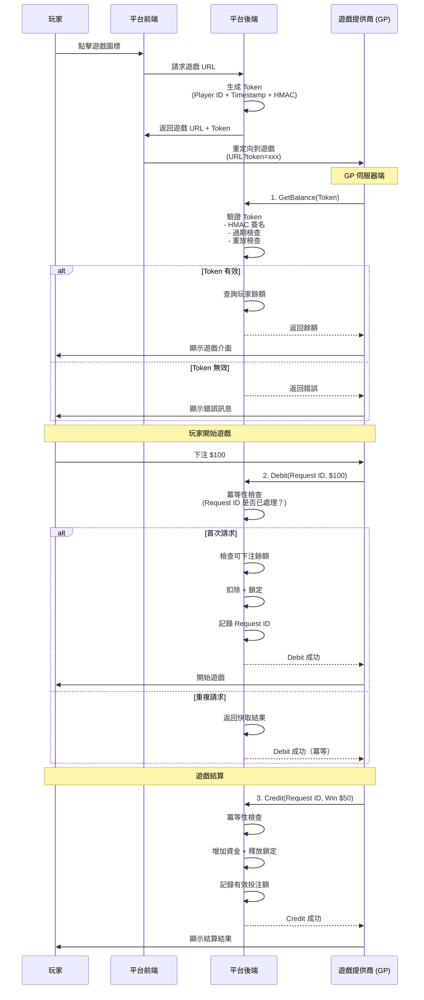
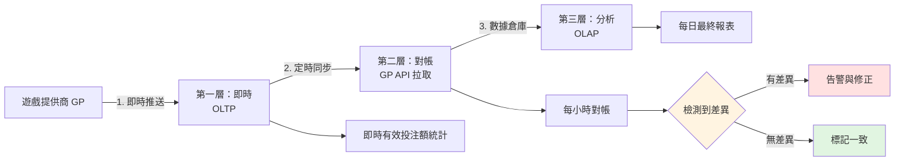
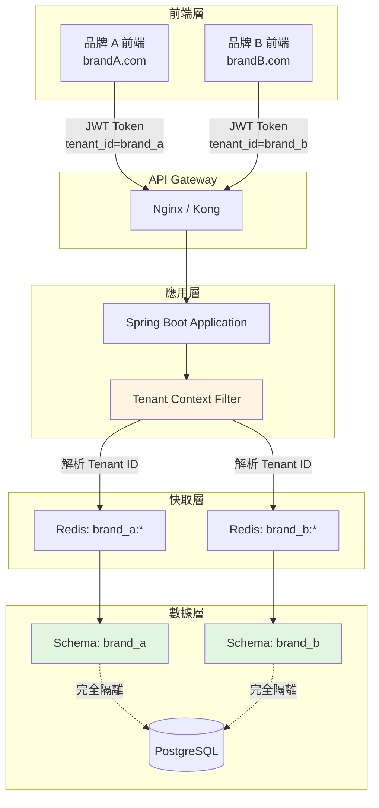

# 業務邏輯流程 -- 技術實現

> **Canonical Source**: [source-archive/00_Foundation/00-02_Business_Flows.md](../../source-archive/00_Foundation/00-02_Business_Flows.md)
> **目標讀者（Audience）**: 架構師、後端開發人員、DevOps 工程師
> **業務需求（Business Requirements）**: [Business_Flows.md](../../requirements/01_Player_Experience/05_Business_Flows.md)
> **最後同步（Last Synced）**: 2026-02-08

---

## 文檔目的

本文檔提供 iGaming 平台中 6 個端到端業務流程的**技術實現細節**。包括程式碼範例、API 規範、資料庫架構、系統交互模式以及架構師和開發人員實現每個流程所需的基礎設施配置。

關於業務規則、政策、用戶旅程和合規要求，請參閱 [Business Flows (Requirements View)](../../requirements/01_Player_Experience/05_Business_Flows.md)。

---

## 目錄

1. [玩家註冊與 KYC -- 技術實現](#1-玩家註冊與-kyc)
2. [遊戲整合與 Token 驗證](#2-遊戲整合與-token-驗證)
3. [優惠引擎與投注追蹤](#3-優惠引擎與投注追蹤)
4. [提款處理與風控引擎](#4-提款處理與風控引擎)
5. [有效投注額計算與對帳流水線](#5-有效投注額計算與對帳流水線)
6. [多租戶數據隔離架構](#6-多租戶數據隔離架構)

---

## 1. 玩家註冊與 KYC

### 1.1 租戶上下文解析

租戶上下文從傳入請求中解析，並在請求生命週期期間注入到 ThreadLocal 中。

```java
// 從域名或子路徑提取
String tenantCode = extractTenantFromRequest(request);
TenantContext.set(tenantCode);

// 或從 JWT Token 提取（已認證用戶）
Claims claims = jwtService.parse(token);
String tenantId = claims.get("tenant_id", String.class);
```

**設計理由**：ThreadLocal 確保每個請求執行緒的租戶隔離。Filter 的 `finally` 區塊必須始終調用 `TenantContext.clear()` 以防止記憶體洩漏。

參考：[Multi-Tenant Architecture](../../source-archive/06_Platform_Governance/06-01_Multi_Tenant.md#tenant-context)

### 1.2 錢包初始化架構

```sql
INSERT INTO t_player_wallet (player_id, tenant_id, cash_balance, bonus_balance, locked_amount)
VALUES (:playerId, :tenantId, 0, 0, 0);
```

**資料表設計注意事項**：
- `cash_balance`：玩家存入的真實貨幣
- `bonus_balance`：來自優惠活動的促銷積分
- `locked_amount`：為待處理提款或進行中投注預留的資金
- 所有貨幣欄位使用 `DECIMAL(18,2)` 以確保精度

參考：[Wallet Architecture](../../source-archive/02_Finance_Center/02-06_Wallet_Architecture.md)

---

## 2. 遊戲整合與 Token 驗證

### 2.1 序列圖



### 2.2 Token 生成

**Token 結構**：
```json
{
  "player_id": "12345",
  "tenant_id": "brand_a",
  "timestamp": 1704287400,
  "expire_at": 1704287700,
  "signature": "HMAC-SHA256(...)"
}
```

**HMAC 簽名計算**：
```java
String data = playerId + "|" + tenantId + "|" + timestamp;
String signature = HmacUtils.hmacSha256Hex(secretKey, data);
```

**安全約束**：
- TTL：5 分鐘
- 一次性使用：Token 在首次使用後標記為已消費
- 可選 IP 綁定：通過 IP 驗證防止 Token 盜用

參考：[Seamless Wallet Analysis](../../source-archive/03_Game_Center/03-03_Seamless_Wallet_Analysis.md#token-verification)

### 2.3 三層冪等性實現

```java
// 第一層：Redis 快速檢查（處理 99% 的情況）
if (redisTemplate.hasKey("request:" + requestId)) {
    return getCachedResult(requestId);
}

// 第二層：資料庫檢查（Redis 未命中/失敗）
Transaction tx = transactionDao.findByRequestId(requestId);
if (tx != null) {
    return tx.getResult();
}

// 第三層：分散式鎖（極端並發情況）
try (DistributedLock lock = redisson.getLock("lock:" + requestId)) {
    lock.lock();
    // 執行 debit 邏輯
}
```

**設計理由**：
- Redis 為常見情況提供亞毫秒級查詢
- 資料庫作為 Redis 不可用時的持久備份
- 分散式鎖（Redisson）處理兩個相同請求在任一持久化之前同時到達的邊緣情況

參考：[Seamless Wallet Analysis](../../source-archive/03_Game_Center/03-03_Seamless_Wallet_Analysis.md#idempotency)

### 2.4 可下注餘額檢查

```java
if (availableBalance < betAmount) {
    throw new InsufficientBalanceException();
}
```

**公式**：`playable_balance = cash_balance - locked_amount - in_progress_bets`

參考：[Wallet Architecture](../../source-archive/02_Finance_Center/02-06_Wallet_Architecture.md#playable-balance)

### 2.5 API 規範

**GetBalance API**：
```http
POST /api/gp/getBalance
Content-Type: application/json

{
  "token": "xxx",
  "player_id": "12345",
  "timestamp": 1704287400,
  "signature": "HMAC-SHA256(...)"
}
```

**回應**：
```json
{
  "code": 0,
  "data": {
    "balance": 700.00,
    "currency": "USD"
  }
}
```

**Debit API**：
```http
POST /api/gp/debit
Content-Type: application/json

{
  "request_id": "uuid-1234",
  "player_id": "12345",
  "amount": 100.00,
  "game_id": "slot_001",
  "round_id": "round_5678"
}
```

參考：[Game Integration Standard](../../source-archive/03_Game_Center/03-01_Game_Integration_Standard.md)

---

## 3. 優惠引擎與投注追蹤

### 3.1 優惠計算邏輯

```java
BigDecimal bonusAmount = depositAmount.multiply(bonusRate);
if (bonusAmount.compareTo(maxBonus) > 0) {
    bonusAmount = maxBonus;
}

BigDecimal wageringRequirement = depositAmount.add(bonusAmount).multiply(multiplier);
```

**關鍵參數**：
- `bonusRate`：存款百分比（例如，0.50 表示 50%）
- `maxBonus`：最大優惠上限（例如，$500）
- `multiplier`：有效投注額倍數（例如，20x）

參考：[Bonus Calculation Engine](../../source-archive/04_Activity_Center/04-02_Bonus_Calculation_Engine.md)

### 3.2 有效投注額累積邏輯

```java
// 每次下注後，更新有效投注額進度
BigDecimal validBet = betAmount.multiply(gameWeight);
wageringProgress = wageringProgress.add(validBet);

// 檢查是否滿足有效投注額要求
if (wageringProgress.compareTo(wageringRequirement) >= 0) {
    convertBonusToCash();
}
```

參考：[Turnover Calculation](../../source-archive/03_Game_Center/03-04_Turnover_Calculation.md)

### 3.3 優惠轉真金（原子交易）

```sql
-- 原子操作
BEGIN;

UPDATE t_player_wallet
SET bonus_balance = bonus_balance - :bonusAmount,
    cash_balance = cash_balance + :bonusAmount
WHERE player_id = :playerId
  AND bonus_balance >= :bonusAmount;

UPDATE t_bonus_record
SET status = 'COMPLETED',
    completed_at = NOW()
WHERE id = :bonusId;

COMMIT;
```

**交易安全性**：
- `WHERE bonus_balance >= :bonusAmount` 子句防止負餘額
- 兩個更新必須原子性成功（包裹在單一交易中）
- Manager 層處理 `@Transactional(rollbackFor = Throwable.class)`，符合 SmartAdmin 架構規則

參考：[Activity Bonus](../../source-archive/04_Activity_Center/04-04_Activity_Bonus.md)

---

## 4. 提款處理與風控引擎

### 4.1 資金鎖定實現

```sql
UPDATE t_player_wallet
SET locked_amount = locked_amount + :withdrawAmount
WHERE player_id = :playerId
  AND (cash_balance - locked_amount) >= :withdrawAmount;
```

**設計注意事項**：
- `WHERE` 子句確保原子性檢查並鎖定（無競爭條件）
- 如果可下注餘額不足，UPDATE 影響 0 行，應用程式返回錯誤

參考：[Wallet Architecture](../../source-archive/02_Finance_Center/02-06_Wallet_Architecture.md#fund-locking)

### 4.2 多層風控引擎實現

```java
RiskScore riskScore = new RiskScore();

// 第一層：KYC 檢查
if (!player.isKycVerified()) {
    return RiskDecision.REJECT("KYC_NOT_VERIFIED");
}

// 第二層：有效投注額檢查
BigDecimal requiredTurnover = player.getDeposits().multiply(BigDecimal.ONE); // 1x turnover
if (player.getTurnover().compareTo(requiredTurnover) < 0) {
    return RiskDecision.REJECT("TURNOVER_NOT_MET");
}

// 第三層：頻率檢查
int withdrawCountToday = withdrawalDao.countToday(playerId);
if (withdrawCountToday > 3) {
    riskScore.add(30, "HIGH_FREQUENCY");
}

// 第四層：金額檢查
if (withdrawAmount.compareTo(player.getTotalDeposits().multiply(BigDecimal.valueOf(3))) > 0) {
    riskScore.add(40, "LARGE_AMOUNT");
}

// 第五層：行為檢查
if (player.hasOnlyBonusPlay()) {
    riskScore.add(50, "BONUS_ABUSE");
}

// 決策
if (riskScore.getTotal() <= 30) {
    return RiskDecision.AUTO_APPROVE();
} else if (riskScore.getTotal() <= 70) {
    return RiskDecision.MANUAL_REVIEW();
} else {
    return RiskDecision.REJECT("HIGH_RISK");
}
```

參考：[Risk Framework](../../source-archive/05_Risk_Control/05-01_Risk_Framework.md)

### 4.3 SAGA 補償交易

```java
@Transactional(rollbackFor = Throwable.class)
public void processWithdrawal(WithdrawalRequest request) {
    try {
        // 步驟 1：創建訂單
        Withdrawal withdrawal = createWithdrawal(request);

        // 步驟 2：鎖定資金
        walletService.lockFunds(playerId, amount);

        // 步驟 3：調用支付閘道
        PaymentResult result = paymentGateway.withdraw(withdrawal);

        if (!result.isSuccess()) {
            // 補償：釋放鎖定
            walletService.unlockFunds(playerId, amount);
            throw new WithdrawalFailedException();
        }

        // 步驟 4：扣除餘額
        walletService.deductBalance(playerId, amount);

    } catch (Exception e) {
        // 觸發補償交易
        compensate(withdrawal);
        throw e;
    }
}
```

**SAGA 流程**：
```
正向：創建訂單 -> 鎖定資金 -> 調用支付 -> 扣除餘額
補償：刪除訂單 <- 釋放鎖定 <- 取消支付 <- 回滾餘額
```

**架構注意事項**：根據 SmartAdmin 規則，`@Transactional` 必須放置在 Manager 層，而非 Service 層。上述程式碼應位於 `WithdrawalManager` 類別中。

參考：[Withdrawal Risk](../../source-archive/01_Player_Center/01-05_Withdrawal_Risk.md#saga-compensation)

---

## 5. 有效投注額計算與對帳流水線

### 5.1 三層架構圖



### 5.2 第一層：OLTP 架構

```sql
CREATE TABLE t_player_bet (
    id BIGINT PRIMARY KEY,
    player_id BIGINT,
    game_id VARCHAR(50),
    round_id VARCHAR(100),
    bet_amount DECIMAL(18,2),
    valid_bet DECIMAL(18,2),  -- 有效投注（風控篩選後）
    win_amount DECIMAL(18,2),
    bet_time TIMESTAMP,
    settle_time TIMESTAMP
);
```

**即時有效投注額查詢**：
```sql
-- 玩家的每日有效投注額
SELECT SUM(valid_bet)
FROM t_player_bet
WHERE player_id = ?
  AND DATE(bet_time) = CURRENT_DATE;
```

### 5.3 第二層：對帳引擎

```java
// 1. 從 GP API 拉取數據
List<GPBetRecord> gpRecords = gpApi.getBets(startTime, endTime);

// 2. 與本地數據比較
for (GPBetRecord gpRecord : gpRecords) {
    LocalBetRecord localRecord = betDao.findByRoundId(gpRecord.getRoundId());

    if (localRecord == null) {
        // 差異 1：缺少本地記錄
        alerts.add("MISSING_LOCAL:" + gpRecord.getRoundId());
        supplementRecord(gpRecord);
    } else if (!localRecord.getValidBet().equals(gpRecord.getValidBet())) {
        // 差異 2：金額不匹配
        alerts.add("AMOUNT_MISMATCH:" + gpRecord.getRoundId());
        correctRecord(localRecord, gpRecord);
    }
}

// 3. 檢查多餘的本地記錄
List<LocalBetRecord> extraLocal = betDao.findNotInGP(gpRecords);
if (!extraLocal.isEmpty()) {
    alerts.add("EXTRA_LOCAL:" + extraLocal.size());
}
```

**對帳優先級**：GP 數據是權威來源。當發現差異時，本地記錄會修正以匹配 GP。

### 5.4 第三層：OLAP 數據倉庫架構

```sql
-- DWD 明細層
CREATE TABLE dwd_player_bet (
    -- 與 OLTP 相同，但添加了維度
    tenant_id BIGINT,
    brand_name VARCHAR(50),
    game_type VARCHAR(20),
    is_bonus_play BOOLEAN,
    ...
) PARTITION BY RANGE (bet_time);

-- DWS 匯總層
CREATE TABLE dws_player_turnover_daily (
    player_id BIGINT,
    stat_date DATE,
    total_bet DECIMAL(18,2),
    total_valid_bet DECIMAL(18,2),
    total_win DECIMAL(18,2),
    PRIMARY KEY (player_id, stat_date)
);
```

**每日報表生成**（在凌晨 2:00 運行）：
```sql
INSERT INTO dws_player_turnover_daily
SELECT
    player_id,
    DATE(bet_time) as stat_date,
    SUM(bet_amount) as total_bet,
    SUM(valid_bet) as total_valid_bet,
    SUM(win_amount) as total_win
FROM dwd_player_bet
WHERE DATE(bet_time) = CURRENT_DATE - INTERVAL 1 DAY
GROUP BY player_id, DATE(bet_time);
```

關於詳細的有效投注額計算流程圖，請參閱 [Turnover Flowcharts](../02_Finance_Service/09_Turnover_Implementation.md)。

---

## 6. 多租戶數據隔離架構

### 6.1 架構圖



### 6.2 租戶上下文 Filter 實現

```java
@Component
public class TenantContextFilter implements Filter {

    @Override
    public void doFilter(ServletRequest request, ServletResponse response, FilterChain chain) {
        try {
            // 1. 從 JWT Token 解析 Tenant ID
            String token = extractToken(request);
            Claims claims = jwtService.parse(token);
            String tenantId = claims.get("tenant_id", String.class);

            // 2. 注入到 ThreadLocal
            TenantContext.set(tenantId);

            // 3. 繼續處理請求
            chain.doFilter(request, response);

        } finally {
            // 4. 清理 ThreadLocal（防止記憶體洩漏）
            TenantContext.clear();
        }
    }
}
```

### 6.3 TenantContext ThreadLocal 實現

```java
public class TenantContext {
    private static final ThreadLocal<String> TENANT_ID = new ThreadLocal<>();

    public static void set(String tenantId) {
        TENANT_ID.set(tenantId);
    }

    public static String get() {
        String tenantId = TENANT_ID.get();
        if (tenantId == null) {
            throw new TenantNotFoundException("Tenant context not set");
        }
        return tenantId;
    }

    public static void clear() {
        TENANT_ID.remove();
    }
}
```

**重要提示**：使用 Virtual Threads（Java 21）時，考慮使用 `ScopedValue` 而非 `ThreadLocal`，以避免虛擬執行緒池的執行緒本地繼承問題。

### 6.4 MyBatis Schema Interceptor

```java
@Intercepts({
    @Signature(type = Executor.class, method = "update", args = {MappedStatement.class, Object.class}),
    @Signature(type = Executor.class, method = "query", args = {MappedStatement.class, Object.class, RowBounds.class, ResultHandler.class})
})
public class TenantSchemaInterceptor implements Interceptor {

    @Override
    public Object intercept(Invocation invocation) throws Throwable {
        // 1. 獲取 Tenant ID
        String tenantId = TenantContext.get();

        // 2. 動態切換 schema
        String schemaName = "tenant_" + tenantId;
        Connection conn = getConnection(invocation);
        conn.createStatement().execute("SET search_path TO " + schemaName);

        // 3. 執行 SQL
        return invocation.proceed();
    }
}
```

**SQL 自動重寫範例**：
```sql
-- 原始 SQL
SELECT * FROM t_player WHERE id = ?

-- 自動重寫為
SET search_path TO tenant_brand_a;
SELECT * FROM t_player WHERE id = ?
```

**安全注意事項**：`schemaName` 必須針對已知租戶的白名單進行驗證，以防止通過操縱租戶 ID 進行 SQL 注入。

### 6.5 Redis Key 前綴隔離

```java
public class RedisKeyBuilder {
    public static String buildKey(String module, String key) {
        String tenantId = TenantContext.get();
        return String.format("%s:%s:%s", tenantId, module, key);
    }
}

// 使用範例
String key = RedisKeyBuilder.buildKey("player", "wallet:" + playerId);
// 結果："brand_a:player:wallet:12345"
```

**優點**：
- 防止共享 Redis 中租戶之間的數據衝突
- 支援按租戶快取清除（`DEL brand_a:*`）
- 支援按租戶快取監控和指標

### 6.6 JWT Token 生成

```java
public String generateToken(Player player) {
    return Jwts.builder()
        .setSubject(player.getId().toString())
        .claim("tenant_id", player.getTenantId())  // 關鍵：注入 Tenant ID
        .claim("roles", player.getRoles())
        .setIssuedAt(new Date())
        .setExpiration(new Date(System.currentTimeMillis() + 86400000))  // 24 小時
        .signWith(secretKey)
        .compact();
}
```

### 6.7 跨租戶訪問防護

```java
@Service
public class PlayerService {

    public Player getPlayer(Long playerId) {
        Player player = playerDao.findById(playerId);

        // 關鍵檢查：驗證玩家屬於當前租戶
        if (!player.getTenantId().equals(TenantContext.get())) {
            throw new AccessDeniedException("Cross-tenant access not allowed");
        }

        return player;
    }
}
```

### 6.8 租戶隔離測試

```java
@Test
public void testTenantIsolation() {
    // 1. 品牌 A 創建玩家
    TenantContext.set("brand_a");
    Player playerA = playerService.createPlayer("Alice");

    // 2. 品牌 B 嘗試訪問品牌 A 的玩家
    TenantContext.set("brand_b");
    assertThrows(AccessDeniedException.class, () -> {
        playerService.getPlayer(playerA.getId());
    });
}
```

**測試覆蓋率要求**：
- 應用層必須阻止跨租戶數據訪問
- 必須獨立驗證資料庫 schema 隔離
- 必須驗證 Redis key 隔離（租戶之間無 key 洩漏）

---

## 交叉引用索引

| 流程 | Requirements 文檔 | Architecture 文檔 |
|------|-----------------|-----------------|
| 玩家註冊與 KYC | [Business_Flows.md Section 1](../../requirements/01_Player_Experience/05_Business_Flows.md#1-player-registration-and-kyc) | 本文檔，第 1 節 |
| 遊戲整合與 Token | [Business_Flows.md Section 2](../../requirements/01_Player_Experience/05_Business_Flows.md#2-game-launch-and-token-verification) | 本文檔，第 2 節 |
| 優惠與有效投注額 | [Business_Flows.md Section 3](../../requirements/01_Player_Experience/05_Business_Flows.md#3-bonus-distribution-and-wagering-requirements) | 本文檔，第 3 節 |
| 提款與風控 | [Business_Flows.md Section 4](../../requirements/01_Player_Experience/05_Business_Flows.md#4-withdrawal-review-and-risk-control) | 本文檔，第 4 節 |
| 有效投注額與對帳 | [Business_Flows.md Section 5](../../requirements/01_Player_Experience/05_Business_Flows.md#5-turnover-calculation-and-reconciliation) | 本文檔，第 5 節 |
| 多租戶隔離 | [Business_Flows.md Section 6](../../requirements/01_Player_Experience/05_Business_Flows.md#6-multi-tenant-data-isolation) | 本文檔，第 6 節 |

---

**Document Version**: 4.0.0
**Created**: 2026-02-03
**Maintained by**: Architecture Team
