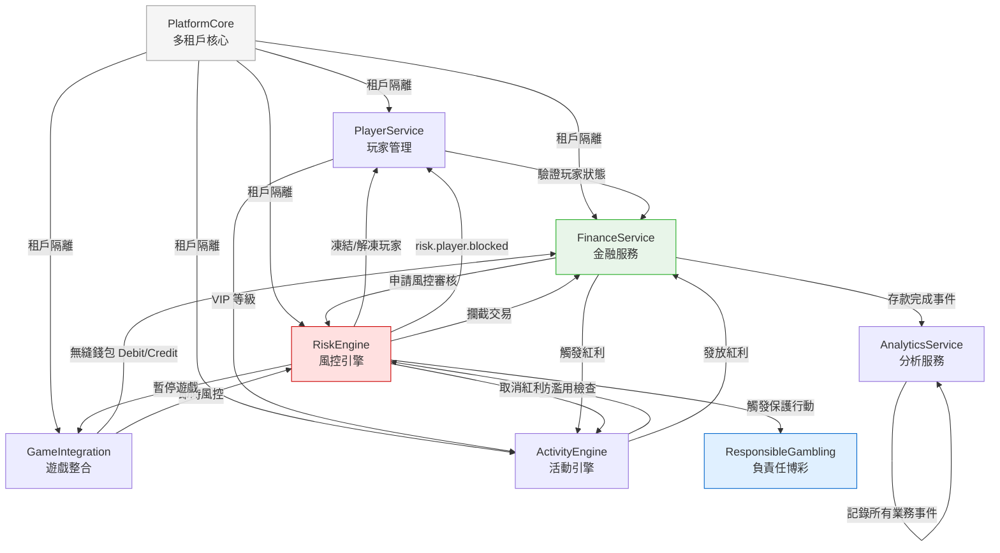

# 跨模組整合指南（Cross-Module Integration Guide）

> **受眾**: 系統架構師、資深工程師
> **目的**: 描述各核心服務之間的互動方式、事件流和依賴關係
> **XREF**:
> - 系統整體架構 → [01_System_Overview.md](01_System_Overview.md)
> - 業務邏輯流程 → [05_Business_Logic_Flows.md](05_Business_Logic_Flows.md)
> **最後更新**: 2026-03-31

---

## 系統模組整合概覽



---

## 1. 模組依賴矩陣

| 調用方 → 被調用方 | Player | Finance | Game | Activity | Risk | Platform |
|-----------------|--------|---------|------|----------|------|---------|
| **Player Service** | — | 查詢餘額 | — | VIP 等級 | 觸發 KYC | 租戶隔離 |
| **Finance Service** | 驗證玩家狀態 | — | 查遊戲配置 | 觸發紅利 | 申請風控審核 | 租戶隔離 |
| **Game Integration** | 驗證 Session | 無縫錢包調用 | — | 觸發有效投注 | 即時風控 | 租戶隔離 |
| **Activity Engine** | 查 VIP 等級 | 發放紅利 | 遊戲權重 | — | 防濫用檢查 | 租戶隔離 |
| **Risk Engine** | 凍結/解凍玩家 | 攔截交易 | 暫停遊戲 | 取消紅利 | — | 租戶隔離 |

---

## 2. 核心整合流程

### 2.1 玩家存款完整流程

```
Player →[1]→ Finance Service（存款請求）
  →[2]→ Risk Engine（風控審核：AML、限額、欺詐評分）
  ←[3]← Risk Engine（審核結果：APPROVED / REVIEW / REJECTED）
  →[4]→ PSP（支付執行）
  ←[5]← PSP（支付結果）
  →[6]→ Player Wallet（餘額更新）
  →[7]→ Activity Engine（檢查是否觸發存款紅利）
  →[8]→ Analytics Service（記錄存款事件）
  →[9]→ Notification（發送存款確認通知）
```

**關鍵規則**：
- 步驟 [2] 是同步調用，超時 2 秒降級為 REVIEW（不阻塞玩家）
- 步驟 [7] 是非同步（Kafka 事件），不影響存款主流程
- 如果步驟 [3] = REJECTED，步驟 [4-9] 全部跳過

> **XREF**: 存款業務規則 → [requirements/02_Financial_Operations/02_Financial_Implementation_Requirements.md](../../requirements/02_Financial_Operations/02_Financial_Implementation_Requirements.md)

---

### 2.2 遊戲投注完整流程（無縫錢包）

```
Player →[1]→ Game Provider（發起投注）
  →[2]→ Game Integration Service（接收 GP 回調）
  →[3]→ Finance Service（無縫錢包 Debit）
    →[3a]→ Risk Engine（即時風控：投注額異常、機器人檢測）
    →[3b]→ Player Wallet（鎖定並扣款）
  ←[4]← Finance Service（Debit 結果）
  →[5]→ Game Provider（確認投注）
  →[6]→ Finance Service（派彩 Credit）
    →[6a]→ Player Wallet（入帳）
    →[6b]→ Activity Engine（更新有效投注額）
  →[7]→ Analytics Service（記錄遊戲事件）
```

**無縫錢包關鍵規則**：
- 步驟 [3b] 必須使用 `SELECT FOR UPDATE` 加鎖（避免超額扣款）
- 步驟 [3a] 超時 500ms 降級，記錄風險事件但不阻塞遊戲
- 步驟 [6b] 通過 Kafka 異步，有效投注額計算延遲可達 30 秒

> **XREF**: 無縫錢包技術實作 → [../02_Finance_Service/03_Seamless_Wallet_Technical.md](../02_Finance_Service/03_Seamless_Wallet_Technical.md)

---

### 2.3 紅利發放完整流程

```
Trigger（存款/投注事件）
  →[1]→ Activity Engine（規則引擎評估：LiteFlow）
    →[1a]→ Player Service（查 KYC 等級、VIP 等級）
    →[1b]→ Risk Engine（防濫用檢查：多帳號、配對投注）
    →[1c]→ Finance Service（查歷史紅利：防重複發放）
  ←[2]← Activity Engine（評估結果：ELIGIBLE / INELIGIBLE）
  →[3]→ Finance Service（紅利入帳 - @Transactional(SERIALIZABLE)）
  →[4]→ Player Service（更新紅利活躍狀態）
  →[5]→ Analytics Service（記錄紅利事件）
  →[6]→ Notification（發送紅利通知）
```

**紅利幂等性**：步驟 [3] 必須有 `idempotency_key`（`{playerId}_{bonusId}_{triggerEventId}`）

> **XREF**: 紅利計算架構 → [../04_Activity_Engine/01_Bonus_Calculation_Engine.md](../04_Activity_Engine/01_Bonus_Calculation_Engine.md)

---

### 2.4 提款風控審核流程

```
Player →[1]→ Finance Service（提款申請）
  →[2]→ Risk Engine（LiteFlow 風控：KYC 檢查、流水達標、限額）
  ←[3]← Risk Engine（結果）
    ├── AUTO_APPROVE（低風險）→[4a]→ PSP 執行（異步）
    ├── MANUAL_REVIEW（中風險）→[4b]→ 人工審核隊列（async risk proposal）
    └── AUTO_REJECT（高風險）→[4c]→ 通知玩家 + 記錄
  →[5]→ Activity Engine（檢查流水達標狀態）
```

> **XREF**: 風控提案系統 → [../05_Risk_Engine/07_Risk_Proposal_Implementation.md](../05_Risk_Engine/07_Risk_Proposal_Implementation.md)

---

### 2.5 風控封鎖玩家流程

```
Risk Engine（觸發：欺詐評分 > 90 / 人工決策）
  →[1]→ Player Service（更新玩家狀態 → SUSPENDED）
  →[2]→ Finance Service（凍結全部待處理交易）
  →[3]→ Game Integration（終止活躍遊戲 Session）
  →[4]→ Activity Engine（暫停所有活躍紅利）
  →[5]→ Notification（發送帳號暫停通知）
  →[6]→ Analytics Service（記錄封鎖事件 + 操作員）
```

**注意**：玩家封鎖是**最高優先級**操作，各模組必須在 3 秒內完成。

---

## 3. 事件主題（Kafka Topics）

| 事件 | 發布者 | 訂閱者 | 重試策略 |
|------|--------|--------|---------|
| `player.registered` | Player Service | Activity, Risk, Analytics | 3 次重試，30s 退避 |
| `player.kyc.verified` | Risk Engine | Finance, Activity | 3 次重試 |
| `deposit.completed` | Finance Service | Activity, Analytics, Notification | 5 次重試 |
| `withdrawal.requested` | Finance Service | Risk Engine | 同步（不使用 Kafka） |
| `game.bet.settled` | Game Integration | Activity（有效投注額），Analytics | 5 次重試，批量 |
| `bonus.awarded` | Activity Engine | Finance, Analytics, Notification | 3 次重試 |
| `risk.player.blocked` | Risk Engine | Player, Finance, Game, Activity | **最高優先級**，不重試，改為告警 |
| `turnover.reached` | Activity Engine | Finance（解除流水鎖） | 3 次重試 |

---

## 4. 跨模組共識規則

### 4.1 多租戶隔離

所有跨模組調用（REST API 和 Kafka 事件）必須攜帶 `tenantId`。
- REST API：`X-Tenant-ID` Header
- Kafka：事件 payload 的 `tenantId` 字段
- 不允許跨租戶查詢（ArchUnit 規則強制）

### 4.2 冪等性要求

下列操作必須具備冪等性（`idempotency_key` 設計）：

| 操作 | 幂等鍵格式 |
|------|----------|
| 存款入帳 | `{tenantId}_{txnId}_{pspRef}` |
| 無縫錢包 Debit/Credit | `{tenantId}_{roundId}_{betId}` |
| 紅利發放 | `{tenantId}_{playerId}_{bonusId}_{eventId}` |
| 提款出帳 | `{tenantId}_{withdrawalId}_{pspRef}` |

> **XREF**: 三層冪等設計 → [../adr/ADR-015_Idempotency_Three_Layer_Defense.md](../adr/ADR-015_Idempotency_Three_Layer_Defense.md)

### 4.3 降級策略（Circuit Breaker）

| 服務 | 降級觸發條件 | 降級行為 |
|------|-----------|---------|
| Risk Engine（同步調用） | 超時 > 2s，或 5 分鐘內錯誤率 > 20% | 降級為 REVIEW，記錄告警 |
| Activity Engine（紅利評估） | 超時 > 1s | 跳過紅利評估，記錄告警，24h 後批量補算 |
| Notification Service | 任何失敗 | 靜默失敗，記錄 Dead Letter Queue |
| Analytics Service | 任何失敗 | 靜默失敗（業務不阻塞，報表數據最終一致） |

---

## 5. 整合錯誤處理

### 5.1 分散式事務策略

iGaming 平台採用 **SAGA 模式**（非 2PC）：

| 流程 | 正向操作 | 補償操作 |
|------|---------|---------|
| 無縫錢包 Debit | 鎖定餘額 + 扣款 | 退款 + 解鎖（Cancel Debit） |
| 無縫錢包 Credit | 派彩入帳 | （不可補償，記錄差異） |
| 紅利發放 | 紅利入帳 | 紅利撤回（標記 REVERSED） |
| 提款出帳 | PSP 轉帳 | 手動介入（PSP 已出帳無法自動補償） |

> **XREF**: 分散式錢包 Manager 邊界 → [../adr/ADR-013_Distributed_Wallet_Manager_Boundary.md](../adr/ADR-013_Distributed_Wallet_Manager_Boundary.md)
