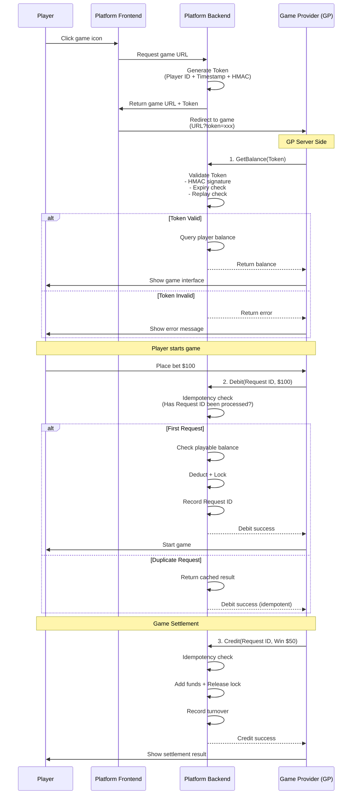
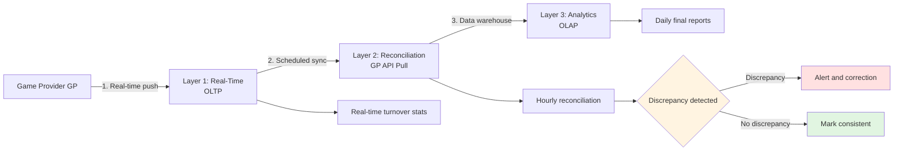
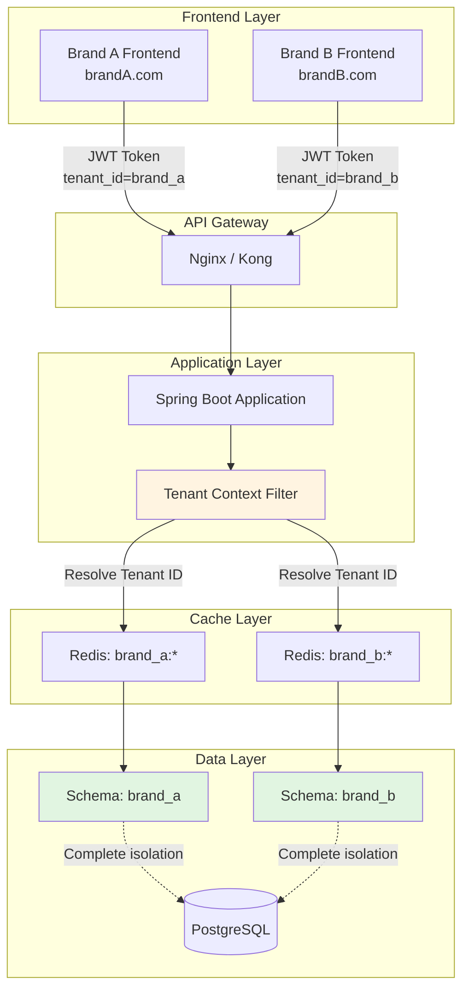

# Business Logic Flows -- Technical Implementation

> **Canonical Source**: [source/00_Foundation/00-02_Business_Flows.md](../../source-archive/00_Foundation/00-02_Business_Flows.md)
> **Audience**: Architects, Backend Developers, DevOps Engineers
> **Business Requirements**: [Business_Flows.md](../../requirements/01_Player_Experience/Business_Flows.md)
> **Last Synced**: 2026-02-08

---

## Document Purpose

This document provides the **technical implementation details** for the 6 end-to-end business flows in the iGaming platform. It includes code samples, API specifications, database schemas, system interaction patterns, and infrastructure configurations that architects and developers need to implement each flow.

For business rules, policies, user journeys, and compliance requirements, see the [Business Flows (Requirements View)](../../requirements/01_Player_Experience/Business_Flows.md).

---

## Table of Contents

1. [Player Registration and KYC -- Technical Implementation](#1-player-registration-and-kyc)
2. [Game Integration and Token Verification](#2-game-integration-and-token-verification)
3. [Bonus Engine and Wagering Tracking](#3-bonus-engine-and-wagering-tracking)
4. [Withdrawal Processing and Risk Engine](#4-withdrawal-processing-and-risk-engine)
5. [Turnover Calculation and Reconciliation Pipeline](#5-turnover-calculation-and-reconciliation-pipeline)
6. [Multi-Tenant Data Isolation Architecture](#6-multi-tenant-data-isolation-architecture)

---

## 1. Player Registration and KYC

### 1.1 Tenant Context Resolution

The tenant context is resolved from the incoming request and injected into a ThreadLocal for the duration of the request lifecycle.

```java
// From domain name or sub-path
String tenantCode = extractTenantFromRequest(request);
TenantContext.set(tenantCode);

// Or from JWT Token (authenticated users)
Claims claims = jwtService.parse(token);
String tenantId = claims.get("tenant_id", String.class);
```

**Design Rationale**: ThreadLocal ensures tenant isolation per request thread. The `finally` block in the filter must always call `TenantContext.clear()` to prevent memory leaks.

Reference: [Multi-Tenant Architecture](../../source-archive/06_Platform_Governance/06-01_Multi_Tenant.md#tenant-context)

### 1.2 Wallet Initialization Schema

```sql
INSERT INTO t_player_wallet (player_id, tenant_id, cash_balance, bonus_balance, locked_amount)
VALUES (:playerId, :tenantId, 0, 0, 0);
```

**Table Design Notes**:
- `cash_balance`: Real money deposited by the player
- `bonus_balance`: Promotional credits from bonuses
- `locked_amount`: Funds reserved for pending withdrawals or in-progress bets
- All monetary fields use `DECIMAL(18,2)` for precision

Reference: [Wallet Architecture](../../source-archive/02_Finance_Center/02-06_Wallet_Architecture.md)

---

## 2. Game Integration and Token Verification

### 2.1 Sequence Diagram



### 2.2 Token Generation

**Token Structure**:
```json
{
  "player_id": "12345",
  "tenant_id": "brand_a",
  "timestamp": 1704287400,
  "expire_at": 1704287700,
  "signature": "HMAC-SHA256(...)"
}
```

**HMAC Signature Computation**:
```java
String data = playerId + "|" + tenantId + "|" + timestamp;
String signature = HmacUtils.hmacSha256Hex(secretKey, data);
```

**Security Constraints**:
- TTL: 5 minutes
- One-time use: Token is marked as consumed after first use
- Optional IP binding: Prevents token theft via IP validation

Reference: [Seamless Wallet Analysis](../../source-archive/03_Game_Center/03-03_Seamless_Wallet_Analysis.md#token-verification)

### 2.3 Three-Tier Idempotency Implementation

```java
// Tier 1: Redis fast check (handles 99% of cases)
if (redisTemplate.hasKey("request:" + requestId)) {
    return getCachedResult(requestId);
}

// Tier 2: Database check (Redis miss/failure)
Transaction tx = transactionDao.findByRequestId(requestId);
if (tx != null) {
    return tx.getResult();
}

// Tier 3: Distributed lock (extreme concurrency)
try (DistributedLock lock = redisson.getLock("lock:" + requestId)) {
    lock.lock();
    // Execute debit logic
}
```

**Design Rationale**:
- Redis provides sub-millisecond lookup for the common case
- Database serves as durable backup when Redis is unavailable
- Distributed lock (Redisson) handles the edge case where two identical requests arrive simultaneously before either is persisted

Reference: [Seamless Wallet Analysis](../../source-archive/03_Game_Center/03-03_Seamless_Wallet_Analysis.md#idempotency)

### 2.4 Playable Balance Check

```java
if (availableBalance < betAmount) {
    throw new InsufficientBalanceException();
}
```

**Formula**: `playable_balance = cash_balance - locked_amount - in_progress_bets`

Reference: [Wallet Architecture](../../source-archive/02_Finance_Center/02-06_Wallet_Architecture.md#playable-balance)

### 2.5 API Specifications

**GetBalance API**:
```http
POST /api/gp/getBalance
Content-Type: application/json

{
  "token": "xxx",
  "player_id": "12345",
  "timestamp": 1704287400,
  "signature": "HMAC-SHA256(...)"
}
```

**Response**:
```json
{
  "code": 0,
  "data": {
    "balance": 700.00,
    "currency": "USD"
  }
}
```

**Debit API**:
```http
POST /api/gp/debit
Content-Type: application/json

{
  "request_id": "uuid-1234",
  "player_id": "12345",
  "amount": 100.00,
  "game_id": "slot_001",
  "round_id": "round_5678"
}
```

Reference: [Game Integration Standard](../../source-archive/03_Game_Center/03-01_Game_Integration_Standard.md)

---

## 3. Bonus Engine and Wagering Tracking

### 3.1 Bonus Calculation Logic

```java
BigDecimal bonusAmount = depositAmount.multiply(bonusRate);
if (bonusAmount.compareTo(maxBonus) > 0) {
    bonusAmount = maxBonus;
}

BigDecimal wageringRequirement = depositAmount.add(bonusAmount).multiply(multiplier);
```

**Key Parameters**:
- `bonusRate`: Percentage of deposit (e.g., 0.50 for 50%)
- `maxBonus`: Maximum bonus cap (e.g., $500)
- `multiplier`: Wagering multiplier (e.g., 20x)

Reference: [Bonus Calculation Engine](../../source-archive/04_Activity_Center/04-02_Bonus_Calculation_Engine.md)

### 3.2 Wagering Accumulation Logic

```java
// After each bet, update wagering progress
BigDecimal validBet = betAmount.multiply(gameWeight);
wageringProgress = wageringProgress.add(validBet);

// Check if wagering requirement is met
if (wageringProgress.compareTo(wageringRequirement) >= 0) {
    convertBonusToCash();
}
```

Reference: [Turnover Calculation](../../source-archive/03_Game_Center/03-04_Turnover_Calculation.md)

### 3.3 Bonus-to-Cash Conversion (Atomic Transaction)

```sql
-- Atomic operation
BEGIN;

UPDATE t_player_wallet
SET bonus_balance = bonus_balance - :bonusAmount,
    cash_balance = cash_balance + :bonusAmount
WHERE player_id = :playerId
  AND bonus_balance >= :bonusAmount;

UPDATE t_bonus_record
SET status = 'COMPLETED',
    completed_at = NOW()
WHERE id = :bonusId;

COMMIT;
```

**Transaction Safety**:
- The `WHERE bonus_balance >= :bonusAmount` clause prevents negative balance
- Both updates must succeed atomically (wrapped in a single transaction)
- The Manager layer handles `@Transactional(rollbackFor = Throwable.class)` per SmartAdmin architecture rules

Reference: [Activity Bonus](../../source-archive/04_Activity_Center/04-04_Activity_Bonus.md)

---

## 4. Withdrawal Processing and Risk Engine

### 4.1 Fund Locking Implementation

```sql
UPDATE t_player_wallet
SET locked_amount = locked_amount + :withdrawAmount
WHERE player_id = :playerId
  AND (cash_balance - locked_amount) >= :withdrawAmount;
```

**Design Notes**:
- The `WHERE` clause ensures atomic check-and-lock (no race condition)
- If the available balance is insufficient, the UPDATE affects 0 rows, and the application returns an error

Reference: [Wallet Architecture](../../source-archive/02_Finance_Center/02-06_Wallet_Architecture.md#fund-locking)

### 4.2 Multi-Layer Risk Engine Implementation

```java
RiskScore riskScore = new RiskScore();

// Layer 1: KYC Check
if (!player.isKycVerified()) {
    return RiskDecision.REJECT("KYC_NOT_VERIFIED");
}

// Layer 2: Turnover Check
BigDecimal requiredTurnover = player.getDeposits().multiply(BigDecimal.ONE); // 1x turnover
if (player.getTurnover().compareTo(requiredTurnover) < 0) {
    return RiskDecision.REJECT("TURNOVER_NOT_MET");
}

// Layer 3: Frequency Check
int withdrawCountToday = withdrawalDao.countToday(playerId);
if (withdrawCountToday > 3) {
    riskScore.add(30, "HIGH_FREQUENCY");
}

// Layer 4: Amount Check
if (withdrawAmount.compareTo(player.getTotalDeposits().multiply(BigDecimal.valueOf(3))) > 0) {
    riskScore.add(40, "LARGE_AMOUNT");
}

// Layer 5: Behavior Check
if (player.hasOnlyBonusPlay()) {
    riskScore.add(50, "BONUS_ABUSE");
}

// Decision
if (riskScore.getTotal() <= 30) {
    return RiskDecision.AUTO_APPROVE();
} else if (riskScore.getTotal() <= 70) {
    return RiskDecision.MANUAL_REVIEW();
} else {
    return RiskDecision.REJECT("HIGH_RISK");
}
```

Reference: [Risk Framework](../../source-archive/05_Risk_Control/05-01_Risk_Framework.md)

### 4.3 SAGA Compensation Transaction

```java
@Transactional(rollbackFor = Throwable.class)
public void processWithdrawal(WithdrawalRequest request) {
    try {
        // Step 1: Create order
        Withdrawal withdrawal = createWithdrawal(request);

        // Step 2: Lock funds
        walletService.lockFunds(playerId, amount);

        // Step 3: Call payment gateway
        PaymentResult result = paymentGateway.withdraw(withdrawal);

        if (!result.isSuccess()) {
            // Compensation: release lock
            walletService.unlockFunds(playerId, amount);
            throw new WithdrawalFailedException();
        }

        // Step 4: Deduct balance
        walletService.deductBalance(playerId, amount);

    } catch (Exception e) {
        // Trigger compensation transaction
        compensate(withdrawal);
        throw e;
    }
}
```

**SAGA Flow**:
```
Forward:  Create Order -> Lock Funds -> Call Payment -> Deduct Balance
Compensate: Delete Order <- Release Lock <- Cancel Payment <- Rollback Balance
```

**Architecture Note**: Per SmartAdmin rules, `@Transactional` must be placed in the Manager layer, not the Service layer. The code above should reside in a `WithdrawalManager` class.

Reference: [Withdrawal Risk](../../source-archive/01_Player_Center/01-05_Withdrawal_Risk.md#saga-compensation)

---

## 5. Turnover Calculation and Reconciliation Pipeline

### 5.1 Three-Layer Architecture Diagram



### 5.2 Layer 1: OLTP Schema

```sql
CREATE TABLE t_player_bet (
    id BIGINT PRIMARY KEY,
    player_id BIGINT,
    game_id VARCHAR(50),
    round_id VARCHAR(100),
    bet_amount DECIMAL(18,2),
    valid_bet DECIMAL(18,2),  -- Valid bet (risk-filtered)
    win_amount DECIMAL(18,2),
    bet_time TIMESTAMP,
    settle_time TIMESTAMP
);
```

**Real-time Turnover Query**:
```sql
-- Player's daily turnover
SELECT SUM(valid_bet)
FROM t_player_bet
WHERE player_id = ?
  AND DATE(bet_time) = CURRENT_DATE;
```

### 5.3 Layer 2: Reconciliation Engine

```java
// 1. Pull data from GP API
List<GPBetRecord> gpRecords = gpApi.getBets(startTime, endTime);

// 2. Compare with local data
for (GPBetRecord gpRecord : gpRecords) {
    LocalBetRecord localRecord = betDao.findByRoundId(gpRecord.getRoundId());

    if (localRecord == null) {
        // Discrepancy 1: Missing local record
        alerts.add("MISSING_LOCAL:" + gpRecord.getRoundId());
        supplementRecord(gpRecord);
    } else if (!localRecord.getValidBet().equals(gpRecord.getValidBet())) {
        // Discrepancy 2: Amount mismatch
        alerts.add("AMOUNT_MISMATCH:" + gpRecord.getRoundId());
        correctRecord(localRecord, gpRecord);
    }
}

// 3. Check for extra local records
List<LocalBetRecord> extraLocal = betDao.findNotInGP(gpRecords);
if (!extraLocal.isEmpty()) {
    alerts.add("EXTRA_LOCAL:" + extraLocal.size());
}
```

**Reconciliation Priority**: GP data is the authoritative source. Local records are corrected to match GP when discrepancies are found.

### 5.4 Layer 3: OLAP Data Warehouse Schema

```sql
-- DWD Detail Layer
CREATE TABLE dwd_player_bet (
    -- Same as OLTP but with added dimensions
    tenant_id BIGINT,
    brand_name VARCHAR(50),
    game_type VARCHAR(20),
    is_bonus_play BOOLEAN,
    ...
) PARTITION BY RANGE (bet_time);

-- DWS Summary Layer
CREATE TABLE dws_player_turnover_daily (
    player_id BIGINT,
    stat_date DATE,
    total_bet DECIMAL(18,2),
    total_valid_bet DECIMAL(18,2),
    total_win DECIMAL(18,2),
    PRIMARY KEY (player_id, stat_date)
);
```

**Daily Report Generation** (runs at 2:00 AM):
```sql
INSERT INTO dws_player_turnover_daily
SELECT
    player_id,
    DATE(bet_time) as stat_date,
    SUM(bet_amount) as total_bet,
    SUM(valid_bet) as total_valid_bet,
    SUM(win_amount) as total_win
FROM dwd_player_bet
WHERE DATE(bet_time) = CURRENT_DATE - INTERVAL 1 DAY
GROUP BY player_id, DATE(bet_time);
```

For detailed turnover calculation flowcharts, see [Turnover Flowcharts](../02_Finance_Service/Turnover_Flowcharts.md).

---

## 6. Multi-Tenant Data Isolation Architecture

### 6.1 Architecture Diagram



### 6.2 Tenant Context Filter Implementation

```java
@Component
public class TenantContextFilter implements Filter {

    @Override
    public void doFilter(ServletRequest request, ServletResponse response, FilterChain chain) {
        try {
            // 1. Parse Tenant ID from JWT Token
            String token = extractToken(request);
            Claims claims = jwtService.parse(token);
            String tenantId = claims.get("tenant_id", String.class);

            // 2. Inject into ThreadLocal
            TenantContext.set(tenantId);

            // 3. Continue processing request
            chain.doFilter(request, response);

        } finally {
            // 4. Clean up ThreadLocal (prevent memory leak)
            TenantContext.clear();
        }
    }
}
```

### 6.3 TenantContext ThreadLocal Implementation

```java
public class TenantContext {
    private static final ThreadLocal<String> TENANT_ID = new ThreadLocal<>();

    public static void set(String tenantId) {
        TENANT_ID.set(tenantId);
    }

    public static String get() {
        String tenantId = TENANT_ID.get();
        if (tenantId == null) {
            throw new TenantNotFoundException("Tenant context not set");
        }
        return tenantId;
    }

    public static void clear() {
        TENANT_ID.remove();
    }
}
```

**Important**: When using Virtual Threads (Java 21), consider using `ScopedValue` instead of `ThreadLocal` to avoid thread-local inheritance issues with virtual thread pools.

### 6.4 MyBatis Schema Interceptor

```java
@Intercepts({
    @Signature(type = Executor.class, method = "update", args = {MappedStatement.class, Object.class}),
    @Signature(type = Executor.class, method = "query", args = {MappedStatement.class, Object.class, RowBounds.class, ResultHandler.class})
})
public class TenantSchemaInterceptor implements Interceptor {

    @Override
    public Object intercept(Invocation invocation) throws Throwable {
        // 1. Get Tenant ID
        String tenantId = TenantContext.get();

        // 2. Dynamically switch schema
        String schemaName = "tenant_" + tenantId;
        Connection conn = getConnection(invocation);
        conn.createStatement().execute("SET search_path TO " + schemaName);

        // 3. Execute SQL
        return invocation.proceed();
    }
}
```

**SQL Auto-Rewrite Example**:
```sql
-- Original SQL
SELECT * FROM t_player WHERE id = ?

-- Auto-rewritten to
SET search_path TO tenant_brand_a;
SELECT * FROM t_player WHERE id = ?
```

**Security Note**: The `schemaName` must be validated against a whitelist of known tenants to prevent SQL injection via manipulated tenant IDs.

### 6.5 Redis Key Prefix Isolation

```java
public class RedisKeyBuilder {
    public static String buildKey(String module, String key) {
        String tenantId = TenantContext.get();
        return String.format("%s:%s:%s", tenantId, module, key);
    }
}

// Usage example
String key = RedisKeyBuilder.buildKey("player", "wallet:" + playerId);
// Result: "brand_a:player:wallet:12345"
```

**Benefits**:
- Prevents data conflicts between tenants in shared Redis
- Enables per-tenant cache flushing (`DEL brand_a:*`)
- Supports per-tenant cache monitoring and metrics

### 6.6 JWT Token Generation

```java
public String generateToken(Player player) {
    return Jwts.builder()
        .setSubject(player.getId().toString())
        .claim("tenant_id", player.getTenantId())  // Critical: inject Tenant ID
        .claim("roles", player.getRoles())
        .setIssuedAt(new Date())
        .setExpiration(new Date(System.currentTimeMillis() + 86400000))  // 24 hours
        .signWith(secretKey)
        .compact();
}
```

### 6.7 Cross-Tenant Access Prevention

```java
@Service
public class PlayerService {

    public Player getPlayer(Long playerId) {
        Player player = playerDao.findById(playerId);

        // Critical check: verify player belongs to current tenant
        if (!player.getTenantId().equals(TenantContext.get())) {
            throw new AccessDeniedException("Cross-tenant access not allowed");
        }

        return player;
    }
}
```

### 6.8 Tenant Isolation Test

```java
@Test
public void testTenantIsolation() {
    // 1. Brand A creates a player
    TenantContext.set("brand_a");
    Player playerA = playerService.createPlayer("Alice");

    // 2. Brand B attempts to access Brand A's player
    TenantContext.set("brand_b");
    assertThrows(AccessDeniedException.class, () -> {
        playerService.getPlayer(playerA.getId());
    });
}
```

**Test Coverage Requirements**:
- Cross-tenant data access must be blocked at application layer
- Database schema isolation must be verified independently
- Redis key isolation must be verified (no key leakage across tenants)

---

## Cross-Reference Index

| Flow | Requirements Doc | Architecture Doc |
|------|-----------------|-----------------|
| Player Registration & KYC | [Business_Flows.md Section 1](../../requirements/01_Player_Experience/Business_Flows.md#1-player-registration-and-kyc) | This document, Section 1 |
| Game Integration & Token | [Business_Flows.md Section 2](../../requirements/01_Player_Experience/Business_Flows.md#2-game-launch-and-token-verification) | This document, Section 2 |
| Bonus & Wagering | [Business_Flows.md Section 3](../../requirements/01_Player_Experience/Business_Flows.md#3-bonus-distribution-and-wagering-requirements) | This document, Section 3 |
| Withdrawal & Risk | [Business_Flows.md Section 4](../../requirements/01_Player_Experience/Business_Flows.md#4-withdrawal-review-and-risk-control) | This document, Section 4 |
| Turnover & Reconciliation | [Business_Flows.md Section 5](../../requirements/01_Player_Experience/Business_Flows.md#5-turnover-calculation-and-reconciliation) | This document, Section 5 |
| Multi-Tenant Isolation | [Business_Flows.md Section 6](../../requirements/01_Player_Experience/Business_Flows.md#6-multi-tenant-data-isolation) | This document, Section 6 |

---

**Document Version**: 4.0.0
**Created**: 2026-02-03
**Maintained by**: Architecture Team
