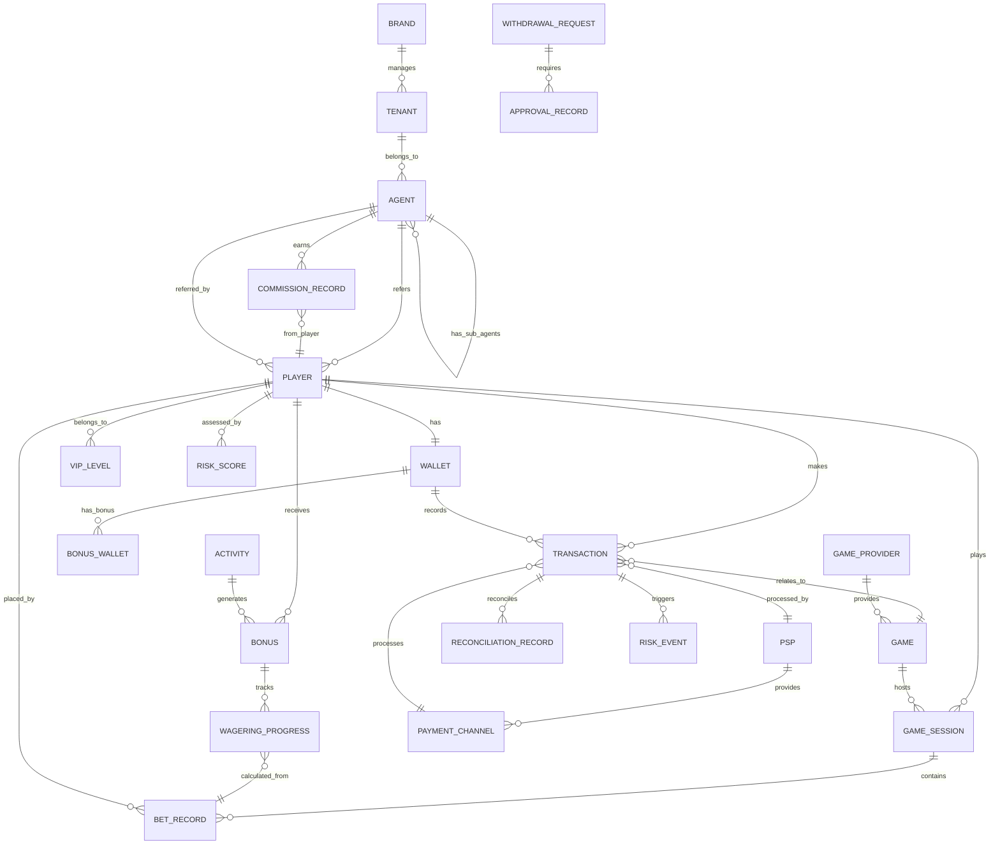
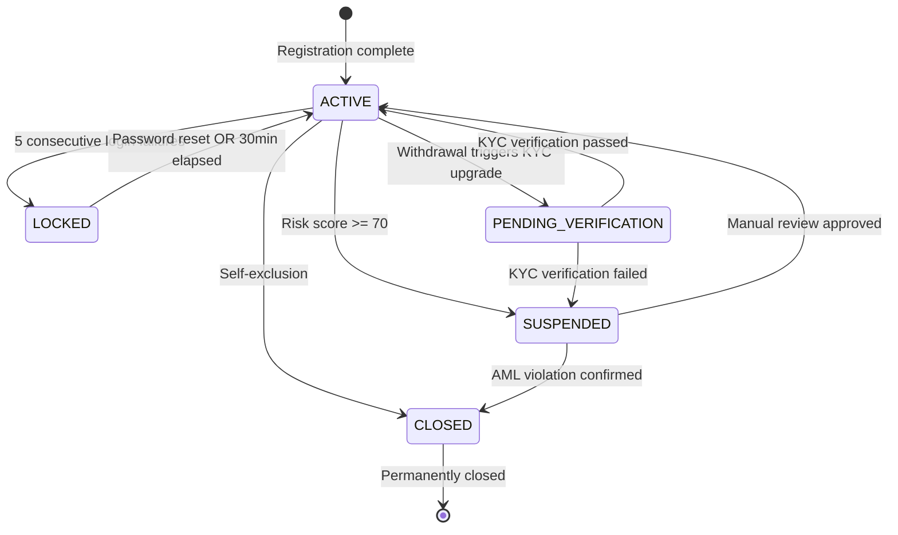
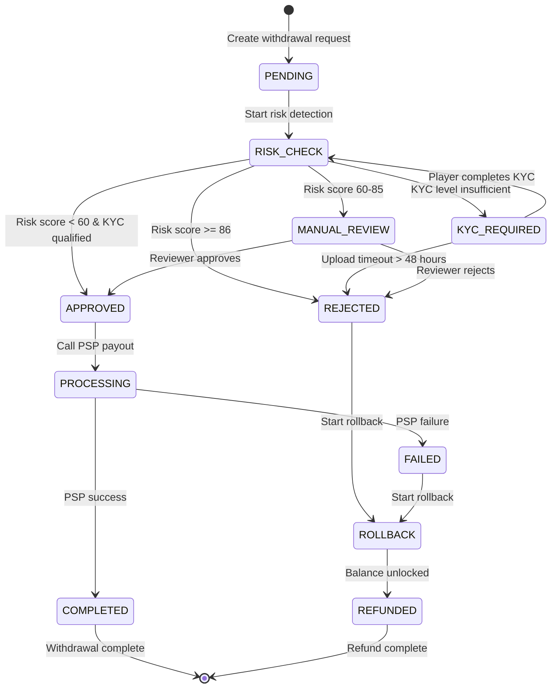
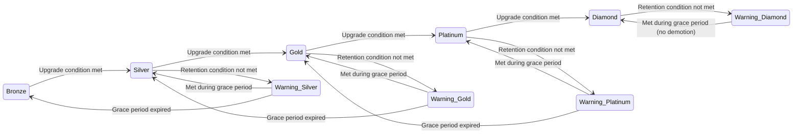

# Data Model Architecture

> **Canonical Source**: [source/00_Foundation/guides/00-10_Data_Model.md](../../source-archive/00_Foundation/guides/00-10_Data_Model.md)
> **Audience**: Architects, Backend Developers, DevOps
> **Business Requirements**: None (pure technical)
> **Last Synced**: 2026-02-08

---

## 1. Entity Relationship Diagram

### 1.1 Global ER Diagram



---

## 2. Entity Layered Architecture

### 2.1 Layer 1: Multi-Tenant & Organization Hierarchy

```
Super Admin (System Level)
    +-- Brand
        +-- Tenant (Operator)
            +-- Agent
                +-- Player
```

**Core Entities**:

| Entity | Table Name | Description |
|--------|-----------|-------------|
| Brand | `brands` | Brand entity |
| Tenant | `tenants` | Tenant / Operator |
| Agent | `agents` | Agent system (unlimited nesting) |
| Player | `players` | End player |

### 2.2 Layer 2: Financial Core

```
Player Wallet
    +-- Cash Balance
    +-- Bonus Balance
    +-- Credit Balance
```

**Core Entities**:

| Entity | Table Name | Description |
|--------|-----------|-------------|
| Wallet | `wallets` | Unified wallet master table |
| Transaction | `transactions` | All fund movement records |
| Bonus Wallet | `bonus_wallets` | Bonus sub-wallet |
| Withdrawal Request | `withdrawal_requests` | Withdrawal applications |
| Deposit Record | `deposit_records` | Deposit records |

### 2.3 Layer 3: Game & Betting

```
Game Provider
    +-- Game
        +-- Game Session
            +-- Bet Record
```

**Core Entities**:

| Entity | Table Name | Description |
|--------|-----------|-------------|
| Game Provider | `game_providers` | Game Provider (GP) |
| Game | `games` | Game catalog |
| Game Session | `game_sessions` | Game session |
| Bet Record | `bet_records` | Bet details |
| Game Round Aggregation | `game_round_aggregation` | Game round summary |

### 2.4 Layer 4: Activity & Risk Control

**Activity System**:

| Entity | Table Name | Description |
|--------|-----------|-------------|
| Activity | `activities` | Activity configuration |
| Bonus | `bonuses` | Bonus distribution records |
| Wagering Progress | `wagering_progress` | Turnover progress tracking |

**Risk Control System**:

| Entity | Table Name | Description |
|--------|-----------|-------------|
| Risk Rule | `risk_rules` | Risk control rule configuration |
| Risk Score | `risk_scores` | Player risk scores |
| Risk Event | `risk_events` | Risk event records |
| Approval Workflow | `approval_workflows` | Approval workflow |

---

## 3. State Machine Designs

### 3.1 Player Account State Machine

> **SSOT**: Full definition at [01-01_Player_Lifecycle.md](../../source-archive/01_Player_Center/01-01_Player_Lifecycle.md)

**Five-State Definition**:

| State Code | Trigger Condition | Business Impact | Recovery Path |
|-----------|------------------|-----------------|---------------|
| `ACTIVE` | Default state | No restrictions | N/A |
| `LOCKED` | 5 consecutive failed logins | Login prohibited for 30 min | Password reset OR auto-unlock |
| `SUSPENDED` | Risk score >= 70 | Deposit/withdrawal/betting prohibited | Manual review approval |
| `PENDING_VERIFICATION` | Withdrawal triggers KYC upgrade | Withdrawal limit (<$1000) | KYC verification passed |
| `CLOSED` | Self-exclusion OR AML violation | All operations prohibited, permanent | Irrecoverable |

**State Transition Diagram**:



**State Transition SQL Examples**:

```sql
-- ACTIVE -> LOCKED (login failure trigger)
UPDATE players
SET account_status = 'LOCKED',
    locked_until = NOW() + INTERVAL '30 MINUTE',
    failed_login_attempts = failed_login_attempts + 1,
    updated_at = NOW()
WHERE player_id = ?
  AND account_status = 'ACTIVE'
  AND failed_login_attempts >= 4;

-- LOCKED -> ACTIVE (auto-unlock)
UPDATE players
SET account_status = 'ACTIVE',
    failed_login_attempts = 0,
    locked_until = NULL,
    updated_at = NOW()
WHERE account_status = 'LOCKED'
  AND locked_until < NOW();
```

### 3.2 Withdrawal State Machine

> **SSOT**: Full SAGA definition at [01-05_Withdrawal_Risk.md](../../source-archive/01_Player_Center/01-05_Withdrawal_Risk.md)

**Ten-State Definition**:

| State Code | Description | Possible Transitions | Business Impact |
|-----------|-------------|---------------------|-----------------|
| `PENDING` | Withdrawal request created | RISK_CHECK, REJECTED | Balance locked |
| `RISK_CHECK` | Risk detection in progress | KYC_REQUIRED, APPROVED, MANUAL_REVIEW | Real-time risk scoring |
| `KYC_REQUIRED` | KYC upgrade needed | RISK_CHECK | Waiting for player document upload |
| `MANUAL_REVIEW` | Manual review | APPROVED, REJECTED | L1/L2/L3 reviewer intervention |
| `APPROVED` | Review approved | PROCESSING | Ready for payout |
| `PROCESSING` | PSP payout in progress | COMPLETED, FAILED | Calling PSP API |
| `COMPLETED` | Withdrawal successful | [Terminal] | Funds arrived |
| `FAILED` | Withdrawal failed | ROLLBACK | PSP returned failure |
| `ROLLBACK` | Balance rollback in progress | REFUNDED | Releasing locked balance |
| `REFUNDED` | Refunded | [Terminal] | Balance unlocked |
| `REJECTED` | Review rejected | REFUNDED | Risk/manual rejection |

**SAGA Orchestration Flow Diagram**:



**Step 2.5 Delayed Risk Check Query** (v2.1.0):

```sql
-- Check historical risk proposals
SELECT COUNT(*) as pending_proposals
FROM withdrawal_risk_correlations wrc
JOIN withdrawal_requests wr ON wrc.withdrawal_id = wr.id
WHERE wrc.player_id = ?
  AND wrc.time_range_start <= NOW()
  AND wrc.time_range_end >= NOW()
  AND wr.status IN ('MANUAL_REVIEW', 'RISK_CHECK');

-- If pending_proposals > 0, current withdrawal forced into MANUAL_REVIEW
```

### 3.3 VIP Tier State Machine

> **SSOT**: Full VIP system design at [01-06_VIP_Loyalty.md](../../source-archive/01_Player_Center/01-06_VIP_Loyalty.md)

**Five-Tier Definition**:

| Tier | Retention Condition (Monthly) | Upgrade Condition | Warning State | Grace Period |
|------|------------------------------|-------------------|---------------|--------------|
| Bronze | $100 deposit OR $1K turnover | $1K deposit OR $10K turnover | None | None |
| Silver | $1K deposit OR $10K turnover | $5K deposit OR $50K turnover | 7-day warning | 30 days |
| Gold | $5K deposit OR $50K turnover | $20K deposit OR $200K turnover | 14-day warning | 60 days |
| Platinum | $20K deposit OR $200K turnover | $100K deposit OR $1M turnover | 21-day warning | 90 days |
| Diamond | $100K deposit OR $1M turnover | N/A | 30-day warning | Permanent (unless violation) |

**State Transition Diagram**:



**Demotion Compensation Configuration**:

```yaml
demotion_compensation:
  Silver_to_Bronze:
    - One-time $50 cashback
    - 1.5x rakeback multiplier for 7 days

  Gold_to_Silver:
    - One-time $200 cashback
    - 2x rakeback multiplier for 14 days

  Platinum_to_Gold:
    - One-time $1000 cashback
    - 2.5x rakeback multiplier for 21 days
    - VIP account manager contact
```

### 3.4 State Machine Design Principles

**1. One-Way Transitions Priority**:
- `CLOSED` state is irrecoverable
- `COMPLETED` withdrawals cannot be cancelled
- Avoid circular transitions (ACTIVE <-> SUSPENDED requires manual intervention)

**2. Idempotency Guarantee**:

```java
// State transitions must verify current state
public Result<Void> transitionToLocked(String playerId) {
    return playerDao.findById(playerId)
        .filter(p -> p.getStatus() == AccountStatus.ACTIVE) // Precondition check
        .map(p -> {
            p.setStatus(AccountStatus.LOCKED);
            p.setLockedUntil(LocalDateTime.now().plusMinutes(30));
            playerDao.updateById(p);
            return Result.success();
        })
        .getOrElse(Result.failure("Invalid state transition"));
}
```

**3. Mandatory Audit Logging**:

```sql
-- All state changes must be recorded
INSERT INTO player_status_audit_log (
    player_id,
    old_status,
    new_status,
    trigger_reason,
    operator_id,
    created_at
) VALUES (?, ?, ?, ?, ?, NOW());
```

**4. State Transition Trigger Types**:

| Trigger Type | Example | Processing Method |
|-------------|---------|-------------------|
| **Time-based** | Auto-unlock after 30 minutes | Cron Job |
| **Event-based** | 5 consecutive login failures | Real-time detection |
| **Manual** | Reviewer approves withdrawal | Approval workflow |
| **External** | PSP returns failure | Webhook callback |

---

## 4. Cross-Module Foreign Key Relationships

### 4.1 Primary Key & Foreign Key Constraint Table

| Child Table (From) | FK Field | Parent Table (To) | Relationship | Cascade Delete | Description |
|-------------------|----------|-------------------|-------------|----------------|-------------|
| **Player Domain** |
| `players` | `tenant_id` | `tenants` | N:1 | RESTRICT | Player belongs to tenant |
| `players` | `agent_id` | `agents` | N:1 | SET NULL | Referring agent (nullable) |
| `players` | `vip_level_id` | `vip_levels` | N:1 | SET NULL | VIP tier |
| `wallets` | `player_id` | `players` | 1:1 | CASCADE | Wallet bound to player |
| **Transaction Domain** |
| `transactions` | `player_id` | `players` | N:1 | RESTRICT | Transaction owner |
| `transactions` | `wallet_id` | `wallets` | N:1 | RESTRICT | Associated wallet |
| `transactions` | `game_id` | `games` | N:1 | SET NULL | Game transaction (optional) |
| `transactions` | `psp_id` | `psps` | N:1 | SET NULL | Payment service provider |
| **Game Domain** |
| `games` | `provider_id` | `game_providers` | N:1 | CASCADE | Game belongs to GP |
| `game_sessions` | `player_id` | `players` | N:1 | RESTRICT | Player session |
| `game_sessions` | `game_id` | `games` | N:1 | RESTRICT | Game session |
| `bet_records` | `session_id` | `game_sessions` | N:1 | CASCADE | Belongs to session |
| `bet_records` | `player_id` | `players` | N:1 | RESTRICT | Betting player |
| **Activity Domain** |
| `bonuses` | `player_id` | `players` | N:1 | CASCADE | Bonus owner |
| `bonuses` | `activity_id` | `activities` | N:1 | RESTRICT | Activity source |
| `wagering_progress` | `bonus_id` | `bonuses` | N:1 | CASCADE | Turnover progress tracking |
| **Agent Domain** |
| `agents` | `parent_agent_id` | `agents` | N:1 | RESTRICT | Parent agent (self-reference) |
| `agents` | `tenant_id` | `tenants` | N:1 | RESTRICT | Belonging tenant |
| `commission_records` | `agent_id` | `agents` | N:1 | RESTRICT | Commission owner |
| `commission_records` | `player_id` | `players` | N:1 | RESTRICT | Commission source player |
| **Risk Control Domain** |
| `risk_scores` | `player_id` | `players` | N:1 | CASCADE | Player risk score |
| `risk_events` | `transaction_id` | `transactions` | N:1 | CASCADE | Risk event trigger transaction |
| `withdrawal_requests` | `player_id` | `players` | N:1 | RESTRICT | Withdrawal applicant |
| `approval_records` | `request_id` | `withdrawal_requests` | N:1 | CASCADE | Approval records |

---

## 5. Core Table Designs

### 5.1 Player Table (`players`)

**Key Field Notes**:
- `email_blind_index`: HMAC-SHA256 blind index for encrypted email searchable queries
- `password_hash`: Argon2id algorithm with parameters m=65536, t=3, p=4
- `kyc_status`: Supports Enhanced Due Diligence (EDD) flow

### 5.2 Wallet Table (`wallets`)

**Playable Balance Formula**:

> **SSOT**: Full calculation logic at [02-06_Wallet_Architecture.md](../../source-archive/02_Finance_Center/02-06_Wallet_Architecture.md)

```text
Playable Balance = Cash + Bonus + (Credit Limit - Credit Used) - Locked Balance
```

**Concurrency Control**:
- Uses `version` field for optimistic locking

### 5.3 Transaction Table (`transactions`)

All fund movements recorded in a unified table.

### 5.4 Bonus Table (`bonuses`)

Player bonus distribution and turnover tracking.

### 5.5 Game Table (`games`)

Game catalog and metadata.

### 5.6 Withdrawal Request Table (`withdrawal_requests`)

**SAGA Distributed Transaction Flow**:

```text
1. Create withdrawal request (Pending)
2. Lock wallet balance (Locked)
3. Risk detection (Risk Check)
4. Multi-level approval (L1 -> L2 -> L3)
5. PSP payout (Processing)
6. Complete/Rollback (Completed/Failed)
```

---

## 6. Data Consistency Constraints

### 6.1 Wallet Balance Consistency

All wallet balance updates must be atomic and verified against transaction history.

### 6.2 Turnover Calculation Consistency

**Three-Layer Validation Architecture**:

> **SSOT References**:
> - Layer 1 (Risk Validation): [05-01_Risk_Framework.md](../../source-archive/05_Risk_Control/05-01_Risk_Framework.md)
> - Layer 2 (Finance Validation): [03-04_Turnover_Calculation.md](../../source-archive/03_Game_Center/03-04_Turnover_Calculation.md)
> - Layer 3 (Activity Application): [04-04_Activity_Bonus.md](../../source-archive/04_Activity_Center/04-04_Activity_Bonus.md)

```text
Layer 1: Risk Engine Validation (Real-time)
    | Valid bet marking
Layer 2: Finance Layer Validation (Batch)
    | Turnover data aggregation
Layer 3: Activity Layer Application (Triggered)
    | Activity progress update
```

### 6.3 Multi-Tenant Data Isolation

**Isolation Strategy**:

| Strategy | Use Case | Implementation |
|----------|----------|----------------|
| Schema Separation | Large tenants | Dedicated database per tenant |
| Row-Level Isolation | Small/medium tenants | Shared database with `tenant_id` column |
| Hybrid Mode | Mixed workloads | Large tenants get dedicated DB; small tenants share |

---

## 7. Index Strategy

### 7.1 High-Frequency Query Indexes

| Table | Index Name | Columns | Type | Purpose |
|-------|-----------|---------|------|---------|
| `players` | `idx_tenant_username` | `(tenant_id, username)` | UNIQUE | Unique username within tenant |
| `players` | `idx_email_blind_index` | `email_blind_index` | BTREE | Email blind index lookup |
| `wallets` | `idx_player_updated` | `(player_id, updated_at)` | BTREE | Player wallet history |
| `transactions` | `idx_player_type_date` | `(player_id, type, created_at DESC)` | BTREE | Player transaction records |
| `transactions` | `idx_turnover` | `(is_valid_turnover, player_id, created_at)` | BTREE | Turnover calculation query |
| `bonuses` | `idx_player_status_expires` | `(player_id, status, expires_at)` | BTREE | Activity bonus query |
| `games` | `idx_provider_category` | `(provider_id, category, status)` | BTREE | Game catalog classification |
| `withdrawal_requests` | `idx_status_risk_created` | `(status, risk_level, created_at)` | BTREE | Withdrawal review queue |

### 7.2 Covering Indexes

Covering indexes should be used for high-frequency read queries to avoid table lookups. Design covering indexes based on actual query patterns from slow query logs.

---

## 8. Data Security & Encryption

### 8.1 Encrypted Field Strategy

| Data Category | Encryption Method | Key Management | Query Strategy |
|--------------|-------------------|----------------|----------------|
| **PII (Personally Identifiable Information)** |
| Email | AES-256-GCM | KMS (per-tenant isolated) | Blind index query |
| Phone number | AES-256-GCM | KMS | Blind index query |
| ID card number | AES-256-GCM | KMS | Blind index query |
| Name | AES-256-GCM | KMS | Not directly queryable |
| Address | AES-256-GCM | KMS | Not directly queryable |
| **Financial Information** |
| Bank card number | AES-256-GCM | HSM | Tokenization + blind index |
| CVV | Never stored | N/A | Processed at transaction time |
| **Credentials** |
| Password | Argon2id | Per-record salt | Hash comparison |
| MFA secret | AES-256-GCM | KMS | Decrypt then verify |

### 8.2 Blind Index Implementation

**Principle**:

```text
Blind Index = HMAC-SHA256(index_key, plaintext_value)
```

**Key Rotation Strategy**:
1. Retain old key (grace period)
2. Create new key
3. Background batch re-encryption
4. Dual-key query transition period
5. Decommission old key

### 8.3 GDPR Crypto-Shredding

**Data Deletion Strategy**:

```text
Player Deletion Request
    |
1. Delete Data Encryption Key (DEK)
    |
2. Mark record as "deleted"
    |
3. Retain transaction records (regulatory requirement, but PII undecryptable)
    |
4. Generate compliance report
```

---

## Related Documents

- [Business Logic Flows](./Business_Logic_Flows.md) - Business flow architecture
- [Technology Stack](./Technology_Stack.md) - Technology stack overview
- [Wallet Architecture](../02_Finance_Service/Wallet_Architecture.md) - Wallet system design
- [Turnover Calculation Logic](../03_Game_Integration/Turnover_Calculation_Logic.md) - Turnover system design
- [Risk Engine Architecture](../05_Risk_Engine/) - Risk control system

---

**Document Version**: 4.0.0
**Last Updated**: 2026-02-08
**Maintainers**: Architecture Team & Data Team
