# iGaming 平台架構概覽（iGaming Platform Architecture Overview）

> **Canonical Source**: [00-06_Solution_Overview.md](../../source-archive/00_Foundation/guides/00-06_Solution_Overview.md)
> **目標讀者（Audience）**: 架構師、後端開發人員
> **業務需求（Business Requirements）**: [Solution_Overview.md](../../requirements/01_Player_Experience/Solution_Overview.md)
> **最後同步（Last Synced）**: 2026-02-08

---

## 1. 架構範式（Architecture Paradigm）

現代 iGaming 平台已從單體架構轉向微服務架構，這是支援 **200,000+** 並發用戶的關鍵技術選擇。

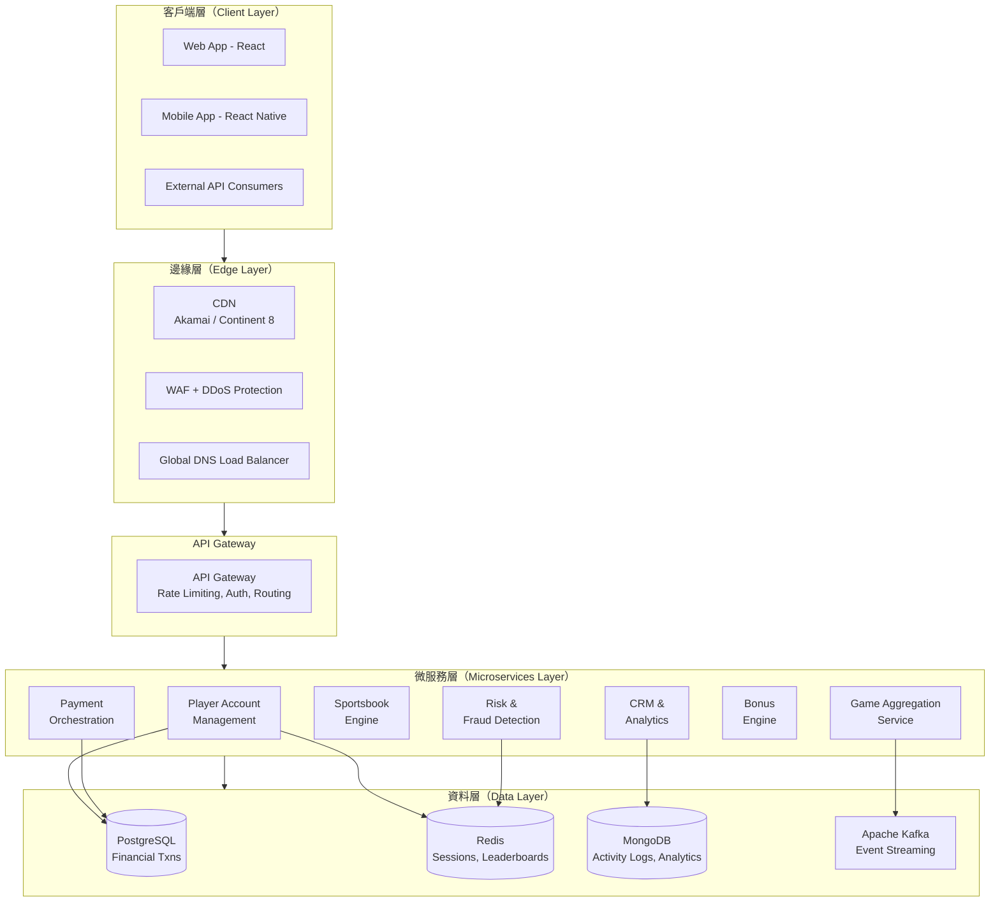

---

## 2. 多租戶資料庫隔離策略（Multi-Tenant Database Isolation Strategies）

資料庫架構直接影響安全性、成本和營運效率。業界採用三種主要模式：

| 模式（Pattern） | 說明（Description） | 隔離等級（Isolation Level） | 成本（Cost） | 最適用於（Best For） |
|---|---|---|---|---|
| **共享資料庫與架構（Shared Database & Schema）** | 單一 DB，`tenant_id` 欄位區分 | 低 | 最低 | 小型營運商，成本敏感 |
| **共享資料庫，分離架構（Shared Database, Separate Schema）** | 一個 DB，每租戶獨立 schema | 中 | 中等 | 中型平台 |
| **完全分離資料庫（Fully Separate Database）** | 每租戶獨立 DB | 最高 | 最高 | 高端客戶，嚴格監管 |

### 推薦的多語言持久化堆疊（Recommended Polyglot Persistence Stack）

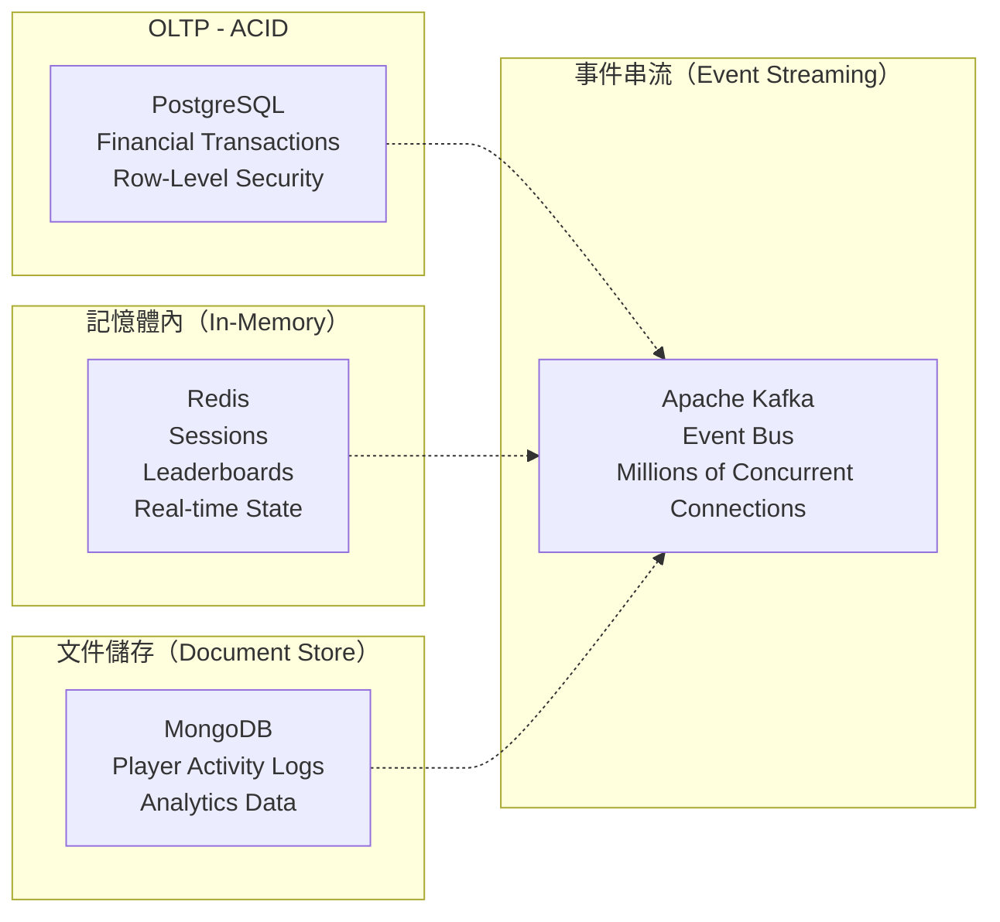

**PostgreSQL 行級安全（Row-Level Security, RLS）** 是租戶隔離的標準實現：

```sql
-- Enable RLS on tenant-scoped table
ALTER TABLE player_wallet ENABLE ROW LEVEL SECURITY;

-- Create policy: each tenant only sees own data
CREATE POLICY tenant_isolation ON player_wallet
    USING (tenant_id = current_setting('app.current_tenant')::bigint);

-- Set tenant context per request
SET app.current_tenant = '12345';
SELECT * FROM player_wallet; -- Only returns tenant 12345 data
```

---

## 3. 技術堆疊選擇（Technology Stack Selection）

### 後端（Backend）

| 技術（Technology） | 使用場景（Use Case） | 優勢（Strengths） |
|---|---|---|
| **Java / Spring Boot** | 企業核心服務 | 高可用性、成熟生態系統、強型別 |
| **Node.js** | WebSocket 服務、即時功能 | 事件驅動、最適合 WebSocket |
| **Go** | 高性能微服務 | 高效並發、低記憶體佔用 |

### SmartAdmin 多租戶服務範例（SmartAdmin Multi-Tenant Service Example）

```java
@Service
@RequiredArgsConstructor
public class TenantService {

    private final TenantDao tenantDao;
    private final TenantManager tenantManager;

    /**
     * Query tenant by ID with Vavr Option for null-safety.
     */
    public Option<TenantVO> getTenantById(Long tenantId) {
        return Option.of(tenantDao.selectById(tenantId))
            .map(entity -> SmartBeanUtil.copy(entity, TenantVO.class));
    }

    /**
     * Create tenant with full initialization (requires transaction).
     * Delegates to Manager layer for @Transactional support.
     */
    public ResponseDTO<Long> createTenant(TenantCreateForm form) {
        return tenantManager.createTenantWithSchema(form);
    }
}

@Component
@RequiredArgsConstructor
public class TenantManager {

    private final TenantDao tenantDao;
    private final TenantSchemaInitializer schemaInitializer;

    /**
     * Create tenant and initialize isolated schema.
     * @Transactional only allowed in Manager layer per SmartAdmin architecture.
     */
    @Transactional(rollbackFor = Throwable.class)
    public ResponseDTO<Long> createTenantWithSchema(TenantCreateForm form) {
        // 1. Create tenant record
        TenantEntity entity = SmartBeanUtil.copy(form, TenantEntity.class);
        entity.setStatus(TenantStatusEnum.ACTIVE);
        tenantDao.insert(entity);

        // 2. Initialize tenant schema for data isolation
        schemaInitializer.initializeSchema(entity.getId(), entity.getSchemaName());

        return ResponseDTO.ok(entity.getId());
    }
}
```

### 前端（Frontend）

| 技術（Technology） | 使用場景（Use Case） |
|---|---|
| **React** | 複雜 UI 開發（主導） |
| **Angular** | 企業管理應用程式 |

### 即時通訊（Real-Time Communication）

WebSocket 協議確保：
- 體育投注賠率更新：**< 500ms** 延遲
- 真人荷官遊戲：**< 100ms** 延遲

結合 **Apache Kafka** 支援數百萬並發連線（參考：Disney+ Hotstar 以 Kafka 架構處理 **2,530 萬** 同時觀看者）。

---

## 4. 雲端部署與高可用性（Cloud Deployment and High Availability）

### 容器編排（Container Orchestration）

**AWS EKS** 是業界首選的容器編排平台，採用多可用區部署實現高可用性。

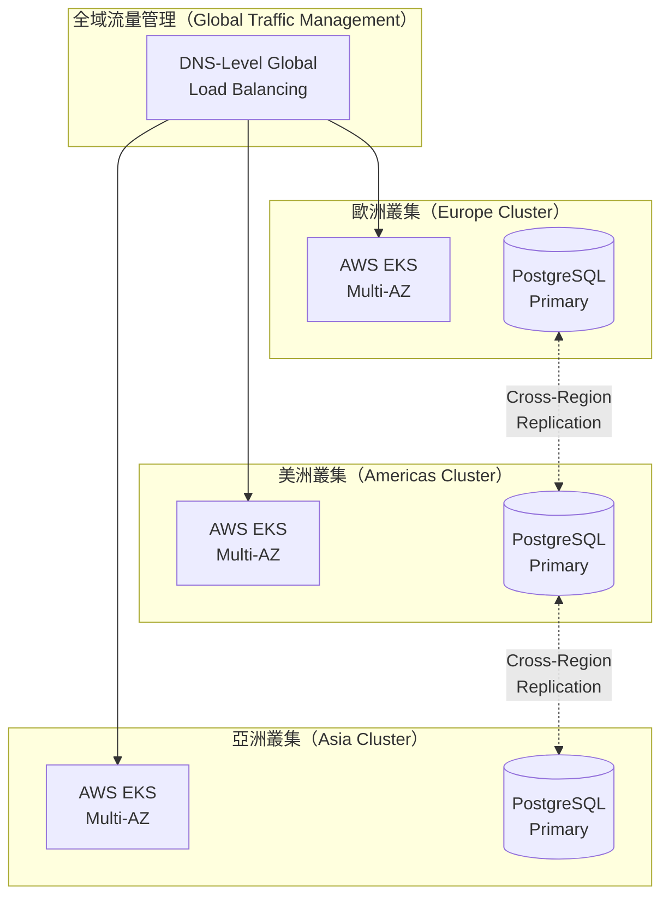

### 雙活架構（Active-Active Architecture）

領先平台在歐洲、美洲和亞洲部署獨立叢集，採用 DNS 級別全域負載平衡。

**災難恢復目標（Disaster Recovery Targets）**:

| 指標（Metric） | 目標（Target） |
|---|---|
| RTO (Recovery Time Objective) | 5-15 分鐘 |
| RPO (Recovery Point Objective) | 接近零 |

### CDN 與邊緣運算（CDN and Edge Computing）

| 供應商（Provider） | 專長（Specialization） |
|---|---|
| **Akamai** | iGaming 專用解決方案，含 DDoS 防護 |
| **Continent 8** | 遊戲產業專屬私有網路 |

邊緣運算使投注處理邏輯更接近用戶，同時滿足資料本地化監管要求。

---

## 5. 錢包整合架構（Wallet Integration Architecture）

### 無縫錢包（Seamless Wallet）（業界標準）

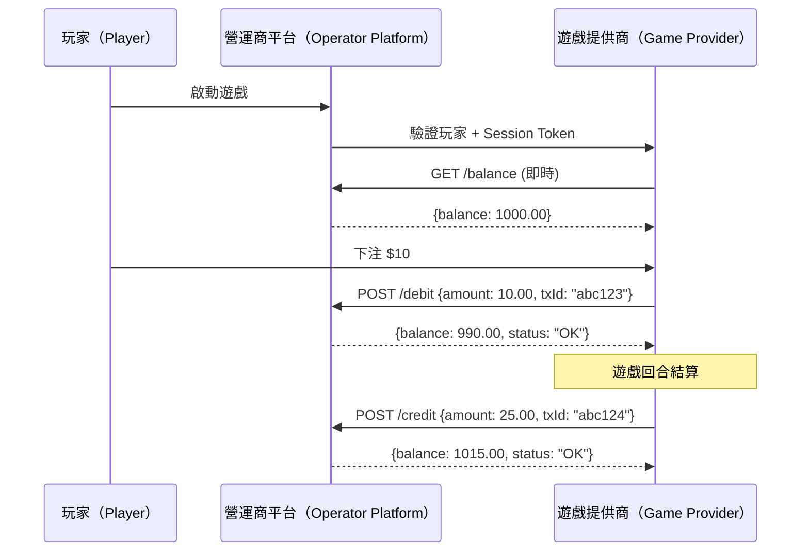

**特性（Characteristics）**:
- 玩家餘額保留於營運商平台
- 每次投注/贏款即時處理
- 支援多遊戲同時進行
- 整合時間：約 10 天

### 轉帳錢包（Transfer Wallet）（傳統模式）

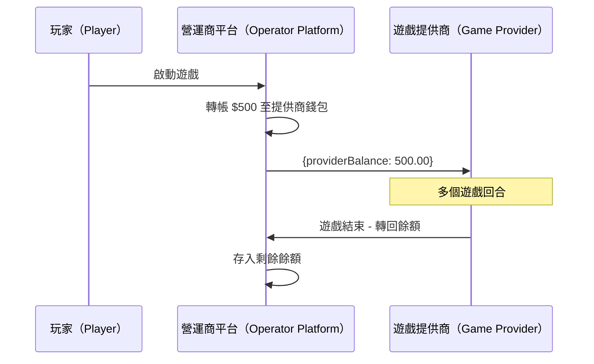

**特性（Characteristics）**:
- 資金轉至提供商專屬錢包
- 整合較簡單（約 2 天）
- 玩家體驗較差
- 斷線時有資金隔離風險

---

## 6. 三方對帳架構（Three-Party Reconciliation Architecture）

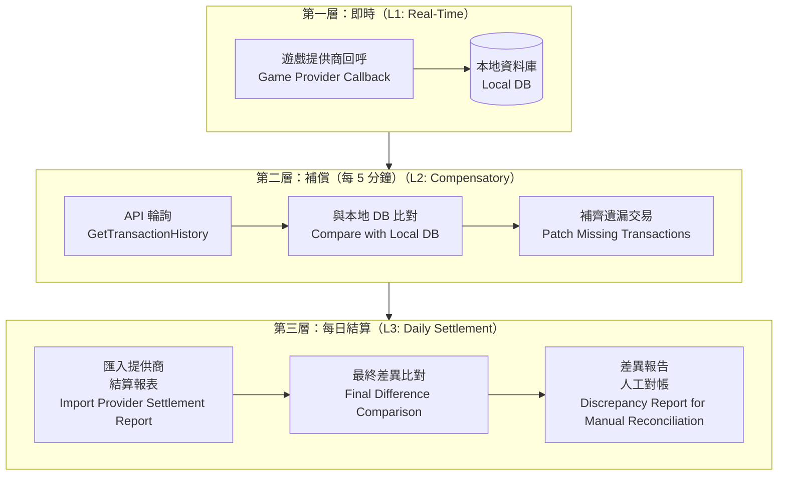

### 斷路器機制（Circuit Breaker Mechanism）

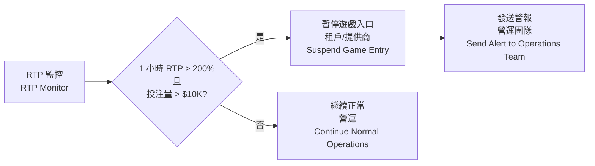

**觸發條件（Trigger Conditions）**: 當單一租戶或遊戲提供商的 **RTP** 在短時間內超過閾值（例如，1 小時 RTP > 200% 且投注量 > $10,000），系統自動暫停遊戲入口並發送警報。

---

## 7. SaaS 租戶計費架構（SaaS Tenant Billing Architecture）

### 動態成本分配（Dynamic Cost Allocation）

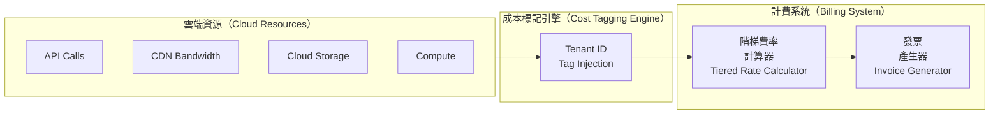

### 階梯定價實現（Tiered Pricing Implementation）

```python
# Tiered pricing calculation
def calculate_tenant_fee(base_fee: float, ggr: float) -> float:
    """
    Calculate monthly tenant fee using tiered GGR share.

    Tiers:
      GGR < $500K    -> 15%
      $500K - $1M    -> 12%
      > $1M          -> 10%
    """
    if ggr <= 500_000:
        share = ggr * 0.15
    elif ggr <= 1_000_000:
        share = 500_000 * 0.15 + (ggr - 500_000) * 0.12
    else:
        share = 500_000 * 0.15 + 500_000 * 0.12 + (ggr - 1_000_000) * 0.10
    return base_fee + share
```

### 欠費暫停升級機制（Non-Payment Suspension Escalation）

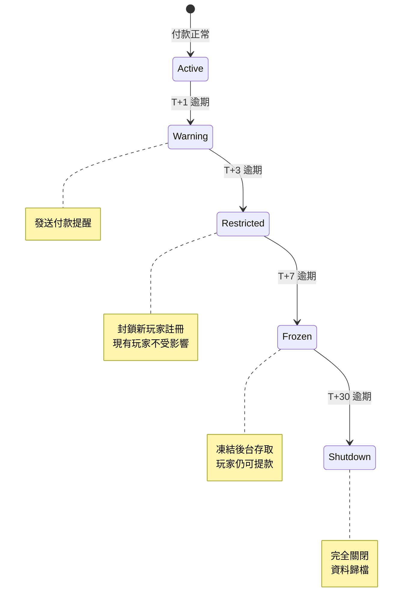

---

## 8. 支付處理架構（Payment Processing Architecture）

### 多收單機構路由（Multi-Acquirer Routing）

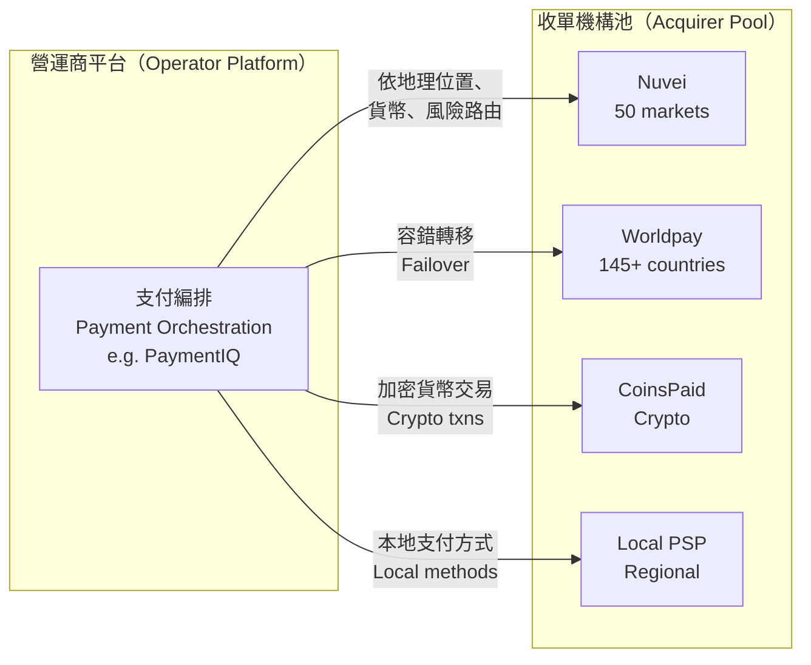

**路由策略（Routing Strategies）**:
- **冗餘（Redundancy）**: 避免單點故障
- **負載平衡（Load Balancing）**: 分散交易量至各處理器
- **地理優化（Geographic Optimization）**: 使用本地收單機構提高批准率
- **風險分散（Risk Distribution）**: 防止單一帳戶終止導致全面停擺

目標：**99%+ 交易成功率**

### 加密貨幣支付整合（Crypto Payment Integration）

```json
{
  "provider": "CoinsPaid",
  "supported_currencies": ["BTC", "ETH", "USDT", "USDC", "LTC"],
  "fee_structure": {
    "crypto_to_crypto": "0.8%",
    "crypto_to_fiat": "1.5%"
  },
  "settlement": "real-time",
  "monthly_volume": "EUR 1B+",
  "integration": "REST API + Webhook callbacks"
}
```

---

## 9. 詐欺檢測技術堆疊（Fraud Detection Technology Stack）

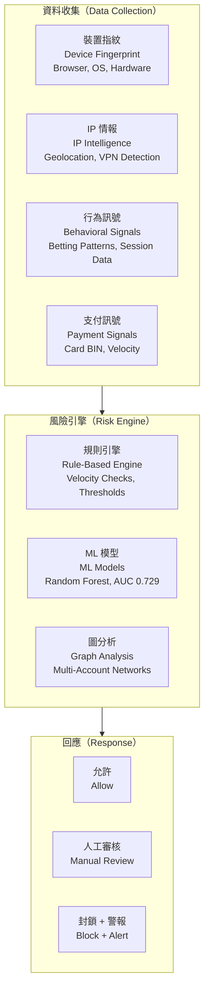

**供應商能力（Provider Capabilities）**:

| 供應商（Provider） | 訊號（Signals） | 專長（Specialization） |
|---|---|---|
| **SEON** | 900+ 第一方資料訊號 | iGaming 詐欺預防、AML 合規 |
| **Sift** | 跨產業 ML 模型 | 100% 詐欺保證，含財務支持 |

---

## 10. 資料安全架構（Data Security Architecture）

### PCI-DSS 4.0 合規（PCI-DSS 4.0 Compliance）

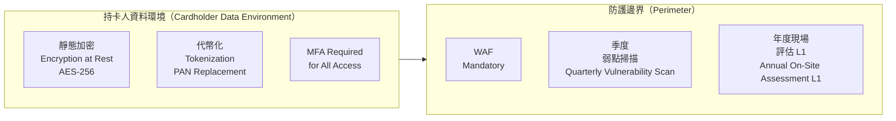

### GDPR 合規矩陣（GDPR Compliance Matrix）

| 玩家權利（Player Right） | 實現方式（Implementation） | 例外（Exception） |
|---|---|---|
| 存取（Access） | 應要求匯出玩家資料 | 無 |
| 更正（Rectification） | 更新個人資訊 | 無 |
| 刪除（Erasure，「被遺忘權」） | 刪除個人資料 | AML 記錄保留 5-7 年 |
| 資料可攜（Data Portability） | 機器可讀格式匯出 | 無 |
| 異議（Objection） | 退出處理 | 自我排除記錄全期保留 |

**違規罰款（Violation Penalties）**: 最高 **全球年營業額的 4%** 或 **EUR 2,000 萬**（取較高者）。

---

**文件版本（Document Version）**: 1.0.0
**最後更新（Last Updated）**: 2026-02-08
**維護者（Maintainer）**: 架構團隊
