# iGaming Platform Architecture Overview

> **Canonical Source**: [00-06_Solution_Overview.md](../../source/00_Foundation/guides/00-06_Solution_Overview.md)
> **Audience**: Architects, Backend Developers
> **Business Requirements**: [Solution_Overview.md](../../requirements/01_Player_Experience/Solution_Overview.md)
> **Last Synced**: 2026-02-08

---

## 1. Architecture Paradigm

Modern iGaming platforms have transitioned from monolithic to microservices architecture, the key technical choice for supporting **200,000+** concurrent users.

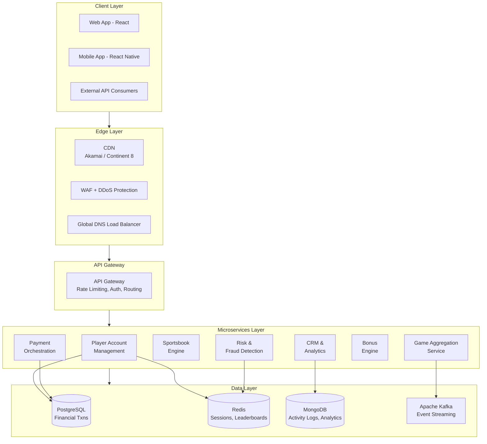

---

## 2. Multi-Tenant Database Isolation Strategies

Database architecture directly impacts security, cost, and operational efficiency. The industry employs three primary patterns:

| Pattern | Description | Isolation Level | Cost | Best For |
|---|---|---|---|---|
| **Shared Database & Schema** | Single DB, `tenant_id` column discriminator | Low | Lowest | Small operators, cost-sensitive |
| **Shared Database, Separate Schema** | One DB, each tenant gets own schema | Medium | Moderate | Mid-size platforms |
| **Fully Separate Database** | Dedicated DB per tenant | Highest | Highest | High-end clients, strict regulatory |

### Recommended Polyglot Persistence Stack

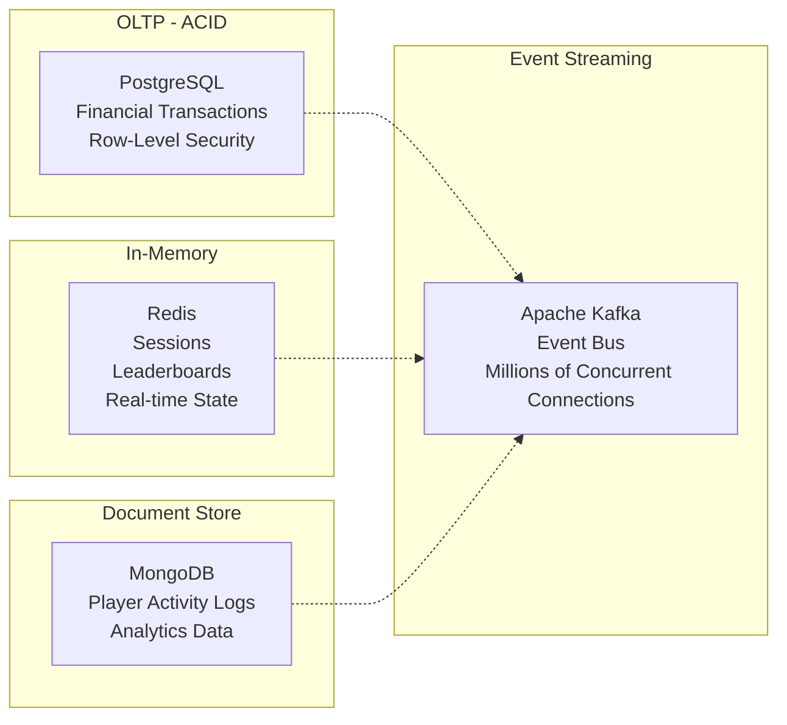

**PostgreSQL Row-Level Security (RLS)** is the standard implementation for tenant isolation:

```sql
-- Enable RLS on tenant-scoped table
ALTER TABLE player_wallet ENABLE ROW LEVEL SECURITY;

-- Create policy: each tenant only sees own data
CREATE POLICY tenant_isolation ON player_wallet
    USING (tenant_id = current_setting('app.current_tenant')::bigint);

-- Set tenant context per request
SET app.current_tenant = '12345';
SELECT * FROM player_wallet; -- Only returns tenant 12345 data
```

---

## 3. Technology Stack Selection

### Backend

| Technology | Use Case | Strengths |
|---|---|---|
| **Java / Spring Boot** | Enterprise core services | High availability, mature ecosystem, strong typing |
| **Node.js** | WebSocket services, real-time features | Event-driven, optimal for WebSocket |
| **Go** | High-performance microservices | Efficient concurrency, low memory footprint |

### Frontend

| Technology | Use Case |
|---|---|
| **React** | Complex UI development (dominant) |
| **Angular** | Enterprise management applications |

### Real-Time Communication

WebSocket protocol ensures:
- Sports betting odds updates: **< 500ms** latency
- Live dealer games: **< 100ms** latency

Combined with **Apache Kafka** for supporting millions of concurrent connections (reference: Disney+ Hotstar handled **25.3 million** simultaneous viewers with Kafka-based architecture).

---

## 4. Cloud Deployment and High Availability

### Container Orchestration

**AWS EKS** is the industry-preferred container orchestration platform, with multi-availability-zone deployment for high availability.

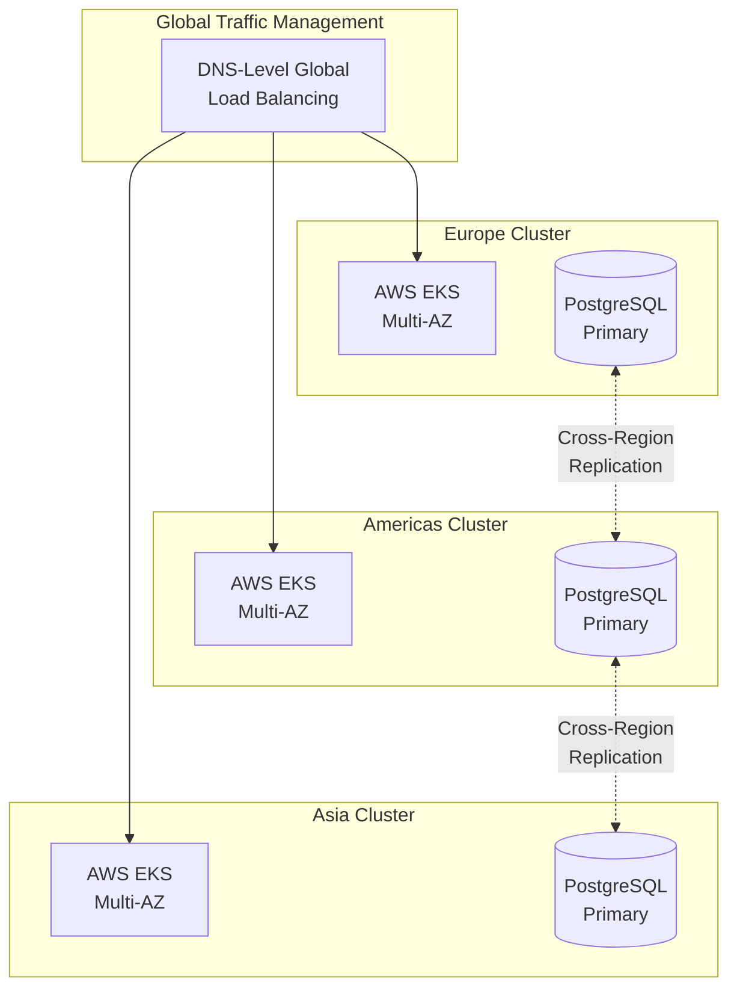

### Active-Active Architecture

Leading platforms deploy independent clusters across Europe, Americas, and Asia with DNS-level global load balancing.

**Disaster Recovery Targets**:

| Metric | Target |
|---|---|
| RTO (Recovery Time Objective) | 5-15 minutes |
| RPO (Recovery Point Objective) | Near-zero |

### CDN and Edge Computing

| Provider | Specialization |
|---|---|
| **Akamai** | iGaming-specific solutions with DDoS protection |
| **Continent 8** | Private network designed exclusively for gaming industry |

Edge computing enables bet processing logic closer to users while satisfying data localization regulatory requirements.

---

## 5. Wallet Integration Architecture

### Seamless Wallet (Industry Standard)

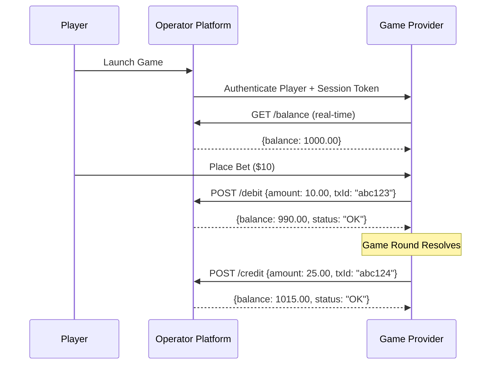

**Characteristics**:
- Player balance remains on operator platform
- Real-time processing per bet/win
- Supports multi-game simultaneous play
- Integration time: ~10 days

### Transfer Wallet (Legacy)

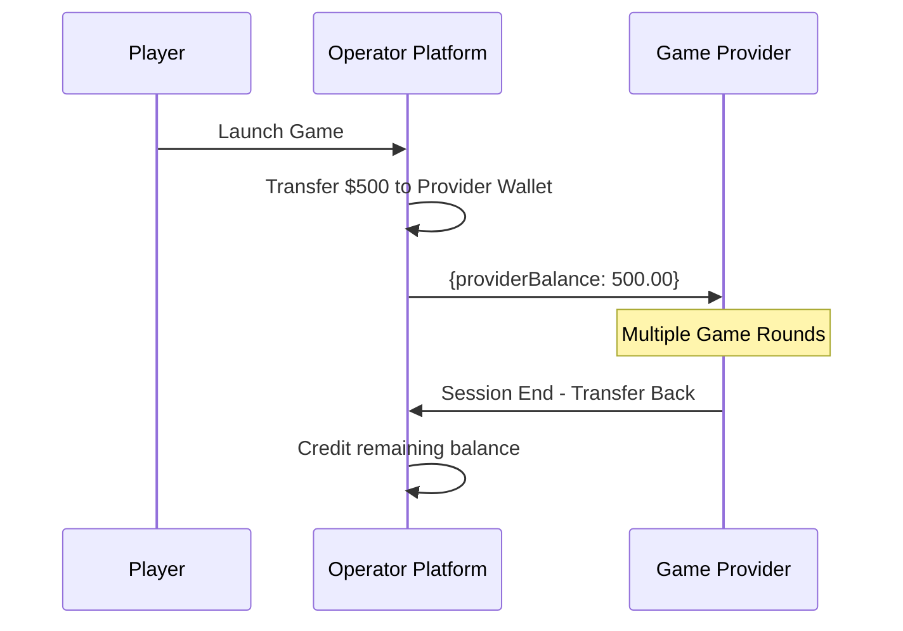

**Characteristics**:
- Funds transferred to provider-specific wallet
- Simpler integration (~2 days)
- Poorer player experience
- Risk of fund isolation on disconnect

---

## 6. Three-Party Reconciliation Architecture

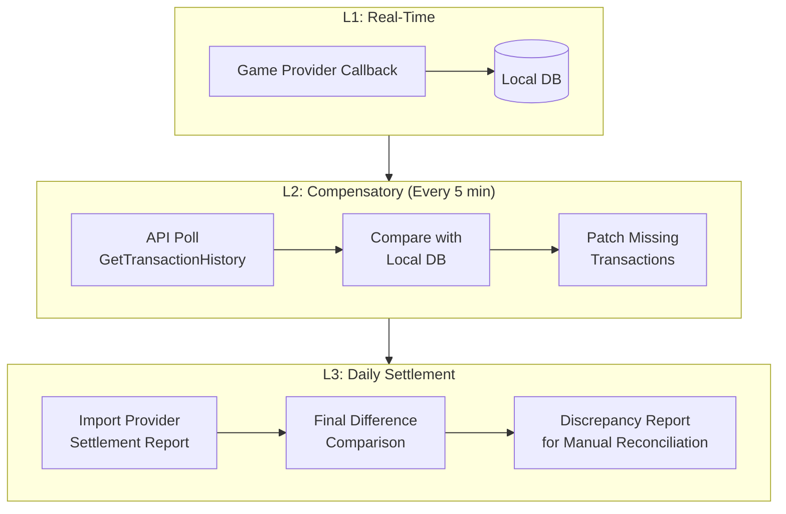

### Circuit Breaker Mechanism

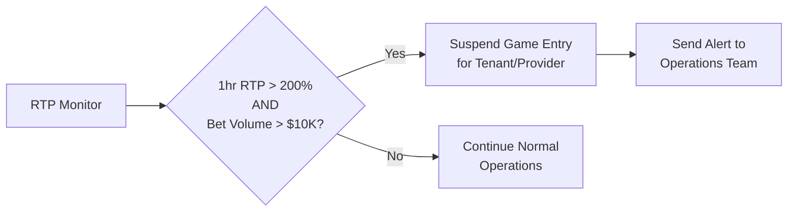

**Trigger Conditions**: When a single tenant or game provider's **RTP** exceeds threshold within a short window (e.g., 1-hour RTP > 200% with bet volume > $10,000), the system automatically suspends the game entry and dispatches alerts.

---

## 7. SaaS Tenant Billing Architecture

### Dynamic Cost Allocation

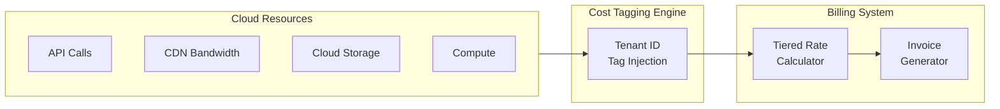

### Tiered Pricing Implementation

```python
# Tiered pricing calculation
def calculate_tenant_fee(base_fee: float, ggr: float) -> float:
    """
    Calculate monthly tenant fee using tiered GGR share.

    Tiers:
      GGR < $500K    -> 15%
      $500K - $1M    -> 12%
      > $1M          -> 10%
    """
    if ggr <= 500_000:
        share = ggr * 0.15
    elif ggr <= 1_000_000:
        share = 500_000 * 0.15 + (ggr - 500_000) * 0.12
    else:
        share = 500_000 * 0.15 + 500_000 * 0.12 + (ggr - 1_000_000) * 0.10
    return base_fee + share
```

### Non-Payment Suspension Escalation

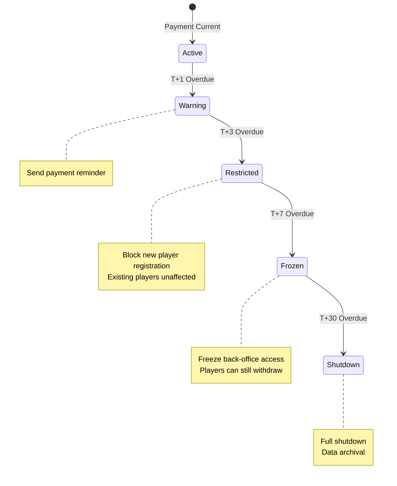

---

## 8. Payment Processing Architecture

### Multi-Acquirer Routing

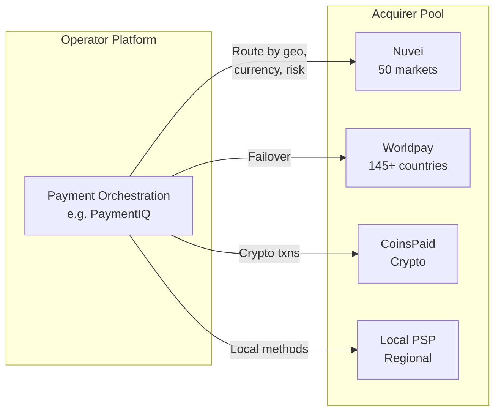

**Routing Strategies**:
- **Redundancy**: Avoid single point of failure
- **Load Balancing**: Distribute transaction volume across processors
- **Geographic Optimization**: Use local acquirers for higher approval rates
- **Risk Distribution**: Prevent total shutdown from single account termination

Target: **99%+ transaction success rate**

### Crypto Payment Integration

```json
{
  "provider": "CoinsPaid",
  "supported_currencies": ["BTC", "ETH", "USDT", "USDC", "LTC"],
  "fee_structure": {
    "crypto_to_crypto": "0.8%",
    "crypto_to_fiat": "1.5%"
  },
  "settlement": "real-time",
  "monthly_volume": "EUR 1B+",
  "integration": "REST API + Webhook callbacks"
}
```

---

## 9. Fraud Detection Technology Stack

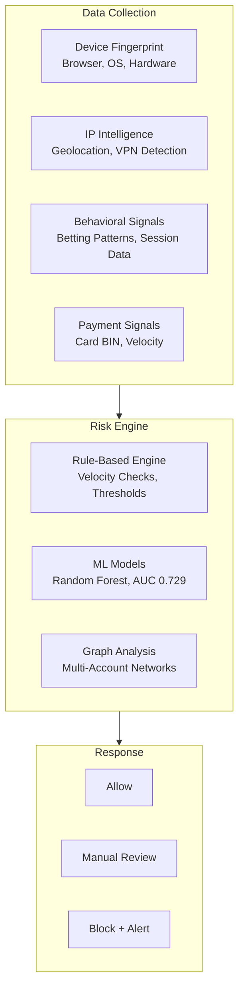

**Provider Capabilities**:

| Provider | Signals | Specialization |
|---|---|---|
| **SEON** | 900+ first-party data signals | iGaming fraud prevention, AML compliance |
| **Sift** | Cross-industry ML models | 100% fraud guarantee with financial backing |

---

## 10. Data Security Architecture

### PCI-DSS 4.0 Compliance

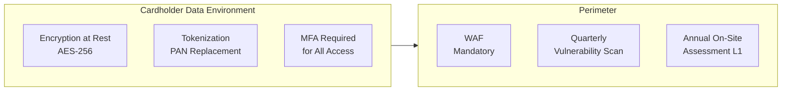

### GDPR Compliance Matrix

| Player Right | Implementation | Exception |
|---|---|---|
| Access | Export player data on request | None |
| Rectification | Update personal information | None |
| Erasure ("Right to be Forgotten") | Delete personal data | AML records retained 5-7 years |
| Data Portability | Machine-readable export | None |
| Objection | Opt-out of processing | Self-exclusion records maintained for full period |

**Violation Penalties**: Up to **4% of global annual turnover** or **EUR 20M** (whichever is greater).

---

**Document Version**: 1.0.0
**Last Updated**: 2026-02-08
**Maintainer**: Architecture Team
