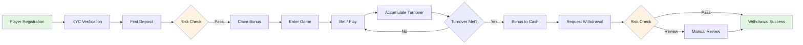

# iGaming System Overview

> **Canonical Source**: [00-01_Quickstart.md](../../source-archive/00_Foundation/00-01_Quickstart.md)
> **Audience**: Architects, Backend Engineers, DevOps Engineers
> **Business Requirements**: [Platform_Overview.md](../../requirements/01_Player_Experience/Platform_Overview.md)
> **Last Synced**: 2026-02-08

---

## 1. System Architecture Overview

The iGaming platform is built around five core technical subsystems. This document provides a technical quickstart for engineers joining the team.

---

## 2. Wallet and Bettable Balance

### 2.1 Core Formula

```
Bettable Balance = Cash Balance - Locked Amount - In-Progress Bets
```

### 2.2 Key Scenarios

- **Bet Placement**: Check bettable balance --> Lock funds --> Deduct
- **Game Settlement**: Release lock --> Settle win/loss --> Update balance

### 2.3 References

- SSOT: [02-06 Wallet Architecture -- Playable Balance](../../source-archive/02_Finance_Center/02-06_Wallet_Architecture.md#22-playable-balance-formula)

---

## 3. Turnover Calculation (Valid Bets)

### 3.1 Algorithm

```
Valid Bet = Bet Amount x Validity Ratio x Game Type Weight

Examples:
- Slots: 100% turnover
- Baccarat: 95% turnover (tie exception)
- Sports Betting: Only settled actual risk amount
```

### 3.2 Business Integration Points

| Integration | Turnover Role |
|-------------|---------------|
| Promotions | "Deposit 100, get 50 bonus, 20x turnover" --> need 3,000 valid bets |
| VIP Tiers | Monthly valid bet >= 100,000 --> VIP upgrade |
| AML Check | Must complete 1x turnover after deposit before withdrawal |

### 3.3 Key Scenarios

- **Bonus Issuance**: Player claims bonus --> bind turnover requirement
- **VIP Upgrade**: End-of-month valid bet aggregation --> calculate tier
- **Risk Check**: Deposit with no turnover followed by withdrawal --> reject

### 3.4 References

- SSOT: [03-04 Turnover Calculation -- Valid Bet Algorithm](../../source-archive/03_Game_Center/03-04_Turnover_Calculation.md#有效投注算法)

---

## 4. Token Verification and API Security

### 4.1 Token Verification Flow

```
1. Game Provider (GP) requests Token (Player ID + Timestamp + Signature)
2. Platform verifies HMAC signature
3. Check Token expiry (5 minutes TTL)
4. Check Token replay (prevent replay attacks)
5. Return Token + Player Balance
```

### 4.2 Idempotency Design (Prevent Duplicate Deductions)

```
Each GP request must carry a Unique Request ID.
Platform uses Redis + DB + Distributed Lock (three-layer protection).

Flow:
- First Debit request  --> Success deduction --> Record Request ID
- Duplicate Debit request --> Detect existing Request ID --> Return original result
```

### 4.3 Three-Layer Verification Rationale

| Layer | Purpose | Coverage |
|-------|---------|----------|
| Redis | Fast lookup (handles 99% of cases) | Primary cache |
| DB | Fallback when Redis is unavailable | Durability guarantee |
| Distributed Lock | Prevents duplicate deductions under extreme concurrency | Race condition protection |

This is defensive programming -- even if Redis fails, fund safety is guaranteed.

### 4.4 SmartAdmin Idempotency Implementation

```java
@Service
@RequiredArgsConstructor
public class WalletIdempotencyService {

    private final WalletTransactionDao transactionDao;
    private final WalletIdempotencyManager idempotencyManager;
    private final RedisTemplate<String, String> redisTemplate;

    private static final String IDEMPOTENCY_KEY_PREFIX = "wallet:idempotency:";

    /**
     * Check idempotency using three-layer protection.
     * Returns cached result if transaction already processed.
     */
    public Option<TransactionResult> checkIdempotency(String txId) {
        // Layer 1: Redis cache lookup (fastest)
        String cacheKey = IDEMPOTENCY_KEY_PREFIX + txId;
        String cached = redisTemplate.opsForValue().get(cacheKey);
        if (cached != null) {
            return Option.of(JSON.parseObject(cached, TransactionResult.class));
        }

        // Layer 2: Database lookup (fallback)
        return Option.of(transactionDao.selectByTxId(txId))
            .map(entity -> {
                TransactionResult result = SmartBeanUtil.copy(entity, TransactionResult.class);
                // Repopulate cache for future lookups
                redisTemplate.opsForValue().set(cacheKey, JSON.toJSONString(result),
                    Duration.ofHours(1));
                return result;
            });
    }

    /**
     * Process debit with distributed lock protection.
     * Delegates to Manager for transactional operations.
     */
    public ResponseDTO<TransactionResult> processDebit(DebitRequestForm form) {
        // Check idempotency first
        Option<TransactionResult> existing = checkIdempotency(form.getTxId());
        if (existing.isDefined()) {
            return ResponseDTO.ok(existing.get());
        }

        // Delegate to Manager for transaction with distributed lock
        return idempotencyManager.executeDebitWithLock(form);
    }
}
```

### 4.4 References

- SSOT: [03-03 Seamless Wallet Analysis -- Token Verification](../../source-archive/03_Game_Center/03-03_Seamless_Wallet_Analysis.md#token-驗證流程)

---

## 5. Multi-Tenant Architecture and Data Isolation

### 5.1 Tenant Hierarchy

```
Level 1: Platform
  └─ Level 2: Brand / Tenant
       └─ Level 3: Agent
            └─ Level 4: Player
```

### 5.2 Data Isolation Strategy

| Layer | Isolation Method | Implementation |
|-------|-----------------|----------------|
| Database | Independent Schema per Tenant | PostgreSQL Schema isolation |
| Cache | Redis Key prefix includes Tenant ID | `{tenantId}:{key}` pattern |
| Application | ThreadLocal injection of Tenant Context | Request filter sets context |
| API | JWT Token contains Tenant ID | Token validation extracts tenant |

### 5.3 Multi-Tenant Database Schema

```sql
-- Core tenant management table
CREATE TABLE t_tenant (
    id              BIGSERIAL PRIMARY KEY,
    tenant_code     VARCHAR(50) NOT NULL UNIQUE,
    tenant_name     VARCHAR(200) NOT NULL,
    schema_name     VARCHAR(100) NOT NULL UNIQUE,
    status          SMALLINT NOT NULL DEFAULT 1,
    config_json     JSONB,
    created_at      TIMESTAMP NOT NULL DEFAULT NOW(),
    updated_at      TIMESTAMP NOT NULL DEFAULT NOW(),
    deleted         BOOLEAN NOT NULL DEFAULT FALSE
);

CREATE INDEX idx_tenant_status ON t_tenant(status) WHERE deleted = FALSE;
CREATE INDEX idx_tenant_code ON t_tenant(tenant_code) WHERE deleted = FALSE;

-- Wallet transaction table with tenant isolation
CREATE TABLE t_wallet_transaction (
    id              BIGSERIAL PRIMARY KEY,
    tenant_id       BIGINT NOT NULL,
    player_id       BIGINT NOT NULL,
    tx_id           VARCHAR(100) NOT NULL,
    tx_type         VARCHAR(20) NOT NULL,
    amount          DECIMAL(18, 4) NOT NULL,
    balance_before  DECIMAL(18, 4) NOT NULL,
    balance_after   DECIMAL(18, 4) NOT NULL,
    status          SMALLINT NOT NULL DEFAULT 1,
    created_at      TIMESTAMP NOT NULL DEFAULT NOW(),
    CONSTRAINT uk_wallet_tx_id UNIQUE (tenant_id, tx_id)
);

-- Enable Row-Level Security for tenant isolation
ALTER TABLE t_wallet_transaction ENABLE ROW LEVEL SECURITY;

CREATE POLICY tenant_isolation_policy ON t_wallet_transaction
    USING (tenant_id = current_setting('app.current_tenant')::bigint);

CREATE INDEX idx_wallet_tx_player ON t_wallet_transaction(tenant_id, player_id, created_at DESC);
CREATE INDEX idx_wallet_tx_status ON t_wallet_transaction(tenant_id, status) WHERE status != 1;
```

### 5.3 Key Scenarios

- **Brand Creation**: Create Tenant --> Initialize Schema --> Configure games
- **API Call**: Parse JWT --> Inject Tenant Context --> Query data (auto-filtered by Tenant)
- **Reporting**: Data isolated by Tenant --> Independent reports per brand

### 5.4 Performance Impact

| Component | Overhead | Notes |
|-----------|----------|-------|
| Schema Isolation | Negligible | Native PostgreSQL support |
| Cache Layer | Negligible | Redis key prefix cost is minimal |
| Application Layer | < 1ms | ThreadLocal injection |
| **Total Overhead** | **< 5%** | Confirmed by load testing |

### 5.5 References

- SSOT: [06-01 Multi-Tenant -- Isolation Strategy](../../source-archive/06_Platform_Governance/06-01_Multi_Tenant.md#隔離策略)

---

## 6. Risk Control Rule Engine

### 6.1 Architecture Components

```
Rule Engine (LiteFlow / Drools)
  ├─ Deposit Risk: Daily deposit count/amount limits
  ├─ Withdrawal Risk: KYC verification, AML checks
  ├─ Betting Risk: Hedging detection, abnormal betting patterns
  └─ Promotion Risk: Bonus abuse detection

Checkpoints:
- Pre-Deposit: Frequency check --> Pass/Reject
- Pre-Withdrawal: Turnover check --> Pass/Pending Review/Reject
- On-Bet: Real-time hedging detection --> Pass/Reject
- Promotion Claim: Eligibility check --> Pass/Reject
```

### 6.2 Risk Scoring Decision Flow

```
Trigger Check --> Rule Engine calculates risk score --> Decision
- Low Risk  (0-30):  Auto-approve
- Medium Risk (31-70): Manual review
- High Risk  (71-100): Auto-reject
```

### 6.3 References

- SSOT: [05-01 Risk Framework -- Rule Engine](../../source-archive/05_Risk_Control/05-01_Risk_Framework.md#規則引擎)

---

## 7. End-to-End Player Journey (Technical Flow)



**Core Concepts Mapped to Flow**:
1. **Wallet** -- Steps C (Deposit), E (Bonus), J (Convert), M (Withdrawal)
2. **Turnover** -- Steps G (Betting), H (Accumulation), I (Threshold Check)
3. **Token Verification** -- Step F (Enter Game)
4. **Multi-Tenant** -- Step A (Tenant assignment at registration)
5. **Risk Control** -- Steps D (Deposit risk), L (Withdrawal risk)

---

## 8. Role-Based Technical Reading Paths

### Backend Engineers

| Priority | Topic | Document |
|----------|-------|----------|
| P0 | Wallet Architecture | [02-06 Wallet Architecture](../../source-archive/02_Finance_Center/02-06_Wallet_Architecture.md) |
| P0 | Seamless Wallet API | [03-03 Seamless Wallet Analysis](../../source-archive/03_Game_Center/03-03_Seamless_Wallet_Analysis.md) |
| P0 | Turnover Calculation | [03-04 Turnover Calculation](../../source-archive/03_Game_Center/03-04_Turnover_Calculation.md) |
| P1 | Risk Engine | [05-01 Risk Framework](../../source-archive/05_Risk_Control/05-01_Risk_Framework.md) |
| P1 | Multi-Tenant Architecture | [06-01 Multi-Tenant](../../source-archive/06_Platform_Governance/06-01_Multi_Tenant.md) |

### Architects

| Priority | Topic | Document |
|----------|-------|----------|
| P0 | Solution Overview | [00-01 Quickstart](../../source-archive/00_Foundation/00-01_Quickstart.md) |
| P0 | Multi-Tenant Architecture | [06-01 Multi-Tenant](../../source-archive/06_Platform_Governance/06-01_Multi_Tenant.md) |
| P0 | Data Security | [06-05 Data Security](../../source-archive/06_Platform_Governance/06-05_Data_Security.md) |
| P1 | Deployment Architecture | [09-01 Deployment](../../source-archive/09_Technical_Infrastructure/09-01_Deployment.md) |
| P1 | API Gateway | [09-02-01 Gateway Core](../../source-archive/09_Technical_Infrastructure/09-02-01_Gateway_Core.md) |

### DevOps Engineers

| Priority | Topic | Document |
|----------|-------|----------|
| P0 | Deployment | [09-01 Deployment](../../source-archive/09_Technical_Infrastructure/09-01_Deployment.md) |
| P0 | Maintenance | [09-05 Maintenance](../../source-archive/09_Technical_Infrastructure/09-05_Maintenance.md) |
| P1 | API Gateway Config | [09-02-01 Gateway Core](../../source-archive/09_Technical_Infrastructure/09-02-01_Gateway_Core.md) |

### QA Engineers

| Priority | Topic | Document |
|----------|-------|----------|
| P0 | QA Standards | [09-04 QA Standards](../../source-archive/09_Technical_Infrastructure/09-04_QA_Standards.md) |
| P0 | Wallet Edge Cases | [03-01 Game Integration Standard](../../source-archive/03_Game_Center/03-01_Game_Integration_Standard.md) |
| P1 | Risk Test Scenarios | [05-02 Fraud Detection](../../source-archive/05_Risk_Control/05-02_Fraud_Detection.md) |

---

## 9. Onboarding Timeline

### Day 1 (2 hours)
- Read this overview (10 minutes)
- Deep-dive into 2 of the 5 core concepts (1 hour)
- Browse business flow diagrams (20 minutes)
- Read P0 documents for your role (30 minutes)

### Week 1 (10 hours)
- Complete deep reading of all 5 core concepts
- Read business process documentation
- Read all P0 + P1 documents for your role
- Set up and run local development environment

### Month 1 (40 hours)
- Read the complete documentation tree
- Implement your first feature module
- Participate in code reviews to understand production code
- Become a domain expert within the team

---

## 10. Version History

| Version | Date | Changes |
|---------|------|---------|
| 2.0.0 | 2026-02-03 | v2 restructured -- redesigned navigation, focused on 5 core concepts |
| 1.0.0 | 2026-01-27 | Initial version |
