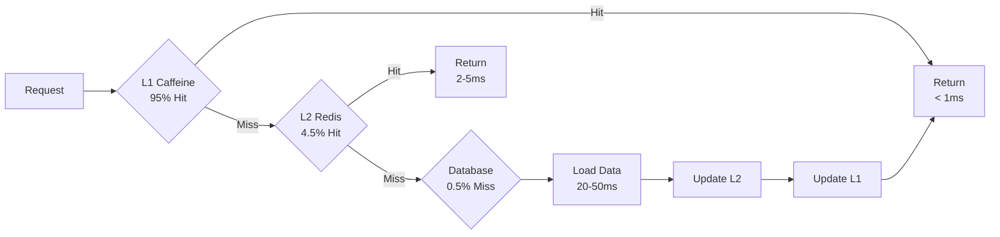
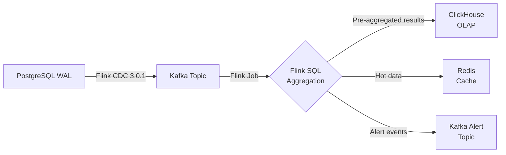

# Technology Stack

> **Canonical Source**: [source/00_Foundation/guides/00-09_Technology_Stack.md](../../source/00_Foundation/guides/00-09_Technology_Stack.md)
> **Audience**: Architects, Backend Developers, DevOps Engineers
> **Business Requirements**: N/A (pure technical document, no requirements counterpart)
> **Last Synced**: 2026-02-08

---

## Technology Selection Principles

### 1. Selection Decision Criteria

**Mandatory Requirements**:
- Performance: Support high concurrency (10K+ TPS), low latency (<100ms P95)
- Scalability: Horizontal scaling capability, stateless design
- Reliability: 99.95%+ availability, disaster recovery capability
- Security: PCI DSS, GDPR, SOC 2 compliance
- Community Support: Active community, long-term maintenance, sufficient documentation
- Talent Availability: Mainstream technology, ease of recruitment, reasonable learning curve

### 2. Evaluation Dimension Weights

| Dimension | Weight | Description |
|-----------|--------|-------------|
| Performance | 30% | Throughput, latency, resource efficiency |
| Maturity | 25% | Production validation, stability, case count |
| Cost | 15% | Licensing fees, operations cost, personnel cost |
| Ecosystem | 15% | Community, toolchain, integration capability |
| Security | 10% | Vulnerability records, compliance, auditing |
| Maintainability | 5% | Code quality, debugging tools, monitoring |

### 3. Selection Decision Process

```text
1. Requirements Analysis -> 2. Candidate Technology Research -> 3. POC Validation -> 4. Scoring Decision -> 5. Architecture Review -> 6. Pilot Deployment
```

---

## Core Technology Stack Overview

### Technology Architecture Full View

```text
+---------------------------------------------------------+
|                   Frontend Layer                          |
|   Web: React 18 + TypeScript + Vite                     |
|   Mobile: React Native 0.73 / Flutter 3.16              |
|   CMS: Next.js 14 (SSR/ISR)                             |
+------------+--------------------------------------------+
             |
+------------v--------------------------------------------+
|                   API Gateway                             |
|   Kong Gateway 3.5 + Rate Limiting + WAF                |
|   NGINX Plus (Backup)                                    |
+------------+--------------------------------------------+
             |
+------------v--------------------------------------------+
|                  Backend Services                         |
|   Java 21 (Spring Boot 3.2) - Core Business             |
|   Node.js 20 (Fastify 4) - Real-time Services           |
|   Go 1.22 - High Performance (Risk Engine, Payment GW)  |
|   Python 3.12 (FastAPI) - ML Risk Models                |
+------------+--------------------------------------------+
             |
+------------v--------------------------------------------+
|                  Data & Message Layer                     |
|   PostgreSQL 16 (Primary) + Citus (Sharding)            |
|   Redis 7.2 (Cache + Session + Rate Limiting)           |
|   Apache Kafka 3.6 (Event Stream)                       |
|   Elasticsearch 8.11 (Audit Logs + Search)              |
|   ClickHouse 23.12 (OLAP Analytics)                     |
+------------+--------------------------------------------+
             |
+------------v--------------------------------------------+
|              Infrastructure & Operations                  |
|   Kubernetes 1.29 + Helm 3.13                           |
|   Docker 25.0                                            |
|   Terraform 1.7 (IaC)                                    |
|   ArgoCD 2.9 (GitOps)                                    |
|   Prometheus + Grafana (Monitoring)                      |
|   Datadog / New Relic (APM)                              |
+---------------------------------------------------------+
```

---

## Backend Technology Stack

### 1. Primary Development Languages

#### Java 21 (LTS) + Spring Boot 3.2 - Recommended

**Use Cases**:
- Core business services (Player, Wallet, Transaction, Activity)
- Complex business logic (Turnover Calculation, Reconciliation System)
- High-consistency services

**Technology Stack**:
```yaml
Language: Java 21 (LTS until 2029)
Framework: Spring Boot 3.2.x
  - Spring Security 6.2 (Authentication & Authorization)
  - Spring Data JPA 3.2 (ORM)
  - Spring Cloud 2023.0.x (Microservices)
  - Spring Kafka 3.1 (Event-driven)

DI: Spring Framework 6.1
ORM: Hibernate 6.4 + QueryDSL 5.1
API Docs: SpringDoc OpenAPI 2.3
Serialization: Jackson 2.16 + Protobuf 3.25
Validation: Jakarta Validation 3.0
Scheduling: Spring Scheduler + Quartz 2.3
Distributed Lock: Redisson 3.26
```

**Selection Rationale**:
- Mature ecosystem, active community, abundant talent pool
- Strong type system, compile-time checks, refactoring-friendly
- Rich enterprise features (transactions, security, caching)
- Spring Boot auto-configuration, out-of-the-box
- Java 21 performance improvements (Virtual Threads, G1GC optimization)

**Version Requirements**:
- Java: >= 21 (recommended 21 LTS)
- Spring Boot: >= 3.2.0
- Spring Cloud: >= 2023.0.0

---

#### Node.js 20 LTS + Fastify 4 - Recommended

**Use Cases**:
- Real-time communication services (WebSocket, SSE)
- Lightweight API services (Game Lobby, Frontend BFF)
- Rapid prototyping

**Technology Stack**:
```yaml
Runtime: Node.js 20 LTS (until 2026-04)
Framework: Fastify 4.25 (High-performance HTTP)
  - @fastify/websocket (WebSocket support)
  - @fastify/jwt (JWT authentication)
  - @fastify/cors (CORS)
  - @fastify/helmet (Security headers)

ORM: Prisma 5.8 (recommended) / TypeORM 0.3
Cache: ioredis 5.3
Message Queue: kafkajs 2.2
Validation: zod 3.22 / joi 17.12
Testing: Vitest 1.2 + Supertest 6.3
```

**Selection Rationale**:
- Single-threaded non-blocking I/O, suitable for high concurrency
- Fastify performance exceeds Express (3-5x)
- Excellent TypeScript support
- Rich npm ecosystem, high development efficiency
- Frontend-backend language unification, talent sharing

**Performance Benchmarks**:
- Throughput: ~50K req/s (single core)
- Latency: <10ms P99 (simple queries)

---

#### Go 1.22 - Recommended

**Use Cases**:
- **High-performance components**: Payment Gateway, Risk Engine
- **Low-latency services**: Rate Limiting, Circuit Breaking, Load Balancing
- **System tools**: Data Synchronization, Reconciliation Scripts

**Technology Stack**:
```yaml
Language: Go 1.22
Framework: Gin 1.9 / Fiber 2.52
ORM: GORM 1.25 + sqlx 1.3
Cache: go-redis 9.4
Message Queue: confluent-kafka-go 2.3
Config: Viper 1.18
Logging: zap 1.26 + lumberjack 2.2
Testing: testify 1.8
```

**Selection Rationale**:
- Compiled language, native concurrency (goroutine)
- Low memory footprint (< Java/Node.js)
- Fast startup (<1 second)
- Clean syntax, easy to maintain
- Static typing, compile-time checks

**Performance Advantages**:
- Startup time: ~500ms (vs Java 5-10s)
- Memory footprint: ~50MB (vs Java 200MB+)
- Concurrency: Million-level goroutines

---

#### Python 3.12 + FastAPI - Specialized Scenarios

**Use Cases**:
- **ML Risk Models**: Fraud detection, anomalous turnover identification
- **Data Analysis**: BI reports, data mining
- **Automation Scripts**: Data migration, batch processing

**Technology Stack**:
```yaml
Language: Python 3.12
Web Framework: FastAPI 0.109
ML Frameworks:
  - scikit-learn 1.4 (Traditional ML)
  - XGBoost 2.0 / LightGBM 4.3 (GBDT)
  - TensorFlow 2.15 / PyTorch 2.2 (Deep Learning)
Data Processing: pandas 2.2 + NumPy 1.26
ORM: SQLAlchemy 2.0
Cache: redis-py 5.0
```

---

### 2. Microservices Architecture

#### Spring Cloud 2023.0.x

**Core Components**:
```yaml
Service Registry: Consul 1.17 (recommended) / Eureka 2.0
Config Center: Spring Cloud Config + Consul KV
Service Gateway: Spring Cloud Gateway 4.1
Load Balancing: Spring Cloud LoadBalancer
Circuit Breaking/Rate Limiting: Resilience4j 2.2
Distributed Tracing: Micrometer Tracing + Zipkin 2.24
```

**vs Kubernetes Service Mesh**:

| Dimension | Spring Cloud | Istio Service Mesh |
|-----------|-------------|-------------------|
| Language Binding | Java Only | Language Agnostic |
| Performance Overhead | Low | Medium (Sidecar proxy) |
| Learning Curve | Steep | Steeper |
| Observability | Good | Excellent |
| Community | Java Community | CNCF |

**Recommended Strategy**:
- **Spring Cloud**: Pure Java microservices, team familiar with Spring
- **Istio**: Multi-language services, cloud-native architecture, future trend

---

### 3. API Design Standards

#### RESTful API - Primary

**Specifications**:
- **HTTP Methods**: GET (query), POST (create), PUT (replace), PATCH (partial update), DELETE (delete)
- **Path Naming**: `/api/v1/{resource}`, `/api/v1/{resource}/{id}`
- **Versioning Strategy**: URL versioning (`/v1/`, `/v2/`)
- **Response Format**: JSON (unified wrapper)

**Unified Response Format**:
```json
{
  "code": 1000,
  "message": "Success",
  "data": { "..." },
  "timestamp": "2026-01-27T10:00:00Z",
  "trace_id": "abc-123-def"
}
```

#### GraphQL (Optional)

**Use Cases**:
- Frontend BFF (Backend for Frontend)
- Complex relational queries (reduce over-fetching)
- Mobile API (reduce request count)

**Technology Selection**:
- Java: Spring GraphQL 1.2
- Node.js: Apollo Server 4.x

**Recommended Strategy**:
- **Internal API**: RESTful (standardized, cache-friendly)
- **Mobile API**: GraphQL (higher flexibility)

---

## Frontend Technology Stack

### 1. Web Frontend

#### React 18 + TypeScript + Vite - Recommended

**Technology Stack**:
```yaml
Language: TypeScript 5.3
Framework: React 18.2
Build Tool: Vite 5.0 (recommended) / Webpack 5.90
State Management: Zustand 4.4 (recommended) / Redux Toolkit 2.0
Routing: React Router 6.21
UI Library:
  - Ant Design 5.12 (Admin Backend)
  - Material-UI 5.15 (Player Frontend)
  - Tailwind CSS 3.4 (Custom UI)
Forms: React Hook Form 7.49 + Zod 3.22
Requests: TanStack Query 5.17 (React Query) + Axios 1.6
SSR Framework: Next.js 14.1 (SEO-friendly)
Testing: Vitest 1.2 + React Testing Library 14.1
```

#### Vue 3 (Alternative)

**Technology Stack**:
```yaml
Framework: Vue 3.4 + Composition API
Build: Vite 5.0
State Management: Pinia 2.1
Routing: Vue Router 4.2
UI Library: Element Plus 2.5 / Ant Design Vue 4.1
```

---

### 2. Mobile

#### React Native 0.73 - Recommended

**Technology Stack**:
```yaml
Framework: React Native 0.73
Language: TypeScript 5.3
Navigation: React Navigation 6.1
State: Zustand 4.4 / Redux Toolkit 2.0
UI Library: React Native Paper 5.12 / NativeBase 3.4
Hot Updates: CodePush (Microsoft)
Build: EAS Build (Expo)
```

#### Flutter 3.16 (Alternative)

**Technology Stack**:
```yaml
Framework: Flutter 3.16
Language: Dart 3.2
State Management: Riverpod 2.4 / Bloc 8.1
```

**Recommended Strategy**:
- **React Native**: Team has React experience, rapid iteration
- **Flutter**: Pursuit of ultimate performance, dedicated mobile team

---

### 3. CMS Admin Backend

#### Next.js 14 + React 18 - Recommended

**Technology Stack**:
```yaml
Framework: Next.js 14.1 (App Router)
Rendering Strategy:
  - SSR (Server-Side Rendering) - SEO-critical pages
  - ISR (Incremental Static Regeneration) - Content pages
  - CSR (Client-Side Rendering) - Admin backend
Backend: Next.js API Routes / tRPC 10.45
Authentication: NextAuth.js 4.24
Deployment: Vercel / Self-hosted
```

---

## Data Storage Technology

### 1. Relational Database

#### PostgreSQL 16 + Citus - Recommended

**Use Cases**:
- **Primary Database**: Player, Wallet, Transaction, Game
- **OLTP Business**: High-concurrency read/write, transactional consistency
- **Horizontal Scaling**: Citus sharding (single table >100M rows)

**Technology Stack**:
```yaml
Database: PostgreSQL 16.1
Sharding Extension: Citus 12.1 (Distributed PostgreSQL)
Connection Pool: PgBouncer 1.21
Backup: pgBackRest 2.49 + WAL-G 3.0
Monitoring: pg_stat_statements + Prometheus Exporter
High Availability: Patroni 3.2 + etcd 3.5
```

**Selection Rationale**:
- ACID transactional integrity (financial-grade)
- JSON/JSONB support (flexible data structures)
- Rich index types (B-Tree, GIN, BRIN)
- Window functions, CTE (complex analytical queries)
- Citus sharding extension (TB-level data)
- Open source, active community

**Version Requirements**:
- PostgreSQL: >= 16.0
- Citus: >= 12.0

**vs MySQL 8.0**:

| Dimension | PostgreSQL | MySQL |
|-----------|-----------|-------|
| Transaction Isolation | 4-level full support | Repeatable Read default |
| JSON Support | JSONB efficient | JSON native |
| Window Functions | Complete | Complete |
| Sharding Solution | Citus | Vitess / ShardingSphere |
| Replication Lag | Low | Low |
| Ecosystem | Java/Python/Go | PHP/Java |

---

### 2. Cache Layer

#### Redis 7.2 - Recommended

**Use Cases**:
- Hot data caching (player sessions, wallet balance)
- Distributed locks (Redlock algorithm)
- Rate limiting (Token Bucket, Sliding Window)
- Session storage
- Message queue (Stream)
- Leaderboards (Sorted Set)

**Technology Stack**:
```yaml
Cache: Redis 7.2 (single-thread optimized)
High Availability: Redis Sentinel 7.2 / Redis Cluster
Persistence: AOF (always) + RDB (hourly)
Clients:
  - Java: Redisson 3.26
  - Node.js: ioredis 5.3
  - Go: go-redis 9.4
Monitoring: RedisInsight + Prometheus Exporter
```

**Configuration Recommendations**:
```
# redis.conf
maxmemory: 80% system memory
maxmemory-policy: allkeys-lru
appendonly: yes
appendfsync: everysec
```

#### JetCache 2.7 + Redisson 3.26 - Recommended

**Use Cases**:
- **Multi-level caching**: L1 (Caffeine JVM cache) + L2 (Redis distributed cache)
- **Distributed locks**: Player wallet concurrent updates (replaces `SELECT ... FOR UPDATE`)
- **Rate limiters**: Token Bucket / Sliding Window (API rate limiting)
- **Bloom filters**: Prevent cache penetration (check player/order existence)

**Technology Stack**:
```yaml
Cache Framework: JetCache 2.7.5
  - Local Cache: Caffeine 3.1.8 (L1)
  - Remote Cache: Lettuce 6.3.0 (Redis L2)
  - Serialization: Kryo 5.5.0 (High-performance)
  - Annotation Support: @Cached, @CacheInvalidate, @CacheUpdate

Distributed Tools: Redisson 3.26.0
  - Distributed Lock: RLock (Watchdog auto-renewal)
  - Rate Limiter: RRateLimiter (Token Bucket)
  - Bloom Filter: RBloomFilter (Guava compatible)
  - Pub/Sub: RTopic (cache invalidation notification)
```

**Two-layer Cache Architecture**:



**JetCache Configuration Example**:

```yaml
# application.yml
jetcache:
  statIntervalMinutes: 15
  areaInCacheName: false
  local:
    default:
      type: caffeine
      keyConvertor: fastjson2
      expireAfterWriteInMillis: 100000  # L1 TTL: 100s
      limit: 10000  # Max 10000 entries
  remote:
    default:
      type: redis.lettuce
      keyConvertor: fastjson2
      valueEncoder: kryo
      valueDecoder: kryo
      expireAfterWriteInMillis: 3600000  # L2 TTL: 1h
      uri: redis://redis-master:6379
```

**Code Example - JetCache @Cached Annotation**:

```java
// Service layer using JetCache two-layer cache
@Cached(
    name = "wallet:balance:",
    key = "#tenantId + ':' + #playerId",
    expire = 3600,      // L2 TTL: 1h
    localExpire = 100,  // L1 TTL: 100s
    cacheType = CacheType.BOTH  // L1 + L2 dual-layer cache
)
public Option<WalletBalanceVO> getBalance(
    String tenantId,
    String playerId
) {
    return walletDao.selectById(tenantId, playerId)
        .map(WalletBalanceVO::from);
}

// Cache invalidation when updating balance
@CacheInvalidate(
    name = "wallet:balance:",
    key = "#tenantId + ':' + #playerId"
)
public void updateBalance(
    String tenantId,
    String playerId,
    BigDecimal amount
) {
    walletDao.updateBalance(tenantId, playerId, amount);
}
```

**Code Example - Redisson Distributed Lock**:

```java
// Manager layer using Redisson distributed lock
@Service
@RequiredArgsConstructor
public class WalletManager {
    private final RedissonClient redissonClient;
    private final WalletDao walletDao;

    @Transactional(rollbackFor = Throwable.class)
    public ResponseDTO<Void> deduct(
        String tenantId,
        String playerId,
        BigDecimal amount
    ) {
        String lockKey = "wallet:lock:" + tenantId + ":" + playerId;
        RLock lock = redissonClient.getLock(lockKey);

        try {
            // tryLock: wait 3s, lease 5s, Watchdog auto-renewal
            boolean acquired = lock.tryLock(3, 5, TimeUnit.SECONDS);

            if (!acquired) {
                return ResponseDTO.userErrorParam("Lock acquisition timeout, please retry");
            }

            // Optimistic lock retry (version field)
            int retryCount = 0;
            while (retryCount < 3) {
                Wallet wallet = walletDao.selectById(tenantId, playerId);

                if (wallet.getBalance().compareTo(amount) < 0) {
                    return ResponseDTO.userErrorParam("Insufficient balance");
                }

                int affected = walletDao.updateBalanceWithVersion(
                    tenantId, playerId, amount.negate(), wallet.getVersion()
                );

                if (affected > 0) {
                    return ResponseDTO.ok();
                }

                retryCount++;
                Thread.sleep(20 * retryCount); // Linear backoff
            }

            return ResponseDTO.error(SystemErrorCode.SYSTEM_ERROR, "Concurrent update failed");
        } catch (InterruptedException e) {
            Thread.currentThread().interrupt();
            return ResponseDTO.error(SystemErrorCode.SYSTEM_ERROR, "Operation interrupted");
        } finally {
            if (lock.isHeldByCurrentThread()) {
                lock.unlock();
            }
        }
    }
}
```

**vs Spring Cache / Guava Cache**:

| Dimension | JetCache | Spring Cache | Guava Cache |
|-----------|---------|--------------|-------------|
| Multi-level Cache | L1+L2 | Single-layer | Single-layer (local) |
| Annotation Support | @Cached | @Cacheable | None |
| Serialization | Kryo | JSON | Java |
| TTL Control | L1/L2 independent | Global | Unified |
| Cache Warmup | Supported | None | None |
| Monitoring | Metrics | Limited | None |
| Distributed Lock | Redisson | None | None |

**Performance Improvement Data**:

| Metric | Before Optimization | After (JetCache) | Improvement |
|--------|--------------------|------------------|-------------|
| P99 Latency | 1,240ms | <=200ms | -84% |
| Cache Hit Rate | 65% | 95% | +30pp |
| Redis QPS | 50,000 | 5,000 | -90% (L1 intercept) |
| Concurrent TPS | 87 | >=450 | +418% |

**Version Requirements**:
- JetCache: >= 2.7.0
- Caffeine: >= 3.1.0
- Redisson: >= 3.26.0
- Redis: >= 7.0

---

### 3. Message Queue

#### Apache Kafka 3.6 - Recommended

**Use Cases**:
- **Event-driven architecture**: Transaction events, game events
- **Data pipeline**: CDC (Change Data Capture)
- **Audit logs**: Immutable log stream
- **Real-time analytics**: Stream data processing

**Technology Stack**:
```yaml
Message Queue: Apache Kafka 3.6
ZooKeeper Replacement: KRaft mode (recommended)
Schema Registry: Confluent Schema Registry 7.5
Stream Processing: Kafka Streams 3.6 / Apache Flink 1.18
Monitoring: Kafka Exporter + Grafana
Management Tool: Conduktor / Kafka UI
```

**vs RabbitMQ / AWS SQS**:

| Dimension | Kafka | RabbitMQ | AWS SQS |
|-----------|-------|----------|---------|
| Throughput | Very High (millions/s) | Medium (tens of thousands/s) | High |
| Latency | <10ms | <5ms | ~100ms |
| Persistence | Disk log | Optional | Automatic |
| Order Guarantee | Partition-ordered | Queue-ordered | FIFO queue |
| Backtrack Consumption | Supported | Not supported | Not supported |
| Ops Complexity | High | Medium | Low |

---

### 4. Stream Processing Engine

#### Apache Flink 1.18 - Recommended

**Use Cases**:
- **Real-time OLAP**: Agent report query latency from 5-10s reduced to <1s
- **Real-time Risk Control**: Arbitrage detection, anomalous betting frequency detection (<100ms)
- **CDC Data Pipeline**: PostgreSQL -> Kafka -> ClickHouse/Redis
- **Streaming ETL**: Real-time data cleaning, transformation, aggregation

**Technology Stack**:
```yaml
Stream Processing Engine: Apache Flink 1.18.0
CDC: Flink CDC 3.0.1 + Debezium 2.5.0
State Backend: RocksDB + S3 Checkpoint
Stream Processing API:
  - Flink SQL (Declarative stream processing)
  - Flink CEP (Complex Event Processing)
  - DataStream API (Low-level API)
Runtime: Kubernetes FlinkDeployment
Monitoring: Prometheus Metrics Reporter + Grafana
```

**Architecture Example**:



**Configuration Example - PostgreSQL CDC Table Definition**:

```sql
-- Flink SQL: Define CDC Source Table
CREATE TABLE player_wallet_cdc (
    tenant_id STRING,
    player_id STRING,
    agent_id STRING,
    balance DECIMAL(20, 2),
    lock_amount DECIMAL(20, 2),
    version BIGINT,
    create_time TIMESTAMP(3),
    update_time TIMESTAMP(3) METADATA FROM 'source.timestamp' VIRTUAL,
    op_type STRING METADATA FROM 'op' VIRTUAL,
    PRIMARY KEY (tenant_id, player_id) NOT ENFORCED
) WITH (
    'connector' = 'postgres-cdc',
    'hostname' = 'postgres-master',
    'port' = '5432',
    'username' = 'cdc_user',
    'password' = '${CDC_PASSWORD}',
    'database-name' = 'igaming',
    'schema-name' = 'public',
    'table-name' = 'player_wallet',
    'slot.name' = 'flink_slot',
    'decoding.plugin.name' = 'pgoutput',
    'debezium.snapshot.mode' = 'initial'
);

-- Real-time agent balance aggregation (5-second window)
CREATE VIEW agent_balance_realtime AS
SELECT
    tenant_id,
    agent_id,
    SUM(balance) as total_balance,
    COUNT(DISTINCT player_id) as player_count,
    TUMBLE_END(update_time, INTERVAL '5' SECOND) as window_end
FROM player_wallet_cdc
WHERE agent_id IS NOT NULL
GROUP BY tenant_id, agent_id, TUMBLE(update_time, INTERVAL '5' SECOND);
```

**vs Spark Streaming / Kafka Streams**:

| Dimension | Flink | Spark Streaming | Kafka Streams |
|-----------|-------|----------------|---------------|
| Processing Model | True streaming | Micro-batch | True streaming |
| Latency | <100ms | 500ms-1s | <10ms |
| State Management | RocksDB | In-memory | RocksDB |
| SQL Support | Complete | Spark SQL | KSQL (limited) |
| CEP Support | Native | None | None |
| CDC Integration | Flink CDC | Spark-CDC | Kafka Connect |
| Deployment Complexity | Medium | Medium | Low |
| Community | Active | Active | Active |

**Recommended Strategy**:
- **Flink**: Needs SQL/CEP/complex state management
- **Kafka Streams**: Simple stream processing, Kafka ecosystem
- **Spark Streaming**: Batch-stream unification, existing Spark cluster

**Performance Benchmarks**:
- Throughput: 100,000 events/s (single TaskManager)
- Latency: P99 <100ms (including CDC -> ClickHouse end-to-end)
- Checkpoint Interval: 60 seconds (EXACTLY_ONCE mode)
- State Size: Supports TB-level state (RocksDB + S3)

**Cost Estimation**:
```yaml
Flink Cluster Configuration:
  JobManager: 2 x 4GB (HA) = $80/month
  TaskManager: 4 x 8GB = $472/month
  Total: $552/month

ROI Analysis:
  Cost Increase: $552/month (Flink Cluster)
  Benefits:
    - RDS downgrade 50%: -$600/month (OLAP queries offloaded to ClickHouse)
    - Redis QPS reduction: -$290.4/month (JetCache L1 cache hit rate improvement)
  Net Benefit: $338.4/month (+61% ROI)
```

**Version Requirements**:
- Flink: >= 1.18.0
- Flink CDC: >= 3.0.0
- Debezium: >= 2.5.0
- PostgreSQL: >= 14 (supports WAL logical replication)

---

### 5. Search Engine

#### Elasticsearch 8.11 - Recommended

**Use Cases**:
- Audit log search
- Full-text search (game names, player search)
- Log analysis (ELK Stack)

**Technology Stack**:
```yaml
Search Engine: Elasticsearch 8.11
Log Collection: Logstash 8.11 / Filebeat 8.11
Visualization: Kibana 8.11
Client: Official REST Client
```

**vs OpenSearch**:
- Elasticsearch: Better commercialization, more complete features
- OpenSearch: Open-source friendly, AWS support

---

### 6. OLAP Analytics

#### ClickHouse 23.12 - Recommended

**Use Cases**:
- **BI Reports**: Player behavior analysis, revenue reports
- **Real-time Metrics**: DAU/MAU, GGR/NGR
- **Data Warehouse**: ODS -> DWD -> DWS -> ADS

**Technology Stack**:
```yaml
OLAP Engine: ClickHouse 23.12
Data Synchronization:
  - CDC: Debezium + Kafka Connect
  - ETL: Apache Airflow 2.8
Visualization: Superset 3.0 / Metabase 0.48
```

**vs StarRocks / Apache Druid**:

| Dimension | ClickHouse | StarRocks | Druid |
|-----------|-----------|-----------|-------|
| Query Performance | Extreme | Extreme | Fast |
| Write Performance | High | Medium | High |
| SQL Compatibility | High | High | Medium |
| Learning Curve | Medium | Medium | Steep |
| Community | Large | Medium | Small |

---

## Infrastructure Technology

### 1. Containerization & Orchestration

#### Kubernetes 1.29 + Docker - Recommended

**Technology Stack**:
```yaml
Container Runtime: Docker 25.0 / containerd 1.7
Container Orchestration: Kubernetes 1.29
Package Management: Helm 3.13
Service Mesh: Istio 1.20 (optional)
Ingress: NGINX Ingress Controller 1.9
Storage: Rook Ceph 1.13 / Longhorn 1.5
```

**vs VMs / Serverless**:

| Dimension | Kubernetes | VMs | Serverless |
|-----------|-----------|-----|-----------|
| Resource Utilization | High | Low | Very High |
| Startup Speed | Fast (<10s) | Slow (minutes) | Very Fast (<1s) |
| Cost | Medium | High | Medium |
| Ops Complexity | High | Medium | Low |
| State Management | Complex | Simple | Stateless |

---

### 2. CI/CD

#### GitLab CI + ArgoCD - Recommended

**Technology Stack**:
```yaml
Code Repository: GitLab 16.8 / GitHub Enterprise
CI/CD: GitLab CI 16.8
GitOps: ArgoCD 2.9
Container Registry: Harbor 2.10 (self-hosted) / Docker Hub
Image Scanning: Trivy 0.48
```

**vs Jenkins / GitHub Actions**:

| Dimension | GitLab CI | GitHub Actions | Jenkins |
|-----------|-----------|----------------|---------|
| Config as Code | Yes | Yes | Plugin |
| K8s Integration | Native | Third-party | Plugin |
| Cost | Open source free | Paid | Open source free |
| Learning Curve | Medium | Low | Steep |

---

### 3. Monitoring & Alerting

#### Prometheus + Grafana - Recommended

**Technology Stack**:
```yaml
Metrics Collection: Prometheus 2.49
Time-series Storage: VictoriaMetrics 1.96 (long-term storage)
Visualization: Grafana 10.3
Alerting: Alertmanager 0.26
Distributed Tracing: Jaeger 1.53 / Tempo 2.3
Logging: Loki 2.9 (lightweight) / Elasticsearch 8.11 (heavy)
APM: Datadog / New Relic (commercial) / SkyWalking 9.7 (open source)
```

---

### 4. Infrastructure as Code (IaC)

#### Terraform 1.7 - Recommended

**Technology Stack**:
```yaml
IaC Tool: Terraform 1.7
Configuration Management: Ansible 9.1 (supplementary)
Cloud Providers:
  - AWS: Full support
  - GCP: Full support
  - Azure: Full support
  - Alibaba Cloud: Full support
State Backend: Terraform Cloud / S3 + DynamoDB
```

---

## Security & Compliance Technology

### 1. Encryption Technology

**Data Encryption Standards**:
```yaml
Transport Encryption: TLS 1.3
Symmetric Encryption: AES-256-GCM
Asymmetric Encryption: RSA-4096 / ECDSA P-256
Key Management: AWS KMS / Azure Key Vault / HashiCorp Vault
Password Hashing: Argon2id (m=65536, t=3, p=4)
Blind Index: HMAC-SHA256
```

---

### 2. Identity Authentication & Authorization

**Technology Selection**:
```yaml
Authentication Protocol: OAuth 2.0 + OpenID Connect (OIDC)
JWT Signing: RS256 (RSA-SHA256)
MFA: TOTP (Time-based OTP) - RFC 6238
SSO: Keycloak 23.0 / Auth0 (commercial)
RBAC: Custom-built
```

---

### 3. Compliance Tools

```yaml
Vulnerability Scanning: Trivy 0.48 + SonarQube 10.3
SAST: SonarQube 10.3 Community
DAST: OWASP ZAP 2.14
Dependency Checking: Snyk / Dependabot
Penetration Testing: Burp Suite Professional
Compliance Auditing: Vanta (SOC 2) / Drata (multi-compliance)
```

---

## Third-Party Integration

### 1. Payment Service Providers (PSP)

**Recommended Integrations**:
- **Nuvei** (iGaming specialist)
- **Paysafe** (high-risk merchant friendly)
- **Adyen** (global coverage)
- **Stripe** (developer friendly)

### 2. Game Providers (GP)

**Aggregation Platforms**:
- **SOFTSWISS Game Aggregator** (15K+ games)
- **Hub88** (100+ providers)
- **Groove Gaming** (rapid integration)

### 3. KYC/AML Services

**Recommended Providers**:
- **Sumsub** (global coverage)
- **iDenfy** (fast verification)
- **Onfido** (AI verification)
- **Persona** (flexible configuration)

---

## Version Requirements & Lifecycle

### Minimum Version Requirements

| Technology | Minimum Version | Recommended Version | LTS End |
|-----------|----------------|--------------------|---------|
| **Backend** | | | |
| Java | 17 | 21 | 2029-09 |
| Spring Boot | 3.0.0 | 3.2.x | - |
| Node.js | 18 | 20 LTS | 2026-04 |
| Go | 1.21 | 1.22 | - |
| Python | 3.10 | 3.12 | 2028-10 |
| **Frontend** | | | |
| React | 18.0 | 18.2 | - |
| TypeScript | 5.0 | 5.3 | - |
| Next.js | 13 | 14 | - |
| **Database** | | | |
| PostgreSQL | 14 | 16 | 2028-11 |
| Redis | 7.0 | 7.2 | - |
| Kafka | 3.0 | 3.6 | - |
| Elasticsearch | 8.0 | 8.11 | - |
| ClickHouse | 23.3 | 23.12 | - |
| **Infrastructure** | | | |
| Kubernetes | 1.27 | 1.29 | 2024-12 |
| Docker | 24.0 | 25.0 | - |

### Upgrade Strategy

**Major Version Upgrades**:
- Evaluation Period: 1 month (POC testing)
- Canary Period: 2 months (production validation)
- Full Rollout Period: 1 month (full deployment)

**Minor Version Upgrades**:
- Quarterly updates (3 months)
- Security patches applied immediately

---

**Document Version**: 4.0.0
**Maintenance Team**: Architecture Team & Platform Team
**Next Review**: 2026-04-27 (quarterly review)
