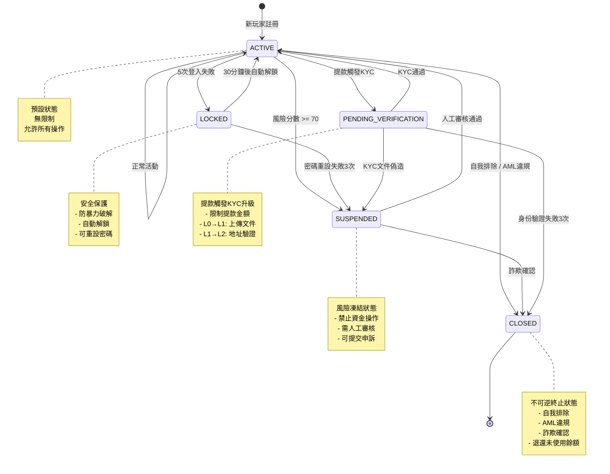
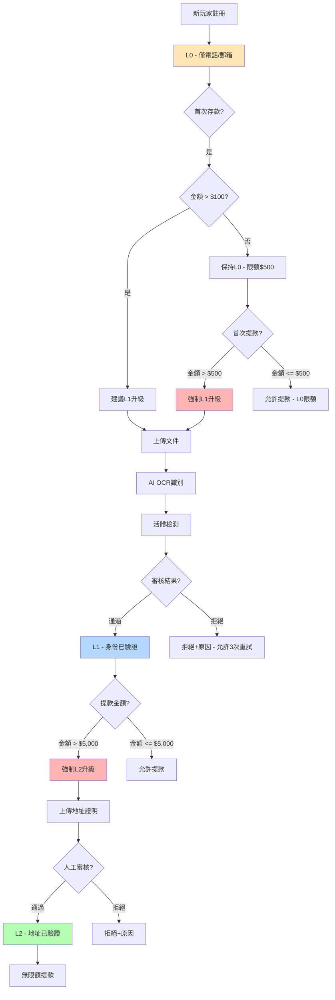
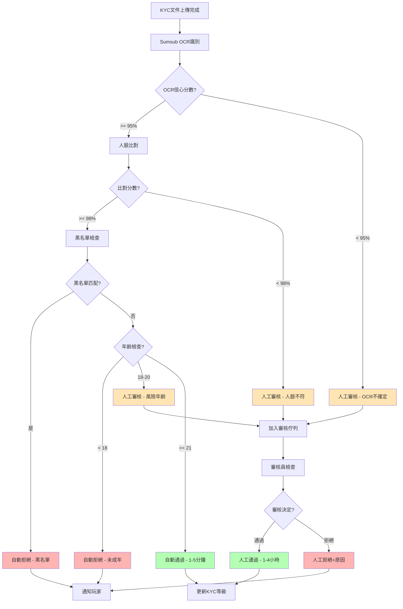

# 玩家生命週期 - 技術實作（Player Lifecycle - Technical Implementation）

> **XREF（交叉引用）**: 完整業務規則定義見 [玩家生命週期業務需求](../../requirements/01_Player_Experience/04_Player_Lifecycle.md)

> **Canonical Source**: [docs/iGaming/source-archive/01_Player_Center/01-01_Player_Lifecycle.md](../../source-archive/01_Player_Center/01-01_Player_Lifecycle.md)
> **目標讀者（Audience）**: 開發人員、DevOps 工程師
> **業務需求（Business Requirements）**: [Player_Lifecycle.md](../../requirements/01_Player_Experience/04_Player_Lifecycle.md)

---

## 文件目的（Document Purpose）

本文件定義 iGaming 平台中**玩家生命週期管理的技術實作**。涵蓋內容包括：
- 狀態機實作（State Machine Implementation）
- API 規格（API Specifications）
- 資料庫架構（Database Schema）
- SmartAdmin 層級映射（SmartAdmin Layer Mapping）
- 程式碼範例與架構模式（Code Examples and Architecture Patterns）

**業務需求**（生命週期階段、KYC 規則、VIP 升級）請參考 [Player_Lifecycle.md](../../requirements/01_Player_Experience/04_Player_Lifecycle.md)。

---

## 1. 狀態機實作（State Machine Implementation）

### 1.1 帳戶狀態狀態機（Account Status State Machine）



### 1.2 KYC 等級映射（KYC Level Mapping）

> **跨模組映射**：玩家域使用 `L0/L1/L2/L3`，租戶/合規域使用 `NONE/BASIC/ENHANCED/FULL`

| 玩家域（Player Domain） | 合規域（Compliance Domain） | 說明 | 提款限額 |
|---|---|---|---|
| `L0` | `NONE` | 僅電話/郵箱 | $500 |
| `L1` | `BASIC` | 身份已驗證（ID + 活體） | $5,000 |
| `L2` | `ENHANCED` | 地址已驗證 | $50,000 |
| `L3` | `FULL` | 資金來源已驗證 | 無限額 |

### 1.3 KYC 升級流程（KYC Upgrade Flow）



### 1.3 KYC 審核決策流程（KYC Review Decision Flow）



---

## 2. 資料庫架構（Database Schema）

### 2.1 Players Table

```sql
CREATE TABLE t_player (
    player_id BIGSERIAL PRIMARY KEY,
    tenant_id INT NOT NULL,
    username VARCHAR(64) NOT NULL,
    password_hash VARCHAR(255) NOT NULL,
    email VARCHAR(255),
    phone_number VARCHAR(32),

    -- Account Status (ACTIVE, LOCKED, SUSPENDED, PENDING_VERIFICATION, CLOSED)
    account_status VARCHAR(32) NOT NULL DEFAULT 'ACTIVE',

    -- Lifecycle Stage (NEW_USER, ACTIVE_USER, DORMANT_USER, CHURNED_USER)
    lifecycle_stage VARCHAR(32),

    -- KYC (L0/L1/L2/L3 映射見下方 KYC 等級映射表)
    current_kyc_level VARCHAR(8) DEFAULT 'L0',
    pending_kyc_level VARCHAR(8),
    kyc_verified_at TIMESTAMP,
    kyc_reject_reason TEXT,
    kyc_retry_count INT DEFAULT 0,
    sumsub_applicant_id VARCHAR(64),

    -- Risk
    risk_score INT DEFAULT 0,
    risk_level VARCHAR(16) DEFAULT 'LOW',
    risk_flags JSONB,

    -- VIP
    vip_tier VARCHAR(16) DEFAULT 'BRONZE',

    -- Device
    device_fingerprint JSONB,

    -- Login Security
    failed_login_attempts INT DEFAULT 0,
    last_failed_login_at TIMESTAMP,
    locked_until TIMESTAMP,
    locked_reason VARCHAR(64),

    -- Suspension
    suspended_at TIMESTAMP,
    suspended_reason VARCHAR(255),

    -- Closure
    closed_at TIMESTAMP,
    closed_reason VARCHAR(64),
    closed_by_user_id BIGINT,

    -- Activity
    last_bet_date TIMESTAMP,

    -- Audit
    created_at TIMESTAMP NOT NULL DEFAULT NOW(),
    updated_at TIMESTAMP NOT NULL DEFAULT NOW(),
    version INT DEFAULT 0,
    deleted INT DEFAULT 0,

    CONSTRAINT uk_players_tenant_username UNIQUE (tenant_id, username),
    CONSTRAINT uk_players_tenant_email UNIQUE (tenant_id, email),
    CONSTRAINT uk_players_tenant_phone UNIQUE (tenant_id, phone_number)
);

CREATE INDEX idx_players_tenant_id ON t_player(tenant_id);
CREATE INDEX idx_players_account_status ON t_player(account_status);
CREATE INDEX idx_players_lifecycle_stage ON t_player(lifecycle_stage);
CREATE INDEX idx_players_risk_level ON t_player(risk_level);
CREATE INDEX idx_players_vip_tier ON t_player(vip_tier);
CREATE INDEX idx_players_last_bet_date ON t_player(last_bet_date);
```

### 2.2 Player Devices Table

```sql
CREATE TABLE t_player_device (
    device_record_id BIGSERIAL PRIMARY KEY,
    player_id BIGINT NOT NULL REFERENCES t_player(player_id),
    tenant_id INT NOT NULL,
    device_id VARCHAR(64) NOT NULL,
    device_fingerprint JSONB,
    first_seen_at TIMESTAMP NOT NULL DEFAULT NOW(),
    last_seen_at TIMESTAMP NOT NULL DEFAULT NOW(),
    login_count INT DEFAULT 1,
    is_trusted BOOLEAN DEFAULT TRUE,
    risk_flags JSONB,
    created_at TIMESTAMP NOT NULL DEFAULT NOW(),
    updated_at TIMESTAMP NOT NULL DEFAULT NOW()
);

CREATE INDEX idx_player_devices_player_id ON t_player_device(player_id);
CREATE INDEX idx_player_devices_device_id ON t_player_device(device_id);
CREATE UNIQUE INDEX idx_player_devices_unique ON t_player_device(player_id, device_id);
```

### 2.3 Player Login Logs Table

```sql
CREATE TABLE t_player_login_log (
    log_id BIGSERIAL PRIMARY KEY,
    player_id BIGINT NOT NULL,
    tenant_id INT NOT NULL,
    action_type VARCHAR(32) NOT NULL,
    ip_address VARCHAR(45),
    country_code VARCHAR(8),
    device_id VARCHAR(64),
    from_status VARCHAR(32),
    to_status VARCHAR(32),
    reason VARCHAR(255),
    created_at TIMESTAMP NOT NULL DEFAULT NOW()
);

CREATE INDEX idx_player_login_logs_player_id ON t_player_login_log(player_id);
CREATE INDEX idx_player_login_logs_created_at ON t_player_login_log(created_at);
```

### 2.4 KYC Verification Tasks Table

```sql
CREATE TABLE t_kyc_verification_task (
    task_id BIGSERIAL PRIMARY KEY,
    player_id BIGINT NOT NULL REFERENCES t_player(player_id),
    tenant_id INT NOT NULL,
    current_level VARCHAR(8) NOT NULL,
    target_level VARCHAR(8) NOT NULL,
    status VARCHAR(16) NOT NULL DEFAULT 'PENDING',
    reviewer_user_id BIGINT,
    review_note TEXT,
    reviewed_at TIMESTAMP,
    expires_at TIMESTAMP,
    created_at TIMESTAMP NOT NULL DEFAULT NOW(),
    updated_at TIMESTAMP NOT NULL DEFAULT NOW()
);

CREATE INDEX idx_kyc_tasks_player_id ON t_kyc_verification_task(player_id);
CREATE INDEX idx_kyc_tasks_status ON t_kyc_verification_task(status);
```

---

## 3. API 規格（API Specifications）

### 3.1 Player Lifecycle API

#### 取得玩家生命週期階段（Get Player Lifecycle Stage）

```
GET /api/player/lifecycle/{playerId}/stage
```

**Response**:
```json
{
  "code": 0,
  "data": {
    "playerId": 12345,
    "username": "player123",
    "lifecycleStage": "ACTIVE_USER",
    "accountStatus": "ACTIVE",
    "kycLevel": "L1",
    "vipTier": "SILVER",
    "riskScore": 25,
    "riskLevel": "LOW",
    "lastBetDate": "2026-02-07T15:30:00",
    "createdAt": "2026-01-15T10:00:00"
  },
  "msg": "success"
}
```

#### 鎖定玩家帳戶（Lock Player Account）

```
POST /api/player/lifecycle/{playerId}/lock?reason=MANUAL_LOCK
```

**Response**:
```json
{
  "code": 0,
  "data": null,
  "msg": "success"
}
```

#### 暫停玩家帳戶（Suspend Player Account）

```
POST /api/player/lifecycle/{playerId}/suspend?reason=HIGH_RISK_SCORE
```

**Response**:
```json
{
  "code": 0,
  "data": null,
  "msg": "success"
}
```

### 3.2 KYC API

#### 建立 KYC 會話（Create KYC Session）

```
POST /api/player/kyc/session
```

**Request**:
```json
{
  "playerId": 12345,
  "targetLevel": "L1"
}
```

**Response**:
```json
{
  "code": 0,
  "data": {
    "sessionUrl": "https://kyc.sumsub.com/idensic/l/#/abc123..."
  },
  "msg": "success"
}
```

#### KYC Webhook (Sumsub 回調)

```
POST /api/webhook/kyc/sumsub
```

**Request** (來自 Sumsub):
```json
{
  "applicantId": "abc123",
  "reviewStatus": "approved",
  "rejectLabels": []
}
```

---

## 4. SmartAdmin 架構映射（SmartAdmin Architecture Mapping）

### 4.1 層級架構概覽（Layer Architecture Overview）

SmartAdmin 嚴格遵循四層架構：

```
Controller Layer
    | (calls)
Service Layer (Business Logic)
    | (single-table queries) OR (calls Manager for complex transactions)
Manager Layer (Transaction Coordination)
    | (calls)
Dao Layer (Data Access - MyBatis Plus)
    | (operates)
Entity Layer (Database Table Mapping)
```

**關鍵約束（ArchUnit 強制執行）**：
- Controller 只能呼叫 Service，不能直接呼叫 Dao/Manager
- Service 可以直接呼叫 Dao（單表 CRUD），需要 Manager 處理交易
- `@Transactional` 僅在 Manager 層，絕不在 Service/Controller
- Service 層使用 `io.vavr.control.Option`，不使用 `java.util.Optional`
- 依賴注入：`@RequiredArgsConstructor` + `private final`，禁止 `@Autowired` 欄位注入

### 4.2 Entity - PlayerEntity

```java
package net.lab1024.sa.business.module.player.domain.entity;

import com.baomidou.mybatisplus.annotation.*;
import com.baomidou.mybatisplus.extension.handlers.JacksonTypeHandler;
import lombok.Data;
import net.lab1024.sa.business.module.player.domain.vo.DeviceFingerprintVO;
import net.lab1024.sa.business.module.player.domain.vo.RiskFlagsVO;

import java.time.LocalDateTime;

/**
 * Player Entity
 *
 * Database Table: t_player
 * SSOT: Player account status authoritative definition
 */
@Data
@TableName(value = "t_player", autoResultMap = true)
public class PlayerEntity {

    @TableId(type = IdType.AUTO)
    private Long playerId;

    private Integer tenantId;
    private String username;
    private String passwordHash;
    private String email;
    private String phoneNumber;

    /**
     * Account Status (ACTIVE, LOCKED, SUSPENDED, PENDING_VERIFICATION, CLOSED)
     */
    private String accountStatus;

    /**
     * Lifecycle Stage (NEW_USER, ACTIVE_USER, DORMANT_USER, CHURNED_USER)
     */
    private String lifecycleStage;

    /**
     * KYC Level (L0, L1, L2)
     */
    private String currentKycLevel;
    private String pendingKycLevel;
    private LocalDateTime kycVerifiedAt;
    private String kycRejectReason;
    private Integer kycRetryCount;
    private String sumsubApplicantId;

    /**
     * Risk Score (0-100)
     */
    private Integer riskScore;
    private String riskLevel;

    @TableField(typeHandler = JacksonTypeHandler.class)
    private RiskFlagsVO riskFlags;

    /**
     * VIP Tier (BRONZE, SILVER, GOLD, PLATINUM, DIAMOND)
     */
    private String vipTier;

    @TableField(typeHandler = JacksonTypeHandler.class)
    private DeviceFingerprintVO deviceFingerprint;

    private Integer failedLoginAttempts;
    private LocalDateTime lastFailedLoginAt;
    private LocalDateTime lockedUntil;
    private String lockedReason;

    private LocalDateTime suspendedAt;
    private String suspendedReason;

    private LocalDateTime closedAt;
    private String closedReason;
    private Long closedByUserId;

    private LocalDateTime lastBetDate;

    private LocalDateTime createdAt;
    private LocalDateTime updatedAt;

    @Version
    private Integer version;

    @TableLogic
    private Integer deleted;
}
```

### 4.3 Manager - PlayerLifecycleManager

```java
package net.lab1024.sa.business.module.player.manager;

import io.vavr.control.Try;
import lombok.RequiredArgsConstructor;
import lombok.extern.slf4j.Slf4j;
import net.lab1024.sa.business.module.player.dao.PlayerDao;
import net.lab1024.sa.business.module.player.dao.PlayerLoginLogDao;
import net.lab1024.sa.business.module.player.domain.entity.PlayerEntity;
import net.lab1024.sa.business.module.player.domain.entity.PlayerLoginLogEntity;
import net.lab1024.sa.business.module.player.domain.event.PlayerStatusChangedEvent;
import net.lab1024.sa.support.redislock.DistributedLock;
import org.springframework.context.ApplicationEventPublisher;
import org.springframework.stereotype.Component;
import org.springframework.transaction.annotation.Transactional;

import java.time.LocalDateTime;
import java.util.concurrent.TimeUnit;

/**
 * Player Lifecycle Manager
 *
 * Responsibility: Complex transaction coordination (status transition + logging + event publishing)
 */
@Slf4j
@Component
@RequiredArgsConstructor
public class PlayerLifecycleManager {

    private final PlayerDao playerDao;
    private final PlayerLoginLogDao playerLoginLogDao;
    private final DistributedLock redisLock;
    private final ApplicationEventPublisher eventPublisher;

    /**
     * Transition account status (transaction guaranteed)
     *
     * @param playerId Player ID
     * @param targetStatus Target status (ACTIVE, LOCKED, SUSPENDED, PENDING_VERIFICATION, CLOSED)
     * @param reason Transition reason
     * @return Try<PlayerEntity> Success returns updated entity, failure returns exception
     */
    @Transactional(rollbackFor = Throwable.class)
    public Try<PlayerEntity> transitionAccountStatus(
        Long playerId,
        String targetStatus,
        String reason
    ) {
        return Try.of(() -> {
            String lockKey = "player:status:transition:" + playerId;

            return redisLock.executeWithLock(lockKey, 5, TimeUnit.SECONDS, () -> {
                // Step 1: Query current status
                PlayerEntity player = playerDao.selectById(playerId);
                if (player == null) {
                    throw new IllegalArgumentException("Player not found: " + playerId);
                }

                String currentStatus = player.getAccountStatus();

                // Step 2: Validate transition legality
                validateStatusTransition(currentStatus, targetStatus);

                // Step 3: Update player status
                player.setAccountStatus(targetStatus);

                switch (targetStatus) {
                    case "LOCKED":
                        player.setLockedUntil(LocalDateTime.now().plusMinutes(30));
                        player.setLockedReason(reason);
                        break;

                    case "SUSPENDED":
                        player.setSuspendedAt(LocalDateTime.now());
                        player.setSuspendedReason(reason);
                        break;

                    case "CLOSED":
                        player.setClosedAt(LocalDateTime.now());
                        player.setClosedReason(reason);
                        break;

                    case "ACTIVE":
                        player.setLockedUntil(null);
                        player.setLockedReason(null);
                        player.setSuspendedAt(null);
                        player.setSuspendedReason(null);
                        player.setFailedLoginAttempts(0);
                        break;
                }

                player.setUpdatedAt(LocalDateTime.now());
                playerDao.updateById(player);

                // Step 4: Record status transition log
                PlayerLoginLogEntity logEntity = new PlayerLoginLogEntity();
                logEntity.setPlayerId(playerId);
                logEntity.setActionType("STATUS_TRANSITION");
                logEntity.setFromStatus(currentStatus);
                logEntity.setToStatus(targetStatus);
                logEntity.setReason(reason);
                logEntity.setCreatedAt(LocalDateTime.now());
                playerLoginLogDao.insert(logEntity);

                // Step 5: Publish event
                eventPublisher.publishEvent(new PlayerStatusChangedEvent(
                    playerId,
                    currentStatus,
                    targetStatus,
                    reason,
                    LocalDateTime.now()
                ));

                log.info("Player status transition success - playerId: {}, {} -> {}, reason: {}",
                    playerId, currentStatus, targetStatus, reason);

                return player;
            });
        });
    }

    /**
     * Validate status transition legality
     */
    private void validateStatusTransition(String currentStatus, String targetStatus) {
        // ACTIVE can transition to any status
        if ("ACTIVE".equals(currentStatus)) {
            return;
        }

        // LOCKED can only transition to ACTIVE or SUSPENDED
        if ("LOCKED".equals(currentStatus)) {
            if (!"ACTIVE".equals(targetStatus) && !"SUSPENDED".equals(targetStatus)) {
                throw new IllegalStateException(
                    String.format("LOCKED status cannot directly transition to %s", targetStatus)
                );
            }
            return;
        }

        // SUSPENDED can only transition to ACTIVE or CLOSED
        if ("SUSPENDED".equals(currentStatus)) {
            if (!"ACTIVE".equals(targetStatus) && !"CLOSED".equals(targetStatus)) {
                throw new IllegalStateException(
                    String.format("SUSPENDED status cannot directly transition to %s", targetStatus)
                );
            }
            return;
        }

        // PENDING_VERIFICATION can transition to ACTIVE, SUSPENDED, CLOSED
        if ("PENDING_VERIFICATION".equals(currentStatus)) {
            if (!"ACTIVE".equals(targetStatus)
                && !"SUSPENDED".equals(targetStatus)
                && !"CLOSED".equals(targetStatus)) {
                throw new IllegalStateException(
                    String.format("PENDING_VERIFICATION cannot directly transition to %s", targetStatus)
                );
            }
            return;
        }

        // CLOSED is terminal state
        if ("CLOSED".equals(currentStatus)) {
            throw new IllegalStateException("CLOSED status cannot transition (terminal state)");
        }
    }

    /**
     * Handle login failure (increment failure count, lock account if necessary)
     *
     * @param playerId Player ID
     * @return Try<Boolean> Whether account was locked
     */
    @Transactional(rollbackFor = Throwable.class)
    public Try<Boolean> handleLoginFailure(Long playerId) {
        return Try.of(() -> {
            String lockKey = "player:login:failure:" + playerId;

            return redisLock.executeWithLock(lockKey, 3, TimeUnit.SECONDS, () -> {
                PlayerEntity player = playerDao.selectById(playerId);
                if (player == null) {
                    throw new IllegalArgumentException("Player not found: " + playerId);
                }

                player.setFailedLoginAttempts(player.getFailedLoginAttempts() + 1);
                player.setLastFailedLoginAt(LocalDateTime.now());
                playerDao.updateById(player);

                if (player.getFailedLoginAttempts() >= 5
                    && player.getLastFailedLoginAt().isAfter(LocalDateTime.now().minusMinutes(5))) {

                    transitionAccountStatus(playerId, "LOCKED", "CONSECUTIVE_LOGIN_FAILURES");

                    log.warn("Player account locked - playerId: {}, failedAttempts: {}",
                        playerId, player.getFailedLoginAttempts());

                    return true;
                }

                return false;
            });
        });
    }
}
```

### 4.4 Service - PlayerLifecycleService

```java
package net.lab1024.sa.business.module.player.service;

import io.vavr.control.Option;
import io.vavr.control.Try;
import lombok.RequiredArgsConstructor;
import lombok.extern.slf4j.Slf4j;
import net.lab1024.sa.business.module.player.dao.PlayerDao;
import net.lab1024.sa.business.module.player.domain.entity.PlayerEntity;
import net.lab1024.sa.business.module.player.domain.vo.PlayerLifecycleStageVO;
import net.lab1024.sa.business.module.player.manager.PlayerLifecycleManager;
import org.springframework.stereotype.Service;

import java.time.LocalDateTime;
import java.time.temporal.ChronoUnit;

/**
 * Player Lifecycle Service
 *
 * Responsibility: Business logic processing (no transactions)
 */
@Slf4j
@Service
@RequiredArgsConstructor
public class PlayerLifecycleService {

    private final PlayerDao playerDao;
    private final PlayerLifecycleManager playerLifecycleManager;

    /**
     * Query player lifecycle stage
     *
     * @param playerId Player ID
     * @return Option<PlayerLifecycleStageVO> Player lifecycle info (using Vavr Option)
     */
    public Option<PlayerLifecycleStageVO> getPlayerLifecycleStage(Long playerId) {
        return playerDao.findById(playerId)
            .map(player -> {
                String stage = calculateLifecycleStage(player);

                PlayerLifecycleStageVO vo = new PlayerLifecycleStageVO();
                vo.setPlayerId(player.getPlayerId());
                vo.setUsername(player.getUsername());
                vo.setLifecycleStage(stage);
                vo.setAccountStatus(player.getAccountStatus());
                vo.setKycLevel(player.getCurrentKycLevel());
                vo.setVipTier(player.getVipTier());
                vo.setRiskScore(player.getRiskScore());
                vo.setRiskLevel(player.getRiskLevel());
                vo.setLastBetDate(player.getLastBetDate());
                vo.setCreatedAt(player.getCreatedAt());

                return vo;
            });
    }

    /**
     * Calculate lifecycle stage
     */
    private String calculateLifecycleStage(PlayerEntity player) {
        LocalDateTime now = LocalDateTime.now();
        LocalDateTime createdAt = player.getCreatedAt();
        LocalDateTime lastBetDate = player.getLastBetDate();

        // Rule 1: Within 7 days of registration -> NEW_USER
        long daysSinceRegistration = ChronoUnit.DAYS.between(createdAt, now);
        if (daysSinceRegistration <= 7) {
            return "NEW_USER";
        }

        // Rule 2: Bet within last 30 days -> ACTIVE_USER
        if (lastBetDate != null) {
            long daysSinceLastBet = ChronoUnit.DAYS.between(lastBetDate, now);

            if (daysSinceLastBet <= 30) {
                return "ACTIVE_USER";
            }

            // Rule 3: No bet for 30-90 days -> DORMANT_USER
            if (daysSinceLastBet <= 90) {
                return "DORMANT_USER";
            }

            // Rule 4: No bet for 90+ days -> CHURNED_USER
            return "CHURNED_USER";
        }

        // Never bet and registered > 7 days -> CHURNED_USER
        return "CHURNED_USER";
    }

    /**
     * Check if account can login
     *
     * @param playerId Player ID
     * @return Try<Boolean> True if can login, false + reason if not
     */
    public Try<Boolean> canLogin(Long playerId) {
        return Try.of(() ->
            playerDao.findById(playerId)
                .map(player -> {
                    String status = player.getAccountStatus();

                    if ("CLOSED".equals(status)) {
                        throw new IllegalStateException("Account is closed");
                    }

                    if ("SUSPENDED".equals(status)) {
                        throw new IllegalStateException("Account is suspended, please contact support");
                    }

                    if ("LOCKED".equals(status)) {
                        LocalDateTime lockedUntil = player.getLockedUntil();
                        if (lockedUntil != null && lockedUntil.isAfter(LocalDateTime.now())) {
                            long minutesLeft = ChronoUnit.MINUTES.between(LocalDateTime.now(), lockedUntil);
                            throw new IllegalStateException(
                                String.format("Account is locked, please try again in %d minutes or reset password", minutesLeft)
                            );
                        }

                        // Lock time passed -> auto unlock (delegate to Manager)
                        playerLifecycleManager.transitionAccountStatus(playerId, "ACTIVE", "AUTO_UNLOCK");
                    }

                    // PENDING_VERIFICATION -> can login but limited features
                    // ACTIVE -> normal login
                    return true;
                })
                .getOrElseThrow(() -> new IllegalArgumentException("Player not found"))
        );
    }

    /**
     * Lock player account (for risk control)
     */
    public Try<Void> lockPlayer(Long playerId, String reason) {
        return playerLifecycleManager.transitionAccountStatus(playerId, "LOCKED", reason)
            .map(player -> null);
    }

    /**
     * Suspend player account (for risk control)
     */
    public Try<Void> suspendPlayer(Long playerId, String reason) {
        return playerLifecycleManager.transitionAccountStatus(playerId, "SUSPENDED", reason)
            .map(player -> null);
    }
}
```

### 4.5 Controller - PlayerLifecycleController

```java
package net.lab1024.sa.business.module.player.controller;

import io.swagger.v3.oas.annotations.Operation;
import io.swagger.v3.oas.annotations.tags.Tag;
import lombok.RequiredArgsConstructor;
import net.lab1024.sa.business.module.player.service.PlayerLifecycleService;
import net.lab1024.sa.common.core.domain.response.ResponseDTO;
import org.springframework.web.bind.annotation.*;

/**
 * Player Lifecycle Controller
 */
@RestController
@RequestMapping("/api/player/lifecycle")
@RequiredArgsConstructor
@Tag(name = "Player Lifecycle Management")
public class PlayerLifecycleController {

    private final PlayerLifecycleService playerLifecycleService;

    /**
     * Query player lifecycle stage
     */
    @GetMapping("/{playerId}/stage")
    @Operation(summary = "Query player lifecycle stage")
    public ResponseDTO<?> getLifecycleStage(@PathVariable Long playerId) {
        return playerLifecycleService.getPlayerLifecycleStage(playerId)
            .map(ResponseDTO::ok)
            .getOrElse(ResponseDTO.error("Player not found"));
    }

    /**
     * Lock player account (admin portal)
     */
    @PostMapping("/{playerId}/lock")
    @Operation(summary = "Lock player account")
    public ResponseDTO<?> lockPlayer(
        @PathVariable Long playerId,
        @RequestParam String reason
    ) {
        return playerLifecycleService.lockPlayer(playerId, reason)
            .map(v -> ResponseDTO.ok())
            .getOrElse(ResponseDTO.error("Lock failed"));
    }

    /**
     * Suspend player account (risk control)
     */
    @PostMapping("/{playerId}/suspend")
    @Operation(summary = "Suspend player account")
    public ResponseDTO<?> suspendPlayer(
        @PathVariable Long playerId,
        @RequestParam String reason
    ) {
        return playerLifecycleService.suspendPlayer(playerId, reason)
            .map(v -> ResponseDTO.ok())
            .getOrElse(ResponseDTO.error("Suspend failed"));
    }
}
```

### 4.6 基礎模組依賴（Foundation Module Dependencies）

| 基礎模組（Foundation Module） | 用途（Usage） | 呼叫位置（Call Location） |
|------------------|-------|---------------|
| **support.redis-lock** | 防止並發狀態轉換（分散式鎖） | Manager `transitionAccountStatus()` |
| **support.mq** | 發布狀態變更事件（Kafka） | Manager `PlayerStatusChangedEvent` |
| **support.cache** | 快取玩家生命週期階段（Redis） | Service `getPlayerLifecycleStage()` |
| **support.audit-log** | 記錄狀態轉換審計日誌 | Manager `PlayerLoginLogEntity` |

---

## 5. KYC 整合（KYC Integration）

### 5.1 Sumsub 整合

#### KycVerificationManager（交易層，Transaction Layer）

```java
package net.lab1024.sa.business.module.player.manager;

import io.vavr.control.Try;
import lombok.RequiredArgsConstructor;
import lombok.extern.slf4j.Slf4j;
import net.lab1024.sa.business.module.player.dao.PlayerDao;
import net.lab1024.sa.business.module.player.domain.entity.PlayerEntity;
import net.lab1024.sa.business.module.player.domain.event.PlayerKycCompletedEvent;
import org.springframework.context.ApplicationEventPublisher;
import org.springframework.stereotype.Component;
import org.springframework.transaction.annotation.Transactional;

import java.time.LocalDateTime;
import java.util.stream.Collectors;

/**
 * KYC Verification Manager
 *
 * Responsibility: Handle KYC webhook processing with transaction coordination
 */
@Slf4j
@Component
@RequiredArgsConstructor
public class KycVerificationManager {

    private final PlayerDao playerDao;
    private final ApplicationEventPublisher eventPublisher;

    /**
     * Handle Sumsub KYC webhook (transaction guaranteed)
     *
     * @param applicantId Sumsub applicant ID
     * @param reviewStatus Review status (approved/rejected)
     * @param rejectLabels Rejection reasons (if rejected)
     * @return Try<Void> Success or failure
     */
    @Transactional(rollbackFor = Throwable.class)
    public Try<Void> handleKycWebhook(
        String applicantId,
        String reviewStatus,
        List<RejectLabel> rejectLabels
    ) {
        return Try.of(() -> {
            playerDao.findBySumsubApplicantId(applicantId)
                .forEach(player -> {
                    if ("approved".equals(reviewStatus)) {
                        String newLevel = player.getPendingKycLevel();
                        player.setCurrentKycLevel(newLevel);
                        player.setAccountStatus("ACTIVE");
                        player.setKycVerifiedAt(LocalDateTime.now());

                        playerDao.updateById(player);

                        eventPublisher.publishEvent(new PlayerKycCompletedEvent(
                            player.getPlayerId(),
                            newLevel,
                            LocalDateTime.now()
                        ));

                        log.info("KYC approved - playerId: {}, newLevel: {}",
                            player.getPlayerId(), newLevel);

                    } else if ("rejected".equals(reviewStatus)) {
                        String rejectReason = rejectLabels.stream()
                            .map(RejectLabel::getLabel)
                            .collect(Collectors.joining(", "));

                        player.setKycRejectReason(rejectReason);
                        player.setKycRetryCount(player.getKycRetryCount() + 1);

                        playerDao.updateById(player);

                        if (player.getKycRetryCount() >= 3) {
                            player.setAccountStatus("SUSPENDED");
                            player.setSuspendedReason("KYC_FAILED_3_TIMES");
                            playerDao.updateById(player);

                            log.warn("Player suspended - KYC failed 3 times - playerId: {}",
                                player.getPlayerId());
                        }
                    }
                });

            return null;
        });
    }
}
```

#### KycVerificationService（業務邏輯層，Business Logic Layer）

```java
package net.lab1024.sa.business.module.player.service;

import io.vavr.control.Option;
import lombok.RequiredArgsConstructor;
import lombok.extern.slf4j.Slf4j;
import net.lab1024.sa.business.module.player.dao.PlayerDao;
import net.lab1024.sa.business.module.player.manager.KycVerificationManager;
import org.springframework.stereotype.Service;

/**
 * KYC Verification Service
 *
 * Responsibility: Business logic processing (no transactions)
 */
@Slf4j
@Service
@RequiredArgsConstructor
public class KycVerificationService {

    private final SumsubApiClient sumsubClient;
    private final PlayerDao playerDao;
    private final KycVerificationManager kycVerificationManager;

    /**
     * Create KYC verification session
     *
     * @param playerId Player ID
     * @param targetLevel Target KYC level (L1 or L2)
     * @return Sumsub session URL (player redirects to upload documents)
     */
    public Option<String> createKycSession(Long playerId, String targetLevel) {
        return playerDao.findById(playerId)
            .flatMap(player -> {
                ApplicantRequest request = ApplicantRequest.builder()
                    .externalUserId(player.getPlayerId().toString())
                    .email(player.getEmail())
                    .phone(player.getPhoneNumber())
                    .build();

                return sumsubClient.createApplicant(request)
                    .map(applicant -> {
                        String sessionUrl = sumsubClient.generateAccessToken(
                            applicant.getId(),
                            targetLevel.equals("L1") ? "basic-kyc" : "advanced-kyc"
                        );

                        player.setPendingKycLevel(targetLevel);
                        player.setSumsubApplicantId(applicant.getId());
                        playerDao.updateById(player);

                        return sessionUrl;
                    });
            });
    }

    /**
     * Webhook: Receive Sumsub review result (delegates to Manager)
     */
    public void handleKycWebhook(SumsubWebhookPayload webhookPayload) {
        kycVerificationManager.handleKycWebhook(
            webhookPayload.getApplicantId(),
            webhookPayload.getReviewStatus(),
            webhookPayload.getRejectLabels()
        );
    }
}
```

### 5.2 設備指紋採集（Device Fingerprint Collection）

**前端 JavaScript SDK** (FingerprintJS Pro):

```javascript
import FingerprintJS from '@fingerprintjs/fingerprintjs-pro'

const fpPromise = FingerprintJS.load({
  apiKey: 'YOUR_PUBLIC_API_KEY',
  region: 'ap',
  endpoint: 'https://fp.yourdomain.com'
})

fpPromise
  .then(fp => fp.get())
  .then(result => {
    const deviceId = result.visitorId;
    const confidence = result.confidence.score;

    fetch('/api/player/register', {
      method: 'POST',
      headers: { 'Content-Type': 'application/json' },
      body: JSON.stringify({
        username: 'player123',
        password: '...',
        deviceId: deviceId,
        deviceFingerprint: {
          confidence: confidence,
          ip: result.ip,
          ipLocation: result.ipLocation,
          browserName: result.browserName,
          browserVersion: result.browserVersion,
          os: result.os,
          osVersion: result.osVersion,
          device: result.device,
          incognito: result.incognito,
          vpn: result.vpnDetection.result,
          proxy: result.proxyDetection.result,
          emulator: result.emulatorDetection.result,
          tampered: result.tamperDetection.result
        }
      })
    });
  });
```

---

## 6. ArchUnit 架構測試（ArchUnit Architecture Tests）

```java
package net.lab1024.sa.app.architecture;

import com.tngtech.archunit.core.domain.JavaClasses;
import com.tngtech.archunit.core.importer.ClassFileImporter;
import com.tngtech.archunit.lang.ArchRule;
import org.junit.jupiter.api.Test;
import org.springframework.transaction.annotation.Transactional;

import static com.tngtech.archunit.lang.syntax.ArchRuleDefinition.*;
import static com.tngtech.archunit.library.Architectures.layeredArchitecture;

/**
 * Player Lifecycle Module Architecture Tests
 *
 * Validates SmartAdmin architecture rules
 */
class PlayerLifecycleArchitectureTest {

    private final JavaClasses importedClasses = new ClassFileImporter()
        .importPackages("net.lab1024.sa.business.module.player");

    @Test
    void controllersShouldNotAccessDaoDirectly() {
        ArchRule rule = noClasses()
            .that().resideInAPackage("..controller..")
            .should().dependOnClassesThat().resideInAPackage("..dao..");

        rule.check(importedClasses);
    }

    @Test
    void transactionalOnlyInManager() {
        ArchRule rule = methods()
            .that().areAnnotatedWith(Transactional.class)
            .should().beDeclaredInClassesThat().resideInAPackage("..manager..");

        rule.check(importedClasses);
    }

    @Test
    void serviceShouldUseVavrOption() {
        ArchRule rule = noClasses()
            .that().resideInAPackage("..service..")
            .should().dependOnClassesThat().haveFullyQualifiedName("java.util.Optional");

        rule.check(importedClasses);
    }

    @Test
    void layeredArchitecture() {
        layeredArchitecture()
            .consideringAllDependencies()
            .layer("Controller").definedBy("..controller..")
            .layer("Service").definedBy("..service..")
            .layer("Manager").definedBy("..manager..")
            .layer("Dao").definedBy("..dao..")

            .whereLayer("Controller").mayNotBeAccessedByAnyLayer()
            .whereLayer("Service").mayOnlyBeAccessedByLayers("Controller", "Manager")
            .whereLayer("Manager").mayOnlyBeAccessedByLayers("Service")
            .whereLayer("Dao").mayOnlyBeAccessedByLayers("Service", "Manager")

            .check(importedClasses);
    }
}
```

---

## 7. 恢復路徑實作（Recovery Path Implementations）

### 7.1 LOCKED → ACTIVE（自動解鎖，Auto-Unlock）

**恢復路徑 1：基於時間的自動解鎖（Time-based Auto-Unlock）**

```sql
-- Cron Job: Execute every 5 minutes
UPDATE t_player
SET account_status = 'ACTIVE',
    locked_until = NULL,
    failed_login_attempts = 0,
    updated_at = NOW()
WHERE account_status = 'LOCKED'
  AND locked_until <= NOW();
```

**恢復路徑 2：密碼重設流程（Password Reset Flow）**

```java
package net.lab1024.sa.business.module.player.manager;

import io.vavr.control.Try;
import lombok.RequiredArgsConstructor;
import lombok.extern.slf4j.Slf4j;
import net.lab1024.sa.business.module.player.dao.PlayerDao;
import org.springframework.stereotype.Component;
import org.springframework.transaction.annotation.Transactional;

/**
 * Password Reset Manager
 *
 * Responsibility: Handle password reset with account unlock (transaction coordination)
 */
@Slf4j
@Component
@RequiredArgsConstructor
public class PasswordResetManager {

    private final PlayerDao playerDao;

    @Transactional(rollbackFor = Throwable.class)
    public Try<Void> resetPasswordAndUnlock(String email, String newPasswordHash) {
        return playerDao.findByEmail(email)
            .map(player -> {
                player.setPasswordHash(newPasswordHash);

                if ("LOCKED".equals(player.getAccountStatus())) {
                    player.setAccountStatus("ACTIVE");
                    player.setLockedUntil(null);
                    player.setFailedLoginAttempts(0);
                }

                playerDao.updateById(player);
                return null;
            })
            .toTry(() -> new PlayerNotFoundException("Player not found"));
    }
}
```

```java
package net.lab1024.sa.business.module.player.service;

import io.vavr.control.Try;
import lombok.RequiredArgsConstructor;
import net.lab1024.sa.business.module.player.manager.PasswordResetManager;
import org.springframework.stereotype.Service;

/**
 * Password Reset Service
 *
 * Responsibility: Business logic for password reset flow
 */
@Service
@RequiredArgsConstructor
public class PasswordResetService {

    private final PasswordResetManager passwordResetManager;
    private final OtpService otpService;

    public Try<Void> resetPasswordAndUnlock(String email, String otp, String newPassword) {
        return otpService.verifyOtp(email, otp)
            .flatMap(isValid -> {
                if (!isValid) {
                    return Try.failure(new InvalidOtpException("OTP verification failed"));
                }

                String passwordHash = BCrypt.hashpw(newPassword, BCrypt.gensalt());
                return passwordResetManager.resetPasswordAndUnlock(email, passwordHash);
            });
    }
}
```

### 7.2 SUSPENDED → ACTIVE（人工審核，Manual Review）

```java
package net.lab1024.sa.business.module.player.manager;

import io.vavr.control.Try;
import lombok.RequiredArgsConstructor;
import lombok.extern.slf4j.Slf4j;
import net.lab1024.sa.business.module.player.dao.AppealDao;
import net.lab1024.sa.business.module.player.dao.PlayerDao;
import org.springframework.stereotype.Component;
import org.springframework.transaction.annotation.Transactional;

import java.time.LocalDateTime;

/**
 * Appeal Manager
 *
 * Responsibility: Handle appeal approval with account status restoration (transaction coordination)
 */
@Slf4j
@Component
@RequiredArgsConstructor
public class AppealManager {

    private final PlayerDao playerDao;
    private final AppealDao appealDao;

    @Transactional(rollbackFor = Throwable.class)
    public Try<Void> approveAppeal(Long appealId, Long reviewerUserId, String reviewNote) {
        return appealDao.findById(appealId)
            .flatMap(appeal -> {
                appeal.setStatus("APPROVED");
                appeal.setReviewerUserId(reviewerUserId);
                appeal.setReviewNote(reviewNote);
                appeal.setReviewedAt(LocalDateTime.now());
                appealDao.updateById(appeal);

                return playerDao.findById(appeal.getPlayerId())
                    .map(player -> {
                        player.setAccountStatus("ACTIVE");
                        player.setSuspendedAt(null);
                        player.setSuspendedReason(null);
                        playerDao.updateById(player);

                        log.info("Appeal approved - playerId: {}, appealId: {}, reviewer: {}",
                            player.getPlayerId(), appealId, reviewerUserId);

                        return null;
                    })
                    .toTry(() -> new PlayerNotFoundException("Player not found"));
            })
            .toTry(() -> new AppealNotFoundException("Appeal not found"));
    }
}
```

### 7.3 CLOSED → 無恢復（No Recovery）

**不可逆狀態**：CLOSED 狀態無法恢復。玩家必須重新註冊（使用不同的電子郵件/電話）。

**例外情況**：
- **誤操作（Mistaken Operation）**：系統錯誤或客服失誤 - 需直接修改資料庫（需要主管批准）
- **自我排除到期（Self-Exclusion Expiry）**：如果玩家設定了冷靜期（例如 180 天），到期後可申請重新開通

```sql
-- Reopen account (requires executive approval)
UPDATE t_player
SET account_status = 'ACTIVE',
    closed_at = NULL,
    closed_reason = NULL,
    reopened_at = NOW(),
    reopened_by_user_id = ?
WHERE player_id = ?
  AND account_status = 'CLOSED'
  AND closed_reason = 'SELF_EXCLUSION'
  AND closed_at <= NOW() - INTERVAL '180 DAY';
```

---

## 8. 相關文件（Related Documents）

### 技術文件（Technical Documents）
- Risk Control Framework
- Unified Wallet Model
- Multi-Tenant Architecture

### 業務文件（Business Documents）
- [Player_Lifecycle.md](../../requirements/01_Player_Experience/04_Player_Lifecycle.md) - 業務需求視圖

---

**文件版本（Document Version）**: 1.0.0
**建立日期（Created Date）**: 2026-02-08
**最後更新（Last Updated）**: 2026-02-08
**維護者（Maintainers）**: Player Center Team & Backend Team

**變更歷史（Change History）**:
- 1.0.0 (2026-02-08): Initial version - Split from source document (technical architecture view)
