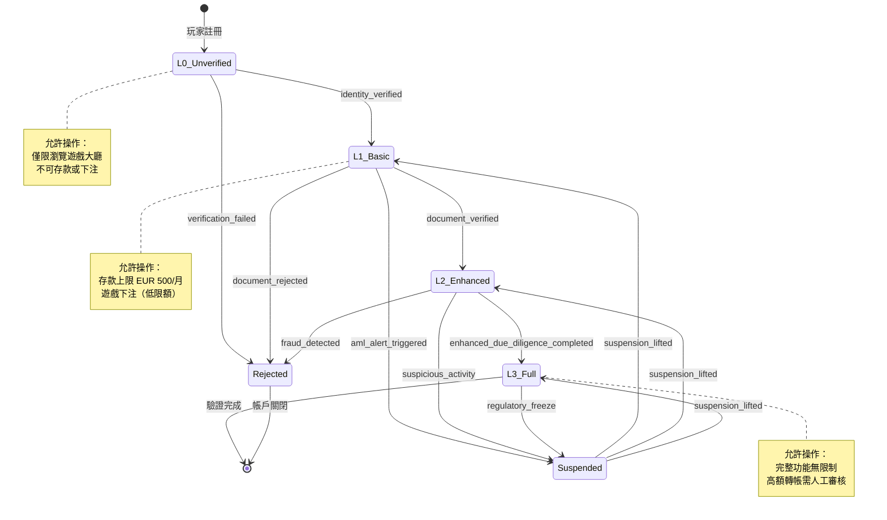
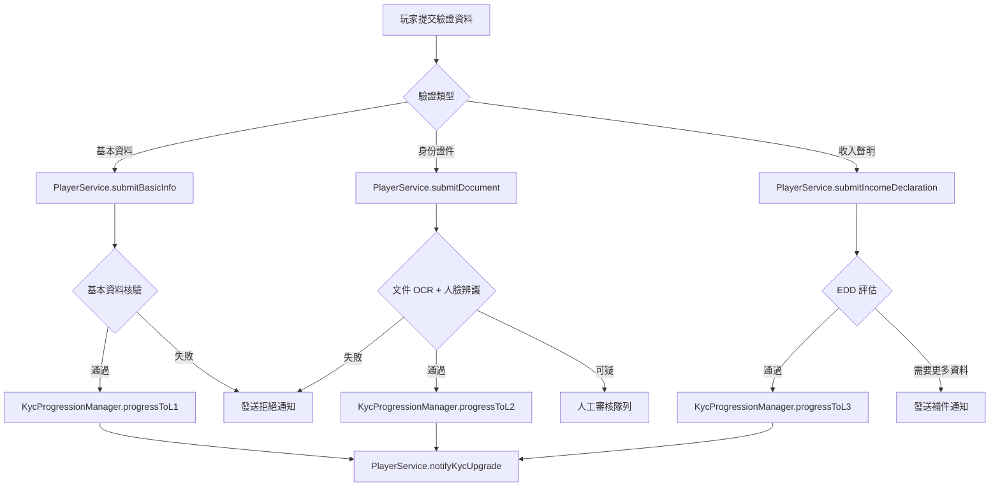

# KYC 進度狀態機架構（KYC Progression State Machine Architecture）

> **XREF（交叉引用）**: 業務需求詳見 [KYC/AML 需求](../../requirements/05_Risk_Compliance/03_KYC_AML_Requirements.md)
> **目標讀者**: 系統架構師、後端開發人員
> **最後更新**: 2026-04-02

---

## 1. 概述

身份驗證 (KYC, Know Your Customer) 進度狀態機採用分層框架，將驗證等級分為 L0 至 L3 四個層次，符合 FATF（金融行動工作組）R.10 客戶盡職調查（CDD, Customer Due Diligence）義務要求。

| 等級 | 名稱 | 描述 |
|------|------|------|
| L0 | 未驗證 | 玩家剛完成帳戶註冊，尚未提交任何身份文件 |
| L1 | 基本驗證 | 已完成姓名、出生日期、地址基本資料核驗 |
| L2 | 增強驗證 | 已提交政府核發身份證件並完成照片比對 |
| L3 | 完整驗證 | 已完成收入來源聲明（SoF）及增強盡職調查（EDD） |

系統採用單向遞進模型：等級只能升級，不能降級（除非觸發合規暫停事件）。各等級之間的轉換由特定業務事件觸發，並在 Manager 層以 `@Transactional` 原子化執行。

---

## 2. 狀態機圖



---

## 3. KYC 等級功能對應表

| 功能 | L0 未驗證 | L1 基本驗證 | L2 增強驗證 | L3 完整驗證 |
|------|-----------|-------------|-------------|-------------|
| 瀏覽遊戲大廳 | ✅ | ✅ | ✅ | ✅ |
| 免費試玩 | ✅ | ✅ | ✅ | ✅ |
| 存款（單次） | ❌ | EUR 200 | EUR 2,000 | 無上限 |
| 存款（月累計） | ❌ | EUR 500 | EUR 5,000 | 無上限 |
| 真錢下注 | ❌ | ✅（低限） | ✅（中限） | ✅（無限） |
| 提款 | ❌ | EUR 500/月 | EUR 5,000/月 | 無上限 |
| 高額轉帳（> EUR 10,000） | ❌ | ❌ | ❌ | ✅（人工審核） |
| VIP 升級 | ❌ | ❌ | ✅ | ✅ |
| 參與促銷活動 | ❌ | ✅（限定） | ✅ | ✅ |

---

## 4. KycProgressionManager 實作

```java
/**
 * KYC 等級升級管理器
 * 所有等級升級操作必須在 Manager 層以 @Transactional 執行，確保原子性
 */
@Component
@RequiredArgsConstructor
public class KycProgressionManager {

    private final KycVerificationDao kycVerificationDao;
    private final PlayerDao playerDao;
    private final KycAuditLogDao kycAuditLogDao;

    /**
     * 升級至 L1 基本驗證
     * 觸發條件：identity_verified（基本資料核驗通過）
     */
    @Transactional(rollbackFor = Throwable.class)
    public Option<KycVerificationVO> progressToL1(Long playerId, KycL1Form form) {
        // 1. 確認玩家存在且當前為 L0
        Option<PlayerEntity> playerOpt = Option.of(playerDao.selectById(playerId));
        if (playerOpt.isEmpty()) {
            return Option.none();
        }
        PlayerEntity player = playerOpt.get();
        if (player.getKycLevel() != KycLevel.L0) {
            return Option.none();
        }

        // 2. 建立驗證記錄
        KycVerificationEntity verification = new KycVerificationEntity();
        verification.setPlayerId(playerId);
        verification.setKycLevel(KycLevel.L1);
        verification.setVerifiedAt(LocalDateTime.now());
        verification.setVerificationData(form.toJsonString());
        verification.setDeleted(false);
        kycVerificationDao.insert(verification);

        // 3. 更新玩家 KYC 等級
        playerDao.updateKycLevel(playerId, KycLevel.L1);

        // 4. 記錄審計日誌（FATF R.11 要求）
        kycAuditLogDao.insertProgressionLog(playerId, KycLevel.L0, KycLevel.L1, "identity_verified");

        return Option.of(SmartBeanUtil.copy(verification, KycVerificationVO.class));
    }

    /**
     * 升級至 L2 增強驗證
     * 觸發條件：document_verified（證件核驗通過）
     */
    @Transactional(rollbackFor = Throwable.class)
    public Option<KycVerificationVO> progressToL2(Long playerId, KycL2Form form) {
        Option<PlayerEntity> playerOpt = Option.of(playerDao.selectById(playerId));
        if (playerOpt.isEmpty() || playerOpt.get().getKycLevel() != KycLevel.L1) {
            return Option.none();
        }

        KycVerificationEntity verification = new KycVerificationEntity();
        verification.setPlayerId(playerId);
        verification.setKycLevel(KycLevel.L2);
        verification.setDocumentType(form.getDocumentType());
        verification.setDocumentReference(form.getDocumentReference());
        verification.setVerifiedAt(LocalDateTime.now());
        verification.setDeleted(false);
        kycVerificationDao.insert(verification);

        playerDao.updateKycLevel(playerId, KycLevel.L2);
        kycAuditLogDao.insertProgressionLog(playerId, KycLevel.L1, KycLevel.L2, "document_verified");

        return Option.of(SmartBeanUtil.copy(verification, KycVerificationVO.class));
    }

    /**
     * 觸發合規暫停
     * 觸發條件：aml_alert_triggered / suspicious_activity / regulatory_freeze
     */
    @Transactional(rollbackFor = Throwable.class)
    public Option<KycSuspensionVO> suspendForCompliance(Long playerId, String reason) {
        playerDao.updateKycStatus(playerId, KycStatus.SUSPENDED);
        kycAuditLogDao.insertSuspensionLog(playerId, reason, LocalDateTime.now());
        return Option.of(new KycSuspensionVO(playerId, KycStatus.SUSPENDED, reason));
    }
}
```

---

## 5. 驗證事件觸發規則



---

## 6. 合規要求對應

| FATF 規則 | 要求描述 | 系統實作 |
|-----------|---------|---------|
| R.10 CDD | 建立並驗證客戶身份 | L1 基本驗證流程 |
| R.10 CDD | 核驗客戶身份至合理程度 | L2 文件核驗 + 人臉辨識 |
| R.11 記錄保存 | 保存 CDD 文件至少 5 年 | `kycAuditLogDao` 持久化審計日誌 |
| R.12 政治公眾人物 | 對 PEP 適用增強盡職調查 | L2 → L3 PEP 篩查整合 |
| R.20 可疑交易報告 | 識別並申報可疑活動 | `suspendForCompliance` + 合規報告 |
| MGA CLP | 發牌條件合規要求 | KycStatus 與帳戶功能閘道整合 |
| UKGC LCCP | 客戶盡職調查規範 | L2 Enhanced Due Diligence 流程 |

---

## 7. 相關文件 XREF

- **業務需求**: [KYC/AML 需求](../../requirements/05_Risk_Compliance/03_KYC_AML_Requirements.md)
- **帳戶生命週期**: [帳戶生命週期管理](03_Account_Lifecycle_Management.md)
- **玩家生命週期實作**: [玩家生命週期實作](01_Player_Lifecycle_Implementation.md)
- **風險引擎架構**: [Risk Engine 架構](../05_Risk_Engine/)
- **反洗錢 (AML) 監控**: [AML 監控架構](../05_Risk_Engine/)
